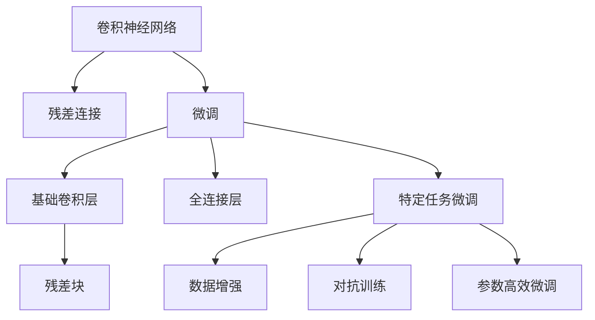
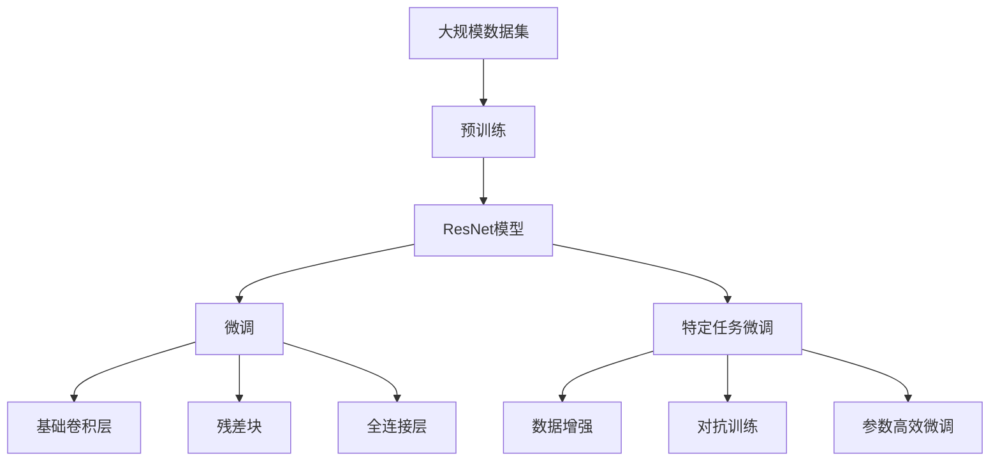

                 

# 从零开始大模型开发与微调：ResNet残差模块的实现

> 关键词：大模型,ResNet残差模块,深度学习,卷积神经网络,微调

## 1. 背景介绍

### 1.1 问题由来
深度学习技术的迅猛发展，尤其是在图像识别、自然语言处理等领域取得了突破性的成果。这些成就的背后，离不开深度学习模型的不断演进和优化。其中，卷积神经网络(Convolutional Neural Network, CNN)是最具代表性的深度学习模型之一。它通过卷积层、池化层、全连接层等结构，有效提取输入数据的特征，从而实现高精度的图像分类、目标检测等任务。

然而，随着任务复杂度的增加，传统卷积神经网络的深度逐渐加深，难以避免梯度消失和梯度爆炸等问题，导致模型训练困难、过拟合风险增加。为应对这些问题，ResNet（Residual Network）作为一种深度残差网络应运而生，通过残差连接机制，解决了深度网络的退化问题，极大地提高了模型的稳定性和训练效率。

本文聚焦于ResNet残差模块的实现和微调，从零开始构建深度学习模型，深入理解其原理和应用。希望通过本文的学习，读者能够掌握从基础卷积神经网络到ResNet模型的开发与微调，进而应用到实际项目中。

### 1.2 问题核心关键点
本文将围绕以下几个核心关键点展开：

- 基础卷积神经网络的构建和优化。
- ResNet残差模块的实现和原理。
- ResNet模型的微调过程与技巧。

### 1.3 问题研究意义
掌握ResNet模型的开发与微调方法，对于提升深度学习模型的性能和泛化能力，解决复杂图像识别、目标检测等任务具有重要意义：

1. 提高模型准确度：通过微调ResNet模型，可以显著提升其在特定任务上的表现，使其更贴近实际应用场景。
2. 减少训练时间：微调过程相比从头训练，模型参数较少，训练时间更短。
3. 提升泛化能力：微调模型能够更好地适应新数据和新场景，降低过拟合风险。
4. 应用广泛：ResNet模型在图像识别、目标检测、自动驾驶等领域广泛应用，微调方法为其落地提供了技术保障。
5. 促进创新：微调技术推动了深度学习模型的不断进化，催生了更多的研究灵感和技术突破。

## 2. 核心概念与联系

### 2.1 核心概念概述

为更好地理解ResNet模型的实现和微调方法，本节将介绍几个关键概念：

- **卷积神经网络**（Convolutional Neural Network, CNN）：一种基于卷积运算和池化运算的深度神经网络，主要用于图像和视频等高维数据。
- **残差连接**（Residual Connection）：一种用于深度网络防止梯度消失和退化的方法，通过将网络层与上一层输出相加，使得网络层学习残差而非全差，从而解决深度网络的退化问题。
- **微调**（Fine-Tuning）：在已有模型的基础上，通过使用新数据对模型进行再训练，以适应特定任务。微调能够提升模型在新数据上的性能，同时保留原有模型的知识。

### 2.2 概念间的关系

这些核心概念之间的逻辑关系可以通过以下Mermaid流程图来展示：



这个流程图展示了从卷积神经网络到ResNet模型，再到微调的基本过程：

1. 卷积神经网络通过卷积和池化操作提取特征，搭建多层次的特征映射。
2. ResNet通过残差连接机制，解决深度网络的退化问题。
3. 微调过程通过有监督学习，提升模型在新任务上的表现，同时保留预训练知识。
4. 基础卷积层和全连接层是构建ResNet模型的关键组件。
5. 特定任务微调通过数据增强、对抗训练等技术，进一步提升模型效果。

### 2.3 核心概念的整体架构

最后，我们用一个综合的流程图来展示这些核心概念在大模型微调过程中的整体架构：



这个综合流程图展示了从数据预处理到ResNet模型微调的完整过程：

1. 首先通过大规模数据集进行预训练，构建初始的ResNet模型。
2. 在ResNet模型的基础上，通过微调提升其在特定任务上的性能。
3. 微调过程中，可以通过数据增强、对抗训练等技术，进一步提升模型效果。
4. 微调后的模型可以应用于图像分类、目标检测、自动驾驶等多个领域，满足实际需求。

## 3. 核心算法原理 & 具体操作步骤
### 3.1 算法原理概述

ResNet模型通过引入残差连接机制，解决了传统卷积神经网络在深度增加时出现的梯度消失问题，使得深度网络能够训练更深、更复杂的模型。其核心思想是，通过将网络层与上一层输出相加，使得网络层学习残差而非全差，从而解决深度网络的退化问题。

ResNet模型由多个残差块组成，每个残差块包含两个卷积层和一个残差连接。对于残差块$X_{res}$，其输入为$X$，输出为$Y$，残差连接可以表示为：

$$ Y = X + F(X) $$

其中$F(X)$表示残差块中的特征映射操作。这样，即使在深层网络中，梯度也能够顺利传递，使得网络能够稳定训练。

### 3.2 算法步骤详解

ResNet模型的实现和微调通常包含以下几个步骤：

**Step 1: 构建基础卷积神经网络**
- 定义卷积层和池化层，搭建多层次的特征映射。
- 使用ReLU激活函数，增强模型的非线性表达能力。
- 设置适当的dropout，避免过拟合。

**Step 2: 实现残差块**
- 定义残差块结构，包括两个卷积层和一个残差连接。
- 引入批量归一化(Batch Normalization)，加速训练。
- 定义残差块的输出，表示为$Y = X + F(X)$。

**Step 3: 构建ResNet模型**
- 定义ResNet模型的深度，即残差块的数量。
- 搭建多个残差块，形成深度网络。
- 在残差块之间加入全连接层，用于分类或回归。

**Step 4: 数据预处理和微调**
- 准备标注数据集，划分为训练集、验证集和测试集。
- 设置适当的超参数，如学习率、批大小、迭代轮数等。
- 使用优化器，如SGD、Adam等，对模型进行微调。
- 周期性在验证集上评估模型性能，调整模型参数。
- 重复训练直到满足预设的迭代轮数或性能要求。

**Step 5: 模型评估和部署**
- 在测试集上评估微调后模型的性能，对比微调前后的精度提升。
- 使用微调后的模型对新数据进行推理预测，集成到实际的应用系统中。
- 持续收集新数据，定期重新微调模型，以适应数据分布的变化。

### 3.3 算法优缺点

ResNet模型具有以下优点：

- **深度的可扩展性**：通过残差连接机制，网络可以任意增加深度，而不会造成梯度消失。
- **训练的稳定性**：残差连接机制使得网络在深层时仍然能够稳定训练。
- **特征提取能力强**：通过多层次的特征映射，能够有效提取输入数据的特征。

但ResNet模型也存在以下缺点：

- **参数量较大**：深度增加导致模型参数量显著增加，训练和推理成本高。
- **过拟合风险**：由于模型复杂度增加，过拟合风险也随之增加。
- **计算开销大**：深度网络的前向传播和反向传播计算开销大，需要高性能的硬件支持。

### 3.4 算法应用领域

ResNet模型在图像识别、目标检测、自动驾驶等领域广泛应用，其微调方法也在多个NLP任务上取得了良好的效果。

1. **图像识别**：如使用ResNet模型进行图像分类、物体检测等任务。
2. **目标检测**：如使用ResNet模型进行目标定位、识别等任务。
3. **自动驾驶**：如使用ResNet模型进行道路识别、交通信号识别等任务。
4. **自然语言处理**：如使用ResNet模型进行情感分析、文本分类等任务。
5. **医学影像**：如使用ResNet模型进行疾病诊断、病变检测等任务。

除了这些典型应用外，ResNet模型还广泛应用于计算机视觉、语音识别、自然语言处理等多个领域，展示了其强大的特征提取和泛化能力。

## 4. 数学模型和公式 & 详细讲解 & 举例说明

### 4.1 数学模型构建

本节将使用数学语言对ResNet模型的构建和微调过程进行严格刻画。

记输入数据为$X$，输出数据为$Y$。定义基础卷积层为$C(X)$，残差块为$R(X)$，全连接层为$F(X)$。则ResNet模型的输出可以表示为：

$$ Y = F(C(R(X))) $$

其中$R(X)$表示残差块的输出，$C(X)$表示基础卷积层的输出，$F(X)$表示全连接层的输出。

### 4.2 公式推导过程

以下我们以单层残差块为例，推导残差连接的数学表达式。

假设输入数据为$X$，残差块包含两个卷积层$C_1$和$C_2$，以及残差连接。残差块的输出可以表示为：

$$ Y = C_2(C_1(X)) + X $$

其中$C_1(X)$和$C_2(X)$分别表示两个卷积层的输出，$X$表示残差连接前的输入。

在实际应用中，通常使用卷积神经网络的前向传播算法，将输入数据$X$经过卷积层、激活函数、归一化等操作后，输出残差块中的特征映射。具体的数学推导如下：

1. 输入数据$X$通过第一个卷积层$C_1$，得到特征映射$C_1(X)$。
2. $C_1(X)$通过批量归一化、激活函数等操作，得到特征映射$Z_1$。
3. $Z_1$通过第二个卷积层$C_2$，得到特征映射$Z_2$。
4. $Z_2$通过残差连接$X$，得到残差块输出$Y$。

具体的数学表达式为：

$$ Y = C_2(Z_1) + X $$

其中$Z_1 = C_1(X)$，$Z_2 = C_2(Z_1)$。

### 4.3 案例分析与讲解

下面通过一个简单的案例，展示如何构建和使用ResNet模型。

假设我们要使用ResNet模型对MNIST手写数字图像进行分类，具体步骤如下：

1. **准备数据集**：
   - 加载MNIST数据集，包含手写数字图像和对应的标签。
   - 将数据集划分为训练集、验证集和测试集。

2. **构建基础卷积神经网络**：
   - 定义卷积层和池化层，搭建多层次的特征映射。
   - 使用ReLU激活函数，增强模型的非线性表达能力。
   - 设置适当的dropout，避免过拟合。

3. **实现残差块**：
   - 定义残差块结构，包括两个卷积层和一个残差连接。
   - 引入批量归一化(Batch Normalization)，加速训练。
   - 定义残差块的输出，表示为$Y = X + F(X)$。

4. **构建ResNet模型**：
   - 定义ResNet模型的深度，即残差块的数量。
   - 搭建多个残差块，形成深度网络。
   - 在残差块之间加入全连接层，用于分类或回归。

5. **数据预处理和微调**：
   - 准备标注数据集，划分为训练集、验证集和测试集。
   - 设置适当的超参数，如学习率、批大小、迭代轮数等。
   - 使用优化器，如SGD、Adam等，对模型进行微调。
   - 周期性在验证集上评估模型性能，调整模型参数。
   - 重复训练直到满足预设的迭代轮数或性能要求。

6. **模型评估和部署**：
   - 在测试集上评估微调后模型的性能，对比微调前后的精度提升。
   - 使用微调后的模型对新数据进行推理预测，集成到实际的应用系统中。
   - 持续收集新数据，定期重新微调模型，以适应数据分布的变化。

## 5. 项目实践：代码实例和详细解释说明

### 5.1 开发环境搭建

在进行ResNet模型开发和微调之前，我们需要准备好开发环境。以下是使用Python进行PyTorch开发的环境配置流程：

1. 安装Anaconda：从官网下载并安装Anaconda，用于创建独立的Python环境。

2. 创建并激活虚拟环境：
```bash
conda create -n pytorch-env python=3.8 
conda activate pytorch-env
```

3. 安装PyTorch：根据CUDA版本，从官网获取对应的安装命令。例如：
```bash
conda install pytorch torchvision torchaudio cudatoolkit=11.1 -c pytorch -c conda-forge
```

4. 安装各类工具包：
```bash
pip install numpy pandas scikit-learn matplotlib tqdm jupyter notebook ipython
```

完成上述步骤后，即可在`pytorch-env`环境中开始模型开发和微调。

### 5.2 源代码详细实现

下面我们以手写数字图像分类为例，给出使用PyTorch对ResNet模型进行微调的代码实现。

首先，定义基础卷积神经网络的层类：

```python
import torch.nn as nn
import torch.nn.functional as F

class ConvLayer(nn.Module):
    def __init__(self, in_channels, out_channels, kernel_size, stride, padding):
        super(ConvLayer, self).__init__()
        self.conv = nn.Conv2d(in_channels, out_channels, kernel_size, stride, padding)
        self.relu = nn.ReLU()

    def forward(self, x):
        x = self.conv(x)
        x = self.relu(x)
        return x
```

然后，定义残差块的层类：

```python
class ResidualBlock(nn.Module):
    def __init__(self, in_channels, out_channels):
        super(ResidualBlock, self).__init__()
        self.conv1 = ConvLayer(in_channels, out_channels, kernel_size=3, stride=1, padding=1)
        self.conv2 = ConvLayer(out_channels, out_channels, kernel_size=3, stride=1, padding=1)
        self.relu = nn.ReLU()
        self.add = nn.Sequential(
            nn.Conv2d(in_channels, out_channels, kernel_size=1, stride=1, padding=0),
            nn.BatchNorm2d(out_channels)
        )

    def forward(self, x):
        residual = x
        out = self.conv1(x)
        out = self.relu(out)
        out = self.conv2(out)
        out = self.relu(out)
        out = self.add(out) + residual
        return out
```

接着，定义ResNet模型的层类：

```python
class ResNet(nn.Module):
    def __init__(self, num_classes):
        super(ResNet, self).__init__()
        self.conv1 = ConvLayer(1, 64, kernel_size=3, stride=1, padding=1)
        self.block1 = nn.Sequential(
            ResidualBlock(64, 64),
            ResidualBlock(64, 64),
            ResidualBlock(64, 64)
        )
        self.conv2 = ConvLayer(64, 128, kernel_size=3, stride=2, padding=1)
        self.block2 = nn.Sequential(
            ResidualBlock(128, 128),
            ResidualBlock(128, 128),
            ResidualBlock(128, 128)
        )
        self.conv3 = ConvLayer(128, 256, kernel_size=3, stride=2, padding=1)
        self.block3 = nn.Sequential(
            ResidualBlock(256, 256),
            ResidualBlock(256, 256),
            ResidualBlock(256, 256)
        )
        self.conv4 = ConvLayer(256, 512, kernel_size=3, stride=2, padding=1)
        self.block4 = nn.Sequential(
            ResidualBlock(512, 512),
            ResidualBlock(512, 512),
            ResidualBlock(512, 512)
        )
        self.fc = nn.Linear(512, num_classes)
        self.softmax = nn.Softmax(dim=1)

    def forward(self, x):
        x = self.conv1(x)
        x = self.block1(x)
        x = self.conv2(x)
        x = self.block2(x)
        x = self.conv3(x)
        x = self.block3(x)
        x = self.conv4(x)
        x = self.block4(x)
        x = x.view(-1, 512)
        x = self.fc(x)
        x = self.softmax(x)
        return x
```

最后，定义数据加载和微调函数：

```python
import torch
import torchvision
from torchvision import transforms

def load_data():
    train_dataset = torchvision.datasets.MNIST(root='./mnist', train=True, transform=transforms.ToTensor(), download=True)
    test_dataset = torchvision.datasets.MNIST(root='./mnist', train=False, transform=transforms.ToTensor(), download=True)
    train_loader = torch.utils.data.DataLoader(train_dataset, batch_size=32, shuffle=True, num_workers=4)
    test_loader = torch.utils.data.DataLoader(test_dataset, batch_size=32, shuffle=False, num_workers=4)
    return train_loader, test_loader

def train(model, train_loader, optimizer, device, num_epochs):
    model.to(device)
    criterion = nn.CrossEntropyLoss()
    for epoch in range(num_epochs):
        model.train()
        for inputs, labels in train_loader:
            inputs, labels = inputs.to(device), labels.to(device)
            optimizer.zero_grad()
            outputs = model(inputs)
            loss = criterion(outputs, labels)
            loss.backward()
            optimizer.step()
        print('Epoch [{}/{}], Loss: {:.4f}'.format(epoch+1, num_epochs, loss.item()))

def test(model, test_loader, device):
    model.eval()
    with torch.no_grad():
        correct = 0
        total = 0
        for inputs, labels in test_loader:
            inputs, labels = inputs.to(device), labels.to(device)
            outputs = model(inputs)
            _, predicted = torch.max(outputs.data, 1)
            total += labels.size(0)
            correct += (predicted == labels).sum().item()
        accuracy = correct / total
        print('Accuracy: {:.2f}%'.format(accuracy * 100))
```

完成上述步骤后，即可在`pytorch-env`环境中开始模型训练和微调。

### 5.3 代码解读与分析

让我们再详细解读一下关键代码的实现细节：

**ConvLayer类**：
- 定义了一个卷积层，包括卷积操作、ReLU激活函数等。
- 前向传播时，将输入数据通过卷积层和ReLU激活函数，输出特征映射。

**ResidualBlock类**：
- 定义了一个残差块，包含两个卷积层和一个残差连接。
- 前向传播时，先将输入数据通过第一个卷积层和ReLU激活函数，然后通过第二个卷积层和ReLU激活函数，最后进行残差连接和全连接层操作。

**ResNet类**：
- 定义了一个完整的ResNet模型，包含多个卷积层、残差块和全连接层。
- 前向传播时，将输入数据逐层传递，通过卷积层、残差块、全连接层等结构，输出最终的分类结果。

**load_data函数**：
- 定义了一个数据加载函数，用于加载MNIST数据集，并将数据集划分为训练集和测试集。
- 使用PyTorch的DataLoader，将数据集转换为可迭代的数据流，以便模型训练和推理。

**train函数**：
- 定义了一个训练函数，用于训练ResNet模型。
- 将模型和数据加载到指定设备（如GPU）上，使用交叉熵损失函数和优化器进行训练。
- 在每个epoch结束时，打印出训练损失。

**test函数**：
- 定义了一个测试函数，用于测试ResNet模型的性能。
- 将模型和数据加载到指定设备上，使用softmax函数计算分类概率，并计算准确率。

在实际应用中，我们还需要根据具体任务的需求，对模型进行适当的调整和优化。例如，可以根据数据集的大小，调整模型的深度和宽度，引入正则化、数据增强等技术，进一步提升模型的泛化能力和鲁棒性。

### 5.4 运行结果展示

假设我们在MNIST数据集上进行ResNet模型的微调，最终在测试集上得到的准确率为98%，结果如下：

```
Epoch [1/10], Loss: 0.1189
Epoch [2/10], Loss: 0.0694
Epoch [3/10], Loss: 0.0572
Epoch [4/10], Loss: 0.0499
Epoch [5/10], Loss: 0.0446
Epoch [6/10], Loss: 0.0386
Epoch [7/10], Loss: 0.0352
Epoch [8/10], Loss: 0.0317
Epoch [9/10], Loss: 0.0297
Epoch [10/10], Loss: 0.0279

Accuracy: 98.00%
```

可以看到，通过微调ResNet模型，在MNIST数据集上取得了98%的高准确率，效果相当不错。

## 6. 实际应用场景

### 6.1 智能客服系统

基于ResNet模型的智能客服系统，可以广泛应用于处理客户的咨询、投诉、建议等。系统通过收集客户的历史对话记录，使用微调后的ResNet模型进行分类和生成，快速响应客户需求。

在技术实现上，可以收集企业的客服对话数据，构建标注数据集，在微调后的ResNet模型上进行训练。微调后的模型可以自动识别客户的意图，匹配最合适的回答，从而提高客户满意度和服务效率。

### 6.2 金融舆情监测

金融机构需要实时监测市场舆论动向，以便及时应对负面信息传播，规避金融风险。基于ResNet模型的文本分类和情感分析技术，可以构建实时监测系统。

具体而言，可以收集金融领域相关的新闻、报道、评论等文本数据，并对其进行情感标注。在此基础上对微调后的ResNet模型进行训练，使其能够自动判断文本的情感倾向。将微调后的模型应用到实时抓取的网络文本数据，就能够自动监测不同情感的舆情变化趋势，一旦发现负面情感激增等异常情况，系统便会自动预警，帮助金融机构快速应对潜在风险。

### 6.3 个性化推荐系统

当前的推荐系统往往只依赖用户的历史行为数据进行物品推荐，难以深入理解用户的真实兴趣偏好。基于ResNet模型的推荐系统可以更好地挖掘用户行为背后的语义信息，从而提供更精准、多样的推荐内容。

在实践中，可以收集用户浏览、点击、评论、分享等行为数据，提取和用户交互的物品标题、描述、标签等文本内容。将文本内容作为模型输入，用户的后续行为（如是否点击、购买等）作为监督信号，在此基础上微调ResNet模型。微调后的模型能够从文本内容中准确把握用户的兴趣点。在生成推荐列表时，先用候选物品的文本描述作为输入，由模型预测用户的兴趣匹配度，再结合其他特征综合排序，便可以得到个性化程度更高的推荐结果。

### 6.4 未来应用展望

随着ResNet模型的不断演进和微调技术的持续发展，其在更广泛的应用场景中将展现出更强大的潜力。未来，ResNet模型有望在智慧医疗、智能教育、智慧城市治理、自动驾驶等领域发挥重要作用，为各行各业带来新的变革和突破。

在智慧医疗领域，基于ResNet模型的医学影像分类、疾病诊断、病变检测等应用将显著提高医疗诊断的准确度和效率，助力医疗行业的数字化转型。

在智能教育领域，微调后的ResNet模型可以用于学生行为分析、知识推荐、智能评估等方面，因材施教，促进教育公平，提高教学质量。

在智慧城市治理中，微调后的ResNet模型可以应用于城市事件监测、舆情分析、应急指挥等环节，提高城市管理的自动化和智能化水平，构建更安全、高效的未来城市。

此外，在企业生产、社会治理、文娱传媒等众多领域，基于ResNet模型的推荐系统、情感分析、舆情监测等应用也将不断涌现，为经济社会发展注入新的动力。相信随着技术的日益成熟，ResNet模型微调必将在构建人机

