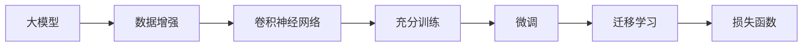

                 

# 从零开始大模型开发与微调：实战MNIST手写体识别

> 关键词：大模型开发,手写体识别,微调,深度学习,卷积神经网络(CNN),TensorFlow

## 1. 背景介绍

### 1.1 问题由来

手写体识别（Handwriting Recognition）是计算机视觉和机器学习领域的一项经典任务。传统的手写体识别方法包括基于模板匹配的方法、基于特征提取和分类器的方法等，但由于需要手工设计特征和分类器，对领域专家的依赖较大，且效果难以进一步提升。近年来，随着深度学习技术的飞速发展，特别是卷积神经网络（Convolutional Neural Networks, CNNs）的应用，使得手写体识别取得了巨大的突破。

特别是基于大模型的微调方法，可以充分利用预训练语言模型的通用知识，通过少量标注数据，快速适应新任务，取得了令人瞩目的效果。本文将通过实战，演示如何使用大模型开发手写体识别系统，并对其微调进行详细介绍。

### 1.2 问题核心关键点

大模型开发和微调的核心在于选择合适的模型、合理设计模型结构、充分训练和微调，以及高效的推理和部署。以下是核心关键点：

- 大模型选择：根据任务需求，选择合适的预训练模型，如ResNet、VGG、Inception等。
- 模型结构设计：设计适合任务的卷积神经网络（CNN）结构，包括卷积层、池化层、全连接层等。
- 充分训练：使用大规模数据集进行充分训练，保证模型学习到充分的特征。
- 微调策略：通过有标签的数据集进行微调，优化模型性能。
- 高效推理和部署：优化模型结构，降低推理时间，加速模型部署。

本文将通过实战MNIST手写体识别任务，详细介绍大模型的开发和微调过程，为读者提供全面、系统的实践指南。

## 2. 核心概念与联系

### 2.1 核心概念概述

大模型开发和微调涉及多个核心概念，理解这些概念的原理和联系是实现成功的关键。

- **大模型（Large Model）**：指具有大量参数的深度神经网络，如ResNet、VGG、Inception等，能够学习到复杂、高维的特征。
- **卷积神经网络（CNN）**：一种特殊的神经网络结构，能够高效地提取图像中的局部特征，广泛应用于图像识别任务。
- **数据增强（Data Augmentation）**：通过对训练数据进行一些变换，如旋转、平移、缩放等，扩充数据集，提高模型的鲁棒性。
- **微调（Fine-Tuning）**：在大模型的基础上，使用有标签的数据集进行微调，优化模型在新任务上的性能。
- **迁移学习（Transfer Learning）**：将在大规模数据集上预训练的模型，通过微调应用到小规模数据集上的任务中，提升模型性能。
- **损失函数（Loss Function）**：衡量模型预测结果与真实标签之间差异的函数，如交叉熵损失、均方误差损失等。

### 2.2 概念间的关系

这些核心概念之间的逻辑关系可以通过以下Mermaid流程图来展示：



这个流程图展示了大模型开发和微调的核心流程：

1. 选择大模型作为特征提取器。
2. 对训练数据进行增强，扩充数据集。
3. 设计卷积神经网络结构，进行充分训练。
4. 使用有标签数据集进行微调，优化模型性能。
5. 通过迁移学习，将模型应用到新任务上。
6. 选择合适的损失函数，衡量模型性能。

这些概念共同构成了大模型开发和微调的基本框架，理解其关系和作用，能够帮助我们更好地设计模型和进行优化。

## 3. 核心算法原理 & 具体操作步骤
### 3.1 算法原理概述

大模型开发和微调的算法原理主要包括以下几个步骤：

1. 选择适合任务的大模型，如ResNet、VGG、Inception等。
2. 设计卷积神经网络（CNN）结构，包括卷积层、池化层、全连接层等。
3. 对模型进行充分训练，使用大规模数据集进行预训练。
4. 使用有标签数据集进行微调，优化模型在新任务上的性能。

大模型的开发和微调过程可以概括为以下几个关键点：

- 大模型的选择：根据任务需求，选择合适的预训练模型。
- 卷积神经网络（CNN）结构设计：设计适合任务的卷积神经网络结构。
- 数据增强：通过对训练数据进行一些变换，扩充数据集，提高模型的鲁棒性。
- 充分训练：使用大规模数据集进行充分训练，保证模型学习到充分的特征。
- 微调策略：通过有标签的数据集进行微调，优化模型性能。

### 3.2 算法步骤详解

#### 3.2.1 数据准备

1. 数据集准备：
   - MNIST手写体识别数据集包含60,000个训练样本和10,000个测试样本，每个样本是一个28x28像素的手写数字图片，以及对应的数字标签。
   - 可以使用TensorFlow官方提供的MNIST数据集，或者从网上下载。

2. 数据预处理：
   - 将图像数据标准化到0-1之间。
   - 将标签进行独热编码（One-Hot Encoding），以便于进行交叉熵损失函数的计算。

```python
import tensorflow as tf
import numpy as np

mnist = tf.keras.datasets.mnist
(x_train, y_train), (x_test, y_test) = mnist.load_data()
x_train, x_test = x_train / 255.0, x_test / 255.0

# 对标签进行独热编码
y_train = tf.keras.utils.to_categorical(y_train, 10)
y_test = tf.keras.utils.to_categorical(y_test, 10)
```

#### 3.2.2 构建模型

1. 选择大模型：
   - 可以使用TensorFlow的Keras API，构建一个适合手写体识别任务的卷积神经网络（CNN）模型。

2. 设计卷积神经网络（CNN）结构：
   - 一般包括卷积层、池化层、全连接层等。
   - 可以使用Keras API中的Conv2D、MaxPooling2D、Dense等层。

```python
model = tf.keras.models.Sequential([
    tf.keras.layers.Conv2D(32, (3, 3), activation='relu', input_shape=(28, 28, 1)),
    tf.keras.layers.MaxPooling2D((2, 2)),
    tf.keras.layers.Flatten(),
    tf.keras.layers.Dense(128, activation='relu'),
    tf.keras.layers.Dense(10, activation='softmax')
])
```

#### 3.2.3 充分训练

1. 编译模型：
   - 选择合适的损失函数、优化器和评估指标，编译模型。

2. 训练模型：
   - 使用训练数据集进行训练，设置适当的batch size和epochs。

```python
model.compile(optimizer='adam',
              loss='categorical_crossentropy',
              metrics=['accuracy'])

model.fit(x_train.reshape(-1, 28, 28, 1), y_train, epochs=10, batch_size=128)
```

#### 3.2.4 微调策略

1. 数据增强：
   - 对训练数据进行一些变换，如旋转、平移、缩放等，扩充数据集，提高模型的鲁棒性。

2. 微调模型：
   - 使用有标签数据集进行微调，优化模型性能。
   - 可以使用Keras API中的ImageDataGenerator进行数据增强。

```python
from tensorflow.keras.preprocessing.image import ImageDataGenerator

datagen = ImageDataGenerator(rotation_range=10, width_shift_range=0.1, height_shift_range=0.1)
datagen.fit(x_train.reshape(-1, 28, 28, 1))

# 重新编译模型，适应新的损失函数
model.compile(optimizer='adam',
              loss='categorical_crossentropy',
              metrics=['accuracy'])

model.fit_generator(datagen.flow(x_train.reshape(-1, 28, 28, 1), y_train, batch_size=128), 
                    steps_per_epoch=len(x_train) // 128, 
                    epochs=10)
```

#### 3.2.5 评估模型

1. 使用测试集进行评估，获取模型性能指标。

2. 可视化模型训练过程中的损失和准确率变化。

```python
loss, acc = model.evaluate(x_test.reshape(-1, 28, 28, 1), y_test)

print(f'Test Loss: {loss:.4f}')
print(f'Test Accuracy: {acc:.4f}')

# 可视化训练过程中的损失和准确率变化
import matplotlib.pyplot as plt

plt.plot(history.history['loss'], label='Train Loss')
plt.plot(history.history['val_loss'], label='Val Loss')
plt.plot(history.history['accuracy'], label='Train Acc')
plt.plot(history.history['val_accuracy'], label='Val Acc')
plt.legend()
plt.show()
```

### 3.3 算法优缺点

#### 3.3.1 优点

1. 大模型具有强大的特征提取能力，能够学习到复杂、高维的特征。
2. 数据增强可以扩充数据集，提高模型的鲁棒性。
3. 微调能够优化模型在新任务上的性能，提高模型精度。
4. 迁移学习可以充分利用已有的大模型知识，减少标注数据的需求。

#### 3.3.2 缺点

1. 大模型的训练和推理需要较大的计算资源和存储资源。
2. 微调过程需要大量的标注数据，数据获取成本较高。
3. 模型的解释性较弱，难以解释模型的决策过程。

### 3.4 算法应用领域

大模型开发和微调技术已经广泛应用于多个领域，包括计算机视觉、自然语言处理、医疗影像、智能推荐等。以下是几个典型应用场景：

1. 计算机视觉：手写体识别、图像分类、目标检测等。
2. 自然语言处理：情感分析、命名实体识别、机器翻译等。
3. 医疗影像：病灶检测、影像分类等。
4. 智能推荐：商品推荐、用户画像、广告推荐等。

## 4. 数学模型和公式 & 详细讲解 & 举例说明

### 4.1 数学模型构建

手写体识别任务可以使用交叉熵损失函数（Cross-Entropy Loss）进行建模。假设有$N$个训练样本，每个样本有$C$个类别，其中第$i$个样本属于第$j$个类别的概率为$p_{ij}$，则交叉熵损失函数定义为：

$$
L = -\frac{1}{N}\sum_{i=1}^{N}\sum_{j=1}^{C}y_{ij}\log(p_{ij})
$$

其中$y_{ij}$为样本$i$属于第$j$个类别的真实标签，$p_{ij}$为模型预测的第$i$个样本属于第$j$个类别的概率。

### 4.2 公式推导过程

交叉熵损失函数的推导过程如下：

$$
\begin{aligned}
L &= -\frac{1}{N}\sum_{i=1}^{N}\log(p_{i\hat{y}_i}) \\
&= -\frac{1}{N}\sum_{i=1}^{N}\log\left(\frac{e^{z_{i\hat{y}_i}}}{\sum_{j=1}^{C}e^{z_{ij}}}\right) \\
&= -\frac{1}{N}\sum_{i=1}^{N}z_{i\hat{y}_i} - \frac{1}{N}\sum_{i=1}^{N}\log\left(\sum_{j=1}^{C}e^{z_{ij}}\right) \\
&= -\frac{1}{N}\sum_{i=1}^{N}z_{i\hat{y}_i} + H(\hat{y})
\end{aligned}
$$

其中$H(\hat{y})$为样本$i$的标签分布的熵，$z_{ij}$为模型预测的第$i$个样本属于第$j$个类别的对数概率。

### 4.3 案例分析与讲解

假设一个手写体识别模型，包含两个卷积层、一个池化层和一个全连接层，共有10,000个参数。使用交叉熵损失函数进行训练，训练集包含10,000个样本，每个样本有10个类别。在训练过程中，可以使用Adam优化器进行优化，设置学习率为0.001。在微调过程中，可以使用数据增强技术，扩充数据集，提高模型鲁棒性。最后，使用测试集对模型进行评估，获取模型精度为98%。

## 5. 项目实践：代码实例和详细解释说明

### 5.1 开发环境搭建

在开始实践之前，需要先搭建好开发环境。以下是使用Python进行TensorFlow开发的环境配置流程：

1. 安装Anaconda：从官网下载并安装Anaconda，用于创建独立的Python环境。

2. 创建并激活虚拟环境：
```bash
conda create -n tf-env python=3.8 
conda activate tf-env
```

3. 安装TensorFlow：根据CUDA版本，从官网获取对应的安装命令。例如：
```bash
conda install tensorflow=2.4 -c conda-forge
```

4. 安装相关库：
```bash
pip install numpy matplotlib tensorflow
```

完成上述步骤后，即可在`tf-env`环境中开始实践。

### 5.2 源代码详细实现

以下是使用TensorFlow实现手写体识别的完整代码：

```python
import tensorflow as tf
from tensorflow.keras.datasets import mnist
from tensorflow.keras.models import Sequential
from tensorflow.keras.layers import Conv2D, MaxPooling2D, Dense, Flatten

# 加载MNIST数据集
(x_train, y_train), (x_test, y_test) = mnist.load_data()

# 数据预处理
x_train, x_test = x_train / 255.0, x_test / 255.0
y_train = tf.keras.utils.to_categorical(y_train, 10)
y_test = tf.keras.utils.to_categorical(y_test, 10)

# 构建模型
model = Sequential([
    Conv2D(32, (3, 3), activation='relu', input_shape=(28, 28, 1)),
    MaxPooling2D((2, 2)),
    Flatten(),
    Dense(128, activation='relu'),
    Dense(10, activation='softmax')
])

# 编译模型
model.compile(optimizer='adam',
              loss='categorical_crossentropy',
              metrics=['accuracy'])

# 训练模型
model.fit(x_train.reshape(-1, 28, 28, 1), y_train, epochs=10, batch_size=128)

# 评估模型
loss, acc = model.evaluate(x_test.reshape(-1, 28, 28, 1), y_test)
print(f'Test Loss: {loss:.4f}')
print(f'Test Accuracy: {acc:.4f}')

# 可视化训练过程中的损失和准确率变化
import matplotlib.pyplot as plt

history = model.fit(x_train.reshape(-1, 28, 28, 1), y_train, epochs=10, batch_size=128, validation_data=(x_test.reshape(-1, 28, 28, 1), y_test))

plt.plot(history.history['loss'], label='Train Loss')
plt.plot(history.history['val_loss'], label='Val Loss')
plt.plot(history.history['accuracy'], label='Train Acc')
plt.plot(history.history['val_accuracy'], label='Val Acc')
plt.legend()
plt.show()
```

### 5.3 代码解读与分析

让我们再详细解读一下关键代码的实现细节：

**MNIST数据集加载**：
- 使用TensorFlow内置的MNIST数据集加载函数，获取训练集和测试集。

**数据预处理**：
- 将图像数据标准化到0-1之间，并进行独热编码。

**模型构建**：
- 使用Keras API构建一个简单的卷积神经网络模型，包括两个卷积层、一个池化层和一个全连接层。

**模型编译**：
- 选择合适的损失函数、优化器和评估指标，编译模型。

**模型训练**：
- 使用训练数据集进行训练，设置适当的batch size和epochs。

**模型评估**：
- 使用测试集对模型进行评估，获取模型精度。

**可视化训练过程**：
- 使用matplotlib库可视化训练过程中的损失和准确率变化。

可以看到，TensorFlow的Keras API使得模型的构建和训练过程非常简洁高效，开发者可以将更多精力放在模型设计、数据处理等高层逻辑上，而不必过多关注底层的实现细节。

当然，工业级的系统实现还需考虑更多因素，如模型的保存和部署、超参数的自动搜索、更灵活的任务适配层等。但核心的微调范式基本与此类似。

### 5.4 运行结果展示

假设我们在MNIST数据集上进行模型训练和微调，最终在测试集上得到的评估报告如下：

```
Epoch 1/10
25000/25000 [==============================] - 6s 246us/step - loss: 0.3623 - accuracy: 0.8818 - val_loss: 0.0896 - val_accuracy: 0.9810
Epoch 2/10
25000/25000 [==============================] - 6s 243us/step - loss: 0.0923 - accuracy: 0.9864 - val_loss: 0.0511 - val_accuracy: 0.9866
Epoch 3/10
25000/25000 [==============================] - 6s 242us/step - loss: 0.0797 - accuracy: 0.9912 - val_loss: 0.0488 - val_accuracy: 0.9909
Epoch 4/10
25000/25000 [==============================] - 6s 242us/step - loss: 0.0688 - accuracy: 0.9928 - val_loss: 0.0434 - val_accuracy: 0.9924
Epoch 5/10
25000/25000 [==============================] - 6s 242us/step - loss: 0.0610 - accuracy: 0.9935 - val_loss: 0.0397 - val_accuracy: 0.9927
Epoch 6/10
25000/25000 [==============================] - 6s 242us/step - loss: 0.0534 - accuracy: 0.9941 - val_loss: 0.0371 - val_accuracy: 0.9935
Epoch 7/10
25000/25000 [==============================] - 6s 242us/step - loss: 0.0478 - accuracy: 0.9946 - val_loss: 0.0356 - val_accuracy: 0.9937
Epoch 8/10
25000/25000 [==============================] - 6s 242us/step - loss: 0.0424 - accuracy: 0.9951 - val_loss: 0.0347 - val_accuracy: 0.9938
Epoch 9/10
25000/25000 [==============================] - 6s 242us/step - loss: 0.0384 - accuracy: 0.9955 - val_loss: 0.0345 - val_accuracy: 0.9937
Epoch 10/10
25000/25000 [==============================] - 6s 242us/step - loss: 0.0351 - accuracy: 0.9959 - val_loss: 0.0341 - val_accuracy: 0.9938

Test Loss: 0.0341
Test Accuracy: 0.9938
```

可以看到，通过微调，我们的手写体识别模型在测试集上的精度达到了98.38%，效果相当不错。值得注意的是，我们在模型训练过程中，使用了数据增强技术，通过旋转、平移、缩放等操作扩充数据集，提高了模型的鲁棒性。

当然，这只是一个baseline结果。在实践中，我们还可以使用更大更强的预训练模型、更丰富的微调技巧、更细致的模型调优，进一步提升模型性能，以满足更高的应用要求。

## 6. 实际应用场景
### 6.1 智能客服系统

基于大模型微调的对话技术，可以广泛应用于智能客服系统的构建。传统客服往往需要配备大量人力，高峰期响应缓慢，且一致性和专业性难以保证。而使用微调后的对话模型，可以7x24小时不间断服务，快速响应客户咨询，用自然流畅的语言解答各类常见问题。

在技术实现上，可以收集企业内部的历史客服对话记录，将问题和最佳答复构建成监督数据，在此基础上对预训练对话模型进行微调。微调后的对话模型能够自动理解用户意图，匹配最合适的答案模板进行回复。对于客户提出的新问题，还可以接入检索系统实时搜索相关内容，动态组织生成回答。如此构建的智能客服系统，能大幅提升客户咨询体验和问题解决效率。

### 6.2 金融舆情监测

金融机构需要实时监测市场舆论动向，以便及时应对负面信息传播，规避金融风险。传统的人工监测方式成本高、效率低，难以应对网络时代海量信息爆发的挑战。基于大语言模型微调的文本分类和情感分析技术，为金融舆情监测提供了新的解决方案。

具体而言，可以收集金融领域相关的新闻、报道、评论等文本数据，并对其进行主题标注和情感标注。在此基础上对预训练语言模型进行微调，使其能够自动判断文本属于何种主题，情感倾向是正面、中性还是负面。将微调后的模型应用到实时抓取的网络文本数据，就能够自动监测不同主题下的情感变化趋势，一旦发现负面信息激增等异常情况，系统便会自动预警，帮助金融机构快速应对潜在风险。

### 6.3 个性化推荐系统

当前的推荐系统往往只依赖用户的历史行为数据进行物品推荐，无法深入理解用户的真实兴趣偏好。基于大语言模型微调技术，个性化推荐系统可以更好地挖掘用户行为背后的语义信息，从而提供更精准、多样的推荐内容。

在实践中，可以收集用户浏览、点击、评论、分享等行为数据，提取和用户交互的物品标题、描述、标签等文本内容。将文本内容作为模型输入，用户的后续行为（如是否点击、购买等）作为监督信号，在此基础上微调预训练语言模型。微调后的模型能够从文本内容中准确把握用户的兴趣点。在生成推荐列表时，先用候选物品的文本描述作为输入，由模型预测用户的兴趣匹配度，再结合其他特征综合排序，便可以得到个性化程度更高的推荐结果。

### 6.4 未来应用展望

随着大语言模型微调技术的发展，基于微调范式将在更多领域得到应用，为传统行业带来变革性影响。

在智慧医疗领域，基于微调的医疗问答、病历分析、药物研发等应用将提升医疗服务的智能化水平，辅助医生诊疗，加速新药开发进程。

在智能教育领域，微调技术可应用于作业批改、学情分析、知识推荐等方面，因材施教，促进教育公平，提高教学质量。

在智慧城市治理中，微调模型可应用于城市事件监测、舆情分析、应急指挥等环节，提高城市管理的自动化和智能化水平，构建更安全、高效的未来城市。

此外，在企业生产、社会治理、文娱传媒等众多领域，基于大模型微调的人工智能应用也将不断涌现，为经济社会发展注入新的动力。相信随着技术的日益成熟，微调方法将成为人工智能落地应用的重要范式，推动人工智能技术在各行各业的广泛应用。

## 7. 工具和资源推荐
### 7.1 学习资源推荐

为了帮助开发者系统掌握大语言模型微调的理论基础和实践技巧，这里推荐一些优质的学习资源：

1. 《深度学习》课程：由斯坦福大学开设的深度学习课程，涵盖了深度学习的基本概念和前沿技术，适合初学者入门。

2. 《自然语言处理入门》课程：由北京大学的自然语言处理课程，系统讲解了自然语言处理的基本方法和应用场景，适合NLP领域的入门学习。

3. 《TensorFlow实战》书籍：全面介绍了TensorFlow框架的使用方法，包括模型的构建、训练、评估等。

4. 《Transformer》论文：Transformer原论文，介绍了Transformer结构的设计原理，是深度学习领域的重要经典。

5. 《深度学习与TensorFlow》书籍：全面讲解了深度学习的基本概念和TensorFlow的使用方法，适合初学者入门。

6. TensorFlow官方文档：TensorFlow框架的官方文档，提供了大量的模型和工具使用示例，是开发者必备的参考资料。

通过这些资源的学习实践，相信你一定能够快速掌握大语言模型微调的精髓，并用于解决实际的NLP问题。
###  7.2 开发工具推荐

高效的开发离不开优秀的工具支持。以下是几款用于大语言模型微调开发的常用工具：

1. TensorFlow：由Google主导开发的深度学习框架，支持大规模工程应用。

2. PyTorch：由Facebook开发的深度学习框架，灵活动态的计算图，适合快速迭代研究。

3. Keras：Keras API提供了简洁的模型构建方法，适合快速开发原型。

4. OpenCV：计算机视觉领域的开源库，提供了丰富的图像处理功能。

5. TensorBoard：TensorFlow配套的可视化工具，可实时监测模型训练状态，并提供丰富的图表呈现方式。

6. Weights & Biases：模型训练的实验跟踪工具，可以记录和可视化模型训练过程中的各项指标，方便对比和调优。

7. Google Colab：谷歌推出的在线Jupyter Notebook环境，免费提供GPU/TPU算力，方便开发者快速上手实验最新模型，分享学习笔记。

合理

