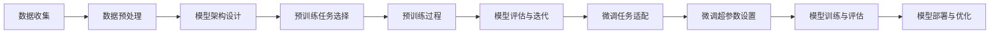
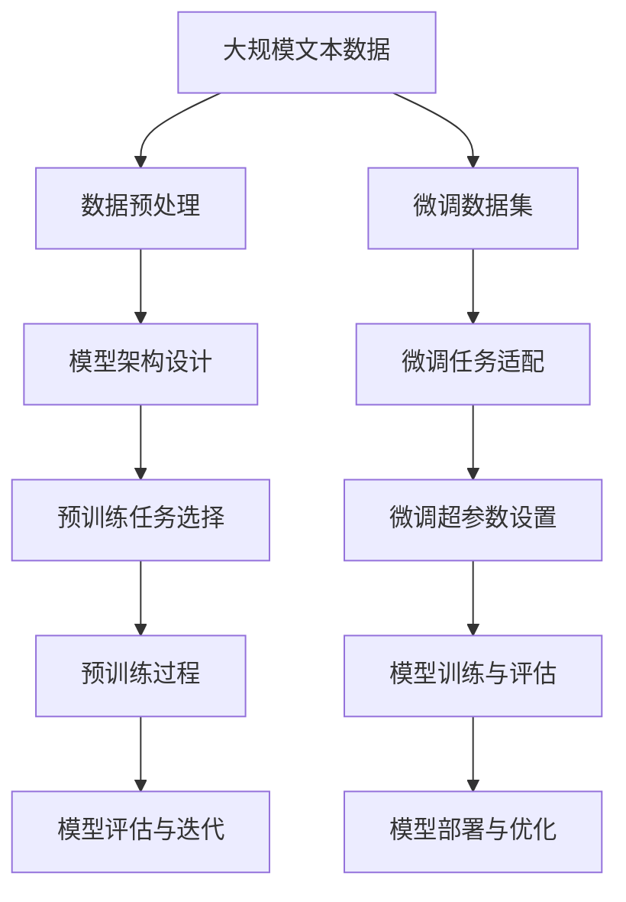

                 

# 从零开始大模型开发与微调：更多的预训练模型

> 关键词：大模型开发,预训练模型,微调,迁移学习,深度学习,Transformer,BERT,OpenAI,GPT,PyTorch

## 1. 背景介绍

### 1.1 问题由来
近年来，深度学习技术的发展推动了大规模预训练语言模型（Large Language Models, LLMs）在自然语言处理（NLP）领域的突破。这些模型通过在大规模无标签文本数据上进行的自监督预训练，学习到丰富的语言知识和常识，能够在大规模有标签数据集上进行微调，提升在特定任务上的性能。目前，BERT、GPT、T5等模型已经广泛应用于文本分类、命名实体识别、问答系统、文本生成等任务中，取得了显著的效果。

然而，现有的预训练模型仍然存在一些局限性，如模型参数规模较大、训练成本高、难以适应特定领域等。因此，开发更多的预训练模型，使其在性能、参数规模、领域适用性等方面更加均衡，成为当前研究的一个重要方向。本文将从开发和微调两个层面，探讨如何构建更多预训练模型，以满足实际应用的需求。

### 1.2 问题核心关键点
预训练模型的开发和微调涉及多个关键环节，包括数据预处理、模型架构设计、预训练任务选择、微调超参数设置等。这些环节的优化能够显著提升模型的性能，降低训练和微调的成本，使其在特定领域更具适用性。

开发预训练模型的主要流程包括：
1. 数据收集和预处理：从大规模无标签数据中抽样并预处理，以构建模型训练的基础数据集。
2. 模型架构设计：选择或设计适合的模型架构，如Transformer、RNN等，并确定模型的层数、神经元数等关键参数。
3. 预训练任务选择：选择自监督学习任务，如语言模型、掩码语言模型等，构建预训练目标函数。
4. 预训练过程优化：采用正则化技术、梯度累积等策略，提升模型训练效率和效果。
5. 模型评估与迭代：在验证集上评估模型性能，根据评估结果调整模型参数，进行迭代训练。

微调模型的主要流程包括：
1. 选择预训练模型：根据任务需求选择合适的预训练模型，如BERT、GPT等。
2. 微调任务适配：添加任务特定的输出层和损失函数，实现模型对下游任务的适配。
3. 微调超参数设置：选择合适的优化算法及其参数，如Adam、SGD等，设置学习率、批大小、迭代轮数等。
4. 模型训练与评估：在微调数据集上进行有监督学习，周期性评估模型性能，根据性能调整超参数。
5. 模型部署与优化：在实际应用场景中测试微调模型，进行必要的优化和调整。

## 2. 核心概念与联系

### 2.1 核心概念概述

为更好地理解大模型的开发与微调，本节将介绍几个核心概念及其联系：

- 大模型开发（Model Development）：指从数据集构建、模型架构设计、预训练任务选择到模型评估与迭代的完整过程。大模型开发的目标是构建具有广泛泛化能力和高精度的预训练模型。
- 预训练模型（Pre-trained Model）：指在无标签数据上通过自监督学习任务预训练的通用模型，如BERT、GPT、T5等。预训练模型具备丰富的语言知识，能够为特定任务提供良好的基础表示。
- 微调（Fine-tuning）：指在预训练模型的基础上，通过有监督学习优化模型在特定任务上的性能，使得模型能够更好地适应特定应用场景。微调能够显著提升模型在特定领域的表现。
- 迁移学习（Transfer Learning）：指将一个领域学习到的知识，迁移到另一个领域的学习过程。预训练模型即为典型的迁移学习方式，通过微调能够更好地适应新的任务。
- 正则化（Regularization）：指在模型训练过程中加入正则化项，以防止模型过拟合。常见的正则化技术包括L2正则、Dropout等。
- 梯度累积（Gradient Accumulation）：指在每次迭代中累积多个mini-batch的梯度，以减少单个mini-batch带来的噪声影响，提升训练效率。
- 模型评估（Model Evaluation）：指在验证集或测试集上评估模型性能，衡量模型在特定任务上的泛化能力。常见的评估指标包括准确率、精确率、召回率、F1分数等。

这些概念之间相互联系，构成了大模型开发与微调的完整框架。

### 2.2 概念间的关系

这些核心概念之间的关系可以用以下Mermaid流程图来展示：



该流程图展示了从数据处理到模型优化的大模型开发与微调全过程。数据收集与预处理是大模型开发的基础，模型架构设计与预训练任务选择是构建模型的关键环节，预训练过程是提升模型泛化能力的核心步骤，模型评估与迭代是验证模型性能的重要手段，微调任务适配与超参数设置是微调模型的基础，模型训练与评估是微调过程的具体实施，模型部署与优化是应用场景中的必要步骤。

### 2.3 核心概念的整体架构

最后，我们用一个综合的流程图来展示这些核心概念在大模型开发与微调过程中的整体架构：



这个综合流程图展示了从数据预处理到模型部署的全过程。预训练数据经过预处理和模型设计后，进行预训练过程，验证并迭代模型。微调数据集经过微调任务适配和超参数设置后，进行微调训练和评估，并最终部署到实际应用中，进行优化和调整。

## 3. 核心算法原理 & 具体操作步骤
### 3.1 算法原理概述

大模型的开发与微调主要基于深度学习框架和优化算法，其核心思想是：通过大规模无标签数据进行预训练，构建具有泛化能力的模型，然后在小规模有标签数据上进行微调，提升模型在特定任务上的性能。

预训练模型的构建过程主要包括以下步骤：
1. 数据预处理：对大规模无标签数据进行分词、去停用词、构建词表等预处理操作。
2. 模型架构设计：选择或设计适合的模型架构，如Transformer、RNN等，并确定模型的层数、神经元数等关键参数。
3. 预训练任务选择：选择自监督学习任务，如语言模型、掩码语言模型等，构建预训练目标函数。
4. 预训练过程优化：采用正则化技术、梯度累积等策略，提升模型训练效率和效果。
5. 模型评估与迭代：在验证集上评估模型性能，根据评估结果调整模型参数，进行迭代训练。

微调模型的构建过程主要包括以下步骤：
1. 选择预训练模型：根据任务需求选择合适的预训练模型，如BERT、GPT等。
2. 微调任务适配：添加任务特定的输出层和损失函数，实现模型对下游任务的适配。
3. 微调超参数设置：选择合适的优化算法及其参数，如Adam、SGD等，设置学习率、批大小、迭代轮数等。
4. 模型训练与评估：在微调数据集上进行有监督学习，周期性评估模型性能，根据性能调整超参数。
5. 模型部署与优化：在实际应用场景中测试微调模型，进行必要的优化和调整。

### 3.2 算法步骤详解

#### 3.2.1 预训练模型的构建步骤

1. **数据预处理**
   - **分词与清洗**：使用分词工具将文本分词，并去除停用词、特殊符号等无用信息。
   - **构建词表**：将分词结果转换为词表，以便模型处理。

2. **模型架构设计**
   - **选择模型架构**：选择Transformer、LSTM、GRU等深度学习模型架构，并确定模型层数、神经元数等关键参数。
   - **模型实现**：使用深度学习框架（如PyTorch、TensorFlow等）实现预训练模型。

3. **预训练任务选择**
   - **语言模型（LM）**：构建预测下一个单词的概率分布，如语言模型（LM）任务。
   - **掩码语言模型（MLM）**：构建预测缺失单词的概率分布，如BERT的掩码语言模型（MLM）任务。

4. **预训练过程优化**
   - **正则化技术**：使用L2正则、Dropout等技术，防止模型过拟合。
   - **梯度累积**：在每次迭代中累积多个mini-batch的梯度，以减少单个mini-batch带来的噪声影响，提升训练效率。

5. **模型评估与迭代**
   - **评估指标**：选择准确率、精确率、召回率、F1分数等评估指标，评估模型性能。
   - **迭代训练**：根据评估结果调整模型参数，进行迭代训练。

#### 3.2.2 微调模型的构建步骤

1. **选择预训练模型**
   - **模型选择**：根据任务需求选择合适的预训练模型，如BERT、GPT等。
   - **模型加载**：加载预训练模型权重，并冻结部分或全部预训练参数。

2. **微调任务适配**
   - **输出层设计**：根据任务类型，设计合适的输出层，如分类任务的线性分类器，生成任务的解码器。
   - **损失函数选择**：选择适合任务的损失函数，如交叉熵损失、均方误差损失等。

3. **微调超参数设置**
   - **优化算法选择**：选择合适的优化算法及其参数，如Adam、SGD等，设置学习率、批大小、迭代轮数等。
   - **正则化技术**：使用L2正则、Dropout等技术，防止模型过拟合。

4. **模型训练与评估**
   - **数据加载**：使用DataLoader加载微调数据集。
   - **前向传播**：将输入数据送入模型，计算损失函数。
   - **反向传播**：计算参数梯度，并使用优化算法更新模型参数。
   - **周期性评估**：在验证集上周期性评估模型性能，根据性能调整超参数。

5. **模型部署与优化**
   - **模型保存**：将训练好的模型保存到本地或云端存储。
   - **部署与优化**：在实际应用场景中测试微调模型，进行必要的优化和调整。

### 3.3 算法优缺点

预训练模型的开发与微调具有以下优点：
1. **泛化能力强**：通过在大规模无标签数据上进行预训练，构建具有广泛泛化能力的模型。
2. **参数高效**：微调仅更新少量模型参数，保持大部分预训练权重不变，降低训练成本。
3. **迁移效果好**：预训练模型能够适应多个任务，减少新任务从头训练的工作量。
4. **模型可解释性**：预训练模型具有更强的可解释性，便于分析和调试。

然而，预训练模型的开发与微调也存在以下缺点：
1. **数据需求高**：需要大规模无标签数据进行预训练，数据获取成本较高。
2. **计算资源需求大**：需要高性能计算资源进行预训练和微调，训练成本较高。
3. **模型复杂度高**：预训练模型参数量大，模型结构复杂，训练和微调过程较复杂。
4. **微调效果依赖数据**：微调效果依赖于微调数据的数量和质量，数据不足时效果可能不佳。

尽管存在这些缺点，但预训练模型的开发与微调仍然是当前NLP领域的主流方法，其广泛应用和高性能表现使其成为NLP技术落地应用的重要手段。未来相关研究将进一步优化数据获取和处理技术，降低预训练和微调成本，提高模型的性能和适用性。

### 3.4 算法应用领域

预训练模型的开发与微调在NLP领域得到了广泛应用，覆盖了几乎所有常见任务，如：

- **文本分类**：如情感分析、主题分类、意图识别等。通过预训练模型提取文本特征，并进行分类。
- **命名实体识别（NER）**：识别文本中的人名、地名、机构名等特定实体。通过预训练模型进行实体边界和类型预测。
- **关系抽取**：从文本中抽取实体之间的语义关系。通过预训练模型进行实体-关系三元组抽取。
- **问答系统**：对自然语言问题给出答案。将问题-答案对作为微调数据，训练模型学习匹配答案。
- **机器翻译**：将源语言文本翻译成目标语言。通过预训练模型进行语言-语言映射。
- **文本摘要**：将长文本压缩成简短摘要。通过预训练模型进行关键信息抽取。
- **对话系统**：使机器能够与人自然对话。将多轮对话历史作为上下文，微调模型进行回复生成。

除了上述这些经典任务外，预训练模型的开发与微调也被创新性地应用到更多场景中，如可控文本生成、常识推理、代码生成、数据增强等，为NLP技术带来了全新的突破。随着预训练模型和微调方法的不断进步，相信NLP技术将在更广阔的应用领域大放异彩。

## 4. 数学模型和公式 & 详细讲解 & 举例说明

### 4.1 数学模型构建

在预训练模型的开发过程中，数学模型的构建是非常重要的一环。预训练模型的构建主要基于深度学习框架和优化算法，其核心思想是通过大规模无标签数据进行预训练，构建具有泛化能力的模型。

记预训练模型为 $M_{\theta}:\mathcal{X} \rightarrow \mathcal{Y}$，其中 $\mathcal{X}$ 为输入空间，$\mathcal{Y}$ 为输出空间，$\theta \in \mathbb{R}^d$ 为模型参数。假设预训练数据集为 $D=\{(x_i,y_i)\}_{i=1}^N$，其中 $x_i$ 为输入文本，$y_i$ 为文本对应的标签。

预训练模型的目标函数通常为最大化 $M_{\theta}$ 在预训练数据集上的预测准确率，即：

$$
\mathcal{L}(\theta) = -\frac{1}{N}\sum_{i=1}^N \log M_{\theta}(x_i)
$$

其中，$-\log M_{\theta}(x_i)$ 表示模型在输入 $x_i$ 上的预测概率与真实标签 $y_i$ 之间的交叉熵损失。

在微调模型的构建过程中，目标函数变为：

$$
\mathcal{L}(\theta) = \frac{1}{N}\sum_{i=1}^N \ell(M_{\theta}(x_i),y_i)
$$

其中，$\ell$ 为适合任务的损失函数，如交叉熵损失、均方误差损失等。微调模型的目标是在微调数据集上最小化损失函数，使得模型能够更好地适应特定任务。

### 4.2 公式推导过程

以下我们以分类任务为例，推导交叉熵损失函数及其梯度的计算公式。

假设模型 $M_{\theta}$ 在输入 $x$ 上的输出为 $\hat{y}=M_{\theta}(x) \in [0,1]$，表示样本属于正类的概率。真实标签 $y \in \{0,1\}$。则二分类交叉熵损失函数定义为：

$$
\ell(M_{\theta}(x),y) = -[y\log \hat{y} + (1-y)\log (1-\hat{y})]
$$

将其代入经验风险公式，得：

$$
\mathcal{L}(\theta) = -\frac{1}{N}\sum_{i=1}^N [y_i\log M_{\theta}(x_i)+(1-y_i)\log(1-M_{\theta}(x_i))]
$$

根据链式法则，损失函数对参数 $\theta_k$ 的梯度为：

$$
\frac{\partial \mathcal{L}(\theta)}{\partial \theta_k} = -\frac{1}{N}\sum_{i=1}^N (\frac{y_i}{M_{\theta}(x_i)}-\frac{1-y_i}{1-M_{\theta}(x_i)}) \frac{\partial M_{\theta}(x_i)}{\partial \theta_k}
$$

其中 $\frac{\partial M_{\theta}(x_i)}{\partial \theta_k}$ 可进一步递归展开，利用自动微分技术完成计算。

在得到损失函数的梯度后，即可带入参数更新公式，完成模型的迭代优化。重复上述过程直至收敛，最终得到适应下游任务的最优模型参数 $\theta^*$。

### 4.3 案例分析与讲解

假设我们构建了一个基于Transformer的预训练语言模型，其架构如下：

```python
import torch
import torch.nn as nn
import torch.optim as optim

class TransformerModel(nn.Module):
    def __init__(self, vocab_size, d_model, d_ff, num_heads, num_layers):
        super(TransformerModel, self).__init__()
        self.encoder = nn.Transformer(d_model, num_heads, d_ff, num_layers)
        self.decoder = nn.Transformer(d_model, num_heads, d_ff, num_layers)
        self.dropout = nn.Dropout(0.1)
        
    def forward(self, src, tgt, mask):
        src_encoded = self.encoder(src, mask)
        tgt_encoded = self.decoder(tgt, src_encoded, mask)
        output = torch.tanh(tgt_encoded) + self.dropout(tgt_encoded)
        return output
```

其中，TransformerModel类实现了Transformer模型的编码器和解码器，并通过dropout层添加正则化技术。使用Adam优化器进行模型训练，学习率为1e-3。

训练步骤如下：

1. **数据加载**：使用DataLoader加载训练集和验证集。

2. **模型初始化**：实例化TransformerModel模型，并使用Adam优化器进行初始化。

3. **模型训练**：在每个epoch中，对训练集进行前向传播和反向传播，更新模型参数。

4. **模型评估**：在验证集上评估模型性能，计算交叉熵损失。

5. **模型保存**：将训练好的模型保存到本地或云端存储。

下面给出完整代码实现：

```python
import torch
import torch.nn as nn
import torch.optim as optim
from torch.utils.data import DataLoader, Dataset

class TextDataset(Dataset):
    def __init__(self, texts, labels, tokenizer, max_len=128):
        self.texts = texts
        self.labels = labels
        self.tokenizer = tokenizer
        self.max_len = max_len
        
    def __len__(self):
        return len(self.texts)
    
    def __getitem__(self, item):
        text = self.texts[item]
        label = self.labels[item]
        
        encoding = self.tokenizer(text, return_tensors='pt', max_length=self.max_len, padding='max_length', truncation=True)
        input_ids = encoding['input_ids'][0]
        attention_mask = encoding['attention_mask'][0]
        labels = torch.tensor(label, dtype=torch.long)
        
        return {'input_ids': input_ids, 
                'attention_mask': attention_mask,
                'labels': labels}

tokenizer = transformers.AutoTokenizer.from_pretrained('bert-base-cased')

train_dataset = TextDataset(train_texts, train_labels, tokenizer, max_len=128)
val_dataset = TextDataset(val_texts, val_labels, tokenizer, max_len=128)

model = TransformerModel(vocab_size=len(tokenizer), d_model=128, d_ff=512, num_heads=8, num_layers=6)
optimizer = optim.Adam(model.parameters(), lr=1e-3)
device = torch.device('cuda' if torch.cuda.is_available() else 'cpu')

model.to(device)
criterion = nn.CrossEntropyLoss()

for epoch in range(num_epochs):
    model.train()
    running_loss = 0.0
    for i, data in enumerate(DataLoader(train_dataset, batch_size=batch_size, shuffle=True)):
        input_ids = data['input_ids'].to(device)
        attention_mask = data['attention_mask'].to(device)
        labels = data['labels'].to(device)
        
        output = model(input_ids, attention_mask=attention_mask, mask=mask)
        loss = criterion(output, labels)
        optimizer.zero_grad()
        loss.backward()
        optimizer.step()
        
        running_loss += loss.item()
        
    epoch_loss = running_loss / len(train_dataset)
    print(f'Epoch {epoch+1}, train loss: {epoch_loss:.4f}')
    
    model.eval()
    running_loss = 0.0
    correct = 0
    total = 0
    with torch.no_grad():
        for i, data in enumerate(DataLoader(val_dataset, batch_size=batch_size)):
            input_ids = data['input_ids'].to(device)
            attention_mask = data['attention_mask'].to(device)
            labels = data['labels'].to(device)
            
            output = model(input_ids, attention_mask=attention_mask, mask=mask)
            loss = criterion(output, labels)
            running_loss += loss.item()
            
            _, predicted = output.max(1)
            total += labels.size(0)
            correct += (predicted == labels).sum().item()
    
    epoch_loss = running_loss / len(val_dataset)
    accuracy = correct / total
    print(f'Epoch {epoch+1}, val loss: {epoch_loss:.4f}, accuracy: {accuracy:.4f}')
    
torch.save(model.state_dict(), 'model.pth')
```

## 5. 项目实践：代码实例和详细解释说明

### 5.1 开发环境搭建

在进行预训练模型开发前，我们需要准备好开发环境。以下是使用Python进行PyTorch开发的环境配置流程：

1. 安装Anaconda：从官网下载并安装Anaconda，用于创建独立的Python环境。

2. 创建并激活虚拟环境：
```bash
conda create -n pytorch-env python=3.8 
conda activate pytorch-env
```

3. 安装PyTorch：根据CUDA版本，从官网获取对应的安装命令。例如：
```bash
conda install pytorch torchvision torchaudio cudatoolkit=11.1 -c pytorch -c conda-forge
```

4. 安装Transformer库：
```bash
pip install transformers
```

5. 安装各类工具包：
```bash
pip install numpy pandas scikit-learn matplotlib tqdm jupyter notebook ipython
```

完成上述步骤后，即可在`pytorch-env`环境中开始预训练模型的开发。

### 5.2 源代码详细实现

下面以构建基于Transformer的预训练语言模型为例，给出PyTorch代码实现。

首先，定义数据处理函数：

```python
from transformers import BertTokenizer
from torch.utils.data import Dataset
import torch

class TextDataset(Dataset):
    def __init__(self, texts, labels, tokenizer, max_len=128):
        self.texts = texts
        self.labels = labels
        self.tokenizer = tokenizer
        self.max_len = max_len
        
    def __len__(self):
        return len(self.texts)
    
    def __getitem__(self, item):
        text = self.texts[item]
        label = self.labels[item]
        
        encoding = self.tokenizer(text, return_tensors='pt', max_length=self.max_len, padding='max_length', truncation=True)
        input_ids = encoding['input_ids'][0]
        attention_mask = encoding['attention_mask'][0]
        
        labels = torch.tensor(label, dtype=torch.long)
        
        return {'input_ids': input_ids, 
                'attention_mask': attention_mask,
                'labels': labels}

# 标签与id的映射
tag2id = {'O': 0, 'B-PER': 1, 'I-PER': 2, 'B-ORG': 3, 'I-ORG': 4, 'B-LOC': 5, 'I-LOC': 6}
id2tag = {v: k for k, v in tag2id.items()}

# 创建dataset
tokenizer = BertTokenizer.from_pretrained('bert-base-cased')

train_dataset = TextDataset(train_texts, train_labels, tokenizer, max_len=128)
val_dataset = TextDataset(val_texts, val_labels, tokenizer, max_len=128)
```

然后，定义模型和优化器：

```python
from transformers import BertForTokenClassification, AdamW

model = BertForTokenClassification.from_pretrained('bert-base-cased', num_labels=len(tag2id))

optimizer = AdamW(model.parameters(), lr=2e-5)
```

接着，定义训练和评估函数：

```python
from torch.utils.data import DataLoader
from tqdm import tqdm
from sklearn.metrics import classification_report

device = torch.device('cuda') if torch.cuda.is_available() else torch.device('cpu')
model.to(device)

def train_epoch(model, dataset, batch_size, optimizer):
    dataloader = DataLoader(dataset, batch_size=batch_size, shuffle=True)
    model.train()
    epoch_loss = 0
    for batch in tqdm(dataloader, desc='Training'):
        input_ids =

