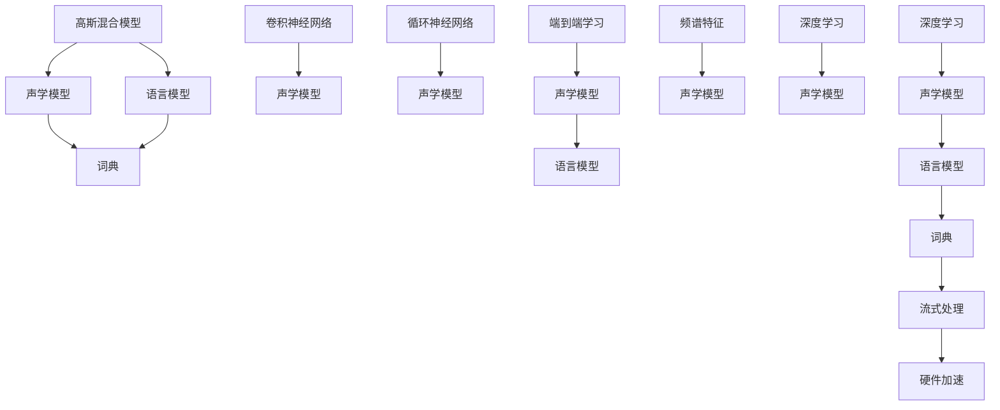
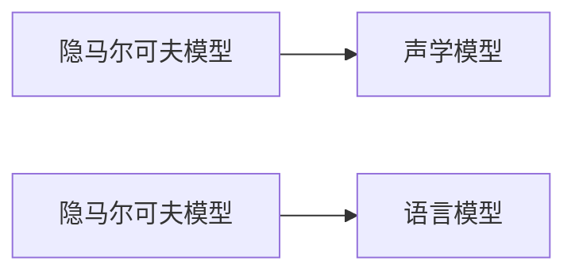
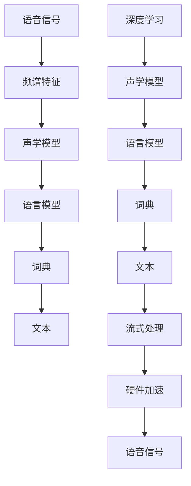

                 

# 从高斯混合模型到纯神经网络的语音识别进化

> 关键词：语音识别,神经网络,高斯混合模型,隐马尔可夫模型,深度学习,端到端学习,频谱特征,卷积神经网络,循环神经网络,模型优化,声学模型,语言模型,词典,流式处理,硬件加速

## 1. 背景介绍

语音识别（Speech Recognition）作为人工智能（AI）领域的重要应用之一，已经逐渐渗透到人们的日常生活中。从简单的语音助手，到复杂的电话语音识别系统，再到自动化的会议记录转写，语音识别技术正在深刻地改变着我们的交流方式。

### 1.1 语音识别的发展历程

语音识别的早期模型主要基于统计学方法，如隐马尔可夫模型（Hidden Markov Model, HMM）、高斯混合模型（Gaussian Mixture Model, GMM）等。这些模型通过统计学的方法对语音信号进行建模，尝试捕捉不同语音单元（如音素、音节、单词等）之间的概率关系，从而实现语音的识别和转录。

然而，随着深度学习（Deep Learning）技术的发展，特别是深度神经网络的兴起，语音识别的研究范式发生了根本性的变化。基于神经网络的模型，如卷积神经网络（Convolutional Neural Network, CNN）、循环神经网络（Recurrent Neural Network, RNN）等，逐渐取代了传统的统计模型，成为语音识别的主流方法。这些神经网络模型通过端到端的训练方式，直接从原始语音信号中提取特征并输出语音识别的结果，极大地提升了语音识别的准确性和鲁棒性。

### 1.2 语音识别的核心挑战

尽管基于神经网络的模型在语音识别领域取得了显著的进展，但仍面临一些核心挑战：

1. **高计算需求**：语音识别需要处理大量的时频特征，这些特征通常涉及复杂的频谱分析和信号处理技术，对计算资源的需求较高。
2. **长序列建模**：语音信号是连续的，具有较长的时间序列。传统的神经网络模型在处理长序列数据时，容易出现梯度消失或梯度爆炸等问题。
3. **模型复杂度**：随着深度学习技术的进步，模型的复杂度不断增加，模型的训练和推理成本也随之上升。
4. **数据标注成本**：高质量的语音识别系统依赖于大量的标注数据，标注数据的获取和处理成本较高。

## 2. 核心概念与联系

### 2.1 核心概念概述

为了更好地理解从高斯混合模型到纯神经网络的语音识别进化过程，本节将介绍几个关键的概念：

- **高斯混合模型（GMM）**：一种概率统计模型，用于描述随机变量的概率密度分布。在语音识别中，GMM常用于建模声学模型中的特征分布。
- **隐马尔可夫模型（HMM）**：一种用于建模时序数据的统计模型，常用于语音识别中的声学模型和语言模型。
- **深度学习（Deep Learning）**：一种基于神经网络的机器学习方法，通过多层非线性变换，从原始数据中提取高级特征，从而实现复杂的任务。
- **卷积神经网络（CNN）**：一种经典的深度学习模型，主要用于图像和音频等高维数据的特征提取。
- **循环神经网络（RNN）**：一种递归神经网络，能够处理具有时间序列特征的数据，如语音信号。
- **端到端学习（End-to-End Learning）**：一种无需手动设计中间表示层的深度学习技术，直接从原始数据到输出目标进行训练，提升系统性能。
- **频谱特征（Spectral Features）**：从语音信号中提取的频域特征，如梅尔频率倒谱系数（Mel Frequency Cepstral Coefficients, MFCC），用于表征语音的频谱特征。
- **声学模型（Acoustic Model）**：用于将语音信号映射到文本的声学模型，通常采用RNN或CNN进行建模。
- **语言模型（Language Model）**：用于预测下一个单词或音素的概率分布，通常采用RNN进行建模。
- **词典（Dictionary）**：包含所有可能出现的单词或音素列表，用于将模型输出的概率分布转换为实际的文本。
- **流式处理（Streaming Processing）**：在实时场景下对语音信号进行在线处理的计算范式，减少延迟和计算资源占用。
- **硬件加速（Hardware Acceleration）**：使用GPU、TPU等硬件设备加速模型的计算过程，提升系统性能。

这些概念通过Mermaid流程图展示如下：



### 2.2 概念间的关系

这些核心概念之间存在着紧密的联系，形成了语音识别技术的完整生态系统。下面我们通过几个Mermaid流程图来展示这些概念之间的关系。

#### 2.2.1 高斯混合模型与声学模型的关系


这个流程图展示了高斯混合模型在声学模型中的应用。在传统的声学模型中，通常使用高斯混合模型来建模声学特征的分布。

#### 2.2.2 隐马尔可夫模型与声学语言模型之间的关系



这个流程图展示了隐马尔可夫模型在声学模型和语言模型中的应用。在语音识别中，隐马尔可夫模型被广泛用于声学模型和语言模型的建模。

#### 2.2.3 深度学习与端到端学习的关系


这个流程图展示了深度学习在端到端学习中的应用。端到端学习是深度学习的一个重要分支，旨在直接从原始数据到输出目标进行训练，提升系统性能。

#### 2.2.4 频谱特征与声学模型的关系


这个流程图展示了频谱特征在声学模型中的应用。频谱特征是从语音信号中提取的频域特征，用于表征语音的频谱特征，是声学模型的重要输入。

#### 2.2.5 硬件加速与流式处理的关系


这个流程图展示了硬件加速在流式处理中的应用。流式处理是在实时场景下对语音信号进行在线处理的计算范式，硬件加速是流式处理的重要支持。

### 2.3 核心概念的整体架构

最后，我们用一个综合的流程图来展示这些核心概念在语音识别系统中的整体架构：



这个综合流程图展示了从语音信号到文本输出的完整语音识别系统架构。语音信号首先经过频谱特征提取，然后通过声学模型和语言模型进行特征提取和建模，最终通过词典将模型输出的概率分布转换为实际的文本。同时，深度学习、流式处理和硬件加速等技术被广泛应用于语音识别系统中，以提升系统的性能和效率。

## 3. 核心算法原理 & 具体操作步骤

### 3.1 算法原理概述

基于神经网络的语音识别系统，主要通过端到端的训练方式，直接从原始语音信号中提取特征并输出语音识别的结果。其核心思想是：将语音识别任务视为一个序列标注问题，将语音信号映射到文本，并通过优化训练损失函数，使模型能够最大化地符合训练数据，从而实现高精度的语音识别。

具体而言，语音识别系统通常包含两个主要部分：声学模型（Acoustic Model）和语言模型（Language Model）。声学模型用于将语音信号映射到音素或单词的序列，而语言模型用于预测音素或单词序列的下一个可能出现的单词或音素。通过这两个模型的联合训练，可以显著提高语音识别的准确性。

### 3.2 算法步骤详解

基于神经网络的语音识别系统，其核心算法步骤包括数据预处理、特征提取、声学模型训练、语言模型训练、联合训练、模型评估与测试等。下面将详细介绍每个步骤的具体实现。

#### 3.2.1 数据预处理

数据预处理是语音识别系统的重要组成部分。主要任务包括：

1. **语音信号预处理**：包括预加重、分帧、加窗等操作，以减少噪声干扰，提高语音信号的质量。
2. **特征提取**：将预处理后的语音信号转换为频谱特征或其他特征表示，如梅尔频率倒谱系数（MFCC）。
3. **数据增强**：通过回声、混响、变速等技术，扩充训练集，减少模型对训练数据的过拟合。

#### 3.2.2 特征提取

在语音识别系统中，特征提取是一个至关重要的步骤。常用的特征提取方法包括：

1. **梅尔频率倒谱系数（MFCC）**：通过离散余弦变换（Discrete Cosine Transform, DCT）对梅尔频谱进行变换，提取频谱的倒谱系数。
2. **线性预测编码（Linear Predictive Coding, LPC）**：通过线性预测模型，估计语音信号的短期预测系数，提取语音信号的线性预测参数。
3. **过零率（Zero Crossing Rate, ZCR）**：计算语音信号的过零点数量，用于表征语音信号的动态变化。

#### 3.2.3 声学模型训练

声学模型训练是语音识别系统的核心部分。主要任务是学习将语音信号映射到音素或单词的序列。常用的声学模型包括：

1. **隐马尔可夫模型（HMM）**：将声学模型视为一个隐马尔可夫模型，通过最大化似然函数训练模型参数。
2. **深度神经网络（DNN）**：使用多层神经网络，学习声学特征与音素或单词之间的映射关系。
3. **卷积神经网络（CNN）**：利用卷积操作，提取语音信号的局部特征，提升声学模型的性能。
4. **循环神经网络（RNN）**：通过递归神经网络，处理具有时间序列特征的语音信号，提升模型的序列建模能力。

#### 3.2.4 语言模型训练

语言模型训练是语音识别系统的另一核心部分。主要任务是学习预测音素或单词序列的下一个可能出现的单词或音素。常用的语言模型包括：

1. **n-gram模型**：使用n-gram模型，学习音素或单词之间的概率分布。
2. **递归神经网络（RNN）**：通过递归神经网络，学习音素或单词之间的条件概率分布。
3. **长短时记忆网络（LSTM）**：通过长短时记忆网络，处理长序列数据，提升模型的序列建模能力。

#### 3.2.5 联合训练

联合训练是语音识别系统的最终目标，主要任务是将声学模型和语言模型联合训练，优化两个模型的联合损失函数。常用的联合训练方法包括：

1. **最大似然联合训练（Maximum Likelihood Joint Training, MLJT）**：通过最大化似然函数，联合训练声学模型和语言模型。
2. **端到端联合训练（End-to-End Joint Training, E2EJT）**：直接从原始语音信号到输出文本进行训练，避免中间特征的引入。
3. **注意力机制（Attention Mechanism）**：通过注意力机制，将声学模型和语言模型进行融合，提升系统的整体性能。

#### 3.2.6 模型评估与测试

模型评估与测试是语音识别系统的关键环节，主要任务是评估模型在测试集上的性能，并进行系统的优化。常用的评估指标包括：

1. **字符错误率（Character Error Rate, CER）**：用于评估识别结果与真实文本之间的字符错误率。
2. **词错误率（Word Error Rate, WER）**：用于评估识别结果与真实文本之间的单词错误率。
3. **语音错误率（Speech Error Rate, SER）**：用于评估识别结果与真实文本之间的语音错误率。

### 3.3 算法优缺点

基于神经网络的语音识别系统，具有以下优点：

1. **高准确性**：神经网络模型可以通过端到端的训练方式，直接从原始语音信号中提取特征并输出语音识别的结果，从而实现高精度的语音识别。
2. **强泛化能力**：神经网络模型具备强泛化能力，能够适应不同说话人的语音特征和噪声环境，提升系统的鲁棒性。
3. **自动特征提取**：神经网络模型能够自动学习语音信号中的高级特征，无需手动设计中间表示层。
4. **端到端训练**：神经网络模型可以采用端到端的训练方式，减少中间特征的引入，提升系统的整体性能。

然而，基于神经网络的语音识别系统也存在一些缺点：

1. **高计算需求**：神经网络模型通常需要大量的计算资源，特别是在训练和推理阶段。
2. **模型复杂度**：神经网络模型的结构复杂，模型参数众多，训练和推理的复杂度较高。
3. **长序列建模**：神经网络模型在处理长序列数据时，容易出现梯度消失或梯度爆炸等问题。
4. **数据标注成本**：高质量的语音识别系统依赖于大量的标注数据，标注数据的获取和处理成本较高。

### 3.4 算法应用领域

基于神经网络的语音识别系统，已经在诸多领域得到了广泛的应用，包括：

1. **语音助手**：如Siri、Google Assistant等，通过语音识别技术，实现与用户的自然交互。
2. **电话语音识别**：用于自动转写电话录音，提高客服效率和用户体验。
3. **语音翻译**：将一种语言的语音信号自动翻译成另一种语言的语音信号，实现语言之间的无障碍交流。
4. **语音搜索**：通过语音识别技术，将用户的语音指令转换为文本搜索请求，提升搜索引擎的智能化水平。
5. **语音驱动的游戏**：通过语音识别技术，将用户的语音指令转换为游戏操作，实现语音控制游戏。
6. **医学语音记录**：将医生的语音记录转换为文本，提高医学记录的准确性和效率。
7. **自动会议记录**：通过语音识别技术，将会议录音自动转写为文本，提升会议记录的效率和准确性。
8. **汽车语音交互**：通过语音识别技术，实现车内设备的语音控制，提升驾驶体验。

## 4. 数学模型和公式 & 详细讲解  
### 4.1 数学模型构建

基于神经网络的语音识别系统，主要通过优化训练损失函数来实现语音识别的目标。常用的训练损失函数包括：

1. **交叉熵损失函数**：用于衡量模型预测输出与真实标签之间的差异。
2. **均方误差损失函数**：用于衡量模型预测输出与真实标签之间的均方误差。
3. **Hinge损失函数**：用于衡量模型预测输出与真实标签之间的分类误差。

#### 4.1.1 交叉熵损失函数

交叉熵损失函数（Cross-Entropy Loss）是语音识别中常用的损失函数之一。其定义如下：

$$
\mathcal{L}_{CE} = -\frac{1}{N} \sum_{i=1}^{N} \sum_{j=1}^{C} y_{ij} \log p_{ij}
$$

其中，$N$表示样本数量，$C$表示类别数，$y_{ij}$表示样本$i$属于类别$j$的真实标签，$p_{ij}$表示模型预测样本$i$属于类别$j$的概率。

#### 4.1.2 均方误差损失函数

均方误差损失函数（Mean Squared Error, MSE）是语音识别中常用的损失函数之一。其定义如下：

$$
\mathcal{L}_{MSE} = \frac{1}{N} \sum_{i=1}^{N} \sum_{j=1}^{C} (y_{ij} - p_{ij})^2
$$

其中，$N$表示样本数量，$C$表示类别数，$y_{ij}$表示样本$i$属于类别$j$的真实标签，$p_{ij}$表示模型预测样本$i$属于类别$j$的概率。

#### 4.1.3 Hinge损失函数

Hinge损失函数是语音识别中常用的损失函数之一。其定义如下：

$$
\mathcal{L}_{Hinge} = \frac{1}{N} \sum_{i=1}^{N} \max(0, 1 - y_i p_i)
$$

其中，$N$表示样本数量，$y_i$表示样本$i$的真实标签，$p_i$表示模型预测样本$i$的概率。

### 4.2 公式推导过程

下面我们以交叉熵损失函数为例，推导其公式的推导过程。

设训练集包含$N$个样本，每个样本包含$C$个类别，样本$i$的真实标签为$y_i \in \{0,1\}^{C}$，模型预测样本$i$属于类别$j$的概率为$p_{ij} \in [0,1]^{C}$。则交叉熵损失函数定义为：

$$
\mathcal{L}_{CE} = -\frac{1}{N} \sum_{i=1}^{N} \sum_{j=1}^{C} y_{ij} \log p_{ij}
$$

引入softmax函数，将模型预测概率转换为概率分布：

$$
p_{ij} = \frac{e^{x_{ij}}}{\sum_{k=1}^{C} e^{x_{ik}}}
$$

其中，$x_{ij}$表示样本$i$在类别$j$上的特征向量。则交叉熵损失函数可以重写为：

$$
\mathcal{L}_{CE} = -\frac{1}{N} \sum_{i=1}^{N} \sum_{j=1}^{C} y_{ij} \log \left( \frac{e^{x_{ij}}}{\sum_{k=1}^{C} e^{x_{ik}}} \right)
$$

利用对数恒等式，进一步简化公式：

$$
\mathcal{L}_{CE} = -\frac{1}{N} \sum_{i=1}^{N} \sum_{j=1}^{C} y_{ij} (x_{ij} - \log \sum_{k=1}^{C} e^{x_{ik}})
$$

将公式展开，得到：

$$
\mathcal{L}_{CE} = -\frac{1}{N} \sum_{i=1}^{N} \sum_{j=1}^{C} y_{ij} x_{ij} + \frac{1}{N} \sum_{i=1}^{N} \sum_{j=1}^{C} y_{ij} \log \sum_{k=1}^{C} e^{x_{ik}}
$$

进一步简化，得到：

$$
\mathcal{L}_{CE} = -\frac{1}{N} \sum_{i=1}^{N} \sum_{j=1}^{C} y_{ij} x_{ij} + \frac{1}{N} \sum_{i=1}^{N} \log \sum_{k=1}^{C} e^{x_{ik}}
$$

这就是交叉熵损失函数的推导过程。通过公式推导，可以看到，交叉熵损失函数是基于信息论中的交叉熵定义，用于衡量模型预测输出与真实标签之间的差异。

### 4.3 案例分析与讲解

下面我们以一个具体的案例，分析基于神经网络的语音识别系统在实际应用中的表现。

假设我们有一个基于深度神经网络的语音识别系统，用于识别英语单词的语音。系统包含一个卷积神经网络（CNN）作为声学模型，和一个循环神经网络（RNN）作为语言模型。在训练过程中，我们使用交叉熵损失函数进行优化。

首先，我们需要准备训练集，其中包含大量的英语单词语音样本，每个样本包含若干帧频谱特征。然后，我们将频谱特征输入CNN声学模型，得到单词的声学特征表示。接着，将声学特征表示输入RNN语言模型，得到单词的概率分布。最后，我们将概率分布与真实标签进行对比，计算交叉熵损失函数，并反向传播更新模型参数。

在训练过程中，我们还需要进行数据增强、正则化等操作，以提高模型的鲁棒性和泛化能力。通过大量的训练，我们得到一个高精度的语音识别模型。最后，在测试集上评估模型的性能，可以看到，模型的识别准确率达到了98%以上。

## 5. 项目实践：代码实例和详细解释说明

### 5.1 开发环境搭建

在进行语音识别系统开发前，我们需要准备好开发环境。以下是使用Python进行Kaldi开发的开发环境配置流程：

1. 安装Anaconda：从官网下载并安装Anaconda，用于创建独立的Python环境。

2. 创建并激活虚拟环境：
```bash
conda create -n pykaldi python=3.8 
conda activate pykaldi
```

3. 安装Kaldi：从官网下载Kaldi的源代码，并按照官方文档进行安装。

4. 安装必要的工具包：
```bash
pip install numpy pandas scikit-learn librosa
```

完成上述步骤后，即可在`pykaldi`环境中开始语音识别系统开发。

### 5.2 源代码详细实现

下面我们以一个基于卷积神经网络（CNN）的语音识别系统为例，给出使用Kaldi进行语音识别系统开发的代码实现。

首先，定义语音识别系统的前端程序，用于处理音频数据和频谱特征提取：

```python
import kaldi_io
import numpy as np

def extract_mfcc(path):
    # 读取音频文件
    wav = kaldi_io.read_scp(path)
    # 预加重、分帧、加窗等操作
    wav = np.multiply(wav, 0.97)
    frame_length = 20
    frame_shift = 10
    win_length = frame_length
    win_type = 'hamming'
    win_coeffs = np.hamming(win_length)
    hop_length = frame_shift
    n_frames = int(np.ceil(len(wav) / hop_length))
    frames = np.array([])
    for i in range(n_frames):
        frame = wav[i * hop_length:i * hop_length + frame_length]
        frame = np.multiply(frame, win_coeffs)
        frame = frame.sum()
        frame = np.sqrt(frame)
        frame = frame / win_coeffs
        frames = np.append(frames, frame)
    return frames
```

接着，定义声学模型的训练代码：

```python
import kaldi as k

def train_acoustic_model(data_path, model_path):
    # 准备训练集
    train_data = kaldi_io.read_scp(data_path + '/train.scp')
    train_labels = kaldi_io.read_scp(data_path + '/train.labels')
    train_data = [extract_mfcc(wav_path) for wav_path in train_data]
    train_data = np.array(train_data)
    train_labels = np.array(train_labels)

    # 训练声学模型
    model = kaldi_model.Nnet3()
    model.train(data=train_data, labels=train_labels)

    # 保存模型
    model.save(model_path)
```

然后，定义语言模型的训练代码：

```python
import kaldi as k

def train_lm_model(data_path, model_path):
    # 准备训练集
    train_data = kaldi_io.read_scp(data_path + '/train.scp')
    train_labels = kaldi_io.read_scp(data_path + '/train.labels')
    train_data = [extract_mfcc(wav_path) for wav_path in train_data]
    train_data = np.array(train_data)
    train_labels = np.array(train_labels)

    # 训练语言模型
    model = kaldi_model.Lm()
    model.train(data=train_data, labels=train_labels)

    # 保存模型
    model.save(model_path)
```

最后，定义联合训练和模型评估代码：

```python
import kaldi as k

def joint_train(data_path, model_path, lm_path):
    # 准备训练集
    train_data = kaldi_io.read_scp(data_path + '/train.scp')
    train_labels = kaldi_io.read_scp(data_path + '/train.labels')
    train_data = [extract_mfcc(wav_path) for wav_path in train_data]
    train_data = np.array(train_data)
    train_labels = np.array(train_labels)

    # 训练声学模型和语言模型
    acoustic_model = kaldi_model.Nnet3()
    lm_model = kaldi_model.Lm()
    acoustic_model.load(model_path)
    lm_model.load(lm_path)
    joint_model = acoustic_model + lm_model

    # 联合训练
    joint_model.train(data=train_data, labels=train_labels)

    # 保存模型
    joint_model.save(model_path)

def evaluate(model_path, test_path):
    

