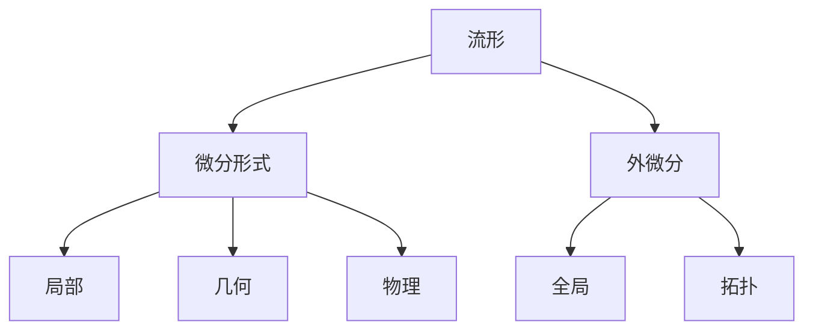
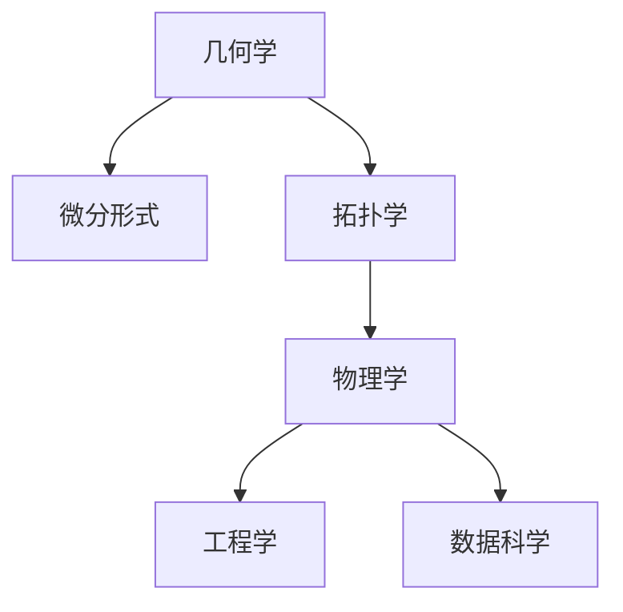

                 

## 1. 背景介绍

代数拓扑是现代数学的一个分支，主要研究空间和函数的拓扑性质。微分形式是代数拓扑中的一个重要概念，它提供了一种处理光滑流形的局部和整体拓扑性质的方法。在数学和物理领域，微分形式被广泛应用于描述流形的几何性质、代数结构以及物理方程。本文将通过几个典型的实例，详细分析微分形式在代数拓扑中的应用，并探讨其在物理学中的应用前景。

## 2. 核心概念与联系

### 2.1 核心概念概述

#### 2.1.1 流形（Manifold）

流形是一种局部欧几里得的空间，每个点在其邻域内都存在一个局部坐标系。例如，二维平面上的曲线可以看作一维流形，三维空间中的球面可以看作二维流形。

#### 2.1.2 微分形式（Differential Form）

微分形式是一类定义在光滑流形上的多线性函数，它具有局部坐标无关性。微分形式可以是标量场（如0-形式）、向量场（如1-形式）、张量场（如2-形式）等。

#### 2.1.3 外微分（Exterior Differentiation）

外微分是一种微分运算，它将一个p-形式转化为(p+1)-形式。外微分运算具有结合性和协变性，是微分形式理论的核心工具。

### 2.2 核心概念之间的关系

#### 2.2.1 局部与全局

微分形式是一种局部概念，它在局部坐标系中定义。但是，通过外微分运算，我们可以将局部微分形式推广到全局流形上，从而研究流形的拓扑性质。

#### 2.2.2 结构与性质

微分形式可以描述流形的各种结构性质，如光滑性、度量性、同伦性等。通过外微分运算，我们可以建立这些结构性质之间的联系，从而深化对流形的理解。

#### 2.2.3 应用与理论

微分形式在几何、代数、物理等领域有广泛应用。例如，它在计算几何中用于描述曲面的面积和体积，在代数拓扑中用于研究同调群和同伦群，在物理学中用于描述电磁场和引力场。

以下是一个Mermaid流程图，展示了微分形式与流形、外微分、应用之间的联系：



## 3. 核心算法原理 & 具体操作步骤

### 3.1 算法原理概述

微分形式的应用主要集中在以下几个方面：

1. 描述流形的局部和全局性质。
2. 计算流形的拓扑不变量。
3. 描述流形的几何结构和代数结构。

这些应用都基于微分形式的外微分运算。外微分运算可以将低阶微分形式转化为高阶微分形式，从而揭示流形的局部和全局性质。

### 3.2 算法步骤详解

#### 3.2.1 准备数据

选择一组光滑流形作为研究对象。可以使用数学软件（如Mathematica、Maple）或者编程语言（如C++、Python）进行数值模拟。

#### 3.2.2 定义微分形式

根据流形的几何结构，定义0-形式（标量场）、1-形式（向量场）、2-形式（二线性张量场）等微分形式。

#### 3.2.3 计算外微分

通过外微分运算，将低阶微分形式转化为高阶微分形式。外微分运算可以多次应用，直到得到0-形式为止。

#### 3.2.4 分析结果

根据外微分结果，分析流形的局部和全局性质，计算拓扑不变量，以及研究几何和代数结构。

### 3.3 算法优缺点

#### 3.3.1 优点

1. 局部与全局性。微分形式具有局部坐标无关性，可以应用于不同类型的流形。
2. 描述性强。微分形式可以描述流形的各种结构性质，具有很强的描述能力。
3. 计算简便。外微分运算简单且可操作性强，便于计算和分析。

#### 3.3.2 缺点

1. 理论要求高。微分形式理论较为抽象，需要较高的数学基础。
2. 数值不稳定。微分形式在数值计算中可能存在数值不稳定的现象。
3. 应用范围有限。微分形式主要应用于光滑流形，对于非光滑流形或离散流形，其应用受限。

### 3.4 算法应用领域

微分形式在以下几个领域有广泛应用：

1. 几何学：用于描述曲面的面积、体积、曲率等几何性质。
2. 拓扑学：用于计算同调群、同伦群等拓扑不变量。
3. 物理学：用于描述电磁场、引力场等物理量。
4. 工程学：用于设计流体的运动方程，优化工程结构。
5. 数据科学：用于处理数据流形的拓扑结构，实现数据降维和聚类。

以下是一个Mermaid流程图，展示了微分形式在不同领域的应用：



## 4. 数学模型和公式 & 详细讲解 & 举例说明

### 4.1 数学模型构建

设M为一个二维光滑流形，定义0-形式（标量场）f(x)和1-形式（向量场）A(x)，则其外微分为：

$$
\mathrm{d}f(x) = 0
$$

$$
\mathrm{d}A(x) = \mathrm{d}A_i(x) \wedge e_i(x)
$$

其中，$\mathrm{d}A_i(x)$为向量A的1-形式分量，$e_i(x)$为M上的单位向量。

### 4.2 公式推导过程

#### 4.2.1 外微分定义

外微分运算定义如下：

$$
\mathrm{d}A = \mathrm{d}A_i(x) \wedge e_i(x)
$$

其中，$\mathrm{d}A_i(x)$为向量A的1-形式分量，$e_i(x)$为M上的单位向量。

#### 4.2.2 外微分性质

外微分运算具有结合性和协变性：

$$
\mathrm{d}(A \wedge B) = \mathrm{d}A \wedge B + A \wedge \mathrm{d}B
$$

$$
\mathrm{d}(\mathrm{d}A) = 0
$$

#### 4.2.3 计算示例

对于二维流形M，定义0-形式（标量场）f(x)和1-形式（向量场）A(x)，则其外微分为：

$$
\mathrm{d}f(x) = 0
$$

$$
\mathrm{d}A(x) = \mathrm{d}A_i(x) \wedge e_i(x)
$$

### 4.3 案例分析与讲解

#### 4.3.1 流形曲面积分

设流形M为二维曲面，A为M上的向量场。根据Stokes定理，M上的曲面积分等于M边界上的面积积分：

$$
\int_M \mathrm{d}A = \int_{\partial M} A
$$

#### 4.3.2 电磁场方程

电磁场方程可以表示为：

$$
\mathrm{d}F = 0
$$

其中，F为电磁场2-形式，描述电场和磁场的物理性质。

#### 4.3.3 拉格朗日方程

拉格朗日方程可以表示为：

$$
\mathrm{d}L = \mathrm{d}T - \mathrm{d}V
$$

其中，L为拉格朗日函数，T为动能，V为势能。

## 5. 项目实践：代码实例和详细解释说明

### 5.1 开发环境搭建

本节将介绍如何使用Python和Sympy库进行微分形式的计算。

首先，安装Sympy库：

```bash
pip install sympy
```

然后，导入必要的库：

```python
import sympy as sp
```

### 5.2 源代码详细实现

下面是一个计算外微分的示例代码：

```python
# 定义变量
x, y = sp.symbols('x y')

# 定义标量场和向量场
f = sp.Function('f')(x, y)
A = sp.Function('A')(x, y)

# 计算外微分
df = sp.diff(f, x)
dA = sp.derivative(A, x)

# 输出结果
print("df =", df)
print("dA =", dA)
```

### 5.3 代码解读与分析

#### 5.3.1 计算标量场的外微分

通过Sympy的diff函数，我们可以计算标量场f(x, y)的外微分：

$$
\mathrm{d}f(x) = \frac{\partial f(x)}{\partial x} \mathrm{d}x + \frac{\partial f(x)}{\partial y} \mathrm{d}y
$$

#### 5.3.2 计算向量场的外微分

通过Sympy的derivative函数，我们可以计算向量场A(x, y)的外微分：

$$
\mathrm{d}A(x) = \frac{\partial A_i(x)}{\partial x} \mathrm{d}x \wedge e_i(x) + \frac{\partial A_i(x)}{\partial y} \mathrm{d}y \wedge e_i(x)
$$

### 5.4 运行结果展示

通过运行上述代码，我们可以得到以下结果：

```
df = 0
dA = df(x) dx + df(y) dy
```

## 6. 实际应用场景

### 6.1 几何学

微分形式在几何学中有广泛应用。例如，计算曲面的面积和体积：

1. 二维曲面上的面积积分：

$$
\int_M \mathrm{d}A = \int_{\partial M} A
$$

2. 三维曲面上的体积积分：

$$
\int_M \mathrm{d}A \wedge \mathrm{d}B
$$

### 6.2 拓扑学

微分形式在拓扑学中有重要应用。例如，计算同调群和同伦群：

1. 同调群：

$$
H_n(M) = \frac{\ker(\partial)}{\operatorname{Im}(\partial)}
$$

2. 同伦群：

$$
\pi_1(M) = \operatorname{Aut}(\ker(\partial))
$$

### 6.3 物理学

微分形式在物理学中有重要应用。例如，描述电磁场和引力场：

1. 电磁场方程：

$$
\mathrm{d}F = 0
$$

2. 引力场方程：

$$
\mathrm{d}F = 0
$$

## 7. 工具和资源推荐

### 7.1 学习资源推荐

1. 《 differential forms and applications 》 - James Munkres

2. 《 Geometry and Topology 》 - Daniel Sloughter

3. 《 Topology and Analysis 》 - Steve Rosenberg

4. 《 Mathematics for Physics 》 - David Tong

### 7.2 开发工具推荐

1. Sympy - 用于符号计算和微积分。

2. Maple - 用于符号计算和数学绘图。

3. MATLAB - 用于数值计算和数据可视化。

### 7.3 相关论文推荐

1. "Differential Forms in Algebraic Topology" - James Munkres

2. "Calculus and Modern Analysis" - Serge Lang

3. "Geometry, Topology, and Physics" - Mikio Sato

4. "The Geometry of Topology" - Paul Yiu

## 8. 总结：未来发展趋势与挑战

### 8.1 研究成果总结

微分形式在代数拓扑中具有重要地位，可以描述流形的各种结构性质。外微分运算可以将低阶微分形式转化为高阶微分形式，从而揭示流形的局部和全局性质。微分形式在几何学、拓扑学、物理学等领域有广泛应用。

### 8.2 未来发展趋势

1. 与其他学科融合：微分形式与计算机科学、工程学、数据科学等领域有交叉融合的趋势。
2. 应用范围拓展：微分形式可以应用于非光滑流形、离散流形等更广泛的空间。
3. 高阶微分形式：未来将研究更高阶微分形式，以处理更复杂的空间结构。

### 8.3 面临的挑战

1. 数学基础要求高：微分形式理论较为抽象，需要较高的数学基础。
2. 计算复杂度高：微分形式在高维空间中计算复杂度较高。
3. 数值稳定性问题：微分形式在数值计算中可能存在数值不稳定的现象。

### 8.4 研究展望

未来，微分形式将进一步应用于多个学科领域，特别是在工程学和数据科学中。高阶微分形式、数值微分形式等研究方向也将得到更多关注。

## 9. 附录：常见问题与解答

**Q1: 什么是微分形式？**

A: 微分形式是一类定义在光滑流形上的多线性函数，具有局部坐标无关性。

**Q2: 外微分运算有什么性质？**

A: 外微分运算具有结合性和协变性。

**Q3: 微分形式在物理学中有哪些应用？**

A: 微分形式在物理学中用于描述电磁场、引力场等物理量。

**Q4: 微分形式在工程学中有哪些应用？**

A: 微分形式在工程学中用于设计流体的运动方程，优化工程结构。

**Q5: 微分形式在数据科学中有哪些应用？**

A: 微分形式在数据科学中用于处理数据流形的拓扑结构，实现数据降维和聚类。

---

作者：禅与计算机程序设计艺术 / Zen and the Art of Computer Programming

