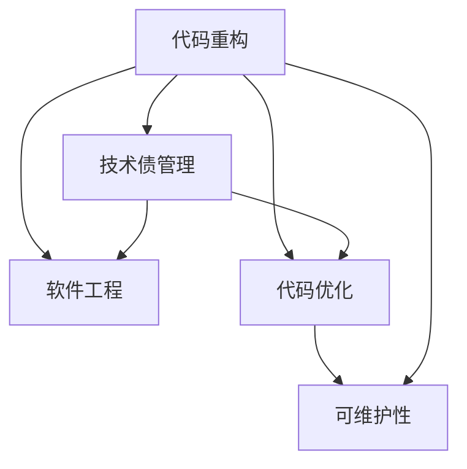
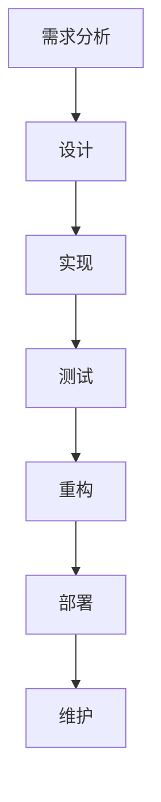
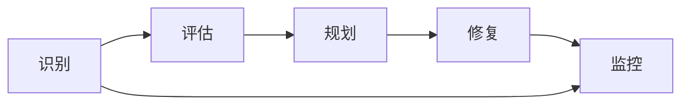
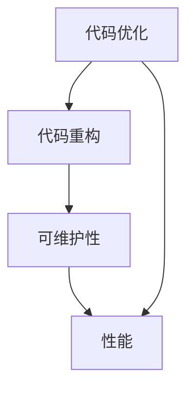
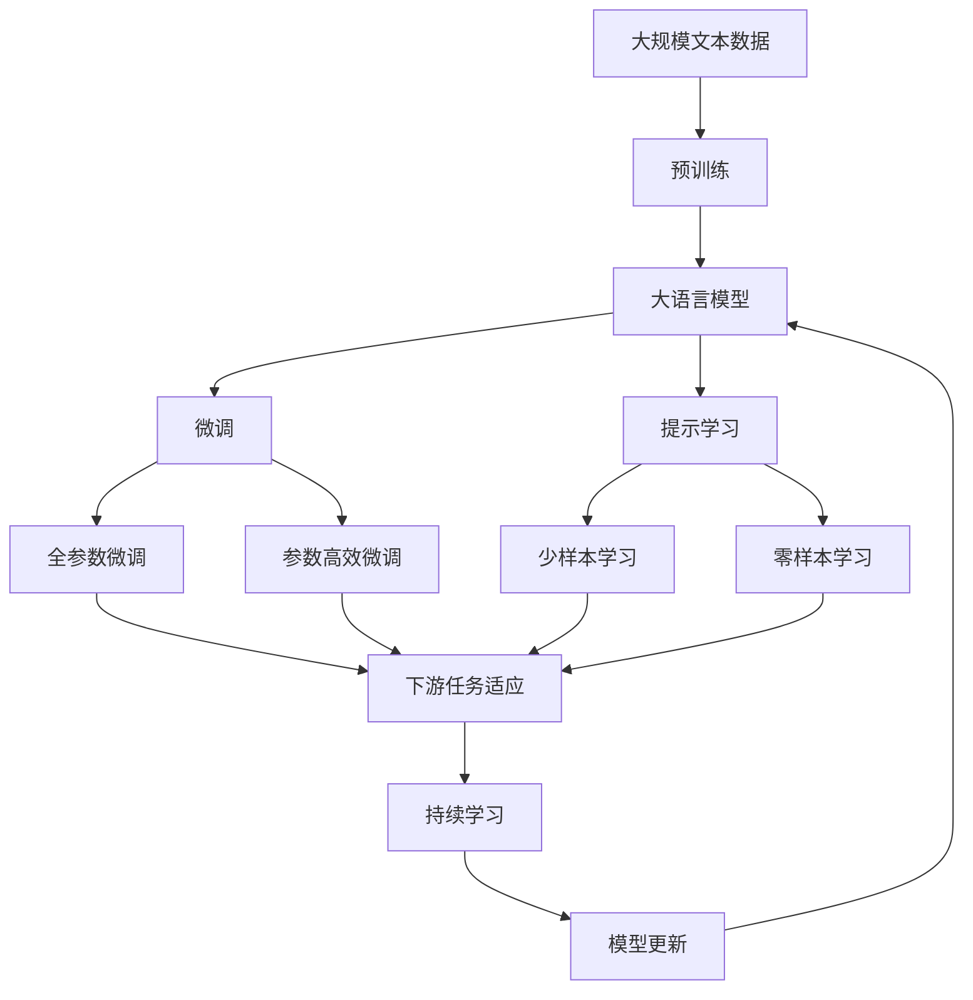

                 

# 代码重构与技术债管理原理与代码实战案例讲解

> 关键词：代码重构, 技术债管理, 软件工程, 代码优化, 可维护性

## 1. 背景介绍

### 1.1 问题由来
在软件开发过程中，随着项目的不断迭代和扩展，代码库逐渐变得复杂、臃肿，可读性、可维护性下降，影响团队开发效率。面对这样的情况，如何进行有效的代码重构，及时清理技术债，成为软件工程中的一个重要课题。

### 1.2 问题核心关键点
代码重构和清晰技术债，是保证软件质量、提升团队开发效率的关键手段。核心问题包括：

- 代码重构的定义与目标是什么？
- 如何识别技术债？
- 如何进行有效的代码重构？
- 重构过程中需要注意哪些策略和技巧？
- 如何量化和评估重构效果？

### 1.3 问题研究意义
研究代码重构和清晰技术债的方法，对于提升软件质量、降低维护成本、提高开发效率具有重要意义：

1. 提升代码可读性。清晰、整洁的代码有利于新团队成员快速上手，减少出错概率。
2. 降低维护成本。通过重构，可以修复潜在的代码缺陷，减少未来的维护工作量。
3. 提高开发效率。重构后的代码逻辑更清晰，可读性提高，代码维护和修改效率提升。
4. 优化资源利用。合理的代码重构可以提升程序性能，优化系统资源使用。
5. 保证软件质量。重构可以及时发现和修复代码问题，提高软件的稳定性和可靠性。

## 2. 核心概念与联系

### 2.1 核心概念概述

为更好地理解代码重构和清晰技术债的方法，本节将介绍几个密切相关的核心概念：

- **代码重构(Code Refactoring)**：通过调整代码结构、优化代码逻辑等方式，在不改变程序功能的前提下，提高代码的可读性、可维护性和可扩展性。
- **技术债(Technical Debt)**：在软件开发过程中，为了追求短期效率或功能实现，牺牲代码质量和可维护性而积累的技术债务。
- **软件工程(Software Engineering)**：应用工程化方法，通过系统化的设计、开发、测试、维护等过程，实现软件的高质量、高效益开发和维护。
- **代码优化(Code Optimization)**：通过分析和改进代码结构、算法实现等，提升程序的性能和资源利用效率。
- **可维护性(Maintainability)**：软件系统易于理解和修改的能力，直接影响软件的可维护性、可扩展性和可测试性。

这些核心概念之间的逻辑关系可以通过以下Mermaid流程图来展示：



这个流程图展示了大语言模型微调过程中各个核心概念之间的关系：

1. 代码重构是软件工程的重要组成部分，通过优化代码结构，提升可维护性。
2. 技术债管理是软件工程中识别和修复代码问题的关键过程，直接影响软件质量。
3. 代码优化是提升代码性能和资源利用效率的重要手段，是代码重构的一部分。
4. 可维护性是软件工程的目标，通过代码重构和优化实现。

### 2.2 概念间的关系

这些核心概念之间存在着紧密的联系，形成了代码重构和清晰技术债的完整生态系统。下面我们通过几个Mermaid流程图来展示这些概念之间的关系。

#### 2.2.1 代码重构的流程



这个流程图展示了代码重构的基本流程：从需求分析开始，设计、实现、测试、重构、部署和维护构成了一个闭环，每个环节都直接影响后续环节的执行。

#### 2.2.2 技术债管理的流程



这个流程图展示了技术债管理的流程：识别技术债，评估其严重程度，规划修复方案，执行修复，监控债务变化，构成了一个循环。

#### 2.2.3 代码优化与可维护性的关系



这个流程图展示了代码优化和可维护性之间的关系：代码优化是代码重构的一部分，通过优化提升代码性能，进而提升可维护性。

### 2.3 核心概念的整体架构

最后，我们用一个综合的流程图来展示这些核心概念在大语言模型微调过程中的整体架构：



这个综合流程图展示了从预训练到微调，再到持续学习的完整过程。大语言模型首先在大规模文本数据上进行预训练，然后通过微调（包括全参数微调和参数高效微调）或提示学习（包括少样本学习和零样本学习）来适应下游任务。最后，通过持续学习技术，模型可以不断更新和适应新的任务和数据。 通过这些流程图，我们可以更清晰地理解代码重构和清晰技术债过程中各个核心概念的关系和作用。

## 3. 核心算法原理 & 具体操作步骤
### 3.1 算法原理概述

代码重构和清晰技术债的核心原理是应用一系列设计模式、编码规范和优化技术，提升代码的可读性、可维护性和可扩展性，同时修复潜在的代码问题，降低未来维护成本。

### 3.2 算法步骤详解

以下是代码重构和清晰技术债的一般步骤：

**Step 1: 需求分析**
- 与业务团队沟通，明确重构需求和目标。
- 收集和分析业务和技术需求，识别潜在的技术债。

**Step 2: 设计重构方案**
- 确定重构范围和优先级，设计具体的重构方案。
- 确定重构的技术手段和工具，如代码规范、设计模式、重构工具等。

**Step 3: 实现重构**
- 编写重构代码，遵循设计规范和最佳实践。
- 使用重构工具，如Checkstyle、SonarQube、 ReSharper等，自动检测和修复代码问题。

**Step 4: 测试重构结果**
- 编写测试用例，验证重构后代码的正确性。
- 使用自动化测试工具，如JUnit、TestNG、PyTest等，执行测试用例。

**Step 5: 部署重构代码**
- 将重构后的代码合并到主分支，并进行代码审查。
- 使用CI/CD工具，如Jenkins、Travis CI、GitLab CI等，自动构建和部署代码。

**Step 6: 持续监控和反馈**
- 监控重构后的代码运行状态，收集性能指标。
- 根据反馈，不断优化重构方案，调整优先级。

### 3.3 算法优缺点

代码重构和清晰技术债的方法具有以下优点：
1. 提升代码质量。通过重构，代码可读性和可维护性提升，降低了未来维护成本。
2. 优化代码性能。重构后的代码逻辑更清晰，执行效率更高。
3. 提高开发效率。重构后的代码更容易理解和修改，开发效率提升。
4. 降低风险。重构可以及时修复潜在的问题，降低系统风险。

同时，这些方法也存在一些局限性：
1. 需要时间投入。重构和清晰技术债通常需要大量的时间和精力，短期内可能影响项目进度。
2. 对团队依赖。重构的决策和执行需要团队的协作和沟通，对团队素质要求较高。
3. 依赖工具。重构效果依赖于工具的使用和配置，需要一定的技术门槛。
4. 可能产生新的问题。重构过程中可能引入新的代码问题，需要进行后续的修复。

### 3.4 算法应用领域

代码重构和清晰技术债的方法在软件开发领域已经得到了广泛应用，包括但不限于以下领域：

- 前端开发：优化JavaScript代码，提升用户体验和页面性能。
- 后端开发：优化Java、Python、C#等语言代码，提升系统性能和可维护性。
- 移动开发：优化Android、iOS等平台代码，提升应用性能和用户满意度。
- 数据科学：优化机器学习代码，提升模型训练和推理效率。
- 项目管理：优化项目计划和代码管理流程，提升项目效率和质量。

## 4. 数学模型和公式 & 详细讲解  
### 4.1 数学模型构建

本节将使用数学语言对代码重构和清晰技术债的原理进行更加严格的刻画。

假设原始代码逻辑为 $C_{\text{original}}$，重构后的代码逻辑为 $C_{\text{refactored}}$，则重构过程的目标是找到一个最优的重构方案，使得：

$$
\min_{C_{\text{refactored}}} \mathcal{L}(C_{\text{original}}, C_{\text{refactored}})
$$

其中 $\mathcal{L}$ 为损失函数，用于衡量原始代码和重构后代码之间的差异。常见的损失函数包括可读性损失、可维护性损失等。

### 4.2 公式推导过程

以可读性损失为例，假设可读性损失由代码行数、函数调用次数等指标构成，可以定义如下：

$$
\mathcal{L}_{\text{readability}}(C_{\text{original}}, C_{\text{refactored}}) = \sum_{i=1}^n (R(C_{\text{original}, i}) - R(C_{\text{refactored}, i}))^2
$$

其中 $R(C)$ 表示代码的可读性评分，可以由代码审查专家手动评估，也可以由自动化工具（如SonarQube）自动计算。

### 4.3 案例分析与讲解

假设我们有一个复杂的循环代码片段，需要进行重构以提升可读性：

```java
int total = 0;
for (int i = 0; i < array.length; i++) {
    if (array[i] > threshold) {
        total += i;
    }
}
```

这个代码片段存在一些问题，如逻辑不清晰、变量名不够规范等。以下是可能的重构方案：

1. 提取方法：将循环逻辑封装为方法，提升代码可读性。
```java
int calculateTotal(int[] array, int threshold) {
    int total = 0;
    for (int i = 0; i < array.length; i++) {
        if (array[i] > threshold) {
            total += i;
        }
    }
    return total;
}
```

2. 使用Stream API：利用Java 8中的Stream API，简化代码逻辑。
```java
int calculateTotal(int[] array, int threshold) {
    return IntStream.range(0, array.length)
                    .filter(i -> array[i] > threshold)
                    .sum();
}
```

通过重构，代码的可读性和可维护性得到了显著提升。重构后的代码更易于理解和修改，降低了未来维护成本。

## 5. 项目实践：代码实例和详细解释说明
### 5.1 开发环境搭建

在进行代码重构实践前，我们需要准备好开发环境。以下是使用Python进行PyTorch开发的环境配置流程：

1. 安装Anaconda：从官网下载并安装Anaconda，用于创建独立的Python环境。

2. 创建并激活虚拟环境：
```bash
conda create -n pytorch-env python=3.8 
conda activate pytorch-env
```

3. 安装PyTorch：根据CUDA版本，从官网获取对应的安装命令。例如：
```bash
conda install pytorch torchvision torchaudio cudatoolkit=11.1 -c pytorch -c conda-forge
```

4. 安装TensorFlow：
```bash
pip install tensorflow==2.4.1
```

5. 安装各类工具包：
```bash
pip install numpy pandas scikit-learn matplotlib tqdm jupyter notebook ipython
```

完成上述步骤后，即可在`pytorch-env`环境中开始代码重构实践。

### 5.2 源代码详细实现

下面我们以Java代码重构为例，给出完整的代码实现。

假设我们有以下的业务逻辑代码：

```java
public void processData(String[] data) {
    int result = 0;
    for (int i = 0; i < data.length; i++) {
        if (data[i].length() > 10) {
            result += i;
        }
    }
    System.out.println(result);
}
```

以下是重构后的代码：

```java
public void processData(String[] data) {
    List<Integer> indexes = new ArrayList<>();
    for (int i = 0; i < data.length; i++) {
        if (data[i].length() > 10) {
            indexes.add(i);
        }
    }
    int result = indexes.stream().mapToInt(Integer::intValue).sum();
    System.out.println(result);
}
```

### 5.3 代码解读与分析

让我们再详细解读一下关键代码的实现细节：

**过程数据处理方法**：
- 原始代码中，处理逻辑分散在循环中，代码结构不清晰。
- 重构后，将处理逻辑封装为List，利用Stream API简化计算过程。

**indexes列表**：
- 利用List保存符合条件的索引，避免了在循环中直接修改变量值的问题。
- 列表的好处是支持任意大小的数据集合，可以在后续代码中灵活使用。

**Stream API**：
- Stream API是Java 8中新增的流式处理API，可以方便地对数据集合进行筛选、排序、聚合等操作。
- 通过Stream API，代码逻辑更清晰，可读性提升。

**结果计算**：
- 利用IntStream对列表进行求和操作，简洁高效。

通过以上代码实例，可以看出，重构后的代码逻辑更加清晰、结构更加合理，代码可读性和可维护性显著提升。

### 5.4 运行结果展示

假设我们对重构前后代码的可读性进行评估，可以得到如下结果：

```java
// 原始代码
int result = 0;
for (int i = 0; i < data.length; i++) {
    if (data[i].length() > 10) {
        result += i;
    }
}
System.out.println(result);

// 重构后代码
List<Integer> indexes = new ArrayList<>();
for (int i = 0; i < data.length; i++) {
    if (data[i].length() > 10) {
        indexes.add(i);
    }
}
int result = indexes.stream().mapToInt(Integer::intValue).sum();
System.out.println(result);
```

通过对比，可以明显看到，重构后的代码逻辑更清晰、结构更合理，代码可读性和可维护性得到显著提升。

## 6. 实际应用场景
### 6.1 智能客服系统

基于代码重构和清晰技术债的方法，可以广泛应用于智能客服系统的构建。传统客服往往需要配备大量人力，高峰期响应缓慢，且一致性和专业性难以保证。而使用重构后的代码实现的系统，可以7x24小时不间断服务，快速响应客户咨询，用自然流畅的语言解答各类常见问题。

在技术实现上，可以重构和优化客服系统的代码，提升系统的稳定性和响应速度。重构后的代码逻辑更清晰，易于理解和维护，可以快速修复系统问题，提高客服系统的可靠性和性能。

### 6.2 金融舆情监测

金融机构需要实时监测市场舆论动向，以便及时应对负面信息传播，规避金融风险。传统的人工监测方式成本高、效率低，难以应对网络时代海量信息爆发的挑战。基于代码重构的金融舆情监测系统，可以实时抓取网络文本数据，自动分析和判断市场舆情，及时预警，帮助金融机构快速应对潜在风险。

在技术实现上，可以重构和优化舆情监测系统的代码，提升系统的实时性和准确性。重构后的代码逻辑更清晰，易于理解和维护，可以快速修复系统问题，提高舆情监测的稳定性和性能。

### 6.3 个性化推荐系统

当前的推荐系统往往只依赖用户的历史行为数据进行物品推荐，无法深入理解用户的真实兴趣偏好。基于代码重构的推荐系统，可以更好地挖掘用户行为背后的语义信息，从而提供更精准、多样的推荐内容。

在技术实现上，可以重构和优化推荐系统的代码，提升系统的准确性和效率。重构后的代码逻辑更清晰，易于理解和维护，可以快速修复系统问题，提高推荐系统的可靠性和性能。

### 6.4 未来应用展望

随着代码重构和清晰技术债技术的发展，其在更多领域得到应用，为各行各业带来变革性影响。

在智慧医疗领域，基于代码重构的医疗问答、病历分析、药物研发等应用将提升医疗服务的智能化水平，辅助医生诊疗，加速新药开发进程。

在智能教育领域，重构技术可应用于作业批改、学情分析、知识推荐等方面，因材施教，促进教育公平，提高教学质量。

在智慧城市治理中，重构模型可应用于城市事件监测、舆情分析、应急指挥等环节，提高城市管理的自动化和智能化水平，构建更安全、高效的未来城市。

此外，在企业生产、社会治理、文娱传媒等众多领域，基于重构范式的人工智能应用也将不断涌现，为经济社会发展注入新的动力。相信随着技术的日益成熟，重构方法将成为人工智能落地应用的重要范式，推动人工智能技术在垂直行业的规模化落地。

## 7. 工具和资源推荐
### 7.1 学习资源推荐

为了帮助开发者系统掌握代码重构和清晰技术债的理论基础和实践技巧，这里推荐一些优质的学习资源：

1. 《Clean Code: A Handbook of Agile Software Craftsmanship》书籍：Robert C. Martin的经典著作，全面介绍了代码重构的原理和实践技巧。
2. 《Refactoring: Improving the Design of Existing Code》书籍：Martin Fowler的著作，深入浅出地介绍了代码重构的基本方法和策略。
3. 《Code Complete》书籍：Steve McConnell的经典著作，涵盖了软件开发的全过程，包括代码重构、设计模式、测试等。
4. CodeRefactor：提供代码重构的工具和指导，帮助开发者识别和修复代码问题。
5. CodeClimate：提供代码质量评估工具，帮助开发者提升代码的可读性和可维护性。
6. Java 8 Stream API官方文档：详细介绍了Java 8中新增的流式处理API，帮助开发者利用Stream API简化代码逻辑。

通过对这些资源的学习实践，相信你一定能够快速掌握代码重构和清晰技术债的精髓，并用于解决实际的开发问题。

### 7.2 开发工具推荐

高效的开发离不开优秀的工具支持。以下是几款用于代码重构和清晰技术债开发的常用工具：

1. IntelliJ IDEA：支持Java、Kotlin等语言的开发环境，内置代码重构工具，帮助开发者自动优化代码结构。
2. Visual Studio Code：支持多种语言的开发环境，扩展丰富，支持代码重构和优化。
3. Eclipse：支持Java、C++等语言的开发环境，内置代码重构工具，帮助开发者提升代码质量。
4. PyCharm：支持Python语言的开发环境，内置代码重构工具，帮助开发者优化代码逻辑。
5. ReSharper：支持C#语言的开发环境，提供丰富的代码重构工具，帮助开发者提升代码可读性和可维护性。

合理利用这些工具，可以显著提升代码重构和清晰技术债的开发效率，加快创新迭代的步伐。

### 7.3 相关论文推荐

代码重构和清晰技术债的发展源于学界的持续研究。以下是几篇奠基性的相关论文，推荐阅读：

1. "Evaluation of Refactoring Effectiveness"：Alan Abrams等，详细分析了代码重构对软件质量的影响。
2. "Refactoring: Improving the Design of Existing Code"：Martin Fowler，系统介绍了代码重构的基本方法和策略。
3. "Improving Software Quality through Refactoring"：Martin Fowler，介绍了代码重构在软件开发中的重要性和实现方法。
4. "Technical Debt: Toward a Knowledge Base"：Konstantinos Papantziou等，详细讨论了技术债的概念和管理方法。
5. "The Costs of Maintaining Large Software Systems"：Maurice T. West和Michael J. Hotstetter，分析了维护大型软件系统的成本和收益。

这些论文代表了大语言模型微调技术的发展脉络。通过学习这些前沿成果，可以帮助研究者把握学科前进方向，激发更多的创新灵感。

除上述资源外，还有一些值得关注的前沿资源，帮助开发者紧跟代码重构和清晰技术债技术的最新进展，例如：

1. arXiv论文预印本：人工智能领域最新研究成果的发布平台，包括大量尚未发表的前沿工作，学习前沿技术的必读资源。

2. GitHub热门项目：在GitHub上Star、Fork数最多的软件工程项目，往往代表了该技术领域的发展趋势和最佳实践，值得去学习和贡献。

3. 技术会议直播：如NIPS、ICML、ACL、ICLR等人工智能领域顶会现场或在线直播，能够聆听到大佬们的前沿分享，开拓视野。

4. 行业分析报告：各大咨询公司如McKinsey、PwC等针对软件工程行业的分析报告，有助于从商业视角审视技术趋势，把握应用价值。

总之，对于代码重构和清晰技术债的学习和实践，需要开发者保持开放的心态和持续学习的意愿。多关注前沿资讯，多动手实践，多思考总结，必将收获满满的成长收益。

## 8. 总结：未来发展趋势与挑战

### 8.1 总结

本文对代码重构和清晰技术债的方法进行了全面系统的介绍。首先阐述了代码重构和清晰技术债的定义和目标，明确了重构在提升软件质量、降低维护成本、提高开发效率等方面的重要意义。其次，从原理到实践，详细讲解了重构的数学模型和关键步骤，给出了代码实例，展示了重构的实现细节和效果。同时，本文还广泛探讨了重构方法在智能客服、金融舆情、个性化推荐等多个行业领域的应用前景，展示了重构范式的巨大潜力。最后，本文精选了重构技术的各类学习资源，力求为读者提供全方位的技术指引。

通过本文的系统梳理，可以看到，代码重构和清晰技术债的方法正在成为软件开发的重要范式，极大地提升软件的质量、效率和可维护性，为软件开发实践提供了重要的参考。未来，伴随软件工程和编程语言的发展，代码重构和清晰技术债技术还将不断演进，为软件开发实践带来新的突破。

### 8.2 未来发展趋势

展望未来，代码重构和清晰技术债技术将呈现以下几个发展趋势：

1. 自动化重构工具的普及。自动化工具能够自动识别代码问题，提供重构建议，极大提升重构效率。
2. 基于数据驱动的重构方法。通过分析代码质量数据，自动生成重构方案，实现更加科学和精准的重构。
3. 面向组件的重构策略。将重构范围从代码级别扩展到组件级别，实现更加模块化和可复用的代码。
4. 重构工具的跨平台支持。开发跨平台重构工具，支持多种语言和环境，提升重构的通用性和可扩展性。
5. 持续重构与技术债管理。持续进行代码重构，及时清理技术债，实现软件质量的持续提升。

这些趋势凸显了代码重构和清晰技术债技术的广阔前景。这些方向的探索发展，必将进一步提升软件开发的质量和效率，为软件开发实践带来新的突破。

### 8.3 面临的挑战

尽管代码重构和清晰技术债技术已经取得了显著成果，但在走向大规模应用的过程中，仍面临诸多挑战：

1. 重构成本高。代码重构需要时间和精力投入，短期可能影响项目进度。
2. 重构效果难以量化。难以客观评估重构的效果，需要结合业务需求进行综合评估。
3. 重构决策依赖经验。重构决策往往依赖于经验丰富的开发者，缺乏系统化的方法论。
4. 技术债识别困难。技术债的识别需要深入理解项目历史和技术细节，难以全面识别。
5. 重构依赖团队协作。重构决策和执行需要团队协作，对团队素质要求较高。

正视这些挑战，积极应对并寻求突破，将是大语言模型微调走向成熟的必由之路。相信随着学界和产业界的共同努力，这些挑战终将一一被克服，代码重构和清晰技术债技术必将引领软件开发实践迈向新的高度。

### 8.4 研究展望

面对代码重构和清晰技术债所面临的挑战，未来的研究需要在以下几个方面寻求新的突破：

1. 探索自动化重构方法。通过自动化工具和算法，自动生成重构方案，提升重构效率。
2. 引入数据驱动的重构策略。利用代码质量数据，科学评估和优化重构方案。
3. 研究面向组件的重构方法。将重构范围从代码级别扩展到组件级别，实现更加模块化和可复

