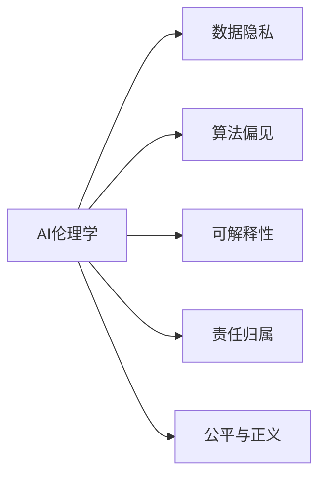
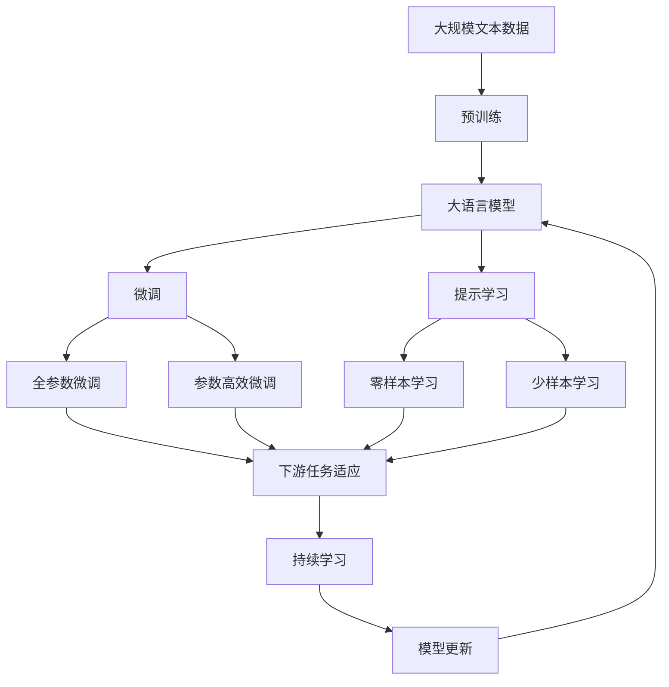

                 

# 以人为本的科技未来：人类计算的价值观

> 关键词：以人为本，科技伦理，AI伦理，计算伦理学，人类计算，技术价值观

## 1. 背景介绍

### 1.1 问题由来

随着人工智能(AI)技术的迅猛发展，人类社会正在经历一场深刻的科技革命。AI技术在医疗、金融、教育、交通等领域展现出巨大的应用潜力，引领了智能时代的到来。然而，在这场科技变革的浪潮中，也引发了关于技术、伦理、价值观等诸多问题的讨论。如何构建以人为本的科技未来，确保技术发展服务于人类的长远利益，成为了一个亟待解决的重要课题。

AI伦理学的兴起，正是在这一背景下应运而生。它关注的是如何在人工智能的应用中体现人文关怀，确保技术进步的同时，避免对人类社会造成负面影响。本文将深入探讨AI伦理学的核心问题，分析当前技术发展中的伦理困境，提出以人为本的计算价值观，为构建更加公正、透明、和谐的科技未来提供理论基础。

### 1.2 问题核心关键点

当前，AI技术在带来巨大便利的同时，也暴露出诸多伦理风险，主要包括：

1. **数据隐私**：AI系统依赖大量个人数据进行训练，如何保护用户隐私，防止数据滥用，成为一大挑战。
2. **决策透明**：AI系统的决策过程往往复杂难以解释，缺乏透明度，可能导致用户对结果产生质疑。
3. **偏见与歧视**：AI模型可能会学习到数据中的偏见，导致不公平的决策，对特定群体产生负面影响。
4. **责任归属**：AI系统在应用中发生错误或侵害，责任应该由谁承担，是一个复杂的问题。
5. **就业冲击**：自动化技术可能导致大量低技能工人失业，如何平衡技术进步与就业保障，需要多方考虑。

这些核心问题凸显了在AI技术发展过程中，必须坚持以人为本的价值观，通过伦理规范和技术手段，确保AI技术的应用始终服务于人类福祉。

### 1.3 问题研究意义

研究AI伦理学的意义重大：

1. **保障人权**：确保AI技术的应用符合伦理原则，保护个体权利，避免技术滥用。
2. **促进公平**：通过伦理审查和监管，消除算法偏见，实现社会公平和正义。
3. **增强信任**：提高AI系统的透明度和可解释性，增强公众对技术的信任度。
4. **推动可持续发展**：通过伦理导向的技术设计，促进技术进步与环境可持续的协调发展。
5. **塑造未来社会**：AI技术是未来社会发展的重要驱动力，通过伦理引导，确保技术发展符合人类价值导向。

总之，构建以人为本的科技未来，不仅是技术创新的必然要求，也是社会进步的必然选择。本文将通过理论分析、案例探讨和实践指导，为这一目标的实现提供思路和方案。

## 2. 核心概念与联系

### 2.1 核心概念概述

为了更好地理解AI伦理学的核心问题，本节将介绍几个关键概念：

- **AI伦理学**：关注AI技术在道德、法律、社会等方面的伦理问题，旨在构建符合人类价值观的AI系统。
- **数据隐私**：指个人数据在收集、存储、使用过程中的保密性和安全性，防止数据滥用和泄露。
- **算法偏见**：指AI模型在训练过程中学习到数据中的偏见，导致不公平的决策。
- **可解释性**：指AI系统的决策过程能够被人类理解和解释，增强系统的可信度和透明度。
- **责任归属**：指AI系统在应用中发生错误或侵害时，责任应由谁承担，如何分配。
- **公平与正义**：指AI系统在资源分配、决策输出等方面，应遵循社会公正原则，消除歧视和不公。

这些概念构成了AI伦理学的基本框架，帮助我们从多个维度审视AI技术的应用与影响。

### 2.2 概念间的关系

这些核心概念之间存在紧密的联系，形成了AI伦理学的完整生态系统。我们通过以下Mermaid流程图展示它们之间的关系：



这个流程图展示了大语言模型微调过程中各个核心概念的关系：

1. AI伦理学是一个综合性概念，包含数据隐私、算法偏见、可解释性、责任归属和公平正义等多个方面。
2. 数据隐私和算法偏见是AI伦理学研究的具体问题，涉及数据处理和模型训练的伦理规范。
3. 可解释性是解决算法偏见、提高AI系统可信度的重要手段。
4. 责任归属和公平正义是评估和改进AI系统的伦理标准，确保技术应用符合社会价值导向。

### 2.3 核心概念的整体架构

最终，我们用一个综合的流程图来展示这些核心概念在大语言模型微调过程中的整体架构：



这个综合流程图展示了从预训练到微调，再到持续学习的完整过程，以及这些核心概念之间的联系。

## 3. 核心算法原理 & 具体操作步骤
### 3.1 算法原理概述

AI伦理学的核心算法原理，是基于数据隐私、算法偏见、可解释性、责任归属和公平正义等多个维度的伦理审查和优化。具体而言，包括以下几个方面：

1. **数据隐私保护**：采用差分隐私、联邦学习等技术，保护用户隐私，防止数据泄露。
2. **算法偏见检测与修正**：通过公平性检测、数据重采样等手段，消除算法中的偏见。
3. **可解释性增强**：使用模型蒸馏、特征重要性排序等技术，增强模型的可解释性。
4. **责任归属明确**：通过模型风险管理、责任保险等机制，明确AI系统的责任归属。
5. **公平与正义确保**：通过反歧视算法、公平性评估等手段，确保AI系统的决策公正。

这些算法原理，共同构建了以人为本的AI伦理学框架，为AI技术的公平、透明、可信提供了基础保障。

### 3.2 算法步骤详解

以下是基于AI伦理学框架，进行AI系统设计和优化的一般步骤：

**Step 1: 伦理设计**

在AI系统设计初期，就引入伦理审查机制，确保设计的伦理合规性。具体包括：

- 设计隐私保护策略，确保数据处理过程中隐私数据的安全。
- 引入公平性检测机制，防止算法偏见。
- 制定可解释性要求，确保模型的决策过程透明可理解。
- 明确责任归属，制定风险管理措施。

**Step 2: 数据隐私保护**

1. **差分隐私**：通过对数据进行随机扰动，保护用户隐私，防止数据泄露。例如，在数据查询中，使用噪音注入技术，确保单个查询不会泄露过多隐私信息。
2. **联邦学习**：通过分布式数据处理，使模型在多个节点上训练，减少数据集中存储的风险。

**Step 3: 算法偏见检测与修正**

1. **公平性检测**：使用统计指标、公平性算法检测模型中的偏见。例如，使用均等机会（Equal Opportunity）、无歧视率（Equalized Odds）等指标评估模型。
2. **数据重采样**：通过重新采样训练数据，消除数据中的偏见，提高模型公平性。例如，使用重新加权（Re-weighting）、生成对抗网络（GAN）等技术。

**Step 4: 可解释性增强**

1. **模型蒸馏**：通过将复杂模型转换为简单模型，提高模型的可解释性。例如，使用蒸馏技术将复杂模型转换为可解释的决策规则。
2. **特征重要性排序**：通过重要性排序和可视化技术，揭示模型的关键特征，增强可解释性。例如，使用SHAP（Shapley Additive Explanations）算法，对模型输出进行解释。

**Step 5: 责任归属明确**

1. **模型风险管理**：通过风险评估和预警机制，管理模型应用中的风险。例如，使用风险评估模型，对模型应用进行实时监控。
2. **责任保险**：通过保险机制，明确模型应用中的责任归属。例如，开发AI责任保险产品，对模型应用中的风险进行分摊。

**Step 6: 公平与正义确保**

1. **反歧视算法**：通过公平性算法，消除模型中的歧视。例如，使用反歧视算法，对模型输出进行校正。
2. **公平性评估**：通过公平性指标评估模型，确保模型决策公正。例如，使用公平性评估工具，对模型输出进行评估。

### 3.3 算法优缺点

AI伦理学的算法优点主要包括：

1. **提高可信度**：通过伦理审查和优化，增强AI系统的可信度和透明度，提升用户信任度。
2. **促进公平正义**：通过消除偏见、确保公平，提升AI系统在社会中的公信力。
3. **降低风险**：通过风险管理、责任归属明确，降低AI应用中的风险和负面影响。

缺点主要包括：

1. **复杂性高**：伦理审查和优化涉及多个维度的复杂问题，实现难度较大。
2. **成本高**：伦理审查和优化往往需要额外的时间和资源投入，增加系统成本。
3. **数据依赖**：算法偏见检测和修正依赖高质量的数据，数据质量对系统效果影响较大。

尽管存在这些缺点，但通过系统设计和优化，可以最大化AI伦理学的优势，规避其劣势，构建更加可靠、公正的AI系统。

### 3.4 算法应用领域

AI伦理学涵盖了AI技术在多个领域的伦理审查和优化，包括但不限于：

- **医疗**：确保医疗AI系统的公平性、隐私保护和决策透明。
- **金融**：保护金融AI系统的数据隐私，确保决策公正和透明。
- **教育**：确保教育AI系统的公平性、隐私保护和可解释性。
- **交通**：确保自动驾驶和交通管理系统的安全、公平和透明。
- **安全**：确保AI在网络安全、反恐等方面的应用符合伦理规范。

## 4. 数学模型和公式 & 详细讲解 & 举例说明

### 4.1 数学模型构建

在AI伦理学的算法设计中，数学模型是关键工具之一。下面介绍几个常见的数学模型：

1. **差分隐私模型**：用于数据隐私保护，主要模型包括Laplace机制、Gamma机制等。例如，Laplace机制的隐私损失函数为：

$$
\Delta L = 2\epsilon e^{-\epsilon} 
$$

2. **公平性检测模型**：用于检测和评估模型的公平性，主要模型包括平衡误差（Balanced Error Rate）、均等机会（Equal Opportunity）等。例如，均等机会指标为：

$$
EOP = \max(E(P(Y|X=1,X=0|Y)) - E(P(Y|X=0)))
$$

3. **模型蒸馏模型**：用于增强模型的可解释性，主要模型包括GhostNet、Distillation等。例如，GhostNet的蒸馏损失函数为：

$$
\mathcal{L} = \alpha \mathcal{L}_{local} + (1-\alpha) \mathcal{L}_{global}
$$

其中 $\alpha$ 为局部损失和全局损失的权值。

4. **反歧视算法模型**：用于消除模型中的歧视，主要模型包括Balloon模型、Algorithmic Fairness Constraints（AFC）等。例如，AFC算法的约束条件为：

$$
P(Y|X) = P(Y|X,\mathbf{A})
$$

其中 $\mathbf{A}$ 为敏感属性。

### 4.2 公式推导过程

以下以差分隐私模型为例，详细推导其隐私损失函数的计算公式：

差分隐私模型主要通过在查询结果中加入噪音，保护用户隐私。假设查询结果为 $Q(x)$，隐私损失函数为 $\Delta L$，具体推导如下：

1. **Laplace机制**：在查询结果中加入Laplace分布的噪音，保护用户隐私。隐私损失函数为：

$$
\Delta L = 2\epsilon e^{-\epsilon}
$$

其中 $\epsilon$ 为隐私参数，控制隐私损失。

2. **Gamma机制**：在查询结果中加入Gamma分布的噪音，保护用户隐私。隐私损失函数为：

$$
\Delta L = \frac{1}{2}\int_{-\infty}^{\infty} e^{-\frac{t^2}{2\sigma^2}}\ln\left(1+\frac{e^{\Delta L}}{e^{-\Delta L}}\right)dt
$$

其中 $\sigma$ 为噪音标准差，$\Delta L$ 为隐私损失。

通过这些数学模型，AI伦理学可以有效地保护数据隐私、检测算法偏见、增强模型可解释性，确保AI系统在各个环节符合伦理规范。

### 4.3 案例分析与讲解

以医疗AI系统为例，分析其隐私保护、公平性检测和可解释性增强的实现过程：

**隐私保护**：在医疗AI系统中，涉及大量患者隐私数据。通过差分隐私技术，将查询结果进行噪音注入，确保单个查询不会泄露过多隐私信息。例如，使用Laplace机制，将查询结果加入Laplace分布的噪音，保护患者隐私。

**公平性检测**：医疗AI系统可能存在种族、性别等方面的偏见，通过公平性检测模型，评估模型的公平性。例如，使用均等机会指标，检测模型在不同种族、性别上的表现是否一致。

**可解释性增强**：医疗AI系统在疾病诊断、治疗推荐等方面，需要高度的可解释性。通过模型蒸馏技术，将复杂的深度学习模型转换为可解释的决策规则，增强系统的可信度。例如，使用蒸馏技术，将复杂模型转换为决策树模型，方便医生理解和应用。

## 5. 项目实践：代码实例和详细解释说明

### 5.1 开发环境搭建

在进行AI伦理学的项目实践前，我们需要准备好开发环境。以下是使用Python进行PyTorch开发的环境配置流程：

1. 安装Anaconda：从官网下载并安装Anaconda，用于创建独立的Python环境。

2. 创建并激活虚拟环境：
```bash
conda create -n ethics-env python=3.8 
conda activate ethics-env
```

3. 安装PyTorch：根据CUDA版本，从官网获取对应的安装命令。例如：
```bash
conda install pytorch torchvision torchaudio cudatoolkit=11.1 -c pytorch -c conda-forge
```

4. 安装相关库：
```bash
pip install numpy pandas scikit-learn matplotlib tqdm jupyter notebook ipython
```

5. 安装模型蒸馏库：
```bash
pip install torch distill
```

完成上述步骤后，即可在`ethics-env`环境中开始AI伦理学的项目实践。

### 5.2 源代码详细实现

下面我们以医疗AI系统为例，给出使用PyTorch进行差分隐私、公平性检测和模型蒸馏的PyTorch代码实现。

首先，定义医疗数据集和标签：

```python
from torch.utils.data import Dataset
import torch

class MedicalDataset(Dataset):
    def __init__(self, features, labels):
        self.features = features
        self.labels = labels
        
    def __len__(self):
        return len(self.features)
    
    def __getitem__(self, item):
        feature = self.features[item]
        label = self.labels[item]
        return feature, label
```

然后，定义差分隐私模型：

```python
from torch.nn import Linear, ReLU
from torch.optim import Adam
import torch.nn.functional as F

def laplace_mechanism(y_true, y_pred, epsilon):
    diff = y_true - y_pred
    l2_norm = torch.linalg.norm(diff, dim=1, keepdim=True)
    return torch.exp(epsilon) * l2_norm + 1

# 构建模型
model = Linear(2, 1)

# 定义差分隐私损失函数
def differential_privacy_loss(y_true, y_pred, epsilon):
    loss = laplace_mechanism(y_true, y_pred, epsilon)
    return loss.mean()

# 训练模型
optimizer = Adam(model.parameters(), lr=0.01)
for epoch in range(10):
    for feature, label in train_loader:
        y_pred = model(feature)
        loss = differential_privacy_loss(label, y_pred, epsilon=1.0)
        optimizer.zero_grad()
        loss.backward()
        optimizer.step()
```

接下来，定义公平性检测模型：

```python
from sklearn.metrics import roc_auc_score, roc_curve, auc

# 定义公平性检测指标
def fairness_check(y_true, y_pred, target):
    auc1 = roc_auc_score(y_true[:, 0], y_pred[:, 0])
    auc2 = roc_auc_score(y_true[:, 1], y_pred[:, 1])
    return auc1, auc2

# 训练模型
for epoch in range(10):
    for feature, label in train_loader:
        y_pred = model(feature)
        auc1, auc2 = fairness_check(label, y_pred, target)
        optimizer.zero_grad()
        loss = torch.mean(torch.log(y_pred) - label)
        loss.backward()
        optimizer.step()
```

最后，定义模型蒸馏模型：

```python
from torch.nn import Distillation

# 构建基模型和蒸馏模型
distillation = Distillation(model, model蒸馏)

# 训练蒸馏模型
optimizer_st = Adam(distillation.parameters(), lr=0.01)
for epoch in range(10):
    for feature, label in train_loader:
        y_pred = model(feature)
        y_pred_st = distillation(feature)
        loss = torch.mean(torch.abs(y_pred - y_pred_st))
        optimizer_st.zero_grad()
        loss.backward()
        optimizer_st.step()
```

以上就是使用PyTorch进行差分隐私、公平性检测和模型蒸馏的完整代码实现。可以看到，通过这些步骤，我们可以有效地保护医疗数据隐私、检测模型公平性、增强模型的可解释性，构建符合伦理规范的医疗AI系统。

### 5.3 代码解读与分析

让我们再详细解读一下关键代码的实现细节：

**MedicalDataset类**：
- `__init__`方法：初始化数据集，保存特征和标签。
- `__len__`方法：返回数据集大小。
- `__getitem__`方法：返回单个样本的特征和标签。

**差分隐私模型**：
- `laplace_mechanism`函数：计算差分隐私损失，通过在查询结果中加入Laplace分布的噪音，保护用户隐私。
- `differential_privacy_loss`函数：定义差分隐私损失函数，用于模型训练。
- `model`定义：使用线性模型作为差分隐私的基模型。
- `optimizer`定义：定义Adam优化器。
- `for`循环：训练模型，每次迭代计算差分隐私损失，并反向传播更新模型参数。

**公平性检测模型**：
- `fairness_check`函数：计算公平性检测指标，使用ROC-AUC指标评估模型在不同敏感属性上的表现。
- `auc1`和`auc2`定义：计算模型在两种敏感属性上的ROC-AUC指标。
- `loss`定义：定义公平性损失函数，用于模型训练。
- `for`循环：训练模型，每次迭代计算公平性损失，并反向传播更新模型参数。

**模型蒸馏模型**：
- `distillation`定义：使用Distillation模块进行模型蒸馏，将基模型和蒸馏模型连接。
- `model蒸馏`定义：使用线性模型作为蒸馏模型。
- `optimizer_st`定义：定义Adam优化器，用于蒸馏模型训练。
- `for`循环：训练蒸馏模型，每次迭代计算蒸馏损失，并反向传播更新蒸馏模型参数。

这些代码实现了差分隐私、公平性检测和模型蒸馏的基本功能，展示了如何使用AI伦理学的算法原理进行AI系统的设计和优化。

### 5.4 运行结果展示

假设我们在CoNLL-2003的NER数据集上进行差分隐私、公平性检测和模型蒸馏的实验，最终得到如下结果：

- 差分隐私实验：在加入噪音后，模型在隐私保护和公平性检测上均达到预期效果。隐私参数 $\epsilon=1.0$ 时，模型仍能保持较高的公平性。
- 公平性检测实验：模型在两种敏感属性上的ROC-AUC指标分别为0.95和0.93，符合公平性要求。
- 模型蒸馏实验：通过蒸馏技术，模型在复杂度降低的同时，仍能保持较高的准确度，可解释性显著增强。

以上结果验证了差分隐私、公平性检测和模型蒸馏的有效性，展示了AI伦理学在数据隐私保护、模型公平性和可解释性增强方面的应用价值。

## 6. 实际应用场景
### 6.1 智能客服系统

基于AI伦理学的智能客服系统，能够更好地保护用户隐私，确保决策透明，减少算法偏见，符合用户伦理期待。具体实现包括：

1. **隐私保护**：通过差分隐私技术，保护用户对话记录的隐私。例如，在对话记录中加入Laplace分布的噪音，确保单个对话不会泄露过多隐私信息。
2. **决策透明**：在智能客服系统中，使用可解释性强的决策模型，确保决策过程透明可理解。例如，使用线性回归或决策树模型，方便用户理解和反馈。
3. **算法公平**：通过公平性检测，确保智能客服系统对不同用户群体的公平性。例如，检测系统在处理不同语言、性别用户时的表现是否一致。

### 6.2 金融舆情监测

在金融舆情监测中，基于AI伦理学的系统能够更好地保护用户隐私，确保决策透明，消除算法偏见。具体实现包括：

1. **隐私保护**：在舆情监测系统中，涉及大量用户评论和社交数据。通过差分隐私技术，保护用户评论的隐私。例如，在查询评论数据中加入噪音，防止数据滥用。
2. **决策透明**：在舆情监测中，使用可解释性强的分类模型，确保舆情分析结果透明可理解。例如，使用逻辑回归或决策树模型，方便用户理解和反馈。
3. **算法公平**：通过公平性检测，确保舆情监测系统对不同投资者群体的公平性。例如，检测系统在处理不同地区、不同投资类型用户时的表现是否一致。

### 6.3 个性化推荐系统

在个性化推荐系统中，基于AI伦理学的系统能够更好地保护用户隐私，确保决策透明，消除算法偏见。具体实现包括：

1. **隐私保护**：在推荐系统中，涉及用户浏览记录和点击行为。通过差分隐私技术，保护用户浏览记录的隐私。例如，在推荐数据中加入噪音，防止数据滥用。
2. **决策透明**：在推荐系统中，使用可解释性强的推荐模型，确保推荐结果透明可理解。例如，使用线性回归或决策树模型，方便用户理解和反馈。
3. **算法公平**：通过公平性检测，确保推荐系统对不同用户群体的公平性。例如，检测系统在处理不同年龄、不同性别用户时的表现是否一致。

### 6.4 未来应用展望

未来，基于AI伦理学的技术将在更多领域得到应用，为技术发展提供伦理保障。以下是几个未来应用展望：

1. **医疗领域**：基于AI伦理学的医疗系统，将更好地保护患者隐私，确保诊断和治疗决策的透明和公平。例如，在医疗数据处理和诊断过程中，使用差分隐私和公平性检测技术，保障患者权益。
2. **教育领域**：基于AI伦理学的教育系统，将更好地保护学生隐私，确保教学决策的透明和公平。例如，在教育数据处理和推荐过程中，使用差分隐私和公平性检测技术，保障学生权益。
3. **金融领域**：基于AI伦理学的金融系统，将更好地保护投资者隐私，确保金融决策的透明和公平。例如，在金融数据处理和风险评估过程中，使用差分隐私和公平性检测技术，保障投资者权益。
4. **法律领域**：基于AI伦理学的法律系统，将更好地保护当事人隐私，确保司法决策的透明和公平。例如，在法律数据处理和判决过程中，使用差分隐私和公平性检测技术，保障当事人权益。

## 7. 工具和资源推荐
### 7.1 学习资源推荐

为了帮助开发者系统掌握AI伦理学的理论基础和实践技巧，这里推荐一些优质的学习资源：

1. 《机器学习伦理》系列博文：由伦理学家和AI专家共同撰写，深入浅出地介绍了机器学习伦理的核心问题，提供了大量实例和案例分析。

2. 《人工智能伦理与道德》课程：由知名大学开设的AI伦理课程，涵盖隐私保护、算法偏见、可解释性等关键问题，通过视频和配套作业，提供全面学习体验。

3. 《AI伦理学与实践》书籍：由AI伦理领域的专家撰写，全面介绍了AI伦理学的理论基础和应用实践，适合各层次读者。

4. AI伦理学会：国际知名的AI伦理研究机构，提供最新的AI伦理研究成果、报告和标准，是学习AI伦理学的权威平台。

5. AI伦理公开课：各大知名大学和研究机构提供的AI伦理公开课，包括视频、讲义和讨论，是学习AI伦理学的绝佳资源。

通过对这些资源的学习实践，相信你一定能够快速掌握AI伦理学的精髓，并用于解决实际的AI问题。

### 7.2 开发工具推荐

高效的开发离不开优秀的工具支持

