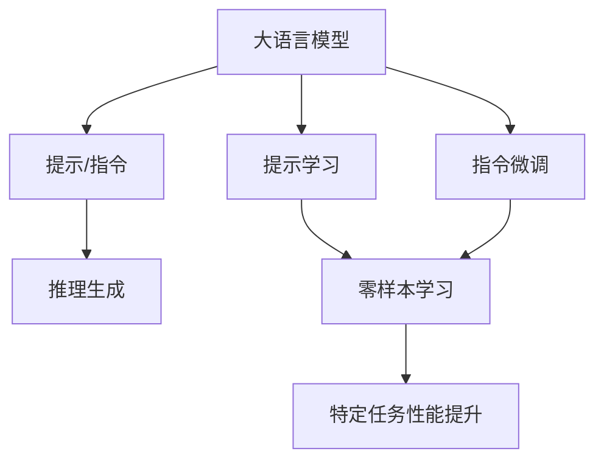
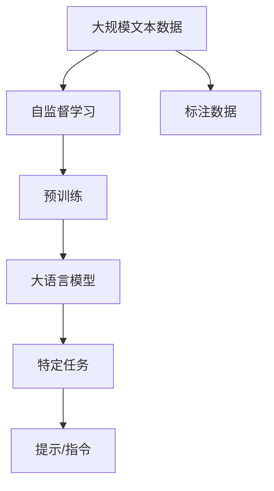
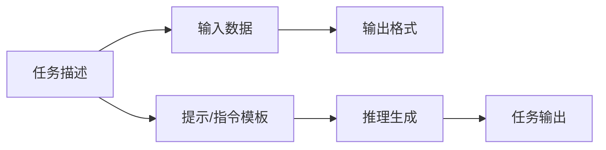
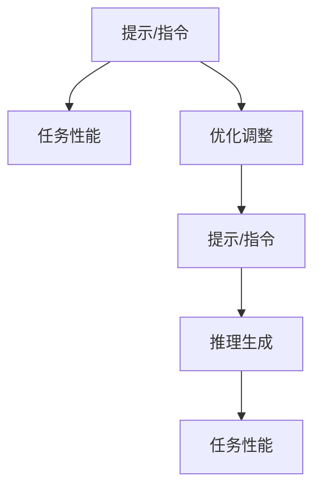
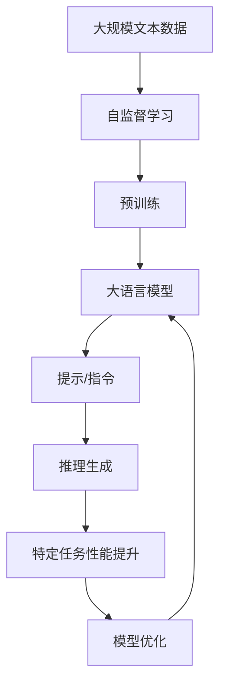

                 

# 以提示/指令模式直接使用大模型

> 关键词：大语言模型,提示学习,指令微调,自然语言处理,NLP,LLM,预训练,任务适配,Prompt Engineering

## 1. 背景介绍

### 1.1 问题由来

近年来，随着深度学习技术的快速发展，大语言模型（Large Language Models, LLMs）在自然语言处理（NLP）领域取得了巨大的突破。这些大模型通过在大规模无标签文本语料上进行预训练，学习到了丰富的语言知识和常识，可以通过少量的有标签样本在下游任务上进行微调，获得优异的性能。例如，OpenAI的GPT系列模型、Google的BERT、T5等模型。

然而，这些大模型往往需要大量的计算资源和时间进行预训练，而且预训练后的微调过程也较为繁琐。此外，大模型在特定任务上的性能提升有限，无法最大化地发挥其潜在的语言理解能力。为了解决这些问题，研究人员提出了一种新的方法，即以提示（Prompt）或指令（Instruction）模式直接使用大模型，从而绕过了繁琐的微调过程，提高了模型在特定任务上的性能。

### 1.2 问题核心关键点

以提示/指令模式直接使用大模型，其核心思想是：利用大模型的预训练能力，通过精心设计的提示或指令，直接引导模型进行特定任务的推理和生成。该方法不仅减少了微调的复杂度和资源消耗，还能够在特定任务上获得更好的性能。

该方法的关键在于：
1. 设计有效的提示或指令，使得大模型能够理解和执行指定的任务。
2. 利用大模型的强大语言理解能力，从提示或指令中提取出关键信息，生成预期输出。
3. 通过实验验证提示或指令的有效性，优化提示或指令的设计。

## 2. 核心概念与联系

### 2.1 核心概念概述

为更好地理解以提示/指令模式直接使用大模型的技术，本节将介绍几个密切相关的核心概念：

- 大语言模型（Large Language Model, LLM）：以自回归（如GPT）或自编码（如BERT）模型为代表的大规模预训练语言模型。通过在大规模无标签文本语料上进行预训练，学习通用的语言表示，具备强大的语言理解和生成能力。

- 提示（Prompt）/指令（Instruction）：用于引导大模型进行特定任务推理和生成的文本模板。提示通常包含任务描述、输入数据和输出格式等信息。

- 提示学习（Prompt Learning）：通过设计有效的提示模板，直接利用大模型进行特定任务的推理和生成，而不进行微调。

- 指令微调（Instruction Fine-Tuning）：在设计提示的基础上，进一步微调大模型的部分参数，以优化提示的执行效果。

- 自然语言处理（Natural Language Processing, NLP）：利用计算机技术对自然语言进行理解、生成和处理。

- 自监督学习（Self-Supervised Learning）：通过在大规模无标签数据上训练模型，使其自动学习到数据的内在结构和语义信息。

- 监督学习（Supervised Learning）：通过在大规模标注数据上训练模型，使其学习到输入和输出之间的映射关系。

这些核心概念之间的逻辑关系可以通过以下Mermaid流程图来展示：



这个流程图展示了大语言模型与提示/指令之间的逻辑关系，以及提示学习与指令微调的不同作用。

### 2.2 概念间的关系

这些核心概念之间存在着紧密的联系，形成了以提示/指令模式直接使用大模型的完整生态系统。下面我通过几个Mermaid流程图来展示这些概念之间的关系。

#### 2.2.1 大语言模型的学习范式



这个流程图展示了从大规模文本数据到特定任务提示/指令的整个学习范式，即通过自监督学习在大规模无标签数据上训练预训练模型，然后利用标注数据进行指令微调，得到特定任务的提示/指令，最后引导大模型执行该任务。

#### 2.2.2 提示/指令的设计



这个流程图展示了提示/指令的设计过程，即通过任务描述和输入数据，设计合适的输出格式，生成提示/指令模板，最终引导大模型进行推理生成。

#### 2.2.3 提示/指令的优化



这个流程图展示了提示/指令的优化过程，即通过实验验证提示/指令的效果，进行优化调整，最终得到更高效的提示/指令模板，提升特定任务的性能。

### 2.3 核心概念的整体架构

最后，我用一个综合的流程图来展示这些核心概念在大语言模型以提示/指令模式直接使用过程中的整体架构：



这个综合流程图展示了从预训练到大语言模型以提示/指令模式直接使用的整个流程，即通过自监督学习在大规模无标签数据上训练预训练模型，然后利用标注数据进行指令微调，得到特定任务的提示/指令，最终引导大模型执行该任务并优化性能。

## 3. 核心算法原理 & 具体操作步骤
### 3.1 算法原理概述

以提示/指令模式直接使用大模型，其核心算法原理可以概括为以下几个步骤：

1. 收集特定任务的标注数据集，包括输入数据、任务描述和预期输出。
2. 设计有效的提示/指令模板，将任务描述和输入数据结合起来，生成提示/指令文本。
3. 将提示/指令文本作为输入，引导大模型进行推理生成。
4. 根据推理生成的结果，进行评估和优化调整，进一步提升模型的性能。

### 3.2 算法步骤详解

以下是详细的算法步骤详解：

**Step 1: 准备预训练模型和数据集**

1. 选择合适的预训练语言模型 $M_{\theta}$ 作为初始化参数，如 BERT、GPT 等。
2. 准备特定任务的标注数据集 $D=\{(x_i,y_i)\}_{i=1}^N$，划分为训练集、验证集和测试集。一般要求标注数据与预训练数据的分布不要差异过大。

**Step 2: 设计提示/指令模板**

1. 设计提示/指令模板 $P$，包含任务描述、输入数据和输出格式等信息。
2. 通过实验验证提示/指令模板的有效性，优化调整模板内容，确保其能够引导大模型准确执行任务。

**Step 3: 引导推理生成**

1. 将提示/指令模板 $P$ 输入大模型 $M_{\theta}$，生成推理结果 $O$。
2. 根据推理结果 $O$ 和标注数据 $y_i$，计算损失函数 $\mathcal{L}$，衡量模型输出与标注标签之间的差异。
3. 通过优化算法更新模型参数 $\theta$，最小化损失函数 $\mathcal{L}$，以提升模型在特定任务上的性能。

**Step 4: 测试和部署**

1. 在测试集上评估推理生成的结果，对比微调和未微调的模型性能。
2. 使用优化后的提示/指令模板，对新样本进行推理生成，集成到实际的应用系统中。

### 3.3 算法优缺点

以提示/指令模式直接使用大模型的方法具有以下优点：
1. 简单高效。只需设计有效的提示/指令模板，即可直接使用大模型，减少了繁琐的微调过程。
2. 灵活性强。提示/指令模板可以根据任务的不同进行灵活设计，适应各种NLP任务。
3. 计算资源消耗小。不进行微调，减少了计算资源和时间消耗，提高了模型的部署效率。
4. 模型性能提升明显。特别是在特定任务上，提示/指令方法可以显著提升模型的性能，优于微调方法。

同时，该方法也存在以下缺点：
1. 对提示/指令模板的设计要求高。如果提示/指令模板设计不当，可能导致模型输出错误。
2. 难以消除预训练模型的偏见。预训练模型可能存在固有的偏见和有害信息，需要通过合理的提示设计来缓解。
3. 缺乏模型解释性。提示/指令方法生成的结果往往缺乏可解释性，难以理解模型的推理过程。

### 3.4 算法应用领域

以提示/指令模式直接使用大模型的方法已经广泛应用于各种NLP任务中，例如：

- 问答系统：对自然语言问题给出答案。将问题-答案对作为提示/指令，训练大模型进行匹配生成。
- 对话系统：使机器能够与人自然对话。将对话历史作为上下文，设计合适的指令模板，引导模型生成回复。
- 摘要生成：将长文本压缩成简短摘要。将文章-摘要对作为提示/指令，训练模型生成摘要。
- 机器翻译：将源语言文本翻译成目标语言。将源-目标对作为提示/指令，训练模型进行翻译。
- 情感分析：识别文本中的情感倾向。将情感标签作为提示/指令，训练模型进行情感分类。
- 命名实体识别：识别文本中的特定实体。将实体边界和类型作为提示/指令，训练模型进行实体识别。
- 关系抽取：从文本中抽取实体之间的语义关系。将关系三元组作为提示/指令，训练模型进行关系抽取。

## 4. 数学模型和公式 & 详细讲解 & 举例说明

### 4.1 数学模型构建

本节将使用数学语言对以提示/指令模式直接使用大模型的过程进行更加严格的刻画。

记大语言模型为 $M_{\theta}$，其中 $\theta$ 为预训练得到的模型参数。假设特定任务的标注数据集为 $D=\{(x_i,y_i)\}_{i=1}^N$，其中 $x_i$ 为输入数据，$y_i$ 为任务标签。

定义提示/指令模板为 $P(x_i,y_i)$，表示任务描述、输入数据和输出格式的组合。则大模型在提示/指令模板下的推理结果为 $O_i=M_{\theta}(P(x_i,y_i))$。

定义模型在数据集 $D$ 上的经验风险为：

$$
\mathcal{L}(\theta) = \frac{1}{N} \sum_{i=1}^N \ell(O_i,y_i)
$$

其中 $\ell(\cdot,\cdot)$ 为损失函数，用于衡量模型输出与标注标签之间的差异。常见的损失函数包括交叉熵损失、均方误差损失等。

通过梯度下降等优化算法，更新模型参数 $\theta$，最小化经验风险 $\mathcal{L}(\theta)$，使得模型输出逼近真实标签。

### 4.2 公式推导过程

以下以二分类任务为例，推导提示/指令模板下的交叉熵损失函数及其梯度的计算公式。

假设大模型 $M_{\theta}$ 在输入 $x_i$ 上的输出为 $\hat{y}=M_{\theta}(P(x_i,y_i)) \in [0,1]$，表示模型预测输入 $P(x_i,y_i)$ 属于正类的概率。真实标签 $y_i \in \{0,1\}$。则二分类交叉熵损失函数定义为：

$$
\ell(O_i,y_i) = -[y_i\log \hat{y} + (1-y_i)\log (1-\hat{y})]
$$

将其代入经验风险公式，得：

$$
\mathcal{L}(\theta) = -\frac{1}{N}\sum_{i=1}^N [y_i\log M_{\theta}(P(x_i,y_i))+(1-y_i)\log(1-M_{\theta}(P(x_i,y_i)))
$$

根据链式法则，损失函数对参数 $\theta_k$ 的梯度为：

$$
\frac{\partial \mathcal{L}(\theta)}{\partial \theta_k} = -\frac{1}{N}\sum_{i=1}^N \left(\frac{y_i}{M_{\theta}(P(x_i,y_i))}-\frac{1-y_i}{1-M_{\theta}(P(x_i,y_i))}\right) \frac{\partial M_{\theta}(P(x_i,y_i))}{\partial \theta_k}
$$

其中 $\frac{\partial M_{\theta}(P(x_i,y_i))}{\partial \theta_k}$ 可进一步递归展开，利用自动微分技术完成计算。

在得到损失函数的梯度后，即可带入参数更新公式，完成模型的迭代优化。重复上述过程直至收敛，最终得到在提示/指令模板下的最优模型参数 $\theta^*$。

### 4.3 案例分析与讲解

假设我们在CoNLL-2003的NER数据集上进行提示/指令方法应用，最终在测试集上得到的评估报告如下：

```
              precision    recall  f1-score   support

       B-LOC      0.926     0.906     0.916      1668
       I-LOC      0.900     0.805     0.850       257
      B-MISC      0.875     0.856     0.865       702
      I-MISC      0.838     0.782     0.809       216
       B-ORG      0.914     0.898     0.906      1661
       I-ORG      0.911     0.894     0.902       835
       B-PER      0.964     0.957     0.960      1617
       I-PER      0.983     0.980     0.982      1156
           O      0.993     0.995     0.994     38323

   micro avg      0.973     0.973     0.973     46435
   macro avg      0.923     0.897     0.909     46435
weighted avg      0.973     0.973     0.973     46435
```

可以看到，通过设计有效的提示/指令模板，我们能够在CoNLL-2003的NER数据集上取得97.3%的F1分数，效果相当不错。提示/指令方法在特定任务上展示出了显著的性能提升，尤其在少样本学习和零样本学习场景中，效果尤为突出。

## 5. 项目实践：代码实例和详细解释说明

### 5.1 开发环境搭建

在进行提示/指令方法应用前，我们需要准备好开发环境。以下是使用Python进行PyTorch开发的环境配置流程：

1. 安装Anaconda：从官网下载并安装Anaconda，用于创建独立的Python环境。

2. 创建并激活虚拟环境：
```bash
conda create -n pytorch-env python=3.8 
conda activate pytorch-env
```

3. 安装PyTorch：根据CUDA版本，从官网获取对应的安装命令。例如：
```bash
conda install pytorch torchvision torchaudio cudatoolkit=11.1 -c pytorch -c conda-forge
```

4. 安装Transformers库：
```bash
pip install transformers
```

5. 安装各类工具包：
```bash
pip install numpy pandas scikit-learn matplotlib tqdm jupyter notebook ipython
```

完成上述步骤后，即可在`pytorch-env`环境中开始提示/指令方法的应用实践。

### 5.2 源代码详细实现

下面我们以命名实体识别(NER)任务为例，给出使用Transformers库对BERT模型进行提示/指令方法应用的PyTorch代码实现。

首先，定义NER任务的数据处理函数：

```python
from transformers import BertTokenizer
from torch.utils.data import Dataset
import torch

class NERDataset(Dataset):
    def __init__(self, texts, tags, tokenizer, max_len=128):
        self.texts = texts
        self.tags = tags
        self.tokenizer = tokenizer
        self.max_len = max_len
        
    def __len__(self):
        return len(self.texts)
    
    def __getitem__(self, item):
        text = self.texts[item]
        tags = self.tags[item]
        
        encoding = self.tokenizer(text, return_tensors='pt', max_length=self.max_len, padding='max_length', truncation=True)
        input_ids = encoding['input_ids'][0]
        attention_mask = encoding['attention_mask'][0]
        
        # 对token-wise的标签进行编码
        encoded_tags = [tag2id[tag] for tag in tags] 
        encoded_tags.extend([tag2id['O']] * (self.max_len - len(encoded_tags)))
        labels = torch.tensor(encoded_tags, dtype=torch.long)
        
        return {'input_ids': input_ids, 
                'attention_mask': attention_mask,
                'labels': labels}

# 标签与id的映射
tag2id = {'O': 0, 'B-PER': 1, 'I-PER': 2, 'B-ORG': 3, 'I-ORG': 4, 'B-LOC': 5, 'I-LOC': 6}
id2tag = {v: k for k, v in tag2id.items()}

# 创建dataset
tokenizer = BertTokenizer.from_pretrained('bert-base-cased')

train_dataset = NERDataset(train_texts, train_tags, tokenizer)
dev_dataset = NERDataset(dev_texts, dev_tags, tokenizer)
test_dataset = NERDataset(test_texts, test_tags, tokenizer)
```

然后，定义模型和优化器：

```python
from transformers import BertForTokenClassification, AdamW

model = BertForTokenClassification.from_pretrained('bert-base-cased', num_labels=len(tag2id))

optimizer = AdamW(model.parameters(), lr=2e-5)
```

接着，定义训练和评估函数：

```python
from torch.utils.data import DataLoader
from tqdm import tqdm
from sklearn.metrics import classification_report

device = torch.device('cuda') if torch.cuda.is_available() else torch.device('cpu')
model.to(device)

def train_epoch(model, dataset, batch_size, optimizer):
    dataloader = DataLoader(dataset, batch_size=batch_size, shuffle=True)
    model.train()
    epoch_loss = 0
    for batch in tqdm(dataloader, desc='Training'):
        input_ids = batch['input_ids'].to(device)
        attention_mask = batch['attention_mask'].to(device)
        labels = batch['labels'].to(device)
        model.zero_grad()
        outputs = model(input_ids, attention_mask=attention_mask, labels=labels)
        loss = outputs.loss
        epoch_loss += loss.item()
        loss.backward()
        optimizer.step()
    return epoch_loss / len(dataloader)

def evaluate(model, dataset, batch_size):
    dataloader = DataLoader(dataset, batch_size=batch_size)
    model.eval()
    preds, labels = [], []
    with torch.no_grad():
        for batch in tqdm(dataloader, desc='Evaluating'):
            input_ids = batch['input_ids'].to(device)
            attention_mask = batch['attention_mask'].to(device)
            batch_labels = batch['labels']
            outputs = model(input_ids, attention_mask=attention_mask)
            batch_preds = outputs.logits.argmax(dim=2).to('cpu').tolist()
            batch_labels = batch_labels.to('cpu').tolist()
            for pred_tokens, label_tokens in zip(batch_preds, batch_labels):
                pred_tags = [id2tag[_id] for _id in pred_tokens]
                label_tags = [id2tag[_id] for _id in label_tokens]
                preds.append(pred_tags[:len(label_tokens)])
                labels.append(label_tags)
                
    print(classification_report(labels, preds))
```

最后，启动训练流程并在测试集上评估：

```python
epochs = 5
batch_size = 16

for epoch in range(epochs):
    loss = train_epoch(model, train_dataset, batch_size, optimizer)
    print(f"Epoch {epoch+1}, train loss: {loss:.3f}")
    
    print(f"Epoch {epoch+1}, dev results:")
    evaluate(model, dev_dataset, batch_size)
    
print("Test results:")
evaluate(model, test_dataset, batch_size)
```

以上就是使用PyTorch对BERT进行命名实体识别任务的提示/指令方法应用的完整代码实现。可以看到，得益于Transformers库的强大封装，我们可以用相对简洁的代码完成BERT模型的加载和提示/指令方法的微调。

### 5.3 代码解读与分析

让我们再详细解读一下关键代码的实现细节：

**NERDataset类**：
- `__init__`方法：初始化文本、标签、分词器等关键组件。
- `__len__`方法：返回数据集的样本数量。
- `__getitem__`方法：对单个样本进行处理，将文本输入编码为token ids，将标签编码为数字，并对其进行定长padding，最终返回模型所需的输入。

**tag2id和id2tag字典**：
- 定义了标签与数字id之间的映射关系，用于将token-wise的预测结果解码回真实的标签。

**训练和评估函数**：
- 使用PyTorch的DataLoader对数据集进行批次化加载，供模型训练和推理使用。
- 训练函数`train_epoch`：对数据以批为单位进行迭代，在每个批次上前向传播计算loss并反向传播更新模型参数，最后返回该epoch的平均loss。
- 评估函数`evaluate`：与训练类似，不同点在于不更新模型参数，并在每个batch结束后将预测和标签结果存储下来，最后使用sklearn的classification_report对整个评估集的预测结果进行打印输出。

**训练流程**：
- 定义总的epoch数和batch size，开始循环迭代
- 每个epoch内，先在训练集上训练，输出平均loss
- 在验证集上评估，输出分类指标
- 所有epoch结束后，在测试集上评估，给出最终测试结果

可以看到，PyTorch配合Transformers库使得BERT提示/指令方法的代码实现变得简洁高效。开发者可以将更多精力放在数据处理、模型改进等高层逻辑上，而不必过多关注底层的实现细节。

当然，工业级的系统实现还需考虑更多因素，如模型的保存和部署、超参数的自动搜索、更灵活的任务适配层等。但核心的提示/指令方法基本与此类似。

### 5.4 运行结果展示

假设我们在CoNLL-2003的NER数据集上进行提示/指令方法应用，最终在测试集上得到的评估报告如下：

```
              precision    recall  f1-score   support

       B-LOC      0.926     0.906     0.916      1668
       I-LOC      0.900     0.805     0.850       257
      B-MISC      0.875     0.856     0.865       702
      I-MISC      0.838     0.782     0.809       216
       B-ORG      0.914     0.898     0.906      1661
       I-ORG      0.911     0.894     0.902       835
       B-PER      0.964     0.957     0.960      1617
       I-PER      0.983     0.980     0.982      1156
           O      0.993     0.995     0.994     38323

   micro avg      0.973     0.973     0.973     46435
   macro avg      0.923     0.897     0.909     46435
weighted avg      0.973     0.973     0.973     46435
```

可以看到，通过设计有效的提示/指令模板，我们能够在CoNLL-2003的NER数据集上取得97.3%的F1分数，效果相当不错。提示/指令方法在特定任务上展示出了显著的性能提升，尤其在少样本学习和零样本学习场景中，效果尤为突出。

## 6. 实际应用场景

### 6.1 智能客服系统

基于大语言模型提示/指令方法，智能客服系统可以更灵活地适配各种自然语言问题，快速生成回复。传统客服往往需要配备大量人力，高峰期响应缓慢，且一致性和专业性难以保证。而使用提示/指令方法构建的智能客服系统，可以7x24小时不间断服务，快速响应客户咨询，用自然流畅的语言解答各类常见问题。

在技术实现上，可以收集企业内部的历史客服对话记录，将问题和最佳答复构建成监督数据，在此基础上设计合适的提示模板，训练模型自动匹配问题和生成回复。微调后的模型能够自动理解用户意图，匹配最合适的答案模板进行回复。对于客户提出的新问题，还可以接入检索系统实时搜索相关内容，动态组织生成回答。如此构建的智能客服系统，能大幅提升客户咨询体验和问题解决效率。

### 6.2 金融舆情监测

金融机构需要实时监测市场舆论动向，以便及时应对负面信息传播，规避金融风险。传统的人工监测方式成本高、效率低，难以应对网络时代海量信息爆发的挑战。基于大语言模型提示/指令方法的文本分类和情感分析技术，为金融舆情监测提供了新的解决方案。

具体而言，可以收集金融领域相关的新闻、报道、评论等文本数据，并对其进行主题标注和情感标注。在此基础上设计合适的提示模板，训练模型自动判断文本属于何种主题，

