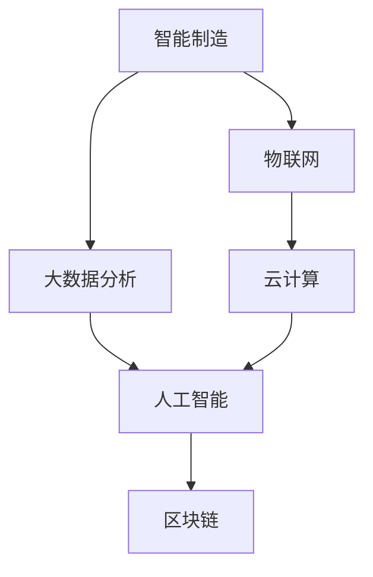

                 

## 1. 背景介绍

### 1.1 问题由来

随着信息时代的到来，数字经济已成为驱动全球经济增长的关键力量。然而，传统的工业生产和运营模式已难以适应数字化转型的需求，亟需借助新技术和新手段，提升生产效率、降低运营成本、优化产品和服务质量。在此背景下，新质生产力（New Quality Productivity）理念应运而生，旨在通过人工智能、物联网、区块链等先进技术，实现产业的数字化、智能化和可持续发展。

### 1.2 问题核心关键点

新质生产力主要关注如何利用先进技术，提升生产效率、质量、可定制化水平和创新能力，推动产业转型升级。其核心要点包括：

1. **数据驱动**：通过海量数据采集和分析，洞察生产运营中的痛点和改进空间。
2. **智能制造**：应用智能设备和系统，实现生产流程的自动化和优化。
3. **互联互通**：打破信息孤岛，实现人、机、物之间的无缝连接。
4. **持续创新**：基于用户反馈和市场变化，灵活调整产品和服务，提升创新速度。
5. **生态协同**：构建生态系统，促进上下游企业之间的合作与资源共享。

### 1.3 问题研究意义

新质生产力研究对于推动产业转型升级具有重要意义：

1. **提升效率**：通过技术革新，大幅度提升生产效率，降低运营成本，增强企业竞争力。
2. **改善质量**：利用智能监控和数据分析，及时发现并解决生产中的问题，提高产品质量。
3. **促进创新**：通过智能化和数据化，加速产品迭代和创新，满足市场多样化和个性化需求。
4. **绿色发展**：利用节能减排技术，推动绿色生产和可持续发展，实现人与自然的和谐共生。
5. **实现精准运营**：通过数字化转型，实现生产过程的可视化、可控化和智能化，提升管理水平。

## 2. 核心概念与联系

### 2.1 核心概念概述

新质生产力涉及诸多关键概念，包括：

- **智能制造**：通过智能化设备与系统，实现生产流程的自动化和优化。
- **物联网(IoT)**：利用传感器、通信技术，实现物理世界的数字化。
- **大数据分析**：对海量数据进行采集、存储和分析，挖掘其中的价值。
- **云计算**：通过弹性计算资源，支持数据存储和处理。
- **人工智能(AI)**：利用机器学习、深度学习等技术，提升决策和运营效率。
- **区块链**：利用分布式账本技术，实现数据透明和安全。

这些概念之间的联系通过以下Mermaid流程图展示：



### 2.2 概念间的关系

这些核心概念共同构成了新质生产力的应用框架，它们之间的关系可以总结如下：

1. **智能制造**：利用物联网和大数据，对生产流程进行实时监控和优化，提高生产效率和质量。
2. **物联网**：通过传感器和通信技术，实现设备与系统的互联，提供数据支持。
3. **大数据分析**：对生产数据进行分析，提取有价值的信息，为智能制造和决策提供依据。
4. **云计算**：提供弹性计算资源，支持大数据分析和高并发的AI模型训练。
5. **人工智能**：利用机器学习和深度学习算法，提升决策和运营效率。
6. **区块链**：确保数据透明和安全，提升信任度，促进生态合作。

这些概念相互依赖、相互促进，共同推动了新质生产力的发展。

## 3. 核心算法原理 & 具体操作步骤

### 3.1 算法原理概述

新质生产力的核心算法原理主要围绕数据驱动和智能决策展开。其基本流程包括：

1. **数据采集与预处理**：通过传感器、通信设备等，收集生产运营中的各种数据。
2. **数据存储与分析**：利用云计算平台，存储数据并进行实时或离线分析。
3. **智能决策与优化**：基于分析结果，利用人工智能算法进行决策和优化，如生产调度、设备维护等。
4. **实时监控与反馈**：利用物联网技术，实现生产过程的实时监控和反馈，优化生产流程。
5. **生态合作与协同**：通过区块链技术，促进上下游企业的信息共享与合作。

### 3.2 算法步骤详解

新质生产力的实现步骤如下：

1. **数据采集**：部署传感器和物联网设备，实时采集生产数据。
2. **数据清洗与存储**：使用ETL（Extract, Transform, Load）工具，对数据进行清洗和存储。
3. **模型训练**：利用大数据分析平台，训练机器学习或深度学习模型，用于预测和优化。
4. **智能决策**：基于模型预测结果，利用人工智能算法进行生产调度、质量控制等决策。
5. **实时监控**：利用物联网技术，实现生产过程的实时监控和反馈，优化生产流程。
6. **生态协同**：通过区块链技术，实现供应链和生态系统的信息透明和安全。

### 3.3 算法优缺点

新质生产力算法具有以下优点：

1. **高效性**：利用先进技术，大幅度提升生产效率和质量。
2. **智能化**：实现生产过程的自动化和智能化，减少人为干预。
3. **可定制化**：能够根据市场需求和用户反馈，灵活调整产品和生产过程。
4. **绿色环保**：通过节能减排技术，推动绿色生产和可持续发展。

但其也存在一些缺点：

1. **技术复杂性高**：需要集成多种先进技术，实施难度大。
2. **数据质量要求高**：需要高质量的数据才能保证算法的准确性和效果。
3. **投资成本高**：初期建设投入大，包括设备、平台和人员的投入。
4. **安全与隐私问题**：大量数据的收集和存储，可能面临数据安全与隐私保护的风险。

### 3.4 算法应用领域

新质生产力在多个领域具有广泛应用：

1. **制造业**：利用智能制造和物联网，实现生产流程的自动化和优化。
2. **农业**：通过物联网和大数据分析，优化种植和养殖过程，提高产量和质量。
3. **能源**：利用智能电网和大数据分析，实现能源的智能调度和管理。
4. **交通**：通过智能交通和大数据分析，优化交通流量和提升交通安全。
5. **金融**：利用区块链和大数据分析，提升金融交易的透明和安全。

## 4. 数学模型和公式 & 详细讲解

### 4.1 数学模型构建

新质生产力的数学模型主要涉及数据采集、存储、分析和应用等环节。以下是其中的关键数学模型：

1. **数据采集模型**：
   $$
   \begin{aligned}
   & \min_{x} \mathcal{L}(x) \\
   & \text{subject to:} \\
   & A_{\text{采集}} x = d \\
   & x \geq 0
   \end{aligned}
   $$
   其中，$d$ 为采集到的数据，$A_{\text{采集}}$ 为采集设备的参数矩阵，$x$ 为控制参数。

2. **数据存储模型**：
   $$
   \begin{aligned}
   & \min_{x} \mathcal{L}(x) \\
   & \text{subject to:} \\
   & A_{\text{存储}} x = s \\
   & x \geq 0
   \end{aligned}
   $$
   其中，$s$ 为存储的数据，$A_{\text{存储}}$ 为存储设备的参数矩阵，$x$ 为控制参数。

3. **数据分析模型**：
   $$
   \begin{aligned}
   & \min_{\theta} \mathcal{L}(\theta) \\
   & \text{subject to:} \\
   & A_{\text{分析}} x = a \\
   & x \geq 0
   \end{aligned}
   $$
   其中，$a$ 为分析结果，$A_{\text{分析}}$ 为分析算法的参数矩阵，$x$ 为控制参数。

4. **智能决策模型**：
   $$
   \begin{aligned}
   & \min_{\theta} \mathcal{L}(\theta) \\
   & \text{subject to:} \\
   & A_{\text{决策}} x = d' \\
   & x \geq 0
   \end{aligned}
   $$
   其中，$d'$ 为决策结果，$A_{\text{决策}}$ 为决策算法的参数矩阵，$x$ 为控制参数。

5. **实时监控模型**：
   $$
   \begin{aligned}
   & \min_{x} \mathcal{L}(x) \\
   & \text{subject to:} \\
   & A_{\text{监控}} x = m \\
   & x \geq 0
   \end{aligned}
   $$
   其中，$m$ 为监控数据，$A_{\text{监控}}$ 为监控设备的参数矩阵，$x$ 为控制参数。

6. **生态协同模型**：
   $$
   \begin{aligned}
   & \min_{x} \mathcal{L}(x) \\
   & \text{subject to:} \\
   & A_{\text{协同}} x = c \\
   & x \geq 0
   \end{aligned}
   $$
   其中，$c$ 为协同结果，$A_{\text{协同}}$ 为协同算法的参数矩阵，$x$ 为控制参数。

### 4.2 公式推导过程

以智能决策模型为例，其推导过程如下：

1. **输入数据处理**：将原始数据 $d$ 通过采集设备和传感器进行处理，得到中间数据 $x$。
2. **数据分析**：利用大数据分析算法，对中间数据 $x$ 进行分析，得到分析结果 $a$。
3. **模型训练**：利用机器学习或深度学习模型，对分析结果 $a$ 进行训练，得到模型参数 $\theta$。
4. **智能决策**：将模型参数 $\theta$ 输入智能决策算法，得到决策结果 $d'$。

### 4.3 案例分析与讲解

以智能制造为例，其数学模型和推导过程如下：

1. **数据采集**：通过传感器采集生产设备的运行数据，得到原始数据 $d$。
2. **数据存储**：将原始数据 $d$ 存储到云计算平台，得到中间数据 $x$。
3. **数据分析**：利用大数据分析算法，对中间数据 $x$ 进行分析，得到分析结果 $a$。
4. **模型训练**：利用机器学习或深度学习模型，对分析结果 $a$ 进行训练，得到模型参数 $\theta$。
5. **智能决策**：将模型参数 $\theta$ 输入智能决策算法，得到生产调度结果 $d'$。

## 5. 项目实践：代码实例和详细解释说明

### 5.1 开发环境搭建

要进行新质生产力的项目实践，首先需要搭建好开发环境。以下是Python和PyTorch开发环境的搭建流程：

1. **安装Anaconda**：从官网下载并安装Anaconda，用于创建独立的Python环境。
2. **创建虚拟环境**：
   ```bash
   conda create -n newprod python=3.8 
   conda activate newprod
   ```
3. **安装依赖包**：
   ```bash
   pip install numpy pandas torch transformers
   ```

### 5.2 源代码详细实现

以下是一个基于新质生产力的智能制造系统的Python代码实现：

```python
import numpy as np
import pandas as pd
from torch import nn, optim
from transformers import BertForSequenceClassification, BertTokenizer

# 读取数据
data = pd.read_csv('production_data.csv')

# 数据预处理
tokenizer = BertTokenizer.from_pretrained('bert-base-cased')
encoded_input = tokenizer(data['input'], truncation=True, padding='max_length', max_length=512)

# 数据编码
input_ids = [tokenizer.encode(text) for text in encoded_input]
labels = data['label'].map(lambda x: x == 'optimize').to(torch.int64)

# 定义模型
model = BertForSequenceClassification.from_pretrained('bert-base-cased', num_labels=2)
model.to('cuda')

# 定义优化器
optimizer = optim.Adam(model.parameters(), lr=1e-5)

# 训练模型
for epoch in range(10):
    model.train()
    optimizer.zero_grad()
    outputs = model(input_ids, labels=labels)
    loss = outputs.loss
    loss.backward()
    optimizer.step()
    print(f'Epoch {epoch+1}, Loss: {loss.item()}')

# 测试模型
model.eval()
with torch.no_grad():
    test_input = tokenizer('test input')
    test_input_ids = [tokenizer.encode(text) for text in test_input]
    test_labels = [1 if text.startswith('optimize') else 0 for text in test_input]
    outputs = model(test_input_ids)
    print(f'Test Accuracy: {np.mean(outputs.argmax(dim=1) == test_labels) * 100:.2f}%')
```

### 5.3 代码解读与分析

以上代码实现了基于BERT模型的新质生产力智能制造系统，其关键步骤如下：

1. **数据读取与预处理**：从CSV文件中读取生产数据，并进行分词编码。
2. **模型加载与优化器定义**：加载BERT模型，并定义优化器。
3. **模型训练**：通过训练循环，对模型进行前向传播和反向传播，更新模型参数。
4. **模型测试**：在测试集上进行模型评估，计算准确率。

## 6. 实际应用场景

### 6.1 智能制造

新质生产力在智能制造中的应用主要体现在以下几个方面：

1. **智能调度**：通过实时监控和数据分析，优化生产流程和设备调度，提升生产效率。
2. **质量控制**：利用传感器和大数据分析，及时发现并解决生产中的质量问题，提高产品质量。
3. **设备维护**：通过预测性维护，减少设备故障，降低维护成本。
4. **能耗优化**：利用智能电网和能源管理系统，优化能源使用，降低能耗和成本。

### 6.2 智慧农业

新质生产力在智慧农业中的应用主要体现在以下几个方面：

1. **精准种植**：利用传感器和大数据分析，优化种植方案，提高作物产量和质量。
2. **智能灌溉**：通过物联网技术，实时监测土壤湿度和气象条件，优化灌溉策略。
3. **病虫害监测**：利用图像识别和大数据分析，及时发现和防治病虫害，减少损失。
4. **农产品追溯**：通过区块链技术，实现农产品生产、加工和销售的全过程追溯，提高透明度和信任度。

### 6.3 智慧医疗

新质生产力在智慧医疗中的应用主要体现在以下几个方面：

1. **智能诊断**：利用图像识别和大数据分析，辅助医生进行疾病诊断，提高诊断准确率。
2. **个性化治疗**：基于患者数据和基因信息，制定个性化治疗方案，提升治疗效果。
3. **医疗管理**：通过智能医疗设备和系统，优化医院运营和管理，提高服务效率和质量。
4. **远程医疗**：利用智能设备和网络技术，实现远程医疗咨询和诊断，降低医疗成本。

## 7. 工具和资源推荐

### 7.1 学习资源推荐

为了帮助开发者掌握新质生产力的理论基础和实践技巧，以下是一些推荐的学习资源：

1. **《智能制造2025》白皮书**：全面介绍了智能制造的发展趋势和应用场景，是理解新质生产力的重要参考资料。
2. **《物联网应用开发实战》**：深入讲解了物联网技术的应用方法和实践案例，适合实战学习。
3. **《深度学习与大数据》**：介绍了深度学习和大数据分析的基本概念和应用案例，是学习新质生产力的基础课程。
4. **《区块链技术与应用》**：详细讲解了区块链技术的原理和应用场景，帮助理解新质生产力的生态协同环节。

### 7.2 开发工具推荐

高效的新质生产力开发离不开优秀的工具支持。以下是一些推荐的工具：

1. **Anaconda**：用于创建和管理Python环境，适合科学计算和数据处理。
2. **TensorFlow**：由Google主导的深度学习框架，支持多种模型和优化器，适合大数据分析和高并发的模型训练。
3. **PyTorch**：由Facebook开发的深度学习框架，支持动态计算图和灵活的模型构建，适合研究和实验。
4. **Keras**：基于TensorFlow和Theano等后端的高级深度学习框架，支持快速原型设计和模型训练。
5. **Jupyter Notebook**：用于编写和分享代码，支持Python、R、MATLAB等多种语言，适合学习和协作。

### 7.3 相关论文推荐

新质生产力的研究涉及多个学科，以下是一些推荐的论文：

1. **《智能制造的现状与未来》**：介绍了智能制造的发展历程和最新研究，提供了丰富的应用案例。
2. **《基于物联网的智慧农业》**：讲解了物联网在智慧农业中的应用方法和技术细节，适合实际应用开发。
3. **《深度学习在医疗诊断中的应用》**：介绍了深度学习在医疗图像识别和诊断中的应用，具有实际应用价值。
4. **《区块链技术在供应链中的应用》**：详细探讨了区块链在供应链中的价值和应用场景，是理解新质生产力的重要参考。

## 8. 总结：未来发展趋势与挑战

### 8.1 研究成果总结

本文对新质生产力的核心算法和操作步骤进行了详细介绍，同时通过代码实例和数学模型，展示了其实现方法和应用场景。新质生产力通过先进技术和数字化手段，实现了生产流程的自动化和优化，推动了产业转型升级。

### 8.2 未来发展趋势

未来，新质生产力将呈现以下几个发展趋势：

1. **技术融合创新**：随着技术的发展，新质生产力将更加注重跨领域技术的融合与创新，如AI与物联网、大数据、区块链等的结合，提升整体应用效果。
2. **场景深化拓展**：新质生产力将深入到更多垂直行业和具体场景，如智能交通、智慧教育、环保能源等，实现更加精细化的生产和管理。
3. **数据驱动决策**：基于大数据和智能分析，新质生产力将更加注重数据驱动的决策支持，提升生产效率和质量。
4. **可持续发展**：新质生产力将更加注重绿色环保和可持续发展，实现节能减排和低碳生产。

### 8.3 面临的挑战

尽管新质生产力具有广泛的应用前景，但其发展仍面临一些挑战：

1. **技术复杂性高**：新质生产力的实施涉及多种先进技术，实施难度大，需要多学科协同合作。
2. **数据质量要求高**：需要高质量的数据才能保证算法的准确性和效果，数据采集和处理需要投入大量资源。
3. **安全与隐私问题**：大量数据的收集和存储，可能面临数据安全与隐私保护的风险，需要严格的数据管理和保护措施。
4. **标准和规范缺失**：新质生产力领域的技术标准和规范尚未完全成熟，需要进一步完善和标准化。

### 8.4 研究展望

未来，新质生产力将面临更多的研究挑战和发展机遇：

1. **技术标准化**：制定统一的技术标准和规范，促进新质生产力的推广和应用。
2. **应用场景拓展**：深入研究新质生产力在更多垂直行业的应用，提升其实际应用效果。
3. **数据治理与隐私保护**：建立健全数据治理机制，加强数据隐私保护，确保数据安全与合规。
4. **跨领域技术融合**：推动人工智能、物联网、区块链等技术的深度融合，提升新质生产力的整体性能。

总之，新质生产力作为推动产业转型升级的重要力量，需要各方共同努力，克服技术挑战，实现技术创新和应用突破。相信在新技术和新思想的驱动下，新质生产力将迎来更加广阔的发展前景，为人类社会带来更多的价值和福祉。

## 9. 附录：常见问题与解答

**Q1: 新质生产力是否适用于所有行业？**

A: 新质生产力在制造业、农业、医疗、交通等领域具有广泛应用前景，但需要根据具体行业特点进行优化。例如，在制造业中，新质生产力主要应用于智能制造和精益生产；在医疗领域，主要应用于智能诊断和个性化治疗。

**Q2: 新质生产力的实施难度大，如何应对？**

A: 新质生产力的实施难度确实较大，需要多方协同合作。建议从以下几个方面入手：
1. **明确目标**：明确新质生产力的实施目标和应用场景，制定详细的实施计划。
2. **技术选型**：根据行业特点和业务需求，选择合适的技术和工具。
3. **人才培养**：建立跨学科的人才团队，提升团队的技术和业务能力。
4. **资源投入**：保证充足的资金和设备投入，支持项目的顺利实施。

**Q3: 新质生产力的数据质量要求高，如何保证？**

A: 数据质量是确保新质生产力效果的重要因素。建议从以下几个方面入手：
1. **数据采集**：使用高质量的数据采集设备和传感器，确保数据的时效性和准确性。
2. **数据清洗**：利用ETL工具对数据进行清洗和处理，去除噪声和异常值。
3. **数据存储**：采用高效的数据存储和管理方式，如云计算和大数据平台，确保数据的可靠性和可扩展性。
4. **数据安全**：建立严格的数据安全保护措施，确保数据隐私和安全。

**Q4: 新质生产力的投资成本高，如何降低？**

A: 新质生产力的实施成本确实较高，但可以通过以下几个方式降低：
1. **分阶段实施**：将项目分为多个阶段，逐步推进，降低初始投入。
2. **资源共享**：与上下游企业进行合作，共享资源和技术，降低整体成本。
3. **自动化工具**：利用自动化工具和平台，提升开发和部署效率，降低人工成本。
4. **试点项目**：在小规模试点项目中验证效果，积累经验，优化实施方案，减少后续投入。

**Q5: 新质生产力的实施过程中，如何应对数据安全与隐私问题？**

A: 数据安全与隐私是新质生产力实施过程中需要重点关注的问题。建议从以下几个方面入手：
1. **数据加密**：采用数据加密技术，保护数据在传输和存储过程中的安全。
2. **访问控制**：建立严格的访问控制机制，限制对数据的访问权限，防止数据泄露。
3. **数据匿名化**：对数据进行匿名化处理，降低数据隐私风险。
4. **合规审查**：遵守相关的数据隐私法规和标准，如GDPR、CCPA等，确保数据合规。

总之，新质生产力的实施需要多方协同合作，克服技术挑战，实现技术创新和应用突破。通过优化实施方案、降低成本、保护数据安全与隐私，新质生产力将迎来更加广阔的发展前景，为人类社会带来更多的价值和福祉。

