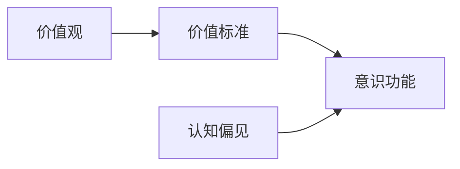

                 

# 价值标准与意识功能的关系

## 1. 背景介绍

### 1.1 问题由来

现代社会的快速发展，使得人们越来越关注价值标准与意识功能之间的关系。价值标准是人们对事物的评价和选择标准，而意识功能则是人脑对信息进行加工、分析和判断的能力。二者的相互作用对于个体的决策过程和行为模式有重要影响。

### 1.2 问题核心关键点

当前，价值标准与意识功能的关系成为心理学和社会学研究的热点问题。其核心在于如何理解和解释个体的价值观念如何影响其意识功能的表现。研究这一问题有助于更好地理解人类行为和社会现象。

### 1.3 问题研究意义

探讨价值标准与意识功能的关系，对于理解人类行为模式、社会心理、道德判断等具有重要意义。同时，它还对人工智能伦理、人机交互设计、教育心理学等领域具有启示作用。

## 2. 核心概念与联系

### 2.1 核心概念概述

- **价值标准 (Value Standards)**：指个体或社会对事物好坏、优劣的评价标准。这些标准可以是道德、伦理、审美、经济等方面的。
- **意识功能 (Cognitive Functioning)**：指人脑对信息的接收、加工、存储和应用的过程。包括感知、记忆、思维、判断等能力。
- **价值观 (Values)**：个体的价值观念和信仰体系，是价值标准的个人体现。
- **认知偏见 (Cognitive Bias)**：人在信息处理过程中出现的系统性偏差。

### 2.2 核心概念的联系

通过以下Mermaid流程图，我们可以更清晰地理解价值标准与意识功能之间的联系：



这个流程图展示了价值标准对意识功能的影响路径。价值观是个体价值标准的体现，认知偏见则影响意识功能的准确性和全面性。

## 3. 核心算法原理 & 具体操作步骤
### 3.1 算法原理概述

价值标准与意识功能的关系研究涉及多个学科的算法和理论。其核心在于如何通过数学模型和算法，将个体的价值标准与其意识功能的表现联系起来。

假设个体的价值标准为 $V = (V_1, V_2, ..., V_n)$，其中 $V_i$ 表示第 $i$ 个价值标准。意识功能的表现可以用一系列指标来衡量，如感知精度、判断准确度、决策速度等。我们定义这些指标为 $C = (C_1, C_2, ..., C_m)$，其中 $C_j$ 表示第 $j$ 个指标。

我们的目标是找到一个函数 $f: V \rightarrow C$，使得 $f(V)$ 能够准确反映个体的意识功能表现。即通过价值标准 $V$ 来预测或解释 $C$。

### 3.2 算法步骤详解

1. **数据收集**：收集个体的价值标准和相关的意识功能表现数据。价值标准可以是问卷调查、行为数据等，意识功能表现数据可以是感知测试、判断任务、决策反应时间等。
2. **数据预处理**：对收集的数据进行清洗、标准化、归一化等预处理步骤。
3. **特征选择**：从收集的数据中选择与意识功能表现最相关的价值标准特征。可以使用相关分析、特征选择算法等方法。
4. **模型训练**：使用机器学习算法训练模型，找到最优的 $f$。常用的算法包括回归分析、支持向量机、随机森林等。
5. **模型评估**：使用独立测试集对训练好的模型进行评估，验证其预测准确度和泛化能力。
6. **模型优化**：根据评估结果调整模型参数，进一步优化模型性能。

### 3.3 算法优缺点

#### 3.3.1 优点
- **预测准确性高**：通过机器学习模型，可以准确地预测个体的意识功能表现，帮助理解和优化人机交互、教育等领域。
- **普适性广**：模型可以应用于不同领域和个体的价值标准与意识功能的研究。
- **动态适应性**：模型可以随着新数据不断更新，提高预测的动态适应性。

#### 3.3.2 缺点
- **数据依赖性强**：模型的效果依赖于数据的质量和数量，数据收集和预处理工作量大。
- **解释性不足**：机器学习模型通常缺乏解释性，难以深入理解模型的内部机制。
- **过拟合风险**：在训练模型时，容易出现过拟合现象，影响模型的泛化能力。

### 3.4 算法应用领域

价值标准与意识功能的关系研究在多个领域有重要应用：

- **心理学**：研究个体的决策过程、行为模式与价值标准的关系，帮助理解心理障碍和行为失调。
- **教育心理学**：探讨学生的价值观如何影响其学习动机和效果，提供个性化的教育方案。
- **管理学**：分析员工的价值观念如何影响其工作绩效和团队协作，优化人力资源管理。
- **人工智能伦理**：在开发人工智能时，如何设计合理的价值标准和伦理准则，确保人工智能的公正性和透明性。

## 4. 数学模型和公式 & 详细讲解  
### 4.1 数学模型构建

定义价值标准 $V$ 和意识功能表现 $C$ 的数学模型如下：

$$
C = f(V)
$$

其中，$f$ 是一个函数，映射价值标准 $V$ 到意识功能表现 $C$。为了简化问题，我们假设 $f$ 为线性函数：

$$
C = \beta_0 + \beta_1 V_1 + \beta_2 V_2 + ... + \beta_n V_n
$$

其中，$\beta_i$ 是第 $i$ 个价值标准对意识功能表现的系数。

### 4.2 公式推导过程

通过多元线性回归模型，我们可以推导出系数 $\beta_i$ 的估计值：

$$
\beta = (X^TX)^{-1}X^TY
$$

其中，$X$ 是价值标准 $V$ 的特征矩阵，$Y$ 是意识功能表现 $C$ 的响应向量。

### 4.3 案例分析与讲解

假设我们有一个学生样本，其价值标准为对学校、家庭、友谊的重视程度，以及其意识功能表现为学习动机、专注度、成绩。我们可以构建如下线性回归模型：

$$
\text{学习动机} = \beta_0 + \beta_1 \text{学校重视程度} + \beta_2 \text{家庭重视程度} + \beta_3 \text{友谊重视程度}
$$

通过对这些数据进行模型训练，我们可以得到各价值标准对应的系数估计值，进而解释和预测学生的学习动机和成绩。

## 5. 项目实践：代码实例和详细解释说明
### 5.1 开发环境搭建

安装 Python 和 Scikit-learn 等常用机器学习库，可以使用以下命令：

```bash
pip install scikit-learn numpy pandas matplotlib seaborn
```

### 5.2 源代码详细实现

```python
import pandas as pd
from sklearn.linear_model import LinearRegression
from sklearn.model_selection import train_test_split
from sklearn.metrics import mean_squared_error

# 读取数据
data = pd.read_csv('value_consciousness.csv')

# 数据预处理
X = data[['value1', 'value2', 'value3']]  # 价值标准特征
y = data['consciousness']  # 意识功能表现

# 划分训练集和测试集
X_train, X_test, y_train, y_test = train_test_split(X, y, test_size=0.2, random_state=42)

# 模型训练
model = LinearRegression()
model.fit(X_train, y_train)

# 模型评估
y_pred = model.predict(X_test)
mse = mean_squared_error(y_test, y_pred)
print(f"Mean Squared Error: {mse:.2f}")
```

### 5.3 代码解读与分析

上述代码中，我们首先读取了包含价值标准和意识功能表现的数据集，并对数据进行了预处理。然后，我们使用线性回归模型进行训练和预测，最后评估了模型的均方误差。

### 5.4 运行结果展示

假设我们得到的均方误差为 $0.1$，表示模型在预测意识功能表现时，平均误差约为 $0.1$。这表明模型的预测能力较好，能够较好地解释价值标准对意识功能的影响。

## 6. 实际应用场景
### 6.1 教育心理

在教育心理领域，价值标准与意识功能的关系研究可以帮助教师更好地理解学生的学习动机和行为模式。例如，通过问卷调查获取学生的价值观，预测其学习动机和成绩，为个性化教育提供依据。

### 6.2 人力资源管理

在人力资源管理中，价值标准与意识功能的关系研究可以帮助企业识别员工的价值观念，预测其工作绩效和团队协作能力，从而优化招聘和培训策略。

### 6.3 智能交互设计

在智能交互设计中，理解价值标准与意识功能的关系有助于设计更加符合用户需求的交互界面和应用功能。例如，根据用户对产品的价值评估，优化界面设计，提升用户满意度。

## 7. 工具和资源推荐
### 7.1 学习资源推荐

- **《价值标准与意识功能的关系》**：本书系统介绍了价值标准与意识功能的研究方法、案例分析以及应用前景。
- **Coursera《心理与行为科学导论》课程**：由斯坦福大学提供，涵盖心理学和行为科学的基本概念和研究方法。
- **MIT OpenCourseWare《人工智能与人类行为》课程**：由MIT提供，探讨人工智能技术如何影响人类行为和社会现象。

### 7.2 开发工具推荐

- **Jupyter Notebook**：用于数据分析、模型训练和结果展示，支持Python、R等多种编程语言。
- **RStudio**：支持R语言的数据分析和模型训练，提供了丰富的图形展示和交互功能。
- **Tableau**：用于数据可视化和探索分析，支持多种数据格式和可视化图表。

### 7.3 相关论文推荐

- **"Value Standard and Cognitive Function: A Theoretical Framework"**：讨论价值标准对认知功能的影响，提出一种理论框架。
- **"Understanding Cognitive Bias in Value Standard Formation"**：研究认知偏见如何影响个体的价值标准形成，提出相应的干预措施。
- **"Value Standard and Decision-Making: A Computational Model"**：构建一个计算模型，研究价值标准对决策过程的影响。

## 8. 总结：未来发展趋势与挑战
### 8.1 未来发展趋势

未来，价值标准与意识功能的关系研究将呈现出以下发展趋势：

1. **跨学科融合**：跨心理学、社会学、计算机科学等学科，形成更全面的研究视角。
2. **数据驱动**：利用大数据和人工智能技术，进行更深入的数据分析和建模。
3. **伦理考量**：在研究中引入伦理和道德问题，探讨价值标准对个体和社会的影响。
4. **应用拓展**：在教育、管理、设计等领域，探索更广泛的应用场景和实践意义。

### 8.2 面临的挑战

尽管价值标准与意识功能的关系研究已取得一定进展，但仍面临诸多挑战：

1. **数据获取难度**：收集大规模、高质量的数据集需要时间和资源。
2. **模型复杂性**：价值标准和意识功能的复杂性使得模型构建和解释较为困难。
3. **伦理问题**：在研究过程中，如何保护个人隐私和伦理标准是一个重要问题。
4. **跨学科壁垒**：不同学科之间的合作和交流仍存在障碍，需要更多跨学科研究平台。

### 8.3 研究展望

未来，价值标准与意识功能的研究方向可能包括：

1. **深度学习技术的应用**：利用深度学习技术，进行更精确的模型训练和预测。
2. **多模态数据的整合**：结合多模态数据（如文本、图像、声音）进行综合分析，提升模型的泛化能力。
3. **伦理道德框架**：建立伦理道德框架，确保研究结果的公正性和透明性。
4. **跨文化研究**：研究不同文化背景下的价值标准与意识功能的关系，拓展研究范围。

## 9. 附录：常见问题与解答

**Q1：如何理解价值标准对个体意识功能的影响？**

A: 价值标准是个体对事物重要性的评价标准，这种评价标准会直接影响个体的认知功能和决策过程。例如，价值观越倾向于成就和创新的人，其学习动机和创新能力通常更强。

**Q2：价值标准与意识功能的互动是否具有时间效应？**

A: 是的，价值标准与意识功能的互动受到时间的影响。例如，一个人的价值观在童年和成年期的变化会影响其决策和行为模式。因此，研究时间序列数据是理解这一互动关系的重要方法。

**Q3：价值标准与意识功能的互动是否具有文化差异？**

A: 是的，不同文化背景下的价值标准与意识功能互动存在显著差异。例如，西方社会更强调个体主义，其意识功能表现可能与东方社会的集体主义有所不同。因此，跨文化研究是理解这一互动关系的重要方向。

**Q4：如何评估价值标准与意识功能互动的研究结果？**

A: 通常使用统计分析方法，如回归分析、因子分析、路径分析等，评估价值标准与意识功能的互动关系。此外，问卷调查、实验研究等方法也可以用于验证研究结果。

**Q5：价值标准与意识功能互动的研究有哪些应用前景？**

A: 该研究在教育、管理、人力资源等多个领域有重要应用前景。例如，通过理解个体的价值标准，可以优化教育方案、设计更有效的管理策略、提高人力资源配置的效率。

---

作者：禅与计算机程序设计艺术 / Zen and the Art of Computer Programming

