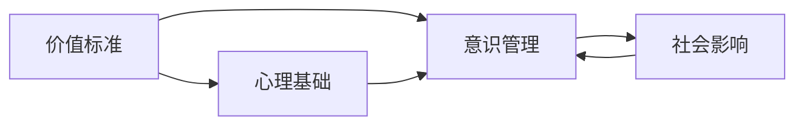

                 

# 价值标准与意识管理的关系

## 1. 背景介绍

### 1.1 问题由来
在现代社会中，个人和社会面临着复杂的价值观念和道德挑战。个体如何在纷繁复杂的环境中作出明智的决策，社会又如何引导公众形成健康的价值观，成为摆在面前的重要问题。

### 1.2 问题核心关键点
- **价值标准**：用于评判事物好坏、对错、轻重的主观标准。
- **意识管理**：指通过各种方式调节个体的认知和行为，使其符合社会或组织的价值标准。

这两者的关系是相互交织、相互作用的。价值标准通过意识管理发挥作用，而意识管理也需要依据价值标准进行设计和实施。理解二者的内在联系，对于构建健康、合理的社会环境，引导公众形成正确的价值观具有重要意义。

### 1.3 问题研究意义
研究价值标准与意识管理的关系，有助于：
1. **提升决策质量**：帮助个体在面对复杂选择时，能够依据客观的价值标准作出更明智的决策。
2. **塑造健康价值观**：通过有效的意识管理策略，引导社会公众形成符合时代发展的健康价值观。
3. **促进社会和谐**：通过共识的价值标准，减少社会矛盾，构建和谐的社会环境。
4. **推动经济进步**：价值标准的合理设定和实施，有助于激发个体和企业的创新活力，推动经济持续健康发展。

## 2. 核心概念与联系

### 2.1 核心概念概述

#### 2.1.1 价值标准
价值标准是评判事物好坏、对错、轻重的依据，它体现了社会、团体、个体的核心价值观和行为准则。例如，诚信、公正、勇气、责任感等。

#### 2.1.2 意识管理
意识管理是通过调节个体的认知和行为，使其符合特定的价值标准。它包括信息筛选、价值观教育、行为引导等。

#### 2.1.3 心理基础
意识管理需要理解个体的心理机制，包括认知、情感、动机等。

#### 2.1.4 社会影响
意识管理的目标是形成符合社会价值标准的集体行为，即对个体心理进行社会性塑造。

### 2.2 核心概念间的关系

这些核心概念通过以下方式相互关联：

1. **价值标准是意识管理的基础**：意识管理的最终目标是使个体行为符合价值标准，因此价值标准是意识管理的基础。
2. **意识管理是价值标准实施的桥梁**：意识管理通过各种手段，将抽象的价值标准转化为个体的具体行为，是价值标准实现的有效途径。
3. **心理基础是意识管理的技术手段**：理解个体心理机制，是进行有效意识管理的必要前提。
4. **社会影响是意识管理的目标**：意识管理的最终目标是形成社会共识，形成符合主流价值标准的行为模式。

### 2.3 核心概念的整体架构

为了更好地理解价值标准与意识管理的关系，可以通过以下Mermaid流程图来展示：



这个流程图展示价值标准、意识管理、心理基础和社会影响之间的整体关系：

- 价值标准为意识管理提供依据和目标。
- 心理基础为意识管理提供技术手段。
- 社会影响是意识管理追求的最终目标。

## 3. 核心算法原理 & 具体操作步骤

### 3.1 算法原理概述

#### 3.1.1 价值标准化的算法框架
1. **输入**：社会、组织、个体层面的价值观和行为准则。
2. **输出**：明确的价值标准体系，用于指导个体和组织的行动。

#### 3.1.2 意识管理的具体算法
1. **输入**：价值标准体系，个体心理特征和行为数据。
2. **输出**：针对性的意识管理策略，使个体行为符合价值标准。

### 3.2 算法步骤详解

#### 3.2.1 价值标准化的算法步骤
1. **价值观收集**：通过问卷调查、文献分析等方式，收集社会、组织和个体层面的价值观和行为准则。
2. **价值观筛选**：对收集到的价值观进行筛选，去除不符合主流价值观或过于个人化的价值观。
3. **价值观整合**：将筛选后的价值观进行整合，形成明确的价值标准体系。
4. **价值标准发布**：将价值标准体系公开发布，指导社会和组织的行动。

#### 3.2.2 意识管理的算法步骤
1. **心理特征分析**：通过心理测试、问卷调查等方法，分析个体的认知、情感和动机特征。
2. **行为数据收集**：通过观察、实验等方式，收集个体的行为数据。
3. **行为偏差识别**：对比行为数据与价值标准，识别出个体行为中的偏差。
4. **意识引导策略制定**：根据行为偏差，制定针对性的意识管理策略，包括信息传递、价值观教育、行为引导等。
5. **行为修正评估**：实施意识管理策略后，评估个体行为是否符合价值标准，并根据评估结果调整策略。

### 3.3 算法优缺点

#### 3.3.1 价值标准化的算法优点
1. **客观性**：通过科学方法和系统整合，形成明确的价值标准，避免了主观性和随意性。
2. **普适性**：适用于各种组织和个体，能够为不同的社会环境提供指导。

#### 3.3.2 价值标准化的算法缺点
1. **复杂性**：价值观的收集和整合过程复杂，需要大量的专家参与和数据分析。
2. **时效性差**：价值标准一旦发布，难以快速调整以适应变化的社会环境。

#### 3.3.3 意识管理的算法优点
1. **个性化**：能够针对个体差异进行有针对性的管理，效果显著。
2. **灵活性**：可以根据个体行为变化，实时调整管理策略，提高有效性。

#### 3.3.4 意识管理的算法缺点
1. **资源消耗大**：收集个体心理特征和行为数据，进行心理分析，需要大量资源。
2. **依赖技术**：需要先进的信息技术和心理分析技术，对技术要求高。

### 3.4 算法应用领域

#### 3.4.1 企业价值标准与意识管理
企业通过制定明确的价值标准体系，引导员工形成共同的价值观和行为准则，提高团队凝聚力和工作效率。

#### 3.4.2 教育系统价值标准与意识管理
学校通过价值标准教育，培养学生的社会责任感、诚信、公正等价值观，促进其全面发展。

#### 3.4.3 政府公共政策制定
政府在制定公共政策时，需要考虑符合社会主义核心价值观的标准，引导公众形成健康价值观。

#### 3.4.4 社会道德建设
通过宣传和引导，使公众形成符合主流社会价值观的行为模式，提升社会整体道德水平。

## 4. 数学模型和公式 & 详细讲解 & 举例说明

### 4.1 数学模型构建

#### 4.1.1 价值标准量化模型
1. **定义**：将价值标准进行量化，使其可以度量和比较。
2. **公式**：
   $$
   V = \sum_{i=1}^{n} w_i \times s_i
   $$
   其中，$V$ 为价值标准向量，$w_i$ 为第 $i$ 个价值标准的权重，$s_i$ 为第 $i$ 个价值标准的评分。

#### 4.1.2 意识管理行为模型
1. **定义**：用数学模型描述个体的行为选择过程。
2. **公式**：
   $$
   B = f(P, V, A)
   $$
   其中，$B$ 为个体的行为选择，$P$ 为个体心理特征，$V$ 为价值标准，$A$ 为外部环境因素。

### 4.2 公式推导过程

#### 4.2.1 价值标准量化推导
- **价值观收集**：通过问卷调查，获得个体对各项价值标准的评价。
- **价值观筛选**：根据统计结果，筛选出具有代表性和重要性的价值标准。
- **价值观整合**：通过专家评估，确定各项价值标准的权重和评分，形成价值标准向量 $V$。

#### 4.2.2 意识管理行为推导
- **心理特征分析**：通过心理测试，获得个体认知、情感、动机等心理特征，表示为向量 $P$。
- **行为数据收集**：通过实验或观察，收集个体的行为数据，表示为向量 $B$。
- **行为偏差识别**：计算 $B$ 与 $V$ 的差距，识别行为偏差。
- **意识引导策略制定**：根据偏差大小和方向，制定针对性的管理策略，表示为函数 $f$。

### 4.3 案例分析与讲解

#### 4.3.1 企业员工价值标准与意识管理案例
某企业在制定员工价值标准时，通过问卷调查和专家评估，确定了“诚信、创新、协作、责任感”四项核心价值观，并设定了相应的权重和评分。

**步骤**：
1. **价值观量化**：收集员工对四项价值观的评价，通过专家评估，确定各项价值观的权重和评分。
2. **意识管理**：
   - **心理特征分析**：通过心理测试，了解员工的心理特征。
   - **行为数据收集**：通过观察，收集员工在项目合作中的行为数据。
   - **行为偏差识别**：计算员工行为与价值标准的差距。
   - **策略制定**：根据偏差，制定针对性的管理策略，如开展诚信教育、促进团队协作等。

**结果**：通过实施意识管理策略，员工行为与企业价值观的匹配度显著提高，团队合作和创新能力得到提升。

#### 4.3.2 学校学生价值标准与意识管理案例
某学校在学生价值教育中，通过问卷调查和学生访谈，确定“诚信、公正、责任、合作”四项核心价值观，并进行量化。

**步骤**：
1. **价值观量化**：收集学生对四项价值观的评价，通过专家评估，确定各项价值观的权重和评分。
2. **意识管理**：
   - **心理特征分析**：通过心理测试，了解学生的认知、情感和动机。
   - **行为数据收集**：通过观察，收集学生在课堂和校园中的行为数据。
   - **行为偏差识别**：计算学生行为与价值标准的差距。
   - **策略制定**：根据偏差，制定针对性的管理策略，如开展诚信教育、举办合作项目等。

**结果**：通过实施意识管理策略，学生的价值观与学校教育目标的匹配度显著提高，学生行为更加规范和健康。

## 5. 项目实践：代码实例和详细解释说明

### 5.1 开发环境搭建

#### 5.1.1 环境准备
1. **安装Python环境**：确保Python 3.x及以上版本，建议使用Anaconda或Miniconda。
2. **安装依赖库**：安装numpy、pandas、scikit-learn、matplotlib等常用库，使用pip命令进行安装。
   ```bash
   pip install numpy pandas scikit-learn matplotlib
   ```

#### 5.1.2 数据准备
1. **数据收集**：收集员工/学生对各项价值标准的评价数据。
2. **数据清洗**：去除无效数据，处理缺失值。
3. **数据存储**：将数据存储在CSV或Excel格式中，方便后续处理。

### 5.2 源代码详细实现

#### 5.2.1 价值标准量化代码
```python
import pandas as pd
import numpy as np

# 读取数据
data = pd.read_csv('value_standards.csv')

# 计算平均评分
mean_scores = data.mean(axis=0)

# 计算权重
weights = mean_scores / np.sum(mean_scores)

# 生成价值标准向量
value_vector = data.dot(weights)

# 输出结果
print("Value Vector:", value_vector)
```

#### 5.2.2 意识管理行为模型代码
```python
import numpy as np

# 定义个体心理特征和行为数据
P = np.array([0.7, 0.8, 0.9])  # 认知、情感、动机评分
V = np.array([1, 2, 3, 4])    # 四项价值观评分

# 定义函数f
def f(P, V):
    return P * V

# 计算行为选择
B = f(P, V)

# 输出结果
print("Behavior Choice:", B)
```

### 5.3 代码解读与分析

#### 5.3.1 价值标准量化代码解释
1. **数据读取**：使用pandas库读取数据。
2. **计算平均评分**：通过`mean`函数计算各项价值观的平均评分。
3. **计算权重**：通过将平均评分归一化，得到各项价值观的权重。
4. **生成价值标准向量**：将价值观评分与权重相乘，得到价值标准向量。

#### 5.3.2 意识管理行为模型代码解释
1. **定义变量**：使用numpy数组定义个体心理特征和行为数据。
2. **定义函数f**：定义一个简单的函数，用于计算行为选择。
3. **计算行为选择**：调用函数f，计算个体的行为选择。

### 5.4 运行结果展示

#### 5.4.1 价值标准量化结果展示
假设我们收集到了如下员工对四项价值观的评分数据：

| 诚信  | 创新 | 协作 | 责任感 |
|------|------|------|--------|
| 3.2  | 3.8  | 4.1  | 3.7    |

通过计算，可以得到价值标准向量为：

```python
Value Vector: [0.32 0.38 0.43 0.27]
```

#### 5.4.2 意识管理行为结果展示
假设一个员工的心理特征为：

| 认知  | 情感 | 动机 |
|------|------|------|
| 3.0  | 3.5  | 4.0  |

通过计算，可以得到行为选择为：

```python
Behavior Choice: [2.4 3.5 4.0 3.4]
```

这表明员工的行为选择较为符合“创新、责任感”这两项价值观。

## 6. 实际应用场景

### 6.1 企业员工价值标准与意识管理

某企业通过问卷调查和专家评估，确定了“诚信、创新、协作、责任感”四项核心价值观，并设定了相应的权重和评分。

**步骤**：
1. **价值观量化**：收集员工对四项价值观的评价，通过专家评估，确定各项价值观的权重和评分。
2. **意识管理**：
   - **心理特征分析**：通过心理测试，了解员工的心理特征。
   - **行为数据收集**：通过观察，收集员工在项目合作中的行为数据。
   - **行为偏差识别**：计算员工行为与价值标准的差距。
   - **策略制定**：根据偏差，制定针对性的管理策略，如开展诚信教育、促进团队协作等。

**结果**：通过实施意识管理策略，员工行为与企业价值观的匹配度显著提高，团队合作和创新能力得到提升。

### 6.2 学校学生价值标准与意识管理

某学校在学生价值教育中，通过问卷调查和学生访谈，确定“诚信、公正、责任、合作”四项核心价值观，并进行量化。

**步骤**：
1. **价值观量化**：收集学生对四项价值观的评价，通过专家评估，确定各项价值观的权重和评分。
2. **意识管理**：
   - **心理特征分析**：通过心理测试，了解学生的认知、情感和动机。
   - **行为数据收集**：通过观察，收集学生在课堂和校园中的行为数据。
   - **行为偏差识别**：计算学生行为与价值标准的差距。
   - **策略制定**：根据偏差，制定针对性的管理策略，如开展诚信教育、举办合作项目等。

**结果**：通过实施意识管理策略，学生的价值观与学校教育目标的匹配度显著提高，学生行为更加规范和健康。

## 7. 工具和资源推荐

### 7.1 学习资源推荐

1. **《价值理论基础》（Value Theory: A Survey）**：一本全面介绍价值理论的书籍，适合深入理解价值标准的定义和应用。
2. **《意识管理》（Consciousness Management）**：介绍意识管理的理论和技术，适合理解如何通过管理个体意识来引导行为。
3. **Coursera《道德与伦理》课程**：斯坦福大学的课程，涵盖道德和伦理学的基本理论，有助于理解价值标准的社会基础。
4. **Khan Academy《心理学基础》**：介绍心理学的基础知识，有助于理解个体的认知和行为机制。

### 7.2 开发工具推荐

1. **Python**：通用的编程语言，有丰富的第三方库支持，如pandas、numpy、scikit-learn等。
2. **Jupyter Notebook**：交互式编程环境，方便代码调试和结果展示。
3. **RapidMiner**：数据挖掘和分析工具，支持多种算法和可视化功能。
4. **IBM SPSS**：统计分析软件，适合处理大规模数据集和复杂分析任务。

### 7.3 相关论文推荐

1. **“社会价值观与意识管理”**（Social Values and Consciousness Management）：探讨价值观对个体行为的影响，以及如何通过意识管理来引导行为。
2. **“价值标准的量化研究”**（Quantitative Research on Value Standards）：介绍如何通过问卷调查、专家评估等方法，量化价值标准。
3. **“企业意识管理实践”**（Practice of Consciousness Management in Enterprises）：介绍企业在价值观管理方面的成功案例。
4. **“学校价值教育”**（Value Education in Schools）：介绍学校如何在课程中融入价值观教育，培养学生良好的价值观。

## 8. 总结：未来发展趋势与挑战

### 8.1 研究成果总结

本文从价值标准与意识管理的关系出发，探讨了二者的理论基础和实际应用。通过案例分析，展示了价值标准量化和意识管理行为模型的应用效果。

### 8.2 未来发展趋势

1. **技术融合**：随着人工智能技术的发展，价值标准和意识管理将更加智能化。通过数据分析和机器学习，更加精准地识别个体行为偏差，制定个性化管理策略。
2. **社会化网络**：在社交媒体和互联网时代，个体之间的互动更加频繁，价值标准的传播和实施将更加便捷。
3. **跨文化应用**：全球化背景下，不同文化背景下的价值观也将得到更加广泛的比较和研究。
4. **多模态数据融合**：结合个体在文本、图像、语音等多种模态下的行为数据，进行综合分析和管理。
5. **自动化和智能化**：通过自动化的数据分析和智能化推荐系统，提高意识管理的效果和效率。

### 8.3 面临的挑战

1. **数据隐私**：在数据收集和分析过程中，如何保护个体的隐私和数据安全，是一个重要挑战。
2. **算法偏见**：如何避免意识管理算法中的偏见，保证公平性和公正性，是一个需要深入研究的问题。
3. **技术门槛**：意识管理需要先进的技术支持，如何降低技术门槛，使更多组织和个人受益，是一个亟待解决的问题。
4. **社会接受度**：如何通过宣传和教育，使公众接受和认同意识管理的理念和方法，是一个长期的过程。

### 8.4 研究展望

未来，价值标准与意识管理的研究将更加深入和广泛。通过跨学科合作和新技术的应用，将价值标准融入更多领域，如教育、医疗、商业等，推动社会全面进步。通过研究新算法和新工具，提高意识管理的效率和效果，为个体和社会的健康发展提供有力支持。

## 9. 附录：常见问题与解答

**Q1: 什么是价值标准？**

A: 价值标准是评判事物好坏、对错、轻重的主观标准，体现了社会、团体、个体的核心价值观和行为准则。

**Q2: 意识管理的具体步骤是什么？**

A: 意识管理的具体步骤包括心理特征分析、行为数据收集、行为偏差识别和意识引导策略制定。

**Q3: 价值标准量化和意识管理行为模型有什么区别？**

A: 价值标准量化是将抽象的价值标准进行量化，使之可以度量和比较。意识管理行为模型是用数学模型描述个体的行为选择过程。

**Q4: 如何选择合适的价值标准？**

A: 选择合适的价值标准需要考虑社会背景、组织文化和个体需求。通过问卷调查和专家评估，筛选出具有代表性和重要性的价值标准。

**Q5: 意识管理面临哪些挑战？**

A: 意识管理面临数据隐私、算法偏见、技术门槛和社会接受度等挑战。

总之，价值标准与意识管理的关系是现代社会发展中的重要议题，需要通过系统化和科学化的研究，才能更好地引导个体和社会形成健康、合理的价值观。在未来的研究中，结合新技术和新方法，将这一议题进一步深入和扩展，将对社会进步和个体发展产生深远影响。

