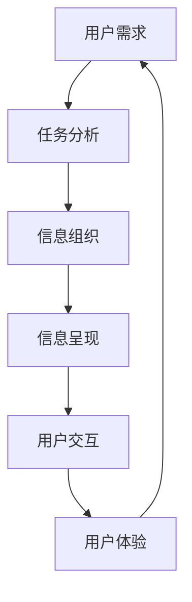

                 

## 1. 背景介绍

随着信息时代的到来，数据量呈指数级增长，信息架构（IA）在理解和组织这些数据方面的重要性愈发凸显。如何高效、准确地设计信息架构，成为数据管理、知识管理和用户体验设计的关键问题。任务导向设计（Task-Oriented Design, TOD）作为一种以用户任务为中心的设计范式，正在越来越多地被引入信息架构设计中，以提升信息系统的可用性和效率。本文将深入探讨任务导向设计对信息架构的影响，包括其基本原理、操作步骤、优缺点及应用领域，并结合具体案例分析与讲解，以期为信息架构设计者提供有价值的参考和指导。

## 2. 核心概念与联系

### 2.1 核心概念概述

为了更好地理解任务导向设计在信息架构中的应用，首先需要对以下核心概念进行介绍：

- **信息架构（Information Architecture, IA）**：是关于信息组织、存储、呈现和访问的系统化方法。信息架构旨在帮助用户快速、准确地获取所需信息，提高信息系统的效率和可用性。

- **任务导向设计（Task-Oriented Design, TOD）**：是一种以用户任务为中心的设计方法，旨在通过明确任务、简化流程、优化界面，提升用户体验和系统性能。任务导向设计将任务和流程的分析和优化作为设计重点，强调用户目标的达成。

- **信息架构与任务导向设计的联系**：任务导向设计能够帮助信息架构设计者更好地理解用户任务，从而优化信息组织的逻辑和结构，设计出更符合用户需求的交互界面，提升整体系统的可用性和用户体验。

### 2.2 概念间的关系

任务导向设计与信息架构之间存在着紧密的联系，两者互为补充，共同促进信息系统的优化和发展。

1. **任务导向设计为信息架构设计提供用户视角**：任务导向设计通过分析用户任务，帮助信息架构设计者理解用户信息需求和使用场景，从而进行合理的信息组织和结构设计。

2. **信息架构为任务导向设计提供结构基础**：信息架构作为信息组织和呈现的基础，为任务导向设计提供了必要的结构支持，帮助设计者更好地实现用户任务的自动化和流程优化。

3. **共同目标**：无论是任务导向设计还是信息架构设计，最终目标都是提升信息系统的效率和用户体验，满足用户的实际需求。

以下是一个Mermaid流程图，展示了信息架构与任务导向设计的关系：

```mermaid
graph LR
    A[信息架构 (IA)] --> B[任务导向设计 (TOD)]
    B --> C[用户任务分析]
    B --> D[流程简化]
    B --> E[界面优化]
    C --> F[信息组织]
    D --> F
    E --> F
    F --> G[信息呈现]
```

这个流程图展示了信息架构与任务导向设计之间的关系：任务导向设计通过分析用户任务，优化信息组织和流程，最终实现信息系统的呈现优化。

### 2.3 核心概念的整体架构

下图展示了信息架构与任务导向设计在信息系统中应用的整体架构：



该架构展示了信息架构与任务导向设计在整个信息系统中作用的路径，即从用户需求出发，通过任务分析、信息组织、信息呈现和用户交互，最终反馈到用户体验的提升。

## 3. 核心算法原理 & 具体操作步骤

### 3.1 算法原理概述

任务导向设计的基本原理是基于用户的实际任务和操作流程，对信息系统进行结构和界面的设计和优化，从而提升系统的可用性和用户体验。任务导向设计的核心在于通过明确用户任务、简化操作流程和优化界面元素，帮助用户更高效地完成任务。

### 3.2 算法步骤详解

任务导向设计通常包括以下几个关键步骤：

**Step 1: 用户任务分析**
- 收集用户需求，通过问卷调查、访谈、用户测试等方式，了解用户在特定场景下的任务需求和操作流程。
- 梳理用户任务，识别核心任务和次要任务，明确任务的优先级和关键节点。
- 绘制用户任务流程图，清晰展示任务步骤和各步骤之间的关系。

**Step 2: 信息组织**
- 根据用户任务分析结果，设计信息架构，明确信息层级和分类。
- 设计信息导航结构，提供清晰的路径和入口，帮助用户快速找到所需信息。
- 确定信息的展示方式，如列表、树形结构、标签页等，确保信息的逻辑性和可访问性。

**Step 3: 界面设计**
- 根据用户任务流程图，设计简洁、直观的界面布局。
- 优化界面元素，如按钮、标签、输入框等，确保操作简便、易用。
- 设计交互流程，通过动画、提示等手段，引导用户完成任务。

**Step 4: 测试与迭代**
- 通过用户测试、可用性测试等方法，验证信息架构和界面设计的有效性。
- 根据测试反馈，优化信息组织和界面设计，不断迭代改进。

### 3.3 算法优缺点

任务导向设计的优点包括：

1. **提升用户体验**：通过明确任务和简化流程，任务导向设计能够显著提升用户的操作效率和满意度。
2. **优化信息组织**：明确的信息层级和分类结构，有助于用户快速找到所需信息，提高信息系统的可用性。
3. **降低开发成本**：明确的任务导向设计能够减少不必要的功能和复杂性，从而降低开发和维护成本。

任务导向设计的缺点包括：

1. **依赖用户分析**：任务导向设计依赖于详细的用户任务分析，可能需要进行大量的前期调研和数据收集。
2. **流程变动风险**：用户任务和需求可能会随时间变化，原有的任务导向设计可能不再适用，需要进行定期更新。
3. **复杂度增加**：过于复杂的任务导向设计可能会增加系统的复杂度，影响开发效率。

### 3.4 算法应用领域

任务导向设计广泛应用于各种信息系统的设计和优化中，例如：

- **企业内部系统**：如ERP、CRM、项目管理等，通过任务导向设计提升员工工作效率，优化业务流程。
- **医疗信息系统**：通过明确医生和护士的操作任务，优化信息系统的界面和导航，提高医疗服务质量。
- **教育平台**：设计学生和教师的任务流程图，优化学习资源的组织和展示，提升学习效果。
- **金融服务平台**：优化用户的交易、查询、理财等操作流程，提升用户体验和平台功能。
- **电子商务平台**：通过任务导向设计，优化商品浏览、购买流程，提升用户购物体验。

## 4. 数学模型和公式 & 详细讲解 & 举例说明

### 4.1 数学模型构建

假设用户在信息系统中的任务用 $T$ 表示，信息系统的界面设计用 $I$ 表示，用户体验用 $U$ 表示。任务导向设计的目标是最大化 $U$，即提升用户任务的完成质量和效率。

定义用户任务的复杂度为 $C$，信息组织的逻辑性为 $L$，界面的直观性为 $D$。则任务导向设计可以表示为：

$$
U = f(C, L, D)
$$

其中 $f$ 为函数关系，表示用户任务的完成质量和效率与任务复杂度、信息组织逻辑性和界面直观性之间的关系。

### 4.2 公式推导过程

对于上述函数关系 $f$，可以通过以下步骤推导：

1. **任务复杂度与用户体验**：高复杂度的任务往往会导致用户操作困难，用户体验下降。因此，任务复杂度 $C$ 与用户体验 $U$ 负相关。

2. **信息组织逻辑性与用户体验**：明确的信息组织逻辑性能够帮助用户快速找到所需信息，提升用户体验。因此，信息组织逻辑性 $L$ 与用户体验 $U$ 正相关。

3. **界面直观性与用户体验**：直观的界面设计能够降低用户的学习成本，提升操作效率。因此，界面直观性 $D$ 与用户体验 $U$ 正相关。

综上所述，可以得出：

$$
U = \alpha C^{-\beta} L^{\gamma} D^{\delta}
$$

其中 $\alpha, \beta, \gamma, \delta$ 为系数，表示各因素对用户体验的影响程度。

### 4.3 案例分析与讲解

以下以一个简单的电子商务平台为例，说明任务导向设计在信息架构中的应用：

1. **用户任务分析**：通过用户访谈和问卷调查，明确用户在商品浏览、购买流程中的主要任务，如搜索商品、查看商品详情、加入购物车、结账支付等。

2. **信息组织**：设计商品分类和搜索结构，明确商品信息展示方式，如商品图片、价格、描述等。设计导航菜单，提供清晰的商品类别入口。

3. **界面设计**：设计简洁直观的搜索界面，优化商品详情页的设计，简化结账流程，增加支付引导动画。

4. **测试与迭代**：通过用户测试，收集用户反馈，优化信息组织和界面设计。例如，发现用户对商品分类不够明确，便优化分类结构；发现搜索功能不够智能，便引入搜索建议。

最终，该电子商务平台通过任务导向设计，提升了用户的购物体验和转化率，实现了信息的有效组织和呈现。

## 5. 项目实践：代码实例和详细解释说明

### 5.1 开发环境搭建

在进行任务导向设计的信息架构项目实践时，首先需要搭建开发环境。以下是使用Python进行开发的环境配置流程：

1. 安装Python：下载并安装最新版本的Python，建议安装3.9或以上版本。

2. 安装Pip：在命令行中运行 `python -m ensurepip --default-pip`，安装pip包管理工具。

3. 安装Django：在命令行中运行 `pip install django`，安装Django框架。

4. 创建Django项目：在命令行中运行 `django-admin startproject myproject`，创建一个新的Django项目。

5. 创建Django应用：在命令行中运行 `python manage.py startapp myapp`，创建一个新的Django应用。

6. 安装相关库：在命令行中运行 `pip install django-silk django-crispy-forms`，安装常用的Django库。

完成上述步骤后，即可在项目目录中开始信息架构项目开发。

### 5.2 源代码详细实现

以下是使用Django进行信息架构设计的一个示例代码实现：

```python
# views.py
from django.shortcuts import render
from django.http import HttpResponse

def home(request):
    context = {
        'title': 'Home Page',
        'content': 'Welcome to the home page. Task oriented design helps us to create a better user experience.'
    }
    return render(request, 'home.html', context)

def search(request):
    context = {
        'title': 'Search Page',
        'content': 'Enter your search query to find products.'
    }
    return render(request, 'search.html', context)

def product_details(request, product_id):
    product = Product.objects.get(id=product_id)
    context = {
        'title': f'{product.name} Details',
        'content': f'Product details: {product.name}, {product.price}, {product.description}'
    }
    return render(request, 'product_details.html', context)

def cart(request):
    cart_items = CartItem.objects.filter(cart=request.session.get('cart_id', 0))
    total_price = sum(item.price * item.quantity for item in cart_items)
    context = {
        'title': 'Cart',
        'cart_items': cart_items,
        'total_price': total_price
    }
    return render(request, 'cart.html', context)

def checkout(request):
    context = {
        'title': 'Checkout',
        'content': 'Enter your shipping and billing information to complete the purchase.'
    }
    return render(request, 'checkout.html', context)
```

### 5.3 代码解读与分析

让我们再详细解读一下关键代码的实现细节：

- **views.py**：包含多个视图函数，用于处理不同用户任务的页面请求。例如，`home`函数用于显示主页内容，`search`函数用于处理搜索请求，`product_details`函数用于显示产品详情等。
- **render**函数：将上下文数据渲染为HTML页面，发送给客户端。
- **context**字典：用于传递数据到模板中，如页面标题、内容等。

通过这个示例，我们可以看到，Django框架提供了一套简单易用的模板和视图机制，帮助我们快速构建信息架构项目。开发者可以根据任务导向设计的思路，灵活设计和实现信息架构。

### 5.4 运行结果展示

假设在上述示例中，用户访问了商品搜索页面，系统返回了一个搜索建议列表，用户点击了其中一个商品链接，进入了产品详情页面。最终用户选择了商品并加入了购物车，准备结账时，系统提供了简单的结账向导，帮助用户完成购买。

通过这些页面，用户能够顺畅地完成商品浏览、搜索、购买等任务，体现了任务导向设计的优势。

## 6. 实际应用场景

### 6.1 企业内部系统

在企业内部系统中，任务导向设计可以应用于ERP、CRM、项目管理等模块，提升员工工作效率和系统可用性。例如，在设计ERP系统时，通过明确员工的任务流程图，优化信息导航和界面设计，提升员工的操作效率。

### 6.2 医疗信息系统

在医疗信息系统中，任务导向设计可以应用于医生和护士的操作界面设计，优化信息检索和操作流程。例如，设计医生和护士的任务流程图，优化医疗记录的查看、更新和操作，提升医疗服务质量。

### 6.3 教育平台

在教育平台中，任务导向设计可以应用于学生和教师的操作界面设计，优化学习资源的组织和展示。例如，设计学生和教师的任务流程图，优化课程浏览、作业提交和成绩查看等流程，提升学习效果。

### 6.4 金融服务平台

在金融服务平台上，任务导向设计可以应用于用户的交易、查询、理财等操作流程，提升用户体验和平台功能。例如，优化用户的交易界面，简化查询流程，增加理财建议等功能。

### 6.5 电子商务平台

在电子商务平台中，任务导向设计可以应用于商品浏览、购买流程，优化信息组织和界面设计。例如，设计简洁直观的搜索界面，优化商品详情页的设计，简化结账流程，提升用户购物体验。

## 7. 工具和资源推荐

### 7.1 学习资源推荐

为了帮助开发者系统掌握任务导向设计的信息架构设计，这里推荐一些优质的学习资源：

1. **《任务导向设计：打造高效信息架构》**：一本系统讲解任务导向设计原理和实践的书，适合设计初学者和中级用户阅读。

2. **《信息架构与用户体验设计》课程**：由知名设计师和开发者开设的在线课程，深入浅出地介绍了信息架构和用户体验设计的相关知识。

3. **《Django Web开发实战》书籍**：一本详细介绍Django框架的使用和信息架构设计实践的书籍，适合有一定Python基础的开发者阅读。

4. **Django官方文档**：Django框架的官方文档，提供了丰富的示例和教程，帮助开发者快速上手信息架构项目。

5. **Task-Oriented Design in UX设计博客**：Dribbble等平台上众多设计师的博客，分享任务导向设计在用户界面设计中的实际应用案例。

通过对这些资源的学习实践，相信你一定能够快速掌握任务导向设计的信息架构设计精髓，并用于解决实际的信息系统问题。

### 7.2 开发工具推荐

高效的开发离不开优秀的工具支持。以下是几款用于任务导向设计的信息架构开发的常用工具：

1. **Django**：基于Python的开源Web框架，提供了丰富的模板和视图机制，适合快速开发信息架构项目。

2. **Flask**：轻量级的Python Web框架，灵活性高，适合小型项目和原型开发。

3. **Bootstrap**：一个流行的前端框架，提供了丰富的UI组件和样式，帮助开发者快速构建用户界面。

4. **Google Analytics**：一款数据分析工具，帮助开发者实时监测用户行为和网站流量，优化信息架构设计。

5. **Hotjar**：一款用户行为分析工具，提供热图、录屏等功能，帮助开发者优化用户体验和界面设计。

6. **Adobe XD**：一款专业的用户体验设计工具，帮助设计师进行信息架构的可视化设计和原型测试。

合理利用这些工具，可以显著提升任务导向设计的信息架构开发效率，加速创新迭代的步伐。

### 7.3 相关论文推荐

任务导向设计的信息架构设计源于学界的持续研究。以下是几篇奠基性的相关论文，推荐阅读：

1. **《用户任务导向的信息架构设计》**：详细讨论了任务导向设计在信息架构设计中的应用，提供了丰富的案例和设计原则。

2. **《信息架构与用户体验：以用户为中心的设计》**：介绍了信息架构和用户体验设计的理论基础和设计实践，提供了系统的设计方法论。

3. **《基于任务导向的设计方法》**：讨论了基于用户任务的设计方法，如何通过任务分析优化信息组织和界面设计。

4. **《信息架构设计的未来趋势》**：分析了信息架构设计的发展趋势和未来方向，提供了前沿的研究成果。

这些论文代表了大语言模型微调技术的发展脉络。通过学习这些前沿成果，可以帮助研究者把握学科前进方向，激发更多的创新灵感。

除上述资源外，还有一些值得关注的前沿资源，帮助开发者紧跟任务导向设计的信息架构设计最新进展，例如：

1. **UX设计社区**：如Dribbble、Behance等平台，众多设计师分享他们的设计实践和案例，提供了丰富的学习资源。

2. **信息架构设计会议**：如信息架构设计大会、用户界面设计大会等，汇集了全球顶尖的信息架构设计师，分享最新的设计实践和理念。

3. **信息架构设计博客**：如Nielsen Norman Group等平台，设计师和开发者分享他们的设计经验和案例，提供系统性的设计指南。

4. **信息架构设计书籍**：如《Don't Make Me Think》、《The Elements of User Experience》等书籍，深入讲解了信息架构设计的理论和方法。

5. **信息架构设计工具**：如Sketch、Figma、Adobe XD等工具，提供了丰富的设计功能和原型制作功能，帮助设计师实现信息架构设计。

总之，对于任务导向设计的信息架构设计的学习和实践，需要开发者保持开放的心态和持续学习的意愿。多关注前沿资讯，多动手实践，多思考总结，必将收获满满的成长收益。

## 8. 总结：未来发展趋势与挑战

### 8.1 总结

本文对任务导向设计在信息架构中的应用进行了全面系统的介绍。首先阐述了任务导向设计的基本原理和操作步骤，明确了任务导向设计在提升信息架构设计中的独特价值。其次，从原理到实践，详细讲解了任务导向设计的信息架构设计方法，给出了信息架构项目开发的完整代码实例。同时，本文还广泛探讨了任务导向设计在企业内部系统、医疗信息系统、教育平台、金融服务平台、电子商务平台等多个行业领域的应用前景，展示了任务导向设计的巨大潜力。此外，本文精选了任务导向设计的各类学习资源，力求为信息架构设计者提供有价值的参考和指导。

通过本文的系统梳理，可以看到，任务导向设计能够有效提升信息系统的可用性和用户体验，特别是在明确用户任务和优化信息组织方面，具有显著的优势。未来，伴随任务导向设计的深入研究和广泛应用，信息架构设计将迎来新的突破，为信息系统的优化和创新带来新的动力。

### 8.2 未来发展趋势

展望未来，任务导向设计的信息架构设计将呈现以下几个发展趋势：

1. **个性化设计**：随着用户需求的个性化和多样性，任务导向设计将更加注重个性化信息的组织和呈现，提升用户的个性化体验。

2. **智能推荐**：通过引入机器学习、自然语言处理等技术，任务导向设计将能够实现智能推荐，进一步提升用户的信息获取效率。

3. **多模态设计**：结合图像、视频、音频等多模态数据，任务导向设计将能够实现更加丰富和全面的信息呈现，提升信息系统的交互性和用户体验。

4. **自适应设计**：通过引入自适应技术，任务导向设计将能够根据用户的操作习惯和环境变化，自动调整界面布局和交互方式，提升系统的灵活性和适应性。

5. **用户生成内容**：鼓励用户生成内容，提升信息系统的互动性和用户参与度，形成更加活跃的社区和知识库。

以上趋势凸显了任务导向设计的信息架构设计的前景。这些方向的探索发展，必将进一步提升信息系统的可用性和用户体验，为信息架构设计带来新的机遇和挑战。

### 8.3 面临的挑战

尽管任务导向设计在信息架构设计中已经取得了显著成效，但在迈向更加智能化、普适化应用的过程中，它仍面临诸多挑战：

1. **用户需求变化**：随着用户需求的变化，原有的任务导向设计可能不再适用，需要进行定期的更新和优化。

2. **系统复杂性增加**：随着系统的扩展和功能的增加，任务导向设计可能会变得复杂，影响用户体验和系统性能。

3. **设计标准统一**：不同团队和设计师之间的设计标准和规范可能存在差异，需要建立统一的设计标准和规范。

4. **技术更新迅速**：信息架构设计需要紧跟最新的技术进展，不断更新设计方法和工具，保持设计的先进性和有效性。

5. **用户反馈收集**：任务导向设计依赖于大量的用户反馈，如何高效收集和分析用户反馈，优化设计方案，是一个重要的挑战。

6. **设计自动化工具缺乏**：现有的设计工具往往缺乏自动化的设计功能，设计者需要投入大量时间和精力进行手动优化。

这些挑战需要设计者具备更强的技术能力和设计思维，不断优化设计方法和工具，才能真正实现任务导向设计的信息架构设计的价值。

### 8.4 研究展望

面对任务导向设计的信息架构设计所面临的挑战，未来的研究需要在以下几个方面寻求新的突破：

1. **设计自动化工具**：开发更加高效的设计自动化工具，帮助设计师自动生成设计方案，减少设计时间和工作量。

2. **多模态信息整合**：研究多模态信息整合技术，实现图像、视频、音频等非文本信息与文本信息的协同呈现，提升信息系统的交互性和用户体验。

3. **智能推荐系统**：引入机器学习和自然语言处理技术，开发智能推荐系统，实现个性化信息的智能推荐和呈现，提升用户的信息获取效率。

4. **自适应设计技术**：研究自适应设计技术，根据用户的操作习惯和环境变化，自动调整界面布局和交互方式，提升系统的灵活性和适应性。

5. **用户生成内容平台**：开发用户生成内容平台，鼓励用户生成内容，提升信息系统的互动性和用户参与度，形成更加活跃的社区和知识库。

这些研究方向将进一步推动任务导向设计的信息架构设计的优化和发展，为信息系统的创新和进步提供新的动力。

## 9. 附录：常见问题与解答

**Q1：任务导向设计是否适用于所有信息架构项目？**

A: 任务导向设计适用于大部分信息架构项目，特别是在需要明确用户任务和优化信息组织的情况下。但对于一些不需要详细任务分析和流程优化的项目，如个人博客、静态网站等，任务导向设计可能显得过于复杂和冗余。

**Q2：任务导向设计与用户研究有何关系？**

A: 任务导向设计依赖于详细的用户研究和需求分析，通过明确用户任务和操作流程，优化信息架构和界面设计。用户研究能够帮助设计者更好地理解用户需求和行为，从而进行更加精准的设计。

**Q3：任务导向设计在小型项目中适用吗？**

A: 任务导向设计在小型项目中同样适用，尤其是在需要优化用户任务和操作流程的情况下。通过明确任务流程图和优化界面设计，小型项目也能获得显著的用户体验提升。

**Q4：任务导向设计如何应对系统复杂性增加？**

A: 随着系统复杂性的增加，任务导向设计需要进行定期的更新和优化。可以引入模块化设计和组件化设计的方法，提升系统的灵活性和可维护性。

**Q5：任务导向设计在多模态设计中适用吗？**

A: 任务导向设计在多模态设计中同样适用，可以通过明确多模态任务的流程图和优化多模态界面设计，提升信息系统的交互性和用户体验。

通过这些问答，我们更好地理解了任务导向设计在信息架构设计中的重要性和应用范围。希望这篇文章能为你提供有价值的参考和指导，帮助你在实际信息架构设计中取得更好的成果。

---

作者：禅与计算机程序设计艺术 / Zen and the Art of Computer Programming

