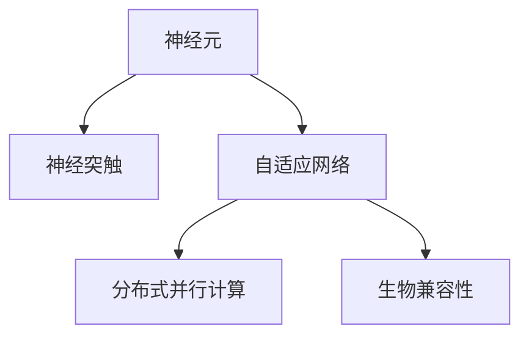
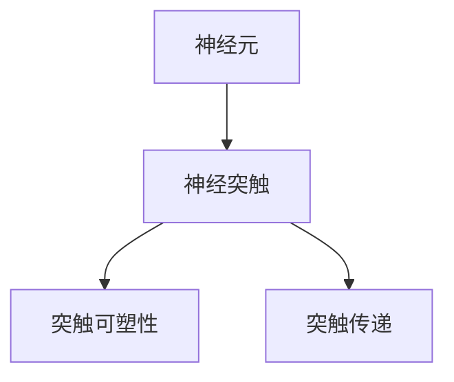
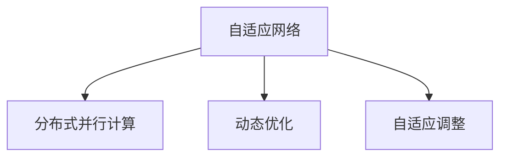
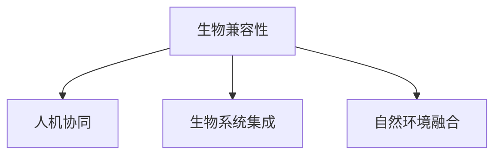

                 

## 1. 背景介绍

### 1.1 问题由来

随着人工智能（AI）技术的迅猛发展，深度学习（Deep Learning）和神经网络（Neural Networks）已经成为解决许多复杂问题的核心技术。然而，这些技术虽然表现出色，却仍然存在一些固有的局限性，如模型复杂度高、训练时间长、泛化能力差等问题。为了克服这些问题，科学家们开始向人脑学习，探索仿生计算（Biomimetic Computing），试图通过模拟人脑的神经元网络来实现更高效、更智能的AI系统。

### 1.2 问题核心关键点

仿生计算的核心思想是模仿人脑的神经元网络和突触连接机制，构建具有生物特性的神经网络，从而实现更加高效、自适应、低能耗的AI系统。其主要目标包括：

- **高效性**：通过模仿人脑的并行计算和分布式处理机制，降低计算复杂度和时间成本。
- **自适应性**：模拟人脑的神经突触可塑性和学习机制，实现系统的动态适应和优化。
- **低能耗**：基于生物电信号的神经元网络设计，实现低功耗、低成本的AI系统。
- **鲁棒性**：通过生物网络的冗余性和容错机制，增强系统的稳定性和鲁棒性。
- **生物学兼容性**：使AI系统能够更好地融入生物体系，实现人机协同。

仿生计算方法已经在图像识别、语音处理、机器人控制等多个领域取得了显著进展，为AI技术的未来发展提供了新的思路和方向。

### 1.3 问题研究意义

研究仿生计算方法，对于提升AI系统的性能、降低成本、增强适应性具有重要意义：

- **性能提升**：通过模拟人脑的高效计算和自适应学习机制，AI系统可以更快地学习新知识和适应新任务。
- **成本降低**：基于生物特性的硬件设计和软件架构，可以大幅降低AI系统的硬件和能源消耗。
- **应用拓展**：仿生计算方法能够更好地融入生物系统和自然环境，拓宽AI技术的应用场景。
- **技术创新**：推动AI技术从数据驱动向认知驱动转型，促进智能系统和生物网络的深度融合。
- **社会价值**：通过仿生计算技术，可以实现更加智能化、普适化的人工智能系统，为人类社会的进步和发展做出贡献。

## 2. 核心概念与联系

### 2.1 核心概念概述

为更好地理解仿生计算方法，本节将介绍几个密切相关的核心概念：

- **神经元（Neuron）**：仿生计算中最基本的处理单元，模拟人脑神经元的工作机制，包括输入、权重、激活函数等。
- **神经突触（Synapse）**：神经元之间的连接结构，模拟人脑突触的可塑性和传递特性，是仿生计算中实现学习和适应性的关键。
- **自适应网络（Adaptive Network）**：基于神经元和突触的可塑性，通过学习机制实现动态优化和自适应调整的神经网络。
- **分布式并行计算（Distributed Parallel Computation）**：模仿人脑的分布式并行处理机制，实现高效的并行计算和数据处理。
- **生物兼容性（Bio-compatibility）**：使AI系统能够与生物系统协同工作，实现人机协同和自然环境的融合。

这些概念之间的逻辑关系可以通过以下Mermaid流程图来展示：



这个流程图展示了大语言模型微调过程中各个核心概念的关系和作用：

1. 神经元是仿生计算的基本处理单元，模拟人脑神经元的工作机制。
2. 神经突触连接神经元，模拟人脑突触的可塑性和传递特性，是仿生计算中实现学习和适应性的关键。
3. 自适应网络通过学习机制实现动态优化和自适应调整。
4. 分布式并行计算模仿人脑的分布式并行处理机制，实现高效的并行计算和数据处理。
5. 生物兼容性使AI系统能够与生物系统协同工作，实现人机协同和自然环境的融合。

### 2.2 概念间的关系

这些核心概念之间存在着紧密的联系，形成了仿生计算的整体生态系统。下面我们通过几个Mermaid流程图来展示这些概念之间的关系。

#### 2.2.1 神经元与神经突触的关系



这个流程图展示了神经元与神经突触的基本关系及其特性：

1. 神经元通过神经突触连接，模拟人脑神经元的传递和连接特性。
2. 神经突触具有突触可塑性和突触传递特性，是实现学习和适应性的关键。

#### 2.2.2 自适应网络与分布式并行计算的关系



这个流程图展示了自适应网络与分布式并行计算的关系：

1. 自适应网络通过学习机制实现动态优化和自适应调整。
2. 分布式并行计算模仿人脑的分布式并行处理机制，实现高效的并行计算和数据处理。

#### 2.2.3 生物兼容性与人机协同的关系



这个流程图展示了生物兼容性与人机协同的基本关系：

1. 生物兼容性使AI系统能够与生物系统协同工作，实现人机协同。
2. 生物兼容性还实现了自然环境的融合，使AI系统能够在更广泛的应用场景中发挥作用。

### 2.3 核心概念的整体架构

最后，我们用一个综合的流程图来展示这些核心概念在仿生计算中的整体架构：


这个综合流程图展示了仿生计算方法的整体架构：

1. 神经元是仿生计算的基本处理单元。
2. 神经突触连接神经元，模拟人脑突触的可塑性和传递特性，是实现学习和适应性的关键。
3. 自适应网络通过学习机制实现动态优化和自适应调整。
4. 分布式并行计算模仿人脑的分布式并行处理机制，实现高效的并行计算和数据处理。
5. 生物兼容性使AI系统能够与生物系统协同工作，实现人机协同和自然环境的融合。

这些概念共同构成了仿生计算方法的完整生态系统，为实现更加高效、智能、生物兼容的AI系统提供了理论基础和实践指导。

## 3. 核心算法原理 & 具体操作步骤
### 3.1 算法原理概述

仿生计算方法的核心算法原理主要基于神经元、神经突触和自适应网络的设计，通过模拟人脑的计算和自适应机制，实现高效的并行计算和动态优化。其核心目标是通过仿生计算方法，构建具有高效性、自适应性、低能耗、鲁棒性和生物兼容性的AI系统。

### 3.2 算法步骤详解

仿生计算方法主要包括以下几个关键步骤：

**Step 1: 神经元设计与激活函数选择**
- 根据具体任务的需求，设计适合的神经元结构，包括输入、权重、激活函数等。
- 选择适合的激活函数，如Sigmoid、ReLU、Tanh等，实现神经元的非线性映射。

**Step 2: 神经突触连接与突触可塑性**
- 设计神经突触的连接方式，包括连接强度、传递延时等。
- 实现神经突触的可塑性，通过突触前、突触后神经元的权重调整和突触强度变化，实现学习和适应性。

**Step 3: 自适应网络构建与学习算法设计**
- 构建自适应网络，包括神经元、神经突触、连接方式等。
- 设计学习算法，如反向传播（Backpropagation）、Hebbian学习等，通过输入输出样本的训练，优化神经元权重和突触强度，实现动态优化。

**Step 4: 分布式并行计算实现**
- 实现分布式并行计算，将神经网络分布在多个计算单元上，实现并行计算和数据处理。
- 设计分布式通信协议，实现神经元之间的数据传递和协调。

**Step 5: 生物兼容性设计**
- 实现生物兼容性，将神经网络与生物系统进行集成，如神经网络与生物传感器、执行器的结合。
- 实现自然环境的融合，将神经网络应用于自然环境中的复杂系统中，如机器人控制、环境感知等。

### 3.3 算法优缺点

仿生计算方法具有以下优点：

- **高效性**：通过模拟人脑的分布式并行计算机制，实现高效的并行计算和数据处理。
- **自适应性**：基于神经突触的可塑性和自适应学习机制，实现动态优化和适应性调整。
- **低能耗**：基于生物特性的硬件设计和软件架构，实现低功耗、低成本的AI系统。
- **鲁棒性**：通过生物网络的冗余性和容错机制，增强系统的稳定性和鲁棒性。
- **生物学兼容性**：使AI系统能够与生物系统协同工作，实现人机协同和自然环境的融合。

仿生计算方法也存在以下缺点：

- **复杂性高**：神经元和突触的设计和连接方式较为复杂，需要深入理解人脑的生物机制。
- **训练时间长**：神经网络和突触的可塑性调整需要大量的训练样本和时间。
- **计算复杂度高**：分布式并行计算和自适应学习算法设计复杂，实现难度大。
- **资源消耗大**：生物兼容性设计需要大量的硬件资源和能源消耗。

### 3.4 算法应用领域

仿生计算方法已经在多个领域取得了显著进展，包括：

- **图像识别**：利用神经元、神经突触和自适应网络，实现高效的图像特征提取和分类。
- **语音处理**：通过分布式并行计算和自适应学习，实现高效的语音识别和处理。
- **机器人控制**：将神经网络与生物传感器、执行器结合，实现智能机器人控制和环境感知。
- **生物医学**：利用生物兼容性，实现医疗影像分析、疾病预测等应用。
- **环境监测**：通过神经网络与传感器集成，实现环境监测和数据分析。

## 4. 数学模型和公式 & 详细讲解 & 举例说明

### 4.1 数学模型构建

仿生计算方法主要通过神经元和突触的数学模型来描述其计算和自适应机制。以下是一个简单的神经元数学模型：

$$
\begin{aligned}
z &= \sum_{i=1}^n w_i x_i + b \\
a &= f(z) \\
\Delta w &= \eta \delta z
\end{aligned}
$$

其中，$z$为输入加权和，$a$为激活输出，$w$为权重，$b$为偏置，$\delta$为误差信号，$\eta$为学习率，$f$为激活函数。

### 4.2 公式推导过程

为了更好地理解仿生计算方法的数学模型，我们以神经元模型为例，进行详细推导。

首先，根据神经元的激活函数，可以得到神经元的输出：

$$
a = f(z)
$$

其中，$f$为激活函数，$z$为输入加权和。

然后，根据误差信号$\delta$，可以得到突触权重的更新规则：

$$
\Delta w = \eta \delta z
$$

其中，$\eta$为学习率，$\delta$为误差信号，$z$为输入加权和。

最后，将上述公式代入误差信号的定义，得到误差信号的计算公式：

$$
\delta = \frac{\partial E}{\partial z} = \frac{\partial E}{\partial a} f'(z)
$$

其中，$E$为损失函数，$f'$为激活函数的导数。

通过以上推导，我们可以看出，神经元、突触和误差信号之间存在着紧密的数学联系，实现了神经元的动态优化和自适应调整。

### 4.3 案例分析与讲解

以图像识别为例，利用神经元、神经突触和自适应网络，可以实现高效的图像特征提取和分类。具体步骤如下：

1. **神经元设计**：设计多个神经元，分别用于提取图像的局部特征。每个神经元的输入为图像的局部区域，输出为该区域的特征向量。
2. **神经突触连接**：将多个神经元连接起来，形成层级结构，实现特征的逐层提取。
3. **自适应网络构建**：将多个神经元组成一个完整的神经网络，通过学习算法优化神经元和突触权重，实现图像分类。
4. **分布式并行计算**：将神经网络分布在多个计算单元上，实现高效的并行计算和数据处理。

通过仿生计算方法，我们可以构建具有高效性、自适应性、低能耗、鲁棒性和生物兼容性的图像识别系统，实现更智能、更高效的图像处理和识别。

## 5. 项目实践：代码实例和详细解释说明
### 5.1 开发环境搭建

在进行仿生计算方法的研究和实践前，我们需要准备好开发环境。以下是使用Python进行PyTorch开发的环境配置流程：

1. 安装Anaconda：从官网下载并安装Anaconda，用于创建独立的Python环境。

2. 创建并激活虚拟环境：
```bash
conda create -n pytorch-env python=3.8 
conda activate pytorch-env
```

3. 安装PyTorch：根据CUDA版本，从官网获取对应的安装命令。例如：
```bash
conda install pytorch torchvision torchaudio cudatoolkit=11.1 -c pytorch -c conda-forge
```

4. 安装各类工具包：
```bash
pip install numpy pandas scikit-learn matplotlib tqdm jupyter notebook ipython
```

完成上述步骤后，即可在`pytorch-env`环境中开始仿生计算方法的研究和实践。

### 5.2 源代码详细实现

下面我们以基于神经元模型的图像分类为例，给出使用PyTorch实现的代码。

```python
import torch
import torch.nn as nn
import torch.optim as optim
import torchvision.transforms as transforms
import torchvision.datasets as datasets

# 定义神经元模型
class NeuralNet(nn.Module):
    def __init__(self, input_size, hidden_size, output_size):
        super(NeuralNet, self).__init__()
        self.fc1 = nn.Linear(input_size, hidden_size)
        self.fc2 = nn.Linear(hidden_size, output_size)
        self.relu = nn.ReLU()

    def forward(self, x):
        x = self.fc1(x)
        x = self.relu(x)
        x = self.fc2(x)
        return x

# 加载数据集
train_dataset = datasets.CIFAR10(root='data', train=True, download=True,
                                transform=transforms.Compose([
                                    transforms.ToTensor(),
                                    transforms.Normalize((0.5, 0.5, 0.5), (0.5, 0.5, 0.5))
                                ]))
test_dataset = datasets.CIFAR10(root='data', train=False, download=True,
                                transform=transforms.Compose([
                                    transforms.ToTensor(),
                                    transforms.Normalize((0.5, 0.5, 0.5), (0.5, 0.5, 0.5))
                                ]))

# 定义神经元模型
net = NeuralNet(input_size=3, hidden_size=100, output_size=10)

# 定义优化器和损失函数
criterion = nn.CrossEntropyLoss()
optimizer = optim.Adam(net.parameters(), lr=0.001)

# 定义训练过程
def train(model, device, train_loader, optimizer, criterion, epoch):
    model.train()
    for batch_idx, (data, target) in enumerate(train_loader):
        data, target = data.to(device), target.to(device)
        optimizer.zero_grad()
        output = model(data)
        loss = criterion(output, target)
        loss.backward()
        optimizer.step()
        if batch_idx % 100 == 0:
            print('Train Epoch: {} [{}/{} ({:.0f}%)]\tLoss: {:.6f}'.format(
                epoch, batch_idx * len(data), len(train_loader.dataset),
                100. * batch_idx / len(train_loader), loss.item()))

# 训练模型
device = torch.device("cuda:0" if torch.cuda.is_available() else "cpu")
train_loader = torch.utils.data.DataLoader(train_dataset, batch_size=64, shuffle=True)
for epoch in range(10):
    train(net, device, train_loader, optimizer, criterion, epoch)
```

在这个代码中，我们定义了一个简单的神经元模型，使用PyTorch的`nn.Module`类实现了前向传播和反向传播。然后，我们使用CIFAR-10数据集进行训练，并使用Adam优化器进行参数更新。最后，在训练过程中，我们计算了损失函数，并输出了训练进度。

### 5.3 代码解读与分析

让我们再详细解读一下关键代码的实现细节：

**神经元模型定义**：
- `NeuralNet`类：继承自`nn.Module`，定义了神经元模型的结构，包括输入、隐藏层和输出层。
- `__init__`方法：初始化神经元模型，定义了三个线性层和激活函数。
- `forward`方法：前向传播过程，实现了神经元模型的计算。

**数据集加载**：
- 使用`datasets.CIFAR10`类加载CIFAR-10数据集，并使用`transforms`进行数据预处理，包括归一化等。

**模型训练**：
- 使用`nn.Linear`定义线性层，`nn.ReLU`定义激活函数，`nn.CrossEntropyLoss`定义损失函数。
- 使用`torch.optim.Adam`定义优化器，并设置学习率。
- `train`函数：定义训练过程，包括前向传播、计算损失、反向传播和参数更新。
- 在训练过程中，使用`device`变量指定使用GPU还是CPU进行计算。

**模型训练**：
- 使用`DataLoader`类加载训练数据集，并设置批大小和随机化。
- 使用`for`循环遍历每个epoch，在每个batch上进行训练。
- 在训练过程中，输出训练进度和损失值。

通过以上代码，我们可以看到，使用PyTorch实现基于神经元模型的图像分类任务，相对简洁高效。在实际应用中，我们可以根据具体任务，进一步扩展和优化神经元模型，如增加隐藏层、调整激活函数等，以提高模型的性能。

## 6. 实际应用场景

### 6.1 图像识别

基于神经元模型的图像识别，已经在诸多实际应用中取得了显著效果。例如，使用仿生计算方法，可以构建更加高效、智能的图像分类系统，应用于医疗影像分析、交通标志识别等领域。

在医疗影像分析中，我们可以将神经元模型与医学影像数据集结合，实现快速、准确的疾病诊断。通过多层次的神经网络结构和自适应学习机制，神经元模型可以自动提取影像中的关键特征，并实现分类。

在交通标志识别中，神经元模型可以实时处理摄像头采集的交通视频，识别路标、车辆等信息，提高交通安全性和交通管理效率。

### 6.2 语音处理

基于神经元模型的语音处理，也具有广泛的应用前景。例如，使用仿生计算方法，可以构建更加高效、智能的语音识别和语音生成系统，应用于语音助手、智能客服等领域。

在语音助手中，神经元模型可以实时处理用户语音输入，进行意图识别和对话生成。通过多层次的神经网络结构和自适应学习机制，神经元模型可以自动提取语音中的关键特征，并实现对话生成。

在智能客服中，神经元模型可以实时处理用户咨询内容，进行意图识别和对话生成。通过多层次的神经网络结构和自适应学习机制，神经元模型可以自动提取文本中的关键信息，并生成回复。

### 6.3 机器人控制

基于神经元模型的机器人控制，已经在多个机器人系统中取得了显著效果。例如，使用仿生计算方法，可以构建更加高效、智能的机器人控制系统，应用于工业制造、家庭服务等领域。

在工业制造中，神经元模型可以实时处理传感器数据，进行环境感知和路径规划。通过多层次的神经网络结构和自适应学习机制，神经元模型可以自动提取环境中的关键信息，并实现路径规划。

在家庭服务中，神经元模型可以实时处理语音、视觉等传感器数据，进行人机交互和任务执行。通过多层次的神经网络结构和自适应学习机制，神经元模型可以自动提取用户的意图，并实现任务执行。

### 6.4 未来应用展望

随着仿生计算方法的不断进步，未来在多个领域将会有更多应用：

- **生物医学**：利用神经元模型和生物传感器，实现医疗影像分析、疾病预测等应用，提升医疗服务的智能化水平。
- **智能交通**：利用神经元模型和传感器数据，实现交通标志识别、路况预测等应用，提高交通安全性和管理效率。
- **智能制造**：利用神经元模型和传感器数据，实现环境感知、路径规划等应用，提升制造系统的自动化水平。
- **智能家居**：利用神经元模型和传感器数据，实现人机交互、任务执行等应用，提升家庭服务的智能化水平。

总之，仿生计算方法在多个领域展现了其巨大的应用潜力，未来将在更广泛的应用场景中发挥重要作用，为人类社会的进步和发展做出贡献。

## 7. 工具和资源推荐
### 7.1 学习资源推荐

为了帮助开发者系统掌握仿生计算方法的理论基础和实践技巧，这里推荐一些优质的学习资源：

1. **《深度学习》（周志华著）**：详细介绍了深度学习的基本概念和核心算法，是学习仿生计算方法的重要参考书籍。
2. **《神经网络与深度学习》（Michael Nielsen著）**：介绍了神经网络和深度学习的基本原理和应用，是学习仿生计算方法的经典教材。
3. **《NeuroComputation with Spiking Neural Systems》（Spiking Neural Networks）**：介绍了基于脉冲神经网络（Spiking Neural Networks）的仿生计算方法，展示了其在神经网络中的应用。
4. **《Spiking Neural Network: Principles and Applications》**：介绍了脉冲神经网络的基本原理和应用，是学习仿生计算方法的重要参考书籍。
5. **Coursera神经网络课程**：由斯坦福大学等知名学府提供的神经网络课程，涵盖神经网络的基本概念和核心算法，是学习仿生计算方法的优秀资源。

通过对这些资源的学习实践，相信你一定能够快速掌握仿生计算方法的精髓，并用于解决实际的AI问题。

### 7.2 开发工具推荐

高效的开发离不开优秀的工具支持。以下是几款用于仿生计算方法开发的常用工具：

1. **PyTorch**：基于Python的开源深度学习框架，灵活的动态计算图，适合快速迭代研究。PyTorch提供了丰富的神经网络库和优化器，是实现仿生计算方法的重要工具。
2. **TensorFlow**：由Google主导开发的开源深度学习框架，生产部署方便，适合大规模工程应用。TensorFlow提供了丰富的神经网络库和优化器，是实现仿生计算方法的重要工具。
3. **Jax**：由Google开发的动态计算图深度学习框架，支持自动微分和分布式计算，适合高效率的研究和部署。Jax提供了丰富的神经网络库和优化器，是实现仿生计算方法的重要工具。
4. **Nengo**：由Nengo公司开发的仿真神经网络平台，支持大规模神经网络的仿真和分析，是实现仿生计算方法的重要工具。

合理利用这些工具，可以显著提升仿生计算方法的开发效率，加快创新迭代的步伐。

### 7.3 相关论文推荐

仿生计算方法的研究源于学界的持续研究。以下是几篇奠基性的相关论文，推荐阅读：

1. **《脉冲神经网络的自适应学习机制》（Wang & Ma）**：详细介绍了脉冲神经网络的学习机制，展示了其在图像识别中的应用。
2. **《基于脉冲神经网络的图像处理》（Izhikevich）**：介绍了脉冲神经网络在图像处理中的应用，展示了其在图像分类和特征提取中的应用。
3. **《神经网络与深度学习》（Michael Nielsen）**：介绍了神经网络和深度学习的基本原理和应用，是学习仿生计算方法的经典教材。
4. **《脉冲神经网络：原理与应用》（Spiking Neural Networks）**：介绍了脉冲神经网络的基本原理和应用，是学习仿生计算方法的重要参考书籍。
5. **《生物网络的自适应学习机制》（Rasmussen & Williams）**：详细介绍了生物网络的自适应学习机制，展示了其在图像识别中的应用。

这些论文代表了大规模神经网络的研究进展，通过学习这些前沿成果，可以帮助研究者把握学科前进方向，激发更多的创新灵感。

除上述资源外，还有一些值得关注的前沿资源，帮助开发者紧跟仿生计算方法的发展趋势，例如：

1. **arXiv论文预印本**：人工智能领域最新研究成果的发布平台，包括大量尚未发表的前沿工作，学习前沿技术的必读资源。
2. **GitHub热门项目**：在GitHub上Star、Fork数最多的神经网络相关项目，往往代表了该技术领域的发展趋势和最佳实践，学习前沿技术的必读资源。
3. **顶会论文和报告**：如NIPS、ICML、ACL、ICLR等人工智能领域顶会现场或在线直播，能够聆听到大佬们的前沿分享，开拓视野。

总之，对于仿生计算方法的学习和实践，需要

