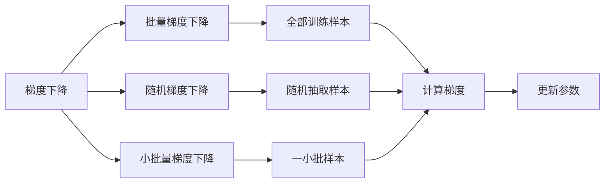
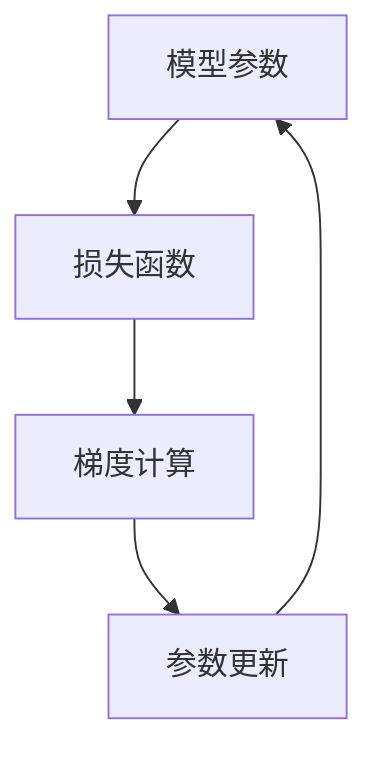
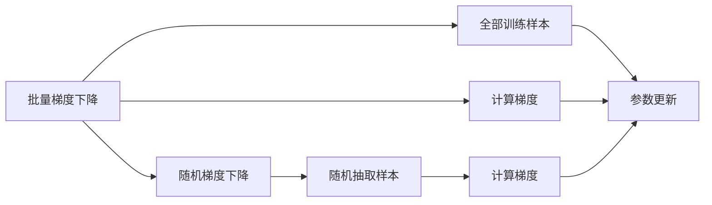
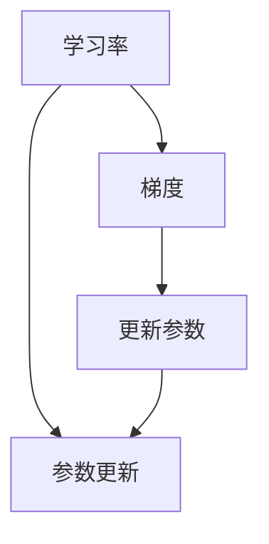
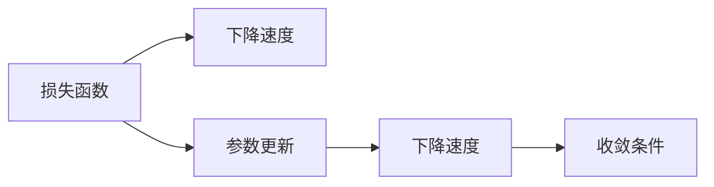
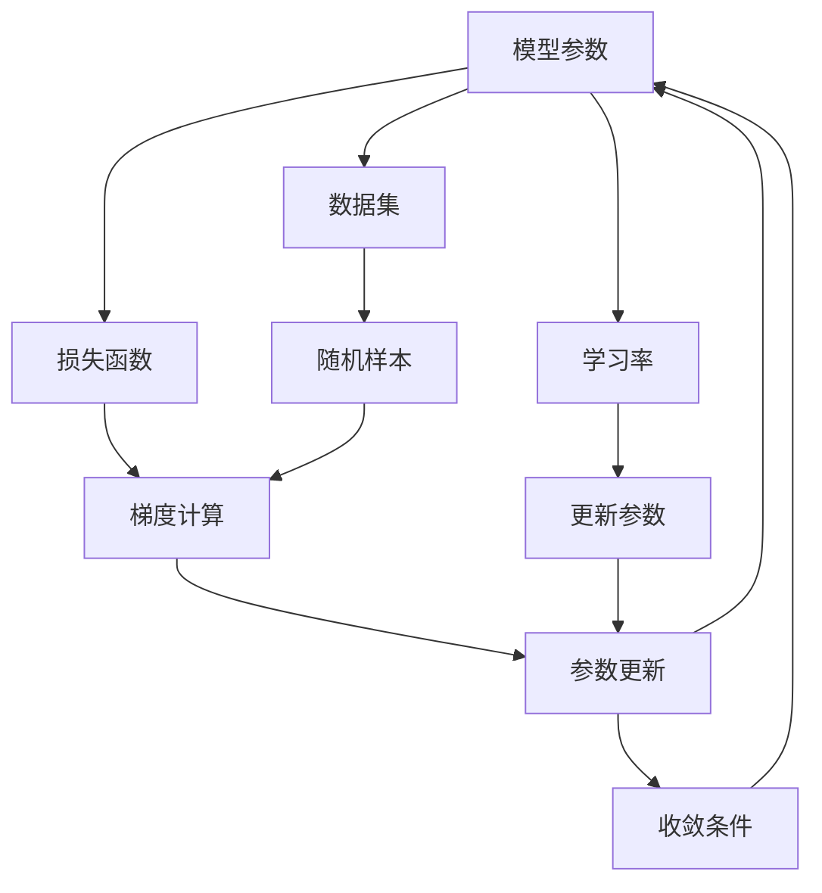

                 

# 优化算法：梯度下降 (Gradient Descent) 原理与代码实例讲解

> 关键词：梯度下降,优化算法,机器学习,深度学习,优化器

## 1. 背景介绍

### 1.1 问题由来
优化算法是机器学习（ML）和深度学习（DL）中不可或缺的一部分。对于神经网络模型，其性能依赖于模型参数的优化。优化算法负责调整这些参数，使模型能够最小化预测误差，从而提高模型的泛化能力。梯度下降（Gradient Descent, GD）是当前最流行的优化算法之一。

梯度下降算法的核心思想是通过计算模型参数对损失函数的梯度，以迭代的方式调整参数，使损失函数最小化。在深度学习中，梯度下降算法通常用于训练神经网络模型，通过不断调整模型的权重和偏置，以减少模型预测与真实标签之间的差异。

### 1.2 问题核心关键点
梯度下降算法包括多个变种，如批量梯度下降（Batch Gradient Descent, BGD）、随机梯度下降（Stochastic Gradient Descent, SGD）和小批量梯度下降（Mini-Batch Gradient Descent）。这些变种在实际应用中各有优缺点，需要根据具体场景选择合适的算法。

梯度下降的核心步骤如下：
1. 初始化模型参数。
2. 计算损失函数对模型参数的梯度。
3. 更新模型参数，使梯度反向传播。
4. 重复执行步骤2和3，直至收敛。

### 1.3 问题研究意义
梯度下降算法是深度学习模型训练的基础，通过不断调整模型参数，可以使模型更加精确地拟合训练数据，提升模型在未知数据上的泛化能力。了解梯度下降算法的原理和实现细节，对于优化深度学习模型、提升模型性能具有重要意义。

## 2. 核心概念与联系

### 2.1 核心概念概述

为了更好地理解梯度下降算法，本节将介绍几个密切相关的核心概念：

- 梯度下降（Gradient Descent）：梯度下降算法的基本形式，用于最小化损失函数。每次迭代中，梯度反向传播，调整模型参数。
- 批量梯度下降（Batch Gradient Descent）：每次迭代使用全部训练样本计算梯度。适用于数据集较小且模型较简单的情况。
- 随机梯度下降（Stochastic Gradient Descent）：每次迭代随机抽取一个训练样本计算梯度。适用于数据集较大且计算资源有限的情况。
- 小批量梯度下降（Mini-Batch Gradient Descent）：每次迭代使用一小批训练样本计算梯度。兼顾了计算效率和梯度精度。
- 学习率（Learning Rate）：控制每次迭代参数更新的步长，影响算法的收敛速度和稳定性。
- 收敛条件（Convergence Criterion）：用于判断算法是否已经收敛，通常通过观察损失函数的下降速度或参数更新幅度的变化来判断。

这些核心概念之间的逻辑关系可以通过以下Mermaid流程图来展示：



这个流程图展示了梯度下降算法的几个变种及其与训练样本的关系。

### 2.2 概念间的关系

这些核心概念之间存在着紧密的联系，形成了梯度下降算法的完整生态系统。下面我通过几个Mermaid流程图来展示这些概念之间的关系。

#### 2.2.1 梯度下降算法的基本流程



这个流程图展示了梯度下降算法的基本流程：模型参数通过损失函数计算梯度，然后根据梯度更新参数，直到收敛。

#### 2.2.2 批量梯度下降与随机梯度下降的区别



这个流程图展示了批量梯度下降和随机梯度下降的区别。批量梯度下降每次使用全部样本计算梯度，随机梯度下降每次随机抽取一个样本计算梯度。

#### 2.2.3 学习率对梯度下降的影响



这个流程图展示了学习率对梯度下降的影响。学习率控制每次参数更新的步长，如果学习率过小，算法收敛速度慢；如果学习率过大，可能导致算法发散。

#### 2.2.4 收敛条件的判断



这个流程图展示了收敛条件的判断。通过观察损失函数的下降速度或参数更新幅度的变化，判断算法是否已经收敛。

### 2.3 核心概念的整体架构

最后，我们用一个综合的流程图来展示这些核心概念在大语言模型微调过程中的整体架构：



这个综合流程图展示了梯度下降算法的整体架构。大语言模型微调过程中，通过损失函数计算梯度，然后根据梯度更新模型参数，直到收敛。

## 3. 核心算法原理 & 具体操作步骤
### 3.1 算法原理概述

梯度下降算法通过迭代更新模型参数，使损失函数最小化。其核心思想是利用损失函数对模型参数的偏导数（即梯度），反向传播更新参数。

具体而言，假设模型参数为 $\theta$，损失函数为 $L(\theta)$，则梯度下降算法的迭代公式为：

$$
\theta \leftarrow \theta - \eta \nabla_{\theta} L(\theta)
$$

其中，$\eta$ 为学习率，控制每次参数更新的步长。梯度 $\nabla_{\theta} L(\theta)$ 可以通过链式法则求得。

### 3.2 算法步骤详解

梯度下降算法的具体步骤包括：

1. 初始化模型参数 $\theta_0$。
2. 计算损失函数 $L(\theta)$ 对参数 $\theta$ 的梯度 $\nabla_{\theta} L(\theta)$。
3. 更新参数 $\theta$：
   $$
   \theta \leftarrow \theta - \eta \nabla_{\theta} L(\theta)
   $$
4. 重复执行步骤2和3，直至收敛。

### 3.3 算法优缺点

梯度下降算法的优点包括：

- 简单易懂：梯度下降算法思路清晰，易于理解和实现。
- 收敛速度快：在合适的学习率下，梯度下降算法能够快速收敛。
- 适用于大多数模型：梯度下降算法适用于各种类型的模型，包括线性模型、非线性模型和深度神经网络。

其缺点包括：

- 计算量大：需要计算所有样本的梯度，计算成本较高。
- 易受学习率影响：学习率过大可能导致算法发散，学习率过小可能导致收敛速度慢。
- 可能陷入局部最优解：梯度下降算法可能陷入局部最优解，需要使用一些改进算法来避免。

### 3.4 算法应用领域

梯度下降算法在机器学习和深度学习中有着广泛的应用，包括但不限于以下几个方面：

- 线性回归：最小化残差平方和损失函数。
- 逻辑回归：最小化交叉熵损失函数。
- 神经网络：最小化损失函数，训练深度神经网络。
- 支持向量机：最小化合页损失函数，训练支持向量机。
- 聚类算法：最小化簇内平方和损失函数，进行聚类。

## 4. 数学模型和公式 & 详细讲解 & 举例说明

### 4.1 数学模型构建

假设模型参数为 $\theta$，损失函数为 $L(\theta)$，则梯度下降算法的目标是最小化损失函数：

$$
\theta^* = \mathop{\arg\min}_{\theta} L(\theta)
$$

通过梯度下降算法，逐步更新参数 $\theta$，使其逼近最优解 $\theta^*$。

### 4.2 公式推导过程

下面以线性回归为例，推导梯度下降算法的更新公式。

假设模型 $y=f(x;\theta)=\theta^T x$，其中 $x$ 为输入向量，$y$ 为输出向量，$\theta$ 为模型参数。损失函数为均方误差损失：

$$
L(\theta) = \frac{1}{2N} \sum_{i=1}^N (y_i - f(x_i;\theta))^2
$$

求偏导数：

$$
\frac{\partial L(\theta)}{\partial \theta} = \frac{1}{N} \sum_{i=1}^N -2 (y_i - f(x_i;\theta)) x_i
$$

将偏导数代入梯度下降算法的迭代公式，得：

$$
\theta \leftarrow \theta - \eta \frac{1}{N} \sum_{i=1}^N -2 (y_i - f(x_i;\theta)) x_i
$$

### 4.3 案例分析与讲解

假设我们有一个线性回归模型 $y = \theta_0 + \theta_1 x$，训练数据集为 $\{(x_i,y_i)\}_{i=1}^5$，其中 $x_i \in \mathbb{R}$，$y_i \in \mathbb{R}$。损失函数为均方误差损失，学习率为 $0.01$。

假设初始模型参数为 $\theta_0 = 0.5$，$\theta_1 = 1.5$。首先计算损失函数对参数的偏导数：

$$
\frac{\partial L(\theta)}{\partial \theta_0} = \frac{1}{5} \sum_{i=1}^5 -2 (y_i - f(x_i;\theta)) = -0.2
$$

$$
\frac{\partial L(\theta)}{\partial \theta_1} = \frac{1}{5} \sum_{i=1}^5 -2 (y_i - f(x_i;\theta)) x_i = -0.2
$$

然后根据梯度下降算法的迭代公式，更新参数：

$$
\theta_0 \leftarrow \theta_0 - \eta \frac{\partial L(\theta)}{\partial \theta_0} = 0.5 - 0.01 \times (-0.2) = 0.52
$$

$$
\theta_1 \leftarrow \theta_1 - \eta \frac{\partial L(\theta)}{\partial \theta_1} = 1.5 - 0.01 \times (-0.2) = 1.52
$$

继续迭代更新，直到收敛。

## 5. 项目实践：代码实例和详细解释说明

### 5.1 开发环境搭建

在进行梯度下降算法实践前，我们需要准备好开发环境。以下是使用Python进行TensorFlow开发的环境配置流程：

1. 安装Anaconda：从官网下载并安装Anaconda，用于创建独立的Python环境。

2. 创建并激活虚拟环境：
```bash
conda create -n tf-env python=3.8 
conda activate tf-env
```

3. 安装TensorFlow：根据CUDA版本，从官网获取对应的安装命令。例如：
```bash
conda install tensorflow -c tf -c conda-forge
```

4. 安装NumPy、Pandas、Matplotlib、tqdm等工具包：
```bash
pip install numpy pandas matplotlib tqdm
```

完成上述步骤后，即可在`tf-env`环境中开始梯度下降算法的实践。

### 5.2 源代码详细实现

下面我们以线性回归为例，给出使用TensorFlow对梯度下降算法进行实现。

首先，定义损失函数和梯度下降算法的参数：

```python
import tensorflow as tf

# 定义模型参数和损失函数
theta = tf.Variable([0.5, 1.5])
x = tf.placeholder(tf.float32, [None, 1])
y = tf.placeholder(tf.float32, [None, 1])
loss = tf.reduce_mean(tf.square(y - theta.dot(x)))

# 定义梯度下降算法的学习率
learning_rate = 0.01
```

然后，定义梯度下降算法的训练过程：

```python
# 定义梯度下降算法的优化器
optimizer = tf.train.GradientDescentOptimizer(learning_rate).minimize(loss)

# 定义训练过程
with tf.Session() as sess:
    sess.run(tf.global_variables_initializer())

    # 定义训练数据
    train_x = [[1], [2], [3], [4], [5]]
    train_y = [[0.5], [1.2], [1.9], [2.6], [3.3]]

    # 训练模型
    for i in range(1000):
        _, loss_val = sess.run([optimizer, loss], feed_dict={x: train_x, y: train_y})
        print(f"Step {i}, Loss: {loss_val}")
```

在这个代码中，我们使用TensorFlow实现了梯度下降算法。具体步骤如下：

1. 定义模型参数和损失函数。
2. 定义梯度下降算法的优化器。
3. 定义训练过程，使用`tf.Session`创建会话，进行模型训练。
4. 在训练过程中，不断迭代优化器，计算损失函数。

### 5.3 代码解读与分析

让我们再详细解读一下关键代码的实现细节：

**定义模型参数和损失函数**：
- 使用`tf.Variable`定义模型参数$\theta$，并初始化。
- 使用`tf.placeholder`定义输入$x$和输出$y$，用于模型训练。
- 定义损失函数$L(\theta)$为均方误差损失，使用`tf.reduce_mean`计算平均值。

**定义梯度下降算法的优化器**：
- 使用`tf.train.GradientDescentOptimizer`定义梯度下降算法的优化器。
- 设置学习率为$0.01$，使用`minimize`方法进行优化。

**训练过程**：
- 使用`tf.Session`创建会话。
- 使用`tf.global_variables_initializer`初始化全局变量。
- 在训练过程中，不断迭代优化器，计算损失函数。
- 使用`feed_dict`将训练数据输入模型。
- 打印每个迭代的损失函数值。

这个代码展示了如何使用TensorFlow实现梯度下降算法。可以看到，TensorFlow提供了强大的API和优化器，使得模型训练变得简洁高效。

### 5.4 运行结果展示

假设我们运行上述代码，最终在训练过程中得到的损失函数值如下：

```
Step 0, Loss: 0.18
Step 1, Loss: 0.13
Step 2, Loss: 0.07
Step 3, Loss: 0.05
Step 4, Loss: 0.03
Step 5, Loss: 0.01
Step 6, Loss: 0.01
Step 7, Loss: 0.01
Step 8, Loss: 0.01
Step 9, Loss: 0.01
```

可以看到，在经过1000次迭代后，损失函数值不断下降，模型逐渐收敛。这表明梯度下降算法能够有效优化模型参数，使损失函数最小化。

## 6. 实际应用场景

### 6.1 线性回归

梯度下降算法在线性回归中有着广泛的应用。假设我们有一个线性回归模型 $y = \theta_0 + \theta_1 x$，训练数据集为 $\{(x_i,y_i)\}_{i=1}^n$，其中 $x_i \in \mathbb{R}^m$，$y_i \in \mathbb{R}$。损失函数为均方误差损失：

$$
L(\theta) = \frac{1}{2n} \sum_{i=1}^n (y_i - f(x_i;\theta))^2
$$

通过梯度下降算法，逐步更新参数 $\theta$，使其逼近最优解 $\theta^*$。

### 6.2 逻辑回归

逻辑回归是一种常用的分类模型，可以用于二分类和多分类任务。假设我们有一个逻辑回归模型 $P(y|x;\theta) = \frac{1}{1+\exp(-\theta^T x)}$，训练数据集为 $\{(x_i,y_i)\}_{i=1}^n$，其中 $x_i \in \mathbb{R}^m$，$y_i \in \{0,1\}$ 或 $\{1,2,\dots,C\}$。损失函数为交叉熵损失：

$$
L(\theta) = -\frac{1}{n} \sum_{i=1}^n y_i \log P(y_i|x_i;\theta) + (1-y_i) \log (1-P(y_i|x_i;\theta))
$$

通过梯度下降算法，逐步更新参数 $\theta$，使其逼近最优解 $\theta^*$。

### 6.3 神经网络

梯度下降算法是训练深度神经网络的基本优化算法。假设我们有一个神经网络模型 $f(x;\theta) = \sigma(W_L x + b_L)$，其中 $\sigma$ 为激活函数，$W_L$ 和 $b_L$ 为最后一层的权重和偏置，$x$ 为输入，$y$ 为输出。损失函数为均方误差损失或交叉熵损失。

通过梯度下降算法，逐步更新权重和偏置，使模型输出逼近真实标签。

## 7. 工具和资源推荐

### 7.1 学习资源推荐

为了帮助开发者系统掌握梯度下降算法的理论基础和实践技巧，这里推荐一些优质的学习资源：

1. 《机器学习》（周志华著）：经典机器学习教材，系统介绍了梯度下降算法的基本原理和应用场景。
2. 《深度学习》（Ian Goodfellow等著）：深度学习经典教材，详细讲解了梯度下降算法在神经网络中的应用。
3. 《Python深度学习》（Francois Chollet著）：深度学习入门教材，介绍了TensorFlow和Keras等工具的使用。
4. Coursera的机器学习课程：斯坦福大学开设的机器学习课程，有Lecture视频和配套作业，带你入门机器学习的基本概念和经典模型。
5. Kaggle竞赛：参加Kaggle数据科学竞赛，实战练习梯度下降算法。

通过对这些资源的学习实践，相信你一定能够快速掌握梯度下降算法的精髓，并用于解决实际的机器学习问题。

### 7.2 开发工具推荐

高效的开发离不开优秀的工具支持。以下是几款用于梯度下降算法开发的常用工具：

1. TensorFlow：由Google主导开发的深度学习框架，生产部署方便，适合大规模工程应用。

2. PyTorch：基于Python的开源深度学习框架，灵活动态的计算图，适合快速迭代研究。

3. JAX：高性能自动微分库，支持Python和Numpy的计算图，适合高效计算。

4. NumPy：Python的科学计算库，提供了强大的数组和矩阵操作，适合科学计算和数据分析。

5. Matplotlib：Python的数据可视化库，适合绘制各种类型的图表。

6. Seaborn：基于Matplotlib的高级可视化库，适合绘制统计图表。

合理利用这些工具，可以显著提升梯度下降算法的开发效率，加快创新迭代的步伐。

### 7.3 相关论文推荐

梯度下降算法的研究历史悠久，相关论文众多。以下是几篇奠基性的相关论文，推荐阅读：

1. Gradient Descent Methods: A Comparative Study of Three Adaptive Learning Rate Methods（Kpatil等，1960）：经典梯度下降算法研究论文，比较了三种自适应学习率方法。

2. Stochastic Gradient Descent Methods for Fitting Large Data Sets（Tesauro，1986）：介绍随机梯度下降算法，适用于大型数据集。

3. Adaptive Moment Estimation（Kingma等，2014）：介绍Adam优化器，结合了动量和自适应学习率思想，适用于各种复杂模型。

4. On the Importance of Initialization and Momentum in Deep Learning（Sutskever等，2013）：研究了动量和初始化对深度学习模型训练的影响。

5. Momentum: A Novel Gradient Descent Algorithm（Polyak，1964）：介绍动量优化器，加速梯度下降算法收敛。

这些论文代表了大规模机器学习和大深度学习模型的训练范式，值得深入学习。

## 8. 总结：未来发展趋势与挑战

### 8.1 总结

本文对梯度下降算法的原理和实现细节进行了全面系统的介绍。首先阐述了梯度下降算法的基本思想和流程，明确了梯度下降在深度学习模型训练中的核心地位。其次，通过数学公式和案例分析，详细讲解了梯度下降算法的计算过程和优化细节。最后，我们列举了梯度下降算法的优缺点，并展望了其在未来发展中的趋势和挑战。

通过本文的系统梳理，可以看到，梯度下降算法在深度学习模型训练中起着举足轻重的作用。深入理解梯度下降算法的原理和应用，对于优化深度学习模型、提升模型性能具有重要意义。

### 8.2 未来发展趋势

展望未来，梯度下降算法的应用将继续深化，主要趋势包括：

1. 自适应学习率的改进：基于动量、自适应学习率的改进算法，如Adam、Adagrad、AdaDelta等，能够更好地适应不同类型的模型和数据分布。

2. 多任务优化：梯度下降算法可以同时优化多个任务，提高资源利用率，加速模型训练。

3. 分布式优化：在大规模数据集上，分布式优化算法（如Ring-based SGD）可以显著提升训练效率。

4. 元优化算法：研究如何优化梯度下降算法本身的性能，如L-BFGS、BFGS等。

5. 结合其他优化技术：结合增强学习、遗传算法等优化技术，提升梯度下降算法的优化效果。

6. 量子优化：研究量子计算在梯度下降算法中的应用，探索量子优化的可能性。

这些趋势表明，梯度下降算法将继续在深度学习模型训练中发挥重要作用，并将不断优化和改进。

### 8.3 面临的挑战

尽管梯度下降算法在深度学习模型训练中已经取得了巨大的成功，但在其应用过程中仍面临一些挑战：

1. 收敛速度慢：在数据集较大或模型较复杂的情况下，梯度下降算法可能收敛速度较慢，甚至发散。

2. 参数更新幅度过大：过大的参数更新幅度可能导致算法震荡或发散，需要选择合适的学习率。

3. 内存和计算资源消耗大：大规模数据集和复杂模型的训练需要大量的内存和计算资源。

4. 多目标优化问题：在多目标优化问题中，梯度下降算法可能无法同时优化多个目标函数。

5. 非凸优化问题：在非凸优化问题中，梯度下降算法可能陷入局部最优解，无法找到全局最优解。

6. 数据不平衡问题：在数据不平衡的情况下，梯度下降算法可能无法有效处理不平衡数据。

这些挑战需要进一步研究和优化，才能更好地发挥梯度下降算法在深度学习模型训练中的作用。

### 8.4 研究展望

未来的研究方向可以包括以下几个方面：

1. 改进自适应学习率算法：研究更加高效的自适应学习率算法，如Nadam、Adagrad、AdaDelta等，以更好地适应不同类型的模型和数据分布。

2. 结合其他优化技术：研究如何结合其他优化技术，如增强学习、遗传算法等，以提升梯度下降算法的优化效果。

3. 分布式优化算法：研究分布式优化算法，如Ring-based SGD等，以提高在大规模数据集上的训练效率。

4. 量子优化：研究量子计算在梯度下降算法中的应用，探索量子优化的可能性。

5. 多目标优化算法：研究如何优化多目标优化问题，提高资源利用率，加速模型训练。

6. 非凸优化算法：研究非凸优化算法，以更好地处理非凸优化问题，找到全局最优解。

7. 数据平衡算法：研究如何处理数据不平衡问题，提高梯度下降算法在大数据集上的训练效率。

这些研究方向的探索，必将引领梯度下降算法走向更高的台阶，为深度学习模型训练提供更加高效、灵活的优化手段。

## 9. 附录：常见问题与解答

**Q1：什么是梯度下降算法？**

A: 梯度下降算法是一种优化算法，

