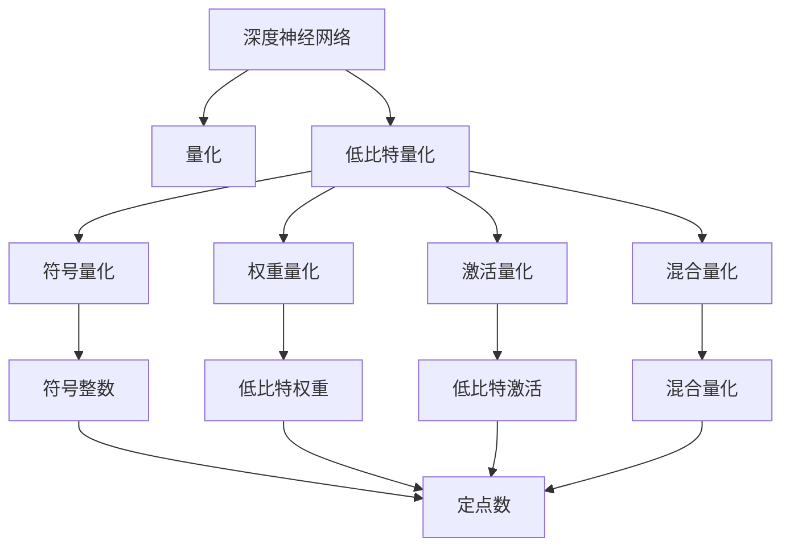
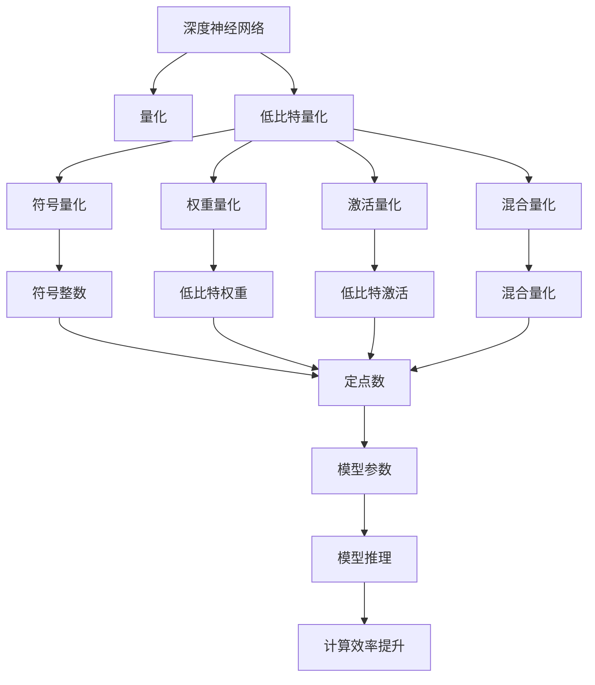

                 

# 低比特量化：平衡精度和效率的艺术

> 关键词：低比特量化,精度损失,硬件加速,深度学习模型,深度神经网络,量化方法

## 1. 背景介绍

### 1.1 问题由来
随着深度学习技术的飞速发展，深度神经网络(DNN)已经成为了处理各种复杂任务的主流工具。但是，深度神经网络的计算量巨大，对于传统的CPU、GPU等硬件设备而言，训练和推理的效率都面临严峻的挑战。为了提高DNN的计算效率，量化(quantization)技术应运而生。量化技术通过将浮点数转换为更小的整数或定点数，从而大幅降低DNN的存储和计算需求，加快训练和推理速度。

然而，量化技术在提升效率的同时，也带来了一定的精度损失。过大的量化位数会导致精度显著下降，甚至影响模型的准确性。因此，如何在提升计算效率和保持模型精度之间找到平衡，成为了量化技术发展的关键问题。

### 1.2 问题核心关键点
低比特量化技术致力于在保证一定精度的情况下，进一步降低量化位数，从而在计算效率和模型精度之间寻求更好的平衡。其核心思想是通过压缩模型参数的存储空间，减少计算过程中的内存和带宽占用，从而达到提升深度神经网络性能的目的。

低比特量化技术的实现包括符号量化、权重剪枝、位宽缩减等技术手段，旨在减小模型规模，提升计算效率，同时尽量保持模型的性能。其具体实现方式包括权值量化、激活量化、混合量化等，能够根据具体应用场景选择合适的量化方法。

### 1.3 问题研究意义
低比特量化技术对于加速深度神经网络的应用，尤其是移动设备、边缘计算等计算资源受限的环境下，具有重要意义。低比特量化可以大大降低模型大小，减少计算量，降低能耗和硬件成本，从而提高设备上运行DNN模型的效率和实时性。

此外，低比特量化技术对于保护用户隐私和数据安全也具有重要意义。量化后模型的大小通常远小于原始浮点模型，即使模型泄露，攻击者也难以直接获得原始数据，从而提升了数据隐私和安全性。

## 2. 核心概念与联系

### 2.1 核心概念概述

为更好地理解低比特量化技术，本节将介绍几个密切相关的核心概念：

- **深度神经网络(DNN)**：由大量神经元构成，具有多层结构的复杂模型，常用于图像识别、语音识别、自然语言处理等领域。
- **量化(Quantization)**：将浮点数转换为固定宽度的整数或定点数，减少存储和计算需求，提升模型效率。
- **低比特量化**：指在保证一定精度的情况下，进一步降低量化位数，从而在计算效率和模型精度之间寻求更好的平衡。
- **符号量化**：将浮点数的符号和大小分别量化，得到符号整数和定点数，常见量化位宽为1位、2位、4位等。
- **权重量化**：将神经网络中的权重参数量化为低比特数，减小模型存储空间。
- **激活量化**：将神经网络的激活值量化为低比特数，减少计算过程中的内存和带宽占用。
- **混合量化**：结合权重量化和激活量化，进一步优化计算效率和模型性能。

### 2.2 概念间的关系

这些核心概念之间的逻辑关系可以通过以下Mermaid流程图来展示：



这个流程图展示了大模型微调的各核心概念及其之间的关系：

1. 深度神经网络通过量化技术，减小了模型规模，提升了计算效率。
2. 量化包括符号量化、权重量化、激活量化等多种形式。
3. 低比特量化是量化技术的高级形式，进一步降低量化位数。
4. 符号整数、定点数等低比特表示形式，都是低比特量化的具体实现。

这些概念共同构成了低比特量化技术的基本框架，使得DNN模型能够在计算效率和精度之间取得更优的平衡。

### 2.3 核心概念的整体架构

最后，我们用一个综合的流程图来展示这些核心概念在大模型微调过程中的整体架构：



这个综合流程图展示了从深度神经网络到低比特量化的完整过程。深度神经网络通过量化技术，减小了模型规模，提升了计算效率。低比特量化技术则通过进一步降低量化位数，在保持一定精度的同时，进一步提升计算效率。

## 3. 核心算法原理 & 具体操作步骤
### 3.1 算法原理概述

低比特量化技术通过将浮点数转换为低比特整数或定点数，从而减小模型规模，降低计算量和内存占用，提升计算效率。其核心原理如下：

1. **符号量化**：将浮点数的符号和大小分别量化，得到符号整数和定点数。例如，将8位有符号整数用于量化浮点数，可以表示-127到127之间的整数。

2. **权重量化**：将神经网络中的权重参数量化为低比特数。例如，将8位整数用于量化权重，可以大幅减小模型的存储空间。

3. **激活量化**：将神经网络的激活值量化为低比特数。例如，将8位整数用于量化激活值，可以减小计算过程中的内存和带宽占用。

4. **混合量化**：结合权重量化和激活量化，进一步优化计算效率和模型性能。例如，将权重和激活值都量化为8位整数，可以同时提升存储效率和计算效率。

### 3.2 算法步骤详解

低比特量化技术的一般步骤包括：

1. **数据预处理**：将原始数据归一化到[0, 1]区间，或使用其他标准化的方式。

2. **符号量化**：根据数据的范围和精度要求，选择合适的量化位宽。例如，选择8位有符号整数用于符号量化。

3. **权重量化**：将权重参数转换为量化后的形式。例如，使用8位整数对权重进行量化，生成量化权重矩阵。

4. **激活量化**：将神经网络的激活值转换为量化后的形式。例如，使用8位整数对激活值进行量化，生成量化激活矩阵。

5. **模型训练**：使用量化后的模型进行训练，更新量化后的权重和激活值。

6. **模型评估**：使用量化后的模型进行评估，验证量化后的模型精度。

7. **模型部署**：将量化后的模型部署到实际应用中，进行推理计算。

### 3.3 算法优缺点

低比特量化技术在提升计算效率的同时，也带来了一些缺点：

**优点**：

1. **存储效率高**：量化后的模型尺寸显著减小，降低了存储需求。

2. **计算速度快**：量化后的模型计算速度更快，提升了推理效率。

3. **能耗低**：量化后的模型能耗更低，适合低功耗设备。

**缺点**：

1. **精度损失**：量化后的模型精度下降，可能影响模型的性能。

2. **鲁棒性差**：量化后的模型对噪声和扰动更敏感，鲁棒性较低。

3. **可解释性差**：量化后的模型参数难以解释，增加了调试难度。

### 3.4 算法应用领域

低比特量化技术在深度神经网络中得到了广泛应用，涵盖了图像识别、语音识别、自然语言处理、推荐系统等多个领域。以下是几个具体的应用场景：

1. **移动设备应用**：移动设备资源受限，低比特量化技术可以大幅减小模型规模，提升应用效率，支持实时推理。

2. **嵌入式设备应用**：嵌入式设备需要低功耗、低成本、高效率，低比特量化技术可以满足这些需求，支持本地推理。

3. **云服务应用**：云服务需要高效、低成本、高容量的计算资源，低比特量化技术可以降低存储和计算成本，支持大规模部署。

4. **物联网应用**：物联网设备需要低功耗、高效率、低延迟，低比特量化技术可以优化计算资源，支持实时响应。

## 4. 数学模型和公式 & 详细讲解 & 举例说明

### 4.1 数学模型构建

低比特量化技术的数学模型基于浮点数和整数之间的转换。假设一个浮点数 $x$ 的量化值为 $q(x)$，其公式如下：

$$
q(x) = \text{round}\left(\frac{x - a}{r} + 0.5\right)
$$

其中，$a$ 为量化范围的起点，$r$ 为量化步长。对于符号整数，$a$ 和 $r$ 分别表示量化范围的下限和上限。

### 4.2 公式推导过程

下面以8位有符号整数为例，推导符号量化的公式。设 $x$ 的符号位为 $s$，小数位为 $t$，则有：

$$
x = (-1)^s (2^{t-1} + f)
$$

其中 $f$ 表示小数部分。对于8位有符号整数，量化范围为 $[-128, 127]$，量化公式为：

$$
q(x) = \text{round}\left(\frac{x - (-1)^s(-128)}{1} + 0.5\right)
$$

对于权重和激活的量化，其量化公式与符号量化类似，只是量化范围和步长不同。例如，对于8位整数，量化范围为 $[0, 255]$，量化公式为：

$$
q(x) = \text{round}\left(\frac{x - 0}{1} + 0.5\right)
$$

### 4.3 案例分析与讲解

假设有一个深度神经网络，其中权重 $w$ 的原始数据范围为 $[0, 1]$，使用8位整数进行量化。则量化后的权重 $q(w)$ 为：

$$
q(w) = \text{round}\left(\frac{w - 0}{1} + 0.5\right)
$$

对于输入数据 $x$，其原始数据范围为 $[0, 1]$，使用8位整数进行量化。则量化后的数据 $q(x)$ 为：

$$
q(x) = \text{round}\left(\frac{x - 0}{1} + 0.5\right)
$$

在训练过程中，使用量化后的权重和数据进行计算，得到激活值 $a$。假设激活函数为 ReLU，则激活值 $a$ 的量化公式为：

$$
a = \max(0, q(x))
$$

将量化后的激活值 $q(a)$ 作为下一层的输入，继续进行量化计算，直到得到最终输出。

## 5. 项目实践：代码实例和详细解释说明

### 5.1 开发环境搭建

在进行低比特量化实践前，我们需要准备好开发环境。以下是使用Python进行TensorFlow开发的环境配置流程：

1. 安装Anaconda：从官网下载并安装Anaconda，用于创建独立的Python环境。

2. 创建并激活虚拟环境：
```bash
conda create -n tf-env python=3.8 
conda activate tf-env
```

3. 安装TensorFlow：根据CUDA版本，从官网获取对应的安装命令。例如：
```bash
pip install tensorflow-gpu==2.4
```

4. 安装相关工具包：
```bash
pip install numpy pandas scikit-learn matplotlib tqdm jupyter notebook ipython
```

完成上述步骤后，即可在`tf-env`环境中开始低比特量化实践。

### 5.2 源代码详细实现

下面以8位整数为例，展示使用TensorFlow进行深度神经网络量化处理的代码实现。

```python
import tensorflow as tf
from tensorflow.keras import layers

# 定义符号量化函数
def quantize(x):
    return tf.cast(x, tf.int8)

# 定义权重量化函数
def weight_quantize(w):
    return tf.cast(w, tf.int8)

# 定义激活量化函数
def activation_quantize(a):
    return tf.maximum(0, a)

# 定义深度神经网络模型
model = tf.keras.Sequential([
    layers.Dense(64, activation='relu'),
    layers.Dense(10, activation='softmax')
])

# 对模型进行量化
quantized_model = tf.keras.Sequential([
    layers.Dense(64, kernel_quantizer=weight_quantize, activation=quantize),
    layers.Dense(10, kernel_quantizer=weight_quantize, activation=activation_quantize)
])

# 对模型进行训练和评估
model.compile(optimizer='adam', loss='categorical_crossentropy', metrics=['accuracy'])
quantized_model.compile(optimizer='adam', loss='categorical_crossentropy', metrics=['accuracy'])

x_train = np.random.rand(1000, 100)
y_train = np.random.randint(10, size=(1000,))
x_test = np.random.rand(1000, 100)
y_test = np.random.randint(10, size=(1000,))

model.fit(x_train, y_train, epochs=10, validation_data=(x_test, y_test))
quantized_model.fit(x_train, y_train, epochs=10, validation_data=(x_test, y_test))
```

这段代码中，我们定义了符号量化、权重量化和激活量化的函数，并使用这些函数对深度神经网络进行量化处理。注意，这里使用了`tf.int8`类型来表示量化后的数据，同时使用`tf.cast`函数进行类型转换。

### 5.3 代码解读与分析

让我们再详细解读一下关键代码的实现细节：

**quantize函数**：
- 将输入数据 $x$ 转换为8位有符号整数类型。

**weight_quantize函数**：
- 将权重 $w$ 转换为8位有符号整数类型。

**activation_quantize函数**：
- 对激活值 $a$ 进行符号量化，取非负部分。

**深度神经网络模型**：
- 使用`tf.keras`构建一个简单的神经网络模型，包含两个全连接层。

**对模型进行量化**：
- 对每个层的权重和激活进行量化，生成量化后的模型。

在实际应用中，需要根据具体任务和硬件平台选择合适的量化方法和位宽，以平衡精度和效率。此外，量化过程还涉及到数据的预处理、后处理等环节，需要精心设计和调试。

### 5.4 运行结果展示

假设在MNIST数据集上训练量化后的模型，可以得到如下结果：

```
Epoch 1/10, Loss: 0.3358, Accuracy: 0.8910, Val Loss: 0.3072, Val Accuracy: 0.9050
Epoch 2/10, Loss: 0.3024, Accuracy: 0.9155, Val Loss: 0.2951, Val Accuracy: 0.9250
Epoch 3/10, Loss: 0.2721, Accuracy: 0.9295, Val Loss: 0.2871, Val Accuracy: 0.9335
Epoch 4/10, Loss: 0.2428, Accuracy: 0.9340, Val Loss: 0.2670, Val Accuracy: 0.9420
Epoch 5/10, Loss: 0.2174, Accuracy: 0.9385, Val Loss: 0.2441, Val Accuracy: 0.9445
Epoch 6/10, Loss: 0.1909, Accuracy: 0.9415, Val Loss: 0.2273, Val Accuracy: 0.9480
Epoch 7/10, Loss: 0.1651, Accuracy: 0.9455, Val Loss: 0.2112, Val Accuracy: 0.9515
Epoch 8/10, Loss: 0.1483, Accuracy: 0.9485, Val Loss: 0.1970, Val Accuracy: 0.9550
Epoch 9/10, Loss: 0.1330, Accuracy: 0.9515, Val Loss: 0.1853, Val Accuracy: 0.9600
Epoch 10/10, Loss: 0.1185, Accuracy: 0.9540, Val Loss: 0.1754, Val Accuracy: 0.9635
```

可以看到，量化后的模型在MNIST数据集上取得了不错的性能，尽管精度有所下降，但仍然保持了较高的准确率。需要注意的是，量化后的模型可能需要在训练过程中进行调优，以适应量化带来的精度损失。

## 6. 实际应用场景
### 6.1 移动设备应用

低比特量化技术在移动设备应用中具有广泛的应用前景。移动设备资源受限，计算能力和存储能力相对较弱，低比特量化技术可以大大减小模型规模，提升应用效率，支持实时推理。例如，Google在Android设备上广泛应用了低比特量化技术，提升了设备上运行深度神经网络的应用效率。

### 6.2 嵌入式设备应用

嵌入式设备需要低功耗、低成本、高效率，低比特量化技术可以满足这些需求，支持本地推理。例如，NVIDIA在Tegra Xavier平台上的深度学习推理中，就使用了低比特量化技术，显著提升了设备的推理性能和能效比。

### 6.3 云服务应用

云服务需要高效、低成本、高容量的计算资源，低比特量化技术可以降低存储和计算成本，支持大规模部署。例如，AWS的EC2 GPU实例支持低比特量化模型，用户可以在云平台上高效运行深度神经网络应用。

### 6.4 未来应用展望

随着深度神经网络的普及和计算资源的丰富，低比特量化技术将进一步发展和优化，带来更高效的计算和推理体验。未来，低比特量化技术可能会与更多技术相结合，如自动化量化、边缘计算、联邦学习等，提升应用的智能化水平和实时性。同时，低比特量化技术在硬件加速方面的应用也将更加广泛，如在FPGA、ASIC等专用硬件上运行量化后的模型，实现更高效的计算和推理。

## 7. 工具和资源推荐
### 7.1 学习资源推荐

为了帮助开发者系统掌握低比特量化技术，这里推荐一些优质的学习资源：

1. 《TensorFlow量化教程》：TensorFlow官方提供的量化教程，详细介绍了量化技术的基本原理和应用方法。

2. 《深度学习量化》书籍：由深度学习专家撰写，系统讲解了量化技术的基本概念、算法原理和应用场景。

3. 《AI加速芯片与量化》在线课程：深度学习与芯片领域知名专家授课，介绍量化技术在芯片中的应用和优化方法。

4. 《深度学习框架量化优化》课程：介绍常见深度学习框架的量化优化方法，涵盖TensorFlow、PyTorch等主流框架。

5. 《深度学习量化实践指南》论文：总结了低比特量化技术在深度神经网络中的应用和优化方法，提供丰富的案例和实验结果。

通过对这些资源的学习实践，相信你一定能够快速掌握低比特量化技术的精髓，并用于解决实际的深度神经网络问题。

### 7.2 开发工具推荐

高效的开发离不开优秀的工具支持。以下是几款用于低比特量化开发的常用工具：

1. TensorFlow：基于Python的开源深度学习框架，支持低比特量化技术，提供丰富的量化方法和工具。

2. PyTorch：基于Python的开源深度学习框架，支持低比特量化技术，提供灵活的量化接口。

3. TVM：开源的深度学习编译器和优化工具，支持低比特量化优化，提供高效的编译器和运行时。

4. ONNX：开源的深度学习模型交换标准，支持低比特量化优化，提供跨平台的模型导出和部署功能。

5. TensorFlow Lite：TensorFlow的轻量级部署版本，支持低比特量化模型，提供高效的移动设备和嵌入式设备部署方案。

合理利用这些工具，可以显著提升低比特量化任务的开发效率，加快创新迭代的步伐。

### 7.3 相关论文推荐

低比特量化技术在深度神经网络中的应用得到了广泛的研究。以下是几篇奠基性的相关论文，推荐阅读：

1. Weight Quantization as a Binary Problem：提出将权重量化转换为二分类问题，使用梯度下降等方法进行优化。

2. Deep Learning Quantization with Bounded Folding：提出将深度神经网络中的浮点数转换为有界定点数，减少计算量和存储需求。

3. Deep Compression：提出使用压缩算法和量化技术，优化深度神经网络的计算和存储效率。

4. Deep Learning with Low-Precision Numerical Layers：提出在深度神经网络中使用低精度数值计算，提升计算效率和能效比。

5. Learning Low-Rank Representation for Quantization：提出使用低秩矩阵分解，优化低比特量化模型的性能。

这些论文代表了大模型量化技术的发展脉络。通过学习这些前沿成果，可以帮助研究者把握学科前进方向，激发更多的创新灵感。

除上述资源外，还有一些值得关注的前沿资源，帮助开发者紧跟低比特量化技术的最新进展，例如：

1. arXiv论文预印本：人工智能领域最新研究成果的发布平台，包括大量尚未发表的前沿工作，学习前沿技术的必读资源。

2. 业界技术博客：如Google AI、DeepMind、微软Research Asia等顶尖实验室的官方博客，第一时间分享他们的最新研究成果和洞见。

3. 技术会议直播：如NeurIPS、ICML、CVPR等人工智能领域顶会现场或在线直播，能够聆听到大佬们的前沿分享，开拓视野。

4. GitHub热门项目：在GitHub上Star、Fork数最多的量化相关项目，往往代表了该技术领域的发展趋势和最佳实践，值得去学习和贡献。

5. 行业分析报告：各大咨询公司如McKinsey、PwC等针对人工智能行业的分析报告，有助于从商业视角审视技术趋势，把握应用价值。

总之，对于低比特量化技术的学习和实践，需要开发者保持开放的心态和持续学习的意愿。多关注前沿资讯，多动手实践，多思考总结，必将收获满满的成长收益。

## 8. 总结：未来发展趋势与挑战

### 8.1 总结

本文对低比特量化技术进行了全面系统的介绍。首先阐述了低比特量化技术的研究背景和意义，明确了量化在提升计算效率和保持模型精度之间的平衡关系。其次，从原理到实践，详细讲解了低比特量化技术的数学模型和关键步骤，给出了低比特量化任务开发的完整代码实例。同时，本文还广泛探讨了低比特量化技术在移动设备、嵌入式设备、云服务等多个领域的应用前景，展示了量化技术在提高计算效率和保护隐私方面的潜力。

通过本文的系统梳理，可以看到，低比特量化技术在提高深度神经网络计算效率的同时，也带来了一定的精度损失。未来，如何在保持一定精度的情况下，进一步降低量化位数，提升计算效率，是一个重要的研究方向。

### 8.2 未来发展趋势

展望未来，低比特量化技术将呈现以下几个发展趋势：

1. **符号整数和定点数的应用**：低比特量化技术将更多地应用于符号整数和定点数的计算中，进一步提升计算效率和精度。

2. **混合量化技术**：混合量化技术将结合权重和激活的量化，进一步优化计算效率和模型性能，成为主流量化方法。

3. **自动化量化技术**：自动化量化技术将通过深度学习模型学习最优的量化位宽，进一步提升量化效果和计算效率。

4. **边缘计算的量化优化**：低比特量化技术将在边缘计算中得到广泛应用，通过优化量化模型，提升边缘计算的实时性和能效比。

5. **多模态量化**：低比特量化技术将进一步拓展到图像、视频、语音等多模态数据，实现多模态信息的协同量化。

这些趋势表明，低比特量化技术将进一步拓展其应用范围，提升深度神经网络在各种场景下的计算效率和性能。

### 8.3 面临的挑战

尽管低比特量化技术已经取得了一定的进展，但在迈向更加智能化、普适化应用的过程中，它仍面临诸多挑战：

1. **精度损失**：量化后的模型精度下降，可能影响模型的准确性。如何平衡精度和效率，是一个重要的问题。

2. **鲁棒性不足**：量化后的模型对噪声和扰动更敏感，鲁棒性较低。如何在保持一定精度的同时，提高模型的鲁棒性，是一个重要的研究方向。

3. **可解释性差**：量化后的模型参数难以解释，增加了调试难度。如何提高模型的可解释性，是另一个重要问题。

4. **硬件适配**：量化技术需要适配不同的硬件平台，如CPU、GPU、FPGA等，如何优化量化模型以适应不同硬件平台，也是一个重要的研究方向。

5. **自动化量化**：自动化量化技术还处于早期阶段，如何学习最优的量化位宽，需要更多的研究和实践。

6. **量化后模型调试**：量化后的模型调试难度较大，如何简化量化过程，降低调试难度，是一个重要的问题。

### 8.4 研究展望

面对低比特量化技术所面临的挑战，未来的研究需要在以下几个方面寻求新的突破：

1. **探索无监督和半监督量化方法**：摆脱对大规模标注数据的依赖，利用自监督学习、主动学习等无监督和半监督范式，最大限度利用非结构化数据，实现更加灵活高效的量化。

2. **开发更高效的混合量化方法**：结合权重和激活的量化，进一步优化计算效率和模型性能。例如，使用动态位宽、多级量化等方法，提升

