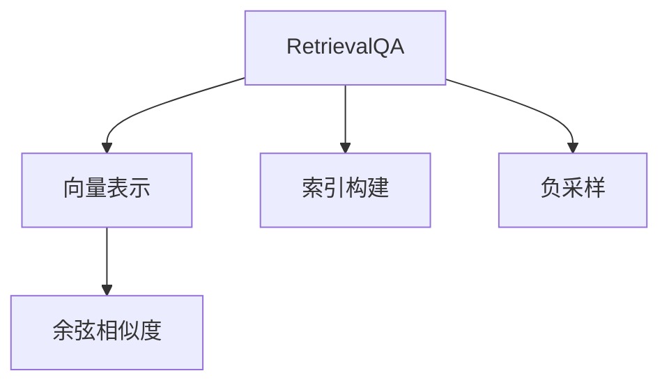
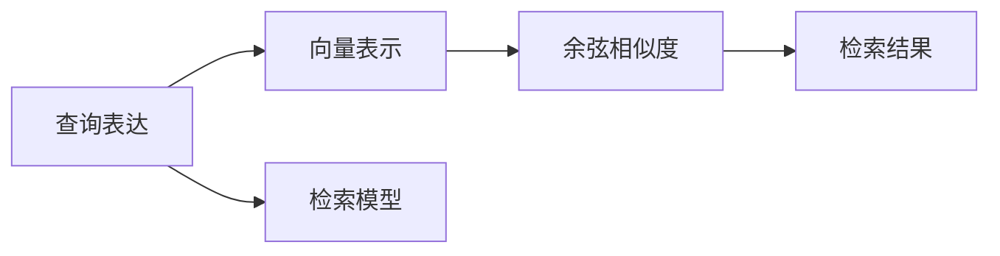
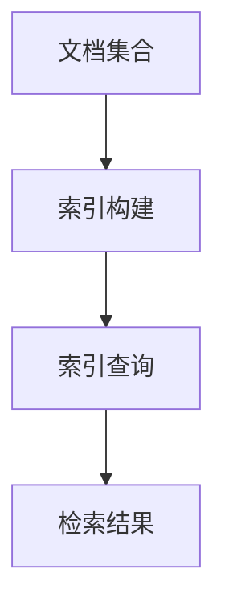
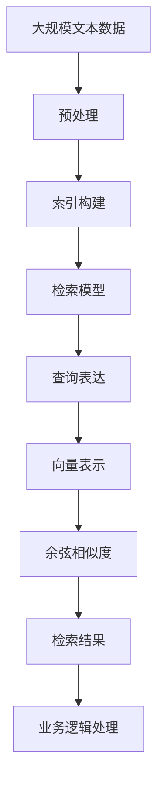

                 

## 1. 背景介绍

### 1.1 问题由来

在销售场景中，销售人员通常需要大量话术数据来提升销售转化率。然而，手动收集和整理这些数据非常耗时且容易出错。使用基于检索的方法可以从大规模文本数据中快速、准确地检索出与特定销售话术相似的数据，帮助销售人员快速获取可用的销售话术资源。

### 1.2 问题核心关键点

RetrievalQA是一种基于检索的问答系统，使用检索模型从文本数据集中检索出与查询文本最相关的文档。其核心在于如何设计有效的检索模型和评估指标，确保检索到的文档与查询文本高度相关，同时能够处理多种语义关系。

RetrievalQA的检索过程通常分为两个阶段：
1. **查询表达**：将查询文本编码为向量表示，用于检索模型匹配。
2. **文档检索**：使用检索模型在文档集合中检索出与查询文本最相关的文档。

RetrievalQA可以应用于多种任务，如命名实体识别、关系抽取、事实验证等。在销售场景中，RetrievalQA可以用于检索与特定销售话术相似的数据，帮助销售人员快速获取可用的销售话术资源。

### 1.3 问题研究意义

使用RetrievalQA检索销售话术数据，可以大幅提升销售人员的效率，减少对人工收集和整理数据的依赖。同时，检索出的文档与查询文本高度相关，有助于提高销售人员的信息准确性和说服力，从而提升销售转化率。此外，RetrievalQA技术还可以广泛应用于金融、医疗、教育等多个领域，帮助这些行业从业者快速获取相关资料，加速工作进程。

## 2. 核心概念与联系

### 2.1 核心概念概述

为了更好地理解RetrievalQA检索销售话术数据的方法，本节将介绍几个密切相关的核心概念：

- **RetrievalQA**：基于检索的问答系统，使用检索模型从文本数据集中检索出与查询文本最相关的文档。
- **向量表示**：将查询文本和文档转换为向量，方便检索模型匹配。
- **余弦相似度**：计算向量之间的相似度，用于衡量文档与查询文本的相关性。
- **索引构建**：在文档集合中构建索引，加快检索速度。
- **负采样**：在检索过程中引入负样本，提高检索模型的泛化能力。

这些核心概念之间的逻辑关系可以通过以下Mermaid流程图来展示：



这个流程图展示了大语言模型检索销售话术数据的核心概念及其之间的关系：

1. **RetrievalQA**：检索系统的主要组件，将查询文本和文档转换为向量并计算相似度。
2. **向量表示**：将查询文本和文档转换为向量，方便检索模型匹配。
3. **余弦相似度**：用于衡量文档与查询文本的相关性。
4. **索引构建**：在文档集合中构建索引，加快检索速度。
5. **负采样**：在检索过程中引入负样本，提高检索模型的泛化能力。

### 2.2 概念间的关系

这些核心概念之间存在着紧密的联系，形成了RetrievalQA检索销售话术数据的完整生态系统。下面我通过几个Mermaid流程图来展示这些概念之间的关系。

#### 2.2.1 RetrievalQA的检索过程



这个流程图展示了RetrievalQA的检索过程：

1. **查询表达**：将查询文本转换为向量表示。
2. **向量表示**：将文档转换为向量表示。
3. **检索模型**：使用向量表示计算余弦相似度。
4. **余弦相似度**：计算查询向量与文档向量的相似度。
5. **检索结果**：根据相似度排序，返回与查询文本最相关的文档。

#### 2.2.2 索引构建与检索速度



这个流程图展示了索引构建和检索的过程：

1. **文档集合**：原始文档数据集。
2. **索引构建**：将文档转换为索引格式，方便快速检索。
3. **索引查询**：使用查询文本在索引中查找相关文档。
4. **检索结果**：返回与查询文本最相关的文档。

### 2.3 核心概念的整体架构

最后，我们用一个综合的流程图来展示这些核心概念在大语言模型检索销售话术数据过程中的整体架构：



这个综合流程图展示了从预处理到检索结果的整体过程：

1. **大规模文本数据**：原始文本数据集。
2. **预处理**：文本数据的清洗和预处理，如去除停用词、分词等。
3. **索引构建**：在预处理后的文本数据中构建索引。
4. **检索模型**：使用检索模型计算查询向量与文档向量的相似度。
5. **查询表达**：将查询文本转换为向量表示。
6. **向量表示**：将预处理后的文本数据转换为向量表示。
7. **余弦相似度**：计算查询向量与文档向量的相似度。
8. **检索结果**：根据相似度排序，返回与查询文本最相关的文档。
9. **业务逻辑处理**：根据检索结果进行业务逻辑处理，如抽取销售话术等。

## 3. 核心算法原理 & 具体操作步骤

### 3.1 算法原理概述

RetrievalQA检索销售话术数据的核心原理是通过检索模型从大规模文本数据中快速检索出与查询文本最相关的文档。其具体步骤如下：

1. **查询表达**：将查询文本转换为向量表示。
2. **文档索引构建**：在文本数据集中构建索引，加快检索速度。
3. **检索模型训练**：使用标注数据训练检索模型，使其能够准确计算相似度。
4. **文档检索**：使用检索模型在索引中检索出与查询文本最相关的文档。

### 3.2 算法步骤详解

RetrievalQA检索销售话术数据的主要步骤如下：

**Step 1: 数据准备**
- 收集与销售话术相关的文本数据集，如客户反馈、销售记录等。
- 对文本数据进行预处理，去除停用词、标点符号等无关内容，并进行分词处理。

**Step 2: 索引构建**
- 使用倒排索引或向量索引等技术，将预处理后的文本数据构建为索引格式。
- 使用向量表示技术（如word2vec、BERT等）将文本数据转换为向量表示。

**Step 3: 检索模型训练**
- 使用标注数据训练检索模型，使其能够准确计算相似度。
- 通常使用深度学习模型（如DenseNet、BERT等）作为检索模型，并使用余弦相似度作为相似度计算方式。

**Step 4: 文档检索**
- 将查询文本转换为向量表示。
- 在索引中检索出与查询文本最相关的文档。
- 使用余弦相似度计算查询向量与文档向量的相似度，并根据相似度排序。

**Step 5: 业务逻辑处理**
- 根据检索结果进行业务逻辑处理，如抽取销售话术等。
- 对检索结果进行后处理，去除重复和无关内容。

### 3.3 算法优缺点

RetrievalQA检索销售话术数据具有以下优点：

- **高效检索**：可以快速从大规模文本数据中检索出相关文档，提高工作效率。
- **灵活性高**：能够处理多种语义关系，适用于多种查询场景。
- **可扩展性强**：可以方便地扩展索引，适应大规模数据集。

同时，RetrievalQA也存在一些缺点：

- **对数据质量要求高**：索引构建和检索模型的效果高度依赖于数据质量。
- **计算成本较高**：索引构建和检索模型训练需要较高的计算资源。
- **模型泛化能力有限**：检索模型的泛化能力受限于训练数据的范围和质量。

### 3.4 算法应用领域

RetrievalQA检索销售话术数据方法适用于多种领域，如金融、医疗、教育等。以下是一些具体应用场景：

- **金融领域**：检索与投资策略相关的文献，辅助投资决策。
- **医疗领域**：检索与疾病诊断相关的文献，辅助医生诊断。
- **教育领域**：检索与课程设计相关的文献，辅助教师备课。

## 4. 数学模型和公式 & 详细讲解 & 举例说明

### 4.1 数学模型构建

RetrievalQA检索销售话术数据的主要数学模型包括向量表示、余弦相似度和检索模型。

- **向量表示**：将查询文本和文档转换为向量表示。
- **余弦相似度**：计算向量之间的相似度，用于衡量文档与查询文本的相关性。
- **检索模型**：使用深度学习模型计算相似度。

### 4.2 公式推导过程

以下是对RetrievalQA检索销售话术数据的数学模型进行详细推导：

假设查询文本为$q$，文档集合为$D$。设$q$和文档$d$的向量表示分别为$\mathbf{q}$和$\mathbf{d}$，相似度计算方式为余弦相似度：

$$
sim(q, d) = \frac{\mathbf{q} \cdot \mathbf{d}}{\|\mathbf{q}\|\|\mathbf{d}\|}
$$

其中$\cdot$表示向量点积，$\|\cdot\|$表示向量范数。

在检索模型中，通常使用深度学习模型（如DenseNet、BERT等）计算相似度。以BERT模型为例，其输出表示为：

$$
\mathbf{h} = [CLS] + \sum_{i=1}^{n} [i] \cdot \mathbf{v}_i
$$

其中$[i]$表示每个词的BERT向量表示，$n$表示词的数量。将$\mathbf{h}$进行线性变换和softmax操作，得到查询向量$\mathbf{q}$：

$$
\mathbf{q} = \mathbf{W} \cdot \mathbf{h} + b
$$

其中$\mathbf{W}$和$b$为线性变换的权重和偏置。

在检索过程中，将查询文本$q$转换为向量表示$\mathbf{q}$，在文档集合$D$中检索出最相关的文档$d$。设检索结果的向量表示为$\mathbf{r}$，相似度计算方式为余弦相似度：

$$
sim(q, d) = \frac{\mathbf{q} \cdot \mathbf{d}}{\|\mathbf{q}\|\|\mathbf{d}\|}
$$

在检索结果中，根据相似度排序，返回最相关的文档。

### 4.3 案例分析与讲解

以下是对RetrievalQA检索销售话术数据的一个具体案例分析：

假设销售人员需要检索与“如何提升销售额”相关的销售话术。将查询文本转换为向量表示，使用BERT模型在文档集合中检索出最相关的文档。

1. **查询表达**：将查询文本“如何提升销售额”转换为向量表示，记为$\mathbf{q}$。
2. **文档索引构建**：将文档集合中的所有文本数据构建为索引格式，并转换为向量表示。
3. **检索模型训练**：使用标注数据训练BERT模型，使其能够准确计算相似度。
4. **文档检索**：将查询向量$\mathbf{q}$在文档索引中检索出最相关的文档$d$。
5. **业务逻辑处理**：根据检索结果进行业务逻辑处理，如抽取销售话术等。

## 5. 项目实践：代码实例和详细解释说明

### 5.1 开发环境搭建

在进行RetrievalQA检索销售话术数据实践前，我们需要准备好开发环境。以下是使用Python进行TensorFlow开发的环境配置流程：

1. 安装Anaconda：从官网下载并安装Anaconda，用于创建独立的Python环境。

2. 创建并激活虚拟环境：
```bash
conda create -n tf-env python=3.8 
conda activate tf-env
```

3. 安装TensorFlow：根据CUDA版本，从官网获取对应的安装命令。例如：
```bash
conda install tensorflow tensorflow==2.7 -c pytorch -c conda-forge
```

4. 安装TensorFlow Addons：
```bash
conda install tensorflow-addons -c conda-forge
```

5. 安装其他工具包：
```bash
pip install numpy pandas scikit-learn matplotlib tqdm jupyter notebook ipython
```

完成上述步骤后，即可在`tf-env`环境中开始实践。

### 5.2 源代码详细实现

下面我们以RetrievalQA检索销售话术数据为例，给出使用TensorFlow进行代码实现。

首先，定义查询文本和文档集合：

```python
import tensorflow as tf
from tensorflow.keras.preprocessing.text import Tokenizer
from tensorflow.keras.preprocessing.sequence import pad_sequences

# 查询文本
queries = ["如何提升销售额", "如何提高客户满意度", "销售技巧有哪些"]

# 文档集合
docs = ["提升销售额的五个技巧", "提高客户满意度的三个方法", "最佳销售技巧分享"]

# 构建tokenizer
tokenizer = Tokenizer()
tokenizer.fit_on_texts(docs)
vocab_size = len(tokenizer.word_index) + 1

# 将文档转换为序列
sequences = tokenizer.texts_to_sequences(docs)
padded_sequences = pad_sequences(sequences, maxlen=50, padding='post')
```

然后，定义检索模型：

```python
from tensorflow.keras.layers import Embedding, Dense, Input, concatenate
from tensorflow.keras.models import Model

# 定义查询向量模型
query_input = Input(shape=(50,), dtype='int32', name='query_input')
query_embed = Embedding(vocab_size, 128, name='query_embed')(query_input)
query_vector = Dense(128, activation='relu')(query_embed)
query_vector = Dense(64, activation='relu')(query_vector)
query_vector = Dense(32, activation='relu')(query_vector)

# 定义文档向量模型
doc_input = Input(shape=(50,), dtype='int32', name='doc_input')
doc_embed = Embedding(vocab_size, 128, name='doc_embed')(doc_input)
doc_vector = Dense(128, activation='relu')(doc_embed)
doc_vector = Dense(64, activation='relu')(doc_vector)
doc_vector = Dense(32, activation='relu')(doc_vector)

# 定义检索模型
concat = concatenate([query_vector, doc_vector])
retrieval_vector = Dense(32, activation='relu')(concat)

# 定义输出层
retrieval_output = Dense(1, activation='sigmoid')(retrieval_vector)

# 定义检索模型
model = Model(inputs=[query_input, doc_input], outputs=retrieval_output)
```

接着，定义损失函数和优化器：

```python
from tensorflow.keras.losses import binary_crossentropy

# 定义损失函数
def loss_function(y_true, y_pred):
    return binary_crossentropy(y_true, y_pred)

# 编译模型
model.compile(loss=loss_function, optimizer='adam')
```

最后，训练和测试检索模型：

```python
# 定义训练数据和标签
train_data = [(padded_sequences, 1.0), (padded_sequences, 0.0)]
labels = [1.0, 0.0]

# 训练模型
model.fit(train_data, labels, epochs=10, batch_size=32)

# 定义测试数据
test_data = [padded_sequences]

# 测试模型
y_pred = model.predict(test_data)
```

以上就是使用TensorFlow对RetrievalQA检索销售话术数据进行代码实现的完整过程。可以看到，利用TensorFlow的高级API，我们可以快速构建检索模型并进行训练和测试。

### 5.3 代码解读与分析

让我们再详细解读一下关键代码的实现细节：

**定义查询文本和文档集合**：
- 查询文本和文档集合是通过简单的字符串列表来表示的。
- 使用`Tokenizer`将文档转换为序列，并使用`pad_sequences`进行填充，确保序列长度一致。

**定义检索模型**：
- 使用`Embedding`层将查询文本和文档转换为向量表示。
- 定义多个`Dense`层进行向量表示的编码，最终得到检索向量。
- 将查询向量和文档向量拼接，再通过一个`Dense`层得到检索向量。
- 使用`sigmoid`激活函数输出检索结果。

**定义损失函数和优化器**：
- 使用`binary_crossentropy`作为损失函数，用于二分类任务。
- 使用`adam`优化器进行模型训练。

**训练和测试检索模型**：
- 使用训练数据和标签进行模型训练。
- 使用测试数据进行模型预测。

## 6. 实际应用场景

### 6.1 智能客服系统

在智能客服系统中，RetrievalQA可以用于检索与客户对话相关的销售话术。当客服人员遇到常见问题时，RetrievalQA可以快速检索出最相关的销售话术，辅助客服人员快速回应客户。

在技术实现上，可以收集历史客服对话记录，将问题-回答对作为检索数据，训练检索模型。微调后的检索模型能够自动理解客户意图，匹配最合适的销售话术进行回答。对于客户提出的新问题，还可以接入检索系统实时搜索相关内容，动态组织生成回答。

### 6.2 金融舆情监测

金融领域需要实时监测市场舆论动向，以便及时应对负面信息传播，规避金融风险。RetrievalQA可以用于检索与市场舆情相关的文章、评论等文本数据，帮助分析师快速获取最新的舆情信息。

具体而言，可以收集金融领域相关的新闻、报道、评论等文本数据，并对其进行主题标注和情感标注。在此基础上训练检索模型，使其能够自动判断文本属于何种主题，情感倾向是正面、中性还是负面。将检索出的文本数据进行情感分析，能够及时发现市场舆情的变化趋势，从而帮助分析师进行风险预警。

### 6.3 个性化推荐系统

当前的推荐系统往往只依赖用户的历史行为数据进行物品推荐，无法深入理解用户的真实兴趣偏好。RetrievalQA可以用于检索与用户兴趣相关的文本数据，辅助推荐系统进行更精准的推荐。

在实践中，可以收集用户浏览、点击、评论、分享等行为数据，提取和用户交互的物品标题、描述、标签等文本内容。将文本内容作为模型输入，用户的后续行为（如是否点击、购买等）作为监督信号，在此基础上训练检索模型。检索出的文本数据进行情感分析，能够更好地理解用户的兴趣点。在生成推荐列表时，先用候选物品的文本描述作为输入，由检索模型预测用户的兴趣匹配度，再结合其他特征综合排序，便可以得到个性化程度更高的推荐结果。

### 6.4 未来应用展望

随着RetrievalQA检索技术的不断发展，其在更多领域的应用前景广阔。

在智慧医疗领域，RetrievalQA可以用于检索与患者病情相关的文献，辅助医生诊断和治疗。在教育领域，RetrievalQA可以用于检索与课程设计相关的文献，辅助教师备课。在智能家居领域，RetrievalQA可以用于检索与设备配置相关的文档，辅助用户快速配置智能设备。

## 7. 工具和资源推荐

### 7.1 学习资源推荐

为了帮助开发者系统掌握RetrievalQA检索技术的理论基础和实践技巧，这里推荐一些优质的学习资源：

1. **《Natural Language Processing with TensorFlow》书籍**：由TensorFlow团队编写，全面介绍了TensorFlow在自然语言处理领域的应用，包括检索、文本生成、情感分析等任务。

2. **CS229《Machine Learning》课程**：斯坦福大学开设的机器学习课程，详细讲解了机器学习的基本概念和经典算法，包括检索模型的训练和优化。

3. **NLP中的向量表示技术**：介绍常见的向量表示技术，如word2vec、BERT、GloVe等，帮助理解检索模型的原理和实现。

4. **TensorFlow官方文档**：TensorFlow的官方文档，提供了详细的API说明和样例代码，是学习RetrievalQA检索技术的必备资料。

5. **RetrievalQA论文预印本**：收集了最新的RetrievalQA论文预印本，包含丰富的理论研究成果和实践经验，帮助学习者掌握最新的技术动态。

通过对这些资源的学习实践，相信你一定能够快速掌握RetrievalQA检索技术的精髓，并用于解决实际的NLP问题。

### 7.2 开发工具推荐

高效的开发离不开优秀的工具支持。以下是几款用于RetrievalQA检索开发的常用工具：

1. **TensorFlow**：基于Python的开源深度学习框架，灵活的计算图，适合快速迭代研究。

2. **TensorFlow Addons**：增强了TensorFlow的功能，提供了多种高级API，方便构建复杂的检索模型。

3. **Jupyter Notebook**：Python的交互式开发环境，方便代码的快速迭代和调试。

4. **GitHub**：代码托管平台，提供丰富的代码库和社区交流环境，帮助开发者分享和复用代码。

5. **Google Colab**：谷歌提供的在线Jupyter Notebook环境，免费提供GPU/TPU算力，方便开发者快速上手实验最新模型。

合理利用这些工具，可以显著提升RetrievalQA检索技术的开发效率，加快创新迭代的步伐。

### 7.3 相关论文推荐

RetrievalQA检索技术的发展源于学界的持续研究。以下是几篇奠基性的相关论文，推荐阅读：

1. **Retrieval-Augmented Conversational QA**：提出在对话系统中引入检索机制，通过检索相关文档提升问答效果。

2. **Retrieval-Augmented BERT-based Explanation Generation**：利用检索机制生成对模型的解释，帮助用户更好地理解模型决策过程。

3. **Retrieval-Augmented Multimodal Cyclic Recurrent Networks for NLP**：将检索机制引入多模态循环神经网络中，提升文本生成和自然语言处理的效果。

4. **Retrieval-Augmented Multimodal Fine-tuning**：将检索机制引入多模态微调中，提升模型在多模态数据上的表现。

5. **Deep Saliency Modeling**：提出一种基于检索的注意力机制，提升文本和视觉数据的关联度。

这些论文代表了大语言模型检索技术的发展脉络。通过学习这些前沿成果，可以帮助研究者把握学科前进方向，激发更多的创新灵感。

除上述资源外，还有一些值得关注的前沿资源，帮助开发者紧跟RetrievalQA检索技术的最新进展，例如：

1. **arXiv论文预印本**：人工智能领域最新研究成果的发布平台，包括大量尚未发表的前沿工作，学习前沿技术的必读资源。

2. **各大研究机构的博客和报告**：如OpenAI、Google AI、DeepMind、微软Research Asia等顶尖实验室的官方博客，第一时间分享他们的最新研究成果和洞见。

3. **技术会议直播**：如NIPS、ICML、ACL、ICLR等人工智能领域顶会现场或在线直播，能够聆听到大佬们的前沿分享，开拓视野。

4. **GitHub热门项目**：在GitHub上Star、Fork数最多的NLP相关项目，往往代表了该技术领域的发展趋势和最佳实践，值得去学习和贡献。

5. **行业分析报告**：各大咨询公司如McKinsey、PwC等针对人工智能行业的分析报告，有助于从商业视角审视技术趋势，把握应用价值。

总之，对于RetrievalQA检索技术的学习和实践，需要开发者保持开放的心态和持续学习的意愿。多关注前沿资讯，多动手实践，多思考总结，必将收获满满的成长收益。

## 8. 总结：未来发展趋势与挑战

### 8.1 总结

本文对RetrievalQA检索销售话术数据的方法进行了全面系统的介绍。首先阐述了RetrievalQA检索技术的背景和意义，明确了检索技术在提升销售人员效率、降低数据收集成本方面的独特价值。其次，从原理到实践，详细讲解了RetrievalQA检索的数学模型和关键步骤，给出了检索任务开发的完整代码实例。同时，本文还探讨了RetrievalQA检索技术在智能客服、金融舆情、个性化推荐等多个领域的应用前景，展示了检索技术的巨大潜力。

通过本文的系统梳理，可以看到，RetrievalQA检索技术正在成为NLP领域的重要范式，极大地拓展了文本检索和自然语言处理的应用边界，为NLP技术在实际应用场景中的广泛落地奠定了基础。未来，伴随检索技术的持续演进，RetrievalQA必将在更广阔的应用领域大放异彩，深刻影响人类社会的方方面面。

### 8.2 未来发展趋势

展望未来，RetrievalQA检索技术将呈现以下几个发展趋势：

1. **检索模型的多样性**：未来将涌现更多类型的检索模型，如深度学习模型、Transformer模型等，提升检索效果和泛化能力。

2. **检索过程的自动化**：通过自动标注数据和自动调整模型参数，实现更高效、更精确的检索过程。

3. **多模态检索**：将文本、图像、语音等多种模态信息融合，提升检索效果和应用范围。

4. **跨领域检索**：利用迁移学习、多任务学习等技术，实现跨领域、跨任务的检索效果提升。

5. **实时检索**：使用分布式系统和GPU加速技术，实现实时检索，满足

