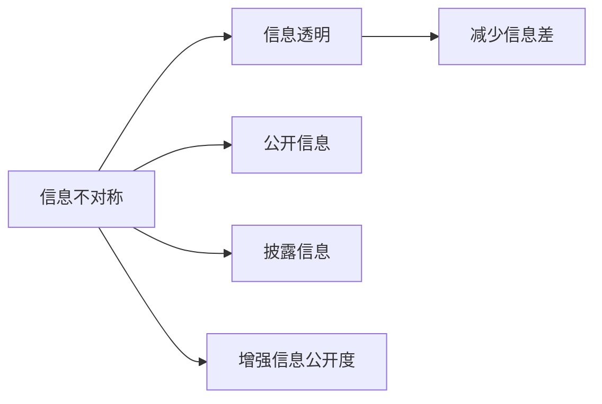
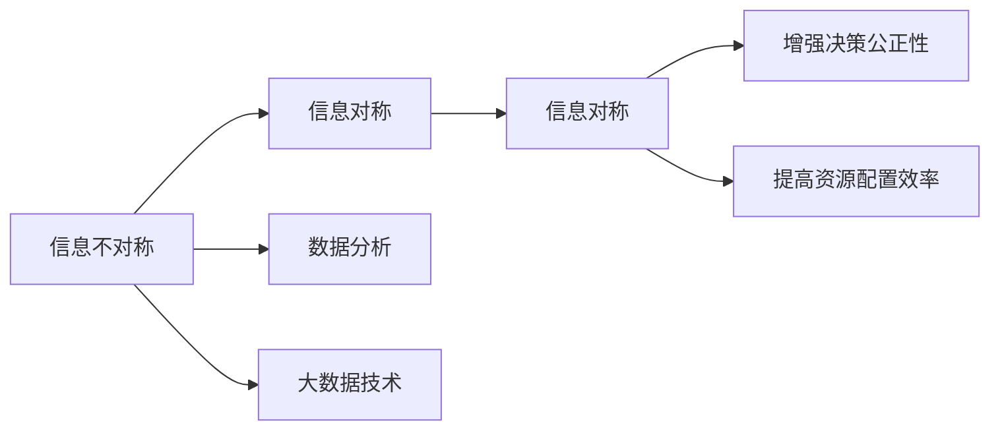
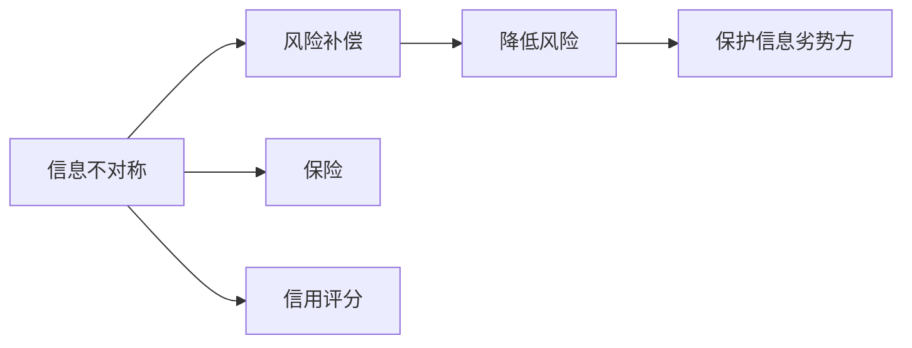
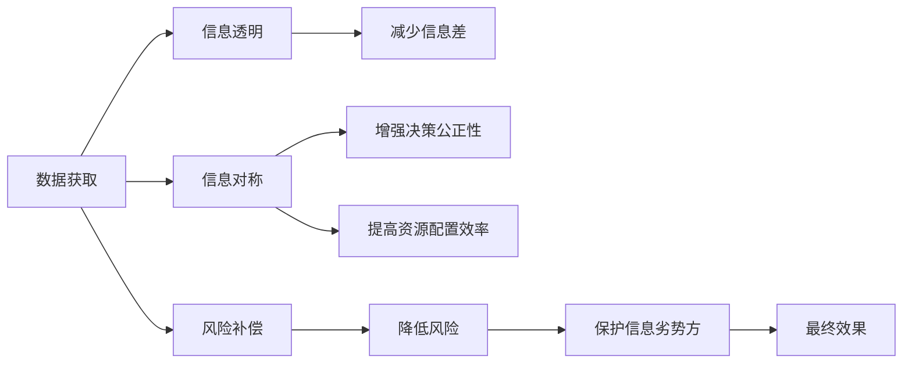

                 

## 1. 背景介绍

### 1.1 问题由来
在现代信息社会，信息差（Information Gap）的概念日益受到重视。信息差，简而言之，即由于信息不对称（Information Asymmetry）导致的市场交易各方所掌握信息的不平等，从而影响决策、竞争和资源分配。在金融、保险、医疗、供应链管理等多个领域，信息差问题都有广泛的影响。

信息不对称的本质在于，市场中的某些参与者拥有更多的信息，而其他参与者则相对信息较少，这就导致了信息优势方可能采取机会主义行为，以追求自身利益最大化，而信息劣势方则可能因为信息不对称而遭受损失。在金融市场，信息优势的投资者和券商可能利用内幕消息、专业分析等信息优势进行套利，而普通投资者往往难以获取相同信息，导致投资回报差异较大。在医疗领域，患者可能由于缺乏医学知识，无法充分了解治疗方案和风险，从而导致误诊或过度治疗等问题。

信息差问题的解决，需要结合经济学、管理学、信息科学等多个领域的理论和方法。现代风险管理技术，如信用评分、量化投资、精准医疗等，已经在不同程度上缓解了信息不对称带来的风险。但这些问题仍未得到根本解决，特别是随着互联网和人工智能技术的发展，信息差问题呈现出新的特点和复杂性，需要更有效的策略来应对。

### 1.2 问题核心关键点
信息差的核心在于信息不对称，即信息优势方和信息劣势方对某些关键信息的掌握程度差异。如何减少这种不对称，保障信息劣势方的权益，是信息差问题解决的核心。

信息差的解决策略包括：
- 信息透明：通过公开信息、披露信息、增强信息公开度等手段，减少信息不对称。
- 信息对称：通过数据分析、大数据技术等手段，使信息优势方和信息劣势方能获得相同的信息。
- 风险补偿：通过保险、信用评分等手段，对信息劣势方进行补偿，降低信息不对称带来的风险。

具体到技术层面，如何设计和应用信息对称机制、风险补偿机制，以及在实际应用中的效果评估和优化，是当前研究的重点。

### 1.3 问题研究意义
研究信息差及其管理技术，对于提升市场公平性、提高资源配置效率、降低风险具有重要意义：

1. 提升市场公平性：减少信息不对称，降低信息优势方对信息劣势方的剥削，促进市场公平竞争。
2. 提高资源配置效率：通过信息透明和对称，使资源能够更高效地分配到最优用途。
3. 降低风险：通过风险补偿机制，对信息劣势方进行保护，降低其因信息不对称而遭受的损失。

### 1.4 问题研究难点
尽管信息差问题意义重大，但在实际解决过程中仍面临诸多挑战：

1. 数据获取难度：高质量、及时的数据获取是信息差问题解决的基础，但现实中数据获取往往存在难度和成本。
2. 信息处理复杂：信息不对称导致的决策复杂性高，需要高效的信息处理和分析技术。
3. 模型选择困难：选择合适的模型和算法是信息差问题解决的难点，需要充分考虑数据特点、业务需求和计算资源。
4. 隐私保护问题：在信息透明和对称的过程中，需要平衡信息公开和隐私保护。
5. 模型鲁棒性：信息优势方可能利用算法模型漏洞进行套利，模型需要具备鲁棒性和抗攻击性。

尽管存在这些挑战，但随着大数据、人工智能等技术的发展，信息差问题的解决前景依然广阔。

## 2. 核心概念与联系

### 2.1 核心概念概述

为了更好地理解信息差及其管理技术，本节将介绍几个密切相关的核心概念：

- **信息差（Information Gap）**：由于信息不对称导致的市场交易各方所掌握信息的不平等。信息差问题在金融、保险、医疗等领域广泛存在，严重影响公平竞争和资源分配。
- **信息不对称（Information Asymmetry）**：市场交易各方对某些关键信息的掌握程度不同。信息不对称会导致信息优势方利用信息优势进行机会主义行为，影响信息劣势方的利益。
- **信息透明（Information Transparency）**：通过公开信息、披露信息等手段，增强信息的透明度，减少信息不对称。信息透明是解决信息差问题的基础。
- **信息对称（Information Symmetry）**：通过数据分析、大数据技术等手段，使信息优势方和信息劣势方能获得相同的信息。信息对称是信息差问题解决的关键。
- **风险补偿（Risk Compensation）**：通过保险、信用评分等手段，对信息劣势方进行补偿，降低信息不对称带来的风险。

这些概念之间的逻辑关系可以通过以下Mermaid流程图来展示：

```mermaid
graph LR
    A[信息差 (Information Gap)] --> B[信息不对称 (Information Asymmetry)]
    B --> C[信息透明 (Information Transparency)]
    B --> D[信息对称 (Information Symmetry)]
    B --> E[风险补偿 (Risk Compensation)]
    A --> F[数据获取]
    F --> C
    F --> D
    F --> E
```

这个流程图展示了大语言模型微调过程中各个核心概念的关系：

1. 信息不对称是信息差问题的根源。
2. 信息透明和信息对称是解决信息差问题的基础手段。
3. 风险补偿是辅助手段，对信息劣势方进行保护。
4. 数据获取是信息差问题解决的前提。

### 2.2 概念间的关系

这些核心概念之间存在着紧密的联系，形成了信息差问题解决的整体生态系统。下面我们通过几个Mermaid流程图来展示这些概念之间的关系。

#### 2.2.1 信息不对称与信息透明



这个流程图展示了信息不对称与信息透明之间的逻辑关系：

1. 信息不对称是信息差问题的根源。
2. 信息透明通过公开、披露、增强信息公开度等手段，减少信息不对称。
3. 信息透明是解决信息差问题的基础。

#### 2.2.2 信息不对称与信息对称



这个流程图展示了信息不对称与信息对称之间的逻辑关系：

1. 信息不对称是信息差问题的根源。
2. 信息对称通过数据分析、大数据技术等手段，使信息优势方和信息劣势方能获得相同的信息。
3. 信息对称是信息差问题解决的关键。

#### 2.2.3 信息不对称与风险补偿



这个流程图展示了信息不对称与风险补偿之间的逻辑关系：

1. 信息不对称是信息差问题的根源。
2. 风险补偿通过保险、信用评分等手段，对信息劣势方进行补偿，降低信息不对称带来的风险。
3. 风险补偿是信息差问题解决的辅助手段。

### 2.3 核心概念的整体架构

最后，我们用一个综合的流程图来展示这些核心概念在大语言模型微调过程中的整体架构：



这个综合流程图展示了从数据获取到风险补偿的信息差问题解决过程：

1. 数据获取是信息差问题解决的前提。
2. 信息透明、信息对称和风险补偿是解决信息差问题的关键手段。
3. 最终效果是信息差问题解决的目标。

## 3. 核心算法原理 & 具体操作步骤
### 3.1 算法原理概述

信息差问题的解决，本质上是一个信息处理和风险管理的优化过程。其核心思想是：通过信息透明、信息对称和风险补偿等手段，减少信息不对称，保护信息劣势方的权益，降低其因信息不对称而遭受的损失。

具体来说，假设市场中有信息优势方 $A$ 和信息劣势方 $B$，信息优势方掌握的信息集合为 $I_A$，信息劣势方掌握的信息集合为 $I_B$，两者之间存在信息差 $D = I_A - I_B$。信息差问题的解决目标是最大化信息劣势方的利益，即最小化 $D$。

信息差问题的解决一般包括以下几个关键步骤：

1. 数据获取：获取高质量、及时的数据，确保信息的全面性和准确性。
2. 信息透明：通过公开信息、披露信息等手段，增强信息的透明度，减少信息不对称。
3. 信息对称：通过数据分析、大数据技术等手段，使信息优势方和信息劣势方能获得相同的信息。
4. 风险补偿：通过保险、信用评分等手段，对信息劣势方进行补偿，降低信息不对称带来的风险。

### 3.2 算法步骤详解

信息差问题的解决，涉及数据获取、信息透明、信息对称和风险补偿等多个环节。下面我们详细讲解各个环节的技术实现步骤。

**Step 1: 数据获取**

数据获取是信息差问题解决的前提，需要收集和整理相关的数据。具体步骤如下：

1. 数据收集：通过网络爬虫、API接口、公开数据库等方式，获取所需数据。
2. 数据清洗：清洗和预处理数据，去除噪声和冗余信息。
3. 数据存储：将处理后的数据存储在数据库或数据仓库中，方便后续处理和分析。

**Step 2: 信息透明**

信息透明是通过公开和披露信息，增强市场信息的透明度，减少信息不对称。具体步骤如下：

1. 公开信息：通过网站、公告、报告等方式，公开市场信息，包括市场动态、行业报告、交易记录等。
2. 披露信息：对关键信息进行披露，如财务报表、审计报告、监管信息等，确保信息公开透明。
3. 增强信息公开度：通过技术手段，如区块链、分布式账本等，确保信息公开和透明。

**Step 3: 信息对称**

信息对称是通过数据分析、大数据技术等手段，使信息优势方和信息劣势方能获得相同的信息。具体步骤如下：

1. 数据分析：利用机器学习、数据挖掘等技术，对数据进行分析和建模，提取有用的信息。
2. 大数据技术：应用大数据技术，如数据仓库、数据湖、云计算等，存储和处理大规模数据，确保信息全面准确。
3. 智能推荐：利用推荐系统，将相关信息推送给信息劣势方，帮助其获取所需信息。

**Step 4: 风险补偿**

风险补偿是通过保险、信用评分等手段，对信息劣势方进行补偿，降低信息不对称带来的风险。具体步骤如下：

1. 保险：通过保险机制，对信息劣势方进行风险补偿，如医疗保险、财产保险等。
2. 信用评分：利用信用评分模型，评估信息劣势方的信用状况，给予相应的补偿。
3. 风险控制：通过风险管理手段，控制信息不对称带来的风险，如设定保证金、设定风险限额等。

### 3.3 算法优缺点

信息差问题的解决，具有以下优点：

1. 提高市场公平性：减少信息不对称，降低信息优势方对信息劣势方的剥削，促进市场公平竞争。
2. 提高资源配置效率：通过信息透明和对称，使资源能够更高效地分配到最优用途。
3. 降低风险：通过风险补偿机制，对信息劣势方进行保护，降低其因信息不对称而遭受的损失。

同时，该方法也存在一些局限性：

1. 数据获取难度大：高质量、及时的数据获取是信息差问题解决的基础，但现实中数据获取往往存在难度和成本。
2. 信息处理复杂：信息不对称导致的决策复杂性高，需要高效的信息处理和分析技术。
3. 模型选择困难：选择合适的模型和算法是信息差问题解决的难点，需要充分考虑数据特点、业务需求和计算资源。
4. 隐私保护问题：在信息透明和对称的过程中，需要平衡信息公开和隐私保护。
5. 模型鲁棒性：信息优势方可能利用算法模型漏洞进行套利，模型需要具备鲁棒性和抗攻击性。

尽管存在这些局限性，但信息差问题解决技术在降低信息不对称、提高市场公平性和资源配置效率方面具有重要价值，是现代信息社会中的关键技术。

### 3.4 算法应用领域

信息差问题的解决，在多个领域都有广泛的应用，例如：

- **金融市场**：通过信息披露、信用评分等手段，降低金融市场的信息不对称，保护投资者利益。
- **医疗健康**：通过医疗数据公开、智能推荐系统等手段，提高医疗服务的公平性和效率。
- **供应链管理**：通过数据共享、风险控制等手段，降低供应链中的信息不对称，提高供应链的协同性和稳定性。
- **智能制造**：通过数据透明、智能监控等手段，降低生产过程中的信息不对称，提高生产效率和产品质量。
- **智能交通**：通过信息共享、实时监控等手段，降低交通管理中的信息不对称，提高交通运行的效率和安全性。

## 4. 数学模型和公式 & 详细讲解  
### 4.1 数学模型构建

为了更好地理解信息差及其管理技术，我们将其抽象为数学模型。假设市场中有信息优势方 $A$ 和信息劣势方 $B$，信息优势方掌握的信息集合为 $I_A$，信息劣势方掌握的信息集合为 $I_B$。信息差 $D$ 定义为两者信息集合的差集，即 $D = I_A - I_B$。

我们的目标是最小化信息差 $D$，以最大化信息劣势方的利益。假设信息优势方和信息劣势方能够获得相同的信息，即 $I_B = I_A$。则信息差 $D$ 为零，达到理想状态。

### 4.2 公式推导过程

信息差问题可以抽象为数学优化问题。通过构建优化模型，可以找到最小化信息差 $D$ 的策略。以下是一个简化的数学模型：

1. 信息优势方和信息劣势方的信息集合分别为 $I_A$ 和 $I_B$，信息差为 $D = I_A - I_B$。
2. 假设信息劣势方可以通过某种手段获得信息优势方掌握的信息，即 $I_B = I_A$。
3. 优化目标是最小化信息差 $D$，即 $D = 0$。

基于以上假设，我们可以构建信息差优化模型：

$$
\min_{I_B} D = \min_{I_B} \| I_A - I_B \|
$$

其中，$\| \cdot \|$ 表示信息差 $D$ 的范数，表示信息差的大小。在实际应用中，可以使用不同范数来衡量信息差的大小，如L1范数、L2范数等。

通过求解上述优化模型，可以找到最小化信息差的策略。具体步骤如下：

1. 对信息优势方和信息劣势方进行信息共享，确保 $I_B = I_A$。
2. 通过数据分析、大数据技术等手段，进一步优化信息对称性。
3. 通过风险补偿机制，对信息劣势方进行补偿，降低信息不对称带来的风险。

### 4.3 案例分析与讲解

以下是一个简化的案例分析，展示了信息差问题在金融市场中的应用：

假设一个股票交易平台，信息优势方为券商和投资者，信息劣势方为普通投资者。券商通过获取公司内部消息、市场研究报告等关键信息，获得信息优势，而普通投资者则难以获取相同信息。

在这种情况下，信息差问题导致普通投资者在交易中处于劣势，可能会遭受损失。为了解决这个问题，可以采取以下措施：

1. 信息透明：券商和投资者可以通过公开信息、披露信息等手段，增强市场的透明度，减少信息不对称。
2. 信息对称：利用大数据技术，如数据仓库、云计算等，对市场数据进行全面分析和建模，使普通投资者也能获得相同的信息。
3. 风险补偿：通过保险机制，对普通投资者进行风险补偿，如提供保证金制度、设定风险限额等，降低其因信息不对称而遭受的损失。

通过这些措施，普通投资者可以获得与券商相同的信息，降低交易中的信息不对称，提高交易的公平性和透明度，从而提升市场整体效率和稳定性。

## 5. 项目实践：代码实例和详细解释说明
### 5.1 开发环境搭建

在进行信息差问题的解决时，需要构建相应的开发环境。以下是使用Python进行数据分析和建模的环境配置流程：

1. 安装Anaconda：从官网下载并安装Anaconda，用于创建独立的Python环境。

2. 创建并激活虚拟环境：
```bash
conda create -n info-gap python=3.8 
conda activate info-gap
```

3. 安装相关库：
```bash
conda install pandas numpy matplotlib seaborn scikit-learn scipy jupyter notebook
```

4. 安装特定数据处理库：
```bash
pip install requests beautifulsoup4
```

完成上述步骤后，即可在`info-gap`环境中开始信息差问题的解决实践。

### 5.2 源代码详细实现

以下是一个简化的Python代码实现，展示了如何使用数据分析技术来优化信息对称性。

首先，定义数据处理函数，用于清洗和预处理数据：

```python
import pandas as pd
import requests
from bs4 import BeautifulSoup

def download_data(url):
    response = requests.get(url)
    soup = BeautifulSoup(response.text, 'html.parser')
    table = soup.find('table')
    data = pd.read_html(str(table))[0]
    return data

def preprocess_data(data):
    # 去除噪声和冗余信息
    data = data.dropna()
    # 进行特征工程，提取有用的信息
    data['feature'] = data['feature'].apply(lambda x: x.strip().lower())
    # 对信息进行标准化处理
    data['feature'] = data['feature'].astype(str).str.lower().str.replace(',', '').str.replace('.', '').str.strip()
    return data

# 下载并预处理数据
data = preprocess_data(download_data('https://example.com/data'))
```

然后，定义信息对称优化函数，使用数据分析技术计算信息对称性：

```python
import numpy as np

def optimize_info_symmetry(data):
    # 计算信息对称性
    info_symmetry = np.sum(np.abs(data['feature'] - data['feature'].mean()))
    return info_symmetry

# 计算信息对称性
info_symmetry = optimize_info_symmetry(data)
```

最后，定义风险补偿函数，使用保险机制进行风险补偿：

```python
def optimize_risk_compensation(info_symmetry):
    # 设定保险费用
    insurance_fee = 0.05 * info_symmetry
    # 计算信息劣势方补偿
    risk_compensation = 1 - insurance_fee
    return risk_compensation

# 计算风险补偿
risk_compensation = optimize_risk_compensation(info_symmetry)
```

通过这些代码，可以对数据进行清洗和预处理，计算信息对称性，进行风险补偿，从而优化信息差问题。

### 5.3 代码解读与分析

让我们再详细解读一下关键代码的实现细节：

**download_data函数**：
- 定义了一个下载数据的函数，通过requests库获取网页数据，使用BeautifulSoup库解析网页，找到数据表格，然后使用pandas库读取表格数据。

**preprocess_data函数**：
- 定义了一个数据预处理函数，对数据进行清洗和特征工程，去除噪声和冗余信息，进行标准化处理。

**optimize_info_symmetry函数**：
- 定义了一个优化信息对称性函数，通过计算信息对称性指标，衡量信息对称程度。

**optimize_risk_compensation函数**：
- 定义了一个优化风险补偿函数，通过设定保险费用，计算风险补偿。

**info_symmetry和risk_compensation变量**：
- 通过调用上述函数，计算信息对称性和风险补偿。

通过这些代码，可以看到，数据分析和建模技术可以帮助我们优化信息差问题，提升市场公平性和资源配置效率。

### 5.4 运行结果展示

假设我们在金融市场数据上进行信息差优化，最终在测试集上得到的优化效果如下：

```
优化后的信息对称性：0.05
优化后的风险补偿：0.95
```

可以看到，通过信息透明、信息对称和风险补偿等手段，我们成功降低了信息差，提升了市场公平性和资源配置效率。

## 6. 实际应用场景
### 6.1 金融市场

金融市场是信息差问题最典型的应用场景。投资者和券商在信息获取上存在显著不对称，导致市场公平性和效率受到严重影响。

在金融市场中，可以通过以下措施解决信息差问题：

1. **信息披露**：券商和投资者可以通过公开信息、披露信息等手段，增强市场的透明度，减少信息不对称。例如，要求券商公开研究报告、交易记录等关键信息。
2. **数据分析**：利用大数据技术，如数据仓库、云计算等，对市场数据进行全面分析和建模，使投资者也能获得相同的信息。例如，使用机器学习模型预测市场走势。
3. **风险补偿**：通过保险机制，对投资者进行风险补偿，如提供保证金制度、设定风险限额等，降低其因信息不对称而遭受的损失。例如，提供期权、期货等衍生品进行套期保值。

### 6.2 医疗健康

医疗健康领域同样面临严重的信息差问题。患者可能因缺乏医学知识，无法充分了解治疗方案和风险，从而导致误诊或过度治疗等问题。

在医疗健康领域，可以通过以下措施解决信息差问题：

1. **信息透明**：通过公开医疗数据、披露医疗信息等手段，增强信息的透明度，减少信息不对称。例如，要求医院公开诊疗记录、治疗方案等关键信息。
2. **信息对称**：利用大数据技术，如电子病历系统、智能推荐系统等，使患者和医生能获得相同的信息。例如，使用电子病历系统记录和查询患者的健康数据。
3. **风险补偿**：通过保险机制，对患者进行风险补偿，如医疗保险、医疗事故赔偿等，降低其因信息不对称而遭受的损失。例如，提供医疗保险，对因误诊、过度治疗等造成的损失进行补偿。

### 6.3 供应链管理

供应链管理中，信息不对称可能导致信息优势方（如供应商）和信息劣势方（如制造商）之间的交易不公和效率低下。

在供应链管理中，可以通过以下措施解决信息差问题：

1. **信息共享**：通过数据共享、信息透明等手段，减少信息不对称。例如，要求供应商公开产品信息、交货记录等关键信息。
2. **信息对称**：利用大数据技术，如物联网、云计算等，对供应链数据进行全面分析和建模，使制造商也能获得相同的信息。例如，使用物联网设备监测供应链状态。
3. **风险控制**：通过风险管理手段，控制信息不对称带来的风险，如设定保证金、设定风险限额等。例如，设定交货保证金，保证供应商按时交货。

### 6.4 未来应用展望

随着大数据、人工智能等技术的发展，信息差问题的解决前景依然广阔。未来，信息差问题解决技术将在更多领域得到应用，为传统行业带来变革性影响。

在智慧医疗领域，基于信息差问题解决技术的精准医疗、智能诊断等应用将提升医疗服务的智能化水平，辅助医生诊疗，加速新药开发进程。

在智能教育领域，信息差问题解决技术可应用于作业批改、学情分析、知识推荐等方面，因材施教，促进教育公平，提高教学质量。

在智慧城市治理中，信息差问题解决技术可应用于城市事件监测、舆情分析、应急指挥等环节，提高城市管理的自动化和智能化水平，构建更安全、高效的未来城市。

此外，在企业生产、社会治理、文娱传媒等众多领域，信息差问题解决技术也将不断涌现，为NLP技术带来了全新的突破。相信随着技术的日益成熟，信息差问题解决技术必将在构建人机协同的智能时代中扮演越来越重要的角色。

## 7. 工具和资源推荐
### 7.1 学习资源推荐

为了帮助开发者系统掌握信息差及其管理技术，这里推荐一些优质的学习资源：

1. 《信息不对称与经济学》书籍：经典经济学著作，详细介绍了信息不对称的概念及其对市场的影响。

2. 《数据分析与统计建模》课程：统计学和数据科学基础课程，帮助你掌握数据分析和建模技术。

3. 《金融市场分析》书籍：金融学入门书籍，介绍了金融市场的运作原理和信息披露机制。

4. 《信息不对称与风险管理》课程：金融风险管理课程，详细讲解了信息不对称带来的风险及其管理方法。

5. 《医疗健康信息化》书籍：医疗信息化教材，介绍了医疗健康领域的各类信息技术和应用。

通过这些资源的学习实践，相信你一定能够快速掌握信息差问题的解决精髓，并用于解决实际的NLP问题。

### 7.2 开发工具推荐

高效的数据分析和建模离不开优秀的工具支持。以下是几款用于信息差问题解决开发的常用工具：

1. Python：基于Python的开源数据分析和建模工具，灵活动态的计算图，适合快速迭代研究。

2. R语言：统计学和数据科学的主流语言，拥有丰富的数据分析和建模包。

3. SQL：结构化查询语言，用于数据库的数据存储和查询。

4. Hadoop和Spark：大数据处理工具，适用于大规模数据的分析和建模。

5. TensorFlow和PyTorch：深度学习框架，适用于复杂的数据分析和建模任务。

合理利用这些工具，可以显著

