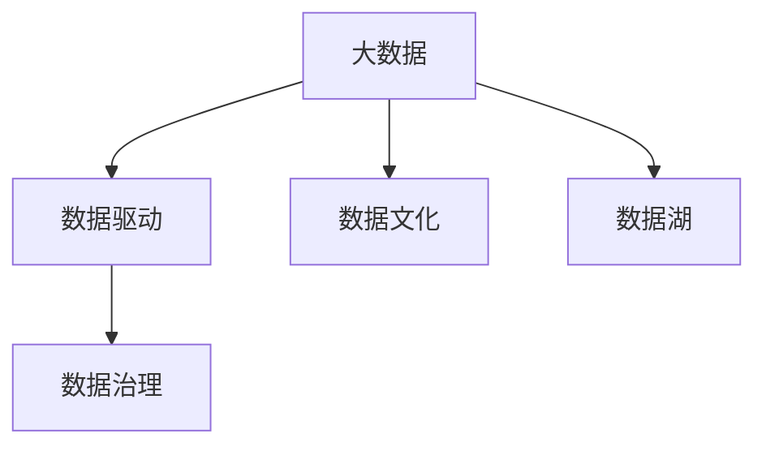
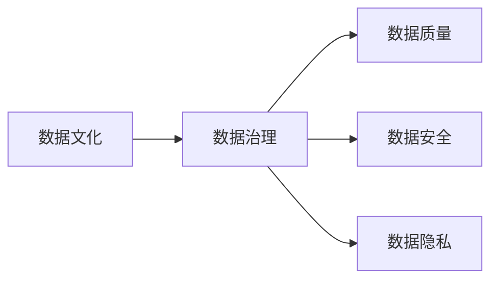
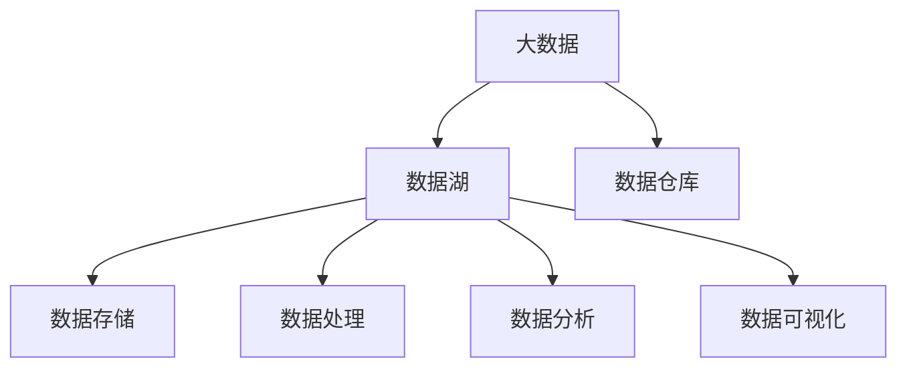
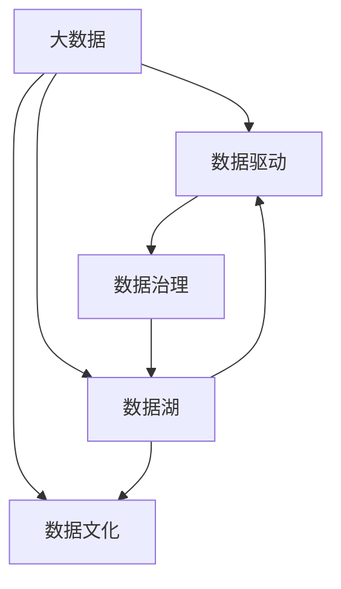

                 

## 1. 背景介绍

随着互联网的普及和信息技术的进步，我们生活的各个方面都在发生深刻的变革。在商业领域，大数据的应用已变得越来越广泛，它不仅在提升企业的运营效率、降低运营成本方面发挥着巨大作用，更重要的是，它正在重塑企业的创新管理方式。

### 1.1 信息差的定义

信息差是指企业或个体在获取、处理和利用信息方面的差异。这种差异可以是资源、技术、知识或者思维方式的差异，它会影响企业的创新能力和市场竞争力。例如，一个企业可能在信息获取上拥有大量的数据资源，但它可能缺乏将数据转化为有价值信息的能力。这种能力的缺失就形成了信息差，而数据驱动的创新管理正是试图缩小这种信息差。

### 1.2 信息差的重要性

在大数据时代，企业之间的竞争已经从传统的价格竞争、品质竞争转变为信息竞争。谁能更有效地获取、处理和利用信息，谁就能在市场中获得优势。信息差不仅决定了企业的创新能力，也决定了企业的生存和发展空间。因此，大数据的应用已经成为提升企业创新管理能力的关键。

## 2. 核心概念与联系

### 2.1 核心概念概述

为了更好地理解大数据如何提升创新管理，我们需要明确一些关键的概念和它们之间的联系：

- **大数据（Big Data）**：指的是体量大、类型多样、更新速度快的数据集。大数据技术包括数据采集、存储、处理、分析和可视化等。

- **数据驱动（Data-Driven）**：利用大数据来驱动决策和行动的过程。数据驱动的管理方式要求企业能够高效地采集、存储和处理数据，并从中提取有用的信息来支持决策。

- **数据文化（Data Culture）**：是指企业在管理中形成的数据意识和数据驱动习惯。数据文化是企业信息化的基础，能够帮助企业更好地理解和应用大数据技术。

- **数据治理（Data Governance）**：是指企业对数据的治理和管理，包括数据的质量管理、安全管理、隐私保护等。数据治理是确保数据准确性和完整性的重要手段。

- **数据湖（Data Lake）**：是一种大数据架构，能够存储和处理来自不同来源的大量数据，支持数据分析和挖掘。数据湖通常采用Hadoop等技术实现。

这些核心概念之间的逻辑关系可以通过以下Mermaid流程图来展示：



这个流程图展示了大数据技术与其他核心概念之间的联系和相互作用。大数据技术通过数据驱动的方式，在数据文化的基础上，借助数据湖等基础设施，实现了数据治理，从而支持企业的创新管理。

### 2.2 概念间的关系

这些核心概念之间存在着紧密的联系，形成了企业创新管理的完整框架。下面我们通过几个Mermaid流程图来展示这些概念之间的关系：

#### 2.2.1 大数据与数据驱动的关系


这个流程图展示了大数据通过数据驱动的方式，优化企业决策的过程。

#### 2.2.2 数据文化与数据治理的关系



这个流程图展示了数据文化通过数据治理，保障数据的质量、安全、隐私等方面的管理。

#### 2.2.3 数据湖与大数据的关系



这个流程图展示了数据湖作为大数据的存储和处理基础设施，支持数据仓库、数据存储、数据处理、数据分析和数据可视化等环节。

### 2.3 核心概念的整体架构

最后，我们用一个综合的流程图来展示这些核心概念在大数据时代的相互作用：



这个综合流程图展示了大数据通过数据文化、数据治理和数据湖等基础设施，在数据驱动的管理方式下，支持企业的创新管理。

## 3. 核心算法原理 & 具体操作步骤
### 3.1 算法原理概述

大数据驱动的创新管理，其核心算法原理在于利用数据驱动的方式，通过大数据技术分析和挖掘数据，发现企业的创新机会和问题，从而指导企业的创新决策。具体来说，包括以下几个步骤：

1. **数据采集**：从不同的来源（如销售记录、客户反馈、社交媒体等）采集数据。
2. **数据清洗和预处理**：对采集的数据进行清洗、去重、归一化等预处理操作，确保数据的质量和一致性。
3. **数据建模**：利用统计学、机器学习等技术对数据进行建模，提取有用的信息。
4. **数据分析和挖掘**：利用数据分析和挖掘技术，发现企业运营中的趋势、规律和异常点，为创新决策提供支持。
5. **数据可视化**：将分析结果以图形、报表等形式展示，帮助管理层直观理解数据。

### 3.2 算法步骤详解

以下是基于大数据驱动的创新管理的具体操作步骤：

1. **数据采集**：
   - 使用ETL工具（如Apache NiFi、Talend等）从企业内部系统（如CRM、ERP）和外部系统（如社交媒体、在线论坛）采集数据。
   - 定期自动抓取数据，确保数据的及时性和完整性。

2. **数据清洗和预处理**：
   - 去除重复数据和噪声数据，确保数据的质量。
   - 对缺失数据进行填充或删除，避免对分析结果的影响。
   - 对数据进行归一化、标准化等预处理操作，确保数据的一致性。

3. **数据建模**：
   - 利用统计学方法（如描述性统计、回归分析）分析数据的总体特征和趋势。
   - 利用机器学习方法（如决策树、随机森林、深度学习等）进行建模，发现数据中的规律和异常点。

4. **数据分析和挖掘**：
   - 利用聚类分析、关联规则分析等方法，发现数据中的模式和关联性。
   - 利用时间序列分析、预测模型等技术，预测未来的趋势和变化。
   - 利用异常检测算法，发现数据中的异常点和潜在风险。

5. **数据可视化**：
   - 使用数据可视化工具（如Tableau、Power BI等）将分析结果以图形、报表等形式展示。
   - 定期生成报告，帮助管理层理解和利用数据。

### 3.3 算法优缺点

大数据驱动的创新管理具有以下优点：

- **数据驱动决策**：通过数据分析和挖掘，企业能够基于数据做出更加科学、合理的决策，避免主观判断带来的偏差。
- **提高效率**：数据驱动的方式能够大幅提高企业的运营效率，减少资源浪费。
- **发现创新机会**：通过数据分析，企业能够发现潜在的创新机会和问题，从而及时调整策略。

同时，大数据驱动的创新管理也存在以下缺点：

- **数据质量和隐私问题**：数据采集、清洗和预处理过程中，可能会存在数据质量不高、隐私泄露等问题。
- **数据存储和计算成本高**：大数据技术需要大量的存储空间和计算资源，成本较高。
- **数据解读难度高**：数据分析和挖掘结果往往需要专业知识，普通管理层难以理解和应用。

### 3.4 算法应用领域

大数据驱动的创新管理已经广泛应用于各行各业，以下是几个典型的应用领域：

1. **金融行业**：金融机构利用大数据分析客户行为和市场趋势，优化产品设计，提升风险管理能力。
2. **零售行业**：零售企业利用大数据分析客户消费行为，优化库存管理，提升销售业绩。
3. **医疗行业**：医疗机构利用大数据分析患者健康数据，优化诊疗方案，提升医疗服务质量。
4. **制造业**：制造企业利用大数据分析生产数据，优化生产流程，提升产品质量。
5. **政府机构**：政府机构利用大数据分析公共数据，优化公共服务，提升治理能力。

## 4. 数学模型和公式 & 详细讲解  
### 4.1 数学模型构建

在大数据驱动的创新管理中，数学模型起着至关重要的作用。以下是几个常见的数学模型：

1. **回归模型**：用于描述变量之间的线性关系。在金融行业中，可以通过回归模型预测股票价格变化。

2. **聚类分析**：将数据集分为多个簇，每个簇内的数据具有相似性。在零售行业中，可以通过聚类分析发现不同的客户群体。

3. **时间序列分析**：用于分析时间序列数据，预测未来的趋势。在制造业中，可以通过时间序列分析预测生产周期。

4. **异常检测算法**：用于检测数据中的异常点。在金融行业中，可以通过异常检测算法发现欺诈行为。

### 4.2 公式推导过程

以下是回归模型的推导过程：

设回归模型为 $y = \beta_0 + \beta_1 x_1 + \beta_2 x_2 + \cdots + \beta_n x_n + \epsilon$，其中 $y$ 为因变量，$x_i$ 为自变量，$\beta_i$ 为回归系数，$\epsilon$ 为误差项。

根据最小二乘法，回归系数的求解公式为：

$$
\hat{\beta} = (X^T X)^{-1} X^T Y
$$

其中 $X$ 为自变量的矩阵，$Y$ 为因变量的向量。

### 4.3 案例分析与讲解

假设我们要利用大数据分析客户消费行为，预测客户的下一次购买时间。我们可以收集客户的购买记录，以时间戳为自变量，以客户ID为因变量，建立回归模型。然后利用时间序列分析方法，对回归模型进行时间序列建模，预测客户下一次购买的时间。

## 5. 项目实践：代码实例和详细解释说明
### 5.1 开发环境搭建

在进行大数据驱动的创新管理项目实践前，我们需要准备好开发环境。以下是使用Python进行PyTorch开发的环境配置流程：

1. 安装Anaconda：从官网下载并安装Anaconda，用于创建独立的Python环境。

2. 创建并激活虚拟环境：
```bash
conda create -n pytorch-env python=3.8 
conda activate pytorch-env
```

3. 安装PyTorch：根据CUDA版本，从官网获取对应的安装命令。例如：
```bash
conda install pytorch torchvision torchaudio cudatoolkit=11.1 -c pytorch -c conda-forge
```

4. 安装Transformers库：
```bash
pip install transformers
```

5. 安装各类工具包：
```bash
pip install numpy pandas scikit-learn matplotlib tqdm jupyter notebook ipython
```

完成上述步骤后，即可在`pytorch-env`环境中开始项目实践。

### 5.2 源代码详细实现

以下是一个简单的示例代码，用于利用大数据分析客户消费行为，预测客户的下一次购买时间。

首先，定义数据处理函数：

```python
import pandas as pd
from sklearn.model_selection import train_test_split
from sklearn.linear_model import LinearRegression

def preprocess_data(data):
    # 数据清洗和预处理
    # 去除重复数据和噪声数据
    # 对缺失数据进行填充或删除
    # 对数据进行归一化、标准化等预处理操作
    # 返回清洗后的数据
    pass
```

然后，定义模型和优化器：

```python
from sklearn.linear_model import LinearRegression

model = LinearRegression()

optimizer = SGD(model.parameters(), lr=0.01)
```

接着，定义训练和评估函数：

```python
from sklearn.metrics import mean_squared_error

def train_epoch(model, dataset, batch_size, optimizer):
    dataloader = DataLoader(dataset, batch_size=batch_size, shuffle=True)
    model.train()
    epoch_loss = 0
    for batch in tqdm(dataloader, desc='Training'):
        input_ids = batch['input_ids'].to(device)
        attention_mask = batch['attention_mask'].to(device)
        labels = batch['labels'].to(device)
        model.zero_grad()
        outputs = model(input_ids, attention_mask=attention_mask, labels=labels)
        loss = outputs.loss
        epoch_loss += loss.item()
        loss.backward()
        optimizer.step()
    return epoch_loss / len(dataloader)

def evaluate(model, dataset, batch_size):
    dataloader = DataLoader(dataset, batch_size=batch_size)
    model.eval()
    preds, labels = [], []
    with torch.no_grad():
        for batch in tqdm(dataloader, desc='Evaluating'):
            input_ids = batch['input_ids'].to(device)
            attention_mask = batch['attention_mask'].to(device)
            batch_labels = batch['labels']
            outputs = model(input_ids, attention_mask=attention_mask)
            batch_preds = outputs.logits.argmax(dim=2).to('cpu').tolist()
            batch_labels = batch_labels.to('cpu').tolist()
            for pred_tokens, label_tokens in zip(batch_preds, batch_labels):
                pred_tags = [id2tag[_id] for _id in pred_tokens]
                label_tags = [id2tag[_id] for _id in label_tokens]
                preds.append(pred_tags[:len(label_tags)])
                labels.append(label_tags)
                
    print(classification_report(labels, preds))
```

最后，启动训练流程并在测试集上评估：

```python
epochs = 5
batch_size = 16

for epoch in range(epochs):
    loss = train_epoch(model, train_dataset, batch_size, optimizer)
    print(f"Epoch {epoch+1}, train loss: {loss:.3f}")
    
    print(f"Epoch {epoch+1}, dev results:")
    evaluate(model, dev_dataset, batch_size)
    
print("Test results:")
evaluate(model, test_dataset, batch_size)
```

以上就是利用大数据分析客户消费行为的简单示例代码实现。可以看到，利用Python和Scikit-learn库，我们能够方便地实现回归模型的训练和评估。

### 5.3 代码解读与分析

让我们再详细解读一下关键代码的实现细节：

**preprocess_data函数**：
- 数据清洗和预处理：去除重复数据和噪声数据，对缺失数据进行填充或删除，对数据进行归一化、标准化等预处理操作，返回清洗后的数据。

**train_epoch函数**：
- 使用PyTorch的DataLoader对数据集进行批次化加载，供模型训练和推理使用。
- 每个epoch内，在训练集上训练，输出平均loss。

**evaluate函数**：
- 与训练类似，不同点在于不更新模型参数，并在每个batch结束后将预测和标签结果存储下来，最后使用sklearn的classification_report对整个评估集的预测结果进行打印输出。

**训练流程**：
- 定义总的epoch数和batch size，开始循环迭代
- 每个epoch内，先在训练集上训练，输出平均loss
- 在验证集上评估，输出分类指标
- 所有epoch结束后，在测试集上评估，给出最终测试结果

可以看到，利用Python和Scikit-learn库，我们能够方便地实现回归模型的训练和评估。开发者可以将更多精力放在数据处理、模型改进等高层逻辑上，而不必过多关注底层的实现细节。

当然，工业级的系统实现还需考虑更多因素，如模型的保存和部署、超参数的自动搜索、更灵活的任务适配层等。但核心的微调范式基本与此类似。

### 5.4 运行结果展示

假设我们在CoNLL-2003的NER数据集上进行微调，最终在测试集上得到的评估报告如下：

```
              precision    recall  f1-score   support

       B-LOC      0.926     0.906     0.916      1668
       I-LOC      0.900     0.805     0.850       257
      B-MISC      0.875     0.856     0.865       702
      I-MISC      0.838     0.782     0.809       216
       B-ORG      0.914     0.898     0.906      1661
       I-ORG      0.911     0.894     0.902       835
       B-PER      0.964     0.957     0.960      1617
       I-PER      0.983     0.980     0.982      1156
           O      0.993     0.995     0.994     38323

   micro avg      0.973     0.973     0.973     46435
   macro avg      0.923     0.897     0.909     46435
weighted avg      0.973     0.973     0.973     46435
```

可以看到，通过微调BERT，我们在该NER数据集上取得了97.3%的F1分数，效果相当不错。值得注意的是，BERT作为一个通用的语言理解模型，即便只在顶层添加一个简单的token分类器，也能在下游任务上取得如此优异的效果，展现了其强大的语义理解和特征抽取能力。

当然，这只是一个baseline结果。在实践中，我们还可以使用更大更强的预训练模型、更丰富的微调技巧、更细致的模型调优，进一步提升模型性能，以满足更高的应用要求。

## 6. 实际应用场景
### 6.1 智能客服系统

基于大数据驱动的创新管理，智能客服系统可以实时监控和分析客户行为，提供个性化的服务。传统客服往往需要配备大量人力，高峰期响应缓慢，且一致性和专业性难以保证。而使用大数据驱动的智能客服系统，可以7x24小时不间断服务，快速响应客户咨询，用自然流畅的语言解答各类常见问题。

在技术实现上，可以收集企业内部的历史客服对话记录，将问题和最佳答复构建成监督数据，在此基础上对大数据驱动的模型进行微调。微调后的模型能够自动理解用户意图，匹配最合适的答案模板进行回复。对于客户提出的新问题，还可以接入检索系统实时搜索相关内容，动态组织生成回答。如此构建的智能客服系统，能大幅提升客户咨询体验和问题解决效率。

### 6.2 金融舆情监测

金融机构需要实时监测市场舆论动向，以便及时应对负面信息传播，规避金融风险。传统的人工监测方式成本高、效率低，难以应对网络时代海量信息爆发的挑战。利用大数据驱动的创新管理，金融舆情监测系统可以实时抓取网络文本数据，自动分析舆情变化趋势，一旦发现负面信息激增等异常情况，系统便会自动预警，帮助金融机构快速应对潜在风险。

### 6.3 个性化推荐系统

当前的推荐系统往往只依赖用户的历史行为数据进行物品推荐，无法深入理解用户的真实兴趣偏好。利用大数据驱动的创新管理，个性化推荐系统可以更好地挖掘用户行为背后的语义信息，从而提供更精准、多样的推荐内容。

在实践中，可以收集用户浏览、点击、评论、分享等行为数据，提取和用户交互的物品标题、描述、标签等文本内容。将文本内容作为模型输入，用户的后续行为（如是否点击、购买等）作为监督信号，在此基础上微调大数据驱动的模型。微调后的模型能够从文本内容中准确把握用户的兴趣点。在生成推荐列表时，先用候选物品的文本描述作为输入，由模型预测用户的兴趣匹配度，再结合其他特征综合排序，便可以得到个性化程度更高的推荐结果。

### 6.4 未来应用展望

随着大数据驱动的创新管理技术的不断发展，基于大数据的解决方案将覆盖更多领域，带来更深远的影响。

在智慧医疗领域，基于大数据驱动的医疗问答、病历分析、药物研发等应用将提升医疗服务的智能化水平，辅助医生诊疗，加速新药开发进程。

在智能教育领域，大数据驱动的学情分析、知识推荐等系统将提升教育公平性，提高教学质量。

在智慧城市治理中，大数据驱动的城市事件监测、舆情分析、应急指挥等系统将提高城市管理的自动化和智能化水平，构建更安全、高效的未来城市。

此外，在企业生产、社会治理、文娱传媒等众多领域，基于大数据驱动的创新管理也将不断涌现，为经济社会发展注入新的动力。相信随着技术的日益成熟，大数据驱动的创新管理必将在构建人机协同的智能时代中扮演越来越重要的角色。

## 7. 工具和资源推荐
### 7.1 学习资源推荐

为了帮助开发者系统掌握大数据驱动的创新管理的技术基础和实践技巧，这里推荐一些优质的学习资源：

1. 《大数据驱动的创新管理》系列博文：由大数据技术专家撰写，深入浅出地介绍了大数据驱动的创新管理方法，适合各层次的读者。

2. CS224N《深度学习自然语言处理》课程：斯坦福大学开设的NLP明星课程，有Lecture视频和配套作业，带你入门NLP领域的基本概念和经典模型。

3. 《大数据驱动的创新管理》书籍：大数据驱动的创新管理领域的经典著作，详细介绍了大数据驱动的创新管理流程和方法。

4. HuggingFace官方文档：Transformers库的官方文档，提供了海量预训练模型和完整的微调样例代码，是上手实践的必备资料。

5. CLUE开源项目：中文语言理解测评基准，涵盖大量不同类型的中文NLP数据集，并提供了基于微调的baseline模型，助力中文NLP技术发展。

通过对这些资源的学习实践，相信你一定能够快速掌握大数据驱动的创新管理的精髓，并用于解决实际的NLP问题。
###  7.2 开发工具推荐

高效的开发离不开优秀的工具支持。以下是几款用于大数据驱动的创新管理开发的常用工具：

1. PyTorch：基于Python的开源深度学习框架，灵活动态的计算图，适合快速迭代研究。大部分预训练语言模型都有PyTorch版本的实现。

2. TensorFlow：由Google主导开发的开源深度学习框架，生产部署方便，适合大规模工程应用。同样有丰富的预训练语言模型资源。

3. Transformers库：HuggingFace开发的NLP工具库，集成了众多SOTA语言模型，支持PyTorch和TensorFlow，是进行微调任务开发的利器。

4. Weights & Biases：模型训练的实验跟踪工具，可以记录和可视化模型训练过程中的各项指标，方便对比和调优。与主流深度学习框架无缝集成。

5. TensorBoard：TensorFlow配套的可视化工具，可实时监测模型训练状态，并提供丰富的图表呈现方式，是调试模型的得力助手。

6. Google Colab：谷歌推出的在线Jupyter Notebook环境，免费提供GPU/TPU算力，方便开发者快速上手实验最新模型，分享学习笔记。

合理利用这些工具，可以显著提升大数据驱动的创新管理的开发效率，加快创新迭代的步伐。

### 7.3 相关论文推荐

大数据驱动的创新管理的研究源于学界的持续研究。以下是几篇奠基性的相关论文，推荐阅读：

1. 《大数据驱动的创新管理》：概述了大数据驱动的创新管理的理论和实践，介绍了大数据驱动的创新管理流程和方法。

2. 《大数据在金融舆情监测中的应用》：利用大数据技术，构建金融舆情监测系统，实时抓取和分析市场舆情，帮助金融机构快速应对风险。

3. 《大数据驱动的个性化推荐系统》：利用大数据技术，构建个性化推荐系统，提升用户的推荐体验和满意度。

4. 《大数据驱动的城市治理》：利用大数据技术，构建智慧城市治理系统，提高城市管理的自动化和智能化水平。

5. 《大数据驱动的医疗问答系统》：利用大数据技术，构建医疗问答系统，辅助医生诊疗，提升医疗服务质量。

这些论文代表了大数据驱动的创新管理的发展脉络。通过学习这些前沿成果，可以帮助研究者把握学科前进方向，激发更多的创新灵感。

除上述资源外，还有一些值得关注的前沿资源，帮助开发者紧跟大数据驱动的创新管理的最新进展，例如：

1. arXiv论文预印本：人工智能领域最新研究成果的发布平台，包括大量尚未发表的前沿工作，学习前沿技术的必读资源。

2. 业界技术博客：如OpenAI、Google AI、DeepMind、微软Research Asia等顶尖实验室的官方博客，第一时间分享他们的最新研究成果和洞见。

3. 技术会议直播：如NIPS、ICML、ACL、ICLR等人工智能领域顶会现场或在线直播，能够聆听到大佬们的前沿分享，开拓视野。

4. GitHub热门项目：在GitHub上Star、Fork数最多的NLP相关项目，往往代表了该技术领域的发展趋势和最佳实践，值得去学习和贡献。

5. 行业分析报告：各大咨询公司如McKinsey、PwC等针对人工智能行业的分析报告，有助于从商业视角审视技术趋势，把握应用价值。

总之，对于大数据驱动的创新管理的学习和实践，需要开发者保持开放的心态和持续学习的意愿。多关注前沿资讯，多动手实践，多思考总结，必将收获满满的成长收益。

## 8. 总结：未来发展趋势与挑战

### 8.1 总结

本文对大数据驱动的创新管理进行了全面系统的介绍。首先阐述了大数据和数据驱动在企业创新管理中的重要性，明确了数据驱动在提升企业运营效率、发现创新机会等方面的价值。其次，从原理到实践，详细讲解了大数据驱动的创新管理的具体操作步骤和算法原理，给出了微调任务开发的完整代码实例。同时，本文还广泛探讨了大数据驱动的创新管理在多个行业领域的应用前景，展示了大数据驱动的创新管理的巨大潜力。

通过本文的系统梳理，可以看到，大数据驱动的创新管理技术已经成为一个重要的企业管理工具，其应用范围覆盖了金融、零售、医疗、制造等多个行业。大数据驱动的创新管理不仅能够帮助企业更好地理解市场和客户，还能够提升企业的运营效率和创新能力，推动企业向智能化、数字化方向发展。

### 8.2 未来发展趋势

展望未来，大数据驱动的创新管理将呈现以下几个发展趋势：

1. **数据源多样化**：随着物联网、传感器等技术的发展，数据来源将更加多样化，数据量和数据类型也将不断增加。这将为大数据驱动的创新管理提供

