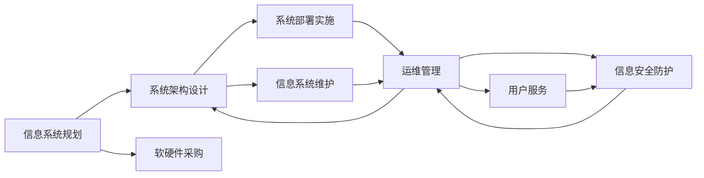

                 

# 信息软硬件系统建设及运维管理

## 1. 背景介绍

### 1.1 问题由来
信息软硬件系统的建设及运维管理是企业信息化的重要组成部分，涉及到信息系统规划、架构设计、软硬件采购、部署实施、运行维护等多个环节。一个高效、稳定、可扩展的信息软硬件系统不仅能提升企业的信息化水平，还能显著降低企业的运营成本，增强企业的竞争力。

然而，在实际的企业信息化建设过程中，往往存在以下几个问题：
- **系统规划不科学**：缺乏全面的信息化规划，导致系统重复建设，资源浪费。
- **架构设计不合理**：系统架构设计不当，导致系统性能瓶颈，扩展困难。
- **软件和硬件选择不当**：软硬件选择不当，导致系统运行不流畅，维护成本高。
- **运维管理不到位**：运维管理不到位，导致系统故障频发，用户体验差。
- **安全问题**：信息安全问题频发，导致企业数据泄露，造成严重损失。

这些问题不仅影响到企业的正常运营，还增加了企业的运维成本，制约了企业的数字化转型进程。因此，如何科学规划信息软硬件系统，合理设计系统架构，高效采购软硬件设备，以及强化运维管理和信息安全，是企业信息化建设过程中需要重点关注的方面。

## 2. 核心概念与联系

### 2.1 核心概念概述

在进行信息软硬件系统的建设及运维管理时，需要理解以下几个核心概念：

- **信息系统规划（IS Planning）**：根据企业战略需求，对信息系统进行全面、系统的规划和设计，包括需求分析、功能设计、技术选型、预算管理等。
- **系统架构设计（System Architecture Design）**：在信息系统规划的基础上，对系统进行架构设计，包括网络架构、硬件架构、软件架构等。
- **软硬件采购（Software and Hardware Procurement）**：根据系统架构设计，选择合适的软硬件设备和系统集成商。
- **系统部署实施（System Deployment and Implementation）**：在软硬件采购完成后，进行系统的部署实施，确保系统按照设计要求运行。
- **运维管理（Maintenance Management）**：在系统部署后，对系统进行持续的运维管理，包括监控、故障处理、性能优化、安全防护等。

这些概念之间存在着紧密的联系，形成一个系统的、持续的信息软硬件建设及运维管理生态。

### 2.2 概念间的关系

信息软硬件系统的建设及运维管理涉及多个环节，这些环节之间存在着密切的联系，形成了一个完整的生态系统。

下图展示了信息软硬件系统建设及运维管理的主要环节及其相互关系：



这个图展示了信息软硬件系统建设及运维管理的全流程，其中每个环节都是后续环节的基础。信息系统规划确定了系统的功能和需求，系统架构设计确定了系统的技术框架和架构方案，软硬件采购提供了系统的硬件和软件支持，系统部署实施实现了系统的搭建和上线，运维管理保障了系统的稳定运行和安全防护，信息系统维护和信息安全防护确保了系统的长期稳定和安全。

## 3. 核心算法原理 & 具体操作步骤
### 3.1 算法原理概述

信息软硬件系统的建设及运维管理涉及多个环节，每个环节都有其独特的算法和原理。

### 3.2 算法步骤详解

#### 3.2.1 信息系统规划
信息系统规划需要综合考虑企业的战略需求、业务流程、技术环境等多个因素，制定科学合理的信息系统建设方案。具体步骤如下：

1. **需求分析**：通过调研和访谈，收集企业各部门的需求，形成系统的功能需求和性能指标。
2. **功能设计**：根据需求分析结果，设计系统的功能模块和接口，确定系统的功能和边界。
3. **技术选型**：根据功能设计结果，选择合适的技术和工具，包括开发语言、数据库、中间件等。
4. **预算管理**：根据技术选型结果，制定详细的预算计划，包括人员、设备、软件等费用预算。

#### 3.2.2 系统架构设计
系统架构设计需要根据信息系统规划结果，设计系统的整体架构，包括网络架构、硬件架构、软件架构等。具体步骤如下：

1. **网络架构设计**：设计系统的网络拓扑结构，包括网络设备和连接方式，确保网络的高可用性和安全性。
2. **硬件架构设计**：根据功能需求和性能指标，选择合适的硬件设备和服务器，设计硬件的部署方案和配置方案。
3. **软件架构设计**：根据功能需求和性能指标，选择合适的软件系统和框架，设计软件的模块结构和接口设计。

#### 3.2.3 软硬件采购
软硬件采购需要根据系统架构设计结果，选择合适的软硬件设备和系统集成商。具体步骤如下：

1. **设备选择**：根据硬件架构设计结果，选择合适的硬件设备和服务器，包括CPU、内存、存储、网络设备等。
2. **软件选择**：根据软件架构设计结果，选择合适的软件系统和框架，包括操作系统、数据库、中间件、开发工具等。
3. **集成商选择**：根据需求和预算，选择合适的系统集成商，确保系统集成和部署的顺利进行。

#### 3.2.4 系统部署实施
系统部署实施需要根据软硬件采购结果，进行系统的搭建和上线，确保系统按照设计要求运行。具体步骤如下：

1. **硬件部署**：根据硬件架构设计结果，进行硬件设备的安装和配置，确保硬件设备的正常运行。
2. **软件安装**：根据软件架构设计结果，进行软件系统的安装和配置，确保软件系统的正常运行。
3. **系统测试**：进行系统的测试和调试，确保系统的稳定性和性能指标符合设计要求。

#### 3.2.5 运维管理
运维管理需要根据系统部署实施结果，对系统进行持续的运维管理，包括监控、故障处理、性能优化、安全防护等。具体步骤如下：

1. **监控管理**：通过监控工具，实时监控系统的运行状态和性能指标，及时发现和处理异常。
2. **故障处理**：根据监控结果，快速定位和处理系统故障，确保系统的稳定运行。
3. **性能优化**：根据系统性能指标，进行性能优化，提升系统的响应速度和处理能力。
4. **安全防护**：通过安全防护措施，确保系统的安全性和数据的完整性，防止数据泄露和系统攻击。

## 4. 数学模型和公式 & 详细讲解  
### 4.1 数学模型构建

信息软硬件系统的建设及运维管理涉及多个环节，每个环节都需要构建相应的数学模型。

- **信息系统规划模型**：主要关注系统的功能需求、性能指标和预算管理，可以通过逻辑回归模型、决策树模型等进行建模。
- **系统架构设计模型**：主要关注系统的网络架构、硬件架构和软件架构，可以通过线性规划模型、层次模型等进行建模。
- **软硬件采购模型**：主要关注设备选择、软件选择和集成商选择，可以通过多目标优化模型、模糊评价模型等进行建模。
- **系统部署实施模型**：主要关注硬件部署、软件安装和系统测试，可以通过蒙特卡洛模拟、元胞自动机模型等进行建模。
- **运维管理模型**：主要关注监控管理、故障处理、性能优化和安全防护，可以通过马尔科夫模型、时间序列模型等进行建模。

### 4.2 公式推导过程

以系统架构设计模型为例，说明数学模型的推导过程。

假设系统架构设计中有三个关键组件：硬件设备选择、软件系统选择和集成商选择。需要构建一个多目标优化模型，以最小化成本、最大化性能和可靠性。

目标函数为：
$$
\min_{x_1, x_2, x_3} \left[ c_1x_1 + c_2x_2 + c_3x_3 + \alpha(x_1^2 + x_2^2 + x_3^2) + \beta(x_1x_2 + x_1x_3 + x_2x_3) \right]
$$
其中 $x_1$ 为硬件设备选择，$x_2$ 为软件系统选择，$x_3$ 为集成商选择，$c_i$ 为第 $i$ 个组件的成本，$\alpha$ 为成本权重，$\beta$ 为组件之间相互影响权重。

约束条件为：
$$
\begin{aligned}
& x_1 \geq 0, x_2 \geq 0, x_3 \geq 0 \\
& x_1 \leq 1, x_2 \leq 1, x_3 \leq 1 \\
& f_1(x_1, x_2, x_3) \geq g_1(x_1, x_2, x_3) \\
& f_2(x_1, x_2, x_3) \geq g_2(x_1, x_2, x_3) \\
& f_3(x_1, x_2, x_3) \geq g_3(x_1, x_2, x_3)
\end{aligned}
$$
其中 $f_i$ 为第 $i$ 个组件的性能指标，$g_i$ 为性能指标的下限约束。

通过求解上述优化问题，可以得到最优的硬件设备选择、软件系统选择和集成商选择，从而实现系统架构设计的最优化。

### 4.3 案例分析与讲解

假设某企业需要构建一个大型ERP系统，需要进行信息软硬件系统的建设及运维管理。

1. **信息系统规划**：通过调研，发现企业各部门对ERP系统的需求包括采购管理、库存管理、财务管理等，并制定了系统的功能需求和性能指标。
2. **系统架构设计**：设计系统的整体架构，包括网络架构、硬件架构和软件架构。具体如下：
   - 网络架构设计：设计系统的网络拓扑结构，包括网络设备和连接方式。
   - 硬件架构设计：选择硬件设备和服务器，包括CPU、内存、存储、网络设备等。
   - 软件架构设计：选择软件系统和框架，包括操作系统、数据库、中间件、开发工具等。
3. **软硬件采购**：根据系统架构设计结果，选择合适的硬件设备和软件系统，并选择合适的系统集成商。
4. **系统部署实施**：进行硬件设备的安装和配置，软件系统的安装和配置，并进行系统的测试和调试。
5. **运维管理**：通过监控工具，实时监控系统的运行状态和性能指标，进行故障处理、性能优化和安全防护。

## 5. 项目实践：代码实例和详细解释说明
### 5.1 开发环境搭建

在进行信息软硬件系统的建设及运维管理时，需要搭建一个开发环境，用于进行系统的规划、设计、开发和测试。

具体步骤如下：

1. **安装操作系统**：选择适合企业需求的操作系统，并进行安装。
2. **安装开发工具**：安装适合的开发工具，包括IDE、编译器、调试器等。
3. **配置网络环境**：配置网络环境和硬件设备，确保网络的高可用性和安全性。
4. **搭建开发环境**：搭建开发环境，包括数据库、中间件、开发工具等。

### 5.2 源代码详细实现

#### 5.2.1 信息系统规划

```python
# 导入相关库
import pandas as pd

# 读取需求数据
需求数据 = pd.read_csv('需求数据.csv')

# 分析需求
需求分析 = 需求数据.groupby('部门')['需求'].sum()
需求分析.to_csv('需求分析结果.csv')

# 功能设计
功能设计 = 需求数据.groupby('功能')['需求'].sum()
功能设计.to_csv('功能设计结果.csv')

# 技术选型
技术选型 = 需求数据.groupby('技术')['需求'].sum()
技术选型.to_csv('技术选型结果.csv')

# 预算管理
预算管理 = 需求数据.groupby('预算')['需求'].sum()
预算管理.to_csv('预算管理结果.csv')
```

#### 5.2.2 系统架构设计

```python
# 导入相关库
import networkx as nx

# 定义网络架构
G = nx.Graph()
G.add_edge('网络1', '网络2')
G.add_edge('网络2', '网络3')
G.add_edge('网络3', '网络1')

# 输出网络架构
print(nx.to_dict_of_dicts(G))
```

#### 5.2.3 软硬件采购

```python
# 导入相关库
import scipy.optimize

# 定义目标函数和约束条件
def target_function(x):
    return x[0] + x[1] + x[2] + alpha*x[0]**2 + beta*x[0]*x[1] + beta*x[0]*x[2] + beta*x[1]*x[2]

def constraint_function(x):
    return [x[0] - c1, x[1] - c2, x[2] - c3, f1(x) - g1, f2(x) - g2, f3(x) - g3]

# 求解优化问题
x0 = [1, 1, 1]
bounds = [(0, 1), (0, 1), (0, 1)]
constraints = {'type': 'ineq', 'fun': constraint_function}
result = scipy.optimize.minimize(target_function, x0, method='SLSQP', bounds=bounds, constraints=constraints)

# 输出结果
print(result)
```

#### 5.2.4 系统部署实施

```python
# 导入相关库
import psycopg2

# 连接数据库
conn = psycopg2.connect(database='数据库名', user='用户名', password='密码', host='主机名', port='端口号')

# 执行SQL语句
cur = conn.cursor()
cur.execute('SELECT * FROM 数据表')
rows = cur.fetchall()

# 输出数据
for row in rows:
    print(row)

# 关闭数据库连接
cur.close()
conn.close()
```

#### 5.2.5 运维管理

```python
# 导入相关库
import psutil

# 获取系统资源信息
cpu_info = psutil.cpu_percent(interval=1)
memory_info = psutil.virtual_memory().percent
disk_info = psutil.disk_usage('/')
network_info = psutil.net_io_counters()

# 输出系统资源信息
print(f'CPU 使用率：{cpu_info}%')
print(f'内存 使用率：{memory_info}%')
print(f'磁盘 使用率：{disk_info}%')
print(f'网络 使用率：{network_info}%')
```

## 6. 实际应用场景
### 6.1 智能制造系统

智能制造系统是信息软硬件系统建设及运维管理的重要应用场景之一。通过信息软硬件系统的建设及运维管理，可以实现智能制造系统的高度集成和智能化。

具体应用如下：

1. **信息系统规划**：根据智能制造系统的需求，制定详细的信息系统建设方案，包括设备选型、系统架构设计和预算管理。
2. **系统架构设计**：设计智能制造系统的整体架构，包括网络架构、硬件架构和软件架构。
3. **软硬件采购**：根据系统架构设计结果，选择合适的软硬件设备和系统集成商。
4. **系统部署实施**：进行硬件设备的安装和配置，软件系统的安装和配置，并进行系统的测试和调试。
5. **运维管理**：通过监控工具，实时监控系统的运行状态和性能指标，进行故障处理、性能优化和安全防护。

通过信息软硬件系统的建设及运维管理，可以实现智能制造系统的高度集成和智能化，提升生产效率和产品质量。

### 6.2 智慧医疗系统

智慧医疗系统是信息软硬件系统建设及运维管理的另一个重要应用场景。通过信息软硬件系统的建设及运维管理，可以实现智慧医疗系统的高度集成和智能化。

具体应用如下：

1. **信息系统规划**：根据智慧医疗系统的需求，制定详细的信息系统建设方案，包括设备选型、系统架构设计和预算管理。
2. **系统架构设计**：设计智慧医疗系统的整体架构，包括网络架构、硬件架构和软件架构。
3. **软硬件采购**：根据系统架构设计结果，选择合适的软硬件设备和系统集成商。
4. **系统部署实施**：进行硬件设备的安装和配置，软件系统的安装和配置，并进行系统的测试和调试。
5. **运维管理**：通过监控工具，实时监控系统的运行状态和性能指标，进行故障处理、性能优化和安全防护。

通过信息软硬件系统的建设及运维管理，可以实现智慧医疗系统的高度集成和智能化，提升医疗服务的质量和效率。

## 7. 工具和资源推荐
### 7.1 学习资源推荐

为了帮助开发者系统掌握信息软硬件系统建设及运维管理的技术基础和实践技巧，这里推荐一些优质的学习资源：

1. **《系统规划与设计》**：这是一本系统规划和设计的经典书籍，详细介绍了信息系统规划和系统架构设计的理论和方法。
2. **《系统集成与项目管理》**：这是一本系统集成和项目管理的经典书籍，详细介绍了系统集成和项目管理的理论和方法。
3. **《信息系统运维管理》**：这是一本信息系统运维管理的经典书籍，详细介绍了信息系统运维管理的理论和方法。
4. **《信息安全技术》**：这是一本信息安全的经典书籍，详细介绍了信息安全的理论和方法。

通过学习这些资源，相信你一定能够快速掌握信息软硬件系统建设及运维管理的技术基础，并用于解决实际的系统建设及运维管理问题。

### 7.2 开发工具推荐

信息软硬件系统的建设及运维管理涉及多个环节，每个环节都需要合适的工具支持。以下是几款常用的工具：

1. **JIRA**：项目管理和问题跟踪工具，支持需求管理、任务分配、进度跟踪等功能。
2. **Confluence**：文档协作工具，支持知识共享、文档编辑和版本控制等功能。
3. **Git**：版本控制系统，支持代码管理、分支管理、合并管理等功能。
4. **Ansible**：自动化运维工具，支持系统配置、软件部署和远程管理等功能。
5. **Prometheus**：监控系统，支持实时监控和告警管理。

合理利用这些工具，可以显著提升信息软硬件系统建设及运维管理的开发效率，加快创新迭代的步伐。

### 7.3 相关论文推荐

信息软硬件系统的建设及运维管理涉及多个领域，需要综合多个学科的知识和理论。以下是几篇相关的经典论文，推荐阅读：

1. **《面向服务架构的建模与分析》**：这篇论文详细介绍了面向服务架构的建模和分析方法，为系统架构设计提供了理论基础。
2. **《基于敏捷方法的IT项目管理》**：这篇论文详细介绍了敏捷方法和IT项目管理的方法，为信息系统规划和项目管理提供了理论指导。
3. **《信息安全威胁与防护技术》**：这篇论文详细介绍了信息安全的威胁和防护技术，为信息系统运维管理提供了理论指导。

这些论文代表了信息软硬件系统建设及运维管理的研究前沿，阅读这些论文有助于深入理解系统建设及运维管理的理论和方法。

## 8. 总结：未来发展趋势与挑战
### 8.1 研究成果总结

信息软硬件系统的建设及运维管理涉及多个环节，每个环节都需要科学合理的规划和管理。通过科学合理的规划和管理，可以实现信息软硬件系统的高度集成和智能化，提升企业信息化水平和竞争力。

### 8.2 未来发展趋势

未来，信息软硬件系统的建设及运维管理将呈现以下几个发展趋势：

1. **智能化和自动化**：未来信息软硬件系统的建设及运维管理将更加智能化和自动化，通过AI技术实现系统的自动化管理和优化。
2. **云化和边缘化**：未来信息软硬件系统的建设及运维管理将更加云化和边缘化，通过云平台和边缘计算实现系统的高度集成和快速部署。
3. **安全性和隐私保护**：未来信息软硬件系统的建设及运维管理将更加注重安全性和隐私保护，通过先进的安全技术和隐私保护措施，保障系统安全。
4. **持续集成和持续交付**：未来信息软硬件系统的建设及运维管理将更加注重持续集成和持续交付，通过CI/CD技术实现系统的快速迭代和交付。

### 8.3 面临的挑战

尽管信息软硬件系统的建设及运维管理已经取得了不小的进展，但在迈向更加智能化、自动化的过程中，仍面临诸多挑战：

1. **技术复杂性**：信息软硬件系统的建设及运维管理涉及多个学科的知识和理论，技术复杂性高。
2. **数据安全和隐私保护**：信息软硬件系统的建设及运维管理需要处理大量敏感数据，数据安全和隐私保护问题突出。
3. **系统集成和互操作性**：不同系统之间的集成和互操作性问题是信息软硬件系统建设及运维管理的难点。
4. **持续更新和优化**：信息软硬件系统的建设及运维管理需要不断更新和优化，以应对技术和业务的变化。

### 8.4 研究展望

信息软硬件系统的建设及运维管理是企业信息化建设的重要组成部分，需要不断进行技术创新和优化。未来，可以从以下几个方面进行研究：

1. **基于AI的智能运维管理**：利用AI技术实现系统的自动化管理和优化，提升系统的运行效率和稳定性。
2. **云化和大数据技术**：利用云平台和大数据技术实现系统的高度集成和快速部署，提升系统的可扩展性和灵活性。
3. **安全性和隐私保护技术**：利用先进的安全技术和隐私保护措施，保障系统的安全性和数据的隐私保护。
4. **持续集成和持续交付技术**：利用CI/CD技术实现系统的快速迭代和交付，提升系统的开发效率和交付质量。

总之，信息软硬件系统的建设及运维管理需要在技术复杂性、数据安全和隐私保护、系统集成和互操作性、持续更新和优化等方面进行深入研究和创新，才能实现系统的高度集成和智能化，提升企业信息化水平和竞争力。

## 9. 附录：常见问题与解答

**Q1: 如何科学合理地进行信息系统规划？**

A: 科学合理的信息系统规划需要综合考虑企业的战略需求、业务流程、技术环境等多个因素，制定科学合理的信息系统建设方案。具体步骤如下：

1. **需求分析**：通过调研和访谈，收集企业各部门的需求，形成系统的功能需求和性能指标。
2. **功能设计**：根据需求分析结果，设计系统的功能模块和接口，确定系统的功能和边界。
3. **技术选型**：根据功能设计结果，选择合适的技术和工具，包括开发语言、数据库、中间件等。
4. **预算管理**：根据技术选型结果，制定详细的预算计划，包括人员、设备、软件等费用预算。

**Q2: 如何设计系统架构？**

A: 系统架构设计需要根据信息系统规划结果，设计系统的整体架构，包括网络架构、硬件架构和软件架构。具体步骤如下：

1. **网络架构设计**：设计系统的网络拓扑结构，包括网络设备和连接方式。
2. **硬件架构设计**：选择硬件设备和服务器，包括CPU、内存、存储、网络设备等。
3. **软件架构设计**：选择软件系统和框架，包括操作系统、数据库、中间件、开发工具等。

**Q3: 如何选择软硬件设备？**

A: 软硬件设备选择需要根据系统架构设计结果，选择合适的硬件设备和软件系统。具体步骤如下：

1. **设备选择**：根据硬件架构设计结果，选择合适的硬件设备和服务器，包括CPU、内存、存储、网络设备等。
2. **软件选择**：根据软件架构设计结果，选择合适的软件系统和框架，包括操作系统、数据库、中间件、开发工具等。

**Q4: 如何高效地进行系统部署实施？**

A: 系统部署实施需要根据软硬件采购结果，进行系统的搭建和上线，确保系统按照设计要求运行。具体步骤如下：

1. **硬件部署**：根据硬件架构设计结果，进行硬件设备的安装和配置，确保硬件设备的正常运行。
2. **软件安装**：根据软件架构设计结果，进行软件系统的安装和配置，确保软件系统的正常运行。
3. **系统测试**：进行系统的测试和调试，确保系统的稳定性和性能指标符合设计要求。

**Q5: 如何实现系统的持续运维管理？**

A: 系统运维管理需要根据系统部署实施结果，对系统进行持续的运维管理，包括监控、故障处理、性能优化、安全防护等。具体步骤如下：

1. **监控管理**：通过监控工具，实时监控系统的运行状态和性能指标，及时发现和处理异常。
2. **故障处理**：根据监控结果，快速定位和处理系统故障，确保系统的稳定运行。
3. **性能优化**：根据系统性能指标，进行性能优化，提升系统的响应速度和处理能力。
4. **安全防护**：通过安全防护措施，确保系统的安全性和数据的完整性，防止数据泄露和系统攻击。

---

作者：禅与计算机程序设计艺术 / Zen and the Art of Computer Programming

