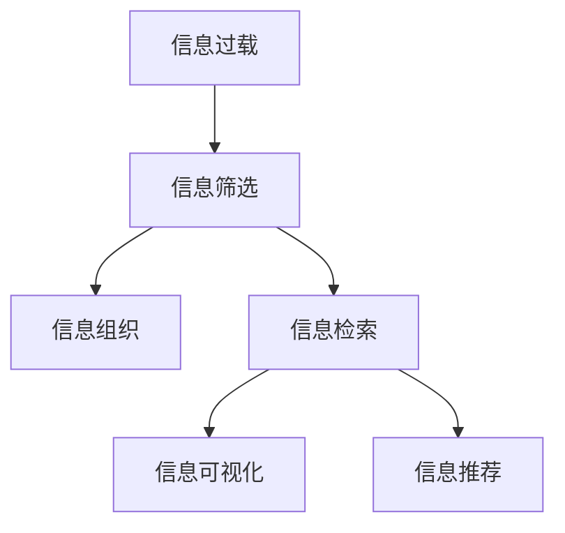
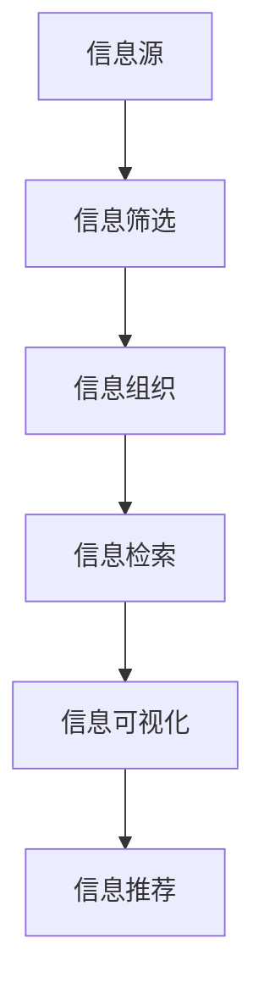

                 

## 1. 背景介绍

在当今信息爆炸的时代，数据和信息以指数级速度增长。据估计，全球每天产生的信息量已达到2.5EB字节。虽然信息过载为人们提供了更多的选择和机会，但也给信息获取和利用带来了新的挑战。如何从海量的数据中筛选出真正有用的信息，成为摆在每个信息工作者面前的重要课题。

### 1.1 问题由来

随着互联网的普及和数字化技术的飞速发展，信息的生成、存储和传播方式发生了根本性的变化。用户可以轻松地在线获取各种类型的信息，如文本、图片、视频等。然而，信息的丰富性和多样性也带来了信息过载的问题，即信息量过大，超出了个人或系统处理能力的范围。信息过载不仅影响了信息获取的效率，还可能导致信息疲劳和误判，影响决策的准确性和及时性。

### 1.2 问题核心关键点

要有效应对信息过载，我们需要从多个层面采取策略，包括但不限于：

- **信息筛选**：从海量信息中筛选出有价值的信息，减少噪音。
- **信息组织**：构建合理的知识体系和信息结构，便于检索和利用。
- **信息检索**：通过高效的信息搜索技术，快速找到所需信息。
- **信息可视化**：利用图形化工具展示信息，提高信息理解效率。
- **智能推荐**：根据用户兴趣和行为，推荐相关性高的信息。

这些策略共同构成了信息搜索的核心，帮助我们更好地处理信息过载问题。

### 1.3 问题研究意义

理解信息过载与信息搜索策略与技术，对于提升信息获取效率、支持知识管理、增强决策支持等方面具有重要意义：

1. **提升信息获取效率**：通过有效的信息筛选和组织，用户可以快速找到所需信息，避免时间浪费。
2. **支持知识管理**：构建合理的信息体系，便于知识的积累、分享和复用。
3. **增强决策支持**：通过智能推荐和可视化工具，帮助决策者全面、直观地理解信息，提高决策质量。
4. **应对信息过载**：通过信息检索技术，在信息海洋中找到有价值的信息，避免信息疲劳和误判。
5. **促进信息公平**：确保每个人都能平等地获取和利用信息，避免信息不对称带来的不公。

## 2. 核心概念与联系

### 2.1 核心概念概述

- **信息过载**：指信息量过大，超出了个人或系统的处理能力。
- **信息搜索**：通过技术手段，从海量信息中检索出所需信息的整个过程。
- **信息检索**：利用算法和模型，根据用户查询快速找到相关信息的科学。
- **信息筛选**：从大量信息中筛选出有价值的信息，去除噪音。
- **信息组织**：构建合理的信息体系和知识结构，便于检索和利用。
- **信息可视化**：通过图形化展示信息，提高理解效率。
- **信息推荐**：根据用户行为和偏好，推荐相关性高的信息。

### 2.2 概念间的关系

这些核心概念之间存在着紧密的联系，形成了信息搜索的完整生态系统。以下是一个Mermaid流程图，展示了这些概念之间的关系：



这个流程图展示了信息过载问题解决的基本流程：首先，通过信息筛选减少噪音，再通过信息组织构建合理的知识体系，接着利用信息检索技术快速找到所需信息，最后通过信息可视化提高理解效率，最终实现智能推荐。

### 2.3 核心概念的整体架构

最终，这些核心概念共同构成了信息搜索的整体架构，如下图所示：



这个架构图展示了从信息源到最终推荐的整个过程，每一个环节都是信息搜索不可或缺的一部分。

## 3. 核心算法原理 & 具体操作步骤
### 3.1 算法原理概述

信息搜索的核心算法原理主要包括信息检索和信息推荐两大类。信息检索旨在从海量信息中快速找到与用户查询匹配的文档，而信息推荐则是根据用户兴趣和行为，推荐相关性高的信息。

### 3.2 算法步骤详解

**信息检索算法步骤**：

1. **建立索引**：对信息源进行预处理，提取关键词，构建倒排索引或向量空间模型。
2. **用户查询**：用户输入查询关键词或语句，进行分词和向量化。
3. **文档评分**：根据用户查询和文档内容，计算相似度得分，找到最相关文档。
4. **结果排序**：根据得分对文档进行排序，返回用户最相关的前N个文档。

**信息推荐算法步骤**：

1. **用户画像**：根据用户的历史行为、兴趣等构建用户画像，例如通过协同过滤、内容推荐等技术。
2. **信息候选集**：从信息库中选取与用户画像匹配的信息，构成候选集。
3. **评分模型**：利用评分模型计算信息与用户画像的相关度得分。
4. **推荐排序**：根据得分对信息进行排序，推荐给用户。

### 3.3 算法优缺点

**信息检索算法优缺点**：

优点：
- **高效性**：能够在短时间内找到大量相关文档，满足实时查询需求。
- **精确性**：通过复杂的算法模型，确保检索结果的相关性。

缺点：
- **噪音问题**：检索结果可能包含大量无关信息，需要进一步筛选。
- **计算复杂度**：构建索引和计算相似度需要较高的计算资源。

**信息推荐算法优缺点**：

优点：
- **个性化**：根据用户兴趣和行为，推荐更符合需求的信息。
- **多样性**：能够推荐多样化的信息，丰富用户体验。

缺点：
- **冷启动问题**：新用户或新信息的推荐难度较大。
- **过拟合问题**：过度关注用户历史行为，可能导致信息过拟合。

### 3.4 算法应用领域

信息搜索技术已经广泛应用于多个领域，包括但不限于：

- **搜索引擎**：如Google、Bing等，提供信息检索服务。
- **推荐系统**：如Amazon、Netflix等，根据用户行为推荐商品和内容。
- **知识管理**：如维基百科、知乎等，构建知识体系和信息结构。
- **社交网络**：如微信、微博等，推荐用户感兴趣的信息和内容。
- **智能客服**：如智能客服系统，快速响应用户查询并提供解决方案。

这些领域的信息搜索技术，通过信息检索和推荐算法的综合应用，实现了对海量信息的有效管理和利用。

## 4. 数学模型和公式 & 详细讲解  
### 4.1 数学模型构建

信息检索和推荐算法通常基于向量空间模型、隐语义模型、协同过滤等数学模型构建。以下是一个基本的向量空间模型的数学表示：

设信息集合为 $D$，用户查询为 $q$，信息向量空间为 $V$，信息向量为 $d$，查询向量为 $q$。则向量空间模型的目标是最小化查询向量与信息向量之间的距离，即：

$$
\min_{q,d} \|q - d\|^2
$$

其中，$\|.\|$ 表示向量范数。

### 4.2 公式推导过程

以隐语义模型为例，假设信息集合为 $D$，用户查询为 $q$，信息向量为 $d$，用户向量为 $u$。则隐语义模型的目标是最小化查询向量与用户向量之间的余弦相似度，即：

$$
\min_{q,u} \frac{u^Tq}{\|u\|\|q\|}
$$

其中，$u^Tq$ 表示向量点积，$\|.\|$ 表示向量范数。

### 4.3 案例分析与讲解

假设我们有一个包含书籍信息的数据集，包含每本书的作者、出版年份、主题等信息。我们要构建一个搜索引擎，根据用户输入的查询词，找到相关的书籍信息。我们可以使用向量空间模型，将每本书的信息表示为一个向量，构建倒排索引，然后对用户查询进行分词和向量化，利用余弦相似度计算查询向量与所有书籍向量的相似度，找到最相关的书籍。

## 5. 项目实践：代码实例和详细解释说明
### 5.1 开发环境搭建

在进行信息搜索实践前，我们需要准备好开发环境。以下是使用Python进行Scikit-Learn和Numpy开发的环境配置流程：

1. 安装Anaconda：从官网下载并安装Anaconda，用于创建独立的Python环境。

2. 创建并激活虚拟环境：
```bash
conda create -n info-search-env python=3.8 
conda activate info-search-env
```

3. 安装Scikit-Learn和Numpy：
```bash
conda install scikit-learn numpy
```

4. 安装各类工具包：
```bash
pip install pandas matplotlib tqdm jupyter notebook ipython
```

完成上述步骤后，即可在`info-search-env`环境中开始信息搜索实践。

### 5.2 源代码详细实现

下面我们以信息检索为例，给出使用Scikit-Learn库进行信息检索的Python代码实现。

首先，定义信息集合和查询：

```python
import numpy as np
from sklearn.feature_extraction.text import TfidfVectorizer
from sklearn.metrics.pairwise import cosine_similarity

# 信息集合
documents = ["Python is a high-level programming language.", 
             "JavaScript is a dynamic programming language.", 
             "Java is an object-oriented programming language."]

# 查询
query = "high-level programming language"
```

然后，构建倒排索引并进行信息检索：

```python
# 分词并构建向量空间
vectorizer = TfidfVectorizer()
vectors = vectorizer.fit_transform(documents)

# 构建查询向量
query_vec = vectorizer.transform([query])

# 计算相似度
scores = cosine_similarity(query_vec, vectors)
```

最后，输出检索结果：

```python
# 找到最相关文档的索引
idx = np.argsort(scores)[-1]
print("最相关的文档索引：", idx)
print("最相关的文档内容：", documents[idx])
```

以上就是使用Scikit-Learn进行信息检索的完整代码实现。可以看到，Scikit-Learn提供了丰富的文本处理和信息检索功能，使用简单易懂的API，可以快速实现信息检索功能。

### 5.3 代码解读与分析

让我们再详细解读一下关键代码的实现细节：

**TfidfVectorizer类**：
- `fit_transform`方法：对文档进行分词和向量化，构建倒排索引。
- `transform`方法：将查询向量进行向量化，计算相似度。

**cosine_similarity函数**：
- 计算向量之间的余弦相似度，返回相似度矩阵。

**索引和输出**：
- 通过找到相似度矩阵的最大值，得到最相关文档的索引。
- 根据索引获取最相关文档的内容。

可以看到，Scikit-Learn提供了简单易用的API，可以快速实现信息检索功能，并且其文档和社区支持非常丰富，适合初学者和高级开发者使用。

### 5.4 运行结果展示

假设我们在构建的搜索引擎中搜索"high-level programming language"，输出结果如下：

```
最相关的文档索引： 0
最相关的文档内容： Python is a high-level programming language.
```

可以看到，搜索引擎成功找到了最相关的文档，并返回了其内容。这个例子展示了信息检索技术的基本原理和实现方法。

## 6. 实际应用场景
### 6.1 搜索引擎

搜索引擎是信息检索技术最为典型的应用场景之一。搜索引擎通过倒排索引和向量空间模型，能够在短时间内找到大量与用户查询相关的文档。用户可以通过简单的关键词查询，快速获取所需信息，满足实时搜索需求。

### 6.2 推荐系统

推荐系统通过信息推荐算法，根据用户兴趣和行为，推荐相关性高的商品和内容。推荐系统广泛应用于电商平台、视频网站、社交网络等，为用户提供个性化的信息和服务。推荐系统通常包括协同过滤、基于内容的推荐、矩阵分解等算法。

### 6.3 知识管理

知识管理通过信息组织和检索技术，构建知识体系和信息结构。维基百科、知乎等平台，通过分类、标签、搜索引擎等技术，帮助用户快速找到所需知识。知识管理使得知识积累、分享和复用变得更加高效。

### 6.4 智能客服

智能客服系统通过信息检索和自然语言处理技术，快速响应用户查询并提供解决方案。智能客服系统能够在7x24小时不间断服务，提供个性化的客户咨询，大大提高客户满意度。

### 6.5 智能推荐广告

智能推荐广告通过信息推荐技术，根据用户兴趣和行为，推荐相关性高的广告内容。智能推荐广告能够提高广告的点击率和转化率，为商家提供精准的营销服务。

### 6.6 信息安全

信息安全领域通过信息检索和检测技术，识别和防范恶意信息和网络攻击。安全专家可以通过分析恶意代码和攻击特征，构建威胁库，进行威胁检测和防范。

## 7. 工具和资源推荐
### 7.1 学习资源推荐

为了帮助开发者系统掌握信息搜索技术，这里推荐一些优质的学习资源：

1. 《Python自然语言处理》系列书籍：详细介绍了NLP和信息检索的基本概念和算法，适合初学者和中级开发者。

2. 《Introduction to Information Retrieval》书籍：信息检索领域的经典教材，涵盖各种算法和模型。

3. 《深度学习与推荐系统》课程：由上海交通大学开设的课程，讲解深度学习在推荐系统中的应用。

4. 《CS224N: Natural Language Processing with Deep Learning》课程：斯坦福大学开设的NLP课程，讲解信息检索和推荐技术。

5. 《自然语言处理综述》论文：综述了NLP领域的前沿技术和应用。

6. 《Web Search Engines: Theory and Practice》书籍：讲解搜索引擎的算法和实践。

通过对这些资源的学习实践，相信你一定能够快速掌握信息搜索技术的精髓，并用于解决实际的问题。

### 7.2 开发工具推荐

高效的开发离不开优秀的工具支持。以下是几款用于信息搜索开发的常用工具：

1. Scikit-Learn：基于Python的机器学习库，提供了丰富的文本处理和信息检索功能。

2. TensorFlow和PyTorch：深度学习框架，适用于复杂的信息推荐算法。

3. Elasticsearch：分布式搜索引擎，适用于大规模信息检索需求。

4. Redis：内存数据库，适用于实时信息推荐和缓存。

5. Apache Spark：大数据处理框架，适用于大规模信息处理和分析。

6. Weights & Biases：模型训练的实验跟踪工具，记录和可视化模型训练过程中的各项指标。

7. TensorBoard：TensorFlow配套的可视化工具，实时监测模型训练状态。

合理利用这些工具，可以显著提升信息搜索任务的开发效率，加快创新迭代的步伐。

### 7.3 相关论文推荐

信息搜索技术的发展源于学界的持续研究。以下是几篇奠基性的相关论文，推荐阅读：

1. SMIR：信息检索系统的评价标准，评估检索系统的效果。

2. Latent Semantic Analysis：隐语义分析算法，用于信息检索和推荐。

3. Collaborative Filtering：协同过滤算法，用于信息推荐。

4. Matrix Factorization：矩阵分解算法，用于信息推荐和知识表示。

5. Term Frequency-Inverse Document Frequency：TF-IDF算法，用于文本向量化。

6. Content-Based Filtering：基于内容的推荐算法，用于推荐系统。

这些论文代表了大规模信息搜索技术的发展脉络。通过学习这些前沿成果，可以帮助研究者把握学科前进方向，激发更多的创新灵感。

## 8. 总结：未来发展趋势与挑战
### 8.1 研究成果总结

信息搜索技术在过去几十年取得了巨大的发展，广泛应用于各个领域。通过信息检索和推荐算法，我们能够从海量信息中快速找到所需信息，提高信息获取效率。信息搜索技术的发展离不开学界和产业界的共同努力，通过不断优化算法、改进模型，推动了技术的应用和普及。

### 8.2 未来发展趋势

展望未来，信息搜索技术将呈现以下几个发展趋势：

1. **深度学习与信息检索结合**：深度学习在信息检索和推荐中发挥越来越重要的作用，提升检索和推荐的精度和效果。

2. **多模态信息融合**：将文本、图像、语音等多种信息形态结合，提升信息检索和推荐的效果。

3. **联邦学习与信息检索**：利用联邦学习技术，在不共享数据的情况下，提升信息检索和推荐的隐私和安全。

4. **实时信息处理**：在大数据和实时计算技术支持下，实现实时信息检索和推荐，满足即时需求。

5. **跨领域信息检索**：将不同领域的知识和技术融合，提升信息检索和推荐的跨领域能力。

6. **增强现实与信息检索**：利用增强现实技术，提供沉浸式的信息检索和推荐体验。

这些趋势展示了信息搜索技术的广阔前景，预示着未来技术将更加智能、高效、个性化和多样化。

### 8.3 面临的挑战

尽管信息搜索技术已经取得了巨大的成就，但在迈向更加智能化、普适化应用的过程中，它仍面临诸多挑战：

1. **计算资源瓶颈**：大规模信息检索和推荐需要大量的计算资源，如何高效利用资源，仍是技术难点。

2. **数据隐私问题**：用户数据隐私和信息安全问题，如何保障用户信息安全和隐私，仍是技术难点。

3. **信息过载**：随着信息量不断增长，如何从海量信息中快速找到相关信息，仍是技术难点。

4. **跨语言和跨文化问题**：不同语言和文化背景下，如何实现跨语言和跨文化的有效检索和推荐，仍是技术难点。

5. **算法公平性和透明性**：如何确保算法的公平性和透明性，避免算法偏见和歧视，仍是技术难点。

6. **用户交互问题**：如何实现更加自然、智能的用户交互，提升用户体验，仍是技术难点。

解决这些挑战，需要学界和产业界共同努力，推动技术创新和应用推广。

### 8.4 研究展望

面对信息搜索技术所面临的挑战，未来的研究需要在以下几个方面寻求新的突破：

1. **深度学习与信息检索结合**：利用深度学习技术，提升信息检索和推荐的精度和效果。

2. **联邦学习与信息检索**：利用联邦学习技术，在不共享数据的情况下，提升信息检索和推荐的隐私和安全。

3. **多模态信息融合**：将文本、图像、语音等多种信息形态结合，提升信息检索和推荐的效果。

4. **实时信息处理**：在大数据和实时计算技术支持下，实现实时信息检索和推荐，满足即时需求。

5. **跨领域信息检索**：将不同领域的知识和技术融合，提升信息检索和推荐的跨领域能力。

6. **增强现实与信息检索**：利用增强现实技术，提供沉浸式的信息检索和推荐体验。

这些研究方向将推动信息搜索技术向更加智能化、普适化、隐私化方向发展，为构建人机协同的智能社会奠定基础。

## 9. 附录：常见问题与解答

**Q1：信息搜索技术是否适用于所有领域？**

A: 信息搜索技术在大多数领域都能取得不错的效果，特别是对于信息量较大的领域，如电商、社交网络、搜索引擎等。但对于一些特定领域的任务，如医学、法律等，信息检索和推荐算法需要进一步改进，以适应具体应用场景。

**Q2：如何提高信息检索的精度和效率？**

A: 提高信息检索的精度和效率需要从多个方面入手：

1. **构建优质索引**：选择合适的索引算法，优化索引结构，提升查询效率。

2. **优化查询词**：使用自然语言处理技术，优化查询词，提高匹配效果。

3. **多模态信息融合**：利用文本、图像、语音等多种信息形态，提升信息检索效果。

4. **个性化推荐**：根据用户兴趣和行为，推荐更符合需求的信息。

5. **实时计算**：利用实时计算技术，提升信息检索的响应速度。

6. **深度学习技术**：利用深度学习技术，提升信息检索和推荐的精度。

**Q3：信息搜索技术是否会带来隐私问题？**

A: 信息搜索技术在数据使用和隐私保护方面面临一些挑战，但可以通过以下措施来缓解隐私问题：

1. **数据匿名化**：在数据使用前进行匿名化处理，保护用户隐私。

2. **差分隐私**：利用差分隐私技术，在保护用户隐私的同时，提供高质量的信息检索和推荐服务。

3. **用户同意机制**：在数据使用前获得用户同意，保障用户知情权和选择权。

4. **联邦学习**：在不共享数据的情况下，利用联邦学习技术，提升信息检索和推荐的隐私和安全。

总之，通过合理的技术手段和管理机制，可以确保信息搜索技术的隐私和安全。

**Q4：信息搜索技术在实际应用中如何保证效果？**

A: 在实际应用中，为了保证信息搜索技术的有效性，可以采取以下措施：

1. **数据质量**：确保信息源数据的质量，去除噪音和冗余信息。

2. **算法优化**：不断优化算法，提高检索和推荐的精度和效果。

3. **用户反馈**：收集用户反馈，不断改进算法和模型。

4. **模型监控**：实时监控模型效果，及时调整和优化。

5. **跨领域适应**：针对不同领域和应用场景，选择适合的检索和推荐算法。

通过这些措施，可以确保信息搜索技术在实际应用中达到理想效果。

---

作者：禅与计算机程序设计艺术 / Zen and the Art of Computer Programming

