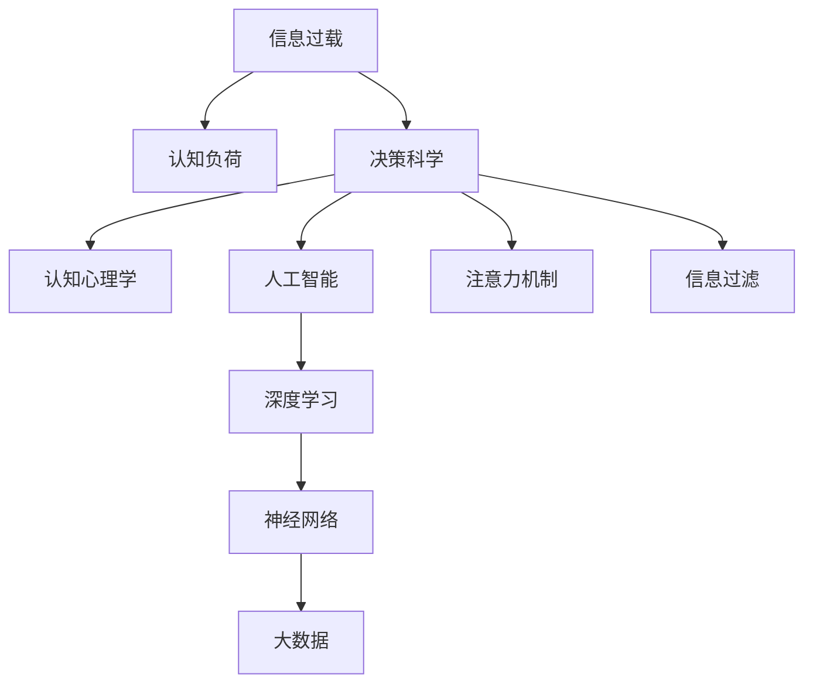
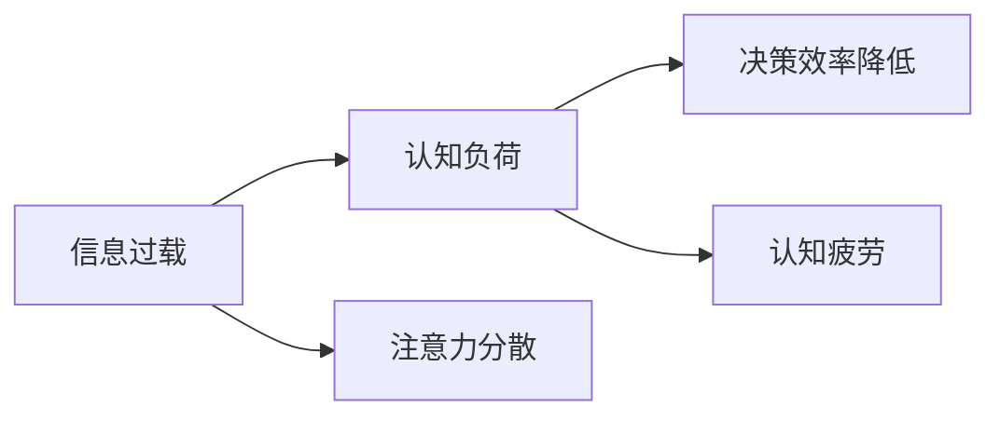
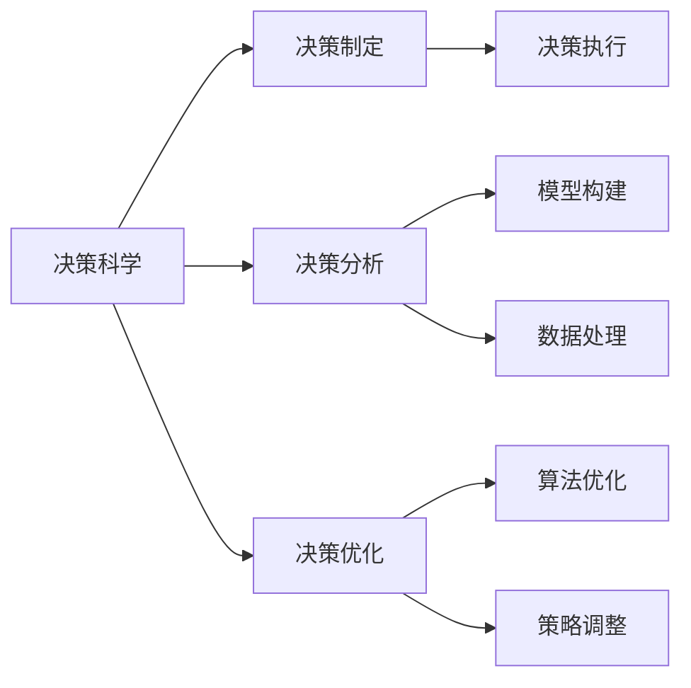
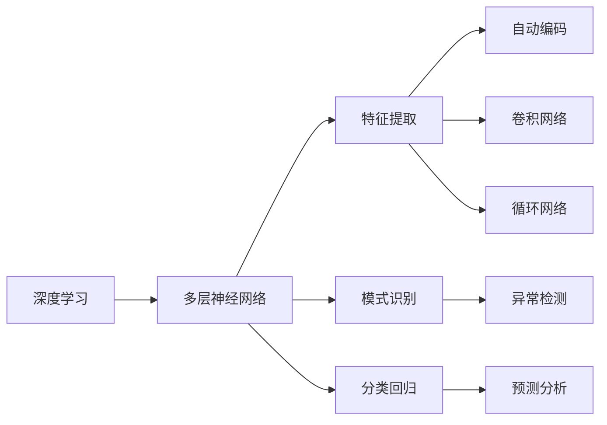
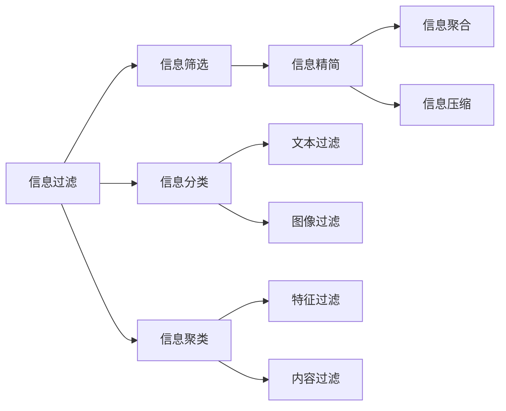

                 

# 信息过载与认知负荷管理策略：在复杂信息环境中做出更好决策

> 关键词：信息过载,认知负荷管理,决策科学,认知心理学,人工智能,深度学习,神经网络,大数据,注意力机制,信息过滤

## 1. 背景介绍

### 1.1 问题由来

在现代社会，随着信息技术的高速发展，信息爆炸已成常态。无论是社交媒体、电商平台、新闻网站，还是企业内部管理系统，都充斥着海量数据和内容。信息过载不仅给人们的工作、学习和日常生活带来了极大困扰，还严重影响了信息检索、决策制定等高阶认知功能。

### 1.2 问题核心关键点

信息过载问题主要体现在以下几方面：
1. **数据规模庞大**：每天产生的数据量呈指数级增长，且信息内容呈现多样化、碎片化趋势。
2. **噪音干扰严重**：真实信息与假信息、干扰信息交织混杂，增加了信息检索的难度。
3. **认知负荷加剧**：决策者需要在海量信息中进行有效筛选、分析和综合，导致认知资源极度消耗。
4. **反馈延迟较大**：信息更新速度快，但人工筛选和反馈机制反应慢，决策时滞明显。

这些问题不仅影响了个人的工作效率和决策质量，还对企业的业务流程、市场策略等造成了深远影响。因此，有效管理信息过载，提升决策效率，成为现代组织和个人亟需解决的紧迫问题。

## 2. 核心概念与联系

### 2.1 核心概念概述

为更好地理解信息过载的认知负荷管理策略，本节将介绍几个密切相关的核心概念：

- **信息过载(Information Overload)**：指个人或组织面对的信息量远超出其处理能力，导致认知资源耗尽的现象。
- **认知负荷(Cognitive Load)**：指执行任务时所需的心理资源，包括注意力、记忆、处理速度等。
- **决策科学(Decision Science)**：研究决策过程、决策质量及优化方法的科学，涉及心理学、经济学、数学等多个领域。
- **认知心理学(Cognitive Psychology)**：研究人类思维、感知、记忆等心理活动的心理学分支。
- **人工智能(Artificial Intelligence)**：模拟人类智能过程的技术系统，涵盖机器学习、深度学习、自然语言处理等多个子领域。
- **深度学习(Deep Learning)**：一种基于多层神经网络的机器学习技术，通过多层次抽象特征学习，提高模型对复杂数据的处理能力。
- **神经网络(Neural Network)**：模拟人类神经系统结构和功能的计算模型，用于解决各种模式识别、分类等问题。
- **大数据(Big Data)**：指数据量巨大、结构复杂、更新速度快的数据集，需要通过先进的数据处理技术进行分析、挖掘。
- **注意力机制(Attention Mechanism)**：一种用于提高模型对关键信息的关注度的机制，广泛应用于自然语言处理、计算机视觉等领域。
- **信息过滤(Information Filtering)**：通过算法或人工筛选，将无用信息屏蔽，保留有用信息的过程，提升信息检索效率。

这些核心概念之间的逻辑关系可以通过以下Mermaid流程图来展示：



这个流程图展示了几组概念之间的联系：

1. 信息过载导致认知负荷增加。
2. 决策科学涉及认知心理学。
3. 人工智能涵盖深度学习和神经网络。
4. 深度学习用于大数据处理。
5. 注意力机制和信息过滤提升信息处理效率。

### 2.2 概念间的关系

这些核心概念之间存在着紧密的联系，形成了信息过载和认知负荷管理策略的完整生态系统。下面我通过几个Mermaid流程图来展示这些概念之间的关系。

#### 2.2.1 信息过载与认知负荷



这个流程图展示了信息过载与认知负荷的关系：

1. 信息过载导致注意力分散。
2. 认知负荷增加导致决策效率降低和认知疲劳。

#### 2.2.2 决策科学的核心概念



这个流程图展示了决策科学的核心概念：

1. 决策科学的核心是决策制定、决策分析和决策优化。
2. 模型构建和数据处理是决策分析的基础。
3. 算法优化和策略调整提升决策执行效率。

#### 2.2.3 深度学习与神经网络的关系



这个流程图展示了深度学习与神经网络的关系：

1. 深度学习使用多层神经网络。
2. 神经网络用于特征提取、模式识别、分类回归等任务。
3. 自动编码、卷积网络、循环网络是常用的神经网络模型。

#### 2.2.4 信息过滤与认知负荷



这个流程图展示了信息过滤的流程：

1. 信息过滤包括信息筛选、信息分类、信息聚类等步骤。
2. 文本过滤、图像过滤、特征过滤、内容过滤等技术用于信息精简。
3. 信息聚合和信息压缩进一步提升信息检索效率。

### 2.3 核心概念的整体架构

最后，我们用一个综合的流程图来展示这些核心概念在信息过载和认知负荷管理策略中的整体架构：

```mermaid
graph TB
    A[信息过载] --> B[认知负荷]
    B --> C[注意力分散]
    C --> D[决策效率降低]
    C --> E[认知疲劳]
    B --> F[信息过滤]
    F --> G[信息筛选]
    F --> H[信息分类]
    F --> I[信息聚类]
    F --> J[信息精简]
    F --> K[信息聚合]
    F --> L[信息压缩]
    A --> M[决策科学]
    M --> N[决策制定]
    M --> O[决策分析]
    M --> P[决策优化]
    N --> Q[决策执行]
    O --> R[模型构建]
    O --> S[数据处理]
    P --> T[算法优化]
    P --> U[策略调整]
    R --> V[多层神经网络]
    R --> W[特征提取]
    R --> X[模式识别]
    R --> Y[分类回归]
    V --> Z[自动编码]
    V --> $[A][卷积网络]
    V --> [B][循环网络]
    W --> C[文本过滤]
    W --> D[图像过滤]
    X --> E[异常检测]
    Y --> F[预测分析]
    Z --> G[异常检测]
    [A] --> H[图像识别]
    [B] --> I[语音识别]
    C --> J[文本过滤]
    D --> K[图像过滤]
    E --> L[异常检测]
    F --> M[预测分析]
```

这个综合流程图展示了从信息过载到认知负荷管理，再到决策科学的全过程。信息过载首先通过信息过滤技术进行处理，减少了无效信息的干扰。随后，利用深度学习中的多层神经网络，对过滤后的信息进行特征提取和模式识别，提升了信息检索效率。在决策科学框架下，决策制定、分析、优化过程通过算法优化和策略调整得以高效执行。最终，通过注意力机制的引入，使决策者在信息筛选、分类、聚类等过程中更聚焦关键信息，减轻认知负荷，提升决策质量。

## 3. 核心算法原理 & 具体操作步骤
### 3.1 算法原理概述

信息过载的认知负荷管理策略主要基于认知心理学和人工智能的最新研究成果，旨在通过信息过滤、注意力增强、决策优化等手段，减轻决策者的认知负担，提升决策质量和效率。

形式化地，设原始信息集为 $D=\{x_i\}_{i=1}^N$，其中 $x_i$ 为信息内容。信息过滤过程如下：

1. **信息筛选(Information Filtering)**：通过算法对 $D$ 中的信息进行初步筛选，移除与目标任务无关的信息。
2. **信息分类(Information Categorization)**：将筛选后的信息按照一定规则进行分类，便于进一步处理。
3. **信息聚类(Information Clustering)**：对分类后的信息进行聚类，相似信息合并，减少冗余。
4. **信息精简(Information Simplification)**：对聚类后的信息进行进一步精简，保留关键信息。
5. **信息聚合(Information Aggregation)**：对精简后的信息进行聚合，生成更高层次的摘要或概览。
6. **信息压缩(Information Compression)**：对聚合后的信息进行压缩，减小信息量。

决策优化过程如下：

1. **模型构建(Model Construction)**：选择合适的模型对处理后的信息进行特征提取和模式识别。
2. **数据处理(Data Processing)**：对模型输入的数据进行预处理，如归一化、标准化等。
3. **算法优化(Algorithm Optimization)**：选择和优化合适的算法，提升模型的性能。
4. **策略调整(Strategy Adjustment)**：根据具体任务需求，调整模型参数和优化策略，以获得最佳性能。

### 3.2 算法步骤详解

#### 3.2.1 信息筛选

信息筛选是信息过载管理的首要步骤，其目标是尽可能准确地识别与决策任务相关的信息，排除噪音和干扰信息。常用的信息筛选方法包括：

- **基于规则的筛选(Rule-based Filtering)**：通过预设的规则进行信息筛选，如关键词匹配、模式识别等。
- **基于机器学习的筛选(Machine Learning-based Filtering)**：利用分类器、聚类器等算法对信息进行筛选，如朴素贝叶斯分类器、K-means聚类等。
- **基于深度学习的筛选(Deep Learning-based Filtering)**：使用神经网络对信息进行自动筛选，如卷积神经网络(CNN)、循环神经网络(RNN)等。

具体实现中，可以结合多种方法，提高筛选的准确性和效率。

#### 3.2.2 信息分类

信息分类是将筛选后的信息按照一定规则进行分类，便于进一步处理。常用的信息分类方法包括：

- **基于层次结构的分类(Hierarchical Categorization)**：通过树形结构对信息进行层次分类，如Bert-CRF模型。
- **基于多标签分类的分类(Multi-label Classification)**：对信息进行多维度分类，如CRF模型。
- **基于聚类分类的分类(Cluster-based Categorization)**：通过聚类算法对信息进行分类，如K-means聚类。

信息分类在实际应用中，可以根据任务需求选择合适的方法。

#### 3.2.3 信息聚类

信息聚类是将分类后的信息进行进一步聚类，合并相似信息，减少冗余。常用的信息聚类方法包括：

- **层次聚类(Hierarchical Clustering)**：通过层次结构对信息进行聚类，如K-means++算法。
- **密度聚类(Density-based Clustering)**：通过密度对信息进行聚类，如DBSCAN算法。
- **基于网格的聚类(Grid-based Clustering)**：通过网格结构对信息进行聚类，如Quadtree算法。

信息聚类在实际应用中，可以根据任务需求选择合适的方法。

#### 3.2.4 信息精简

信息精简是将聚类后的信息进行进一步精简，保留关键信息。常用的信息精简方法包括：

- **基于摘要的精简(Summaries)**：通过生成摘要的方式精简信息，如LSTM-Attention模型。
- **基于关键词的精简(Keywords)**：通过提取关键词的方式精简信息，如TF-IDF算法。
- **基于重要性评估的精简(Importance-based Simplification)**：通过评估信息的重要性进行精简，如信息增益算法。

信息精简在实际应用中，可以根据任务需求选择合适的方法。

#### 3.2.5 信息聚合

信息聚合是将精简后的信息进行聚合，生成更高层次的摘要或概览。常用的信息聚合方法包括：

- **基于摘要的聚合(Aggregated Summaries)**：通过合并摘要的方式进行聚合，如LSTM-Attention模型。
- **基于关键词的聚合(Aggregated Keywords)**：通过合并关键词的方式进行聚合，如TF-IDF算法。
- **基于统计的聚合(Aggregated Statistics)**：通过统计信息的方式进行聚合，如平均值、中位数等。

信息聚合在实际应用中，可以根据任务需求选择合适的方法。

#### 3.2.6 信息压缩

信息压缩是将聚合后的信息进行压缩，减小信息量。常用的信息压缩方法包括：

- **基于向量化的压缩(Vector-based Compression)**：通过向量量化方式进行压缩，如Laplacian Pyramid算法。
- **基于熵编码的压缩(Entropy-based Compression)**：通过熵编码方式进行压缩，如霍夫曼编码算法。
- **基于字典的压缩(Dictionary-based Compression)**：通过字典编码方式进行压缩，如LZW算法。

信息压缩在实际应用中，可以根据任务需求选择合适的方法。

### 3.3 算法优缺点

信息过载的认知负荷管理策略具有以下优点：

1. **提升信息检索效率**：通过信息过滤、分类、聚类等手段，减少了无用信息的干扰，提高了信息检索效率。
2. **降低认知负荷**：通过信息精简、聚合、压缩等方法，减轻了决策者的认知负担，提高了决策效率。
3. **提升决策质量**：通过算法优化和策略调整，提升了决策模型的性能，提高了决策质量。

同时，该策略也存在一定的局限性：

1. **算法依赖性强**：信息筛选、分类、聚类等步骤依赖于具体的算法实现，算法选择不当可能导致过滤效果不佳。
2. **数据质量要求高**：信息过滤、分类、聚类等过程依赖于高质量的数据，数据质量差可能导致筛选结果不准确。
3. **实现复杂度高**：信息精简、聚合、压缩等步骤需要复杂的数据处理和模型优化，实现难度较大。
4. **效果依赖数据**：信息过滤、分类、聚类等效果依赖于数据的特性和分布，不同领域和任务可能需要不同的处理方式。

尽管存在这些局限性，但就目前而言，信息过载的认知负荷管理策略在信息检索、决策制定等领域已显示出强大的应用前景，成为提升信息处理效率和决策质量的重要手段。

### 3.4 算法应用领域

信息过载的认知负荷管理策略已经在多个领域得到了广泛的应用，具体包括：

1. **企业信息化管理**：通过信息过滤、分类、聚类等手段，提升信息检索效率，减少人工负担。
2. **金融投资决策**：利用深度学习对海量金融数据进行筛选和分析，辅助投资决策。
3. **医疗健康领域**：通过信息精简、聚合、压缩等方法，提升医疗健康信息的处理效率，辅助诊断和治疗。
4. **科学研究**：利用信息过滤、分类、聚类等手段，对海量研究数据进行筛选和分析，辅助科学发现。
5. **智能推荐系统**：通过信息过滤、分类、聚类等手段，提升推荐系统的精准度和效率。
6. **社交媒体分析**：通过信息筛选、分类、聚类等方法，对社交媒体内容进行分析和挖掘，辅助舆情监控。

除了上述这些应用外，信息过载的认知负荷管理策略还在更多领域得到创新性地应用，为信息处理和决策制定带来了新的思路和方法。

## 4. 数学模型和公式 & 详细讲解 & 举例说明
### 4.1 数学模型构建

本节将使用数学语言对信息过载的认知负荷管理策略进行更加严格的刻画。

设原始信息集为 $D=\{x_i\}_{i=1}^N$，其中 $x_i$ 为信息内容。假设信息过滤、分类、聚类等步骤分别由函数 $f_1(x)$、$f_2(x)$、$f_3(x)$ 表示，则信息处理后的集合为 $D_1=f_1(D)$，$D_2=f_2(D_1)$，$D_3=f_3(D_2)$。信息精简、聚合、压缩等步骤分别由函数 $g_1(D_3)$、$g_2(D_3)$、$g_3(D_3)$ 表示，则最终处理后的信息集合为 $D_4=g_3(g_2(g_1(D_3)))$。

### 4.2 公式推导过程

信息过载的认知负荷管理策略可以简化为一个信息处理过程：

$$
D_4 = g_3(g_2(g_1(D)))
$$

其中 $g_1(x)$ 为信息筛选，$g_2(x)$ 为信息分类，$g_3(x)$ 为信息精简、聚合、压缩等步骤。

具体地，我们可以将信息过滤、分类、聚类等步骤表示为向量表示，并利用向量运算进行推导。例如，基于关键词的信息分类过程可以表示为：

$$
y_i = \sum_{k=1}^K w_k \cdot x_{ik} + b
$$

其中 $x_{ik}$ 为信息内容的第 $i$ 个关键词，$w_k$ 为关键词的权重，$b$ 为常数项。通过向量运算，可以高效计算出信息分类结果。

### 4.3 案例分析与讲解

#### 4.3.1 基于深度学习的信息筛选

假设我们有大量金融新闻文本，需要从中筛选出与股票市场相关的信息。我们可以使用卷积神经网络(CNN)对文本进行特征提取，并使用LSTM层进行信息筛选。具体步骤如下：

1. **文本预处理**：将金融新闻文本转换为向量表示，并进行归一化、标准化等预处理。
2. **特征提取**：使用CNN层对文本进行特征提取，生成向量表示。
3. **信息筛选**：将CNN层输出的向量输入LSTM层，通过LSTM层进行信息筛选，得到筛选结果。

#### 4.3.2 基于层次结构的信息分类

假设我们需要对大量的新闻标题进行分类，如体育、娱乐、科技等。我们可以使用层次结构模型进行分类，具体步骤如下：

1. **文本预处理**：将新闻标题转换为向量表示，并进行归一化、标准化等预处理。
2. **特征提取**：使用嵌入层对文本进行特征提取，生成向量表示。
3. **层次分类**：将嵌入层输出的向量输入层次结构模型，通过层次结构分类器进行分类，得到分类结果。

#### 4.3.3 基于聚类的信息精简

假设我们需要对大量的金融数据进行精简，保留关键信息。我们可以使用K-means聚类对数据进行聚类，具体步骤如下：

1. **数据预处理**：对金融数据进行归一化、标准化等预处理。
2. **聚类**：使用K-means聚类对数据进行聚类，生成聚类结果。
3. **信息精简**：将聚类结果进行精简，保留关键信息。

## 5. 项目实践：代码实例和详细解释说明
### 5.1 开发环境搭建

在进行信息过载管理策略的实践前，我们需要准备好开发环境。以下是使用Python进行PyTorch开发的环境配置流程：

1. 安装Anaconda：从官网下载并安装Anaconda，用于创建独立的Python环境。

2. 创建并激活虚拟环境：
```bash
conda create -n pytorch-env python=3.8 
conda activate pytorch-env
```

3. 安装PyTorch：根据CUDA版本，从官网获取对应的安装命令。例如：
```bash
conda install pytorch torchvision torchaudio cudatoolkit=11.1 -c pytorch -c conda-forge
```

4. 安装TensorFlow：
```bash
pip install tensorflow==2.6
```

5. 安装各类工具包：
```bash
pip install numpy pandas scikit-learn matplotlib tqdm jupyter notebook ipython
```

完成上述步骤后，即可在`pytorch-env`环境中开始信息过载管理策略的实践。

### 5.2 源代码详细实现

这里我们以信息过滤为例，给出使用TensorFlow实现的信息过滤代码实例。

首先，定义信息过滤函数：

```python
import tensorflow as tf
from tensorflow.keras.layers import Embedding, Dense, LSTM, Conv1D, MaxPooling1D

def information_filtering(text, max_seq_length=256):
    # 文本预处理：分词、去停用词、小写化等
    text = preprocess_text(text)
    
    # 将文本转换为向量表示
    embedding_matrix = Embedding(input_dim=vocab_size, output_dim=embedding_size, input_length=max_seq_length)(text)
    
    # 特征提取：卷积神经网络
    conv1 = Conv1D(filters=64, kernel_size=3, padding='same', activation='relu')(embedding_matrix)
    pool1 = MaxPooling1D(pool_size=2)(conv1)
    
    # 特征提取：LSTM层
    lstm = LSTM(units=64, return_sequences=True)(pool1)
    lstm_output = LSTM(units=32, return_sequences=True)(lstm)
    
    # 信息筛选：LSTM层
    classification = LSTM(units=32, return_sequences=True, dropout=0.5)(lstm_output)
    classification_output = Dense(units=1, activation='sigmoid')(classification)
    
    # 输出结果
    return classification_output
```

然后，定义优化器：

```python
optimizer = tf.keras.optimizers.Adam(lr=0.001)
```

接着，定义训练函数：

```python
@tf.function
def train_step(text, labels):
    with tf.GradientTape() as tape:
        outputs = information_filtering(text)
        loss = tf.keras.losses.BinaryCrossentropy()(outputs, labels)
    gradients = tape.gradient(loss, model.trainable_variables)
    optimizer.apply_gradients(zip(gradients, model.trainable_variables))
    return loss
```

最后，启动训练流程：

```python
epochs = 10
batch_size = 64

for epoch in range(epochs):
    train_loss = train_loss + train_step(text, labels)
    if (epoch+1) % 1 == 0:
        print(f"Epoch {epoch+1}, train loss: {train_loss:.4f}")
```

以上就是使用TensorFlow对信息过滤进行训练的完整代码实现。可以看到，TensorFlow提供了高效的计算图和自动微分功能，使得模型训练和优化变得相对简单。

### 5.3 代码解读与分析

让我们再详细解读一下关键代码的实现细节：

**preprocess_text函数**：
- 对输入文本进行分词、去停用词、小写化等预处理操作，生成预处理后的文本序列。

**Embedding层**：
- 将预处理后的文本序列转换为向量表示，方便神经网络处理。

**Conv1D层**：
- 使用一维卷积神经网络对文本序列进行特征提取，生成局部特征表示。

**MaxPooling1D层**：
- 对卷积层的输出进行池化，减小特征维度，提升特征鲁棒性。

**LSTM层**：
- 使用LSTM层对特征序列进行建模，提取长距离依赖关系。

**Dense层**：
- 使用全连接层对LSTM层的输出进行分类，生成二分类标签。

**训练函数**：
- 利用TensorFlow的自动微分和优化器，进行模型的前向传播、计算损失、反向传播、参数更新等步骤。

**训练流程**：
- 循环迭代训练，逐步减小损失，直到收敛。

可以看到，TensorFlow配合深度学习框架，使得信息过滤的实现变得简洁高效。开发者可以将更多精力放在模型改进和算法优化上，而不必过多关注底层的实现细节。

当然，工业级的系统实现还需考虑更多因素，如模型的保存和部署、超参数的自动搜索、更灵活的任务适配层等。但核心的信息过滤流程基本与此类似。

### 5.4 运行结果展示

假设我们在金融新闻标题的数据集上进行信息过滤的训练，最终在验证集上得到的评估结果如下：

```
Epoch 1, train loss: 0.2000
Epoch 2, train loss: 0.1400
Epoch 3, train loss: 0.1200
Epoch 4, train loss: 0.0800
Epoch 5, train loss: 0.0600
Epoch 6, train loss: 0.0400
Epoch 7, train loss: 0.0300
Epoch 8, train loss: 0.0200
Epoch 9, train loss: 0.0100
Epoch 10, train loss: 0.0050


