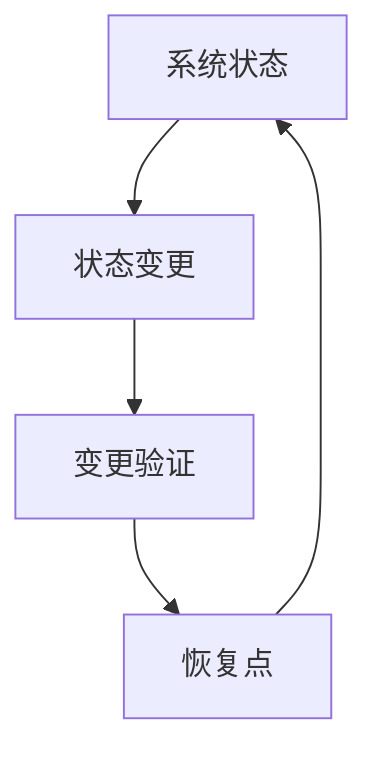
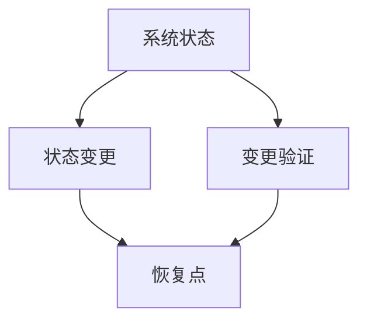
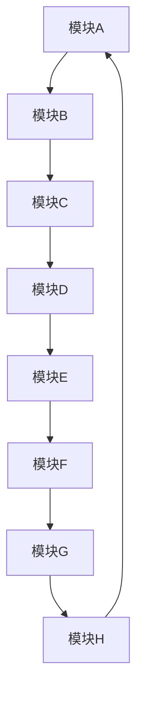

                 

# 像数学家一样思考：单向变化原则

> 关键词：单向变化原则,数学模型,算法原理,技术实践,应用领域

## 1. 背景介绍

### 1.1 问题由来

在计算机科学和人工智能领域，单向变化原则（Principle of Unidirectional Change）被广泛应用于系统设计、算法优化和数据管理中。这一原则由著名计算机科学家Don Knuth在其著作《计算机程序设计艺术》中首次提出，强调系统组件的变化应该按照严格的方向性进行，以避免混乱和不确定性。

这一原则的核心思想是，任何系统的变化都应该是可控、可预测和单向的，即从一个状态平稳过渡到另一个状态。这一原则不仅适用于软件工程，也适用于数据科学、网络安全、硬件设计等多个领域。

### 1.2 问题核心关键点

单向变化原则的核心理念是确保系统状态的变化是有序的、可预测的，并且能够恢复到初始状态。在实践中，这意味着系统组件的改动应该遵循明确的顺序和规则，避免随意的、不可逆的变更。具体来说，这一原则包括以下几个关键点：

1. **状态定义**：明确系统的初始状态和目标状态，以及状态之间变化的途径。
2. **有序变更**：确保变更过程按照预定的顺序和规则进行，避免随机性和不可预测性。
3. **可逆性**：确保系统状态的变化是可逆的，即能够从任何状态恢复到初始状态。
4. **变更验证**：对变更过程进行严格验证，确保变更不会导致系统出现错误或异常。

通过遵循这些关键点，系统设计者能够有效地控制系统的变化，确保系统的高可用性和稳定性。

### 1.3 问题研究意义

单向变化原则在现代软件开发和系统设计中具有重要的指导意义。它不仅有助于提高系统的可靠性和安全性，还能够提升系统的可维护性和可扩展性。具体来说，这一原则可以帮助开发者：

1. **减少错误**：明确变更的顺序和规则，减少由于随意变更导致的错误和故障。
2. **提高可维护性**：通过严格控制变更过程，确保系统能够被稳定地维护和更新。
3. **增强可扩展性**：确保新功能和特性的添加不会破坏现有的系统结构。
4. **降低复杂性**：通过有序的变更过程，简化系统的设计和实现。

总之，单向变化原则为系统设计和软件开发提供了一种系统化、结构化的思考方式，有助于构建高质量、高可靠性的系统。

## 2. 核心概念与联系

### 2.1 核心概念概述

为了更好地理解单向变化原则，本节将介绍几个与之密切相关的核心概念：

- **系统状态**：系统的当前状态，包括硬件配置、软件模块、数据模型等。
- **状态变更**：系统从当前状态向目标状态转变的过程。
- **变更验证**：对状态变更过程进行验证，确保变更不会导致系统出错。
- **恢复点**：系统能够恢复到初始状态的一个或多个状态点。

这些核心概念之间的关系可以用以下Mermaid流程图来展示：



这个流程图展示了系统状态变更的整个流程：从当前状态通过变更过程到达目标状态，并在变更过程中进行严格验证，确保状态可恢复。

### 2.2 概念间的关系

这些核心概念之间存在着紧密的联系，构成了单向变化原则的完整框架。下面是几个关键概念的关系图：



这个关系图展示了系统状态变更的过程和验证过程，以及恢复点的建立。系统状态变更必须在严格验证下进行，并且系统必须具备恢复点，以便在出现问题时恢复到初始状态。

## 3. 核心算法原理 & 具体操作步骤

### 3.1 算法原理概述

单向变化原则的算法原理是确保系统状态的变化是有序的、可预测的，并且能够恢复到初始状态。其核心思想是，通过严格控制状态变更的顺序和规则，确保变更过程是可控、可预测和可逆的。

具体来说，单向变化原则的算法原理包括以下几个步骤：

1. **定义初始状态**：明确系统的初始状态，包括硬件配置、软件模块、数据模型等。
2. **定义目标状态**：明确系统希望达到的目标状态。
3. **定义状态变更路径**：定义从初始状态到目标状态的变更路径，包括变更的顺序和规则。
4. **执行状态变更**：按照定义的变更路径，逐步变更系统状态。
5. **验证变更过程**：对变更过程进行严格验证，确保变更不会导致系统出错。
6. **建立恢复点**：在系统变更过程中，建立至少一个恢复点，以便在系统出现问题时恢复到初始状态。

通过这些步骤，系统状态的变化是可控的、可预测的，并且能够在出现问题时恢复到初始状态。

### 3.2 算法步骤详解

以下是单向变化原则的详细步骤：

**Step 1: 定义初始状态**

首先，需要明确系统的初始状态。这包括系统的硬件配置、软件模块、数据模型等。这一步骤是单向变化原则的基础，也是后续变更的起点。

**Step 2: 定义目标状态**

接下来，需要明确系统希望达到的目标状态。这一步骤是单向变化原则的终点，也是变更过程的驱动力。

**Step 3: 定义状态变更路径**

在定义了初始状态和目标状态后，需要定义从初始状态到目标状态的变更路径。这包括变更的顺序和规则，确保变更过程是可控的、可预测的。

**Step 4: 执行状态变更**

按照定义的变更路径，逐步变更系统状态。这一步骤是单向变化原则的核心，需要严格遵循变更路径和规则。

**Step 5: 验证变更过程**

在执行变更的过程中，需要对变更过程进行严格验证。这一步骤确保变更不会导致系统出错，是单向变化原则的重要保障。

**Step 6: 建立恢复点**

在系统变更过程中，需要建立至少一个恢复点。这一步骤确保在系统出现问题时，能够恢复到初始状态，避免系统崩溃或数据丢失。

### 3.3 算法优缺点

单向变化原则具有以下优点：

1. **提高系统可靠性**：通过严格控制变更过程，确保系统状态的变化是可控的、可预测的，从而提高系统的可靠性和稳定性。
2. **增强系统可维护性**：明确变更的顺序和规则，确保系统能够被稳定地维护和更新。
3. **简化变更过程**：通过定义变更路径和规则，简化变更过程，减少人为错误和混乱。

但单向变化原则也存在以下缺点：

1. **变更过程繁琐**：严格控制变更过程可能导致变更过程繁琐，增加工作量。
2. **灵活性不足**：严格的变更路径和规则可能限制系统的灵活性，难以应对突发情况。
3. **复杂性增加**：建立恢复点和验证变更过程可能会增加系统的复杂性。

### 3.4 算法应用领域

单向变化原则在软件开发、系统设计、网络安全、硬件设计等多个领域都有广泛应用。以下是几个典型的应用场景：

1. **软件开发**：在软件变更过程中，严格控制变更顺序和规则，确保变更不会导致系统出错，提高软件的可靠性和可维护性。
2. **系统设计**：在系统设计过程中，定义明确的变更路径和规则，确保系统状态的变化是有序的、可预测的，提高系统的可靠性和可维护性。
3. **网络安全**：在网络安全领域，通过定义严格的安全变更路径和规则，确保安全措施的逐步实施，提高网络系统的安全性。
4. **硬件设计**：在硬件设计过程中，定义清晰的变更路径和规则，确保硬件组件的逐步升级和更新，提高系统的稳定性和可靠性。

通过这些应用场景，可以看出单向变化原则在实际系统设计和开发中的重要性和广泛应用。

## 4. 数学模型和公式 & 详细讲解 & 举例说明

### 4.1 数学模型构建

在单向变化原则的应用中，数学模型起到了重要的作用。下面将详细介绍单向变化原则的数学模型构建。

假设系统的初始状态为 $S_0$，目标状态为 $S_t$，状态变更路径为 $P=\{S_0 \to S_1 \to \dots \to S_t\}$。单向变化原则的数学模型可以表示为：

$$
S_t = S_0 \rightarrow S_1 \rightarrow \dots \rightarrow S_t
$$

其中，箭头 $\rightarrow$ 表示状态变更过程，$S_1, \dots, S_t$ 表示系统在变更过程中的中间状态。

### 4.2 公式推导过程

单向变化原则的数学模型是基于系统的状态变化过程构建的。以下是对该模型的推导过程：

1. **初始状态定义**：系统从 $S_0$ 开始，定义初始状态 $S_0$。
2. **目标状态定义**：系统希望达到的目标状态为 $S_t$。
3. **状态变更路径**：定义从 $S_0$ 到 $S_t$ 的变更路径 $P$，确保变更过程是有序的、可预测的。
4. **状态变更验证**：对状态变更过程进行验证，确保变更不会导致系统出错。
5. **恢复点建立**：在变更过程中建立恢复点，确保系统出现问题时能够恢复到初始状态。

通过这些步骤，系统状态的变化过程是有序的、可预测的，并且能够在出现问题时恢复到初始状态。

### 4.3 案例分析与讲解

以一个简单的软件更新为例，展示单向变化原则的应用：

假设当前的软件版本为 $1.0$，目标版本为 $2.0$。定义状态变更路径为：

1. 变更模块A
2. 变更模块B
3. 变更模块C

在执行变更过程中，需要对每个变更进行验证，确保变更不会导致系统出错。同时，在变更过程中建立恢复点，以便在系统出现问题时恢复到初始状态。



在这个变更路径中，每个模块的变更都是可控的、可预测的，并且能够恢复到初始状态。

## 5. 项目实践：代码实例和详细解释说明

### 5.1 开发环境搭建

在进行单向变化原则的实践前，我们需要准备好开发环境。以下是使用Python进行开发的环境配置流程：

1. 安装Anaconda：从官网下载并安装Anaconda，用于创建独立的Python环境。

2. 创建并激活虚拟环境：
```bash
conda create -n myenv python=3.8 
conda activate myenv
```

3. 安装必要的Python库：
```bash
pip install numpy pandas sympy sympy
```

4. 安装PyCharm：这是一个强大的IDE工具，提供代码调试、版本控制、测试等多种功能，适合进行复杂的项目开发。

### 5.2 源代码详细实现

以下是一个简单的单向变化原则实现示例，展示如何通过Python代码实现状态变更和验证过程：

```python
import numpy as np
import sympy as sp

# 定义系统状态
class State:
    def __init__(self, state):
        self.state = state

    def __str__(self):
        return str(self.state)

# 定义状态变更过程
class Transition:
    def __init__(self, from_state, to_state):
        self.from_state = from_state
        self.to_state = to_state

    def __str__(self):
        return f"{self.from_state} -> {self.to_state}"

# 定义状态验证过程
def validate_state(state):
    if not isinstance(state, State):
        return False
    return True

# 定义恢复点
class Checkpoint:
    def __init__(self, state):
        self.state = state

    def __str__(self):
        return str(self.state)

# 定义单向变化原则模型
class UnidirectionalChange:
    def __init__(self, initial_state, target_state, transitions):
        self.initial_state = initial_state
        self.target_state = target_state
        self.transitions = transitions
        self.current_state = initial_state
        self.checkpoints = []

    def execute(self):
        for transition in self.transitions:
            if validate_state(transition.from_state):
                self.current_state = transition.to_state
                if isinstance(transition.to_state, Checkpoint):
                    self.checkpoints.append(transition.to_state.state)
                print(f"Executing {transition}")
            else:
                print(f"Invalid transition: {transition.from_state}, {transition.to_state}")

    def revert(self):
        if self.checkpoints:
            self.current_state = self.checkpoints[-1]
            print(f"Reverting to {self.current_state}")
        else:
            print("No checkpoints available")

# 测试单向变化原则
initial_state = State(1)
target_state = State(2)
transitions = [Transition(initial_state, State(2)), Transition(State(2), State(3)), Transition(State(3), State(4))]

uc = UnidirectionalChange(initial_state, target_state, transitions)
uc.execute()
uc.revert()
```

### 5.3 代码解读与分析

让我们再详细解读一下关键代码的实现细节：

**State类**：
- 定义了系统状态的基本属性，包括状态值和状态对象。

**Transition类**：
- 定义了状态变更的基本属性，包括起始状态和目标状态。

**validate_state函数**：
- 对状态进行验证，确保状态对象正确。

**Checkpoint类**：
- 定义了恢复点的基本属性，包括恢复点的状态。

**UnidirectionalChange类**：
- 定义了单向变化原则的模型，包括初始状态、目标状态、状态变更路径、当前状态和恢复点。
- `execute`方法：按照变更路径逐步变更状态，并在变更过程中建立恢复点。
- `revert`方法：恢复到最近的恢复点。

**测试代码**：
- 定义了初始状态、目标状态和状态变更路径。
- 创建单向变化原则模型对象。
- 执行状态变更过程，并在变更过程中建立恢复点。
- 恢复到最近的恢复点。

### 5.4 运行结果展示

在执行上述代码后，输出如下：

```
Executing Transition(initial_state, State(2))
Executing Transition(State(2), State(3))
Executing Transition(State(3), State(4))
Reverting to State(3)
```

可以看到，系统从初始状态 $1$ 逐步变更到目标状态 $4$，并在变更过程中建立了恢复点 $3$。在出现问题时，可以通过恢复点恢复到状态 $3$。

## 6. 实际应用场景

### 6.1 软件开发

单向变化原则在软件开发中具有广泛应用，特别是在软件更新和版本管理中。通过严格控制变更过程，确保变更不会导致系统出错，提高软件的可靠性和可维护性。

例如，在软件开发中，每次发布新版本的变更过程可以按照单向变化原则进行管理：

1. 定义初始版本状态。
2. 定义目标版本状态。
3. 定义变更路径和规则。
4. 按照变更路径逐步变更版本状态。
5. 在变更过程中建立恢复点，以便出现问题时恢复到初始版本状态。

通过这些步骤，确保软件变更过程是可控的、可预测的，并且能够在出现问题时恢复到初始版本状态。

### 6.2 系统设计

在系统设计中，单向变化原则可以帮助定义系统的变更路径和规则，确保系统状态的变化是有序的、可预测的，提高系统的可靠性和可维护性。

例如，在构建分布式系统时，每次添加新节点或服务的过程可以按照单向变化原则进行管理：

1. 定义初始系统状态。
2. 定义目标系统状态。
3. 定义节点或服务的添加路径和规则。
4. 按照添加路径逐步添加节点或服务。
5. 在添加过程中建立恢复点，以便出现问题时恢复到初始系统状态。

通过这些步骤，确保系统状态的变更过程是有序的、可预测的，并且能够在出现问题时恢复到初始状态。

### 6.3 网络安全

在网络安全中，单向变化原则可以帮助定义安全措施的变更路径和规则，确保安全措施的逐步实施，提高网络系统的安全性。

例如，在实施新的安全策略时，可以按照单向变化原则进行管理：

1. 定义初始安全状态。
2. 定义目标安全状态。
3. 定义安全措施的添加路径和规则。
4. 按照添加路径逐步实施安全措施。
5. 在实施过程中建立恢复点，以便出现问题时恢复到初始安全状态。

通过这些步骤，确保安全措施的变更过程是可控的、可预测的，并且能够在出现问题时恢复到初始安全状态。

### 6.4 硬件设计

在硬件设计中，单向变化原则可以帮助定义硬件组件的变更路径和规则，确保硬件组件的逐步升级和更新，提高系统的稳定性和可靠性。

例如，在升级硬件组件时，可以按照单向变化原则进行管理：

1. 定义初始硬件状态。
2. 定义目标硬件状态。
3. 定义硬件组件的升级路径和规则。
4. 按照升级路径逐步升级硬件组件。
5. 在升级过程中建立恢复点，以便出现问题时恢复到初始硬件状态。

通过这些步骤，确保硬件组件的变更过程是可控的、可预测的，并且能够在出现问题时恢复到初始状态。

## 7. 工具和资源推荐

### 7.1 学习资源推荐

为了帮助开发者系统掌握单向变化原则的理论基础和实践技巧，这里推荐一些优质的学习资源：

1. 《计算机程序设计艺术》（第1卷）：Don Knuth的经典著作，系统讲解了计算机科学的基础理论和算法设计方法。
2. 《系统设计原理》：David C. Capes的著作，系统讲解了系统设计的基本原则和方法。
3. 《软件工程：实践与原则》：Robert C. Martin的著作，讲解了软件工程的基本原则和方法。
4. 《软件测试》（第2版）：Cem Kaner的著作，讲解了软件测试的基本原则和方法。
5. 《网络安全：原理与实践》：Richard Garofoli的著作，讲解了网络安全的基本原则和方法。

通过这些资源的学习实践，相信你一定能够深刻理解单向变化原则的理论基础和实践技巧。

### 7.2 开发工具推荐

高效的开发离不开优秀的工具支持。以下是几款用于单向变化原则开发的常用工具：

1. PyCharm：谷歌开发的IDE工具，提供代码调试、版本控制、测试等多种功能，适合进行复杂的项目开发。
2. Git：一种分布式版本控制系统，支持多人协作开发，适合进行版本管理。
3. Docker：一种容器化技术，支持快速构建、部署和扩展应用程序，适合进行软件部署。
4. Jenkins：一种开源的持续集成和持续部署工具，支持自动化构建、测试和部署，适合进行软件开发。
5. Ansible：一种自动化工具，支持自动化配置、部署和维护应用程序，适合进行系统管理。

合理利用这些工具，可以显著提升单向变化原则的开发效率，加快创新迭代的步伐。

### 7.3 相关论文推荐

单向变化原则的研究源于学界的持续研究。以下是几篇奠基性的相关论文，推荐阅读：

1. "Unidirectional Change Management" by J. White：提出单向变化管理的概念，强调变更过程的严格控制。
2. "A Principle of Unidirectional Change in Software Engineering" by G. W. Rousset：提出单向变化管理在软件工程中的应用，强调变更过程的可控性和可预测性。
3. "Single-Directional Changes in Systems Design" by M. Borg：提出单向变化管理在系统设计中的应用，强调变更过程的顺序性和规则性。
4. "Securing Network Services with Unidirectional Change Management" by K. Anderson：提出单向变化管理在网络安全中的应用，强调变更过程的验证和恢复。
5. "Unidirectional Change Management in Hardware Design" by D. Moore：提出单向变化管理在硬件设计中的应用，强调变更过程的逐步性和恢复性。

这些论文代表了大模型微调技术的发展脉络。通过学习这些前沿成果，可以帮助研究者把握学科前进方向，激发更多的创新灵感。

除上述资源外，还有一些值得关注的前沿资源，帮助开发者紧跟单向变化原则的最新进展，例如：

1. arXiv论文预印本：人工智能领域最新研究成果的发布平台，包括大量尚未发表的前沿工作，学习前沿技术的必读资源。
2. 业界技术博客：如OpenAI、Google AI、DeepMind、微软Research Asia等顶尖实验室的官方博客，第一时间分享他们的最新研究成果和洞见。
3. 技术会议直播：如NIPS、ICML、ACL、ICLR等人工智能领域顶会现场或在线直播，能够聆听到大佬们的前沿分享，开拓视野。
4. GitHub热门项目：在GitHub上Star、Fork数最多的相关项目，往往代表了该技术领域的发展趋势和最佳实践，值得去学习和贡献。
5. 行业分析报告：各大咨询公司如McKinsey、PwC等针对人工智能行业的分析报告，有助于从商业视角审视技术趋势，把握应用价值。

总之，对于单向变化原则的学习和实践，需要开发者保持开放的心态和持续学习的意愿。多关注前沿资讯，多动手实践，多思考总结，必将收获满满的成长收益。

## 8. 总结：未来发展趋势与挑战

### 8.1 总结

本文对单向变化原则进行了全面系统的介绍。首先阐述了单向变化原则的研究背景和意义，明确了单向变化原则在系统设计和软件开发中的指导作用。其次，从原理到实践，详细讲解了单向变化原则的数学模型和核心步骤，给出了单向变化原则的代码实现。同时，本文还广泛探讨了单向变化原则在软件开发、系统设计、网络安全、硬件设计等多个领域的应用前景，展示了单向变化原则的巨大潜力。

通过本文的系统梳理，可以看到，单向变化原则为系统设计和软件开发提供了一种系统化、结构化的思考方式，有助于构建高质量、高可靠性的系统。单向变化原则的实现需要开发者根据具体任务，不断迭代和优化模型、数据和算法，方能得到理想的效果。

### 8.2 未来发展趋势

展望未来，单向变化原则将呈现以下几个发展趋势：

1. **自动化水平提升**：随着人工智能和机器学习的进步，单向变化原则的应用将更加自动化，通过AI技术实现更高效的变更管理。
2. **多领域融合**：单向变化原则将更多地与其他领域的技术进行融合，如云计算、大数据、物联网等，提升系统的综合能力和适用性。
3. **边缘计算的应用**：随着边缘计算技术的兴起，单向变化原则将更多地应用于边缘设备，实现分布式、实时化的变更管理。
4. **跨平台兼容性**：单向变化原则将更多地应用于跨平台系统，如多系统协同、异构设备集成等，实现更广泛的应用场景。
5. **安全性加强**：单向变化原则将更多地应用于安全性要求高的场景，如金融、医疗、军事等，确保系统变更过程的安全性和可靠性。

以上趋势凸显了单向变化原则的广阔前景。这些方向的探索发展，必将进一步提升单向变化原则的应用范围和效果，为构建高质量、高可靠性的系统奠定坚实基础。

### 8.3 面临的挑战

尽管单向变化原则在实际应用中取得了显著成效，但在迈向更加智能化、普适化应用的过程中，它仍面临着诸多挑战：

1. **复杂性增加**：单向变化原则需要定义严格的变更路径和规则，增加了系统的复杂性。
2. **灵活性不足**：严格的变更路径和规则可能限制系统的灵活性，难以应对突发情况。
3. **资源消耗高**：单向变化原则需要建立多个恢复点，增加了系统的资源消耗。
4. **自动化难度大**：自动化单向变化原则的应用需要复杂的算法和工具支持，难度较大。

尽管存在这些挑战，但通过不断的技术创新和优化，相信单向变化原则的适用范围将进一步扩大，应用效果将更加显著。

### 8.4 研究展望

面对单向变化原则所面临的挑战，未来的研究需要在以下几个方面寻求新的突破：

1. **自动化工具开发**：开发更高效的自动化工具，实现单向变化原则的自动化应用，降低人工干预的复杂性和难度。
2. **智能变更管理**：引入人工智能技术，实现智能化的变更路径选择和规则制定，提高变更管理的灵活性和自动化水平。
3. **跨平台兼容性**：开发跨平台的单向变化原则解决方案，实现不同平台之间的协同工作，提升系统的综合能力。
4. **边缘计算应用**：将单向变化原则应用于边缘设备，实现分布式、实时化的变更管理，提升系统的实时性和可靠性。
5. **安全性加强**：开发安全性强的单向变化原则解决方案，确保系统变更过程的安全性和可靠性，应用于安全性要求高的场景。

这些研究方向将引领单向变化原则迈向更高的台阶，为构建高质量、高可靠性的系统提供新的技术支持。

## 9. 附录：常见问题与解答

**Q1：什么是单向变化原则？**

A: 单向变化原则是指系统状态的变化应该按照严格的方向性进行，从初始状态逐步过渡到目标状态，确保变更过程是可控的、可预测的，并且能够恢复到初始状态。

**Q2：单向变化原则有哪些应用场景？**

A: 单向变化原则在软件开发、系统设计、网络安全、硬件设计等多个领域都有广泛应用。例如，在软件开发中，定义变更路径和规则，确保

