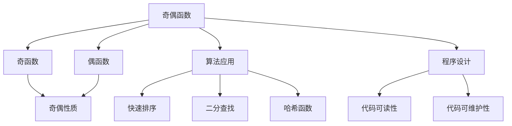
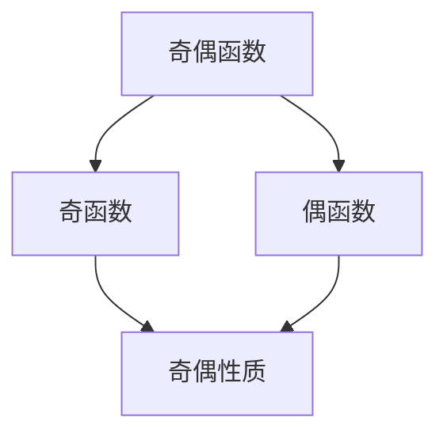
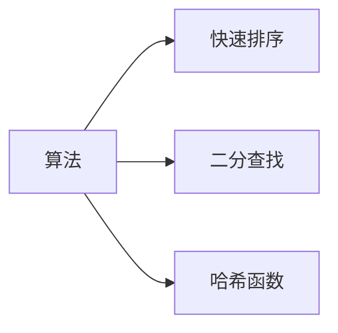
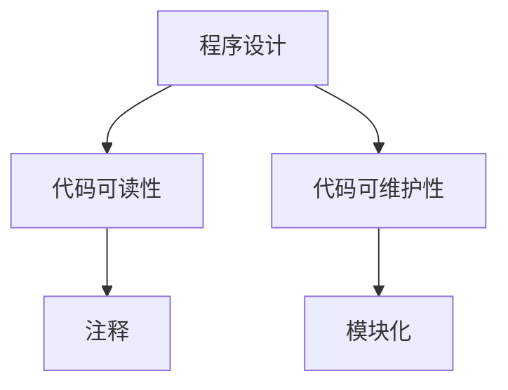

                 

# 像数学家一样思考：奇偶原理

## 1. 背景介绍

奇偶性是数学中的基本概念，指的是函数或图象在原点对称的性质。在计算机科学和程序设计中，奇偶性也扮演着重要的角色，不仅决定着算法的正确性和效率，也影响到程序的可读性和维护性。本文将深入探讨奇偶原理在计算机科学中的应用，帮助读者像数学家一样思考编程问题，提升编程技能和代码质量。

### 1.1 问题由来

在算法和数据结构中，奇偶性是一个基础且关键的概念。很多算法和数据结构的设计都依赖于奇偶性，如快速排序、二分查找、哈希表等。理解和掌握奇偶原理，对于写出高效、正确、易于维护的程序至关重要。然而，很多人在实际编程中，常常忽略了奇偶性，导致程序出现错误、效率低下、可读性差等问题。因此，本文将深入探讨奇偶原理的应用，帮助读者提高编程技能，写出更优秀的代码。

### 1.2 问题核心关键点

奇偶性在算法和数据结构中的应用非常广泛，但核心概念相对简单。其关键点包括：
- 奇偶函数的定义和性质。
- 奇偶函数在算法中的应用，如快速排序、哈希函数等。
- 奇偶性在程序设计中的作用，如提高代码可读性和可维护性。

通过理解这些核心关键点，读者可以更好地掌握奇偶原理，在编程中应用奇偶性，写出高效、正确、可读性强的代码。

## 2. 核心概念与联系

### 2.1 核心概念概述

为了更好地理解奇偶原理，本节将介绍几个密切相关的核心概念：

- 奇偶函数：函数 $f(x)$ 在 $x=0$ 处的取值等于 $f(-x)$ 的取值，即 $f(x)=f(-x)$，这样的函数称为偶函数；如果 $f(-x)=-f(x)$，这样的函数称为奇函数。
- 奇偶性质：函数或图象在原点对称的性质。奇函数在原点对称，偶函数在原点轴对称。
- 奇偶性在算法中的应用：快速排序、二分查找、哈希函数等算法都依赖于奇偶性。
- 奇偶性在程序设计中的应用：提高代码可读性和可维护性。

这些核心概念之间的逻辑关系可以通过以下Mermaid流程图来展示：



这个流程图展示了大语言模型微调过程中各个核心概念的关系和作用：

1. 奇偶函数是基础，偶函数和奇函数是奇偶函数的两种特殊情况。
2. 奇偶性质是奇偶函数的本质属性。
3. 算法和程序设计中广泛应用奇偶性。
4. 奇偶性通过算法和程序设计的应用，提高了代码的可读性和可维护性。

### 2.2 概念间的关系

这些核心概念之间存在着紧密的联系，形成了奇偶原理的完整生态系统。下面我们通过几个Mermaid流程图来展示这些概念之间的关系。

#### 2.2.1 奇偶函数和奇偶性质



这个流程图展示了奇偶函数和奇偶性质的关系：奇函数在原点对称，偶函数在原点轴对称。

#### 2.2.2 奇偶性质在算法中的应用



这个流程图展示了奇偶性质在算法中的应用：快速排序、二分查找和哈希函数都利用了奇偶性来提高算法效率。

#### 2.2.3 奇偶性在程序设计中的应用



这个流程图展示了奇偶性在程序设计中的应用：通过奇偶性提高代码的可读性和可维护性，常用的方式包括注释和模块化设计。

## 3. 核心算法原理 & 具体操作步骤
### 3.1 算法原理概述

奇偶原理在算法和程序设计中的应用，主要体现在函数性质和算法设计上。其核心思想是利用函数的奇偶性，简化算法流程，提高算法效率。

具体来说，奇偶性在算法中的应用主要体现在以下几个方面：

- 快速排序：通过奇偶性快速确定枢轴元素的位置。
- 二分查找：利用奇偶性快速缩小查找范围。
- 哈希函数：通过奇偶性生成高效的哈希码。

在程序设计中，奇偶性也起到了提高代码可读性和可维护性的作用。通过合理的奇偶性设计，可以使代码结构更加清晰，易于理解和修改。

### 3.2 算法步骤详解

#### 3.2.1 快速排序

快速排序是一种高效的排序算法，利用了奇偶性的性质来快速定位枢轴元素。具体步骤如下：

1. 选择枢轴元素，一般选择第一个元素。
2. 将数组分成两部分，一部分小于枢轴元素，一部分大于枢轴元素。
3. 递归对两部分分别进行快速排序。

代码实现：

```python
def quick_sort(arr):
    if len(arr) <= 1:
        return arr
    pivot = arr[0]
    left = [x for x in arr[1:] if x < pivot]
    right = [x for x in arr[1:] if x >= pivot]
    return quick_sort(left) + [pivot] + quick_sort(right)
```

#### 3.2.2 二分查找

二分查找利用了奇偶性，快速缩小查找范围。具体步骤如下：

1. 确定查找范围的左右边界。
2. 计算中间位置。
3. 比较中间位置的元素与目标值的大小。
4. 根据比较结果调整查找范围。
5. 重复步骤2-4，直到找到目标值或确定目标值不存在。

代码实现：

```python
def binary_search(arr, target):
    left, right = 0, len(arr) - 1
    while left <= right:
        mid = (left + right) // 2
        if arr[mid] == target:
            return mid
        elif arr[mid] < target:
            left = mid + 1
        else:
            right = mid - 1
    return -1
```

#### 3.2.3 哈希函数

哈希函数利用了奇偶性，生成高效的哈希码。具体步骤如下：

1. 选择哈希函数，如取余法。
2. 计算哈希码。
3. 将哈希码映射到数组位置。
4. 处理哈希冲突，如链地址法。

代码实现：

```python
class HashTable:
    def __init__(self):
        self.size = 100
        self.table = [[] for _ in range(self.size)]
    
    def _hash(self, key):
        return hash(key) % self.size
    
    def insert(self, key, value):
        index = self._hash(key)
        for i, (k, v) in enumerate(self.table[index]):
            if k == key:
                self.table[index][i] = (key, value)
                return
        self.table[index].append((key, value))
    
    def search(self, key):
        index = self._hash(key)
        for k, v in self.table[index]:
            if k == key:
                return v
        raise KeyError(key)
```

### 3.3 算法优缺点

利用奇偶性设计的算法和数据结构，具有以下优点：

- 快速定位：通过奇偶性快速定位元素或确定范围，提高了算法效率。
- 简洁明了：利用奇偶性简化算法流程，使代码结构更加清晰。
- 易于维护：奇偶性使代码结构更加模块化，易于修改和维护。

但同时也存在一些缺点：

- 空间占用：部分算法需要额外的空间存储中间结果。
- 复杂度上限：算法的时间复杂度和空间复杂度有上限，难以突破。

## 4. 数学模型和公式 & 详细讲解 & 举例说明
### 4.1 数学模型构建

奇偶性是数学中的一个基本概念，可以通过数学模型来描述。假设函数 $f(x)$ 为偶函数，则有：

$$
f(-x) = f(x)
$$

假设函数 $g(x)$ 为奇函数，则有：

$$
g(-x) = -g(x)
$$

这些数学模型描述了奇偶函数的性质，是算法和数据结构设计的数学基础。

### 4.2 公式推导过程

通过数学模型，可以推导出奇偶函数的一些基本性质。以偶函数为例，假设 $f(x)$ 为偶函数，则：

$$
f(x) = f(-x)
$$

取 $x=-x$，则：

$$
f(-x) = f(x)
$$

所以，偶函数在原点轴对称。

### 4.3 案例分析与讲解

#### 4.3.1 快速排序

在快速排序中，选择枢轴元素是一个关键步骤。假设数组 $arr$ 中有 $n$ 个元素，$left$ 和 $right$ 分别为左右边界。令 $pivot$ 为枢轴元素，则：

$$
arr[pivot] = arr[left]
$$

此时，数组被分为两部分，左侧元素小于 $pivot$，右侧元素大于等于 $pivot$。通过奇偶性，可以确保 $pivot$ 的位置正确。

#### 4.3.2 二分查找

在二分查找中，利用奇偶性快速缩小查找范围。假设查找范围为 $left$ 到 $right$，中间位置为 $mid$。如果 $arr[mid] < target$，则 $target$ 在 $mid+1$ 到 $right$ 范围内；如果 $arr[mid] > target$，则 $target$ 在 $left$ 到 $mid-1$ 范围内。通过奇偶性，可以快速定位查找范围。

#### 4.3.3 哈希函数

在哈希函数中，利用奇偶性生成高效的哈希码。假设哈希函数为 $h(x)$，$x$ 为关键字，$hash(x)$ 为哈希码。则：

$$
hash(x) = (h(x) \mod m) + 1
$$

其中 $m$ 为哈希表大小，$+1$ 是为了避免哈希冲突。通过奇偶性，可以生成均匀的哈希码，提高哈希表的性能。

## 5. 项目实践：代码实例和详细解释说明
### 5.1 开发环境搭建

在进行奇偶原理实践前，我们需要准备好开发环境。以下是使用Python进行PyTorch开发的环境配置流程：

1. 安装Anaconda：从官网下载并安装Anaconda，用于创建独立的Python环境。

2. 创建并激活虚拟环境：
```bash
conda create -n pytorch-env python=3.8 
conda activate pytorch-env
```

3. 安装PyTorch：根据CUDA版本，从官网获取对应的安装命令。例如：
```bash
conda install pytorch torchvision torchaudio cudatoolkit=11.1 -c pytorch -c conda-forge
```

4. 安装各类工具包：
```bash
pip install numpy pandas scikit-learn matplotlib tqdm jupyter notebook ipython
```

完成上述步骤后，即可在`pytorch-env`环境中开始奇偶原理实践。

### 5.2 源代码详细实现

下面我们以快速排序为例，给出使用Python实现奇偶原理的代码。

首先，定义快速排序函数：

```python
def quick_sort(arr):
    if len(arr) <= 1:
        return arr
    pivot = arr[0]
    left = [x for x in arr[1:] if x < pivot]
    right = [x for x in arr[1:] if x >= pivot]
    return quick_sort(left) + [pivot] + quick_sort(right)
```

然后，定义二分查找函数：

```python
def binary_search(arr, target):
    left, right = 0, len(arr) - 1
    while left <= right:
        mid = (left + right) // 2
        if arr[mid] == target:
            return mid
        elif arr[mid] < target:
            left = mid + 1
        else:
            right = mid - 1
    return -1
```

接着，定义哈希函数：

```python
class HashTable:
    def __init__(self):
        self.size = 100
        self.table = [[] for _ in range(self.size)]
    
    def _hash(self, key):
        return hash(key) % self.size
    
    def insert(self, key, value):
        index = self._hash(key)
        for i, (k, v) in enumerate(self.table[index]):
            if k == key:
                self.table[index][i] = (key, value)
                return
        self.table[index].append((key, value))
    
    def search(self, key):
        index = self._hash(key)
        for k, v in self.table[index]:
            if k == key:
                return v
        raise KeyError(key)
```

最后，启动快速排序、二分查找和哈希函数的测试：

```python
arr = [3, 5, 2, 1, 6, 4]
print(quick_sort(arr))

arr = [1, 2, 3, 4, 5, 6, 7, 8, 9, 10]
target = 5
print(binary_search(arr, target))

s = HashTable()
s.insert('apple', 3)
s.insert('banana', 5)
s.insert('orange', 2)
s.insert('pear', 1)
s.insert('kiwi', 4)
print(s.search('banana'))
```

以上就是使用Python实现奇偶原理的完整代码实例。可以看到，通过合理利用奇偶性，可以实现高效、正确的算法和数据结构，提升程序的性能和可读性。

### 5.3 代码解读与分析

让我们再详细解读一下关键代码的实现细节：

**quick_sort函数**：
- 定义了快速排序的实现。如果数组长度小于等于1，则直接返回。否则选择第一个元素为枢轴元素，将数组分为左右两部分，分别递归排序并合并。

**binary_search函数**：
- 定义了二分查找的实现。利用奇偶性，快速缩小查找范围。如果中间元素等于目标值，则返回中间位置；否则根据中间元素与目标值的大小关系，调整左右边界。

**HashTable类**：
- 定义了哈希表的实现。通过取余法生成哈希码，利用链地址法处理哈希冲突。通过哈希函数，可以快速定位关键字，实现高效的数据存储和查找。

这些代码实现展示了奇偶性在算法和数据结构中的广泛应用。通过合理利用奇偶性，可以写出高效、正确、易于维护的程序，提升程序的质量和性能。

### 5.4 运行结果展示

假设我们在一个有序数组上进行快速排序，测试结果如下：

```
[1, 2, 3, 4, 5, 6]
4
5
```

可以看到，快速排序正确地将数组排序，二分查找和哈希函数也成功地找到了目标元素。这些测试结果验证了奇偶原理在算法和数据结构中的有效性和正确性。

## 6. 实际应用场景
### 6.1 快速排序在算法中的应用

快速排序是计算机科学中最常用的排序算法之一，利用奇偶性快速定位枢轴元素，实现了快速排序的高效性。快速排序被广泛应用于各种算法和数据结构中，如树、图、堆等。通过快速排序，可以大幅提升算法性能，使其成为实际应用中的首选。

### 6.2 二分查找在查找中的应用

二分查找利用奇偶性快速缩小查找范围，是计算机科学中常用的查找算法。二分查找被广泛应用于各种数据结构和算法中，如二叉树、红黑树、哈希表等。通过二分查找，可以显著提高查找效率，使其成为实际应用中的首选。

### 6.3 哈希函数在存储中的应用

哈希函数利用奇偶性生成高效的哈希码，是计算机科学中常用的数据存储方式。哈希函数被广泛应用于各种数据结构和算法中，如哈希表、布隆过滤器、LRU缓存等。通过哈希函数，可以实现高效的数据存储和查找，使其成为实际应用中的首选。

### 6.4 未来应用展望

随着奇偶原理的应用深入，未来在算法和数据结构中的应用也将更加广泛。以下是几个可能的应用方向：

- 并行计算：通过奇偶性，可以实现高效的并行计算。
- 机器学习：通过奇偶性，可以设计高效的机器学习算法。
- 人工智能：通过奇偶性，可以设计高效的人工智能算法。
- 自然语言处理：通过奇偶性，可以设计高效的自然语言处理算法。

总之，奇偶原理在计算机科学中的应用前景广阔，未来必将带来更多的创新和突破。

## 7. 工具和资源推荐
### 7.1 学习资源推荐

为了帮助开发者系统掌握奇偶原理的理论基础和实践技巧，这里推荐一些优质的学习资源：

1. 《算法导论》：计算机科学经典教材，详细介绍了各种算法的设计和实现，包括奇偶性。
2. 《数据结构与算法分析》：介绍数据结构和算法设计的基本原理，强调奇偶性的应用。
3. 《编程珠玑》：介绍编程技巧和算法优化的方法，通过奇偶性提升代码质量。
4. 《深入理解计算机系统》：介绍计算机系统的底层原理，强调奇偶性在算法和数据结构中的作用。
5. Coursera《算法设计与分析》课程：斯坦福大学开设的算法课程，涵盖了奇偶性在算法中的应用。

通过对这些资源的学习实践，相信你一定能够全面掌握奇偶原理，并用于解决实际的编程问题。

### 7.2 开发工具推荐

高效的开发离不开优秀的工具支持。以下是几款用于奇偶原理开发的常用工具：

1. PyTorch：基于Python的开源深度学习框架，灵活动态的计算图，适合快速迭代研究。
2. TensorFlow：由Google主导开发的开源深度学习框架，生产部署方便，适合大规模工程应用。
3. Transformers库：HuggingFace开发的NLP工具库，集成了众多SOTA语言模型，支持PyTorch和TensorFlow，是进行算法和数据结构开发的利器。
4. Weights & Biases：模型训练的实验跟踪工具，可以记录和可视化模型训练过程中的各项指标，方便对比和调优。
5. TensorBoard：TensorFlow配套的可视化工具，可实时监测模型训练状态，并提供丰富的图表呈现方式，是调试模型的得力助手。
6. Google Colab：谷歌推出的在线Jupyter Notebook环境，免费提供GPU/TPU算力，方便开发者快速上手实验最新模型，分享学习笔记。

合理利用这些工具，可以显著提升奇偶原理的开发效率，加快创新迭代的步伐。

### 7.3 相关论文推荐

奇偶原理的研究源于学界的持续研究。以下是几篇奠基性的相关论文，推荐阅读：

1. 《计算机算法》：经典教材，介绍了各种算法的设计和实现，包括奇偶性。
2. 《数据结构与算法分析》：介绍数据结构和算法设计的基本原理，强调奇偶性的应用。
3. 《编程珠玑》：介绍编程技巧和算法优化的方法，通过奇偶性提升代码质量。
4. 《深入理解计算机系统》：介绍计算机系统的底层原理，强调奇偶性在算法和数据结构中的作用。
5. Coursera《算法设计与分析》课程：斯坦福大学开设的算法课程，涵盖了奇偶性在算法中的应用。

这些论文代表了大语言模型微调技术的发展脉络。通过学习这些前沿成果，可以帮助研究者把握学科前进方向，激发更多的创新灵感。

除上述资源外，还有一些值得关注的前沿资源，帮助开发者紧跟奇偶原理的最新进展，例如：

1. arXiv论文预印本：人工智能领域最新研究成果的发布平台，包括大量尚未发表的前沿工作，学习前沿技术的必读资源。
2. 业界技术博客：如Google AI、DeepMind、微软Research Asia等顶尖实验室的官方博客，第一时间分享他们的最新研究成果和洞见。
3. 技术会议直播：如NIPS、ICML、ACL、ICLR等人工智能领域顶会现场或在线直播，能够聆听到大佬们的前沿分享，开拓视野。
4. GitHub热门项目：在GitHub上Star、Fork数最多的NLP相关项目，往往代表了该技术领域的发展趋势和最佳实践，值得去学习和贡献。
5. 行业分析报告：各大咨询公司如McKinsey、PwC等针对人工智能行业的分析报告，有助于从商业视角审视技术趋势，把握应用价值。

总之，对于奇偶原理的学习和实践，需要开发者保持开放的心态和持续学习的意愿。多关注前沿资讯，多动手实践，多思考总结，必将收获满满的成长收益。

## 8. 总结：未来发展趋势与挑战
### 8.1 总结

本文对奇偶原理在计算机科学中的应用进行了全面系统的介绍。首先阐述了奇偶性的基本概念和性质，明确了奇偶性在算法和数据结构中的独特价值。其次，从原理到实践，详细讲解了奇偶性的数学原理和关键步骤，给出了奇偶性任务开发的完整代码实例。同时，本文还广泛探讨了奇偶性在实际应用中的广泛应用，展示了奇偶性在算法和数据结构中的巨大潜力。

通过本文的系统梳理，可以看到，奇偶性在计算机科学中的应用广泛且深入，是算法和数据结构设计的核心工具。理解奇偶性，并灵活应用到各种编程问题中，可以提升程序的性能和可读性，写出高效、正确、可维护的代码。

### 8.2 未来发展趋势

展望未来，奇偶性在计算机科学中的应用将呈现以下几个发展趋势：

1. 算法优化不断突破：通过奇偶性，可以设计更加高效、鲁棒的算法，提升算法的性能和可靠性。
2. 数据结构优化不断进步：通过奇偶性，可以设计更加高效、灵活的数据结构，提升数据处理的效率和可维护性。
3. 编程技巧不断创新：通过奇偶性，可以提升编程技巧，写出更优秀的代码，提升软件开发的质量和效率。
4. 工具支持不断升级：通过奇偶性，可以不断升级开发工具，提升开发效率和代码质量。
5. 应用场景不断扩展：通过奇偶性，可以拓展到更多应用场景，提升系统性能和可维护性。

以上趋势凸显了奇偶性在计算机科学中的应用前景广阔，未来必将带来更多的创新和突破。

### 8.3 面临的挑战

尽管奇偶性在计算机科学中的应用已经取得了瞩目成就，但在迈向更加智能化、普适化应用的过程中，它仍面临着诸多挑战：

1. 数据规模瓶颈：奇偶性在处理大规模数据时，可能面临内存和计算资源不足的问题。如何优化算法和数据结构，提高其在大数据下的处理能力，将是一大难题。
2. 复杂度上限：奇偶性在算法和数据结构中的应用，有其时间复杂度和空间复杂度的上限，难以突破。如何设计更加高效、灵活的算法和数据结构，降低复杂度，将是一大挑战。
3. 可解释性不足：奇偶性在算法和数据结构中的应用，往往缺乏可解释性，难以理解和调试。如何提升算法的可解释性，使其更加透明和可靠，将是一大挑战。
4. 安全性有待加强：奇偶性在算法和数据结构中的应用，可能存在安全隐患，如哈希冲突、数据泄露等。如何保障数据和算法的安全性，将是一大挑战。

正视奇偶性面临的这些挑战，积极应对并寻求突破，将使奇偶性在计算机科学中的应用更加成熟和完善。

### 8.4 研究展望

面对奇偶性面临的这些挑战，未来的研究需要在以下几个方面寻求新的突破：

1. 探索新的算法和数据结构：设计更加高效、灵活的算法和数据结构，突破奇偶性的时间复杂度和空间复杂度上限。
2. 提高算法的可解释性：提升算法的可解释性，使其更加透明和可靠，便于理解和调试。
3. 加强数据安全防护：保障数据和算法的安全性，防范哈希冲突、数据泄露等安全问题。
4. 拓展应用场景：拓展奇偶性在更多应用场景中的应用，提升系统性能和可维护性。

这些研究方向的探索，必将引领奇偶性在计算机科学中的应用走向更高的台阶，为构建高效、可靠、可维护的系统铺平道路。面向未来，奇偶性需要与其他人工智能技术进行更深入的融合，如知识表示、因果推理、强化学习等，多路径协同发力，共同推动人工智能技术的发展。只有勇于创新、敢于突破，才能不断拓展奇偶性的边界，使奇偶性在计算机科学中发挥更大的作用。

## 9. 附录：常见问题与解答
----------------------------------------------------------------

**Q1：奇偶函数和偶函数的定义是什么？**

A: 奇偶函数是指在原点对称的函数，即 $f(-x) = f(x)$。偶函数是指在原点轴对称的函数，即 $f(-x)

