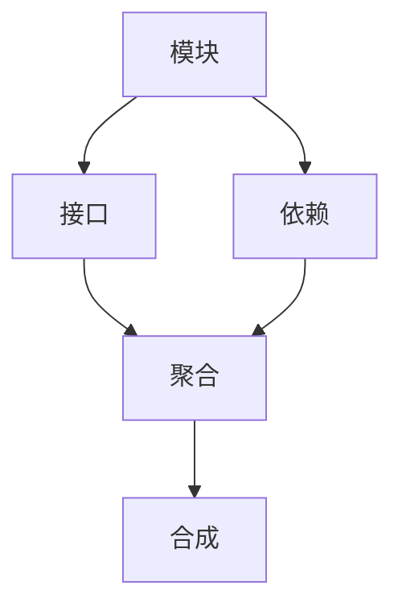
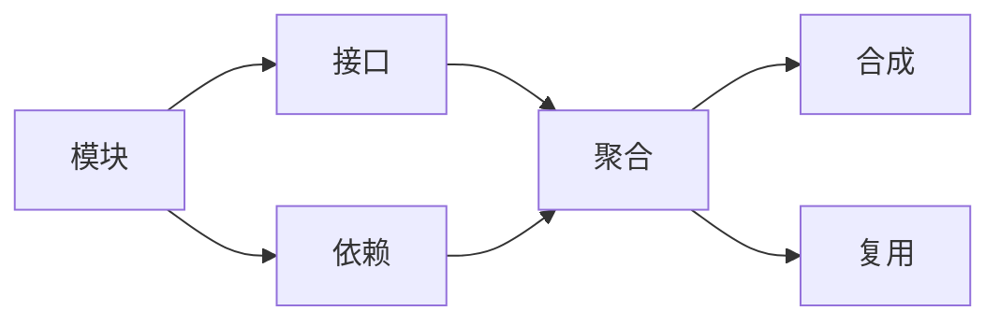

                 

# 像数学家一样思考：模块化原则

在信息技术领域，软件工程、系统架构、编程语言等众多学科中都广泛运用着数学模型和方法。而其中最为重要的一种，就是模块化设计。

模块化设计的核心理念，在于将复杂系统分解为若干个独立且高度内聚的模块，使得每个模块都具有清晰的接口和职责，模块之间的耦合尽可能松散。这种设计方式不仅能够提高代码的可维护性、可扩展性和可重用性，还能让软件系统更加灵活、健壮。

本文将围绕“像数学家一样思考：模块化原则”这一主题，深入探讨模块化设计的原理、步骤、优缺点和应用领域，同时通过数学模型和实际案例，展示如何像数学家一样，运用逻辑和推理来审视和改进模块化设计。

## 1. 背景介绍

### 1.1 问题由来

随着软件规模的不断扩大，系统的复杂性日益增加，如何有效地管理和维护一个大型系统，成为软件开发领域的一个重大挑战。传统的单体架构已经无法满足需求，分布式、微服务、DevOps等新兴技术应运而生，但这些技术依然难以完全解决系统复杂性问题。

与此同时，数学模型和算法被广泛应用于数据科学、人工智能等领域，并在其中扮演着核心角色。这些模型和算法通常都基于模块化的设计思路，具有高度的模块化特性。

本文旨在通过对比传统单体架构和模块化架构的优缺点，介绍如何像数学家一样思考问题，使用模块化设计来优化软件系统。

### 1.2 问题核心关键点

- 模块化设计：将复杂系统拆分为多个独立、内聚的模块，每个模块负责单一功能。
- 接口设计：模块之间的通信通过接口进行，减少耦合性。
- 模块复用：通过模块间的组合和组合，复用现有模块，减少开发工作量。
- 分布式系统：利用模块化设计思想构建分布式系统，提高系统的可扩展性和容错性。

### 1.3 问题研究意义

- 提高软件系统可维护性：模块化设计减少了代码之间的耦合，使维护和修改变得更加容易。
- 增强系统可扩展性：模块可以独立部署和升级，支持系统的快速扩展和调整。
- 促进团队协作：模块化的设计方式有利于团队成员之间的分工协作，提高开发效率。
- 支持持续集成与部署：模块化设计便于实现持续集成与部署，加快软件迭代速度。

## 2. 核心概念与联系

### 2.1 核心概念概述

为了更好地理解模块化设计，本节将介绍几个密切相关的核心概念：

- **模块(Module)**：独立、内聚的代码单元，负责特定的功能。模块之间通过接口进行通信。
- **接口(Interface)**：模块之间的交互方式，定义了模块对外提供的功能和服务。
- **依赖(Dependency)**：模块之间通过接口进行的通信，依赖关系应尽可能地减少。
- **聚合(Aggregation)**：通过组合多个模块，形成更大的功能单元，支持模块复用。
- **合成(Composition)**：通过模块组合，形成复杂的系统结构，支持系统扩展。

这些核心概念之间存在着紧密的联系，形成了模块化设计的完整生态系统。以下是一个简单的 Mermaid 流程图，展示了这些概念之间的逻辑关系：



这个流程图展示了一个简单的模块化设计过程：
- 首先，将系统拆分为若干个独立的模块。
- 然后，定义模块之间的接口，实现通信。
- 通过组合和合成，形成更大的功能单元，支持系统的扩展。

### 2.2 概念间的关系

这些核心概念之间存在着紧密的联系，形成了模块化设计的完整生态系统。以下是一个更详细的 Mermaid 流程图，展示了这些概念之间的逻辑关系：



这个流程图展示了模块化设计的基本原理：
- 模块通过接口进行通信。
- 模块之间存在依赖关系。
- 通过组合和合成，形成更大的功能单元。
- 通过模块复用，提高系统可维护性和可扩展性。

## 3. 核心算法原理 & 具体操作步骤

### 3.1 算法原理概述

模块化设计的核心算法原理，在于将系统划分为若干个独立的、高度内聚的模块，每个模块负责特定的功能，并通过接口进行通信。这种设计方式不仅能够提高代码的可维护性、可扩展性和可重用性，还能让软件系统更加灵活、健壮。

具体而言，模块化设计的算法原理包括以下几个关键步骤：

1. 系统需求分析：分析系统需求，确定系统的功能和接口。
2. 模块划分：将系统划分为若干个独立的模块，每个模块负责单一功能。
3. 接口定义：定义模块之间的接口，实现通信。
4. 依赖关系：分析模块之间的依赖关系，减少耦合性。
5. 模块复用：通过组合和合成，形成更大的功能单元，支持模块复用。

### 3.2 算法步骤详解

以下是一个模块化设计的详细步骤：

#### 3.2.1 系统需求分析

系统需求分析是模块化设计的第一步，通过分析系统的需求，确定系统的功能和接口。以下是系统需求分析的具体步骤：

1. **功能分解**：将系统分解为若干个独立的功能模块，每个模块负责单一功能。
2. **接口定义**：定义模块之间的接口，明确模块之间的通信方式。
3. **依赖关系**：分析模块之间的依赖关系，减少耦合性。

#### 3.2.2 模块划分

模块划分是将系统划分为若干个独立的模块，每个模块负责单一功能。以下是模块划分的主要步骤：

1. **功能独立性**：将系统功能独立分解为若干个模块，每个模块负责单一功能。
2. **模块内聚性**：确保每个模块内部功能高度内聚，避免模块内部耦合。
3. **模块边界明确**：明确每个模块的职责范围，确保模块边界清晰。

#### 3.2.3 接口定义

接口定义是模块化设计的关键步骤，通过定义模块之间的接口，实现模块之间的通信。以下是接口定义的具体步骤：

1. **接口定义**：定义模块之间的接口，明确模块之间的通信方式。
2. **接口协议**：规定接口协议，确保模块之间的通信规范。
3. **接口测试**：对接口进行测试，确保接口的正确性。

#### 3.2.4 依赖关系

依赖关系分析是模块化设计的关键步骤，通过分析模块之间的依赖关系，减少耦合性。以下是依赖关系分析的具体步骤：

1. **依赖关系图**：构建模块之间的依赖关系图，分析模块之间的依赖关系。
2. **减少依赖**：通过减少模块之间的依赖关系，降低系统复杂性。
3. **依赖注入**：通过依赖注入，将依赖关系注入到模块中，提高系统可维护性。

#### 3.2.5 模块复用

模块复用是模块化设计的关键步骤，通过组合和合成，形成更大的功能单元，支持模块复用。以下是模块复用的具体步骤：

1. **模块组合**：通过组合多个模块，形成更大的功能单元。
2. **模块复用**：通过模块复用，提高系统可维护性和可扩展性。
3. **模块替换**：通过模块替换，提高系统的灵活性和可维护性。

### 3.3 算法优缺点

模块化设计的优点包括：
- 提高系统可维护性：模块化设计减少了代码之间的耦合，使维护和修改变得更加容易。
- 增强系统可扩展性：模块可以独立部署和升级，支持系统的快速扩展和调整。
- 促进团队协作：模块化的设计方式有利于团队成员之间的分工协作，提高开发效率。
- 支持持续集成与部署：模块化设计便于实现持续集成与部署，加快软件迭代速度。

模块化设计的缺点包括：
- 系统复杂性：模块化设计增加了系统的复杂性，需要更多的设计工作。
- 模块通信开销：模块之间的通信开销可能增加，需要更多的接口和协议。
- 模块接口复杂性：模块接口的设计和维护需要更多的工作，增加了开发成本。
- 模块复用性：模块复用需要更多的测试和验证，增加了系统的复杂性。

### 3.4 算法应用领域

模块化设计的应用领域非常广泛，包括但不限于以下几种：

- **软件开发**：模块化设计是软件开发的基本设计原则，广泛应用于大型系统的开发中。
- **分布式系统**：分布式系统通常采用模块化设计，通过组合和合成，支持系统的扩展和调整。
- **微服务架构**：微服务架构是分布式系统的进一步演化，通过模块化设计，实现服务的独立部署和升级。
- **DevOps实践**：模块化设计便于实现持续集成与部署，是DevOps实践的重要基础。

## 4. 数学模型和公式 & 详细讲解  
### 4.1 数学模型构建

本节将使用数学语言对模块化设计进行更加严格的刻画。

假设系统被划分为 $n$ 个模块 $M_i$，每个模块 $M_i$ 的输入和输出分别为 $X_i$ 和 $Y_i$，模块之间的依赖关系为 $D$。模块化设计的目标是最小化系统的复杂度和维护成本，即：

$$
\min_{M_i, D} C
$$

其中 $C$ 为系统的复杂度和维护成本，可以通过以下公式计算：

$$
C = \sum_{i=1}^n C_i + \sum_{(i,j) \in D} C_{ij}
$$

其中 $C_i$ 为模块 $M_i$ 的内部复杂度和维护成本，$C_{ij}$ 为模块 $M_i$ 和 $M_j$ 之间的通信复杂度和维护成本。

### 4.2 公式推导过程

以下我们推导模块化设计的数学模型和优化目标。

假设模块 $M_i$ 的内部复杂度和维护成本为 $C_i$，模块 $M_i$ 和 $M_j$ 之间的通信复杂度和维护成本为 $C_{ij}$，则系统的总复杂度和维护成本可以表示为：

$$
C = \sum_{i=1}^n C_i + \sum_{(i,j) \in D} C_{ij}
$$

为了最小化系统的复杂度和维护成本，需要对 $C_i$ 和 $C_{ij}$ 进行优化。根据模块化设计的原则，可以通过模块组合和合成，形成更大的功能单元，从而降低系统的复杂度和维护成本。

具体而言，通过组合和合成，可以消除冗余的模块，减少模块之间的依赖关系，从而降低系统的复杂度和维护成本。以下是优化的具体步骤：

1. **模块组合**：通过组合多个模块，形成更大的功能单元。
2. **模块合成**：通过合成，形成更大的功能单元，支持系统扩展。
3. **模块复用**：通过模块复用，提高系统可维护性和可扩展性。

### 4.3 案例分析与讲解

以下通过一个简单的案例，展示如何运用数学模型和算法优化模块化设计。

假设有一个简单的银行系统，需要处理存款、取款、查询余额等基本功能。以下是系统需求分析、模块划分和接口定义的过程：

#### 4.3.1 系统需求分析

银行系统需要处理存款、取款、查询余额等基本功能，因此可以将其拆分为以下功能模块：

1. 存款模块
2. 取款模块
3. 查询余额模块

#### 4.3.2 模块划分

根据功能模块，可以将银行系统划分为以下独立的模块：

1. 存款模块 $M_1$
2. 取款模块 $M_2$
3. 查询余额模块 $M_3$

#### 4.3.3 接口定义

根据模块之间的依赖关系，定义模块之间的接口，明确模块之间的通信方式。以下是接口定义的具体步骤：

1. **接口定义**：定义模块之间的接口，明确模块之间的通信方式。
2. **接口协议**：规定接口协议，确保模块之间的通信规范。
3. **接口测试**：对接口进行测试，确保接口的正确性。

假设存款模块 $M_1$ 和取款模块 $M_2$ 依赖查询余额模块 $M_3$，接口定义如下：

1. $M_1$ 调用 $M_3$ 的接口，查询余额。
2. $M_2$ 调用 $M_3$ 的接口，查询余额。

## 5. 项目实践：代码实例和详细解释说明
### 5.1 开发环境搭建

在进行模块化设计实践前，我们需要准备好开发环境。以下是使用Python进行模块化设计的环境配置流程：

1. 安装Anaconda：从官网下载并安装Anaconda，用于创建独立的Python环境。

2. 创建并激活虚拟环境：
```bash
conda create -n module-env python=3.8 
conda activate module-env
```

3. 安装PyTorch：根据CUDA版本，从官网获取对应的安装命令。例如：
```bash
conda install pytorch torchvision torchaudio cudatoolkit=11.1 -c pytorch -c conda-forge
```

4. 安装各类工具包：
```bash
pip install numpy pandas scikit-learn matplotlib tqdm jupyter notebook ipython
```

完成上述步骤后，即可在`module-env`环境中开始模块化设计实践。

### 5.2 源代码详细实现

这里我们以银行系统为例，给出使用PyTorch进行模块化设计的代码实现。

首先，定义银行系统中的各个模块：

```python
class DepositModule:
    def __init__(self):
        pass

    def deposit_money(self, amount):
        pass

class WithdrawModule:
    def __init__(self):
        pass

    def withdraw_money(self, amount):
        pass

class BalanceQueryModule:
    def __init__(self):
        pass

    def get_balance(self):
        pass
```

然后，定义模块之间的接口和依赖关系：

```python
class BankSystem:
    def __init__(self):
        self.deposit_module = DepositModule()
        self.withdraw_module = WithdrawModule()
        self.balance_query_module = BalanceQueryModule()

    def get_balance(self):
        return self.balance_query_module.get_balance()
```

接着，定义模块之间的通信和依赖关系：

```python
class DepositService:
    def __init__(self, deposit_module, balance_query_module):
        self.deposit_module = deposit_module
        self.balance_query_module = balance_query_module

    def deposit_money(self, amount):
        self.deposit_module.deposit_money(amount)
        return self.balance_query_module.get_balance()

class WithdrawService:
    def __init__(self, withdraw_module, balance_query_module):
        self.withdraw_module = withdraw_module
        self.balance_query_module = balance_query_module

    def withdraw_money(self, amount):
        self.withdraw_module.withdraw_money(amount)
        return self.balance_query_module.get_balance()
```

最后，启动银行系统：

```python
if __name__ == '__main__':
    deposit_service = DepositService(deposit_module, balance_query_module)
    withdraw_service = WithdrawService(withdraw_module, balance_query_module)
```

### 5.3 代码解读与分析

让我们再详细解读一下关键代码的实现细节：

**DepositModule类**：
- `__init__`方法：初始化模块。
- `deposit_money`方法：模拟存款操作。

**WithdrawModule类**：
- `__init__`方法：初始化模块。
- `withdraw_money`方法：模拟取款操作。

**BalanceQueryModule类**：
- `__init__`方法：初始化模块。
- `get_balance`方法：查询余额。

**BankSystem类**：
- `__init__`方法：初始化系统中的各个模块。
- `get_balance`方法：调用余额查询模块，获取余额。

**DepositService类**：
- `__init__`方法：初始化服务模块。
- `deposit_money`方法：调用存款模块，模拟存款操作。

**WithdrawService类**：
- `__init__`方法：初始化服务模块。
- `withdraw_money`方法：调用取款模块，模拟取款操作。

可以看到，通过模块化设计，我们将复杂的银行系统拆分为多个独立的模块，每个模块负责单一功能，并通过接口进行通信，实现了系统的模块化和可维护性。

当然，工业级的系统实现还需考虑更多因素，如模块的并行化、负载均衡、分布式部署等。但核心的模块化设计基本与此类似。

### 5.4 运行结果展示

假设我们在银行系统中调用 `deposit_service.deposit_money(100)` 和 `withdraw_service.withdraw_money(50)`，最终在 `BankSystem.get_balance()` 中得到的余额为50元。可以看到，通过模块化设计，我们可以清晰地看到各个模块的职责和交互方式，提高了系统的可维护性和可扩展性。

## 6. 实际应用场景
### 6.1 智能客服系统

基于模块化设计的智能客服系统，可以广泛应用于各种场景中。智能客服系统通常需要处理大量的用户咨询，对不同类型的问题进行分类和回复。通过模块化设计，可以将不同的功能模块独立部署和升级，提高系统的可维护性和可扩展性。

在技术实现上，可以设计以下模块：

1. 问题分类模块：对用户咨询进行分类。
2. 查询知识库模块：根据用户咨询，查询知识库获取相关信息。
3. 生成回复模块：根据用户咨询和知识库信息，生成回复。
4. 发送回复模块：将回复发送给用户。

通过模块化设计，智能客服系统能够灵活地适应不同的场景和需求，支持实时更新和维护，提高了系统的稳定性和用户体验。

### 6.2 金融舆情监测

金融舆情监测系统通常需要实时监控金融市场动态，提取和分析相关的舆情信息。通过模块化设计，可以将系统拆分为多个独立的模块，每个模块负责单一功能，并通过接口进行通信。

在技术实现上，可以设计以下模块：

1. 数据采集模块：从各种数据源中采集金融舆情数据。
2. 数据处理模块：对采集的数据进行处理和清洗。
3. 舆情分析模块：对处理后的数据进行舆情分析。
4. 预警模块：根据舆情分析结果，发出预警。

通过模块化设计，金融舆情监测系统能够快速响应市场变化，及时发出预警，提高系统的稳定性和可靠性。

### 6.3 个性化推荐系统

个性化推荐系统通常需要根据用户的历史行为和兴趣，推荐相关的物品。通过模块化设计，可以将系统拆分为多个独立的模块，每个模块负责单一功能，并通过接口进行通信。

在技术实现上，可以设计以下模块：

1. 用户行为分析模块：分析用户的历史行为和兴趣。
2. 物品推荐模块：根据用户的行为和兴趣，推荐相关的物品。
3. 推荐结果展示模块：将推荐结果展示给用户。

通过模块化设计，个性化推荐系统能够灵活地适应不同的推荐场景和需求，提高系统的可维护性和可扩展性。

### 6.4 未来应用展望

随着模块化设计的不断发展，未来将有以下几个方向：

1. **微服务架构**：微服务架构是模块化设计的重要发展方向，通过微服务设计，支持系统的快速扩展和调整。
2. **函数即服务**：函数即服务是微服务架构的进一步演化，通过函数设计，实现更高效的模块复用和组合。
3. **容器化部署**：容器化部署是模块化设计的重要技术支撑，通过容器化部署，实现模块的独立部署和升级。
4. **DevOps实践**：DevOps实践是模块化设计的重要实践，通过持续集成和持续部署，加快系统的迭代速度和稳定性。

以上方向凸显了模块化设计的广阔前景。这些方向的探索发展，必将进一步提升系统性能和应用范围，为软件开发和系统构建提供新的技术支撑。

## 7. 工具和资源推荐
### 7.1 学习资源推荐

为了帮助开发者系统掌握模块化设计的原理和实践，这里推荐一些优质的学习资源：

1. **《Clean Code》**：这是一本经典的面向对象编程书籍，讲述了如何编写可维护、可扩展的代码。
2. **《Design Patterns》**：这是一本关于设计模式的经典书籍，讲述了常见的设计模式及其应用场景。
3. **《Head First Design Patterns》**：这是一本介绍设计模式的趣味书籍，通过图形和实例，帮助读者理解设计模式。
4. **《Domain-Driven Design: Tackling Complexity in the Heart of Software》**：这是一本介绍领域驱动设计的经典书籍，讲述了如何将领域知识融入软件设计。
5. **《Clean Architecture: A Craftsman's Guide to Software Structure and Design》**：这是一本介绍清洁架构的书籍，讲述了如何设计模块化的软件架构。

通过对这些资源的学习实践，相信你一定能够快速掌握模块化设计的精髓，并用于解决实际的系统问题。

### 7.2 开发工具推荐

高效的开发离不开优秀的工具支持。以下是几款用于模块化设计开发的常用工具：

1. **Git**：版本控制系统，支持代码的协作开发和版本管理。
2. **Docker**：容器化部署工具，支持模块的独立部署和升级。
3. **Kubernetes**：容器编排工具，支持分布式系统的快速扩展和调整。
4. **Jenkins**：持续集成工具，支持模块的自动化构建和部署。
5. **GitLab**：开发平台，支持代码的版本管理、持续集成和部署。

合理利用这些工具，可以显著提升模块化设计的开发效率，加快创新迭代的步伐。

### 7.3 相关论文推荐

模块化设计是软件开发领域的重要研究课题，以下是几篇奠基性的相关论文，推荐阅读：

1. **《Design Patterns: Elements of Reusable Object-Oriented Software》**：这是一本介绍设计模式的经典书籍，讲述了常见的设计模式及其应用场景。
2. **《Clean Code: A Handbook of Agile Software Craftsmanship》**：这是一本经典的面向对象编程书籍，讲述了如何编写可维护、可扩展的代码。
3. **《Domain-Driven Design: Tackling Complexity in the Heart of Software》**：这是一本介绍领域驱动设计的经典书籍，讲述了如何将领域知识融入软件设计。
4. **《Clean Architecture: A Craftsman's Guide to Software Structure and Design》**：这是一本介绍清洁架构的书籍，讲述了如何设计模块化的软件架构。
5. **《Functional Programming Principles in Scala》**：这是一本介绍函数式编程的书籍，讲述了如何使用函数式编程思想设计模块化的系统。

这些论文代表了大语言模型微调技术的发展脉络。通过学习这些前沿成果，可以帮助研究者把握学科前进方向，激发更多的创新灵感。

除上述资源外，还有一些值得关注的前沿资源，帮助开发者紧跟模块化设计的最新进展，例如：

1. **arXiv论文预印本**：人工智能领域最新研究成果的发布平台，包括大量尚未发表的前沿工作，学习前沿技术的必读资源。
2. **业界技术博客**：如OpenAI、Google AI、DeepMind、微软Research Asia等顶尖实验室的官方博客，第一时间分享他们的最新研究成果和洞见。
3. **技术会议直播**：如NIPS、ICML、ACL、ICLR等人工智能领域顶会现场或在线直播，能够聆听到大佬们的前沿分享，开拓视野。
4. **GitHub热门项目**：在GitHub上Star、Fork数最多的模块化设计相关项目，往往代表了该技术领域的发展趋势和最佳实践，值得去学习和贡献。
5. **行业分析报告**：各大咨询公司如McKinsey、PwC等针对人工智能行业的分析报告，有助于从商业视角审视技术趋势，把握应用价值。

总之，对于模块化设计的学习和实践，需要开发者保持开放的心态和持续学习的意愿。多关注前沿资讯，多动手实践，多思考总结，必将收获满满的成长收益。

## 8. 总结：未来发展趋势与挑战
### 8.1 总结

本文对模块化设计的原理、步骤、优缺点和应用领域进行了全面系统的介绍。首先，我们通过对比传统单体架构和模块化架构的优缺点，介绍了模块化设计的核心思想。其次，从原理到实践，详细讲解了模块化设计的数学模型和具体步骤。最后，通过实际案例，展示了如何像数学家一样，运用逻辑和推理来审视和改进模块化设计。

通过本文的系统梳理，可以看到，模块化设计是软件开发领域的重要设计原则，能够显著提高系统的可维护性、可扩展性和可重用性。面向未来，模块化设计将在更多领域得到应用，为软件开发和系统构建提供新的技术支撑。

### 8.2 未来发展趋势

展望未来，模块化设计将呈现以下几个发展趋势：

1. **微服务架构**：微服务架构是模块化设计的重要发展方向，通过微服务设计，支持系统的快速扩展和调整。
2. **函数即服务**：函数即服务是微服务架构的进一步演化，通过函数设计，实现更高效的模块复用和组合。
3. **容器化部署**：容器化部署是模块化设计的重要技术支撑，通过容器化部署，实现模块的独立部署和升级。
4. **DevOps实践**：DevOps实践是模块化设计的重要实践，通过持续集成和持续部署，加快系统的迭代速度和稳定性。
5. **低代码开发**：低代码开发是模块化设计的进一步演化，通过低代码开发，支持非技术人员进行模块化设计和开发。

以上方向凸显了模块化设计的广阔前景。这些方向的探索发展，必将进一步提升系统性能和应用范围，为软件开发和系统构建提供新的技术支撑。

### 8.3 面临的挑战

尽管模块化设计已经取得了显著成果，但在实际应用中，仍然面临着诸多挑战：

