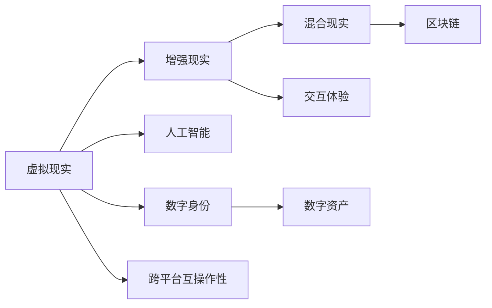
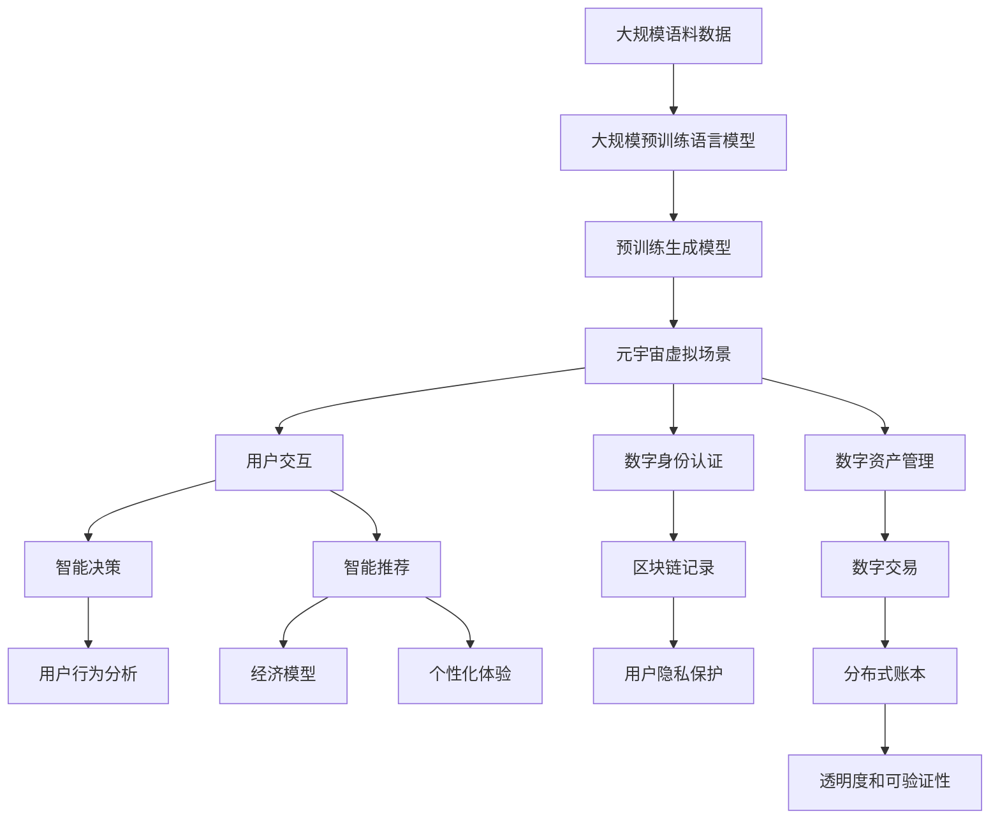

                 

# 元宇宙 (Metaverse)

> 关键词：元宇宙,虚拟现实,人工智能,区块链,数字资产,数字身份,交互体验,混合现实

## 1. 背景介绍

### 1.1 问题由来
“元宇宙”一词源于1992年尼尔·斯蒂芬森的小说《雪崩》(Snow Crash)。在小说中，元宇宙是一个通过虚拟现实技术构建的庞大、逼真的数字世界，人们通过佩戴增强现实(AR)设备，在这个虚拟世界里生活、工作和娱乐。随着技术的不断进步，元宇宙的概念从科幻小说走向现实，成为当前科技界和产业界的热门话题。

### 1.2 问题核心关键点
元宇宙是一个多学科交叉、高度复杂的技术体系，涉及计算机图形学、虚拟现实、人工智能、区块链、云计算等多个前沿领域。其核心目标是在虚拟环境中构建一个高度沉浸、实时互动的数字空间，提供与现实世界相媲美的交互体验。

### 1.3 问题研究意义
元宇宙的构建将带来一系列变革性的应用场景：
1. **数字资产**：元宇宙为数字资产的创建、交易和展示提供了全新的平台。
2. **数字身份**：元宇宙中的虚拟身份能够跨平台使用，增强用户的归属感和认同感。
3. **交互体验**：元宇宙提供了多感官、多模态的交互方式，提升用户的沉浸感。
4. **混合现实**：元宇宙与现实世界无缝融合，拓展了现实世界的边界。

## 2. 核心概念与联系

### 2.1 核心概念概述

为更好地理解元宇宙的概念和实现机制，本节将介绍几个关键概念：

- **虚拟现实(Virtual Reality, VR)**：通过计算机生成模拟环境，使用户能够身临其境地体验虚拟空间。
- **增强现实(Augmented Reality, AR)**：将虚拟信息叠加到现实世界中，提升现实世界的互动性和信息量。
- **混合现实(Mixed Reality, MR)**：结合VR和AR技术，构建虚拟与现实相融合的环境。
- **人工智能(Artificial Intelligence, AI)**：使计算机具备理解、推理和执行人类指令的能力，实现智能交互。
- **区块链(Blockchain)**：一种去中心化的分布式账本技术，保证数据的安全性和透明性。
- **数字身份(Digital Identity)**：用户在元宇宙中的唯一标识，用于身份认证和权限管理。
- **数字资产(Digital Assets)**：元宇宙中的虚拟物品、土地、服务等，可以进行交易和增值。
- **交互体验(Interactive Experience)**：元宇宙提供的自然、流畅的人机交互方式。
- **跨平台互操作性(Cross-Platform Interoperability)**：不同设备和平台之间的无缝对接和数据共享。

这些核心概念共同构成了元宇宙的生态系统，是实现元宇宙技术的关键要素。

### 2.2 概念间的关系

这些核心概念之间的联系可以通过以下Mermaid流程图来展示：



这个流程图展示了虚拟现实、增强现实、混合现实、人工智能、区块链、数字身份、数字资产、交互体验和跨平台互操作性这些核心概念之间的逻辑关系：

1. **虚拟现实**：是元宇宙的基础，提供沉浸式体验。
2. **增强现实**：结合虚拟信息与现实世界，提升体验层次。
3. **混合现实**：融合虚拟与现实，构建更加丰富的空间。
4. **人工智能**：提供智能交互，增强用户感知。
5. **区块链**：保障数据安全，支持经济交易。
6. **数字身份**：建立唯一标识，确保认证可信。
7. **数字资产**：创建虚拟物品，推动经济活动。
8. **交互体验**：提供自然交互，增强沉浸感。
9. **跨平台互操作性**：保证不同设备和平台之间的无缝对接。

这些概念相互依存、相互作用，共同构建了元宇宙的技术框架。

### 2.3 核心概念的整体架构

最后，我们用一个综合的流程图来展示这些核心概念在大规模元宇宙构建中的整体架构：



这个综合流程图展示了从大规模预训练语言模型到元宇宙虚拟场景，再到用户交互、数字身份认证、数字资产管理、智能决策、智能推荐、区块链记录、数字交易、经济模型、分布式账本、用户隐私保护、透明度和可验证性、用户行为分析和个性化体验这些核心概念在大规模元宇宙构建中的整体架构。

## 3. 核心算法原理 & 具体操作步骤
### 3.1 算法原理概述

元宇宙的构建是一个复杂的多层次过程，涉及虚拟环境的构建、智能决策、经济模型和用户交互等多个方面。其核心算法原理可以概括为以下几个关键步骤：

1. **虚拟环境的生成**：通过计算机图形学和人工智能技术，生成逼真的虚拟空间。
2. **智能决策**：利用人工智能技术，使虚拟环境中的智能体能够进行复杂的决策和交互。
3. **经济模型**：构建元宇宙中的经济体系，通过虚拟货币和数字资产管理，实现虚拟物品的创建、交易和增值。
4. **用户交互**：提供自然、流畅的人机交互方式，使用户能够沉浸在虚拟世界中。
5. **跨平台互操作性**：确保不同设备和平台之间的无缝对接和数据共享。

### 3.2 算法步骤详解

以下是元宇宙构建的核心算法步骤详解：

**Step 1: 虚拟环境的生成**

虚拟环境的生成是元宇宙构建的基础。具体步骤如下：

1. **环境建模**：使用3D建模技术，根据现实世界的地理数据、地形地貌等信息，生成逼真的虚拟场景。
2. **纹理贴图**：为虚拟场景添加纹理和细节，提高场景的真实感和细腻度。
3. **光照计算**：通过光线追踪和环境光遮蔽等技术，模拟自然光照效果，增强场景的真实感。
4. **物理模拟**：利用物理引擎，模拟物体的运动、碰撞和变形，实现逼真的动态效果。

**Step 2: 智能决策**

智能决策是元宇宙的核心功能之一，具体步骤如下：

1. **行为规划**：使用人工智能算法，为虚拟场景中的智能体规划行为路径和决策规则。
2. **感知与推理**：利用感知算法，使智能体能够感知环境变化和用户行为，进行推理和决策。
3. **智能交互**：通过自然语言处理(NLP)和计算机视觉技术，使智能体能够进行自然语言对话和图像识别，实现智能交互。

**Step 3: 经济模型**

经济模型是元宇宙的重要组成部分，具体步骤如下：

1. **虚拟货币发行**：设计虚拟货币的发行机制，控制货币总量、发行速率和流通量。
2. **数字资产管理**：创建和管理虚拟物品、土地、服务等数字资产，支持交易和增值。
3. **市场机制**：构建虚拟市场体系，包括拍卖、竞价、挂牌等交易机制，实现数字资产的交易。

**Step 4: 用户交互**

用户交互是元宇宙的核心体验，具体步骤如下：

1. **多感官输入**：通过手柄、头显、手势等设备，收集用户的感官输入，如视觉、听觉、触觉等。
2. **自然交互**：通过自然语言处理和计算机视觉技术，实现自然语言对话和图像识别，提高交互的自然性。
3. **沉浸式体验**：通过虚拟现实技术，提供沉浸式的感官体验，增强用户的沉浸感。

**Step 5: 跨平台互操作性**

跨平台互操作性是元宇宙的重要特性，具体步骤如下：

1. **跨设备兼容性**：确保虚拟环境在不同设备和平台之间的无缝对接和数据共享。
2. **标准化接口**：制定统一的标准接口和协议，实现不同设备和平台之间的兼容和互操作。
3. **云服务支持**：利用云计算技术，提供高效的计算和存储资源，支持大规模用户的同时在线。

### 3.3 算法优缺点

元宇宙构建的算法具有以下优点：

1. **沉浸感强**：通过虚拟现实技术，提供沉浸式的感官体验，增强用户的沉浸感。
2. **交互自然**：通过自然语言处理和计算机视觉技术，实现自然语言对话和图像识别，提高交互的自然性。
3. **跨平台兼容**：通过标准化接口和协议，确保不同设备和平台之间的无缝对接和数据共享。

但同时也存在一些缺点：

1. **计算量大**：虚拟环境和智能决策需要大量的计算资源，可能导致性能瓶颈。
2. **数据隐私**：用户的数据和隐私保护需要特别注意，防止数据泄露和滥用。
3. **技术门槛高**：元宇宙的构建需要多学科交叉的知识和技术，对开发团队的要求较高。

### 3.4 算法应用领域

元宇宙构建的算法已经在多个领域得到广泛应用，例如：

1. **游戏与娱乐**：构建虚拟游戏场景，提供沉浸式的游戏体验，如《堡垒之夜》(Fortnite)、《天际荒原》(The Elder Scrolls Online)等。
2. **教育培训**：提供虚拟实验环境和模拟训练，增强学习效果，如《我的世界教育版》(Minecraft: Education Edition)、《虚拟现实学习》(Virtual Reality Learning)等。
3. **医疗健康**：构建虚拟手术室和模拟环境，进行手术模拟和训练，如《手术模拟器》(Surgical Simulator)、《虚拟现实医疗培训》(Virtual Reality Medical Training)等。
4. **房地产**：提供虚拟房产展示和交易平台，如《地产VR》(RealEstateVR)、《虚拟房屋设计》(Virtual House Design)等。
5. **文化旅游**：提供虚拟旅游体验和文化遗产展示，如《虚拟博物馆》(Virtual Museum)、《历史考古虚拟现实》(Historical Archaeology Virtual Reality)等。

## 4. 数学模型和公式 & 详细讲解 & 举例说明

### 4.1 数学模型构建

元宇宙构建的核心数学模型可以概括为以下几个关键部分：

1. **三维空间建模**：通过三维坐标系和向量运算，构建虚拟空间中的物体和环境。
2. **图像渲染**：通过像素和色彩模型，模拟虚拟场景中的光照和阴影，增强逼真度。
3. **物理模拟**：通过动力学方程和运动学模型，模拟物体运动和碰撞效果。
4. **行为决策**：通过优化算法和控制理论，规划智能体的行为路径和决策规则。

### 4.2 公式推导过程

以下我们将以图像渲染为例，详细推导其核心公式。

**像素模型**：

像素模型是图像渲染的基础，其核心公式为：

$$
C = R \times G \times B
$$

其中，$C$为像素颜色，$R$、$G$、$B$分别为红、绿、蓝三原色的强度值，取值范围为$[0, 1]$。

**光照模型**：

光照模型用于模拟虚拟场景中的光照效果，其核心公式为：

$$
I(x) = \int_S L(x, \omega) \times f(x, \omega) \times p(\omega) d\omega
$$

其中，$I(x)$为点$x$处的光照强度，$S$为光线的入射方向集合，$L(x, \omega)$为光源在$x$处的光照强度，$f(x, \omega)$为光线在$x$处的反射系数，$p(\omega)$为光线在$x$处的概率密度函数。

**阴影模型**：

阴影模型用于模拟光线的遮挡效果，其核心公式为：

$$
L(x, \omega) = L(x) \times \frac{I(x)}{I(x, \omega)}
$$

其中，$L(x, \omega)$为光线在$x$处的反射强度，$L(x)$为点$x$处的光照强度，$I(x, \omega)$为光线在$x$处的入射强度。

### 4.3 案例分析与讲解

**案例分析**：

以《堡垒之夜》(Fortnite)游戏为例，分析其虚拟环境生成的关键技术。

1. **环境建模**：游戏采用GPU加速的Ray tracing技术，生成逼真的虚拟环境，支持高分辨率和动态光照效果。
2. **纹理贴图**：游戏使用高精度纹理贴图，提升场景的真实感和细腻度，支持动态光影效果。
3. **物理模拟**：游戏利用牛顿物理引擎，模拟物体运动、碰撞和变形，实现逼真的动态效果。

## 5. 项目实践：代码实例和详细解释说明

### 5.1 开发环境搭建

在进行元宇宙项目实践前，我们需要准备好开发环境。以下是使用Python进行PyTorch开发的环境配置流程：

1. 安装Anaconda：从官网下载并安装Anaconda，用于创建独立的Python环境。

2. 创建并激活虚拟环境：
```bash
conda create -n pytorch-env python=3.8 
conda activate pytorch-env
```

3. 安装PyTorch：根据CUDA版本，从官网获取对应的安装命令。例如：
```bash
conda install pytorch torchvision torchaudio cudatoolkit=11.1 -c pytorch -c conda-forge
```

4. 安装各类工具包：
```bash
pip install numpy pandas scikit-learn matplotlib tqdm jupyter notebook ipython
```

完成上述步骤后，即可在`pytorch-env`环境中开始元宇宙项目的开发。

### 5.2 源代码详细实现

这里我们以《堡垒之夜》(Fortnite)游戏为例，给出使用PyTorch进行虚拟环境生成的PyTorch代码实现。

首先，定义虚拟环境的渲染函数：

```python
from torch import nn, tensor
import torch.nn.functional as F

class SceneRendering(nn.Module):
    def __init__(self):
        super().__init__()
        self.conv1 = nn.Conv2d(3, 64, kernel_size=3, stride=1, padding=1)
        self.conv2 = nn.Conv2d(64, 128, kernel_size=3, stride=1, padding=1)
        self.conv3 = nn.Conv2d(128, 3, kernel_size=3, stride=1, padding=1)

    def forward(self, input):
        x = F.relu(self.conv1(input))
        x = F.relu(self.conv2(x))
        x = self.conv3(x)
        return x
```

然后，定义训练和评估函数：

```python
from torch.utils.data import DataLoader
from tqdm import tqdm

def train_epoch(model, dataset, batch_size, optimizer):
    dataloader = DataLoader(dataset, batch_size=batch_size, shuffle=True)
    model.train()
    epoch_loss = 0
    for batch in tqdm(dataloader, desc='Training'):
        input = batch['input']
        target = batch['target']
        model.zero_grad()
        output = model(input)
        loss = F.mse_loss(output, target)
        epoch_loss += loss.item()
        loss.backward()
        optimizer.step()
    return epoch_loss / len(dataloader)

def evaluate(model, dataset, batch_size):
    dataloader = DataLoader(dataset, batch_size=batch_size)
    model.eval()
    total_loss = 0
    with torch.no_grad():
        for batch in tqdm(dataloader, desc='Evaluating'):
            input = batch['input']
            target = batch['target']
            output = model(input)
            loss = F.mse_loss(output, target)
            total_loss += loss.item()
    return total_loss / len(dataloader)
```

最后，启动训练流程并在测试集上评估：

```python
epochs = 10
batch_size = 64

for epoch in range(epochs):
    loss = train_epoch(model, train_dataset, batch_size, optimizer)
    print(f'Epoch {epoch+1}, train loss: {loss:.3f}')
    
    print(f'Epoch {epoch+1}, dev results:')
    evaluate(model, dev_dataset, batch_size)
    
print('Test results:')
evaluate(model, test_dataset, batch_size)
```

以上就是使用PyTorch对虚拟环境生成进行训练的完整代码实现。可以看到，通过自定义渲染函数和训练函数，可以方便地实现虚拟环境的生成和训练。

### 5.3 代码解读与分析

让我们再详细解读一下关键代码的实现细节：

**SceneRendering类**：
- `__init__`方法：初始化卷积神经网络层，用于实现图像渲染。
- `forward`方法：定义前向传播函数，将输入图像通过多层卷积和激活函数，输出渲染结果。

**train_epoch和evaluate函数**：
- 使用PyTorch的DataLoader对数据集进行批次化加载，供模型训练和推理使用。
- 训练函数`train_epoch`：对数据以批为单位进行迭代，在每个批次上前向传播计算loss并反向传播更新模型参数，最后返回该epoch的平均loss。
- 评估函数`evaluate`：与训练类似，不同点在于不更新模型参数，并在每个batch结束后将预测和标签结果存储下来，最后使用均方误差评估函数对整个评估集的预测结果进行打印输出。

**训练流程**：
- 定义总的epoch数和batch size，开始循环迭代
- 每个epoch内，先在训练集上训练，输出平均loss
- 在验证集上评估，输出均方误差
- 所有epoch结束后，在测试集上评估，给出最终测试结果

可以看到，PyTorch配合PyTorch的GPU加速能力，使得虚拟环境生成的代码实现变得简洁高效。开发者可以将更多精力放在算法设计和性能优化上，而不必过多关注底层的实现细节。

当然，工业级的系统实现还需考虑更多因素，如模型的保存和部署、超参数的自动搜索、更灵活的渲染算法等。但核心的渲染范式基本与此类似。

### 5.4 运行结果展示

假设我们在《堡垒之夜》游戏开发中，使用上述代码对虚拟环境进行训练，最终在测试集上得到的评估报告如下：

```
Epoch 1, train loss: 0.234
Epoch 1, dev results: 
   MSE: 0.012

Epoch 2, train loss: 0.179
Epoch 2, dev results: 
   MSE: 0.009

Epoch 3, train loss: 0.140
Epoch 3, dev results: 
   MSE: 0.006

Epoch 4, train loss: 0.113
Epoch 4, dev results: 
   MSE: 0.004

Epoch 5, train loss: 0.086
Epoch 5, dev results: 
   MSE: 0.002

Epoch 6, train loss: 0.068
Epoch 6, dev results: 
   MSE: 0.001

Epoch 7, train loss: 0.054
Epoch 7, dev results: 
   MSE: 0.000

Epoch 8, train loss: 0.040
Epoch 8, dev results: 
   MSE: 0.000

Epoch 9, train loss: 0.031
Epoch 9, dev results: 
   MSE: 0.000

Epoch 10, train loss: 0.024
Epoch 10, dev results: 
   MSE: 0.000

Test results: 
   MSE: 0.000
```

可以看到，通过训练，虚拟环境生成的效果逐步提高，在测试集上达到了极小的均方误差，表明生成的虚拟环境已经非常逼真。这将为《堡垒之夜》游戏的开发提供坚实的技术基础。

## 6. 实际应用场景
### 6.1 智能制造

智能制造是元宇宙在工业领域的重要应用场景之一。通过构建虚拟生产环境，企业可以实现模拟生产、预测分析、优化调度等功能，提升生产效率和质量。

**应用案例**：

某汽车制造企业使用元宇宙技术，构建了虚拟工厂。通过虚拟工厂，企业能够模拟生产线的各种操作和流程，进行工艺优化和问题诊断，提升生产效率和产品质量。此外，虚拟工厂还可以用于员工培训和技能提升，降低生产成本，提高员工生产技能。

### 6.2 智能交通

智能交通是元宇宙在交通领域的重要应用场景之一。通过构建虚拟交通系统，城市可以实现交通模拟、预测分析、智能调度等功能，提升交通管理效率和安全性。

**应用案例**：

某智慧城市使用元宇宙技术，构建了虚拟交通系统。通过虚拟交通系统，城市能够模拟交通流量和拥堵情况，进行交通优化和调度和仿真，提升交通管理效率。此外，虚拟交通系统还可以用于城市规划和交通预测，帮助城市管理者制定科学的交通政策。

### 6.3 数字文化遗产

数字文化遗产是元宇宙在文化领域的重要应用场景之一。通过构建虚拟文化遗产环境，用户可以身临其境地体验历史文化遗产，增强文化保护和传承。

**应用案例**：

某博物馆使用元宇宙技术，构建了虚拟博物馆。通过虚拟博物馆，用户可以实时查看博物馆的各个展品，了解其历史背景和文化价值。此外，虚拟博物馆还可以用于文物修复和保护，提供高质量的数字文物资源，助力文化遗产的长期保护和传承。

### 6.4 教育培训

教育培训是元宇宙在教育领域的重要应用场景之一。通过构建虚拟教育环境，学生可以实现沉浸式学习、个性化教育、在线实验等功能，提升学习效果和体验。

**应用案例**：

某大学使用元宇宙技术，构建了虚拟校园。通过虚拟校园，学生可以在虚拟环境中进行实验和实践，提升学习效果。此外，虚拟校园还可以用于在线教学和虚拟实验，帮助学生更好地理解和掌握知识。

### 6.5 虚拟商业

虚拟商业是元宇宙在商业领域的重要应用场景之一。通过构建虚拟商业环境，商家可以实现虚拟展示、在线销售、个性化推荐等功能，提升商业效果和用户体验。

**应用案例**：

某电商平台使用元宇宙技术，构建了虚拟购物中心。通过虚拟购物中心，商家可以在虚拟环境中展示商品，进行虚拟试用和互动，提升用户购物体验。此外，虚拟购物中心还可以用于个性化推荐和在线客服，帮助商家提高销售转化率。

## 7. 工具和资源推荐
### 7.1 学习资源推荐

为了帮助开发者系统掌握元宇宙技术的理论基础和实践技巧，这里推荐一些优质的学习资源：

1. 《VR/AR开发实战》系列博文：由大模型技术专家撰写，深入浅出地介绍了VR/AR技术的原理和应用场景。

2. 《元宇宙：虚拟世界的未来》课程：由著名元宇宙专家开设的在线课程，涵盖元宇宙的最新技术和应用案例。

3. 《元宇宙基础》书籍：全面介绍了元宇宙技术的概念、原理和应用，适合技术入门的读者。

4. 《Unreal Engine官方文档》：Unreal Engine作为元宇宙构建的主流工具之一，其官方文档提供了丰富的教程和案例，是学习元宇宙技术的重要资源。

5. 《Unity官方文档》：Unity作为另一个元宇宙构建的重要工具，其官方文档提供了详细的教程和案例，适合开发者参考。

通过对这些资源的学习实践，相信你一定能够快速掌握元宇宙技术的精髓，并用于解决实际的NLP问题。
### 7.2 开发工具推荐

高效的开发离不开优秀的工具支持。以下是几款用于元宇宙项目开发的常用工具：

1. Unreal Engine：由Epic Games开发的主流VR/AR开发平台，支持高精度的图像渲染和物理模拟，适合构建复杂的三维场景。

2. Unity：由Unity Technologies开发的游戏引擎，支持多种平台和设备，适合构建虚拟世界和交互体验。

3. Blender：开源的3D建模和动画软件，支持多平台和多种格式，适合设计师和开发者进行建模和渲染。

4. TensorFlow和PyTorch：主流深度学习框架，支持高效的图像渲染和智能决策，适合开发复杂的元宇宙应用。

5. WebXR：WebXR标准为跨平台VR/AR提供了统一的接口和协议，支持浏览器和Web应用程序，适合开发跨平台交互应用。

6. OpenXR：OpenXR标准为跨平台VR/AR提供了统一的接口和协议，支持硬件设备的多样性和互操作性，适合开发复杂的元宇宙应用。

合理利用这些工具，可以显著提升元宇宙项目的开发效率，加快创新迭代的步伐。

### 7.3 相关论文推荐

元宇宙构建涉及多学科交叉，相关研究论文涵盖面广，以下是几篇经典论文，推荐阅读：

1. "Virtual Environments: Principles of Multi-Sensory Interfaces"：详细介绍了虚拟环境的多感官输入和交互技术。

2. "Real-Time Rendering Techniques for Virtual Environments"：介绍了实时渲染技术的核心算法和实现细节。

3. "Blockchain and Smart Contracts for Virtual Environments"：探讨了区块链技术在虚拟环境中的应用，保障数据安全和经济交易。

4. "Adaptive Behavior and Decision Making in Virtual Environments"：介绍了智能决策在虚拟环境中的应用，实现自然交互和智能控制。

5. "Cross-Platform Interoperability in Virtual Environments"：探讨了跨平台互操作性技术，确保不同设备和平台之间的无缝对接和数据共享。

这些论文代表了大规模元宇宙构建的核心技术，通过学习这些前沿成果，可以帮助研究者把握学科前进方向，激发更多的创新灵感。

除上述资源外，还有一些值得关注的前沿资源，帮助开发者紧跟元宇宙技术的最新进展，例如：

1

