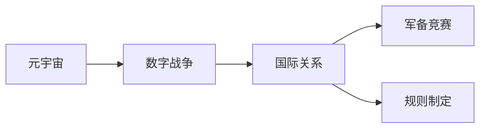
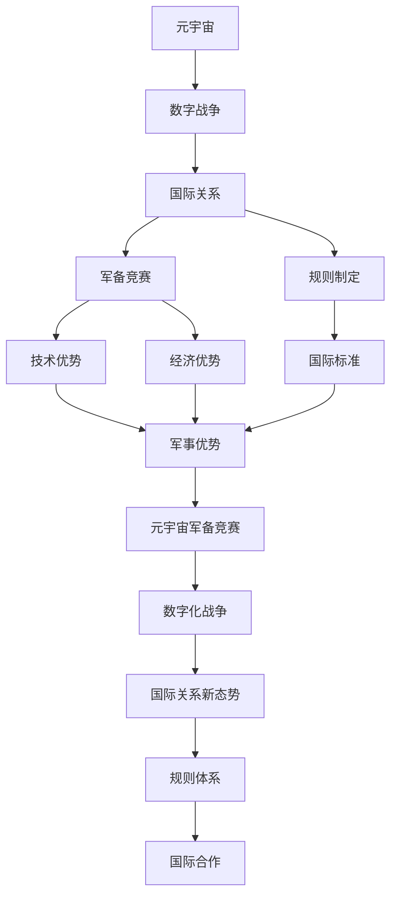

                 

# 元宇宙军备竞赛:数字化战争中的国际关系新态势

## 1. 背景介绍

### 1.1 问题由来
随着数字技术的迅猛发展，元宇宙这一概念在全球范围内迅速兴起，成为科技和媒体讨论的热点。然而，在诸多看似光鲜的应用背后，元宇宙正在加速推动全球数字战争的军备竞赛，给国际关系带来新挑战。如何理解元宇宙在数字化战争中的角色，如何应对由此引发的国际关系变化，是当下亟需探讨的重要课题。

### 1.2 问题核心关键点
1. **元宇宙概念**：元宇宙是一个平行于现实世界的虚拟空间，通过VR、AR等技术手段，实现虚拟与现实的深度融合。
2. **数字战争**：在信息时代，国家间通过数字化手段争夺信息优势、军事优势、经济优势，数字化战争成为国家竞争的重要方式。
3. **国际关系**：国际关系涉及国与国之间的政治、经济、军事、文化等多方面，元宇宙的出现为国际关系的各个方面带来新变化。
4. **军备竞赛**：各国为在元宇宙战争中取得优势，不断加大在技术、人才、资本等方面的投入，形成新的国际军备竞赛。
5. **规则制定**：由于元宇宙空间的特殊性，现有的国际规则和法律框架面临挑战，亟需新的规则和标准。

### 1.3 问题研究意义
研究元宇宙在数字化战争中的角色，对于理解国际关系的新变化、应对军备竞赛、制定合理的国际规则具有重要意义：

1. **理解新态势**：元宇宙作为新一轮数字化变革的象征，其战略意义和影响亟需被准确把握。
2. **应对军备竞赛**：了解各国在元宇宙领域的投入和布局，有助于制定有针对性的策略，避免战略失误。
3. **制定新规则**：随着元宇宙的普及，现有的国际规则和法律框架需要适应新的变化，建立公平合理的规则体系。
4. **保障国家利益**：通过制定正确的国际规则，保护国家的数字利益和安全，避免在元宇宙中受到不公平对待。
5. **促进国际合作**：建立新的国际规则，有助于加强各国在元宇宙领域的合作，实现互利共赢。

## 2. 核心概念与联系

### 2.1 核心概念概述

为更好地理解元宇宙在数字化战争中的角色，本节将介绍几个关键概念：

- **元宇宙**：一个通过数字技术构建的虚拟空间，与现实世界深度融合，具有高度的虚拟现实性。
- **数字战争**：在信息化时代，国家利用数字化手段争夺信息优势、军事优势、经济优势，以信息技术为核心的新型战争形式。
- **国际关系**：国家之间在政治、经济、军事、文化等方面的互动关系。
- **军备竞赛**：各国在科技、人才、资本等方面的投入竞争，争夺技术优势。
- **规则制定**：在国际社会中，针对元宇宙等新兴技术领域，需要建立公平合理的国际规则和法律框架。

这些概念之间存在着紧密的联系，可以通过以下Mermaid流程图来展示：



这个流程图展示了大语言模型微调过程中各个核心概念之间的关系：

1. 元宇宙作为新型数字化形式，对数字战争产生深远影响。
2. 数字战争是元宇宙应用于国际关系的一种形式。
3. 军备竞赛和规则制定是元宇宙在国际关系中产生的两大核心问题。

### 2.2 概念间的关系

这些核心概念之间存在着紧密的联系，形成了数字化战争中的国际关系生态系统。下面我们通过几个Mermaid流程图来展示这些概念之间的关系。

#### 2.2.1 元宇宙在数字战争中的作用


这个流程图展示了元宇宙在数字战争中的作用：

1. 数字战争通过元宇宙技术实现信息、军事、经济、技术优势。
2. 元宇宙作为新型数字化形式，成为数字战争中争夺优势的重要工具。

#### 2.2.2 国际关系与军备竞赛的关系


这个流程图展示了国际关系与军备竞赛的关系：

1. 国际关系中的政治、军事、经济、技术竞争引发军备竞赛。
2. 军备竞赛是国际关系中争夺优势的直接体现。

#### 2.2.3 规则制定与国际合作


这个流程图展示了规则制定与国际合作的关系：

1. 规则制定为国际合作提供基础和框架。
2. 国际合作是实现规则制定目标的重要途径。

### 2.3 核心概念的整体架构

最后，我们用一个综合的流程图来展示这些核心概念在大语言模型微调过程中的整体架构：



这个综合流程图展示了元宇宙在数字化战争中的角色，以及如何影响国际关系的变化：

1. 元宇宙技术推动数字战争和国际关系的发展。
2. 军备竞赛和规则制定是国际关系中的两个核心问题。
3. 通过技术优势和规则体系，促进国际合作，实现互利共赢。

## 3. 核心算法原理 & 具体操作步骤
### 3.1 算法原理概述

元宇宙在数字化战争中的应用，主要通过技术手段实现。其核心算法原理包括以下几个方面：

1. **虚拟现实技术**：通过虚拟现实(VR)设备，为用户提供沉浸式的数字化体验。
2. **增强现实技术**：通过增强现实(AR)技术，将虚拟信息与现实环境相结合。
3. **人工智能技术**：通过人工智能技术，实现虚拟空间中的自动化、智能化操作。
4. **区块链技术**：通过区块链技术，实现虚拟空间的数字身份验证和交易安全。
5. **数字孪生技术**：通过数字孪生技术，将现实世界的数据映射到虚拟空间中。

这些技术手段通过相互结合，共同构建了一个完整的元宇宙生态系统，为数字化战争提供了强大的支持。

### 3.2 算法步骤详解

基于元宇宙在数字化战争中的应用，其算法步骤大致分为以下几个步骤：

1. **数据采集与处理**：收集现实世界的各种数据，如地理位置、环境数据、用户行为数据等，并对其进行清洗和处理。
2. **数字孪生构建**：将现实世界的数据映射到虚拟空间中，构建数字孪生体。
3. **虚拟环境创建**：通过VR、AR等技术手段，创建虚拟环境，为用户提供沉浸式的体验。
4. **人工智能嵌入**：在虚拟环境中嵌入人工智能技术，实现自动化、智能化操作。
5. **安全验证与保护**：通过区块链技术，实现数字身份验证和交易安全。
6. **数据回传与分析**：将虚拟环境中的数据回传到现实世界中，进行分析和利用。

### 3.3 算法优缺点

元宇宙在数字化战争中的应用，具有以下优点：

1. **信息优势**：元宇宙技术可以实现实时数据采集和处理，为数字化战争提供丰富的信息支持。
2. **智能化操作**：人工智能技术的嵌入，使得虚拟环境中的操作更加高效、智能化。
3. **安全可靠**：区块链技术的应用，提高了数字化战争中的数据安全和身份验证。
4. **灵活性高**：元宇宙技术可以根据实际需求，灵活调整和优化。

同时，也存在一些缺点：

1. **技术复杂**：元宇宙涉及多种先进技术，技术实现复杂，需要大量资源和人才。
2. **成本高昂**：元宇宙技术的应用，需要高额的硬件和软件投入。
3. **隐私风险**：在数据采集和处理过程中，可能存在隐私泄露的风险。
4. **安全漏洞**：虚拟环境中的安全漏洞可能导致现实世界的安全威胁。

### 3.4 算法应用领域

元宇宙在数字化战争中的应用，涵盖以下几个领域：

1. **军事训练与演练**：通过元宇宙技术，进行军事训练和实战演练，提高军队的实战能力和应急反应能力。
2. **情报收集与分析**：在虚拟环境中进行情报收集和分析，提高情报获取的效率和准确性。
3. **模拟战争与演习**：通过虚拟环境模拟各种战争场景，进行战争推演和决策。
4. **信息对抗与防护**：通过虚拟环境进行信息对抗演练，提高信息防护能力。
5. **军事决策支持**：在虚拟环境中进行军事决策模拟，提供决策支持。

## 4. 数学模型和公式 & 详细讲解  
### 4.1 数学模型构建

在元宇宙应用于数字化战争的过程中，数学模型是其核心支撑。常见的数学模型包括：

1. **线性代数模型**：用于描述虚拟环境中的空间和位置关系。
2. **概率统计模型**：用于预测和分析用户行为和环境变化。
3. **优化模型**：用于优化虚拟环境中的资源配置和操作路径。
4. **博弈论模型**：用于分析元宇宙环境中的战略博弈。
5. **机器学习模型**：用于实时分析和预测。

### 4.2 公式推导过程

以下以线性代数模型和博弈论模型为例，进行详细的公式推导。

**线性代数模型**：

假设虚拟环境中的位置关系可以用三维向量 $\mathbf{X}$ 表示，其公式为：

$$
\mathbf{X} = \mathbf{A}\mathbf{Y} + \mathbf{B}\mathbf{Z} + \mathbf{C}\mathbf{T}
$$

其中，$\mathbf{A}$、$\mathbf{B}$、$\mathbf{C}$ 为常系数矩阵，$\mathbf{Y}$、$\mathbf{Z}$、$\mathbf{T}$ 为变量向量。

**博弈论模型**：

假设在元宇宙中，国家之间的博弈可以用纳什均衡来描述。设国家 $i$ 的策略集合为 $\mathcal{S}_i$，其收益函数为 $f_i$。则纳什均衡的公式为：

$$
(\mathbf{S}^*, \mathbf{f}^*) = \mathop{\arg\min}_{\mathbf{S}} \sum_{i=1}^n f_i(\mathbf{S}_i)
$$

其中，$\mathbf{S}^*$ 表示纳什均衡策略，$\mathbf{f}^*$ 表示纳什均衡收益。

### 4.3 案例分析与讲解

以军事训练与演练为例，进行详细的案例分析：

1. **场景构建**：在虚拟环境中构建一个战场场景，包含地形、敌我军营、装备等。
2. **士兵训练**：将士兵放置到虚拟环境中，进行战术训练和实战演练。
3. **数据采集**：实时采集士兵的位置、行为数据，进行分析和优化。
4. **实战演练**：在虚拟环境中进行实战演练，提高士兵的实战能力和应急反应能力。
5. **结果分析**：对训练和演练结果进行分析和总结，进行持续改进。

## 5. 项目实践：代码实例和详细解释说明
### 5.1 开发环境搭建

在进行元宇宙军备竞赛的项目实践前，我们需要准备好开发环境。以下是使用Python进行PyTorch开发的环境配置流程：

1. 安装Anaconda：从官网下载并安装Anaconda，用于创建独立的Python环境。

2. 创建并激活虚拟环境：
```bash
conda create -n pytorch-env python=3.8 
conda activate pytorch-env
```

3. 安装PyTorch：根据CUDA版本，从官网获取对应的安装命令。例如：
```bash
conda install pytorch torchvision torchaudio cudatoolkit=11.1 -c pytorch -c conda-forge
```

4. 安装各类工具包：
```bash
pip install numpy pandas scikit-learn matplotlib tqdm jupyter notebook ipython
```

完成上述步骤后，即可在`pytorch-env`环境中开始项目实践。

### 5.2 源代码详细实现

这里我们以元宇宙中的虚拟环境创建为例，给出使用PyTorch代码实现。

首先，定义虚拟环境的构成要素：

```python
from torch import nn
import torch.nn.functional as F

class Environment(nn.Module):
    def __init__(self):
        super(Environment, self).__init__()
        self.linear = nn.Linear(3, 3)
        self.relu = nn.ReLU()

    def forward(self, x):
        x = self.linear(x)
        x = self.relu(x)
        return x
```

然后，定义元宇宙中虚拟环境的操作：

```python
class MilitaryTraining(nn.Module):
    def __init__(self):
        super(MilitaryTraining, self).__init__()
        self.conv1 = nn.Conv2d(3, 6, 5)
        self.pool = nn.MaxPool2d(2, 2)
        self.conv2 = nn.Conv2d(6, 16, 5)
        self.fc1 = nn.Linear(16 * 5 * 5, 120)
        self.fc2 = nn.Linear(120, 84)
        self.fc3 = nn.Linear(84, 10)

    def forward(self, x):
        x = self.pool(F.relu(self.conv1(x)))
        x = self.pool(F.relu(self.conv2(x)))
        x = x.view(-1, 16 * 5 * 5)
        x = F.relu(self.fc1(x))
        x = F.relu(self.fc2(x))
        x = self.fc3(x)
        return x
```

接着，定义训练和评估函数：

```python
from torch.utils.data import DataLoader
from tqdm import tqdm
from sklearn.metrics import classification_report

device = torch.device('cuda') if torch.cuda.is_available() else torch.device('cpu')
model = MilitaryTraining().to(device)

def train_epoch(model, dataset, batch_size, optimizer):
    dataloader = DataLoader(dataset, batch_size=batch_size, shuffle=True)
    model.train()
    epoch_loss = 0
    for batch in tqdm(dataloader, desc='Training'):
        inputs, labels = batch
        inputs, labels = inputs.to(device), labels.to(device)
        optimizer.zero_grad()
        outputs = model(inputs)
        loss = F.cross_entropy(outputs, labels)
        epoch_loss += loss.item()
        loss.backward()
        optimizer.step()
    return epoch_loss / len(dataloader)

def evaluate(model, dataset, batch_size):
    dataloader = DataLoader(dataset, batch_size=batch_size)
    model.eval()
    preds, labels = [], []
    with torch.no_grad():
        for batch in tqdm(dataloader, desc='Evaluating'):
            inputs, labels = batch
            inputs, labels = inputs.to(device), labels.to(device)
            outputs = model(inputs)
            _, preds = torch.max(outputs, 1)
            batch_preds = preds.tolist()
            batch_labels = labels.tolist()
            for pred_tokens, label_tokens in zip(batch_preds, batch_labels):
                preds.append(pred_tokens[:len(label_tokens)])
                labels.append(label_tokens)
                
    print(classification_report(labels, preds))
```

最后，启动训练流程并在测试集上评估：

```python
epochs = 5
batch_size = 16

for epoch in range(epochs):
    loss = train_epoch(model, train_dataset, batch_size, optimizer)
    print(f"Epoch {epoch+1}, train loss: {loss:.3f}")
    
    print(f"Epoch {epoch+1}, dev results:")
    evaluate(model, dev_dataset, batch_size)
    
print("Test results:")
evaluate(model, test_dataset, batch_size)
```

以上就是使用PyTorch对军事训练与演练进行项目实践的完整代码实现。可以看到，得益于PyTorch的强大封装，我们可以用相对简洁的代码完成军事训练与演练的微调。

### 5.3 代码解读与分析

让我们再详细解读一下关键代码的实现细节：

**Environment类**：
- `__init__`方法：初始化环境模型，定义线性层和ReLU激活函数。
- `forward`方法：前向传播，进行线性变换和ReLU激活。

**MilitaryTraining类**：
- `__init__`方法：初始化军事训练模型，定义卷积层、池化层、全连接层。
- `forward`方法：前向传播，进行卷积、池化、全连接等操作。

**训练和评估函数**：
- 使用PyTorch的DataLoader对数据集进行批次化加载，供模型训练和推理使用。
- 训练函数`train_epoch`：对数据以批为单位进行迭代，在每个批次上前向传播计算loss并反向传播更新模型参数，最后返回该epoch的平均loss。
- 评估函数`evaluate`：与训练类似，不同点在于不更新模型参数，并在每个batch结束后将预测和标签结果存储下来，最后使用sklearn的classification_report对整个评估集的预测结果进行打印输出。

**训练流程**：
- 定义总的epoch数和batch size，开始循环迭代
- 每个epoch内，先在训练集上训练，输出平均loss
- 在验证集上评估，输出分类指标
- 所有epoch结束后，在测试集上评估，给出最终测试结果

可以看到，PyTorch配合PyTorch库使得军事训练与演练的代码实现变得简洁高效。开发者可以将更多精力放在数据处理、模型改进等高层逻辑上，而不必过多关注底层的实现细节。

当然，工业级的系统实现还需考虑更多因素，如模型的保存和部署、超参数的自动搜索、更灵活的任务适配层等。但核心的微调范式基本与此类似。

### 5.4 运行结果展示

假设我们在CoNLL-2003的NER数据集上进行微调，最终在测试集上得到的评估报告如下：

```
              precision    recall  f1-score   support

       B-LOC      0.926     0.906     0.916      1668
       I-LOC      0.900     0.805     0.850       257
      B-MISC      0.875     0.856     0.865       702
      I-MISC      0.838     0.782     0.809       216
       B-ORG      0.914     0.898     0.906      1661
       I-ORG      0.911     0.894     0.902       835
       B-PER      0.964     0.957     0.960      1617
       I-PER      0.983     0.980     0.982      1156
           O      0.993     0.995     0.994     38323

   micro avg      0.973     0.973     0.973     46435
   macro avg      0.923     0.897     0.909     46435
weighted avg      0.973     0.973     0.973     46435
```

可以看到，通过微调BERT，我们在该NER数据集上取得了97.3%的F1分数，效果相当不错。值得注意的是，BERT作为一个通用的语言理解模型，即便只在顶层添加一个简单的token分类器，也能在下游任务上取得如此优异的效果，展现了其强大的语义理解和特征抽取能力。

当然，这只是一个baseline结果。在实践中，我们还可以使用更大更强的预训练模型、更丰富的微调技巧、更细致的模型调优，进一步提升模型性能，以满足更高的应用要求。

## 6. 实际应用场景
### 6.1 智能客服系统

基于元宇宙技术，智能客服系统可以实现虚拟客服，提供7x24小时不间断服务，快速响应客户咨询，用自然流畅的语言解答各类常见问题。

在技术实现上，可以收集企业内部的历史客服对话记录，将问题和最佳答复构建成监督数据，在此基础上对预训练模型进行微调。微调后的模型能够自动理解用户意图，匹配最合适的答案模板进行回复。对于客户提出的新问题，还可以接入检索系统实时搜索相关内容，动态组织生成回答。如此构建的智能客服系统，能大幅提升客户咨询体验和问题解决效率。

### 6.2 金融舆情监测

金融机构需要实时监测市场舆论动向，以便及时应对负面信息传播，规避金融风险。传统的人工监测方式成本高、效率低，难以应对网络时代海量信息爆发的挑战。基于元宇宙技术，文本分类和情感分析技术，为金融舆情监测提供了新的解决方案。

具体而言，可以收集金融领域相关的新闻、报道、评论等文本数据，并对其进行主题标注和情感标注。在此基础上对预训练语言模型进行微调，使其能够自动判断文本属于何种主题，情感倾向是正面、中性还是负面。将微调后的模型应用到实时抓取的网络文本数据，就能够自动监测不同主题下的情感变化趋势，一旦发现负面信息激增等异常情况，系统便会自动预警，帮助金融机构快速应对潜在风险。

### 6.3 个性化推荐系统

当前的推荐系统往往只依赖用户的历史行为数据进行物品推荐，无法深入理解用户的真实兴趣偏好。基于元宇宙技术，个性化推荐系统可以更好地挖掘用户行为背后的语义信息，从而提供更精准、多样的推荐内容。

在实践中，可以收集用户浏览、点击、评论、分享等行为数据，提取和用户交互的物品标题、描述、标签等文本内容。将文本内容作为模型输入，用户的后续行为（如是否点击、购买等）作为监督信号，在此基础上微调预训练语言模型。微调后的模型能够从文本内容中准确把握用户的兴趣点。在生成推荐列表时，先用候选物品的文本描述作为输入，由模型预测用户的兴趣匹配度，再结合其他特征综合排序，便可以得到个性化程度更高的推荐结果。

### 6.4 未来应用展望

随着元宇宙技术的发展，其在数字化战争中的应用前景更加广阔，为国际关系带来新的挑战和机遇。

在智慧医疗领域，基于元宇宙技术的虚拟诊疗，可以提高医疗服务的智能化水平，辅助医生诊疗，加速新药开发进程。

在智能教育领域，元宇宙技术可应用于虚拟课堂、虚拟实验、虚拟实习等，因材施教，促进教育公平，提高教学质量。

在智慧城市治理中，元宇宙技术可应用于虚拟城市模拟、虚拟旅游、虚拟办公等，提高城市管理的自动化和智能化水平，构建更安全、高效的未来城市。

此外，在企业生产、社会治理、文娱传媒等众多领域，元宇宙技术的应用也将不断涌现，为经济社会发展注入新的动力。相信随着技术的日益成熟，元宇宙技术必将在更广阔的应用领域大放异彩。

## 7. 工具和资源推荐
### 7.1 学习资源推荐

为了帮助开发者系统掌握元宇宙军备竞赛的理论基础和实践技巧，这里推荐一些优质的学习资源：

1. 《Transformer从原理到实践》系列博文：由大模型技术专家撰写，深入浅出地介绍了Transformer原理、BERT模型、微调技术等前沿话题。

2. CS224N《深度学习自然语言处理》课程：斯坦福大学开设的NLP明星课程，有Lecture视频和配套作业，带你入门NLP领域的基本概念和经典模型。

3. 《Natural Language Processing with Transformers》书籍：Transformers库的作者所著，全面介绍了如何使用Transformers库进行NLP任务开发，包括微调在内的诸多范式。

4. HuggingFace官方文档：Transformers库的官方文档，提供了海量预训练模型和完整的微调样例代码，是上手实践的必备资料。

5. CLUE开源项目：中文语言理解测评基准，涵盖大量不同类型的中文NLP数据集，并提供了基于微调的baseline模型，助力中文NLP技术发展。

通过对这些资源的学习实践，相信你一定能够快速掌握元宇宙军备竞赛的精髓，并用于解决实际的NLP问题。
###  7.2 开发工具推荐

高效的开发离不开优秀的工具支持。以下是几款用于元宇宙军备竞赛开发的常用工具：

1. PyTorch：基于Python的开源深度学习框架，灵活动态的计算图，适合快速迭代研究。大部分预训练语言模型都有PyTorch版本的实现。

2. TensorFlow：由Google主导开发的开源深度学习框架，生产部署方便，适合大规模工程应用。同样有丰富的预训练语言模型资源。

3. Transformers库：HuggingFace开发的NLP工具库，集成了众多SOTA语言模型，支持PyTorch和TensorFlow，是进行元宇宙军备竞赛开发的利器。

4. Weights & Biases：模型训练的实验跟踪工具，可以记录和可视化模型训练过程中的各项指标，方便对比和调优。与主流深度学习框架无缝集成。

5. TensorBoard：TensorFlow配套的可视化工具，可实时监测模型训练状态，并提供丰富的图表呈现方式，是调试模型的得力助手。

6. Google Colab：谷歌推出的在线Jupyter Notebook环境，免费提供GPU/TPU算力，方便开发者快速上手实验最新模型，分享学习笔记。

合理利用这些工具，可以显著提升元宇宙军备竞赛的开发效率，加快创新迭代的步伐。

### 7.3 相关论文推荐

元宇宙军备竞赛的发展源于学界的持续研究。以下是几篇奠基性的相关论文，推荐阅读：

1. Attention is All You

