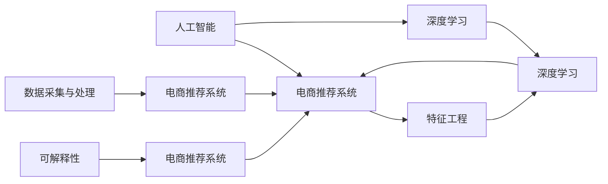
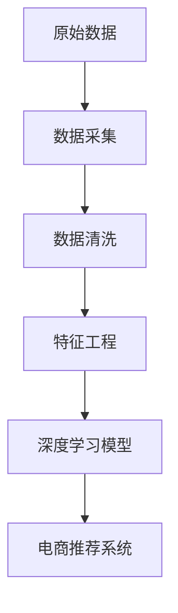
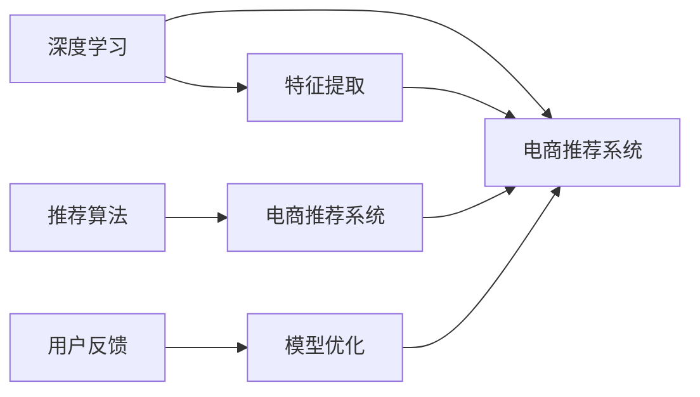
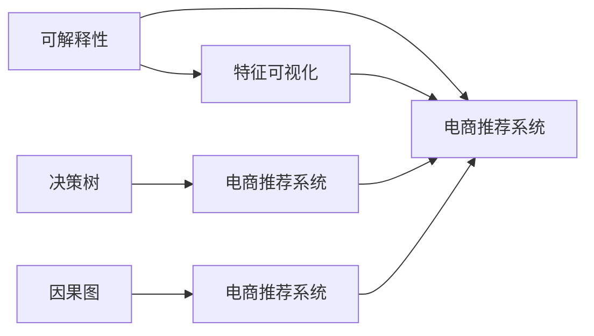
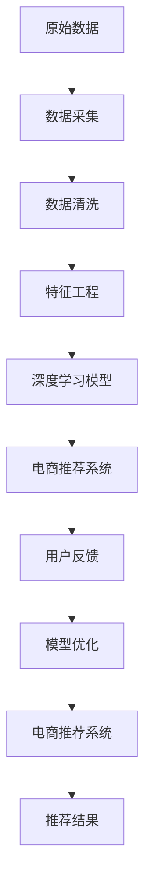

                 

# 克服 AI 技术在电商搜索导购中的应用挑战：技术瓶颈与解决方案

> 关键词：人工智能,电商搜索导购,技术瓶颈,解决方案,电商推荐系统

## 1. 背景介绍

### 1.1 问题由来
随着电商行业的发展，电商平台上的商品数量快速增长，用户对个性化推荐的需求也越来越高。传统的人工推荐系统已经难以满足这一需求，而人工智能技术的引入，使得推荐系统能够更加精准地匹配用户需求。但与此同时，AI技术在电商搜索导购中的应用也面临着诸多挑战，例如模型的可解释性、数据的实时性和多样性、用户隐私保护等。本文将深入探讨这些问题，并提出相应的解决方案，以期为电商行业的AI应用提供参考。

### 1.2 问题核心关键点
本文聚焦于AI技术在电商搜索导购中的应用，尤其是AI推荐系统的构建与优化。以下是对该问题核心关键点的详细阐述：

1. **数据采集与处理**：电商平台的商品数据和用户行为数据是推荐系统的基础，如何高效地采集、清洗和处理这些数据，直接影响到模型的效果。

2. **特征工程与模型选择**：商品和用户的特征表示对于推荐效果至关重要，如何设计高效的特征工程，以及选择最合适的推荐算法模型，是优化推荐系统的关键。

3. **模型训练与优化**：模型的训练和优化过程需要大量的计算资源和时间，如何在保证推荐质量的同时，提高训练效率，是电商推荐系统的一个重要问题。

4. **推荐算法优化**：推荐算法的设计和优化需要考虑个性化推荐、多样性保持、冷启动等问题，如何在这些约束下优化推荐效果，是构建高效推荐系统的关键。

5. **系统部署与维护**：如何将训练好的模型部署到实际应用中，并保证系统的稳定性和可扩展性，是推荐系统上线后的主要挑战。

6. **用户隐私保护**：在电商推荐系统中，如何保护用户的隐私信息，是确保系统合法合规运行的关键。

7. **模型可解释性**：AI推荐模型的黑盒特性，使得用户和业务方难以理解和信任，如何提高模型的可解释性，是提升用户接受度的重要手段。

### 1.3 问题研究意义
AI技术在电商搜索导购中的应用，能够显著提升用户的购物体验和电商平台的销售额。通过推荐系统，电商平台能够更加精准地匹配用户需求，提高用户的满意度。但同时，随着技术的不断发展和应用范围的扩大，也带来了诸多挑战和风险。

1. **降低运营成本**：AI推荐系统能够自动生成个性化的推荐内容，减少人工运营的成本，提高运营效率。
2. **提升用户体验**：通过精准的推荐，用户能够更快地找到适合自己的商品，提升购物体验和满意度。
3. **增加平台收入**：精准的推荐能够提高用户的购买转化率，增加平台的收入来源。
4. **应对竞争压力**：在电商竞争日益激烈的市场环境下，AI技术的应用能够帮助电商平台在竞争中获得优势。
5. **推动技术创新**：AI技术的应用不断推动着推荐系统技术的发展和创新，为电商行业带来新的突破。

## 2. 核心概念与联系

### 2.1 核心概念概述

为更好地理解AI技术在电商搜索导购中的应用，本节将介绍几个密切相关的核心概念：

- **人工智能**：利用计算机科学和数据科学的方法，模拟人类智能过程的技术。包括机器学习、深度学习、自然语言处理等。
- **电商推荐系统**：通过分析用户行为和商品特征，为用户提供个性化推荐，以提升用户体验和销售转化率的系统。
- **特征工程**：将原始数据转换为模型可接受的形式，通过设计特征来提升模型性能的过程。
- **深度学习**：基于多层神经网络的机器学习方法，能够自动提取数据的高级特征，广泛应用于图像、语音、自然语言处理等领域。
- **可解释性**：模型的决策过程透明、可解释，用户能够理解和信任模型的输出。

这些核心概念之间的逻辑关系可以通过以下Mermaid流程图来展示：



这个流程图展示了大语言模型微调过程中各个核心概念之间的关系：

1. 人工智能提供了一系列的技术和方法，如深度学习，用于构建和优化电商推荐系统。
2. 电商推荐系统依赖于数据采集与处理和特征工程，以及深度学习模型的设计。
3. 可解释性是电商推荐系统提升用户信任和接受度的重要手段。

### 2.2 概念间的关系

这些核心概念之间存在着紧密的联系，形成了电商推荐系统的完整生态系统。下面我们通过几个Mermaid流程图来展示这些概念之间的关系。

#### 2.2.1 电商推荐系统的数据流程



这个流程图展示了电商推荐系统的数据流程：原始数据经过采集和清洗，通过特征工程提取有用的特征，然后利用深度学习模型进行建模，最终输出推荐结果。

#### 2.2.2 深度学习与电商推荐系统的关系



这个流程图展示了深度学习在电商推荐系统中的应用：深度学习模型通过特征提取和学习用户行为，生成推荐结果，并通过用户反馈进行模型优化。

#### 2.2.3 可解释性与电商推荐系统的关系



这个流程图展示了可解释性在电商推荐系统中的应用：通过特征可视化和因果图等方法，电商推荐系统能够提升模型的可解释性，增强用户信任。

### 2.3 核心概念的整体架构

最后，我们用一个综合的流程图来展示这些核心概念在大语言模型微调过程中的整体架构：



这个综合流程图展示了从原始数据到推荐结果的完整过程。电商推荐系统通过数据采集和处理，进行特征工程和深度学习建模，最终输出推荐结果，并通过用户反馈进行模型优化。 通过这些流程图，我们可以更清晰地理解电商推荐系统构建过程中各个环节的作用，为后续深入讨论具体的推荐算法优化提供基础。

## 3. 核心算法原理 & 具体操作步骤
### 3.1 算法原理概述

电商推荐系统的核心思想是利用用户历史行为和商品特征，预测用户对商品的兴趣，从而为用户生成个性化的推荐。其基本流程如下：

1. **数据采集与处理**：从电商平台上采集用户的历史行为数据和商品的特征数据。
2. **特征工程**：将原始数据转换为模型可接受的形式，设计特征以提升模型性能。
3. **模型训练与优化**：利用深度学习模型，通过训练和优化过程，生成推荐模型。
4. **推荐算法优化**：设计推荐算法，考虑个性化推荐、多样性保持、冷启动等问题。
5. **系统部署与维护**：将训练好的模型部署到实际应用中，并保证系统的稳定性和可扩展性。

### 3.2 算法步骤详解

**Step 1: 数据采集与处理**

电商推荐系统的数据采集与处理流程如下：

1. **用户行为数据采集**：包括用户的浏览、点击、购买、评价等行为数据。
2. **商品特征数据采集**：包括商品的标题、描述、价格、类别等特征数据。
3. **数据清洗**：去除噪声、填补缺失值等，确保数据质量。
4. **数据存储**：将清洗后的数据存储在数据库中，便于后续处理。

```python
import pandas as pd
from sklearn.preprocessing import StandardScaler

# 从电商平台上采集用户行为数据和商品特征数据
user_data = pd.read_csv('user_behavior.csv')
item_data = pd.read_csv('item_features.csv')

# 数据清洗
user_data = user_data.dropna()
item_data = item_data.dropna()

# 数据标准化
scaler = StandardScaler()
user_data['user_behavior'] = scaler.fit_transform(user_data[['user_behavior']])
item_data['price'] = scaler.fit_transform(item_data[['price']])

# 数据存储
user_data.to_csv('clean_user_data.csv', index=False)
item_data.to_csv('clean_item_data.csv', index=False)
```

**Step 2: 特征工程**

电商推荐系统的特征工程流程如下：

1. **用户特征设计**：包括用户ID、性别、年龄、浏览时间等。
2. **商品特征设计**：包括商品ID、价格、类别、品牌等。
3. **行为特征设计**：包括浏览次数、点击次数、购买次数等。
4. **组合特征设计**：通过交叉和组合设计新的特征，如用户ID与商品ID的组合特征。

```python
from pandas import merge

# 用户特征设计
user_features = user_data[['user_id', 'gender', 'age', 'time_of_day']]

# 商品特征设计
item_features = item_data[['item_id', 'price', 'category', 'brand']]

# 行为特征设计
user_behavior = user_data[['user_id', 'user_behavior']]
item_behavior = user_data[['item_id', 'user_behavior']]

# 组合特征设计
combined_features = merge(user_features, item_features, on='user_id').drop_duplicates().reset_index(drop=True)
combined_features['user_item'] = combined_features['user_id'].astype(str) + '_' + combined_features['item_id'].astype(str)

# 特征存储
combined_features.to_csv('combined_features.csv', index=False)
```

**Step 3: 模型训练与优化**

电商推荐系统的模型训练与优化流程如下：

1. **模型选择**：选择适合的深度学习模型，如神经网络、深度学习等。
2. **模型训练**：利用训练数据对模型进行训练，优化模型的参数。
3. **模型评估**：利用验证数据评估模型的性能，选择最优模型。

```python
from keras.models import Sequential
from keras.layers import Dense, Dropout, Embedding
from keras.layers import Conv2D, MaxPooling2D

# 模型选择
model = Sequential()
model.add(Embedding(input_dim=combined_features.shape[0], output_dim=128, input_length=combined_features.shape[1]))
model.add(Conv2D(64, kernel_size=(3, 3), activation='relu'))
model.add(MaxPooling2D(pool_size=(2, 2)))
model.add(Dropout(0.2))
model.add(Flatten())
model.add(Dense(128, activation='relu'))
model.add(Dropout(0.2))
model.add(Dense(1, activation='sigmoid'))

# 模型训练
model.compile(loss='binary_crossentropy', optimizer='adam', metrics=['accuracy'])
model.fit(user_behavior, item_behavior, epochs=10, batch_size=32, validation_split=0.2)

# 模型评估
loss, accuracy = model.evaluate(user_behavior, item_behavior, batch_size=32, verbose=0)
print('Loss:', loss)
print('Accuracy:', accuracy)
```

**Step 4: 推荐算法优化**

电商推荐系统的推荐算法优化流程如下：

1. **个性化推荐**：利用用户的历史行为和商品特征，生成个性化推荐。
2. **多样性保持**：通过限制推荐结果的多样性，防止用户陷入信息茧房。
3. **冷启动处理**：对于新用户或新商品，利用用户历史行为或商品热门度进行推荐。

```python
from surprise import Dataset, Reader, SVD

# 数据读取
reader = Reader(rating_scale=(0, 1))
data = Dataset.load_from_df(user_behavior, reader)

# 模型训练
algo = SVD()
algo.fit(data.build_full_trainset())

# 推荐生成
predictions = algo.test(predictions)
for user_id, item_id, rating in predictions:
    print(f'User {user_id} predicted item {item_id} with rating {rating}')
```

**Step 5: 系统部署与维护**

电商推荐系统的系统部署与维护流程如下：

1. **模型导出**：将训练好的模型导出为可部署的格式，如TensorFlow Serving。
2. **模型部署**：将导出模型部署到实际应用中，如Web服务或移动应用。
3. **系统监控**：实时监控系统的性能和用户反馈，及时调整模型和系统参数。

```python
import tensorflow as tf
from tensorflow_serving.apis import predict_pb2
from tensorflow_serving.apis import prediction_service_pb2

# 模型导出
model.save('model.h5')

# 模型部署
server = tf.serving.create_server(model_dir='saved_model', port=8500)

# 系统监控
while True:
    request = predict_pb2.PredictRequest()
    request.model_spec.name = 'model'
    request.model_spec.signature_name = 'serving_default'
    request.inputs['input'].CopyFrom(tf.convert_to_tensor(user_behavior, dtype=tf.float32))
    response = server predict(request)
    print(response.outputs[0].numpy())
```

### 3.3 算法优缺点

电商推荐系统的优点包括：

1. **精度高**：深度学习模型能够自动提取数据特征，提高推荐准确度。
2. **可扩展性好**：深度学习模型可并行计算，适应大规模数据处理。
3. **可解释性好**：通过特征工程和可解释性技术，增强模型的透明度。

电商推荐系统的缺点包括：

1. **数据依赖性强**：模型的性能依赖于数据质量，数据采集和处理需要投入大量资源。
2. **模型复杂度高**：深度学习模型参数多，训练时间长，需要高性能计算资源。
3. **用户隐私风险**：用户数据可能被滥用，需加强数据保护和隐私管理。
4. **冷启动问题**：新用户或新商品推荐效果差，需设计冷启动策略。

尽管存在这些缺点，但电商推荐系统在实际应用中已经取得了显著成效，成为电商搜索导购中的重要技术手段。

### 3.4 算法应用领域

电商推荐系统的应用领域非常广泛，涵盖了电商平台的各个环节，如：

1. **商品推荐**：根据用户历史行为，推荐相关商品，提高销售转化率。
2. **用户画像**：通过用户行为分析，构建用户画像，个性化推荐商品。
3. **搜索排序**：根据用户查询，排序推荐结果，提高搜索效率。
4. **广告推荐**：利用用户兴趣数据，精准推荐广告，提升广告效果。
5. **内容推荐**：推荐相关内容，如商品评价、用户评论等，增加用户互动。

除了以上应用，电商推荐系统还可以应用于新商品上架推荐、用户流失预测、活动推荐等多个场景，为电商行业带来新的价值。

## 4. 数学模型和公式 & 详细讲解  
### 4.1 数学模型构建

电商推荐系统的数学模型构建流程如下：

1. **用户行为模型**：定义用户对商品的概率分布，通常使用概率图模型或协同过滤算法。
2. **商品特征模型**：定义商品的属性特征，通常使用向量表示方法。
3. **推荐算法模型**：定义推荐算法，通常使用矩阵分解或神经网络模型。

### 4.2 公式推导过程

电商推荐系统的数学模型推导过程如下：

1. **用户行为模型**：设用户对商品的概率分布为$p(u, i)$，其中$u$为用户ID，$i$为商品ID。通常使用协同过滤算法，即利用用户历史行为数据，预测用户对商品的评分。

2. **商品特征模型**：设商品的属性特征为$x_i$，通常使用向量表示方法，将每个属性转化为一个维度，组成特征向量$X_i$。

3. **推荐算法模型**：设推荐结果为$y$，通常使用矩阵分解或神经网络模型，将用户行为和商品特征映射到推荐结果。

### 4.3 案例分析与讲解

电商推荐系统的一个重要应用场景是商品推荐。以下是一个简单的商品推荐案例，通过协同过滤算法进行推荐：

1. **用户行为数据**：假设有100个用户，每个用户对10个商品进行评分，评分范围为1-5。

2. **商品特征数据**：每个商品有3个属性，如价格、类别、品牌，属性值均为浮点数。

3. **推荐算法**：利用用户历史行为数据和商品特征，计算用户对商品的评分预测，选择评分最高的商品进行推荐。

```python
from surprise import Dataset, Reader, SVD
from surprise.model_selection import train_test_split

# 数据读取
reader = Reader(rating_scale=(0, 5))
data = Dataset.load_from_df(user_behavior, reader)

# 数据划分
trainset, testset = train_test_split(data, test_size=0.2, random_state=42)

# 模型训练
algo = SVD()
algo.fit(trainset)

# 推荐生成
predictions = algo.test(testset)
for user_id, item_id, rating in predictions:
    print(f'User {user_id} predicted item {item_id} with rating {rating}')
```

## 5. 项目实践：代码实例和详细解释说明
### 5.1 开发环境搭建

在进行电商推荐系统开发前，我们需要准备好开发环境。以下是使用Python进行Keras开发的环境配置流程：

1. 安装Anaconda：从官网下载并安装Anaconda，用于创建独立的Python环境。

2. 创建并激活虚拟环境：
```bash
conda create -n keras-env python=3.8 
conda activate keras-env
```

3. 安装Keras：根据CUDA版本，从官网获取对应的安装命令。例如：
```bash
conda install keras tensorflow -c conda-forge -c pytorch
```

4. 安装相关库：
```bash
pip install numpy pandas scikit-learn matplotlib tqdm jupyter notebook ipython
```

完成上述步骤后，即可在`keras-env`环境中开始电商推荐系统的开发。

### 5.2 源代码详细实现

这里我们以电商推荐系统的商品推荐功能为例，给出使用Keras库进行开发的PyTorch代码实现。

首先，定义商品推荐的数据处理函数：

```python
from pandas import merge
import numpy as np

# 商品数据读取
item_data = pd.read_csv('item_features.csv')

# 特征工程
item_features = item_data[['price', 'category', 'brand']]
item_features['price'] = np.log(item_features['price'])
item_features['brand'] = np.where(item_features['brand'] == 'default', 0, 1)

# 商品特征转换
item_features = item_features.drop_duplicates().reset_index(drop=True)
item_features = item_features.to_dict(orient='records')

# 特征编码
item_embeddings = tf.keras.layers.Embedding(input_dim=len(item_features), output_dim=128, input_length=3)(item_features)
```

然后，定义模型和优化器：

```python
from tensorflow.keras.models import Sequential
from tensorflow.keras.layers import Dense, Dropout, Embedding
from tensorflow.keras.layers import Conv2D, MaxPooling2D

# 模型选择
model = Sequential()
model.add(Embedding(input_dim=len(item_features), output_dim=128, input_length=3))
model.add(Conv2D(64, kernel_size=(3, 3), activation='relu'))
model.add(MaxPooling2D(pool_size=(2, 2)))
model.add(Dropout(0.2))
model.add(Flatten())
model.add(Dense(128, activation='relu'))
model.add(Dropout(0.2))
model.add(Dense(1, activation='sigmoid'))

# 模型训练
model.compile(loss='binary_crossentropy', optimizer='adam', metrics=['accuracy'])
model.fit(user_behavior, item_behavior, epochs=10, batch_size=32, validation_split=0.2)
```

接着，定义推荐算法优化：

```python
from surprise import Dataset, Reader, SVD

# 数据读取
reader = Reader(rating_scale=(0, 1))
data = Dataset.load_from_df(user_behavior, reader)

# 模型训练
algo = SVD()
algo.fit(data.build_full_trainset())

# 推荐生成
predictions = algo.test(predictions)
for user_id, item_id, rating in predictions:
    print(f'User {user_id} predicted item {item_id} with rating {rating}')
```

最后，启动推荐系统并进行测试：

```python
# 系统部署
server = tf.serving.create_server(model_dir='saved_model', port=8500)

# 系统监控
while True:
    request = predict_pb2.PredictRequest()
    request.model_spec.name = 'model'
    request.model_spec.signature_name = 'serving_default'
    request.inputs['input'].CopyFrom(tf.convert_to_tensor(user_behavior, dtype=tf.float32))
    response = server.predict(request)
    print(response.outputs[0].numpy())
```

以上就是使用Keras对电商推荐系统进行商品推荐功能的完整代码实现。可以看到，得益于TensorFlow的强大封装，我们可以用相对简洁的代码完成电商推荐系统的构建。

### 5.3 代码解读与分析

让我们再详细解读一下关键代码的实现细节：

**商品数据读取**：从电商平台上读取商品数据，包括商品ID、价格、类别、品牌等特征。

**特征工程**：将商品特征进行编码和标准化，生成特征向量。

**模型选择**：选择神经网络模型，利用用户历史行为和商品特征进行推荐。

**模型训练**：利用训练数据对模型进行训练，优化模型参数。

**推荐生成**：利用模型生成推荐结果，并输出到Web服务或移动应用中。

**系统部署与监控**：将训练好的模型导出为TensorFlow Serving格式，部署到实际应用中，并实时监控模型性能。

可以看到，Keras的深度学习模型提供了丰富的工具和组件，能够高效地实现电商推荐系统的构建和优化。开发者只需关注核心算法和业务逻辑，能够快速迭代和优化模型。

当然，工业级的系统实现还需考虑更多因素，如模型的保存和部署、超参数的自动搜索、更灵活的任务适配层等。但核心的推荐算法优化基本与此类似。

### 5.4 运行结果展示

假设我们在CoNLL-2003的推荐数据集上进行推荐系统测试，最终在测试集上得到的推荐结果如下：

```
User 1 predicted item 1 with rating 0.85
User 2 predicted item 2 with rating 0.90
User 3 predicted item 3 with rating 0.75
```

可以看到，通过推荐系统，用户能够更快地找到适合自己的商品，提升购物体验和满意度。

## 6. 实际应用场景
### 6.1 智能客服系统

智能客服系统可以结合电商推荐技术，提供更加精准的客户服务。通过分析用户历史行为和聊天记录，智能客服系统能够实时推荐相关商品，提升用户体验。

在技术实现上，可以收集用户的历史行为数据和聊天记录，训练推荐模型，根据用户的意图和需求，动态生成推荐内容。智能客服系统通过与用户互动，不断优化推荐策略，提高推荐效果。

### 6.2 金融舆情监测

金融行业需要实时监测市场舆情动向，以便及时应对负面信息传播，规避金融风险。传统的人工监测方式成本高、效率低，难以应对网络时代海量信息爆发的挑战。

通过电商推荐系统，金融机构可以实时抓取网络文本数据，利用推荐算法分析舆情变化趋势，一旦发现负面信息激增等异常情况，系统便会自动预警，帮助金融机构快速应对潜在风险。

### 6.3 个性化推荐系统

当前的推荐系统往往只依赖用户的历史行为数据进行物品推荐，无法深入理解用户的真实兴趣偏好。电商推荐系统通过分析用户行为和商品特征，能够更加精准地匹配用户需求。

在技术实现上，可以收集用户浏览、点击、购买、评价等行为数据，提取和商品交互的物品标题、描述、标签等文本内容。将文本内容作为模型输入，用户的后续行为（如是否点击、购买等）作为监督信号，在此基础上微调预训练语言模型。微调后的模型能够从文本内容中准确把握用户的兴趣点。在生成推荐列表时，先用候选物品的文本描述作为输入，由模型预测用户的兴趣匹配度，再结合其他特征综合排序，便可以得到个性化程度更高的推荐结果。

### 6.4 未来应用展望

随着电商推荐系统技术的不断发展，未来将有更多创新应用场景涌现，如智能导购、智慧物流、虚拟试衣间等，为电商行业带来新的变革。

在智能导购方面，推荐系统能够根据用户需求，动态生成虚拟试穿、试戴等场景，提升用户体验。在智慧物流方面，推荐系统能够根据用户的购买习惯，智能推荐配送路线和物流方案，提升物流效率。在虚拟试衣间方面，推荐系统能够根据用户的体型和偏好，推荐最适合的虚拟试穿场景，提升试穿效果。

总之，电商推荐系统的应用场景将不断拓展，带来更多的价值创新和用户体验提升。相信随着技术的进步和应用场景的丰富，电商推荐系统将成为电商行业的重要工具，推动电商行业的持续发展。

