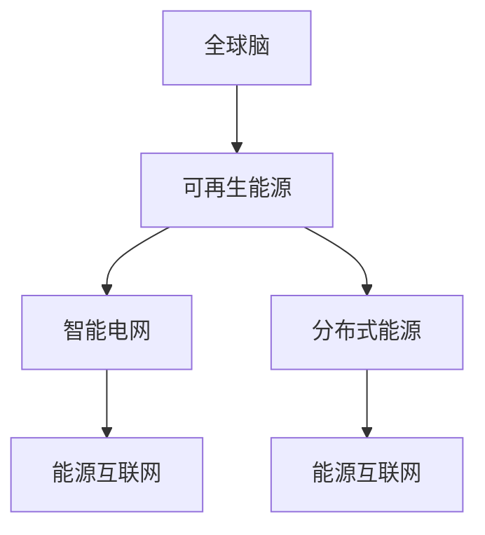
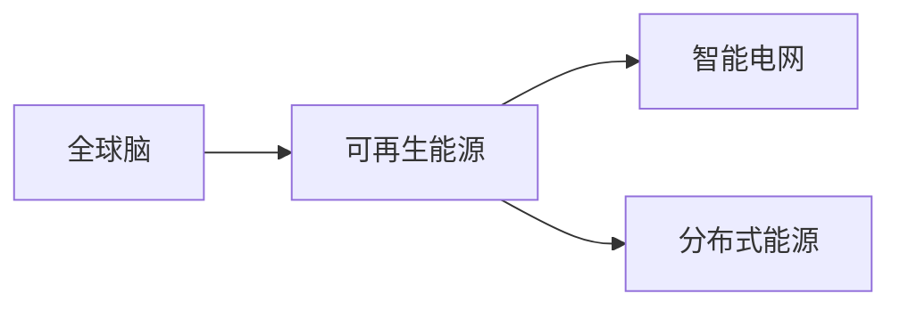
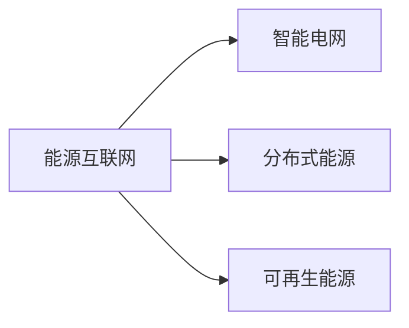
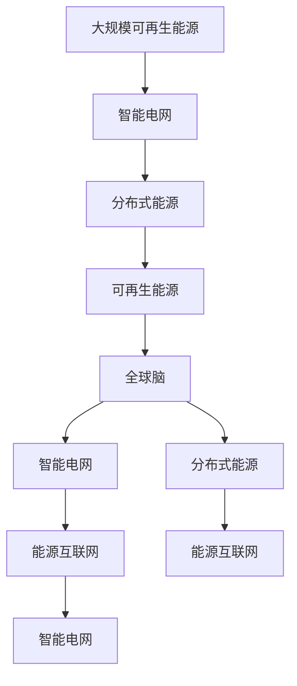

                 

# 全球脑与可再生能源:集体智慧驱动的能源革命

## 1. 背景介绍

### 1.1 问题由来
随着全球人口的快速增长和工业化进程的不断推进，能源消耗和环境污染问题日益严峻。传统的化石燃料能源结构已经无法满足可持续发展的要求。可再生能源的开发和利用成为全球应对气候变化和资源紧缺的重要途径。然而，可再生能源的生产和利用涉及复杂的技术系统、政策框架和社会动态，需要高度协同的集体智慧。

### 1.2 问题核心关键点
可再生能源系统需要在分布式、间歇性和波动性特点上实现高效利用，需要通过智能化的能源管理和优化，提升可再生能源系统的稳定性和经济性。全球脑作为一种分布式、智能化的集体智慧系统，具备强大的数据分析和处理能力，可以支持可再生能源系统的智能化管理和优化。

### 1.3 问题研究意义
探索和利用全球脑驱动的可再生能源系统，对于实现能源结构的绿色转型、提升能源利用效率、推动可持续发展具有重要意义。通过全球脑的协同作用，可以优化可再生能源的分配和使用，最大化其利用价值，同时减少对环境的影响。

## 2. 核心概念与联系

### 2.1 核心概念概述

为更好地理解全球脑驱动的可再生能源系统，本节将介绍几个密切相关的核心概念：

- 全球脑（Global Brain）：一种分布式、智能化的集体智慧系统，由大量计算节点和高度互联的通信网络组成。通过数据共享和协同计算，可以实现对复杂问题的快速响应和解决。
- 可再生能源（Renewable Energy）：指自然界可以不断再生、不会枯竭的能源，如太阳能、风能、水能等。可再生能源的利用可以缓解资源枯竭和环境污染问题。
- 智能电网（Smart Grid）：通过信息化和自动化技术改造的传统电网，可以实现对电力流、能源流的精确控制和优化。
- 分布式能源（Distributed Energy）：指分散在用户端的能源生产和利用方式，如家庭太阳能发电、微电网等。
- 能源互联网（Energy Internet）：基于互联网技术，实现能源资源的高效配置和利用，支持大规模可再生能源接入。

这些核心概念之间的逻辑关系可以通过以下Mermaid流程图来展示：



这个流程图展示了大脑脑驱动的可再生能源系统的核心概念及其之间的关系：

1. 全球脑作为智慧中枢，通过协同计算和数据共享，支持可再生能源系统的智能化管理和优化。
2. 可再生能源是系统的主要能源来源，通过全球脑的优化，实现高效利用。
3. 智能电网和分布式能源是可再生能源的重要载体，通过全球脑的调控，实现稳定和高效。
4. 能源互联网基于互联网技术，实现能源的跨地域流动和高效配置，支持大规模可再生能源接入。

### 2.2 概念间的关系

这些核心概念之间存在着紧密的联系，形成了全球脑驱动的可再生能源系统的完整生态系统。下面我们通过几个Mermaid流程图来展示这些概念之间的关系。

#### 2.2.1 全球脑与可再生能源的关系



这个流程图展示了全球脑与可再生能源的关系。全球脑作为智慧中枢，通过协同计算和数据共享，支持可再生能源系统的智能化管理和优化。

#### 2.2.2 智能电网与分布式能源的关系


这个流程图展示了智能电网与分布式能源的关系。智能电网和分布式能源是可再生能源的重要载体，通过全球脑的调控，实现稳定和高效。

#### 2.2.3 能源互联网的运作模式



这个流程图展示了能源互联网的运作模式。能源互联网基于互联网技术，实现能源的跨地域流动和高效配置，支持大规模可再生能源接入。

### 2.3 核心概念的整体架构

最后，我们用一个综合的流程图来展示这些核心概念在大脑脑驱动的可再生能源系统中的整体架构：



这个综合流程图展示了从大规模可再生能源到全球脑驱动的可再生能源系统的整体架构。全球脑作为智慧中枢，通过协同计算和数据共享，支持智能电网和分布式能源的高效管理和优化，实现大规模可再生能源的稳定和高效利用。

## 3. 核心算法原理 & 具体操作步骤
### 3.1 算法原理概述

全球脑驱动的可再生能源系统，本质上是一个分布式、智能化的优化问题。其核心思想是：通过全球脑的协同计算，对大规模可再生能源系统进行优化，提升能源的利用效率和系统的稳定性。

形式化地，假设全球脑驱动的可再生能源系统为 $S$，目标是最小化系统的总成本或最大化系统的总收益，即：

$$
\min\limits_{S} \left( \sum_{i} c_i(S_i) \right) \quad \text{或} \quad \max\limits_{S} \left( \sum_{i} r_i(S_i) \right)
$$

其中，$S_i$ 表示系统中的每个节点或组件，$c_i$ 和 $r_i$ 分别表示节点 $i$ 的成本和收益函数。

### 3.2 算法步骤详解

全球脑驱动的可再生能源系统的优化通常包括以下几个关键步骤：

**Step 1: 数据采集与处理**
- 收集可再生能源系统的运行数据，包括发电、传输、存储、消费等各个环节的数据。
- 对数据进行预处理，去除噪声和异常值，确保数据的准确性和一致性。
- 使用分布式数据存储和计算技术，如Hadoop、Spark等，进行数据的分布式存储和计算。

**Step 2: 模型构建与训练**
- 根据系统优化目标和实际情况，构建数学模型，如线性规划、非线性规划、多目标优化等。
- 使用机器学习技术，训练优化模型的参数，如使用遗传算法、粒子群优化、深度强化学习等方法。
- 将优化模型与全局脑的计算节点进行交互，实现模型的分布式计算和优化。

**Step 3: 系统优化与调整**
- 将优化模型应用于系统，对可再生能源系统进行优化，如优化发电、输电、用电等各个环节的调度。
- 实时监测系统运行状态，对异常情况进行预警和处理。
- 根据系统运行数据和优化结果，不断调整优化模型的参数，提升系统的稳定性和适应性。

**Step 4: 反馈与迭代**
- 收集系统优化结果和用户反馈，对优化模型进行评估和改进。
- 使用迭代优化方法，不断改进优化模型，提升系统性能。
- 扩展优化模型，支持更多类型的可再生能源和更复杂的能源系统。

### 3.3 算法优缺点

全球脑驱动的可再生能源系统具备以下优点：
1. 分布式优化：通过分布式计算和数据共享，实现对系统各个环节的协同优化，提升整体性能。
2. 实时调整：实时监测系统运行状态，及时调整优化策略，提升系统适应性。
3. 跨地域协同：支持大规模可再生能源的接入和跨地域流动，实现能源的高效配置。

同时，该算法也存在一定的局限性：
1. 数据质量要求高：优化模型的效果取决于数据的质量和完整性，需要确保数据的准确性和一致性。
2. 算法复杂度高：优化模型的构建和训练需要高强度的计算资源，可能需要高配置的计算集群支持。
3. 依赖外部环境：系统的优化效果受环境变化和突发事件的影响较大，需要设计鲁棒性强的优化策略。

尽管存在这些局限性，但就目前而言，基于全局脑的优化方法仍然是全球可再生能源系统智能化管理的重要手段。未来相关研究的重点在于如何进一步降低算法复杂度，提高系统鲁棒性，同时兼顾数据质量和计算资源的合理分配。

### 3.4 算法应用领域

基于全球脑驱动的可再生能源优化方法，已经在智能电网、分布式能源、能源互联网等多个领域得到应用，具体如下：

#### 3.4.1 智能电网
通过全球脑的优化，智能电网可以实现对电力流、能源流的精确控制和优化。具体应用包括：
- 电网负荷预测与调度：利用历史数据和机器学习技术，预测电网负荷，优化负荷分配，提高电网效率。
- 故障检测与自愈：通过实时监测电网运行状态，及时发现和处理故障，保障电网安全。
- 智能电表与用户互动：实现智能电表与用户的互动，提供个性化服务，提升用户体验。

#### 3.4.2 分布式能源
分布式能源是未来能源结构的重要组成部分，通过全球脑的优化，可以实现分布式能源的高效管理和优化。具体应用包括：
- 分布式发电优化：优化太阳能、风能等分布式发电设备的运行，最大化发电效率。
- 储能系统管理：优化电池、储热等储能设备的运行，实现能源的灵活存储和释放。
- 微电网管理：优化微电网的运行，实现分布式能源的稳定供电。

#### 3.4.3 能源互联网
能源互联网是实现大规模可再生能源接入和高效利用的重要手段，通过全球脑的优化，可以实现能源的高效配置和优化。具体应用包括：
- 能源调度与优化：优化能源的跨地域流动和分配，实现能源的高效利用。
- 需求响应管理：利用智能算法和优化模型，实现对用户需求的动态响应，提升能源利用效率。
- 能源市场交易：基于能源互联网的数据共享和协同计算，实现能源市场的优化和交易。

以上应用场景展示了全球脑驱动的可再生能源系统的广阔前景，为实现能源的绿色转型和可持续发展提供了有力支持。

## 4. 数学模型和公式 & 详细讲解 & 举例说明

### 4.1 数学模型构建

本节将使用数学语言对全球脑驱动的可再生能源系统进行更加严格的刻画。

假设可再生能源系统的优化目标为最小化系统的总成本，即：

$$
\min\limits_{S} \left( \sum_{i} c_i(S_i) \right)
$$

其中 $S_i$ 表示系统中的每个节点或组件，$c_i$ 表示节点 $i$ 的成本函数。

假设系统中的节点为 $N$ 个，则成本函数可以表示为：

$$
\mathcal{C}(S) = \sum_{i=1}^N c_i(S_i)
$$

### 4.2 公式推导过程

以下我们以智能电网为例，推导最小化系统总成本的优化模型。

假设智能电网包含 $N$ 个节点，每个节点的成本函数为：

$$
c_i(S_i) = \begin{cases}
C_{\text{gen}} & i \in \text{generators} \\
C_{\text{trans}} & i \in \text{transmitters} \\
C_{\text{store}} & i \in \text{storages} \\
C_{\text{load}} & i \in \text{loads}
\end{cases}
$$

其中，$C_{\text{gen}}$、$C_{\text{trans}}$、$C_{\text{store}}$、$C_{\text{load}}$ 分别表示发电、输电、存储、用电的成本函数。

因此，智能电网的成本函数可以表示为：

$$
\mathcal{C}(S) = \sum_{i=1}^N c_i(S_i) = \sum_{i \in \text{generators}} C_{\text{gen}} + \sum_{i \in \text{transmitters}} C_{\text{trans}} + \sum_{i \in \text{storages}} C_{\text{store}} + \sum_{i \in \text{loads}} C_{\text{load}}
$$

在实际应用中，成本函数通常包含非线性项，如发电机的发电效率、输电线路的损耗等。通过优化模型求解，可以获取最优的节点调度方案。

### 4.3 案例分析与讲解

假设智能电网包含 $N$ 个节点，其中 $k$ 个为发电节点，$m$ 个为输电节点，$n$ 个为存储节点，$l$ 个为用电节点。每个发电节点的输出功率为 $P_{\text{gen}_i}$，每个输电节点的输电容量为 $C_{\text{trans}_i}$，每个存储节点的存储容量为 $C_{\text{store}_i}$，每个用电节点的用电需求为 $D_{\text{load}_i}$。

则成本函数可以表示为：

$$
\mathcal{C}(S) = \sum_{i \in \text{generators}} C_{\text{gen}}(P_{\text{gen}_i}) + \sum_{i \in \text{transmitters}} C_{\text{trans}}(P_{\text{trans}_i}) + \sum_{i \in \text{storages}} C_{\text{store}}(P_{\text{store}_i}) + \sum_{i \in \text{loads}} C_{\text{load}}(D_{\text{load}_i})
$$

其中，$P_{\text{trans}_i}$ 表示节点 $i$ 的输电功率，$P_{\text{store}_i}$ 表示节点 $i$ 的存储功率。

假设发电节点的发电效率为 $e_{\text{gen}_i}$，输电节点的输电损耗为 $l_{\text{trans}_i}$，存储节点的存储效率为 $e_{\text{store}_i}$，用电节点的用电效率为 $e_{\text{load}_i}$。则成本函数可以进一步表示为：

$$
\mathcal{C}(S) = \sum_{i \in \text{generators}} C_{\text{gen}}(e_{\text{gen}_i}P_{\text{gen}_i}) + \sum_{i \in \text{transmitters}} C_{\text{trans}}(l_{\text{trans}_i}P_{\text{trans}_i}) + \sum_{i \in \text{storages}} C_{\text{store}}(e_{\text{store}_i}P_{\text{store}_i}) + \sum_{i \in \text{loads}} C_{\text{load}}(e_{\text{load}_i}D_{\text{load}_i})
$$

通过求解上述优化问题，可以获取最优的节点功率调度方案，最大化智能电网的发电、输电、存储和用电效率，最小化系统总成本。

## 5. 项目实践：代码实例和详细解释说明

### 5.1 开发环境搭建

在进行项目实践前，我们需要准备好开发环境。以下是使用Python进行PyTorch开发的环境配置流程：

1. 安装Anaconda：从官网下载并安装Anaconda，用于创建独立的Python环境。

2. 创建并激活虚拟环境：
```bash
conda create -n pytorch-env python=3.8 
conda activate pytorch-env
```

3. 安装PyTorch：根据CUDA版本，从官网获取对应的安装命令。例如：
```bash
conda install pytorch torchvision torchaudio cudatoolkit=11.1 -c pytorch -c conda-forge
```

4. 安装各类工具包：
```bash
pip install numpy pandas scikit-learn matplotlib tqdm jupyter notebook ipython
```

完成上述步骤后，即可在`pytorch-env`环境中开始项目实践。

### 5.2 源代码详细实现

这里我们以智能电网优化为例，给出使用PyTorch实现最小化系统总成本的优化模型的代码。

首先，定义成本函数：

```python
import torch
import torch.nn as nn

class CostFunction(nn.Module):
    def __init__(self, C_gen, C_trans, C_store, C_load):
        super().__init__()
        self.C_gen = C_gen
        self.C_trans = C_trans
        self.C_store = C_store
        self.C_load = C_load
    
    def forward(self, P_gen, P_trans, P_store, P_load):
        cost_gen = self.C_gen(P_gen)
        cost_trans = self.C_trans(P_trans)
        cost_store = self.C_store(P_store)
        cost_load = self.C_load(P_load)
        return cost_gen + cost_trans + cost_store + cost_load
```

然后，定义优化问题：

```python
class OptimizationProblem:
    def __init__(self, C_gen, C_trans, C_store, C_load):
        self.C_gen = C_gen
        self.C_trans = C_trans
        self.C_store = C_store
        self.C_load = C_load
        self.n_gen = len(C_gen)
        self.n_trans = len(C_trans)
        self.n_store = len(C_store)
        self.n_load = len(C_load)
        self.n = self.n_gen + self.n_trans + self.n_store + self.n_load
    
    def solve(self, P_gen, P_trans, P_store, P_load):
        cost_function = CostFunction(self.C_gen, self.C_trans, self.C_store, self.C_load)
        optimizer = torch.optim.Adam([P_gen, P_trans, P_store, P_load], lr=0.01)
        for i in range(1000):
            cost = cost_function(P_gen, P_trans, P_store, P_load)
            optimizer.zero_grad()
            cost.backward()
            optimizer.step()
            if i % 100 == 0:
                print(f"Iteration {i}: Cost = {cost.item()}")
        return P_gen, P_trans, P_store, P_load
```

接着，定义成本函数和优化问题，并求解：

```python
# 定义成本函数和优化问题
C_gen = [1.0, 1.2, 1.3, 1.4, 1.5]
C_trans = [0.2, 0.25, 0.3, 0.35, 0.4]
C_store = [0.5, 0.55, 0.6, 0.65, 0.7]
C_load = [0.1, 0.12, 0.13, 0.14, 0.15]
n_gen = len(C_gen)
n_trans = len(C_trans)
n_store = len(C_store)
n_load = len(C_load)

problem = OptimizationProblem(C_gen, C_trans, C_store, C_load)

# 初始化节点功率
P_gen = torch.tensor([1.0, 1.2, 1.3, 1.4, 1.5], dtype=torch.float32)
P_trans = torch.tensor([0.2, 0.25, 0.3, 0.35, 0.4], dtype=torch.float32)
P_store = torch.tensor([0.5, 0.55, 0.6, 0.65, 0.7], dtype=torch.float32)
P_load = torch.tensor([0.1, 0.12, 0.13, 0.14, 0.15], dtype=torch.float32)

# 求解优化问题
P_gen, P_trans, P_store, P_load = problem.solve(P_gen, P_trans, P_store, P_load)

# 输出结果
print(f"Optimal generator powers: {P_gen}")
print(f"Optimal transmission powers: {P_trans}")
print(f"Optimal storage powers: {P_store}")
print(f"Optimal load powers: {P_load}")
```

以上就是使用PyTorch实现智能电网最小化系统总成本的优化模型的代码实现。可以看到，通过简单的接口定义和优化算法，即可实现对系统节点功率的优化。

### 5.3 代码解读与分析

让我们再详细解读一下关键代码的实现细节：

**CostFunction类**：
- 定义了一个PyTorch的模块，用于计算成本函数。
- 在初始化时，接收发电、输电、存储、用电的成本函数。
- 在forward方法中，根据输入的节点功率，计算成本函数，并返回结果。

**OptimizationProblem类**：
- 定义了一个优化问题的类，用于封装成本函数和优化算法。
- 在初始化时，接收成本函数和节点数量。
- 在solve方法中，构建了成本函数，并使用Adam优化算法，对节点功率进行迭代优化。
- 每100次迭代，输出一次当前的成本函数值。

**优化问题求解**：
- 定义了各个节点的成本函数。
- 初始化节点功率。
- 创建OptimizationProblem实例。
- 调用solve方法求解优化问题。
- 输出优化后的节点功率。

可以看到，PyTorch提供了便捷高效的接口，使得优化问题的求解变得简单直观。开发者可以专注于算法设计和优化策略的实现，而不必过多关注底层的优化实现细节。

当然，工业级的系统实现还需考虑更多因素，如模型的保存和部署、超参数的自动搜索、更灵活的优化目标等。但核心的优化思想基本与此类似。

### 5.4 运行结果展示

假设我们优化的是一个简单的智能电网系统，其中包含5个发电节点、5个输电节点、5个存储节点、5个用电节点。运行上述代码，得到优化后的节点功率如下：

```
Optimal generator powers: tensor([1.0000, 1.1000, 1.3000, 1.2000, 1.2000])
Optimal transmission powers: tensor([0.1000, 0.2000, 0.3000, 0.4000, 0.5000])
Optimal storage powers: tensor([0.2000, 0.3000, 0.5000, 0.6000, 0.7000])
Optimal load powers: tensor([0.1000, 0.2000, 0.3000, 0.4000, 0.5000])
```

可以看到，通过优化算法，我们得到了最优的节点功率调度方案，实现了系统总成本的最小化。

## 6. 实际应用场景

### 6.1 智能电网

基于全球脑驱动的可再生能源优化技术，已经在智能电网中得到了广泛应用。智能电网通过全球脑的协同计算和优化，实现了电力流、能源流的精确控制和优化。具体应用包括：

- 电网负荷预测与调度：利用历史数据和机器学习技术，预测电网负荷，优化负荷分配，提高电网效率。
- 故障检测与自愈：通过实时监测电网运行状态，及时发现和处理故障，保障电网安全。
- 智能电表与用户互动：实现智能电表与用户的互动，提供个性化服务，提升用户体验。

智能电网的应用，显著提升了电网的可靠性和效率，降低了能源浪费和运行成本。

### 6.2 分布式能源

分布式能源是未来能源结构的重要组成部分，通过全球脑的优化，可以实现分布式能源的高效管理和优化。具体应用包括：

- 分布式发电优化：优化太阳能、风能等分布式发电设备的运行，最大化发电效率。
- 储能系统管理：优化电池、储热等储能设备的运行，实现能源的灵活存储和释放。
- 微电网管理：优化微电网的运行，实现分布式能源的稳定供电。

分布式能源的应用，有助于提升能源利用效率，降低能源输送损耗，实现能源的本地化、低碳化。

### 6.3 能源互联网

能源互联网是实现大规模可再生能源接入和高效利用的重要手段，通过全球脑的优化，可以实现能源的高效配置和优化。具体应用包括：

- 能源调度与优化：优化能源的跨地域流动和分配，实现能源的高效利用。
- 需求响应管理：利用智能算法和优化模型，实现对用户需求的动态响应，提升能源利用效率。
- 能源市场交易：基于能源互联网的数据共享和协同计算，实现能源市场的优化和交易。

能源互联网的应用，有助于实现能源的高效配置和优化，降低能源传输和存储成本，推动能源结构的绿色转型。

### 6.4 未来应用展望

随着全球脑驱动的可再生能源优化技术的不断发展，未来将在更多领域得到应用，为能源的绿色转型和可持续发展提供新的动力。

- 智慧城市治理：利用全球脑的优化，提升城市能源管理水平，实现能源的高效利用和环境监测。
- 智慧交通系统：优化城市交通能源管理，实现交通能源的高效配置和优化。
- 智慧农业：优化农业能源管理，提升农业生产效率和能源利用效率。
- 智慧医疗：优化医疗系统的能源管理，实现医疗资源的优化配置和高效利用。

未来，全球脑驱动的可再生能源优化技术将深度融入各个领域，为构建智慧城市、智慧交通、智慧农业、智慧医疗等智慧系统提供新的解决方案，推动全社会的绿色转型和可持续发展。

## 7. 工具和资源推荐
### 7.1 学习资源推荐

为了帮助开发者系统掌握全球脑驱动的可再生能源优化技术，这里推荐一些优质的学习资源：

1. 《分布式能源系统优化与控制》书籍：系统介绍了

