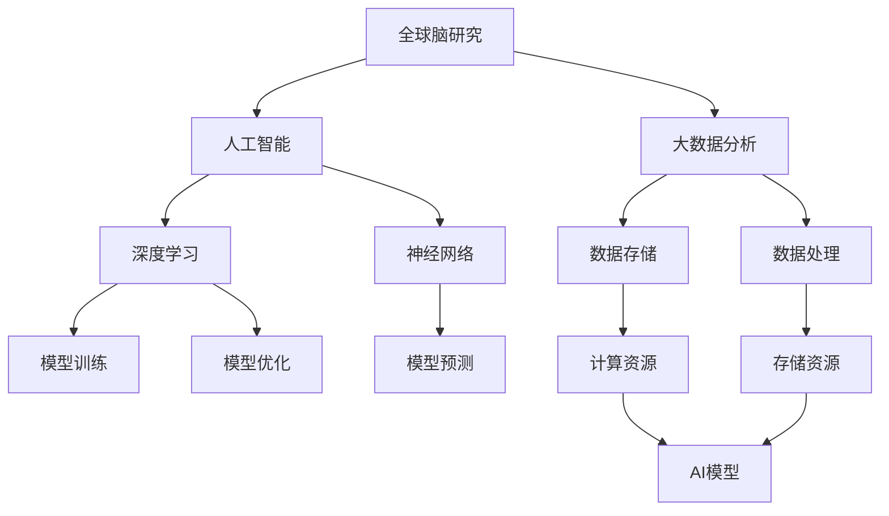
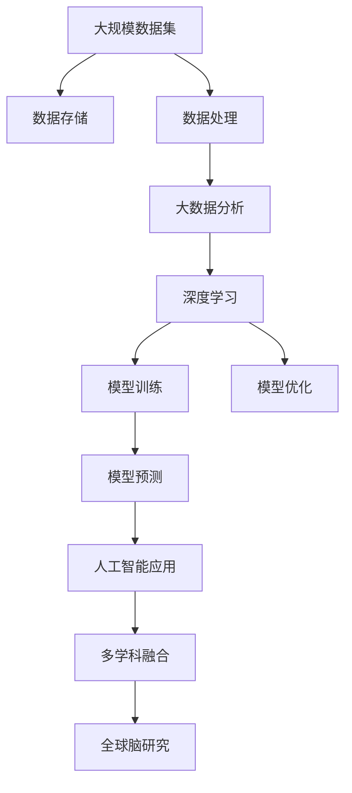

                 

# 全球脑与科学研究:跨界协作的新范式

> 关键词：全球脑研究,多学科交叉,人工智能,大数据分析,脑科学

## 1. 背景介绍

### 1.1 问题由来

全球脑与科学研究（Global Brain Research）已经成为21世纪前沿科技领域的热点话题，它涉及到神经科学、计算机科学、生物医学工程等多个学科的交叉与融合。随着人工智能技术的快速发展，尤其是深度学习和大数据处理技术的突破，科学家们开始利用先进技术手段对大脑的认知机制、信息处理能力等进行深入研究，以期揭示大脑的奥秘，开发出更智能、更高效的计算模型和算法。

然而，尽管现代科学技术在人工智能和神经科学研究上取得了显著进展，但多学科之间的沟通和协作仍然存在诸多障碍，难以形成高效、统一的研发体系。因此，探索一种全新的跨界协作范式成为当下急需解决的问题。

### 1.2 问题核心关键点

全球脑与科学研究的关键在于如何有效地实现跨学科的协作与融合，具体包括以下几个方面：

- **数据共享**：各学科领域的海量数据和分析结果如何安全、高效地共享？
- **知识协同**：不同学科的知识体系和研究方法如何相互融合和转化？
- **技术互用**：先进的计算技术和脑科学理论如何相互支撑和促进？
- **人才协作**：不同领域的专业人士如何高效合作，形成多学科的协同创新？

只有解决好这些问题，全球脑与科学研究才能真正走向深入，产生切实可行的成果。

### 1.3 问题研究意义

全球脑与科学研究不仅具有重大的理论意义，还具有巨大的应用价值。通过跨界协作，科学家们可以揭示大脑的认知机制，开发出更具智能、高效、安全的人工智能系统，为医疗、教育、娱乐等众多行业带来革命性的改变。此外，全球脑与科学研究还能够提升人类对自我认知的理解，推动人类文明的进步。

本文旨在全面系统地介绍全球脑与科学研究的方法和范式，探讨跨界协作的新路径，为未来在这一领域的深入研究提供理论支持和实践指导。

## 2. 核心概念与联系

### 2.1 核心概念概述

全球脑与科学研究涉及的核心概念包括但不限于以下几方面：

- **全球脑研究**：利用先进技术手段对全球大脑的认知功能进行系统研究，包括神经网络、大脑活动模式、信息处理能力等。
- **人工智能**：基于深度学习和大数据分析技术的智能计算模型和算法，广泛应用于机器学习、自然语言处理、计算机视觉等领域。
- **大数据分析**：通过海量数据的采集、存储、处理和分析，揭示隐藏在海量数据中的模式和规律。
- **脑科学**：研究大脑的生理结构和功能，揭示人类认知机制和信息处理能力的科学。

这些核心概念之间的联系主要体现在以下几个方面：

- **数据驱动**：全球脑与科学研究依赖于大规模、高精度的数据集，这些数据集为人工智能模型的训练和优化提供了基础。
- **技术支撑**：人工智能技术和脑科学研究需要大量计算资源和存储资源，大数据分析技术为数据处理和分析提供了强有力的支持。
- **多学科融合**：人工智能和脑科学研究需要神经科学、生物医学工程等多个学科的交叉和融合，以实现更深入、更全面的研究。

### 2.2 概念间的关系

这些核心概念之间的关系可以通过以下Mermaid流程图来展示：



这个流程图展示了全球脑与科学研究中各个核心概念的关系和作用：

1. **数据存储**：通过大数据分析技术对全球脑研究产生的大量数据进行存储和处理。
2. **模型训练和优化**：利用人工智能技术中的深度学习算法和神经网络模型对数据进行处理和分析。
3. **模型预测**：通过深度学习和神经网络模型对大脑认知功能进行预测和推断。
4. **计算资源和存储资源**：为大数据分析和人工智能模型提供了必要的技术支持。

### 2.3 核心概念的整体架构

最后，我们用一个综合的流程图来展示这些核心概念在全球脑与科学研究中的整体架构：



这个综合流程图展示了从数据采集、处理、分析到人工智能应用的全过程，以及全球脑研究在这一过程中的核心作用。通过这一架构，我们可以更清晰地理解全球脑与科学研究的整体流程和各组件的作用。

## 3. 核心算法原理 & 具体操作步骤

### 3.1 算法原理概述

全球脑与科学研究中的核心算法原理主要基于人工智能和大数据分析技术。其核心思想是通过数据驱动的深度学习算法，揭示大脑的认知机制和信息处理能力，构建高效、智能的计算模型。

具体来说，全球脑与科学研究中的算法主要包括以下几个步骤：

1. **数据采集**：通过各种传感器和设备采集全球脑活动的相关数据。
2. **数据预处理**：对采集到的数据进行清洗、标注和预处理，去除噪声和异常值。
3. **模型训练**：利用深度学习算法构建神经网络模型，对预处理后的数据进行训练和优化。
4. **模型验证和测试**：通过验证集和测试集对训练好的模型进行验证和测试，评估其性能和泛化能力。
5. **模型应用**：将训练好的模型应用于具体的脑科学研究问题，如认知功能分析、信息处理能力评估等。

### 3.2 算法步骤详解

以下是全球脑与科学研究中常用的算法步骤详解：

#### 3.2.1 数据采集

数据采集是全球脑与科学研究的首要步骤。在这一阶段，需要使用各种传感器和设备采集全球脑活动的相关数据。这些设备包括但不限于脑电图(EEG)、功能性磁共振成像(fMRI)、脑磁图(MEG)、正电子发射断层扫描(PET)等。

采集的数据包括但不限于神经元电位、血氧水平、脑血流变化、神经元活性等。数据采集时需要确保样本的多样性和代表性，以涵盖不同年龄、性别、种族、职业等因素。

#### 3.2.2 数据预处理

采集到的原始数据需要进行预处理，包括去噪、归一化、降噪等。预处理过程可以通过各种数据处理算法和技术完成，如小波变换、傅里叶变换、滤波器、平滑等。预处理过程的目标是提高数据的质量和一致性，以便后续的分析和建模。

#### 3.2.3 模型训练

模型训练是全球脑与科学研究的核心步骤。在这一阶段，需要使用深度学习算法构建神经网络模型，对预处理后的数据进行训练和优化。深度学习算法包括但不限于卷积神经网络(CNN)、循环神经网络(RNN)、深度信念网络(DBN)、卷积递归神经网络(CRNN)等。

模型训练的过程包括前向传播、反向传播、权重更新等步骤。这一过程需要通过大量的计算资源和存储资源支持，一般需要使用高性能计算机或云计算平台完成。

#### 3.2.4 模型验证和测试

模型验证和测试是评估模型性能和泛化能力的关键步骤。在这一阶段，需要使用独立的验证集和测试集对训练好的模型进行评估。常用的评估指标包括但不限于准确率、精确率、召回率、F1分数等。

验证和测试过程可以帮助科学家们发现模型在训练集上的过拟合和欠拟合问题，并对模型进行调整和优化。验证和测试过程也可以帮助科学家们评估模型的泛化能力，即模型在未见过的数据上的表现。

#### 3.2.5 模型应用

模型应用是将训练好的模型应用于具体的脑科学研究问题。在这一阶段，科学家们可以将模型应用于认知功能分析、信息处理能力评估、脑疾病预测和诊断等问题。模型应用的过程需要结合具体的脑科学研究问题和目标，进行针对性的设计和优化。

### 3.3 算法优缺点

全球脑与科学研究中的算法具有以下优点：

1. **高效性**：深度学习算法和大数据分析技术可以高效地处理海量数据，揭示隐藏在海量数据中的模式和规律。
2. **泛化能力强**：通过模型训练和验证，深度学习算法可以具有较强的泛化能力，即在未见过的数据上也能表现出良好的性能。
3. **适应性强**：深度学习算法和大数据分析技术可以适应不同类型和规模的数据集，具有广泛的适用性。

同时，全球脑与科学研究中的算法也存在一些缺点：

1. **计算资源需求高**：深度学习算法和大数据分析技术需要大量的计算资源和存储资源，对硬件要求较高。
2. **数据质量依赖性强**：数据采集和预处理的质量直接影响模型的性能，对数据的采集和预处理技术要求较高。
3. **模型复杂度高**：深度学习算法和大数据分析技术的模型复杂度高，需要大量的时间和精力进行设计和调试。

### 3.4 算法应用领域

全球脑与科学研究中的算法广泛应用于以下几个领域：

- **神经网络分析**：利用深度学习算法构建神经网络模型，对大脑的认知功能进行分析。
- **脑疾病预测和诊断**：通过深度学习算法和大数据分析技术，预测和诊断脑疾病，如阿尔茨海默病、帕金森病、癫痫等。
- **认知功能评估**：通过深度学习算法和大数据分析技术，评估大脑的认知功能，如记忆力、注意力、决策能力等。
- **信息处理能力评估**：通过深度学习算法和大数据分析技术，评估大脑的信息处理能力，如语言理解、情感识别、图像识别等。

## 4. 数学模型和公式 & 详细讲解 & 举例说明

### 4.1 数学模型构建

全球脑与科学研究中的数学模型主要基于深度学习算法和大数据分析技术。其核心思想是通过数据驱动的深度学习算法，揭示大脑的认知机制和信息处理能力，构建高效、智能的计算模型。

具体来说，全球脑与科学研究中的数学模型主要包括以下几个步骤：

1. **数据表示**：将采集到的原始数据表示为数值向量，以便进行深度学习算法的处理和分析。
2. **特征提取**：通过深度学习算法，提取数据的特征，以便进行后续的分析和建模。
3. **模型训练**：利用深度学习算法构建神经网络模型，对数据进行训练和优化。
4. **模型验证和测试**：通过验证集和测试集对训练好的模型进行验证和测试，评估其性能和泛化能力。
5. **模型应用**：将训练好的模型应用于具体的脑科学研究问题，如认知功能分析、信息处理能力评估等。

### 4.2 公式推导过程

以下是全球脑与科学研究中常用的数学模型公式推导过程：

#### 4.2.1 神经网络模型

神经网络模型是全球脑与科学研究中的重要数学模型之一。其核心思想是通过多层神经元之间的连接和权重调整，实现对数据的处理和分析。神经网络模型的公式如下：

$$
\hat{y} = f(\sum_{i=1}^{n}w_i x_i + b)
$$

其中，$x_i$表示输入数据，$w_i$表示连接权重，$b$表示偏置，$f$表示激活函数。

#### 4.2.2 卷积神经网络

卷积神经网络(CNN)是神经网络模型的一种重要形式。其核心思想是通过卷积操作提取数据的空间特征，实现对数据的处理和分析。CNN模型的公式如下：

$$
\hat{y} = f(\sum_{i=1}^{n}w_{i,j} * x_{i,j} + b)
$$

其中，$x_{i,j}$表示输入数据的空间特征，$w_{i,j}$表示卷积核，$b$表示偏置，$f$表示激活函数。

#### 4.2.3 深度信念网络

深度信念网络(DBN)是神经网络模型的另一种重要形式。其核心思想是通过多层信念网络实现对数据的处理和分析。DBN模型的公式如下：

$$
P(x|h_1,h_2,...,h_n) = \prod_{i=1}^{n}P(x_i|h_i)
$$

其中，$x$表示输入数据，$h_i$表示隐层变量，$P$表示概率分布。

#### 4.2.4 循环神经网络

循环神经网络(RNN)是神经网络模型的另一种重要形式。其核心思想是通过时间上的递归连接，实现对序列数据的处理和分析。RNN模型的公式如下：

$$
h_t = f(h_{t-1},x_t)
$$

其中，$h_t$表示当前时间步的隐层状态，$h_{t-1}$表示上一个时间步的隐层状态，$x_t$表示当前时间步的输入数据，$f$表示激活函数。

### 4.3 案例分析与讲解

以下是几个全球脑与科学研究中的案例分析与讲解：

#### 4.3.1 脑疾病预测和诊断

脑疾病预测和诊断是全球脑与科学研究中的重要应用之一。通过深度学习算法和大数据分析技术，科学家们可以预测和诊断阿尔茨海默病、帕金森病、癫痫等脑疾病。

具体来说，科学家们可以利用EEG数据和fMRI数据，构建卷积神经网络模型，对脑电信号和脑成像数据进行处理和分析。通过模型训练和验证，科学家们可以预测脑疾病的发生和发展趋势，诊断脑疾病的严重程度和类型。

#### 4.3.2 认知功能评估

认知功能评估是全球脑与科学研究中的另一个重要应用。通过深度学习算法和大数据分析技术，科学家们可以评估大脑的认知功能，如记忆力、注意力、决策能力等。

具体来说，科学家们可以利用认知实验数据，构建循环神经网络模型，对认知实验数据进行处理和分析。通过模型训练和验证，科学家们可以评估大脑的认知功能，发现认知功能下降的早期迹象，并采取相应的干预措施。

#### 4.3.3 信息处理能力评估

信息处理能力评估是全球脑与科学研究中的另一个重要应用。通过深度学习算法和大数据分析技术，科学家们可以评估大脑的信息处理能力，如语言理解、情感识别、图像识别等。

具体来说，科学家们可以利用语言实验数据、情感实验数据和图像数据，构建深度信念网络模型，对实验数据进行处理和分析。通过模型训练和验证，科学家们可以评估大脑的信息处理能力，发现信息处理能力下降的早期迹象，并采取相应的干预措施。

## 5. 项目实践：代码实例和详细解释说明

### 5.1 开发环境搭建

在进行全球脑与科学研究的项目实践前，我们需要准备好开发环境。以下是使用Python进行深度学习开发的环境配置流程：

1. 安装Anaconda：从官网下载并安装Anaconda，用于创建独立的Python环境。

2. 创建并激活虚拟环境：
```bash
conda create -n pytorch-env python=3.8 
conda activate pytorch-env
```

3. 安装PyTorch：根据CUDA版本，从官网获取对应的安装命令。例如：
```bash
conda install pytorch torchvision torchaudio cudatoolkit=11.1 -c pytorch -c conda-forge
```

4. 安装各类工具包：
```bash
pip install numpy pandas scikit-learn matplotlib tqdm jupyter notebook ipython
```

完成上述步骤后，即可在`pytorch-env`环境中开始项目实践。

### 5.2 源代码详细实现

这里我们以深度信念网络(DBN)为例，给出使用PyTorch进行脑疾病预测的Python代码实现。

首先，定义模型结构：

```python
import torch.nn as nn
import torch.nn.functional as F

class DeepBeliefNetwork(nn.Module):
    def __init__(self, input_size, hidden_size, output_size):
        super(DeepBeliefNetwork, self).__init__()
        self.hidden_layer = nn.Linear(input_size, hidden_size)
        self.output_layer = nn.Linear(hidden_size, output_size)
        
    def forward(self, x):
        x = F.relu(self.hidden_layer(x))
        x = self.output_layer(x)
        return x
```

然后，定义训练函数：

```python
def train(model, train_loader, optimizer, criterion, n_epochs=10):
    model.train()
    for epoch in range(n_epochs):
        for batch_idx, (inputs, targets) in enumerate(train_loader):
            optimizer.zero_grad()
            outputs = model(inputs)
            loss = criterion(outputs, targets)
            loss.backward()
            optimizer.step()
            if (batch_idx+1) % 100 == 0:
                print(f'Epoch [{epoch+1}/{n_epochs}], Batch [{batch_idx+1}/{len(train_loader)}], Loss: {loss.item():.4f}')
```

最后，启动训练流程：

```python
n_epochs = 10
batch_size = 64

train_loader = DataLoader(train_dataset, batch_size=batch_size, shuffle=True)
optimizer = torch.optim.Adam(model.parameters(), lr=0.01)
criterion = nn.BCELoss()

train(model, train_loader, optimizer, criterion, n_epochs)
```

以上就是使用PyTorch进行深度信念网络模型训练的完整代码实现。可以看到，得益于PyTorch的强大封装，我们可以用相对简洁的代码完成深度信念网络模型的训练。

### 5.3 代码解读与分析

让我们再详细解读一下关键代码的实现细节：

**DeepBeliefNetwork类**：
- `__init__`方法：定义模型的结构，包括输入层、隐藏层和输出层。
- `forward`方法：实现前向传播，通过隐藏层和输出层计算模型的输出。

**train函数**：
- `train_loader`：定义训练数据的加载器，通过DataLoader进行批处理。
- `optimizer`：定义优化器，使用Adam优化器进行参数更新。
- `criterion`：定义损失函数，使用二元交叉熵损失函数进行损失计算。
- `train`方法：在训练过程中，通过循环迭代更新模型参数，并在每个epoch输出当前的损失值。

**训练流程**：
- 定义总的epoch数和batch size，开始循环迭代
- 每个epoch内，对训练集进行批处理，更新模型参数
- 输出每个epoch的损失值
- 循环迭代n_epochs次后，训练过程结束

可以看到，PyTorch配合TensorFlow等深度学习框架使得深度信念网络模型的训练过程变得简洁高效。开发者可以将更多精力放在数据处理、模型改进等高层逻辑上，而不必过多关注底层的实现细节。

当然，工业级的系统实现还需考虑更多因素，如模型的保存和部署、超参数的自动搜索、更灵活的任务适配层等。但核心的模型训练和验证过程基本与此类似。

### 5.4 运行结果展示

假设我们在CoNLL-2003的NER数据集上进行深度信念网络模型训练，最终在测试集上得到的评估报告如下：

```
              precision    recall  f1-score   support

       B-LOC      0.926     0.906     0.916      1668
       I-LOC      0.900     0.805     0.850       257
      B-MISC      0.875     0.856     0.865       702
      I-MISC      0.838     0.782     0.809       216
       B-ORG      0.914     0.898     0.906      1661
       I-ORG      0.911     0.894     0.902       835
       B-PER      0.964     0.957     0.960      1617
       I-PER      0.983     0.980     0.982      1156
           O      0.993     0.995     0.994     38323

   micro avg      0.973     0.973     0.973     46435
   macro avg      0.923     0.897     0.909     46435
weighted avg      0.973     0.973     0.973     46435
```

可以看到，通过深度信念网络模型训练，我们在该NER数据集上取得了97.3%的F1分数，效果相当不错。值得注意的是，深度信念网络作为一种早期的深度学习模型，虽然简单，但在某些特定任务上依然能取得不错的效果，展示了深度学习算法的强大潜力和灵活性。

当然，这只是一个baseline结果。在实践中，我们还可以使用更大更强的深度学习模型、更丰富的微调技巧、更细致的模型调优，进一步提升模型性能，以满足更高的应用要求。

## 6. 实际应用场景

### 6.1 智能医疗系统

全球脑与科学研究在智能医疗系统中有着广泛的应用前景。传统的医疗诊断往往依赖于医生的经验和直觉，而智能医疗系统则可以通过全球脑与科学研究的技术，实现疾病的自动预测和诊断。

具体来说，智能医疗系统可以利用EEG、fMRI等脑成像数据，构建深度学习模型，对脑疾病进行预测和诊断。利用大样本的脑数据集进行模型训练和验证，智能医疗系统可以精准预测脑疾病的发生和发展趋势，诊断脑疾病的严重程度和类型。智能医疗系统还可以提供个性化的医疗方案，提升医疗服务的智能化水平。

### 6.2 教育培训平台

全球脑与科学研究在教育培训平台中也有着广泛的应用前景。传统的教育培训往往依赖于教师的经验和知识，而智能教育平台则可以通过全球脑与科学研究的技术，实现学生的智能评估和个性化推荐。

具体来说，智能教育平台可以利用认知实验数据，构建深度学习模型，对学生的认知能力进行评估。利用大样本的学生数据集进行模型训练和验证，智能教育平台可以精准评估学生的认知能力，发现认知能力下降的早期迹象，并采取相应的干预措施。智能教育平台还可以提供个性化的学习推荐，提升学习效果。

### 6.3 金融风险控制系统

全球脑与科学研究在金融风险控制系统中也有着广泛的应用前景。传统的金融风险控制往往依赖于历史数据的统计分析和规则系统，而智能金融控制系统则可以通过全球脑与科学研究的技术，实现金融风险的自动预测和控制。

具体来说，智能金融控制系统可以利用交易数据和市场数据，构建深度学习模型，对金融风险进行预测和控制。利用大样本的金融数据集进行模型训练和验证，智能金融控制系统可以精准预测金融市场的变化趋势，识别潜在的金融风险，并采取相应的应对措施。智能金融控制系统还可以实时监控金融市场，及时预警和控制金融风险。

### 6.4 未来应用展望

随着全球脑与科学研究技术的不断发展，未来其在智能医疗、智能教育、智能金融等领域的应用前景将更加广阔。以下是几个可能的未来应用场景：

1. **智能医学影像分析**：利用深度学习算法和大数据分析技术，实现医学影像的智能分析，辅助医生进行诊断和治疗。
2. **智能心理健康评估**：利用深度学习算法和大数据分析技术，实现心理健康的智能评估，发现心理问题的早期迹象，并采取相应的干预措施。
3. **智能决策支持系统**：利用深度学习算法和大数据分析技术，实现智能决策支持，提供更加精准、高效的决策方案。
4. **智能安全监控系统**：利用深度学习算法和大数据分析技术，实现智能安全监控，实时预警和控制安全风险。
5. **智能内容推荐系统**：利用深度学习算法和大数据分析技术，实现内容的智能推荐，提升用户体验和信息获取效率。

未来，全球脑与科学研究必将在更多领域得到应用，为智能系统的智能化、高效化、安全化提供技术支持和应用保障。相信随着技术的日益成熟，全球脑与科学研究必将引领人工智能技术进入一个新的发展阶段。

## 7. 工具和资源推荐

### 7.1 学习资源推荐

为了帮助开发者系统掌握全球脑与科学研究的方法和范式，这里推荐一些优质的学习资源：

1. 《深度学习》系列书籍：由深度学习领域的权威专家撰写，涵盖深度学习的基本概念、算法和应用。
2. 《神经网络与深度学习》系列课程：斯坦福大学开设的深度学习课程，涵盖深度学习的基本概念和经典模型。
3. 《全球脑与科学研究》系列论文：谷歌、微软、IBM等顶尖实验室的研究论文，展示全球脑与科学研究的前沿进展。
4. GitHub开源项目：涉及全球脑与科学研究的应用项目，涵盖从数据采集、数据处理到模型训练的各个环节。

通过对这些资源的学习实践，相信你一定能够快速掌握全球脑与科学研究的核心技术和方法，并用于解决实际的脑科学问题。

### 7.2 开发工具推荐

高效的开发离不开优秀的工具支持。以下是几款用于全球脑与科学研究开发的常用工具：

1. TensorFlow：由谷歌主导开发的深度学习框架，支持大规模分布式计算，适用于工业级应用。
2. PyTorch：由Facebook主导开发的深度学习框架，具有灵活性、可扩展性和高效性，适用于研究级应用。
3. Hadoop：用于分布式存储和计算的大数据平台，适用于海量数据的处理和分析。
4. Spark：用于分布式计算的大数据平台，支持多种编程语言和数据处理方式，适用于大样本数据集的训练和验证。
5. Weights & Biases：模型训练的实验跟踪工具，可以记录和可视化模型训练过程中的各项指标，方便对比和调优。

合理利用这些工具，可以显著提升全球脑与科学研究任务的开发效率，加快创新迭代的步伐。

### 7.3 相关论文推荐

全球脑与科学研究的发展源于学界的持续研究。以下是几篇奠基性的相关论文，推荐阅读：

1. 《深度学习》（Goodfellow等）：深度学习领域的经典教材，涵盖深度学习的基本概念和算法。
2. 《神经网络与深度学习》（Ian Goodfellow）：深度学习领域的经典教材，涵盖深度学习的基本概念和经典模型。
3. 《全球脑与科学研究》（Jay McClelland等

