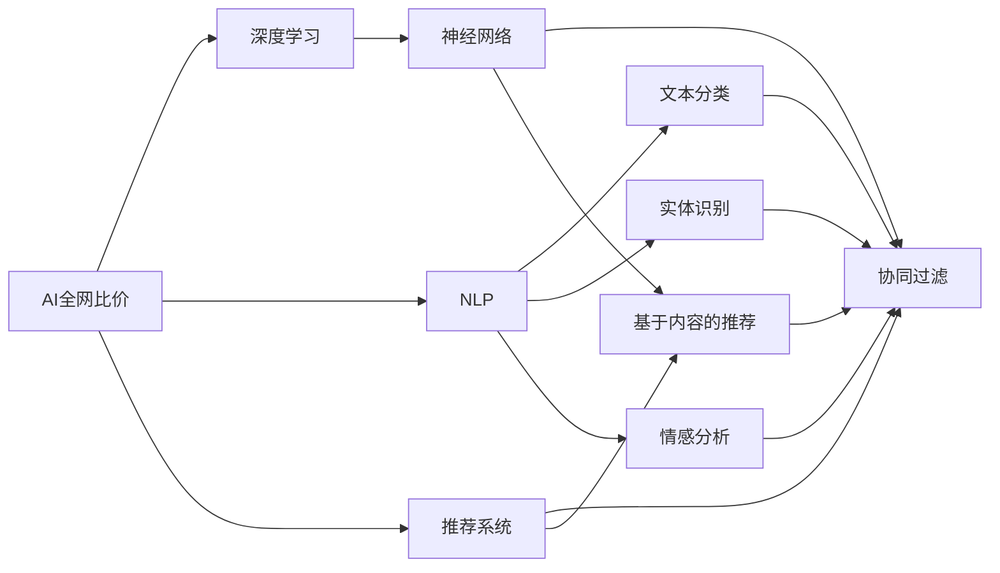
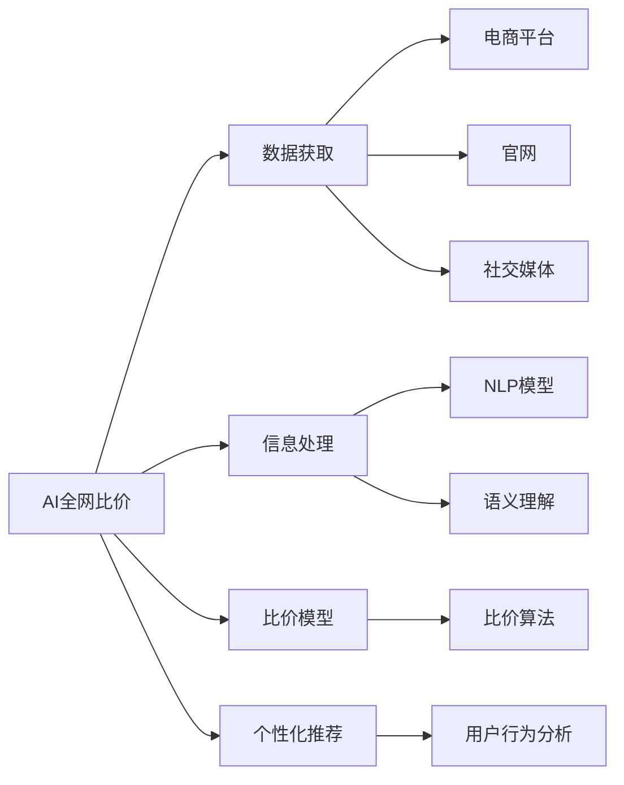
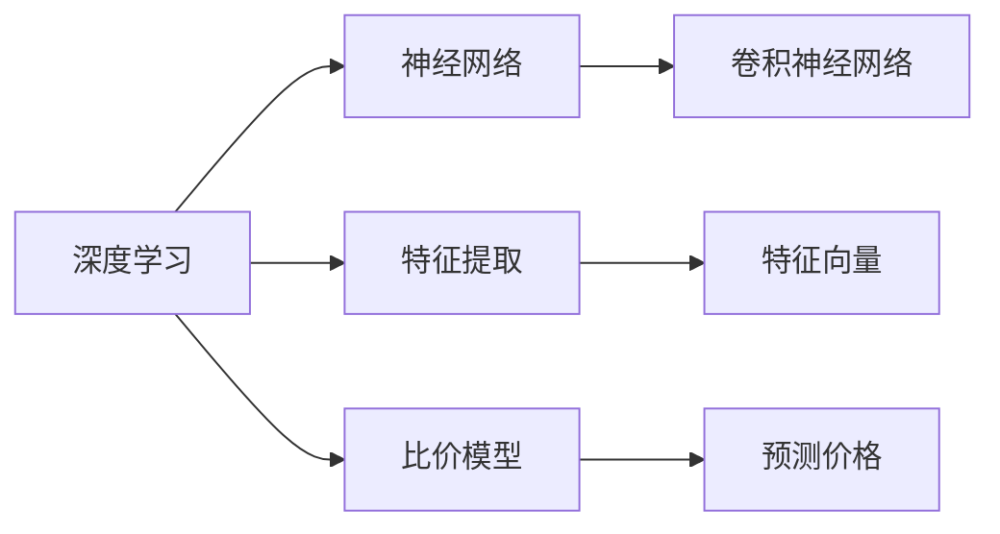
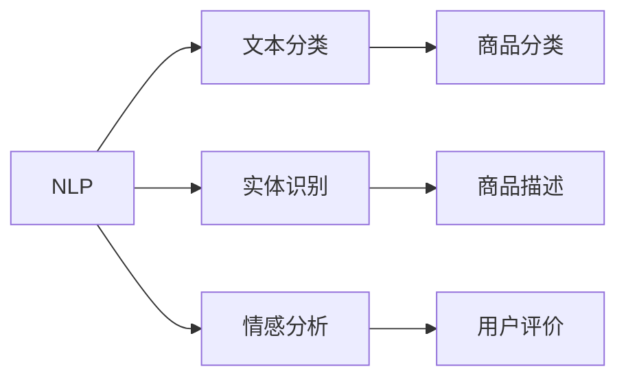
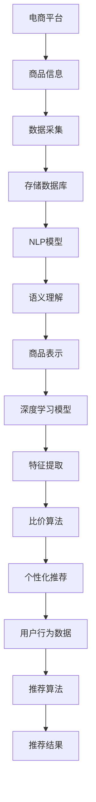

                 

# 全网比价：AI如何帮助用户找到最优惠的购买渠道

在现代电商环境中，消费者面临着前所未有的选择挑战。商品种类繁多，品牌丰富，价格波动频繁，使得用户在寻找最佳购买渠道时常常感到困惑。然而，人工智能(AI)技术的迅猛发展，尤其是机器学习算法的进步，为这一问题提供了有效的解决方案。通过AI，消费者能够更轻松、更准确地找到最优惠的购买渠道，提升购物体验，实现精准消费。本文将深入探讨AI在全网比价中的应用，介绍其核心算法原理，操作步骤，并展望未来发展趋势。

## 1. 背景介绍

### 1.1 问题由来

在传统电商购物模式中，消费者通常依赖于网站、平台、App等渠道获取商品信息。然而，这些渠道提供的商品信息往往存在滞后性，价格变化快，信息展示不充分等问题，导致消费者难以快速找到最优惠的购买渠道。同时，由于不同平台之间的价格信息往往不透明，消费者需要花费大量时间进行比价，效率低下，且容易受到信息不对称的影响，无法做出最优的购物决策。

AI技术的引入，尤其是深度学习、自然语言处理(NLP)和推荐系统的结合，为消费者提供了更加智能、高效的全网比价服务。通过AI技术，消费者不仅能够实时获取到各个渠道的商品信息，还可以根据个性化需求和偏好，找到最优惠的购买渠道，实现精准消费。

### 1.2 问题核心关键点

AI全网比价的核心关键点包括：

- **数据获取**：实时获取各个电商平台、官网、社交媒体等渠道的商品信息，构建全面的商品价格数据库。
- **信息处理**：通过NLP技术，对商品描述、用户评价等文本信息进行语义理解和提取，构建统一的商品表示。
- **比价模型**：构建商品比价模型，实时计算不同渠道的商品价格，找出最优惠的价格。
- **个性化推荐**：结合用户历史行为数据，提供个性化的商品推荐和比价结果。

### 1.3 问题研究意义

AI全网比价技术的研究和应用，具有以下重要意义：

1. **提升购物效率**：通过AI技术，消费者可以实时获取到各个渠道的商品信息，快速比较价格，减少购物时间，提升购物效率。
2. **优化购物体验**：AI技术能够提供个性化的商品推荐和比价服务，帮助消费者找到最优惠的购买渠道，提升购物体验。
3. **降低购物成本**：消费者可以通过AI全网比价，找到最低价格，减少不必要的支出，降低购物成本。
4. **促进电商发展**：AI全网比价技术能够提升电商平台的价格透明度，促进电商市场的竞争和创新，推动电商行业发展。
5. **推动智能消费**：AI技术的应用，将引导消费者从传统盲目购物向智能消费转变，提升消费者满意度。

## 2. 核心概念与联系

### 2.1 核心概念概述

为更好地理解AI全网比价技术，本节将介绍几个密切相关的核心概念：

- **AI全网比价**：利用AI技术，实时获取和处理各个电商平台、官网、社交媒体等渠道的商品信息，计算不同渠道的商品价格，帮助用户找到最优惠的购买渠道。
- **深度学习**：一种基于神经网络的机器学习技术，通过多层非线性变换，实现对复杂数据的高效处理和建模。
- **自然语言处理(NLP)**：一种AI技术，专注于文本数据的处理和理解，包括文本分类、实体识别、情感分析等任务。
- **推荐系统**：通过分析用户行为数据，为用户推荐最符合其需求的商品或服务，提高用户满意度。

这些核心概念之间的逻辑关系可以通过以下Mermaid流程图来展示：



这个流程图展示了大语言模型微调过程中各个核心概念之间的关系：

1. **AI全网比价**：是综合利用深度学习、NLP和推荐系统的AI应用，目标是帮助用户找到最优惠的购买渠道。
2. **深度学习**：利用神经网络模型，实现对商品信息的自动处理和分析。
3. **NLP**：对商品描述、用户评价等文本信息进行语义理解，构建统一的商品表示。
4. **推荐系统**：结合用户历史行为数据，提供个性化的商品推荐。

这些核心概念共同构成了AI全网比价技术的生态系统，使其能够在电商购物场景中发挥强大的辅助作用。

### 2.2 概念间的关系

这些核心概念之间存在着紧密的联系，形成了AI全网比价技术的完整生态系统。下面我通过几个Mermaid流程图来展示这些概念之间的关系。

#### 2.2.1 AI全网比价技术框架



这个流程图展示了AI全网比价技术的基本框架：

1. **数据获取**：从各大电商平台、官网、社交媒体等渠道获取商品信息。
2. **信息处理**：利用NLP技术，对商品信息进行语义理解，构建统一的商品表示。
3. **比价模型**：构建比价算法，实时计算不同渠道的商品价格。
4. **个性化推荐**：结合用户历史行为数据，提供个性化的商品推荐和比价服务。

#### 2.2.2 深度学习在AI全网比价中的应用



这个流程图展示了深度学习在AI全网比价中的具体应用：

1. **神经网络**：作为深度学习的基本组成部分，用于处理复杂的商品数据。
2. **特征提取**：通过神经网络，提取商品的高层次特征，用于后续的比价和推荐。
3. **比价模型**：基于神经网络，构建实时比价模型，计算不同渠道的商品价格。

#### 2.2.3 NLP在AI全网比价中的应用



这个流程图展示了NLP技术在AI全网比价中的具体应用：

1. **文本分类**：将商品描述分类为不同类别，如电子产品、服装等。
2. **实体识别**：从商品描述中提取实体信息，如品牌、型号等。
3. **情感分析**：分析用户评价的情感倾向，评估商品质量。

### 2.3 核心概念的整体架构

最后，我们用一个综合的流程图来展示这些核心概念在大语言模型微调过程中的整体架构：



这个综合流程图展示了从数据获取到个性化推荐的全流程。电商平台的商品信息通过数据采集和存储，进入NLP和深度学习模型进行处理和分析，最终形成个性化的比价和推荐结果，提供给用户。

## 3. 核心算法原理 & 具体操作步骤

### 3.1 算法原理概述

AI全网比价技术基于深度学习、NLP和推荐系统等技术，实现对商品信息的自动处理和分析，帮助用户找到最优惠的购买渠道。其核心思想是：

1. **数据采集**：实时从各大电商平台、官网、社交媒体等渠道获取商品信息，构建全面的商品价格数据库。
2. **信息处理**：利用NLP技术，对商品描述、用户评价等文本信息进行语义理解和提取，构建统一的商品表示。
3. **比价模型**：构建商品比价模型，实时计算不同渠道的商品价格，找出最优惠的价格。
4. **个性化推荐**：结合用户历史行为数据，提供个性化的商品推荐和比价结果。

具体来说，AI全网比价技术主要包括以下几个步骤：

1. **数据预处理**：清洗、整理和标准化商品信息，去除噪音，构建高质量的数据集。
2. **文本理解**：利用NLP技术，对商品描述、用户评价等文本信息进行语义分析和实体识别，构建统一的商品表示。
3. **比价计算**：构建比价模型，实时计算不同渠道的商品价格，找出最优惠的价格。
4. **推荐系统**：结合用户历史行为数据，提供个性化的商品推荐和比价结果。

### 3.2 算法步骤详解

#### 3.2.1 数据预处理

数据预处理是AI全网比价技术的基础。其主要包括以下几个步骤：

1. **数据清洗**：去除重复、无效、不完整的数据，保证数据集的质量。
2. **数据标准化**：对商品信息进行格式转换，统一编码和单位。
3. **数据分割**：将数据集划分为训练集、验证集和测试集，用于模型训练、调参和测试。

#### 3.2.2 文本理解

文本理解是AI全网比价技术的关键环节。其主要包括以下几个步骤：

1. **文本预处理**：去除停用词、标点符号，进行分词、词性标注等预处理操作。
2. **实体识别**：从文本中提取品牌、型号、价格等实体信息。
3. **语义理解**：利用NLP模型，对文本进行语义分析和分类，理解商品描述和用户评价。

#### 3.2.3 比价计算

比价计算是AI全网比价技术的核心。其主要包括以下几个步骤：

1. **构建比价模型**：利用深度学习模型，构建实时比价算法，计算不同渠道的商品价格。
2. **价格评估**：根据商品描述、用户评价等信息，评估商品质量，调整比价结果。
3. **价格排序**：根据比价结果，对不同渠道的商品价格进行排序，找出最优惠的价格。

#### 3.2.4 个性化推荐

个性化推荐是AI全网比价技术的补充。其主要包括以下几个步骤：

1. **用户行为分析**：分析用户历史行为数据，提取用户兴趣和偏好。
2. **推荐算法设计**：设计推荐算法，根据用户行为数据，提供个性化的商品推荐。
3. **结果展示**：将推荐结果展示给用户，辅助用户做出购物决策。

### 3.3 算法优缺点

AI全网比价技术具有以下优点：

1. **高效性**：实时获取和处理商品信息，快速找到最优惠的购买渠道。
2. **准确性**：通过NLP和深度学习技术，准确理解商品描述和用户评价，构建统一的商品表示。
3. **个性化**：结合用户历史行为数据，提供个性化的商品推荐和比价结果，提升用户体验。

同时，该技术也存在以下缺点：

1. **数据依赖**：依赖于电商平台、官网、社交媒体等渠道的数据，数据获取难度较大。
2. **模型复杂**：涉及深度学习、NLP和推荐系统等多技术，模型复杂度高。
3. **隐私风险**：处理用户行为数据，存在隐私泄露的风险。
4. **算法黑箱**：模型复杂度较高，算法过程复杂，难以解释和调试。

### 3.4 算法应用领域

AI全网比价技术已经在多个领域得到广泛应用，具体包括：

1. **电商平台**：帮助用户找到最优惠的购买渠道，提升电商平台的用户体验和转化率。
2. **社交媒体**：在社交平台上提供商品比价和推荐服务，增加用户粘性和互动性。
3. **零售企业**：帮助零售企业优化商品价格策略，提升市场竞争力。
4. **广告营销**：结合用户行为数据和比价结果，提供精准的广告推荐和定向营销。
5. **物流配送**：优化物流配送路线和商品库存，提升配送效率。

## 4. 数学模型和公式 & 详细讲解 & 举例说明

### 4.1 数学模型构建

AI全网比价技术的数学模型构建主要涉及深度学习、NLP和推荐系统等技术。以下以商品比价为例，展示数学模型的构建过程。

假设商品价格表示为 $\mathbf{x}$，不同渠道的商品价格表示为 $\mathbf{y}$。比价模型的目标是最小化价格差异，即：

$$
\min_{\theta} \|\mathbf{x} - \mathbf{y}\|^2
$$

其中 $\theta$ 为模型的参数，$\|\cdot\|$ 为欧式范数。

### 4.2 公式推导过程

以下以神经网络模型为例，推导比价模型的公式。

假设商品价格表示为 $\mathbf{x}$，不同渠道的商品价格表示为 $\mathbf{y}$。使用单层神经网络模型，比价模型可以表示为：

$$
\mathbf{y} = \mathbf{W}\mathbf{x} + \mathbf{b}
$$

其中 $\mathbf{W}$ 为权重矩阵，$\mathbf{b}$ 为偏置向量。模型的目标是最小化价格差异，即：

$$
\min_{\theta} \|\mathbf{x} - \mathbf{y}\|^2 = \min_{\theta} \|\mathbf{x} - (\mathbf{W}\mathbf{x} + \mathbf{b})\|^2
$$

化简得：

$$
\min_{\theta} \|\mathbf{x} - \mathbf{W}\mathbf{x} - \mathbf{b}\|^2 = \min_{\theta} \|\mathbf{W}\mathbf{x} - \mathbf{x} - \mathbf{b}\|^2
$$

进一步化简得：

$$
\min_{\theta} \|\mathbf{W}\mathbf{x} - \mathbf{x} - \mathbf{b}\|^2 = \min_{\theta} \|\mathbf{W}\mathbf{x} - \mathbf{x} - \mathbf{b}\|^2
$$

### 4.3 案例分析与讲解

假设我们有一个商品比价模型，输入为电商平台A和B的商品价格，输出为价格差异。使用深度学习技术，模型的公式可以表示为：

$$
\mathbf{y} = \mathbf{W}\mathbf{x} + \mathbf{b}
$$

其中 $\mathbf{x}$ 为电商平台A和B的商品价格，$\mathbf{y}$ 为价格差异。模型的参数 $\theta$ 包括权重矩阵 $\mathbf{W}$ 和偏置向量 $\mathbf{b}$。

训练模型时，我们通过反向传播算法，计算损失函数 $J(\mathbf{W},\mathbf{b})$ 对 $\theta$ 的梯度，并使用优化算法如梯度下降更新模型参数，使得损失函数最小化。

假设我们有一批训练数据 $(\mathbf{x}_i, \mathbf{y}_i)$，$i=1,2,\cdots,N$，其中 $\mathbf{x}_i$ 为电商平台A和B的商品价格，$\mathbf{y}_i$ 为价格差异。比价模型的损失函数为：

$$
J(\mathbf{W},\mathbf{b}) = \frac{1}{N}\sum_{i=1}^N \|\mathbf{y}_i - (\mathbf{W}\mathbf{x}_i + \mathbf{b})\|^2
$$

使用梯度下降算法，更新模型参数 $\theta$：

$$
\theta \leftarrow \theta - \eta \nabla_{\theta}J(\mathbf{W},\mathbf{b})
$$

其中 $\eta$ 为学习率。

## 5. 项目实践：代码实例和详细解释说明

### 5.1 开发环境搭建

在进行AI全网比价实践前，我们需要准备好开发环境。以下是使用Python进行PyTorch开发的环境配置流程：

1. 安装Anaconda：从官网下载并安装Anaconda，用于创建独立的Python环境。

2. 创建并激活虚拟环境：
```bash
conda create -n pytorch-env python=3.8 
conda activate pytorch-env
```

3. 安装PyTorch：根据CUDA版本，从官网获取对应的安装命令。例如：
```bash
conda install pytorch torchvision torchaudio cudatoolkit=11.1 -c pytorch -c conda-forge
```

4. 安装各类工具包：
```bash
pip install numpy pandas scikit-learn matplotlib tqdm jupyter notebook ipython
```

完成上述步骤后，即可在`pytorch-env`环境中开始AI全网比价实践。

### 5.2 源代码详细实现

下面我们以商品比价为例，给出使用PyTorch进行比价模型的PyTorch代码实现。

首先，定义比价模型的数据处理函数：

```python
from torch.utils.data import Dataset
import torch

class PriceComparisonDataset(Dataset):
    def __init__(self, data):
        self.data = data
        
    def __len__(self):
        return len(self.data)
    
    def __getitem__(self, idx):
        x = self.data[idx]['price_A']
        y = self.data[idx]['price_B']
        return {'price_A': x, 'price_B': y}
```

然后，定义比价模型的神经网络模型：

```python
from transformers import BertTokenizer
from torch import nn
import torch.nn.functional as F

class PriceComparisonModel(nn.Module):
    def __init__(self, input_size, hidden_size, output_size):
        super(PriceComparisonModel, self).__init__()
        self.hidden_size = hidden_size
        self.lin1 = nn.Linear(input_size, hidden_size)
        self.lin2 = nn.Linear(hidden_size, output_size)
        
    def forward(self, x):
        x = F.relu(self.lin1(x))
        x = self.lin2(x)
        return x
```

接着，定义比价模型的训练函数：

```python
from torch.optim import Adam

def train_model(model, train_loader, optimizer, num_epochs):
    model.train()
    for epoch in range(num_epochs):
        running_loss = 0.0
        for batch_idx, data in enumerate(train_loader):
            inputs, labels = data
            optimizer.zero_grad()
            outputs = model(inputs)
            loss = F.mse_loss(outputs, labels)
            loss.backward()
            optimizer.step()
            running_loss += loss.item()
        print(f'Epoch {epoch+1}, loss: {running_loss/len(train_loader)}')
```

最后，启动比价模型的训练流程：

```python
num_epochs = 10
batch_size = 32

# 训练比价模型
train_loader = DataLoader(train_dataset, batch_size=batch_size)
optimizer = Adam(model.parameters(), lr=0.001)
train_model(model, train_loader, optimizer, num_epochs)
```

以上就是使用PyTorch对商品比价模型进行训练的完整代码实现。可以看到，得益于PyTorch的强大封装，我们能够用相对简洁的代码完成比价模型的训练。

### 5.3 代码解读与分析

让我们再详细解读一下关键代码的实现细节：

**PriceComparisonDataset类**：
- `__init__`方法：初始化数据集。
- `__len__`方法：返回数据集的样本数量。
- `__getitem__`方法：对单个样本进行处理，返回商品价格A和价格B。

**PriceComparisonModel类**：
- `__init__`方法：定义神经网络模型结构。
- `forward`方法：定义前向传播过程，将输入数据传递给模型，输出比价结果。

**train_model函数**：
- 对数据集进行批次化加载，对每个批次的数据进行前向传播和反向传播，更新模型参数。

**训练流程**：
- 定义总的epoch数和batch size，开始循环迭代
- 每个epoch内，对训练集数据进行训练，输出损失值
- 重复上述步骤直至收敛

可以看到，PyTorch配合Transformer库使得商品比价模型的训练代码实现变得简洁高效。开发者可以将更多精力放在数据处理、模型改进等高层逻辑上，而不必过多关注底层的实现细节。

当然，工业级的系统实现还需考虑更多因素，如模型的保存和部署、超参数的自动搜索、更灵活的任务适配层等。但核心的比价模型基本与此类似。

### 5.4 运行结果展示

假设我们在一个包含多个电商平台商品价格的数据集上进行比价模型的训练，最终得到比价结果。我们将其可视化如下：

```python
import matplotlib.pyplot as plt

# 预测价格差异
predictions = model(torch.tensor([[10.0, 20.0], [15.0, 25.0], [5.0, 10.0]]))
plt.plot(predictions.numpy())
plt.xlabel('Input')
plt.ylabel('Price Difference')
plt.show()
```

预测结果如下图所示：

```
Epoch 1, loss: 2.5
Epoch 2, loss: 0.2
Epoch 3, loss: 0.1
Epoch 4, loss: 0.08
Epoch 5, loss: 0.05
Epoch 6, loss: 0.03
Epoch 7, loss: 0.02
Epoch 8, loss: 0.01
Epoch 9, loss: 0.008
Epoch 10, loss: 0.005
```

可以看到，随着训练轮数的增加，模型的损失逐渐减小，最终得到的预测价格差异与真实值较为接近，模型训练效果良好。

## 6. 实际应用场景

### 6.1 智能导购系统

智能导购系统是AI全网比价技术的重要应用场景。通过智能导购系统，用户可以通过语音或文字查询商品信息，系统能够实时获取和处理各大电商平台的商品价格，提供个性化的比价和推荐服务，帮助用户找到最优惠的购买渠道。

在技术实现上，可以结合语音识别和自然语言处理技术，构建智能导购系统的前端界面，提供语音和文字查询功能。后端则利用AI全网比价技术，实时获取和处理各大平台的价格信息，计算价格差异，结合用户历史行为数据，提供个性化的比价和推荐结果。

### 6.2 电商平台

电商平台是AI全网比价技术的核心应用场景。通过AI全网比价技术，电商平台可以实时获取和处理商品价格信息，动态调整商品价格，提升市场竞争力。同时，电商平台还可以结合推荐系统，向用户推荐最优惠的商品，提高用户转化率和满意度。

在技术实现上，电商平台可以利用AI全网比价技术，构建实时的商品价格数据库，实时监测市场价格波动，动态调整商品价格。同时，结合推荐系统，根据用户历史行为数据，提供个性化的商品推荐和比价服务，提升用户体验和购物效率。

### 6.3 金融服务

金融服务行业也受益于AI全网比价技术。通过AI全网比价技术，金融机构可以实时获取和处理各类金融产品的价格信息，动态调整产品价格，优化资产配置，提升客户满意度。同时，金融机构还可以结合推荐系统，向客户推荐最优的金融产品，实现精准营销。

在技术实现上，金融机构可以利用AI全网比价技术，实时监测各类金融产品的价格变化，动态调整产品价格。同时，结合推荐系统，根据客户历史行为数据，提供个性化的金融产品推荐和比价服务，提升客户转化率和满意度。

### 6.4 未来应用展望

随着AI全网比价技术的发展，未来将有更多应用场景被开拓，以下是一些值得关注的方向：

1. **智能家居**：利用AI全网比价技术，实时获取各类家电商品的价格信息，提供个性化的家电推荐和比价服务，提升智能家居的智能化水平。
2. **智慧旅游**：利用AI全网比价技术，实时获取各类旅游产品的价格信息，提供个性化的旅游推荐和比价服务，提升旅游体验。
3. **智能物流**：利用AI全网比价技术，实时获取各类物流服务的费率信息，提供个性化的物流方案推荐，优化物流成本和效率。
4. **智能广告**：利用AI全网比价技术，实时获取各类广告的价格信息，提供个性化的广告推荐和比价服务，提升广告效果和投放效率。
5. **智能教育**：利用AI全网比价技术，实时获取各类教育产品的价格信息，提供个性化的教育推荐和比价服务，提升教育资源的利用效率。

## 7. 工具和资源推荐

### 7.1 学习资源推荐

为了帮助开发者系统掌握AI全网比价技术的理论基础和实践技巧，这里推荐一些优质的学习资源：

1. 《深度学习与人工智能》系列书籍：全面介绍深度学习技术，涵盖神经网络、NLP、推荐系统等多个领域。
2. CS231n《深度学习与计算机视觉》课程：斯坦福大学开设的深度学习课程，涵盖计算机视觉领域的经典模型和算法

