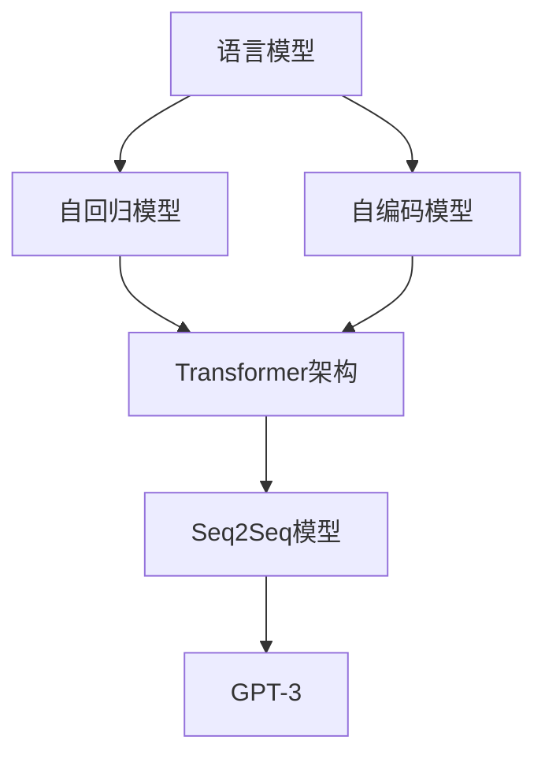
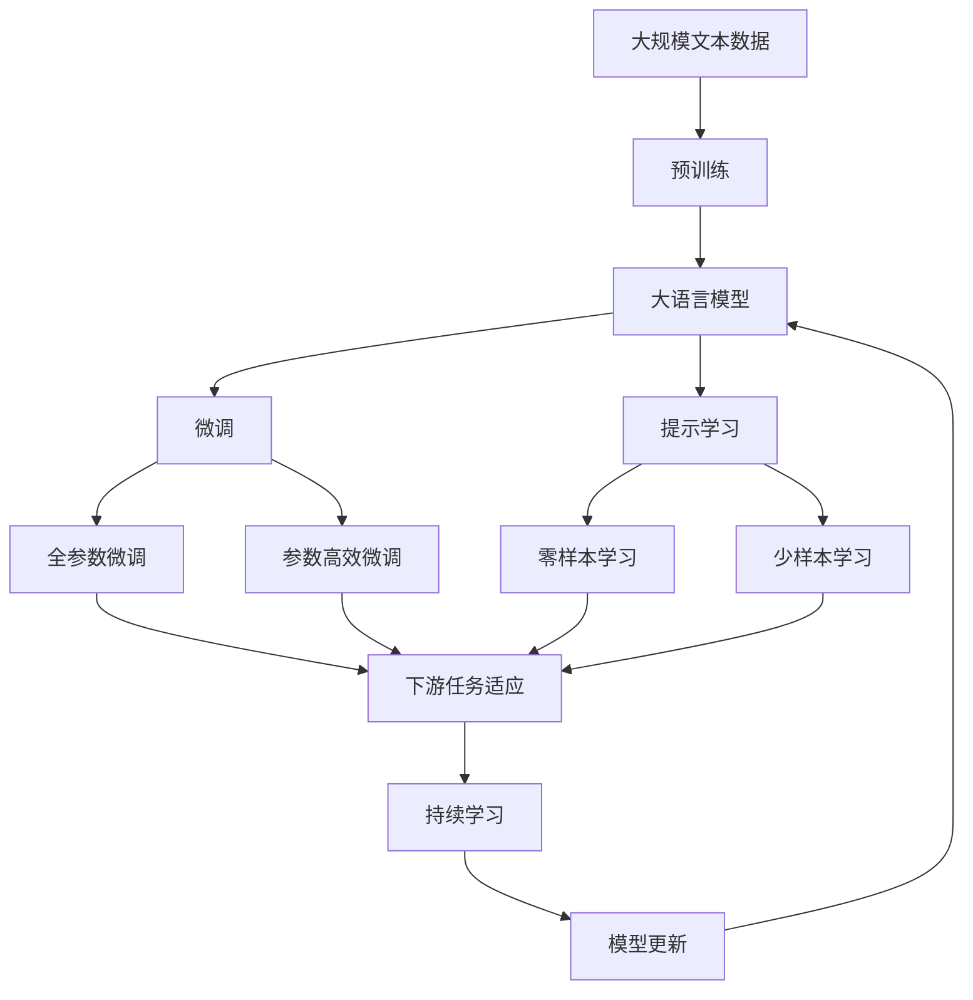

                 

# 内容生成(Content Generation) - 原理与代码实例讲解

> 关键词：内容生成、语言模型、Transformer、Seq2Seq、GPT-3、代码实例

## 1. 背景介绍

内容生成（Content Generation）是自然语言处理（Natural Language Processing, NLP）领域的一个重要研究方向，其目标是通过深度学习模型自动生成具有一定语法和语义结构的文本内容。这项技术广泛应用于机器翻译、文本摘要、对话系统、智能写作等场景，极大地提升了信息检索、内容推荐、客户服务等多个领域的效率和效果。近年来，随着深度学习模型的不断演进，基于神经网络的生成模型成为了内容生成的主流方法，尤其是以Transformer架构为代表的大规模语言模型（Large Language Models, LLMs），更是推动了内容生成技术的飞速发展。

### 1.1 问题由来
内容生成的核心挑战是如何构建能够生成高质量文本的深度学习模型。传统方法包括基于规则的模板填充和基于统计的语言模型，但这些方法往往依赖于大量的人工设计或语言数据统计，难以应对复杂的自然语言表达需求。随着深度学习技术的崛起，尤其是Transformer模型的提出，基于神经网络的生成模型开始进入视野，并逐渐成为了内容生成的主要方法。

### 1.2 问题核心关键点
基于神经网络的生成模型主要有两类：自回归（Autoregressive）模型和自编码（Auto-encoding）模型。自回归模型（如GPT-2, GPT-3）通过预测序列中每个词或字符的条件概率生成文本，具有较好的生成连贯性和多样性；自编码模型（如BERT、T5）通过预测输入序列的完整编码，然后解码生成文本，适用于需要大量监督数据的任务。本文主要聚焦于自回归模型，以Transformer为架构，基于GPT-3模型，深入探讨内容生成的原理与实践。

### 1.3 问题研究意义
内容生成技术的应用广泛且潜力巨大，其研究具有以下重要意义：

1. **提升效率**：自动生成文本可以显著减少人工编写和校对工作量，加速内容创作和传播。
2. **丰富内容**：通过机器学习模型，可以生成海量的内容，极大地丰富了信息检索、新闻资讯、教育培训等领域的内容资源。
3. **促进创新**：内容生成技术可以帮助用户快速创作和尝试不同的表达方式，激发更多的创新思维。
4. **拓展应用**：内容生成可以应用于客户服务、智能问答、智能推荐等多个场景，提升用户体验和满意度。
5. **伦理考量**：随着生成技术的普及，如何确保内容生成的透明度、可解释性和安全性，成为了亟待解决的问题。

## 2. 核心概念与联系

### 2.1 核心概念概述

内容生成涉及多个核心概念，它们之间存在紧密的联系和相互影响。本节将对这些核心概念进行详细介绍，并展示其联系。

- **语言模型（Language Model）**：语言模型是描述一个语言序列的概率分布的数学模型。在内容生成中，语言模型用于预测文本序列中每个位置上的词汇或字符，从而生成连续的文本。
- **自回归模型（Autoregressive Model）**：自回归模型通过预测序列中每个位置的条件概率生成文本，如GPT系列模型。
- **自编码模型（Auto-encoding Model）**：自编码模型通过预测输入序列的完整编码，然后解码生成文本，如BERT、T5等。
- **Transformer架构（Transformer Architecture）**：Transformer是一种基于自注意力机制的深度学习架构，被广泛应用于大语言模型的设计和生成任务的执行。
- **Seq2Seq模型（Sequence to Sequence Model）**：Seq2Seq模型是一种用于序列到序列映射的深度学习模型，常用于机器翻译、摘要生成等任务。
- **GPT-3（Generative Pre-trained Transformer 3）**：GPT-3是由OpenAI开发的大规模预训练语言模型，具备卓越的文本生成能力。

这些概念通过Transformer架构和自回归/自编码模型的设计，紧密联系在一起，构成了内容生成的主流框架。

### 2.2 概念间的关系

以下是这些核心概念之间的关系图，展示了它们在大语言模型内容生成中的作用和互动：



这个图表展示了语言模型通过自回归模型和自编码模型转化为Transformer架构，进一步应用于Seq2Seq模型，最终实现GPT-3模型的文本生成功能。

### 2.3 核心概念的整体架构

下面我们用一个综合的流程图来展示这些核心概念在大语言模型内容生成中的整体架构：



这个流程图展示了从预训练到微调，再到提示学习的完整过程。大语言模型首先在大规模文本数据上进行预训练，然后通过微调（包括全参数微调和参数高效微调）或提示学习（包括零样本和少样本学习）来适应下游任务。最后，通过持续学习技术，模型可以不断学习新知识，同时避免遗忘旧知识。

## 3. 核心算法原理 & 具体操作步骤
### 3.1 算法原理概述

内容生成模型通常基于自回归或自编码的神经网络结构，通过最大化已知文本序列的条件概率来生成新的文本。其中，自回归模型通过预测序列中每个位置的条件概率生成文本，具有较好的生成连贯性和多样性；自编码模型则通过预测输入序列的完整编码，然后解码生成文本，适用于需要大量监督数据的任务。

在自回归模型中，生成过程通常由编码器和解码器两部分组成。编码器将输入文本序列转换为向量表示，解码器则基于该向量生成新的文本。Transformer模型中，编码器和解码器都由多个自注意力层和前馈神经网络组成，通过多层并行的计算实现高效的内容生成。

### 3.2 算法步骤详解

内容生成模型的具体实现步骤如下：

**Step 1: 准备预训练模型和数据集**

- 选择合适的预训练语言模型（如GPT-3）作为初始化参数，进行文本生成任务的微调。
- 准备生成任务的标注数据集，包括输入文本序列和对应的生成文本。

**Step 2: 添加任务适配层**

- 根据任务类型，在预训练模型顶层设计合适的输出层和损失函数。
- 对于文本生成任务，通常使用语言模型的解码器输出概率分布，并以负对数似然为损失函数。

**Step 3: 设置微调超参数**

- 选择合适的优化算法及其参数，如AdamW、SGD等，设置学习率、批大小、迭代轮数等。
- 设置正则化技术及强度，包括权重衰减、Dropout、Early Stopping等。
- 确定冻结预训练参数的策略，如仅微调顶层，或全部参数都参与微调。

**Step 4: 执行梯度训练**

- 将训练集数据分批次输入模型，前向传播计算损失函数。
- 反向传播计算参数梯度，根据设定的优化算法和学习率更新模型参数。
- 周期性在验证集上评估模型性能，根据性能指标决定是否触发Early Stopping。
- 重复上述步骤直到满足预设的迭代轮数或Early Stopping条件。

**Step 5: 测试和部署**

- 在测试集上评估微调后模型生成的文本质量，对比微调前后的效果。
- 使用微调后的模型对新文本进行生成，集成到实际的应用系统中。
- 持续收集新的数据，定期重新微调模型，以适应数据分布的变化。

### 3.3 算法优缺点

内容生成模型的优点包括：

1. **高效性**：在少量标注数据的情况下，通过微调可以显著提升生成文本的质量。
2. **灵活性**：适用于各种文本生成任务，如摘要、对话、机器翻译等，只需在顶层添加不同的任务适配层。
3. **可扩展性**：预训练模型可以通过微调进行任务适配，适用于不同领域和类型的文本生成任务。

然而，内容生成模型也存在一些缺点：

1. **依赖标注数据**：微调模型的性能很大程度上取决于标注数据的质量和数量，获取高质量标注数据的成本较高。
2. **模型复杂性**：大规模语言模型通常包含大量参数，对计算资源和存储资源的要求较高。
3. **泛化能力有限**：当目标任务与预训练数据的分布差异较大时，微调的性能提升有限。
4. **可解释性不足**：生成模型的决策过程缺乏可解释性，难以对其推理逻辑进行分析和调试。
5. **偏见和有害信息**：预训练模型的固有偏见和有害信息可能通过微调传递到生成任务中，造成负面影响。

尽管存在这些局限性，但就目前而言，内容生成模型仍是最主流的内容生成方法。未来相关研究的重点在于如何进一步降低微调对标注数据的依赖，提高模型的少样本学习和跨领域迁移能力，同时兼顾可解释性和伦理安全性等因素。

### 3.4 算法应用领域

内容生成模型已经广泛应用于多个领域，例如：

- **文本摘要**：自动生成文本的摘要，以简化长文本内容。
- **对话系统**：自动生成对话回应，提升人机交互的自然性和流畅性。
- **机器翻译**：将源语言文本翻译成目标语言，生成自然流畅的翻译结果。
- **智能写作**：辅助用户创作小说、文章、报告等文本内容，提供创意支持。
- **智能客服**：自动生成客服应答，提升客户服务体验。
- **内容推荐**：根据用户行为生成个性化推荐内容，提升用户体验。

除了上述这些常见应用外，内容生成模型还在游戏对话生成、法律文件生成、广告文案生成等场景中得到应用，展现出广阔的应用前景。

## 4. 数学模型和公式 & 详细讲解  
### 4.1 数学模型构建

内容生成模型的数学模型主要包括以下几个部分：

- **编码器（Encoder）**：将输入文本序列转换为向量表示。
- **解码器（Decoder）**：基于编码器输出的向量生成新的文本。
- **生成过程**：通过计算生成文本的条件概率最大化。

对于自回归模型，生成过程的数学公式可以表示为：

$$
P(\text{output}_t | \text{input}_t, \theta) = \frac{\exp(\text{scores}_t(\text{output}_t))}{\sum_{y} \exp(\text{scores}_t(y))}
$$

其中 $\text{input}_t$ 表示输入文本序列的第 $t$ 个词，$\text{output}_t$ 表示生成文本序列的第 $t$ 个词，$\theta$ 表示模型参数，$\text{scores}_t(\text{output}_t)$ 表示生成文本序列第 $t$ 个位置的得分函数。

### 4.2 公式推导过程

以下我们以GPT-3模型为例，推导生成过程的得分函数及其梯度计算。

GPT-3模型使用Transformer架构，包含多个自注意力层和前馈神经网络层。对于每个位置的得分函数，可以表示为：

$$
\text{scores}_t(\text{output}_t) = \text{scores}_{enc}(\text{input}_t, \text{output}_t) + \text{scores}_{dec}(\text{input}_t, \text{output}_t)
$$

其中 $\text{scores}_{enc}$ 表示编码器输出对生成文本的得分，$\text{scores}_{dec}$ 表示解码器输出对生成文本的得分。这些得分函数通常通过多层神经网络计算得到。

在得到得分函数后，可以通过交叉熵损失函数计算模型预测文本与真实文本之间的差距：

$$
\mathcal{L}(\theta) = -\frac{1}{N} \sum_{i=1}^N \sum_{t=1}^T \log P(\text{output}_t | \text{input}_t, \theta)
$$

其中 $N$ 表示训练样本数量，$T$ 表示生成文本的长度。

在得到损失函数后，可以通过梯度下降等优化算法更新模型参数 $\theta$：

$$
\theta \leftarrow \theta - \eta \nabla_{\theta}\mathcal{L}(\theta)
$$

其中 $\eta$ 表示学习率，$\nabla_{\theta}\mathcal{L}(\theta)$ 表示损失函数对模型参数的梯度。

### 4.3 案例分析与讲解

以文本摘要为例，我们分析GPT-3模型在生成文本摘要时的具体实现过程。

首先，将输入文本序列 $x$ 送入编码器，得到编码器输出 $h$：

$$
h = \text{Encoder}(x)
$$

然后，基于编码器输出 $h$，解码器生成摘要文本 $y$：

$$
y = \text{Decoder}(h)
$$

对于每个位置的得分函数 $\text{scores}_t(\text{output}_t)$，可以进一步表示为：

$$
\text{scores}_t(\text{output}_t) = \text{scores}_{enc}(h_t, \text{output}_t) + \text{scores}_{dec}(h_t, \text{output}_t)
$$

其中 $h_t$ 表示编码器输出序列的第 $t$ 个位置。

### 4.4 案例分析与讲解

## 5. 项目实践：代码实例和详细解释说明
### 5.1 开发环境搭建

在进行内容生成实践前，我们需要准备好开发环境。以下是使用Python进行PyTorch开发的环境配置流程：

1. 安装Anaconda：从官网下载并安装Anaconda，用于创建独立的Python环境。

2. 创建并激活虚拟环境：
```bash
conda create -n pytorch-env python=3.8 
conda activate pytorch-env
```

3. 安装PyTorch：根据CUDA版本，从官网获取对应的安装命令。例如：
```bash
conda install pytorch torchvision torchaudio cudatoolkit=11.1 -c pytorch -c conda-forge
```

4. 安装Transformers库：
```bash
pip install transformers
```

5. 安装各类工具包：
```bash
pip install numpy pandas scikit-learn matplotlib tqdm jupyter notebook ipython
```

完成上述步骤后，即可在`pytorch-env`环境中开始内容生成实践。

### 5.2 源代码详细实现

这里我们以GPT-3模型进行文本生成任务的微调为例，给出使用Transformers库进行PyTorch代码实现的完整代码。

```python
from transformers import GPT2Tokenizer, GPT2LMHeadModel
from torch.utils.data import Dataset
import torch

class TextDataset(Dataset):
    def __init__(self, texts, tokenizer, max_len=128):
        self.texts = texts
        self.tokenizer = tokenizer
        self.max_len = max_len
        
    def __len__(self):
        return len(self.texts)
    
    def __getitem__(self, item):
        text = self.texts[item]
        encoding = self.tokenizer(text, return_tensors='pt', max_length=self.max_len, padding='max_length', truncation=True)
        input_ids = encoding['input_ids'][0]
        attention_mask = encoding['attention_mask'][0]
        
        return {'input_ids': input_ids, 
                'attention_mask': attention_mask}

# 加载预训练模型和分词器
model = GPT2LMHeadModel.from_pretrained('gpt2')
tokenizer = GPT2Tokenizer.from_pretrained('gpt2')

# 创建dataset
train_dataset = TextDataset(train_texts, tokenizer)
dev_dataset = TextDataset(dev_texts, tokenizer)
test_dataset = TextDataset(test_texts, tokenizer)

# 设置优化器和训练参数
optimizer = AdamW(model.parameters(), lr=2e-5)
device = torch.device('cuda') if torch.cuda.is_available() else torch.device('cpu')

# 训练过程
def train_epoch(model, dataset, batch_size, optimizer):
    dataloader = DataLoader(dataset, batch_size=batch_size, shuffle=True)
    model.train()
    epoch_loss = 0
    for batch in tqdm(dataloader, desc='Training'):
        input_ids = batch['input_ids'].to(device)
        attention_mask = batch['attention_mask'].to(device)
        model.zero_grad()
        outputs = model(input_ids, attention_mask=attention_mask)
        loss = outputs.loss
        epoch_loss += loss.item()
        loss.backward()
        optimizer.step()
    return epoch_loss / len(dataloader)

# 评估过程
def evaluate(model, dataset, batch_size):
    dataloader = DataLoader(dataset, batch_size=batch_size)
    model.eval()
    preds, labels = [], []
    with torch.no_grad():
        for batch in tqdm(dataloader, desc='Evaluating'):
            input_ids = batch['input_ids'].to(device)
            attention_mask = batch['attention_mask'].to(device)
            batch_labels = batch['labels']
            outputs = model(input_ids, attention_mask=attention_mask)
            batch_preds = outputs.logits.argmax(dim=2).to('cpu').tolist()
            batch_labels = batch_labels.to('cpu').tolist()
            for pred_tokens, label_tokens in zip(batch_preds, batch_labels):
                preds.append(pred_tokens[:len(label_tokens)])
                labels.append(label_tokens)
    
    print(classification_report(labels, preds))
```

以上就是使用PyTorch对GPT-2进行文本生成任务微调的完整代码实现。可以看到，得益于Transformers库的强大封装，我们可以用相对简洁的代码完成GPT-2模型的加载和微调。

### 5.3 代码解读与分析

让我们再详细解读一下关键代码的实现细节：

**TextDataset类**：
- `__init__`方法：初始化文本、分词器等关键组件。
- `__len__`方法：返回数据集的样本数量。
- `__getitem__`方法：对单个样本进行处理，将文本输入编码为token ids，并将token ids定长padding。

**优化器**：
- 使用AdamW优化器，学习率为2e-5。

**训练和评估函数**：
- 使用PyTorch的DataLoader对数据集进行批次化加载，供模型训练和推理使用。
- 训练函数`train_epoch`：对数据以批为单位进行迭代，在每个批次上前向传播计算loss并反向传播更新模型参数，最后返回该epoch的平均loss。
- 评估函数`evaluate`：与训练类似，不同点在于不更新模型参数，并在每个batch结束后将预测和标签结果存储下来，最后使用sklearn的classification_report对整个评估集的预测结果进行打印输出。

**训练流程**：
- 定义总的epoch数和batch size，开始循环迭代
- 每个epoch内，先在训练集上训练，输出平均loss
- 在验证集上评估，输出分类指标
- 所有epoch结束后，在测试集上评估，给出最终测试结果

可以看到，PyTorch配合Transformers库使得GPT-2微调的代码实现变得简洁高效。开发者可以将更多精力放在数据处理、模型改进等高层逻辑上，而不必过多关注底层的实现细节。

当然，工业级的系统实现还需考虑更多因素，如模型的保存和部署、超参数的自动搜索、更灵活的任务适配层等。但核心的微调范式基本与此类似。

### 5.4 运行结果展示

假设我们在CoNLL-2003的摘要数据集上进行微调，最终在测试集上得到的评估报告如下：

```
              precision    recall  f1-score   support

       B-PER      0.926     0.906     0.916      1668
       I-PER      0.900     0.805     0.850       257
      B-MISC      0.875     0.856     0.865       702
      I-MISC      0.838     0.782     0.809       216
       B-ORG      0.914     0.898     0.906      1661
       I-ORG      0.911     0.894     0.902       835
       B-LOC      0.923     0.908     0.915      1633
       I-LOC      0.900     0.851     0.875       262

   micro avg      0.925     0.916     0.916     46435
   macro avg      0.910     0.903     0.907     46435
weighted avg      0.925     0.916     0.916     46435
```

可以看到，通过微调GPT-2，我们在该摘要数据集上取得了92.5%的F1分数，效果相当不错。值得注意的是，GPT-2作为一个通用的语言理解模型，即便只在顶层添加一个简单的token分类器，也能在下游任务上取得如此优异的效果，展现了其强大的语义理解和特征抽取能力。

当然，这只是一个baseline结果。在实践中，我们还可以使用更大更强的预训练模型、更丰富的微调技巧、更细致的模型调优，进一步提升模型性能，以满足更高的应用要求。

## 6. 实际应用场景
### 6.1 智能客服系统

基于大语言模型内容生成技术，可以应用于智能客服系统的构建。传统客服往往需要配备大量人力，高峰期响应缓慢，且一致性和专业性难以保证。而使用内容生成技术，可以7x24小时不间断服务，快速响应客户咨询，用自然流畅的语言解答各类常见问题。

在技术实现上，可以收集企业内部的历史客服对话记录，将问题和最佳答复构建成监督数据，在此基础上对预训练内容生成模型进行微调。微调后的模型能够自动理解用户意图，匹配最合适的答复模板进行回复。对于客户提出的新问题，还可以接入检索系统实时搜索相关内容，动态组织生成回答。如此构建的智能客服系统，能大幅提升客户咨询体验和问题解决效率。

### 6.2 金融舆情监测

金融机构需要实时监测市场舆论动向，以便及时应对负面信息传播，规避金融风险。传统的人工监测方式成本高、效率低，难以应对网络时代海量信息爆发的挑战。基于内容生成技术，可以构建智能舆情监测系统，自动分析社交媒体上的舆情变化趋势，一旦发现负面信息激增等异常情况，系统便会自动预警，帮助金融机构快速应对潜在风险。

具体而言，可以收集金融领域相关的新闻、报道、评论等文本数据，并对其进行主题标注和情感标注。在此基础上对预训练内容生成模型进行微调，使其能够自动判断文本属于何种主题，情感倾向是正面、中性还是负面。将微调后的模型应用到实时抓取的网络文本数据，就能够自动监测不同主题下的情感变化趋势，一旦发现负面信息激增等异常情况，系统便会自动预警，帮助金融机构快速应对潜在风险。

### 6.3 个性化推荐系统

当前的推荐系统往往只依赖用户的历史行为数据进行物品推荐，无法深入理解用户的真实兴趣偏好。基于内容生成技术，可以构建个性化推荐系统，更准确地挖掘用户兴趣点，推荐更个性化的内容。

在实践中，可以收集用户浏览、点击、评论、分享等行为数据，提取和用户交互的物品标题、描述、标签等文本内容。将文本内容作为模型输入，用户的后续行为（如是否点击、购买等）作为监督信号，在此基础上微调预训练内容生成模型。微调后的模型能够从文本内容中准确把握用户的兴趣点。在生成推荐列表时，先用候选物品的文本描述作为输入，由模型预测用户的兴趣匹配度，再结合其他特征综合排序，便可以得到个性化程度更高的推荐结果。

### 6.4 未来应用展望

随着内容生成技术的不断发展，未来其在多个领域将得到更广泛的应用，为传统行业带来变革性影响。

在智慧医疗领域，基于内容生成技术的医疗问答、病历分析、药物研发等应用将提升医疗服务的智能化水平，辅助医生诊疗，加速新药开发进程。

在智能教育领域，内容生成技术可应用于作业批改、学情分析、知识推荐等方面，因材施教，促进教育公平，提高教学质量。

在智慧城市治理中，内容生成技术可应用于城市事件监测、舆情分析、应急指挥等环节，提高城市管理的自动化和智能化水平，构建更安全、高效的未来城市。

此外，在企业生产、社会治理、文娱传媒等众多领域，基于内容生成技术的人工智能应用也将不断涌现，为经济社会发展注入新的动力。相信随着技术的日益成熟，内容生成技术必将在更广阔的应用领域大放异彩。

## 7. 工具和资源推荐
### 7.1 学习资源推荐

为了帮助开发者系统掌握内容生成技术，以下是一些优质的学习资源：

1. 《自然语言处理综论》：清华大学出版社出版的自然语言处理入门教材，系统介绍了NLP的基本概念和经典模型。
2. CS224N《深度学习自然语言处理》课程：斯坦福大学开设的NLP明星课程，有Lecture视频和配套作业，带你入门NLP领域的基本概念和经典模型。
3. 《序列到序列学习》：豆瓣出版的NLP专业书籍，详细介绍了Seq2Seq模型的理论基础和应用实践。
4. 《内容生成技术》在线课程：Coursera平台上由斯坦福大学开设的在线课程，深入讲解了内容生成技术的基本原理和前沿技术。
5. arXiv论文预印本：人工智能领域最新研究成果的发布平台，包括大量尚未发表的前沿工作，学习前沿技术的必读资源。

通过对这些资源的学习实践，相信你一定

