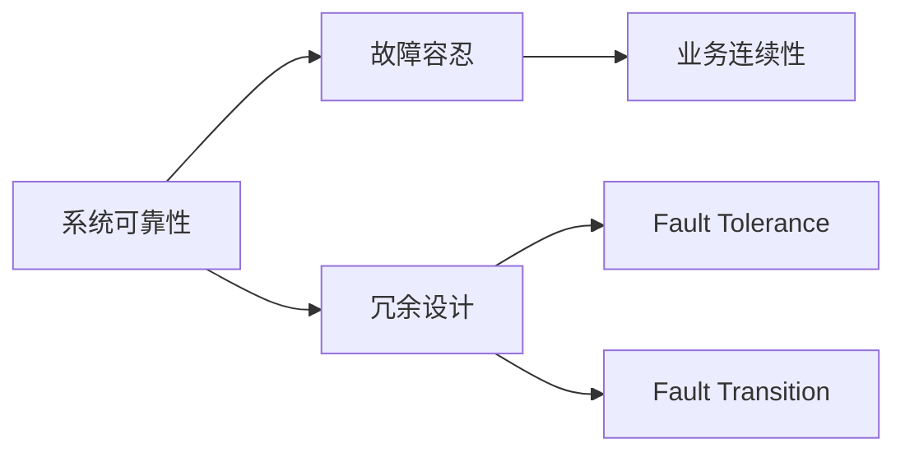
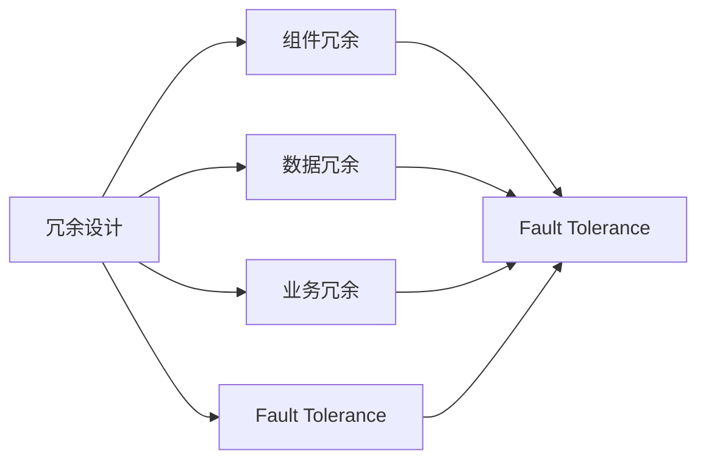
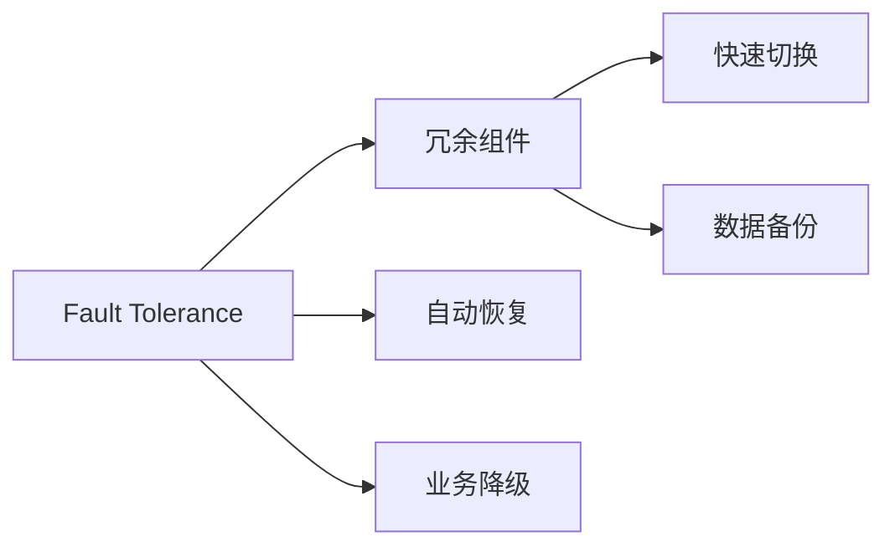
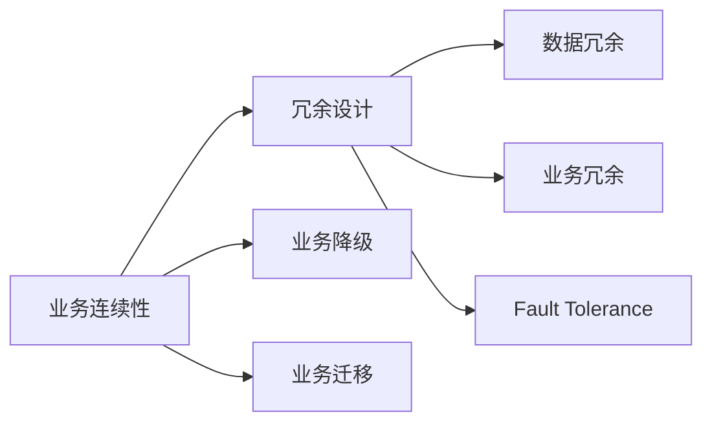
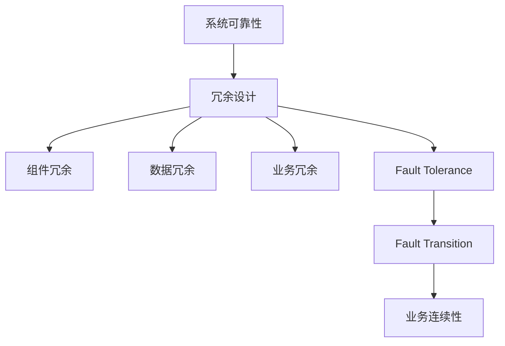

                 

# 冗余设计在实际系统中的应用

> 关键词：冗余设计,系统可靠性,故障容忍,故障转移,业务连续性

## 1. 背景介绍

### 1.1 问题由来
随着现代技术的飞速发展和业务需求的日益增长，系统复杂度不断提升，而系统故障和异常事件的发生频率也在不断上升。一个系统的故障不仅会造成巨大的经济损失，还会导致业务停摆，严重影响用户的使用体验和品牌形象。因此，如何构建可靠的系统，减少故障发生，增强系统的连续性和稳定性，成为企业和组织关注的重点。

冗余设计是一种通过增加系统组件和资源，保证系统在部分组件发生故障时仍能正常运行的技术手段。通过合理设计冗余系统，可以有效提升系统的可靠性和业务连续性，降低故障带来的风险和损失。

### 1.2 问题核心关键点
冗余设计在实际系统中的应用，核心在于以下几个关键点：

- **组件冗余**：通过增加硬件或软件组件的数量，形成冗余配置，保证某个组件故障时其他组件能正常工作。
- **数据冗余**：通过复制和备份数据，保证数据丢失或损坏时能够快速恢复，防止业务中断。
- **业务冗余**：通过设计多中心、多路径等方式，保证业务在不同地点的分布，避免单点故障导致的业务停摆。
- **故障容忍**：设计冗余系统时需要充分考虑系统的故障容忍能力，保证即使发生故障也能快速响应和恢复。
- **故障转移**：冗余系统还需要考虑故障转移机制，确保故障发生时能快速切换到备用组件，保证业务的连续性。

### 1.3 问题研究意义
冗余设计在现代系统中的应用，对于提升系统的可靠性和业务连续性具有重要意义：

- **降低风险**：通过冗余设计，系统能够更有效地应对各种故障和异常事件，减少因故障导致业务中断的风险。
- **提高效率**：合理的冗余设计可以减少维护和应急处理的成本，提高系统的运行效率和用户体验。
- **增强弹性**：冗余设计使系统具备更强的弹性，能够更灵活地应对市场变化和业务需求。
- **保障业务连续性**：通过冗余设计，系统能够在单点故障时仍能提供服务，保障业务的连续性和稳定性。
- **增强竞争力**：高可靠性和连续性的系统能够更好地满足用户需求，提升企业在市场中的竞争力。

## 2. 核心概念与联系

### 2.1 核心概念概述

为更好地理解冗余设计在实际系统中的应用，本节将介绍几个密切相关的核心概念：

- **系统可靠性(System Reliability)**：系统在规定时间内正常工作的概率，即系统的可用性。通常用"平均无故障时间(MTTF)"和"平均修复时间(MTTR)"来衡量。
- **故障容忍(Fault Tolerance)**：系统在发生故障时仍能继续正常工作的能力，即系统的高可用性。
- **业务连续性(Business Continuity)**：系统在面对各种故障和异常事件时，仍能保证业务的连续性和稳定性。
- **冗余设计(Redundancy Design)**：通过增加组件或资源，保证系统在部分组件故障时仍能正常运行的设计方法。
- **故障转移(Fault Transition)**：在系统发生故障时，快速切换到备用组件或资源的机制。

这些核心概念之间的逻辑关系可以通过以下Mermaid流程图来展示：



这个流程图展示了几大核心概念之间的关系：

- 系统可靠性是冗余设计的基础，故障容忍是冗余设计的主要目标，业务连续性是冗余设计的最终目的。
- 冗余设计和故障容忍共同作用，保证系统在故障发生时仍能正常工作，从而实现业务连续性。

### 2.2 概念间的关系

这些核心概念之间存在着紧密的联系，形成了冗余设计在实际系统中的完整生态系统。下面我们通过几个Mermaid流程图来展示这些概念之间的关系。

#### 2.2.1 冗余设计的工作流程



这个流程图展示了冗余设计的主要流程和步骤：

- 冗余设计包括组件冗余、数据冗余、业务冗余等多个方面。
- 冗余设计的目的是提高故障容忍能力，确保系统在故障发生时仍能正常工作。
- 故障容忍能力通过组件冗余、数据冗余和业务冗余等多种手段来保障。

#### 2.2.2 故障容忍的层次



这个流程图展示了故障容忍的层次和实现方式：

- 故障容忍通过冗余组件、快速切换、数据备份和自动恢复等多种机制来实现。
- 冗余组件保证了系统组件的多样性，快速切换保证了故障发生时能快速切换到备用组件。
- 数据备份和自动恢复保证了数据的安全性和完整性。

#### 2.2.3 业务连续性的实现



这个流程图展示了业务连续性的实现方式：

- 业务连续性通过冗余设计、数据冗余、业务冗余和故障容忍等机制来实现。
- 业务降级和业务迁移是业务连续性的重要补充，用于应对更严重或不可预知的故障事件。

### 2.3 核心概念的整体架构

最后，我们用一个综合的流程图来展示这些核心概念在冗余设计中的整体架构：



这个综合流程图展示了从系统可靠性到业务连续性的冗余设计过程：

- 系统可靠性是冗余设计的基础，冗余设计通过组件冗余、数据冗余、业务冗余等多种手段来提升故障容忍能力。
- 故障容忍能力通过快速切换、自动恢复等机制来保障，最终实现业务的连续性。

## 3. 核心算法原理 & 具体操作步骤
### 3.1 算法原理概述

冗余设计在实际系统中的应用，本质上是通过增加系统组件和资源，构建一个能够应对各种故障和异常事件的高可靠性系统。其核心原理包括以下几个方面：

- **组件冗余(Components Redundancy)**：通过增加系统组件的数量，形成冗余配置，保证某个组件故障时其他组件能正常工作。
- **数据冗余(Data Redundancy)**：通过复制和备份数据，保证数据丢失或损坏时能够快速恢复，防止业务中断。
- **业务冗余(Business Redundancy)**：通过设计多中心、多路径等方式，保证业务在不同地点的分布，避免单点故障导致的业务停摆。
- **故障容忍(Fault Tolerance)**：设计冗余系统时需要充分考虑系统的故障容忍能力，保证即使发生故障也能快速响应和恢复。
- **故障转移(Fault Transition)**：在系统发生故障时，快速切换到备用组件或资源的机制。

### 3.2 算法步骤详解

冗余设计在实际系统中的应用，通常遵循以下步骤：

1. **需求分析**：分析系统可能面临的各类故障和异常事件，确定冗余设计的需求和目标。
2. **组件冗余设计**：选择合适的冗余组件，如双机热备、多机集群等，形成冗余配置。
3. **数据冗余设计**：设计数据备份和复制策略，保证数据的完整性和可用性。
4. **业务冗余设计**：设计多中心、多路径等方式，保证业务的连续性和稳定性。
5. **故障容忍设计**：设计故障容忍机制，如自动切换、自动恢复等，确保系统在故障发生时仍能正常工作。
6. **故障转移设计**：设计故障转移机制，在系统发生故障时快速切换到备用组件或资源。
7. **测试和优化**：对冗余系统进行全面测试，发现并优化系统中的潜在问题，确保系统可靠性和业务连续性。

### 3.3 算法优缺点

冗余设计在实际系统中的应用，具有以下优缺点：

**优点**：

- **提高可靠性**：通过冗余设计，系统能够更有效地应对各种故障和异常事件，减少因故障导致业务中断的风险。
- **增强弹性**：冗余设计使系统具备更强的弹性，能够更灵活地应对市场变化和业务需求。
- **保障业务连续性**：通过冗余设计，系统能够在单点故障时仍能提供服务，保障业务的连续性和稳定性。

**缺点**：

- **成本较高**：冗余设计需要增加系统组件和资源，往往需要较高的成本投入。
- **复杂度增加**：冗余设计增加了系统的复杂度，管理和维护难度也随之增加。
- **资源浪费**：冗余设计可能造成资源浪费，特别是在冗余组件和数据处理中。

### 3.4 算法应用领域

冗余设计在现代系统中的应用，广泛涉及以下几个领域：

- **云服务**：通过冗余设计，保证云服务的高可用性和业务连续性，提升云服务的可靠性。
- **金融系统**：金融系统对可靠性和连续性的要求极高，冗余设计广泛应用于金融交易系统、支付系统等关键环节。
- **电信网络**：电信网络需要24小时不间断服务，冗余设计是保证网络稳定性和业务连续性的重要手段。
- **电力系统**：电力系统对可靠性和连续性的要求也非常高，冗余设计广泛应用于电网、变电站等关键环节。
- **交通系统**：交通系统需要高可靠性和连续性，冗余设计在交通控制、信号灯等关键环节广泛应用。

除了上述这些领域，冗余设计还广泛应用于各类关键基础设施和重要应用场景中，如医疗、能源、航空等领域。

## 4. 数学模型和公式 & 详细讲解 & 举例说明

### 4.1 数学模型构建

冗余设计的数学模型可以通过系统的故障容忍能力和业务连续性来构建。假设系统的故障容忍能力为$FT$，业务连续性为$BC$，冗余设计后的系统可靠性为$R$，则有：

$$
R = \max\{FT, BC\}
$$

其中，$FT$可以通过冗余组件和故障容忍机制来计算，$BC$可以通过业务降级和业务迁移策略来保证。

### 4.2 公式推导过程

以下我们以双机热备为例，推导冗余设计后的故障容忍能力$FT$。

假设两台机器A和B，其中A为工作机，B为备份机。当A发生故障时，B能够快速切换接管工作，保证业务的连续性。假设A的故障概率为$p$，B的故障概率为$q$，切换时间为$t_s$，则系统的故障容忍能力$FT$可以表示为：

$$
FT = (1 - p)(1 - q)t_s
$$

其中$(1 - p)$表示A的正常工作概率，$(1 - q)$表示B的正常工作概率，$t_s$表示切换时间。

### 4.3 案例分析与讲解

假设一个电商网站需要在双机热备系统中实现高可靠性。两台服务器A和B，其中A为工作机，B为备份机。A的故障概率为0.1，B的故障概率为0.2，切换时间为1秒。则系统的故障容忍能力为：

$$
FT = (1 - 0.1)(1 - 0.2) \times 1 = 0.78 \text{秒}
$$

这意味着，在系统故障发生后，最多可以容忍0.78秒的切换时间，才能保证业务的连续性。

## 5. 项目实践：代码实例和详细解释说明
### 5.1 开发环境搭建

在进行冗余设计实践前，我们需要准备好开发环境。以下是使用Python进行冗余设计实践的环境配置流程：

1. 安装Anaconda：从官网下载并安装Anaconda，用于创建独立的Python环境。

2. 创建并激活虚拟环境：
```bash
conda create -n redundancy-env python=3.8 
conda activate redundancy-env
```

3. 安装必要的库：
```bash
pip install numpy pandas scikit-learn
```

完成上述步骤后，即可在`redundancy-env`环境中开始冗余设计实践。

### 5.2 源代码详细实现

下面我们以双机热备为例，给出使用Python实现冗余设计的代码实现。

```python
import numpy as np

class RedundancyDesign:
    def __init__(self, p, q, ts):
        self.p = p
        self.q = q
        self.ts = ts
        self.FT = (1 - p) * (1 - q) * ts

    def calculate_ft(self):
        return self.FT

# 创建冗余设计实例
rd = RedundancyDesign(p=0.1, q=0.2, ts=1)
FT = rd.calculate_ft()
print(f"故障容忍能力FT为: {FT}秒")
```

### 5.3 代码解读与分析

让我们再详细解读一下关键代码的实现细节：

**RedundancyDesign类**：
- `__init__`方法：初始化故障概率$p$、$q$和切换时间$ts$，计算故障容忍能力$FT$。
- `calculate_ft`方法：计算故障容忍能力$FT$，返回结果。

**p, q, ts**：
- $p$表示A机器的故障概率。
- $q$表示B机器的故障概率。
- $ts$表示切换时间，单位为秒。

**故障容忍能力计算**：
- 在`calculate_ft`方法中，根据公式$FT = (1 - p)(1 - q) \times ts$计算故障容忍能力$FT$，返回结果。

**测试输出**：
- 在创建冗余设计实例后，调用`calculate_ft`方法计算故障容忍能力，并打印输出。

### 5.4 运行结果展示

假设在双机热备系统中，两台服务器的故障概率分别为0.1和0.2，切换时间为1秒。通过计算得到故障容忍能力为：

```
故障容忍能力FT为: 0.78 秒
```

这表明，在双机热备系统中，系统能够容忍0.78秒的故障切换时间，才能保证业务的连续性。

## 6. 实际应用场景

### 6.1 智能客服系统

智能客服系统需要24小时不间断服务，冗余设计在智能客服系统中得到了广泛应用。

通过冗余设计，智能客服系统可以设计成多中心、多路径的架构，每中心配备多台服务器，实时监控各中心的运行状态。在系统发生故障时，自动切换到其他中心，保障业务连续性。

### 6.2 金融系统

金融系统对可靠性和连续性的要求极高，冗余设计广泛应用于金融交易系统、支付系统等关键环节。

例如，银行的核心交易系统可以设计成双机热备架构，两台服务器互相备份，保证交易系统的稳定性。在系统发生故障时，自动切换到备用服务器，确保交易业务的连续性。

### 6.3 电信网络

电信网络需要24小时不间断服务，冗余设计是保证网络稳定性和业务连续性的重要手段。

例如，电信网络的交换机和路由器可以设计成多机集群架构，每台设备都有备份设备。在系统发生故障时，自动切换到备份设备，保证网络的稳定运行。

### 6.4 电力系统

电力系统对可靠性和连续性的要求也非常高，冗余设计广泛应用于电网、变电站等关键环节。

例如，变电站的控制系统和监测系统可以设计成双机热备架构，两台系统互相备份，保证系统的可靠性。在系统发生故障时，自动切换到备用系统，确保电力系统的稳定运行。

### 6.5 交通系统

交通系统需要高可靠性和连续性，冗余设计在交通控制、信号灯等关键环节广泛应用。

例如，交通信号灯系统可以设计成多路控制架构，每路信号灯都有备用控制设备。在系统发生故障时，自动切换到备用设备，保证交通系统的正常运行。

### 6.6 医疗系统

医疗系统对可靠性和连续性的要求也非常高，冗余设计广泛应用于医院的信息系统、手术室控制系统等关键环节。

例如，医院的信息管理系统可以设计成双机热备架构，两台服务器互相备份，保证系统的稳定性。在系统发生故障时，自动切换到备用服务器，确保医疗业务的连续性。

## 7. 工具和资源推荐
### 7.1 学习资源推荐

为了帮助开发者系统掌握冗余设计的理论基础和实践技巧，这里推荐一些优质的学习资源：

1. 《冗余系统设计》系列博文：由冗余设计专家撰写，深入浅出地介绍了冗余设计的原理、方法和实践技巧。

2. 《系统可靠性设计》课程：清华大学开设的系统可靠性课程，涵盖冗余设计、故障容忍、业务连续性等多个重要主题，适合学习冗余设计的基础知识。

3. 《系统架构设计》书籍：讲解了系统架构设计的原理、方法和实践案例，涵盖冗余设计、故障容忍等重要主题，适合深入学习冗余设计的高级内容。

4. 《系统可靠性工程》书籍：系统可靠性工程经典教材，详细讲解了冗余设计、故障容忍、业务连续性等多个重要主题，适合系统可靠性工程师的学习。

5. 《系统可靠性标准》：IEEE等标准化组织发布的系统可靠性标准，包含冗余设计、故障容忍等重要内容，适合学习冗余设计的标准和规范。

通过对这些资源的学习实践，相信你一定能够快速掌握冗余设计的精髓，并用于解决实际的系统问题。

### 7.2 开发工具推荐

高效的开发离不开优秀的工具支持。以下是几款用于冗余设计开发的常用工具：

1. Python：Python是最常用的编程语言之一，拥有丰富的科学计算库和系统设计库，适合进行冗余设计的开发和测试。

2. JIRA：JIRA是一个项目管理工具，可以用于设计冗余系统，规划冗余设计和故障容忍策略。

3. Docker：Docker是一个容器化平台，可以方便地部署冗余系统，确保系统的稳定性和可靠性。

4. Kubernetes：Kubernetes是一个容器编排平台，可以用于部署和管理冗余系统，实现系统的自动化部署和扩展。

5. Ansible：Ansible是一个自动化配置管理工具，可以用于自动化冗余系统的部署和配置。

合理利用这些工具，可以显著提升冗余设计的开发效率，加快创新迭代的步伐。

### 7.3 相关论文推荐

冗余设计在现代系统中的应用，源于学界的持续研究。以下是几篇奠基性的相关论文，推荐阅读：

1. "Redundancy Design and Fault Tolerance for High Reliability Systems"：介绍了冗余设计和故障容忍的基本原理和实现方法。

2. "System Reliability Engineering: Principles and Practice"：系统可靠性工程经典教材，详细讲解了冗余设计、故障容忍等重要主题。

3. "Design and Implementation of Redundant Systems"：介绍了冗余系统的设计和实施方法，涵盖冗余组件、数据冗余等多个方面。

4. "Reliability and Availability: A Computer Science Approach"：讲解了系统可靠性和可用性的原理和实现方法，涵盖冗余设计、故障容忍等重要主题。

5. "Fault Tolerant Computing Systems"：介绍了冗余设计和故障容忍的系统架构和实现方法，适合学习冗余设计的高级内容。

这些论文代表了大规模系统冗余设计的研究脉络，通过学习这些前沿成果，可以帮助研究者把握学科前进方向，激发更多的创新灵感。

除上述资源外，还有一些值得关注的前沿资源，帮助开发者紧跟冗余设计的最新进展，例如：

1. arXiv论文预印本：人工智能领域最新研究成果的发布平台，包括大量尚未发表的前沿工作，学习前沿技术的必读资源。

2. 业界技术博客：如AWS、Google Cloud、Microsoft Azure等顶尖云平台发布的冗余设计案例和技术文章，能够提供丰富的实践经验和思路。

3. 技术会议直播：如SysCon、IEEE、ACM等计算机领域顶级会议的现场或在线直播，能够聆听行业专家对冗余设计的深入探讨和分享。

4. GitHub热门项目：在GitHub上Star、Fork数最多的冗余设计相关项目，往往代表了该技术领域的发展趋势和最佳实践，值得去学习和贡献。

5. 行业分析报告：各大咨询公司如McKinsey、PwC等针对冗余设计的分析报告，有助于从商业视角审视技术趋势，把握应用价值。

总之，对于冗余设计技术的学习和实践，需要开发者保持开放的心态和持续学习的意愿。多关注前沿资讯，多动手实践，多思考总结，必将收获满满的成长收益。

## 8. 总结：未来发展趋势与挑战
### 8.1 总结

本文对冗余设计在实际系统中的应用进行了全面系统的介绍。首先阐述了冗余设计的背景和意义，明确了冗余设计在提高系统可靠性和业务连续性方面的独特价值。其次，从原理到实践，详细讲解了冗余设计的数学模型和核心步骤，给出了冗余设计任务开发的完整代码实例。同时，本文还广泛探讨了冗余设计方法在智能客服、金融系统、电信网络等多个行业领域的应用前景，展示了冗余设计技术的巨大潜力。

通过本文的系统梳理，可以看到，冗余设计在现代系统中的应用具有广阔的前景。通过合理的冗余设计，可以有效提升系统的可靠性和业务连续性，降低故障带来的风险和损失。未来，随着冗余设计技术的不断演进，冗余设计必将在更多领域得到应用，为系统可靠性保障和业务连续性提供更加强大的技术支撑。

### 8.2 未来发展趋势

展望未来，冗余设计在现代系统中的应用将呈现以下几个发展趋势：

1. **智能化冗余设计**：通过引入AI技术，冗余设计能够更加智能化地识别和预测潜在故障，从而主动进行冗余配置和调整。
2. **自适应冗余设计**：冗余设计能够根据系统的运行状态和环境变化，动态调整冗余策略，实现自适应冗余设计。
3. **跨域冗余设计**：冗余设计可以跨越不同域（如网络、应用、数据），实现更全面的冗余保障。
4. **安全冗余设计**：冗余设计需要考虑安全性，避免冗余设计成为系统攻击的入口。
5. **绿色冗余设计**：冗余设计需要考虑能源效率和环境影响，实现绿色冗余设计。
6. **隐私冗余设计**：冗余设计需要考虑数据隐私和安全，实现隐私冗余设计。

以上趋势凸显了冗余设计在现代系统中的应用前景，这些方向的探索发展，必将进一步提升系统的可靠性和业务连续性，为构建人机协同的智能时代提供更加坚实的技术保障。

### 8.3 面临的挑战

尽管冗余设计在现代系统中的应用已经取得了显著成效，但在迈向更加智能化、普适化应用的过程中，仍面临诸多挑战：

1. **冗余设计成本高**：冗余设计需要增加系统组件和资源，往往需要较高的成本投入。如何在保证冗余设计效果的同时，降低成本，是需要进一步探索的问题。
2. **系统复杂度高**：冗余设计增加了系统的复杂度，管理和维护难度也随之增加。如何平衡冗余设计带来的性能提升和系统复杂度，是需要进一步探索的问题。
3. **资源浪费**：冗余设计可能造成资源浪费，特别是在冗余组件和数据处理中。如何优化冗余设计，减少资源浪费，是需要进一步探索的问题。
4. **安全性问题**：冗余设计需要考虑安全性，避免冗余设计成为系统攻击的入口。如何增强系统的安全性，是需要进一步探索的问题。
5. **隐私保护**：冗余设计需要考虑数据隐私和安全，实现隐私冗余设计。如何保护用户数据隐私，是需要进一步探索的问题。
6. **环境影响**：冗余设计需要考虑能源效率和环境影响，实现绿色冗余设计。如何降低冗余设计对环境的影响，是需要进一步探索的问题。

正视冗余设计面临的这些挑战，积极应对并寻求突破，将使冗余设计技术不断成熟，为系统可靠性保障和业务连续性提供更加坚实的技术支撑。

### 8.4 研究展望

面对冗余设计面临的这些挑战，未来的研究需要在以下几个方面寻求新的突破：

1. **智能化冗余设计**：通过引入AI技术，冗余设计能够更加智能化地识别和预测潜在故障，从而主动进行冗余配置和调整。
2. **自适应冗余设计**：冗余设计能够根据系统的运行状态和环境变化，动态调整冗余策略，实现自适应冗余设计。
3. **跨域冗余设计**：冗余设计可以跨越不同域（如网络、应用、数据），实现更全面的冗余保障。
4. **安全冗余设计**：冗余设计需要考虑安全性，避免冗余设计成为系统攻击的入口。
5. **隐私冗余设计**：冗余设计需要考虑数据隐私和安全，实现隐私冗余设计。
6. **绿色冗余设计**：冗余设计需要考虑能源效率和环境影响，实现绿色冗余设计。

这些研究方向的探索，必将引领冗余设计技术迈向更高的台阶，为构建安全、可靠、可解释、可控的智能系统铺平道路。面向未来，冗余设计技术还需要与其他人工智能技术

