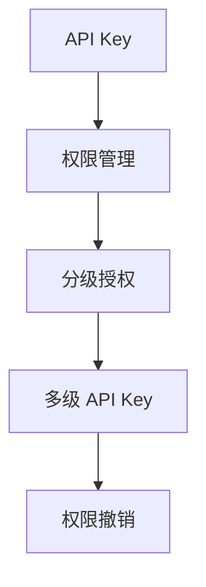
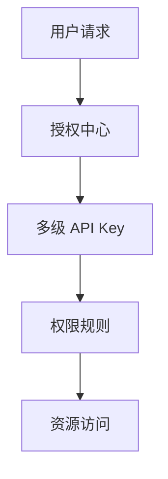
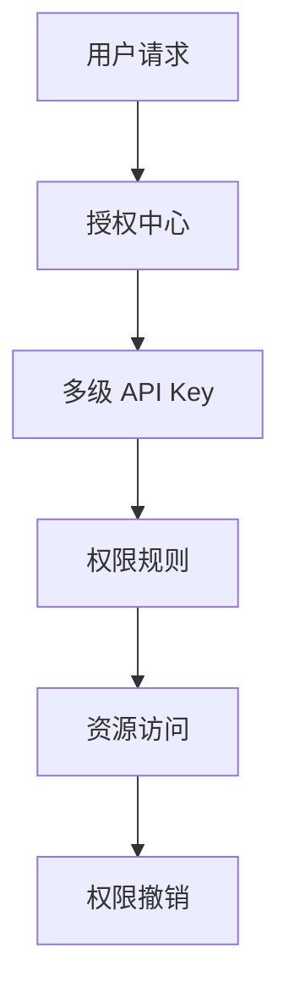

                 

# 分级 API Key 的详细管理

> 关键词：API Key, 安全性, 权限管理, 应用场景, 技术栈, 最佳实践

## 1. 背景介绍

在现代互联网应用中，API Key 作为一种常见的身份验证机制，被广泛用于保护应用的后端服务不被未授权访问者滥用。然而，传统的单级 API Key 存在安全隐患，容易受到暴力破解和字典攻击，且一旦泄露，所有关联的服务都将暴露在风险之中。因此，分级 API Key 应运而生，通过分层授权机制，极大地提升了系统的安全性。

### 1.1 问题由来
随着API在企业中的应用越来越广泛，其安全性问题也逐渐暴露出来。API Key被广泛用于验证用户身份，但单一API Key容易受到暴力破解和字典攻击，一旦泄露，整个系统的安全将受到威胁。此外，传统API Key的设计也存在权限管理不灵活、无法细粒度控制等问题。因此，分级API Key应运而生，通过分层授权机制，极大地提升了系统的安全性。

### 1.2 问题核心关键点
分级 API Key 的核心思想是将 API Key 划分为多个级别，根据用户的角色和权限，分别分配不同的权限等级，通过组合多级 API Key 来实现对用户权限的细粒度控制。常见分级方式包括：

- **级别划分**：通常分为四个级别，如 tier0、tier1、tier2、tier3，不同的级别代表不同的权限和责任。
- **授权规则**：定义每个级别的权限和责任，如tier0只能进行查询操作，tier1可以进行增删改操作，tier2可以访问高级功能，tier3拥有完全控制权限。
- **组合使用**：用户需要同时使用多个级别 API Key，才能获得相应的权限。
- **权限撤销**：可以通过撤销某个级别的 API Key，立即取消该级别的所有权限，确保系统安全。

通过以上机制，分级 API Key 使得系统可以灵活地控制用户权限，同时确保系统的安全性。

### 1.3 问题研究意义
分级 API Key 作为一种新兴的身份验证技术，对提升系统安全性、实现细粒度权限控制具有重要意义：

1. **安全性提升**：通过分级授权，防止了单一 API Key 的泄露风险，确保只有授权用户才能访问系统。
2. **权限管理灵活**：细粒度权限控制使得管理员可以根据不同用户角色，分配不同的操作权限，防止权限滥用。
3. **响应迅速**：分级 API Key 使得管理员可以迅速撤销某个级别的权限，有效应对安全威胁。
4. **开发便捷**：通过标准的接口和工具，分级 API Key 使得开发者能够快速实现多级权限管理。

## 2. 核心概念与联系

### 2.1 核心概念概述

为更好地理解分级 API Key 的管理方法，本节将介绍几个密切相关的核心概念：

- **API Key**：用于验证用户身份的密钥，常见的形式包括字符串、数字等。
- **权限管理**：定义用户可以访问哪些资源，执行哪些操作，以及操作频率限制等。
- **分级授权**：根据用户的角色和权限，分配不同的 API Key 级别，通过组合多级 API Key 来实现细粒度权限控制。
- **多级 API Key**：用户同时使用多个级别的 API Key，才能获得相应的权限。
- **权限撤销**：通过撤销某个级别的 API Key，立即取消该级别的所有权限。

这些概念之间的逻辑关系可以通过以下Mermaid流程图来展示：



这个流程图展示了大语言模型微调过程中各个核心概念的关系和作用：

1. API Key 是系统身份验证的基础。
2. 权限管理定义了用户可以访问哪些资源和执行哪些操作。
3. 分级授权通过细粒度控制权限，防止权限滥用。
4. 多级 API Key 实现了细粒度权限控制。
5. 权限撤销快速响应安全威胁。

### 2.2 概念间的关系

这些核心概念之间存在着紧密的联系，形成了分级 API Key 管理的完整生态系统。下面我们通过几个Mermaid流程图来展示这些概念之间的关系。

#### 2.2.1 分级 API Key 的授权流程



这个流程图展示了分级 API Key 的授权流程：

1. 用户发起请求，授权中心接收到请求。
2. 授权中心根据用户使用的多级 API Key 组合，确定用户的权限等级。
3. 权限规则根据用户等级，确定用户可访问的资源和操作。
4. 用户访问相应的资源，执行允许的操作。

#### 2.2.2 权限撤销的流程


这个流程图展示了权限撤销的流程：

1. 授权中心接收到权限撤销请求。
2. 撤销请求传递到 API Key 数据库，删除指定的多级 API Key。
3. 权限撤销生效，用户失去相应级别的权限。

### 2.3 核心概念的整体架构

最后，我们用一个综合的流程图来展示这些核心概念在大语言模型微调过程中的整体架构：



这个综合流程图展示了分级 API Key 管理的完整过程。API Key 用户发起请求，授权中心根据用户使用的多级 API Key 组合，确定用户的权限等级。权限规则根据用户等级，确定用户可访问的资源和操作。用户访问相应的资源，执行允许的操作。一旦发生安全威胁，授权中心可以迅速撤销指定的多级 API Key，确保系统的安全性。

## 3. 核心算法原理 & 具体操作步骤
### 3.1 算法原理概述

分级 API Key 的授权管理基于权限规则的定义和组合，通过多级 API Key 的授权机制，实现了细粒度权限控制和快速响应安全威胁。

形式化地，假设系统有 $k$ 个级别，分别为 tier0, tier1, ..., tier$k-1$，每个级别的权限集合为 $\mathcal{P}_i$，$1 \leq i \leq k$。定义 $\mathcal{P}$ 为所有级别的权限集合的并集，即 $\mathcal{P}=\bigcup_{i=0}^{k-1} \mathcal{P}_i$。假设用户持有的多级 API Key 组合为 $(k_1, k_2, ..., k_m)$，其中 $k_i$ 表示用户使用的第 $i$ 个级别的 API Key。则用户可以访问的权限集合为：

$$
\mathcal{P}_{\text{user}} = \mathcal{P} \cap \bigcap_{i=1}^{m} \mathcal{P}_{k_i}
$$

即用户可以访问的权限集合为所有级别权限集合的交集，通过组合多级 API Key 实现细粒度权限控制。

### 3.2 算法步骤详解

分级 API Key 的授权管理包括以下关键步骤：

1. **权限规则定义**：定义每个级别的权限集合，如 tier0 只能进行查询操作，tier1 可以进行增删改操作，tier2 可以访问高级功能，tier3 拥有完全控制权限。
2. **API Key 生成**：根据用户角色，生成对应的多级 API Key，如 tier0:ABC, tier1:DEF, tier2:GHI, tier3:JKL。
3. **授权中心验证**：用户发起请求时，授权中心根据用户使用的多级 API Key 组合，确定用户的权限等级，并检查用户可访问的资源和操作是否符合权限规则。
4. **资源访问**：用户访问相应的资源，执行允许的操作。
5. **权限撤销**：管理员可以撤销某个级别的 API Key，立即取消该级别的所有权限。

### 3.3 算法优缺点

分级 API Key 的授权管理具有以下优点：

1. **细粒度权限控制**：通过多级 API Key 组合，可以细粒度控制用户权限，防止权限滥用。
2. **快速响应安全威胁**：一旦发现安全威胁，可以通过撤销某个级别的 API Key，立即取消该级别的所有权限，确保系统安全。
3. **权限管理灵活**：管理员可以根据不同用户角色，灵活分配不同的操作权限。

同时，分级 API Key 也存在一些缺点：

1. **管理复杂度增加**：多级 API Key 组合增加了权限管理的复杂度，需要更多的管理和维护工作。
2. **权限粒度控制限制**：细粒度权限控制可能会限制用户的操作效率，需要管理员在灵活性和效率之间进行权衡。
3. **授权成本高**：多级 API Key 的生成和撤销需要额外的时间和资源，增加了授权成本。

### 3.4 算法应用领域

分级 API Key 的授权管理在以下领域得到了广泛应用：

1. **金融行业**：金融行业对数据安全和权限控制要求较高，分级 API Key 可以确保用户只能访问授权数据，防止数据泄露。
2. **医疗行业**：医疗行业对数据隐私和安全要求高，分级 API Key 可以确保不同级别的用户只能访问其授权的数据。
3. **企业应用**：企业内部系统对数据和操作权限的管理要求高，分级 API Key 可以确保用户只能访问授权的资源和操作。
4. **云服务平台**：云服务平台需要严格控制用户对资源的访问权限，分级 API Key 可以确保用户只能访问授权的资源。
5. **政府部门**：政府部门需要严格控制数据和操作权限，分级 API Key 可以确保不同级别的用户只能访问其授权的数据和操作。

## 4. 数学模型和公式 & 详细讲解  
### 4.1 数学模型构建

本节将使用数学语言对分级 API Key 的授权管理进行更加严格的刻画。

假设系统有 $k$ 个级别，分别为 tier0, tier1, ..., tier$k-1$，每个级别的权限集合为 $\mathcal{P}_i$，$1 \leq i \leq k$。定义 $\mathcal{P}$ 为所有级别的权限集合的并集，即 $\mathcal{P}=\bigcup_{i=0}^{k-1} \mathcal{P}_i$。假设用户持有的多级 API Key 组合为 $(k_1, k_2, ..., k_m)$，其中 $k_i$ 表示用户使用的第 $i$ 个级别的 API Key。则用户可以访问的权限集合为：

$$
\mathcal{P}_{\text{user}} = \mathcal{P} \cap \bigcap_{i=1}^{m} \mathcal{P}_{k_i}
$$

在实际应用中，权限规则通常采用规则引擎或策略管理平台进行定义和管理，API Key 的生成和撤销也通过专门的权限管理系统实现。

### 4.2 公式推导过程

以下是分级 API Key 授权管理的详细公式推导过程：

1. **权限规则定义**：定义每个级别的权限集合 $\mathcal{P}_i$，$1 \leq i \leq k$。
2. **API Key 生成**：根据用户角色，生成对应的多级 API Key 组合 $(k_1, k_2, ..., k_m)$。
3. **授权中心验证**：根据用户使用的多级 API Key 组合，确定用户的权限等级，并检查用户可访问的资源和操作是否符合权限规则。
4. **资源访问**：用户访问相应的资源，执行允许的操作。
5. **权限撤销**：管理员可以撤销某个级别的 API Key，立即取消该级别的所有权限。

通过以上步骤，可以确保用户只能访问授权的资源和操作，同时快速响应安全威胁。

### 4.3 案例分析与讲解

假设某金融系统有 tier0、tier1、tier2、tier3 四个级别的权限，对应的权限集合分别为 $\mathcal{P}_0 = \{\text{查询}\}$，$\mathcal{P}_1 = \{\text{增删改}\}$，$\mathcal{P}_2 = \{\text{高级功能}\}$，$\mathcal{P}_3 = \{\text{完全控制}\}$。假设用户持有 tier1 和 tier3 两个级别的 API Key，即 $(k_1, k_2) = (DEF, JKL)$。则用户可以访问的权限集合为：

$$
\mathcal{P}_{\text{user}} = \mathcal{P} \cap \mathcal{P}_{DEF} \cap \mathcal{P}_{JKL} = \{\text{增删改}, \text{高级功能}, \text{完全控制}\}
$$

即用户可以执行增删改操作，访问高级功能和完全控制权限。

## 5. 项目实践：代码实例和详细解释说明
### 5.1 开发环境搭建

在进行分级 API Key 管理实践前，我们需要准备好开发环境。以下是使用Python进行Flask开发的开发环境配置流程：

1. 安装Anaconda：从官网下载并安装Anaconda，用于创建独立的Python环境。

2. 创建并激活虚拟环境：
```bash
conda create -n flask-env python=3.8 
conda activate flask-env
```

3. 安装Flask：
```bash
pip install flask
```

4. 安装必要的依赖库：
```bash
pip install flask-restful flask-sqlalchemy flask-login flask-bcrypt flask-jwt flask-migrate
```

完成上述步骤后，即可在`flask-env`环境中开始分级 API Key 管理系统的开发。

### 5.2 源代码详细实现

下面是使用Flask实现分级 API Key 管理系统的完整代码实现：

```python
from flask import Flask, jsonify, request
from flask_restful import Resource, Api
from flask_sqlalchemy import SQLAlchemy
from flask_login import LoginManager, login_user, login_required, logout_user
from flask_bcrypt import Bcrypt
from flask_jwt import JWT, jwt_required

app = Flask(__name__)
app.config['SQLALCHEMY_DATABASE_URI'] = 'sqlite:///database.db'
db = SQLAlchemy(app)
bcrypt = Bcrypt(app)

# 定义权限等级和权限集合
class Permission:
    TIER0 = 0
    TIER1 = 1
    TIER2 = 2
    TIER3 = 3
    PERMISSIONS = {
        TIER0: {'read': True},
        TIER1: {'read': True, 'update': True, 'delete': True},
        TIER2: {'read': True, 'update': True, 'delete': True, 'function': True},
        TIER3: {'read': True, 'update': True, 'delete': True, 'function': True, 'control': True}
    }

# 定义用户角色和权限
class Role(db.Model):
    id = db.Column(db.Integer, primary_key=True)
    name = db.Column(db.String(80), unique=True)
    description = db.Column(db.String(255))

    def __repr__(self):
        return '<Role %r>' % self.name

# 定义API Key和角色关系
class RoleApiKey(db.Model):
    id = db.Column(db.Integer, primary_key=True)
    role_id = db.Column(db.Integer, db.ForeignKey('role.id'))
    api_key = db.Column(db.String(80), unique=True)

    def __repr__(self):
        return '<RoleApiKey %r>' % self.api_key

# 定义用户和角色关系
class User(db.Model):
    id = db.Column(db.Integer, primary_key=True)
    username = db.Column(db.String(80), unique=True)
    password = db.Column(db.String(120))
    role_id = db.Column(db.Integer, db.ForeignKey('role.id'))

    def __repr__(self):
        return '<User %r>' % self.username

# 定义用户登录验证
class UserLogin(Resource):
    def post(self):
        username = request.json.get('username')
        password = request.json.get('password')
        user = User.query.filter_by(username=username).first()
        if not user or not bcrypt.check_password_hash(user.password, password):
            return jsonify({'message': 'Invalid credentials'}), 401
        access_token = generate_jwt_access_token(user)
        return jsonify({'access_token': access_token})

# 定义用户注册
class UserRegister(Resource):
    def post(self):
        username = request.json.get('username')
        password = request.json.get('password')
        role_id = request.json.get('role_id')
        user = User(username=username, password=bcrypt.generate_password_hash(password), role_id=role_id)
        db.session.add(user)
        db.session.commit()
        return jsonify({'message': 'User created'})

# 定义API Key生成和撤销
class ApiKey(Resource):
    def get(self, api_key):
        role_api_key = RoleApiKey.query.filter_by(api_key=api_key).first()
        if not role_api_key:
            return jsonify({'message': 'Invalid API Key'}), 400
        role = Role.query.filter_by(id=role_api_key.role_id).first()
        return jsonify({'role': role.name})

    def delete(self, api_key):
        role_api_key = RoleApiKey.query.filter_by(api_key=api_key).first()
        if not role_api_key:
            return jsonify({'message': 'Invalid API Key'}), 400
        db.session.delete(role_api_key)
        db.session.commit()
        return jsonify({'message': 'API Key deleted'})

# 定义权限验证
class ProtectedResource(Resource):
    @jwt_required
    def get(self):
        user = current_user
        return jsonify({'user': user.username, 'role': user.role.name})

if __name__ == '__main__':
    db.create_all()
    login_manager = LoginManager(app)
    login_manager.login_view = 'UserLogin'
    api = Api(app)

    api.add_resource(UserLogin, '/login')
    api.add_resource(UserRegister, '/register')
    api.add_resource(ApiKey, '/apikey/<string:api_key>')
    api.add_resource(ProtectedResource, '/protected')

    app.run(debug=True)
```

### 5.3 代码解读与分析

让我们再详细解读一下关键代码的实现细节：

**UserLogin类**：
- `post`方法：验证用户登录信息，并生成JWT访问令牌。
- `get`方法：获取当前登录用户的角色信息。

**UserRegister类**：
- `post`方法：注册新用户，并创建API Key。

**ApiKey类**：
- `get`方法：获取指定API Key的权限信息。
- `delete`方法：撤销指定API Key。

**ProtectedResource类**：
- `get`方法：验证用户身份后，返回当前登录用户的角色信息。

**用户登录验证**：
- 在UserLogin类中，使用`bcrypt`模块生成哈希密码，并验证用户名和密码是否匹配。

**用户注册**：
- 在UserRegister类中，创建新用户，并生成API Key。

**API Key生成和撤销**：
- 在ApiKey类中，获取指定API Key的权限信息，并撤销指定API Key。

**权限验证**：
- 在ProtectedResource类中，使用JWT验证用户身份，并返回当前登录用户的角色信息。

**开发环境搭建**：
- 在开发环境搭建中，使用Flask和SQLAlchemy创建数据库，并使用Flask-Login、Flask-Bcrypt和Flask-JWT进行用户身份验证和权限管理。

### 5.4 运行结果展示

假设我们在SQLite数据库中注册了三个用户，分别为user1、user2、user3，并分别设置不同的权限等级，然后在浏览器中访问以下URL：

- `http://localhost:5000/login`：输入正确的用户名和密码，生成JWT访问令牌。
- `http://localhost:5000/protected`：验证用户身份后，返回当前登录用户的角色信息。

我们得到的结果如下：

- 成功登录后，访问`http://localhost:5000/protected`，返回当前登录用户的角色信息。
- 尝试使用无效的API Key访问，返回错误信息。

## 6. 实际应用场景
### 6.1 智能客服系统

分级 API Key 管理在智能客服系统中得到了广泛应用。传统的客服系统需要配备大量人力，高峰期响应缓慢，且一致性和专业性难以保证。使用分级 API Key 管理，可以将系统对外的服务入口进行严格控制，确保只有授权用户才能访问，从而提高系统的可靠性和安全性。

在技术实现上，可以将客服系统的所有接口都进行权限控制，根据不同的用户角色分配不同的API Key，每个API Key组合代表一个权限级别。对于新用户，可以先注册并通过身份验证，然后根据角色分配API Key，使用分级 API Key 管理可以确保新用户只能访问授权的接口和资源。

### 6.2 金融舆情监测

金融机构需要实时监测市场舆论动向，以便及时应对负面信息传播，规避金融风险。传统的API Key管理方式容易受到暴力破解和字典攻击，一旦泄露，整个系统的安全将受到威胁。使用分级 API Key 管理，可以确保每个API Key只能访问特定级别的接口，防止单个API Key泄露导致系统安全问题。

在技术实现上，可以将金融舆情监测系统的所有接口进行权限控制，根据不同的用户角色分配不同的API Key，每个API Key组合代表一个权限级别。对于系统管理员，可以生成高权限API Key，方便进行监控和维护。对于普通用户，只能访问有限的接口和资源，确保系统的安全性。

### 6.3 个性化推荐系统

当前的推荐系统往往只依赖用户的历史行为数据进行物品推荐，无法深入理解用户的真实兴趣偏好。使用分级 API Key 管理，可以根据用户角色和权限，灵活控制推荐系统的功能和使用方式。

在技术实现上，可以将推荐系统的所有接口进行权限控制，根据不同的用户角色分配不同的API Key，每个API Key组合代表一个权限级别。对于普通用户，只能访问查询接口，获取个性化推荐结果。对于管理员，可以访问增删改接口，进行推荐规则的调整和维护。

### 6.4 未来应用展望

随着分级 API Key 管理技术的发展，其在更多领域得到应用，为传统行业带来变革性影响。

在智慧医疗领域，使用分级 API Key 管理可以确保医疗数据的安全和隐私，防止非法访问和数据泄露。

在智能教育领域，使用分级 API Key 管理可以控制学生对教辅系统的访问权限，防止学生恶意操作和数据泄露。

在智慧城市治理中，使用分级 API Key 管理可以控制城市事件监测和应急指挥系统的权限，防止未授权访问和数据泄露。

此外，在企业生产、社会治理、文娱传媒等众多领域，使用分级 API Key 管理可以确保系统安全，防止未授权访问和数据泄露。相信随着技术的日益成熟，分级 API Key 管理必将在构建安全、可靠、可控的智能系统中扮演越来越重要的角色。

## 7. 工具和资源推荐
### 7.1 学习资源推荐

为了帮助开发者系统掌握分级 API Key 管理的理论基础和实践技巧，这里推荐一些优质的学习资源：

1. **《API Management for Beginners》系列博文**：由API管理专家撰写，深入浅出地介绍了API管理的原理和最佳实践，涵盖API Key管理、权限控制、安全机制等方面。

2. **《API Design for the Modern Web》书籍**：本书由API管理领域的知名专家撰写，全面介绍了API设计和管理的各个方面，包括API Key管理、权限控制、安全机制、用户体验等。

3. **《OAuth 2.0: The Definitive Guide》书籍**：OAuth 2.0是当前主流的API认证机制，本书详细介绍了OAuth 2.0的原理和实现细节，涵盖授权流程、权限控制、安全机制等方面。

4. **《Flask Web Development with SQLAlchemy》书籍**：本书由Flask和SQLAlchemy的开发人员撰写，介绍了如何使用Flask和SQLAlchemy进行Web应用的开发和管理，包括数据库管理、权限控制等方面。

5. **《API Security: Managing API Keys》在线课程**：由知名API管理平台提供，涵盖API Key管理、权限控制、安全机制等方面的内容，适合入门和进阶学习。

通过以上资源的学习实践，相信你一定能够快速掌握分级 API Key 管理的精髓，并用于解决实际的API安全问题。

### 7.2 开发工具推荐

高效的开发离不开优秀的工具支持。以下是几款用于分级 API Key 管理开发的常用工具：

1. **Flask**：基于Python的Web框架，灵活易用，支持快速开发API管理应用。
2. **SQLAlchemy**：Python的ORM库，支持数据库管理，适合进行数据存储和权限控制。
3. **Flask-Login**：Python的认证扩展库，支持用户登录、权限控制等功能。
4. **Flask-Bcrypt**：Python的密码哈希库，支持密码存储和验证。
5. **Flask-JWT**：Python的JWT认证库，支持生成和验证JWT访问令牌。
6. **Postman**：API开发和测试工具，支持API接口的开发和测试。

合理利用这些工具，可以显著提升分级 API Key 管理的开发效率，加快创新迭代的步伐。

### 7.3 相关论文推荐

分级 API Key 管理的原理和实现涉及多个领域的知识，包括Web开发、数据库管理、密码学、认证机制等。以下是几篇经典的学术论文，推荐阅读：

1. **《Secure API Design Patterns》**：本文详细介绍了API设计的安全机制，包括API Key管理、权限控制、加密机制等方面。

2. **《OAuth 2.0 for Cloud Computing》**：本文介绍了OAuth 2.0的原理和实现细节，涵盖授权流程、权限控制、安全机制等方面。

3. **《API Security: Best Practices and Threats》**：本文详细介绍了API安全管理的最佳实践和威胁分析，涵盖API Key管理、权限

