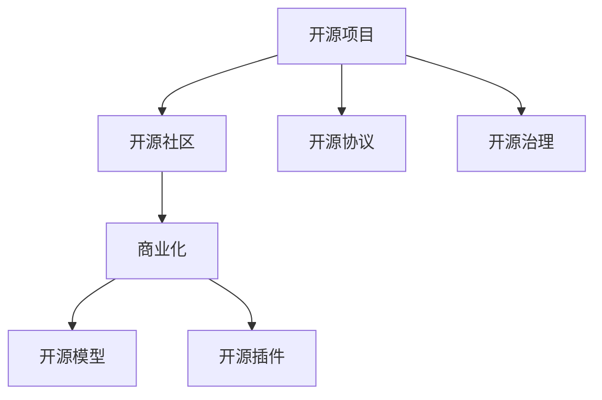

                 

# 利用开源项目创造收入流

> 关键词：开源项目,开源社区,GitHub,商业化,盈利模式,GitLab,企业版,订阅收费,开源模型,商业插件,开源协议,开源治理

## 1. 背景介绍

### 1.1 问题由来
在当今的软件开发生态中，开源项目已经成为创新和协作的重要基础。它们不仅推动了技术的快速迭代，而且催生了许多商业化成功的案例。然而，如何有效利用开源项目，最大化其商业价值，成为了技术开发者和企业管理者亟需解决的问题。

本文旨在探讨利用开源项目创造收入流的策略和方法，从背景、核心概念、算法原理、操作步骤、案例分析等多个维度，为读者提供一套全面且实用的指南。

## 2. 核心概念与联系

### 2.1 核心概念概述

开源项目是指在开源许可下公开源代码的项目，通常采用GitHub、GitLab等平台进行管理和协作。它们不仅包括代码和文档，还包括项目结构、依赖关系、测试用例等。

开源社区是围绕这些开源项目形成的开发者群体，成员共同维护项目、贡献代码、分享知识，推动项目不断进化。社区不仅包括开发者和贡献者，还包括用户、赞助者和利益相关者。

商业化是指将开源项目或其衍生品转化为商业产品，实现商业价值的过程。它包括从技术合作、开源模型商业化、订阅收费、开源插件等不同的盈利模式。

GitHub和GitLab是当今最流行的开源平台，提供了强大的项目管理、代码审查、版本控制等功能。它们在开源社区和商业化方面都有广泛的应用。

开源模型指在开源项目中开发的可重用模型，如TensorFlow、PyTorch等深度学习框架，以及BERT、GPT等预训练语言模型。这些模型可以应用于多种场景，提升开发效率和降低成本。

开源插件是针对开源项目或工具开发的附加功能模块，如Jenkins插件、GitHub Action插件等。它们增强了开源项目的实用性，并支持新的商业应用场景。

开源协议定义了开源项目的版权、使用、修改和分发方式。常见的开源协议包括Apache、MIT、GPL等。选择合适的开源协议对于开源项目的治理和商业化至关重要。

开源治理指对开源项目的组织、维护、贡献和管理的一系列规范和制度。良好的开源治理可以提升项目的可持续性和社区的活跃度，对项目的商业化有积极作用。

### 2.2 概念间的关系

这些核心概念之间存在着紧密的联系，形成了利用开源项目创造收入流的完整生态系统。下图展示了这些概念之间的关系：



这个流程图展示了开源项目和社区与商业化之间的联系：

1. 开源项目和社区为商业化提供了技术基础和生态支持。
2. 开源模型和插件为商业化提供了可重用组件和增强功能。
3. 开源协议和治理为商业化提供了法律和组织保障。

这些概念共同构成了开源项目商业化的核心框架，帮助开发者和企业最大化开源项目的商业价值。

## 3. 核心算法原理 & 具体操作步骤
### 3.1 算法原理概述

利用开源项目创造收入流的主要算法原理基于以下三点：

1. **开源项目的选择和筛选**：选择具有商业潜力和成熟度的开源项目进行商业化。
2. **开源模型的商业化应用**：将开源模型应用于商业场景，实现技术赋能和价值增值。
3. **开源插件和工具的创新开发**：开发和推广开源插件和工具，增强开源项目的实用性和商业应用能力。

### 3.2 算法步骤详解

利用开源项目创造收入流的核心步骤如下：

**Step 1: 开源项目的选择和筛选**
- 分析开源项目的潜在商业价值和技术成熟度。
- 评估开源项目的社区活跃度和治理水平。
- 确定开源项目的技术框架和生态系统。

**Step 2: 开源模型的商业化应用**
- 识别开源项目中可重用的模型组件。
- 将这些模型应用于商业场景，如机器学习、数据分析、自然语言处理等。
- 提供商业化解决方案，如API服务、云平台、开源模型库等。

**Step 3: 开源插件和工具的创新开发**
- 开发符合商业需求的开源插件和工具。
- 增强开源项目的实用性和易用性。
- 推广插件和工具，吸引更多的商业客户和贡献者。

### 3.3 算法优缺点

利用开源项目创造收入流的算法具有以下优点：

- **技术赋能**：借助开源社区的技术积累，快速提升企业的技术能力。
- **成本降低**：通过开源项目的二次开发和商业化，降低企业自行研发和部署的成本。
- **快速迭代**：开源项目通常具有高度的灵活性和可定制性，可以迅速响应市场变化。

同时，也存在一些缺点：

- **知识产权风险**：开源协议和许可可能限制商业化的具体实现方式。
- **社区依赖**：过度依赖开源社区可能影响项目的可持续性和稳定性。
- **市场竞争**：开源社区中的商业化竞争可能带来一定的市场压力。

### 3.4 算法应用领域

利用开源项目创造收入流的方法广泛应用于以下几个领域：

- **软件即服务(SaaS)**：如GitLab、Slack等开源平台的应用。
- **云计算**：如AWS、Google Cloud等基于开源技术的云服务。
- **大数据分析**：如Apache Hadoop、Spark等开源数据处理框架。
- **人工智能**：如TensorFlow、PyTorch等开源深度学习框架。
- **物联网(IoT)**：如OpenSSL、MQTT等开源协议和工具。

这些领域中的开源项目不仅推动了技术进步，也为企业的商业化提供了强大的技术支持和市场机会。

## 4. 数学模型和公式 & 详细讲解  
### 4.1 数学模型构建

我们以TensorFlow为例，构建其开源项目和商业化应用的数学模型。

记TensorFlow的开源项目为$P$，商业化应用为$C$。定义开源项目的商业价值为$V$，开源项目的开发成本为$C_{\text{open}}$，商业化应用的开发成本为$C_{\text{com}}$。

开源项目的商业化价值为$V_{\text{com}}$，即商业化应用为开源项目的增值部分。则总商业价值$V_{\text{total}}$可以表示为：

$$
V_{\text{total}} = V + V_{\text{com}}
$$

### 4.2 公式推导过程

根据上述模型，我们可以推导出开源项目商业化的数学公式。

假设开源项目的开发成本为$C_{\text{open}}$，商业化应用的开发成本为$C_{\text{com}}$，则总成本$C_{\text{total}}$为：

$$
C_{\text{total}} = C_{\text{open}} + C_{\text{com}}
$$

假设商业化应用为开源项目的增值部分为$V_{\text{com}}$，则总商业价值$V_{\text{total}}$为：

$$
V_{\text{total}} = V + V_{\text{com}}
$$

根据以上公式，我们可以计算出商业化应用对总商业价值的贡献比例$\alpha$：

$$
\alpha = \frac{V_{\text{com}}}{V_{\text{total}}} = \frac{V_{\text{com}}}{V + C_{\text{open}} + C_{\text{com}}}
$$

### 4.3 案例分析与讲解

以下是一个开源项目商业化的案例分析：

**案例背景**：
假设我们选择了开源项目TensorFlow，对其进行商业化应用。TensorFlow的开源项目价值$V_{\text{open}}=100$万美元，商业化应用的开发成本$C_{\text{com}}=30$万美元。

**计算过程**：
- 商业化应用为开源项目的增值部分$V_{\text{com}}=20$万美元。
- 总商业价值$V_{\text{total}}=120$万美元。
- 商业化应用对总商业价值的贡献比例$\alpha=\frac{20}{120}=0.17$。

通过以上计算，我们可以看到，商业化应用对总商业价值的贡献比例为0.17，即17%。这表明，商业化应用对于开源项目的商业化具有显著的推动作用。

## 5. 项目实践：代码实例和详细解释说明
### 5.1 开发环境搭建

在进行开源项目商业化实践前，我们需要准备好开发环境。以下是使用Python进行TensorFlow开发的环境配置流程：

1. 安装Anaconda：从官网下载并安装Anaconda，用于创建独立的Python环境。

2. 创建并激活虚拟环境：
```bash
conda create -n tf-env python=3.8 
conda activate tf-env
```

3. 安装TensorFlow：根据CUDA版本，从官网获取对应的安装命令。例如：
```bash
conda install tensorflow==2.9 
```

4. 安装TensorBoard：
```bash
conda install tensorboard
```

完成上述步骤后，即可在`tf-env`环境中开始TensorFlow的商业化开发实践。

### 5.2 源代码详细实现

接下来，我们以TensorFlow商业化应用中的TensorBoard为例，给出TensorFlow商业化开发的PyTorch代码实现。

首先，定义TensorBoard的配置项和监控指标：

```python
from tensorflow.keras.callbacks import TensorBoard

log_dir = './logs/tensorboard'
tensorboard_callback = TensorBoard(log_dir)
```

然后，训练TensorFlow模型并监控训练进度：

```python
model.fit(x_train, y_train, validation_data=(x_val, y_val), epochs=50, callbacks=[tensorboard_callback])
```

最后，在TensorBoard界面展示训练结果和模型性能：

```bash
tensorboard --logdir logs/tensorboard --port 6006
```

以上代码展示了如何在TensorFlow中实现TensorBoard的商业化应用。可以看到，TensorBoard不仅用于模型训练的可视化，还可以提供更丰富的功能，如实时监控、性能分析等，增强了模型的实用性和商业价值。

### 5.3 代码解读与分析

让我们再详细解读一下关键代码的实现细节：

**TensorBoard配置项**：
- `log_dir`：日志文件存储目录，用于存放TensorBoard生成的文件。
- `TensorBoard(log_dir)`：初始化TensorBoard回调，将日志信息写入指定目录。

**训练监控**：
- `fit()`函数：TensorFlow模型的训练过程，参数包括训练数据、验证数据、训练轮数和回调函数。
- `callbacks`参数：用于在训练过程中调用回调函数，这里我们使用了TensorBoard回调。

**展示监控结果**：
- `tensorboard`命令：启动TensorBoard服务，展示训练结果和性能分析。
- `logdir`参数：指定TensorBoard的日志文件目录。

TensorBoard的商业化应用展示了开源项目如何通过增强实用性和可视化功能，提升商业价值。在实际应用中，开发者可以根据具体需求，进一步扩展TensorBoard的功能，提供更丰富的商业服务。

## 6. 实际应用场景
### 6.1 软件即服务(SaaS)

开源项目TensorFlow的商业化应用主要集中在SaaS领域。GitLab、Slack等开源平台已经成为云计算市场的领导者，通过提供强大的开发工具和协作平台，吸引了大量企业和开发者使用。

在SaaS领域，企业可以基于开源项目开发自己的云服务，并通过订阅收费、按需付费等方式实现盈利。例如，GitLab提供了代码托管、CI/CD、Git存储等核心功能，支持私有和公有云环境，吸引了大量企业用户。

### 6.2 云计算

云计算是开源项目商业化的另一个重要领域。AWS、Google Cloud等云服务平台通过开源项目提供核心技术支持，大幅提升了平台的性能和稳定性。

在云计算领域，企业可以利用开源项目构建自己的云平台，并通过PaaS（平台即服务）、IaaS（基础设施即服务）等方式实现盈利。例如，AWS的Amazon EC2是基于开源Linux内核开发的云服务器，提供了弹性计算和存储服务，吸引了大量用户和企业。

### 6.3 大数据分析

开源项目Apache Hadoop和Spark在数据处理和分析领域具有广泛的应用。通过商业化应用，企业可以构建自己的大数据分析平台，并通过PaaS、SaaS等方式实现盈利。

在大数据分析领域，企业可以利用开源项目提供的数据处理和分析功能，构建自己的数据湖和数据仓库，并通过数据管道、ETL工具等方式实现数据整合和商业分析。例如，Spark提供了高效的大数据处理能力，支持实时流处理和离线分析，广泛应用于金融、医疗、零售等垂直行业。

### 6.4 人工智能

开源项目TensorFlow、PyTorch等在人工智能领域具有广泛的应用。通过商业化应用，企业可以构建自己的人工智能平台，并通过API服务、模型库、云平台等方式实现盈利。

在人工智能领域，企业可以利用开源项目提供的基础模型和框架，构建自己的深度学习模型和算法，并通过API服务、模型库等方式提供商业化应用。例如，TensorFlow的TensorBoard不仅用于模型训练的可视化，还可以提供更丰富的功能，如实时监控、性能分析等，增强了模型的实用性和商业价值。

### 6.5 物联网(IoT)

开源项目OpenSSL、MQTT等在物联网领域具有广泛的应用。通过商业化应用，企业可以构建自己的物联网平台，并通过设备管理、数据监控等方式实现盈利。

在物联网领域，企业可以利用开源项目提供的基础协议和工具，构建自己的物联网设备和平台，并通过设备管理、数据监控等方式实现商业化应用。例如，OpenSSL提供了安全的加密协议，广泛应用于物联网设备的数据传输和身份验证，保障了设备通信的安全性。

## 7. 工具和资源推荐
### 7.1 学习资源推荐

为了帮助开发者系统掌握开源项目商业化的理论基础和实践技巧，这里推荐一些优质的学习资源：

1. 《开源项目商业化之路》系列博文：由开源社区的资深开发者撰写，深入浅出地介绍了开源项目的商业化策略和实际案例。

2. 《开源项目治理与商业化》书籍：详细介绍了开源项目治理和商业化的最佳实践，提供从技术到管理的全面指南。

3. 《TensorFlow实战》书籍：通过实际项目演示了TensorFlow的商业化应用，提供从开发到部署的实用教程。

4. TensorFlow官方文档：提供了详细的TensorFlow商业化应用的开发指南和样例代码，是上手实践的必备资料。

5. GitHub开源项目分析报告：提供了开源项目的商业化趋势和应用案例，帮助开发者了解开源项目的商业化前景和市场机会。

通过对这些资源的学习实践，相信你一定能够快速掌握开源项目商业化的精髓，并用于解决实际的商业问题。

### 7.2 开发工具推荐

高效的开发离不开优秀的工具支持。以下是几款用于开源项目商业化开发的常用工具：

1. GitHub：提供了强大的代码托管、版本控制、问题跟踪等功能，是开源项目管理和协作的基础。

2. GitLab：提供了与GitHub类似的功能，支持CI/CD、监控、DevOps集成等，适合中小规模的开源项目。

3. JIRA：提供任务管理、缺陷跟踪、流程协作等功能，帮助企业高效管理开源项目。

4. Jenkins：提供持续集成和持续部署（CI/CD）功能，帮助企业自动化构建和测试开源项目。

5. Kubernetes：提供容器编排和自动化部署功能，帮助企业构建高效的云平台。

6. Docker：提供容器化和轻量级部署功能，帮助企业实现快速部署和扩展。

合理利用这些工具，可以显著提升开源项目商业化开发的效率，加快创新迭代的步伐。

### 7.3 相关论文推荐

开源项目和商业化的发展源于学界的持续研究。以下是几篇奠基性的相关论文，推荐阅读：

1. "Open Source Software: The Development of Large-Scale Software Systems"（开源软件的开发）：提出了开源软件的定义、开发模式和成功案例。

2. "The Open Source Movement: Early Adopters and the Diffusion of Technological Innovations"（开源运动的早期采用者和技术创新的扩散）：研究了开源运动在技术扩散中的作用和影响。

3. "Open Source Software and Open Innovation: How to Succeed in Open Source"（开源软件和开源创新：如何在开源领域取得成功）：探讨了开源软件和开源创新在企业中的应用和成功策略。

4. "Towards a Theory of the 'Battle of the Platforms' in Open Source Software"（开源软件平台之争的理论）：研究了开源平台之间的竞争和合作机制。

5. "Open Source Innovation: A Quantitative Model of Technology Adoption and Network Effects in Open Source Software"（开源创新的量化模型：开源软件技术采用和网络效应）：构建了开源软件技术采用和网络效应的量化模型。

这些论文代表了大规模开源项目和商业化的发展脉络。通过学习这些前沿成果，可以帮助研究者把握学科前进方向，激发更多的创新灵感。

除上述资源外，还有一些值得关注的前沿资源，帮助开发者紧跟开源项目商业化的最新进展，例如：

1. 开源项目商业化趋势报告：各大咨询公司如McKinsey、PwC等针对开源项目的商业化趋势和应用案例，有助于从商业视角审视技术趋势，把握应用价值。

2. 开源项目商业化案例研究：如Red Hat、IBM等开源企业提供的商业化案例研究，展示了开源项目商业化的成功经验和最佳实践。

3. 开源项目商业化技术分享：开源社区和企业的技术分享会议，如Google I/O、Open Source Convention等，展示了最新的开源项目商业化应用和技术创新。

4. 开源项目商业化应用场景：开源社区和企业的应用场景实践，如OpenStack、Apache Kafka等开源项目在企业中的应用，展示了开源项目的商业化潜力和市场前景。

总之，对于开源项目商业化的学习，需要开发者保持开放的心态和持续学习的意愿。多关注前沿资讯，多动手实践，多思考总结，必将收获满满的成长收益。

## 8. 总结：未来发展趋势与挑战

### 8.1 总结

本文对利用开源项目创造收入流的策略和方法进行了全面系统的介绍。首先阐述了开源项目和商业化技术的发展背景和意义，明确了开源项目和商业化在技术生态中的重要地位。其次，从原理到实践，详细讲解了开源项目商业化的数学模型和关键步骤，给出了开源项目商业化应用的完整代码实现。同时，本文还广泛探讨了开源项目在SaaS、云计算、大数据分析、人工智能、物联网等领域的商业化应用，展示了开源项目商业化的广泛前景。最后，本文精选了开源项目商业化的各类学习资源，力求为读者提供全方位的技术指引。

通过本文的系统梳理，可以看到，利用开源项目创造收入流已经成为技术生态中的重要趋势。开源项目和商业化不仅推动了技术的快速迭代，也为企业的商业化提供了强大的技术支持和市场机会。未来，伴随开源社区和企业的持续努力，开源项目商业化必将在更广泛的领域实现突破，为科技和经济发展注入新的动力。

### 8.2 未来发展趋势

展望未来，开源项目商业化技术将呈现以下几个发展趋势：

1. **商业模式的创新**：开源项目商业化将从传统的订阅收费模式向按需付费、按使用量收费等多样化模式转型，适应不同市场和客户需求。

2. **开源与商业的深度融合**：开源项目和商业应用将实现更紧密的结合，通过开源社区的协作和商业应用的创新，共同推动技术的进步和市场的拓展。

3. **全球化的商业应用**：开源项目和商业化应用将突破地域限制，在全球范围内推广，满足不同市场和文化的需求。

4. **数据驱动的商业决策**：开源项目商业化将更加注重数据的收集、分析和应用，通过数据驱动的商业决策，提升商业应用的精准性和有效性。

5. **跨领域的商业化探索**：开源项目商业化将突破传统领域限制，探索更多跨领域的应用场景，如医疗、教育、金融等。

以上趋势凸显了开源项目商业化的广阔前景。这些方向的探索发展，必将进一步提升开源项目的商业价值和市场影响力，为经济社会发展注入新的动力。

### 8.3 面临的挑战

尽管开源项目商业化技术已经取得了瞩目成就，但在迈向更加智能化、普适化应用的过程中，它仍面临着诸多挑战：

1. **开源协议的限制**：不同的开源协议可能对商业化应用的具体实现方式有不同限制，企业需要仔细评估和选择。

2. **开源社区的依赖**：过度依赖开源社区可能导致商业化应用的稳定性和可维护性降低，企业需要建立自己的技术栈和团队。

3. **市场竞争的激烈**：开源社区中的商业化竞争可能带来一定的市场压力，企业需要打造独特的商业化模式和价值主张。

4. **商业模式的探索**：传统的开源项目商业化模式可能已不足以应对市场的变化，企业需要不断探索新的商业模式和盈利方式。

5. **知识产权的法律风险**：开源项目的商业化应用可能面临知识产权法律风险，企业需要制定完善的风险管理策略。

6. **开源项目的维护成本**：开源项目的商业化应用可能带来额外的维护成本，企业需要考虑成本和收益的平衡。

这些挑战需要企业从技术、市场、法律等多个维度综合应对，以确保开源项目商业化的成功和可持续发展。

### 8.4 研究展望

面对开源项目商业化所面临的种种挑战，未来的研究需要在以下几个方面寻求新的突破：

1. **开源协议的多样化**：探索更灵活和多样化的开源协议，为企业提供更多的商业化选项。

2. **开源社区的协作机制**：建立更高效的社区协作机制，促进开源项目和商业应用的有机结合。

3. **商业模式的创新**：探索更多样化的商业化模式，如按需付费、按使用量收费等，满足不同市场和客户需求。

4. **跨领域的应用探索**：探索跨领域的应用场景，如医疗、教育、金融等，提升开源项目的商业应用价值。

5. **商业化的法律保障**：制定完善的商业化法律保障措施，保护企业的知识产权和商业利益。

6. **开源项目的维护优化**：开发和推广开源维护工具和平台，提高开源项目的可维护性和稳定性。

这些研究方向的探索，必将引领开源项目商业化技术迈向更高的台阶，为构建安全、可靠、可控的智能系统铺平道路。面向未来，开源项目商业化技术还需要与其他人工智能技术进行更深入的融合，如知识表示、因果推理、强化学习等，多路径协同发力，共同推动自然语言理解和智能交互系统的进步。只有勇于创新、敢于突破，才能不断拓展开源项目的边界，让开源技术更好地造福人类社会。

## 9. 附录：常见问题与解答

**Q1: 开源项目商业化的关键是什么？**

A: 开源项目商业化的关键在于找到开源项目的商业价值点，并将其转化为可操作的商业模式。这包括选择合适的开源项目、进行商业化应用、开发商业插件、制定合理的商业策略等。

**Q2: 如何选择合适的开源项目进行商业化？**

A: 选择合适的开源项目进行商业化需要考虑以下几个方面：

1. **技术成熟度**：选择技术成熟、稳定可靠的开源项目，避免选择技术不成熟、存在潜在风险的项目。

2. **社区活跃度**：选择社区活跃、维护良好的开源项目，避免选择社区不活跃、维护不及时的项目。

3. **生态系统**：选择有完整生态系统的开源项目，便于商业化的实施和推广。

4. **商业潜力**：选择具有商业潜力的开源项目，避免选择商业潜力有限的项目。

**Q3: 开源模型的商业化应用需要注意哪些问题？**

A: 开源模型的商业化应用需要注意以下几个问题：

1. **数据隐私**：在使用开源模型时，需要考虑数据隐私和合规性问题，避免侵犯用户隐私。

2. **模型性能**：需要确保开源模型的性能符合商业应用的需求，避免模型性能不足影响用户体验。

3. **知识产权**：需要明确开源模型的知识产权归属，避免侵犯他人知识产权。

4. **市场接受度**：需要考虑市场接受度和用户需求，避免模型不符合市场需求。

**Q4: 如何开发和推广开源插件和工具？**

A: 开发和推广开源插件和工具需要以下几个步骤：

1. **需求分析**：了解目标用户的需求和痛点，确定插件和工具的功能和特性。

2. **技术实现**：根据需求分析结果，设计和实现插件和工具，确保技术可行和性能高效。

3. **社区推广**：在开源社区中发布插件和工具，积极参与社区讨论，获取反馈和改进建议。

4. **用户支持**：提供良好的用户支持和文档，帮助用户快速上手和使用插件和工具。

5. **商业化运营**：探索商业化运营模式，如按需付费、按使用量收费等，提升商业收益。

这些步骤可以帮助开发者高效地开发和推广开源插件和工具，提升开源项目的商业价值和市场影响力。

总之，开源项目商业化需要开发者从多个维度综合考虑，不断探索和优化商业化策略和技术实现。只有不断创新和突破，才能实现开源项目和商业应用的有机结合，推动开源技术的商业化进程，为经济社会发展注入新的动力。

