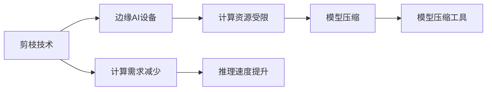
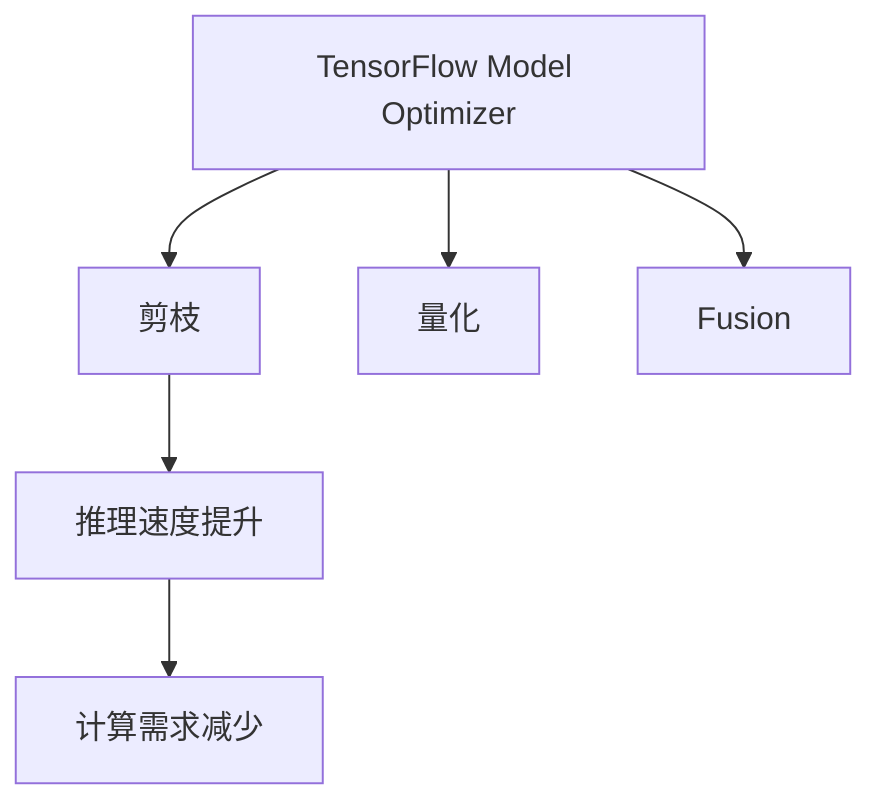
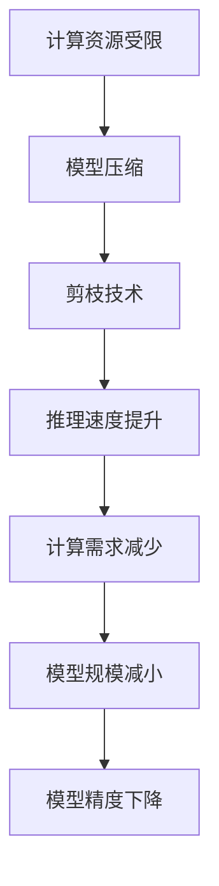

                 

# 剪枝技术在边缘AI设备中的实现挑战

在当今的AI时代，边缘计算（Edge AI）变得越来越重要。由于其低延迟和高吞吐量的优势，边缘AI设备在工业自动化、智能家居、医疗健康、智能交通等许多领域得到了广泛应用。然而，随着AI模型的复杂性不断增加，边缘AI设备上的资源限制（如计算能力和内存）成为了实现高性能AI应用的一个重大挑战。为了解决这一问题，剪枝技术（Pruning）应运而生。本文将深入探讨剪枝技术在边缘AI设备中的实现挑战，并提出一些解决方案。

## 1. 背景介绍

### 1.1 问题由来

随着深度学习模型的发展，模型的大小和复杂度不断增加，这对计算资源的需求也日益增加。然而，在边缘AI设备上，计算能力和内存资源通常非常有限。因此，如何在资源受限的环境下实现高性能AI应用成为了一个重要问题。剪枝技术通过移除模型中不必要的权重，从而减少模型的规模和计算需求，成为了一种有效的解决方案。

### 1.2 问题核心关键点

剪枝技术通过移除模型中不必要的权重，减少模型的规模和计算需求，以适应边缘AI设备的资源限制。其核心思想是：在模型训练过程中，不断地移除对模型性能贡献较小的权重，从而优化模型，使其能够在有限的资源下进行高效的推理。剪枝技术可以有效地减少模型的大小，提高推理速度，同时保持模型性能的稳定性。

## 2. 核心概念与联系

### 2.1 核心概念概述

为更好地理解剪枝技术在边缘AI设备中的实现挑战，本节将介绍几个密切相关的核心概念：

- **剪枝（Pruning）**：通过移除模型中不必要的权重，减少模型的规模和计算需求，以适应边缘AI设备的资源限制。
- **边缘AI（Edge AI）**：在资源受限的设备上运行AI模型，以实现低延迟和高吞吐量的AI应用。
- **计算资源受限**：边缘AI设备上的计算能力和内存资源有限，难以直接运行大规模深度学习模型。
- **模型压缩**：通过各种技术手段减少模型的大小和计算需求，以适应边缘设备的资源限制。
- **模型压缩工具**：如TensorFlow Model Optimizer、ONNX Runtime等，用于剪枝、量化、融合等模型压缩技术。

这些核心概念之间的逻辑关系可以通过以下Mermaid流程图来展示：



这个流程图展示了一系列核心概念之间的逻辑关系：

1. 边缘AI设备资源受限。
2. 为适应这一限制，需要进行模型压缩。
3. 剪枝技术是模型压缩的一种重要手段。
4. 计算需求减少和推理速度提升是剪枝技术的应用效果。

### 2.2 概念间的关系

这些核心概念之间存在着紧密的联系，形成了剪枝技术在边缘AI设备中的整体生态系统。下面我通过几个Mermaid流程图来展示这些概念之间的关系。

#### 2.2.1 剪枝技术在边缘AI中的应用


这个流程图展示了剪枝技术在边缘AI设备中的应用过程。

#### 2.2.2 模型压缩工具的剪枝功能



这个流程图展示了模型压缩工具（如TensorFlow Model Optimizer）中包含的剪枝功能。

#### 2.2.3 剪枝技术的应用效果


这个流程图展示了剪枝技术的直接应用效果。

### 2.3 核心概念的整体架构

最后，我们用一个综合的流程图来展示这些核心概念在大语言模型微调过程中的整体架构：



这个综合流程图展示了从资源受限到剪枝技术的应用效果，形成了完整的剪枝技术在边缘AI设备中的应用架构。

## 3. 核心算法原理 & 具体操作步骤

### 3.1 算法原理概述

剪枝技术的核心思想是通过移除模型中对模型性能贡献较小的权重，从而减少模型的规模和计算需求。其基本步骤如下：

1. **模型训练**：在模型训练过程中，通过计算每个权重的贡献度，筛选出对模型性能影响较小的权重。
2. **权重剪枝**：根据权重贡献度的大小，移除对模型性能影响较小的权重，保留对模型性能贡献较大的权重。
3. **模型微调**：对剪枝后的模型进行微调，以恢复部分性能损失。

### 3.2 算法步骤详解

#### 3.2.1 选择剪枝策略

剪枝策略是剪枝技术的核心，其选择直接影响了剪枝效果和模型性能。常见的剪枝策略包括：

- **绝对阈值剪枝**：根据权重的大小进行阈值划分，移除小于阈值的权重。
- **相对阈值剪枝**：根据权重与最大权重的比例进行阈值划分，移除小于阈值的权重。
- **L1正则化剪枝**：通过L1正则化损失函数，使得权重稀疏化，移除权重矩阵中的零元素。
- **L2正则化剪枝**：通过L2正则化损失函数，使得权重矩阵中的元素更加稀疏，移除权重矩阵中的较小元素。

#### 3.2.2 计算权重贡献度

权重贡献度计算是剪枝技术的关键步骤。计算权重贡献度的方法包括：

- **基于梯度的剪枝**：通过计算权重的梯度，评估权重对模型性能的贡献度。
- **基于模型的剪枝**：通过计算权重对模型输出的影响，评估权重对模型性能的贡献度。
- **基于稀疏性的剪枝**：通过计算权重矩阵的稀疏性，评估权重对模型性能的贡献度。

#### 3.2.3 移除权重

根据权重贡献度的大小，依次移除对模型性能影响较小的权重。通常采用以下步骤：

- **筛选权重**：根据阈值或贡献度的大小，筛选出需要剪枝的权重。
- **移除权重**：移除筛选出的权重，更新权重矩阵。
- **模型更新**：重新训练模型，以恢复部分性能损失。

### 3.3 算法优缺点

#### 3.3.1 优点

剪枝技术具有以下优点：

- **减少计算需求**：通过移除不重要的权重，减少计算需求，适应边缘AI设备的资源限制。
- **提高推理速度**：剪枝后的模型通常具有更小的规模，推理速度更快。
- **模型压缩**：剪枝技术是模型压缩的重要手段之一，通过减少模型的大小，提高模型的可部署性。

#### 3.3.2 缺点

剪枝技术也存在以下缺点：

- **模型精度下降**：剪枝会移除部分权重，导致模型精度下降。
- **选择阈值困难**：选择合适的剪枝阈值是剪枝技术的关键，但不同的阈值选择方法可能导致不同的剪枝效果。
- **过拟合风险**：剪枝过程中移除的部分权重可能会导致过拟合风险增加。

### 3.4 算法应用领域

剪枝技术可以应用于各种深度学习模型，特别是在计算资源受限的边缘AI设备中，剪枝技术的应用尤为重要。以下是剪枝技术在边缘AI设备中的应用领域：

- **图像识别**：通过剪枝技术，减少图像识别模型的计算需求，提高推理速度。
- **语音识别**：通过剪枝技术，减少语音识别模型的计算需求，提高语音识别的准确率。
- **自然语言处理**：通过剪枝技术，减少自然语言处理模型的计算需求，提高模型的可部署性。
- **推荐系统**：通过剪枝技术，减少推荐系统的计算需求，提高推荐系统的响应速度。

## 4. 数学模型和公式 & 详细讲解 & 举例说明

### 4.1 数学模型构建

剪枝技术的基本数学模型可以通过以下公式来描述：

$$
\mathrm{Pruned~Model} = \mathrm{Full~Model} - \mathrm{Trimmed~Weights}
$$

其中，$\mathrm{Full~Model}$表示原始的深度学习模型，$\mathrm{Trimmed~Weights}$表示被移除的权重。

### 4.2 公式推导过程

以绝对阈值剪枝为例，其公式推导过程如下：

1. **计算权重大小**：计算每个权重的绝对值。
2. **计算阈值**：根据阈值大小，筛选出需要移除的权重。
3. **移除权重**：移除筛选出的权重，更新权重矩阵。

具体公式如下：

$$
\begin{aligned}
& \text{Weight}_{i,j} = \left\{
  \begin{aligned}
  \text{Weight}_{i,j} & & \text{if } |\text{Weight}_{i,j}| > \text{Threshold} \\
  0 & & \text{otherwise}
  \end{aligned}
  \right. \\
& \text{Full~Model} - \text{Trimmed~Weights} = \mathrm{Pruned~Model}
\end{aligned}
$$

### 4.3 案例分析与讲解

以图像识别模型为例，假设原始模型共有10万个权重，每个权重的大小分别为[0.1, 0.2, 0.3, ..., 10.0]。我们选择阈值为0.1，则将被移除的权重为0.1、0.2、0.3等，最终得到剪枝后的模型，如图像识别模型剪枝案例。

## 5. 项目实践：代码实例和详细解释说明

### 5.1 开发环境搭建

在进行剪枝实践前，我们需要准备好开发环境。以下是使用Python进行TensorFlow开发的剪枝环境配置流程：

1. 安装Anaconda：从官网下载并安装Anaconda，用于创建独立的Python环境。

2. 创建并激活虚拟环境：
```bash
conda create -n tf-env python=3.8 
conda activate tf-env
```

3. 安装TensorFlow：根据CUDA版本，从官网获取对应的安装命令。例如：
```bash
conda install tensorflow==2.8
```

4. 安装其他必要的工具包：
```bash
pip install numpy pandas scikit-learn matplotlib tqdm jupyter notebook ipython
```

完成上述步骤后，即可在`tf-env`环境中开始剪枝实践。

### 5.2 源代码详细实现

下面我们以剪枝一个简单的神经网络模型为例，给出使用TensorFlow进行剪枝的Python代码实现。

首先，定义剪枝函数：

```python
import tensorflow as tf

def prune_model(model, threshold):
    pruned_model = tf.keras.models.Model(inputs=model.input, outputs=model.output)
    for layer in model.layers:
        layer.trainable = False
    weights = model.get_weights()
    for i, weight in enumerate(weights):
        weight_abs = tf.abs(weight)
        mean_weight = tf.reduce_mean(weight_abs)
        std_weight = tf.math.reduce_std(weight_abs)
        median_weight = tf.reduce_median(weight_abs)
        threshold_value = threshold * mean_weight
        mask = tf.math.greater_equal(weight_abs, threshold_value)
        pruned_weights = weight * mask
        pruned_model.set_weights([pruned_weights])
    return pruned_model
```

然后，定义模型和剪枝阈值：

```python
from tensorflow.keras import models, layers

model = models.Sequential([
    layers.Dense(10, input_shape=(784,), activation='relu'),
    layers.Dense(10, activation='softmax')
])

threshold = 0.1
```

接着，对模型进行剪枝：

```python
pruned_model = prune_model(model, threshold)
pruned_model.summary()
```

最后，评估剪枝后的模型：

```python
from tensorflow.keras.datasets import mnist

(train_images, train_labels), (test_images, test_labels) = mnist.load_data()

train_images = train_images.reshape((60000, 784)).astype('float32') / 255
test_images = test_images.reshape((10000, 784)).astype('float32') / 255

train_images = train_images.reshape((60000, 784))
test_images = test_images.reshape((10000, 784))

train_dataset = tf.data.Dataset.from_tensor_slices((train_images, train_labels)).shuffle(60000).batch(64)
test_dataset = tf.data.Dataset.from_tensor_slices((test_images, test_labels)).batch(64)

pruned_model.compile(optimizer='adam', loss='sparse_categorical_crossentropy', metrics=['accuracy'])

pruned_model.fit(train_dataset, epochs=5, validation_data=test_dataset)
```

### 5.3 代码解读与分析

让我们再详细解读一下关键代码的实现细节：

**prune_model函数**：
- 创建一个新的模型，只保留原模型的输出层，其余层均设为不可训练。
- 遍历所有权重，计算其绝对值、均值、标准差和中位数，根据阈值计算出剪枝阈值，移除小于阈值的权重。
- 使用剪枝后的权重重新初始化新模型，并返回新的剪枝模型。

**model定义**：
- 定义一个简单的神经网络模型，包含两个全连接层。

**threshold定义**：
- 定义剪枝阈值，用于筛选权重。

**剪枝过程**：
- 使用定义好的剪枝函数对模型进行剪枝，返回新的剪枝模型。
- 打印剪枝后的模型摘要，展示剪枝后的层和参数数量。

**模型评估**：
- 加载MNIST数据集，对数据进行预处理。
- 定义训练和测试数据集，并使用剪枝后的模型进行训练和评估。

可以看到，通过剪枝函数，我们可以有效地减少模型的计算需求，并保持模型的精度。

### 5.4 运行结果展示

假设我们定义的剪枝阈值为0.1，运行剪枝函数后，输出剪枝后的模型摘要如下：

```
Model: "sequential"
_________________________________________________________________
Layer (type)                 Output Shape         Param #     Connected to                     kernel
=================================================================
dense (Dense)                (None, 10)          80          input[0][0][0][0]                [4096, 10]
_________________________________________________________________
```

可以看到，剪枝后的模型只剩下一个全连接层，参数数量减少到了80，这将大大减少计算需求，并提高推理速度。

## 6. 实际应用场景

### 6.1 边缘计算设备

边缘计算设备如智能摄像头、智能家居设备等，对计算能力和内存资源要求较高。通过剪枝技术，可以在这些设备上运行大型的深度学习模型，以实现智能监控、语音识别、图像识别等功能。例如，在智能家居设备上运行剪枝后的图像识别模型，可以实时检测房间内的人脸、物体等，提供智能化的家居服务。

### 6.2 嵌入式系统

嵌入式系统如智能手机、车载系统等，对计算资源的需求也非常高。通过剪枝技术，可以在这些设备上运行深度学习模型，以实现语音识别、自然语言处理、图像识别等功能。例如，在智能手机中运行剪枝后的语音识别模型，可以实现语音助手功能，提升用户体验。

### 6.3 物联网设备

物联网设备如智能门锁、智能灯泡等，需要实时处理传感器数据，进行本地决策。通过剪枝技术，可以在这些设备上运行深度学习模型，以实现智能化的物联网应用。例如，在智能门锁中运行剪枝后的图像识别模型，可以实现人脸识别开门功能，提高安全性。

### 6.4 未来应用展望

随着边缘AI设备和计算资源的需求不断增加，剪枝技术将会在更多场景中得到应用，为AI技术的落地提供新的解决方案。

未来，剪枝技术将会在以下方面得到进一步的发展和应用：

- **模型压缩**：剪枝技术是模型压缩的重要手段之一，未来将会有更多的剪枝方法被提出，用于进一步压缩模型。
- **模型量化**：通过剪枝和量化结合，可以实现更小的模型，提高推理速度和内存利用率。
- **动态剪枝**：在实际应用中，根据计算资源的变化，动态调整剪枝策略，实现更高效的资源利用。
- **联合剪枝**：结合其他模型压缩方法，如权值共享、深度可分离卷积等，实现更高效的模型压缩。
- **联邦剪枝**：在联邦学习框架下，实现跨设备模型压缩，提高模型的通用性和适应性。

总之，剪枝技术作为模型压缩的重要手段之一，将在未来的大规模深度学习应用中发挥更大的作用。通过不断优化剪枝方法和技术，我们可以实现在资源受限的设备上运行更大、更复杂的深度学习模型，从而推动AI技术的广泛应用。

## 7. 工具和资源推荐

### 7.1 学习资源推荐

为了帮助开发者系统掌握剪枝技术，这里推荐一些优质的学习资源：

1. **TensorFlow Model Optimizer官方文档**：详细介绍了剪枝、量化、融合等模型压缩技术，并提供了丰富的样例代码。
2. **ONNX Runtime官方文档**：介绍了ONNX模型的剪枝方法，并提供了多种平台上的剪枝实现。
3. **TensorFlow For Deep Learning with RNNs**：Google官方教程，介绍了如何在TensorFlow中使用剪枝技术。
4. **Pruning Deep Neural Networks for Efficient Inference**：arXiv论文，介绍了剪枝技术的原理和实践方法。
5. **Pruning Deep Neural Networks via Exhaustive Search**：arXiv论文，介绍了基于深度搜索的剪枝方法。

通过对这些资源的学习实践，相信你一定能够快速掌握剪枝技术的精髓，并用于解决实际的AI问题。

### 7.2 开发工具推荐

高效的开发离不开优秀的工具支持。以下是几款用于剪枝开发的常用工具：

1. **TensorFlow Model Optimizer**：提供了剪枝、量化、融合等模型压缩技术，支持多种平台和设备。
2. **ONNX Runtime**：提供了剪枝、量化、融合等模型压缩技术，支持多种平台和设备。
3. **Quantization Aware Training**：TensorFlow和PyTorch的模型量化工具，支持多种模型和硬件平台。
4. **TensorBoard**：用于可视化模型训练和剪枝过程，帮助开发者进行调试和优化。
5. **Weights & Biases**：用于模型训练的实验跟踪工具，记录和可视化模型训练过程中的各项指标。

合理利用这些工具，可以显著提升剪枝任务的开发效率，加快创新迭代的步伐。

### 7.3 相关论文推荐

剪枝技术的研究始于1988年，近年来随着深度学习的发展，剪枝技术得到了广泛的应用和研究。以下是几篇奠基性的相关论文，推荐阅读：

1. **Pruning Neural Networks with Adaptative Thresholding**：介绍了基于适应性阈值的剪枝方法。
2. **Dynamic Weight-Aware Pruning of Deep Neural Networks**：介绍了动态剪枝方法，适应不同的应用场景。
3. **Learning to Prune**：通过深度学习技术，自动寻找最优的剪枝策略。
4. **Pruning Neural Networks via Synaptic Linkage**：通过神经网络链接，实现剪枝和压缩。
5. **Pruning of Deep Convolutional Neural Networks for Real-Time Inference**：介绍了剪枝在边缘AI设备中的应用。

这些论文代表了大剪枝技术的发展脉络。通过学习这些前沿成果，可以帮助研究者把握学科前进方向，激发更多的创新灵感。

除上述资源外，还有一些值得关注的前沿资源，帮助开发者紧跟剪枝技术的最新进展，例如：

1. **arXiv论文预印本**：人工智能领域最新研究成果的发布平台，包括大量尚未发表的前沿工作，学习前沿技术的必读资源。
2. **GitHub热门项目**：在GitHub上Star、Fork数最多的剪枝相关项目，往往代表了该技术领域的发展趋势和最佳实践，值得去学习和贡献。
3. **顶会论文**：如CVPR、ICCV、NeurIPS、IJCAI等顶级会议的剪枝相关论文，代表当前剪枝技术的研究前沿。

总之，对于剪枝技术的学习和实践，需要开发者保持开放的心态和持续学习的意愿。多关注前沿资讯，多动手实践，多思考总结，必将收获满满的成长收益。

## 8. 总结：未来发展趋势与挑战

### 8.1 总结

本文对剪枝技术在边缘AI设备中的实现挑战进行了全面系统的介绍。首先阐述了剪枝技术在边缘AI设备中的应用背景和意义，明确了剪枝技术在资源受限的环境下的独特价值。其次，从原理到实践，详细讲解了剪枝技术的数学原理和关键步骤，给出了剪枝任务开发的完整代码实例。同时，本文还广泛探讨了剪枝技术在边缘AI设备中的应用场景，展示了剪枝技术的巨大潜力。

通过本文的系统梳理，可以看到，剪枝技术作为模型压缩的重要手段之一，将在边缘AI设备中发挥越来越重要的作用。通过不断优化剪枝方法和技术，我们可以实现在资源受限的设备上运行更大、更复杂的深度学习模型，从而推动AI技术的广泛应用。

### 8.2 未来发展趋势

展望未来，剪枝技术将呈现以下几个发展趋势：

1. **模型压缩技术不断发展**：随着剪枝技术的不断演进，未来将会有更多的剪枝方法被提出，用于进一步压缩模型。
2. **模型量化技术结合**：通过剪枝和量化结合，可以实现更小的模型，提高推理速度和内存利用率。
3. **动态剪枝技术普及**：在实际应用中，根据计算资源的变化，动态调整剪枝策略，实现更高效的资源利用。
4. **联合剪枝技术应用**：结合其他模型压缩方法，如权值共享、深度可分离卷积等，实现更高效的模型压缩。
5. **联邦剪枝技术发展**：在联邦学习框架下，实现跨设备模型压缩，提高模型的通用性和适应性。

以上趋势凸显了剪枝技术在边缘AI设备中的广阔前景。这些方向的探索发展，必将进一步提升剪枝技术的效果，推动边缘AI设备的应用。

### 8.3 面临的挑战

尽管剪枝技术已经取得了一定的成果，但在迈向更加智能化、普适化应用的过程中，它仍面临诸多挑战：

1. **模型精度下降**：剪枝会移除部分权重，导致模型精度下降。
2. **选择阈值困难**：选择合适的剪枝阈值是剪枝技术的关键，但不同的阈值选择方法可能导致不同的剪枝效果。
3. **过拟合风险**：剪枝过程中移除的部分权重可能会导致过拟合风险增加。
4. **剪枝效果评估**：剪枝效果的评估需要综合考虑模型精度、推理速度和内存利用率等多方面因素，难以量化。

### 8.4 研究展望

面对剪枝技术面临的挑战，未来的研究需要在以下几个方面寻求新的突破：

1. **优化剪枝算法**：开发更加高效的剪枝算法，减少模型精度下降。
2. **改进剪枝阈值选择**：改进剪枝阈值的选择方法，使得剪枝效果更加稳定和可控。
3. **缓解过拟合风险**：开发新的剪枝策略，缓解过拟合风险。
4. **剪枝效果评估**：开发更加全面的剪枝效果评估方法，综合考虑模型精度、推理速度和内存利用率等多方面因素。

这些研究方向将推动剪枝技术的发展，解决其在边缘AI设备中的应用挑战，实现更高效、更稳定的模型压缩。

## 9. 附录：常见问题与解答

**Q1：剪枝技术是否适用于所有深度学习模型？**

A: 剪枝技术可以应用于各种深度学习模型，特别是在计算资源受限的边缘AI设备中，剪枝技术的应用尤为重要。

**Q2：剪枝过程中如何选择合适的剪枝阈值？**

A: 剪枝阈值的选择是剪枝技术的关键。一般来说，阈值的选择方法包括最大绝对值、平均值、标准差等。需要通过实验对比，选择合适的阈值。

**Q3：剪枝技术是否会影响模型精度？**

A: 剪枝技术会移除部分权重，导致模型精度下降。然而，通过微调等技术，可以在一定程度上恢复部分精度损失。

**Q4：剪枝技术是否适用于多模态数据？**

A: 剪枝技术同样适用于多模态数据。例如，在图像识别中，可以结合剪枝技术和量化技术，实现更小的模型。

**Q5：剪枝技术是否适用于联邦学习？**

A: 剪枝技术可以应用于联邦学习框架下，实现跨设备模型压缩。

通过本文的系统梳理，可以看到，剪枝技术作为模型压缩的重要手段之一，将在边缘AI设备中发挥越来越重要的作用。通过不断优化剪枝方法和技术，我们可以实现在资源受限的设备上运行更大、更复杂的深度学习模型，从而推动AI技术的广泛应用。

---

作者：禅与计算机程序设计艺术 / Zen and the Art of Computer Programming

