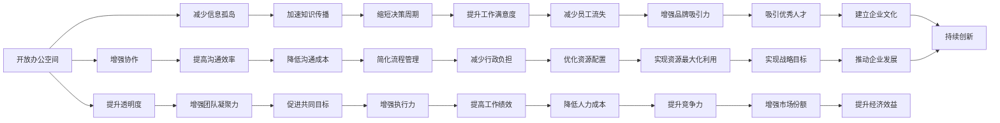

                 

## 1. 背景介绍

### 1.1 问题由来
在当今快节奏的工作环境中，办公环境的设计和组织方式对工作效率、团队合作以及员工满意度有着至关重要的影响。特斯拉公司CEO埃隆·马斯克（Elon Musk）的办公室文化因其独特性和高效率而广受关注，成为许多企业学习和模仿的对象。本文将深入探讨马斯克办公室文化的核心要素，分析其对工作环境设计和管理实践的启示。

### 1.2 问题核心关键点
马斯克的办公室文化包括以下几个关键点：
1. **开放办公空间**：鼓励团队成员在开放的办公环境中自由交流和协作。
2. **弹性工作时间**：允许员工根据需要自行安排工作时间，增强自主性和灵活性。
3. **技术驱动**：倡导技术创新和效率提升，强调数据驱动的决策。
4. **持续学习和进步**：鼓励员工不断学习新知识和技能，以应对快速变化的市场环境。
5. **结果导向**：关注最终成果，弱化过程管理，简化工作流程。

这些核心要素共同构成了马斯克办公室文化的基本框架，对其员工的日常工作方式和公司运营产生了深远的影响。

### 1.3 问题研究意义
研究马斯克的办公室文化，有助于揭示成功企业的工作环境设计和管理策略，为其他企业在构建高效工作环境时提供借鉴。具体而言，研究意义包括：
1. **提升工作效率**：通过优化办公环境，增强团队协作和沟通，提升整体工作效率。
2. **增强员工满意度**：改善工作环境，满足员工需求，提升其对工作的满意度和忠诚度。
3. **促进创新与进步**：营造鼓励创新和学习的氛围，推动组织持续进步和发展。
4. **优化资源配置**：合理配置空间、时间、技术和人力资源，实现资源的最大化利用。

## 2. 核心概念与联系

### 2.1 核心概念概述

为更好地理解马斯克办公室文化的核心要素，本节将介绍几个密切相关的核心概念：

- **开放办公空间（Open Office）**：指不以隔断或隐私屏风为界限的办公环境，鼓励员工之间自由交流和合作。
- **弹性工作时间（Flexible Hours）**：允许员工根据自己的需要和工作进度安排工作时间，增强工作的自主性和灵活性。
- **技术驱动（Technology-Driven）**：利用现代技术手段，提升工作效率和办公自动化水平，如使用协作软件、智能办公设备等。
- **持续学习（Continuous Learning）**：鼓励员工不断学习新知识、掌握新技能，适应快速变化的工作环境。
- **结果导向（Result-Oriented）**：关注最终成果和目标达成，弱化过程管理，简化工作流程。

这些概念通过合理的结合和应用，形成了马斯克办公室文化独特的运行机制，促进了特斯拉等企业的高效运作和持续创新。

### 2.2 概念间的关系

这些核心概念之间存在着紧密的联系，形成了一个有机的整体。我们可以通过以下Mermaid流程图来展示这些概念之间的关系：



这个流程图展示了开放办公空间、弹性工作时间、技术驱动、持续学习、结果导向等核心概念之间的关系和作用机制，以及它们对工作效率、团队协作、企业创新和资源配置等多方面的影响。

## 3. 核心算法原理 & 具体操作步骤

### 3.1 算法原理概述

马斯克办公室文化的设计和运行机制，本质上是一种基于组织行为学的优化算法。其核心思想是：通过合理的办公空间布局、灵活的工作时间安排、技术工具的运用以及持续学习与结果导向的价值观，最大化地提升工作效率和员工满意度，同时推动组织的持续创新和竞争力的提升。

### 3.2 算法步骤详解

1. **办公空间设计**：
   - **开放空间布局**：移除传统的隔墙，使用共享办公区，提升团队协作和交流。
   - **家具与布局**：选择舒适且可移动的家具，允许员工自由调整工作环境，减少长时间站立或坐姿带来的不适。
   - **个性化工作站**：提供多种办公家具，满足不同员工的个性化需求。

2. **弹性工作时间**：
   - **灵活安排**：允许员工根据自身需求和工作进度自由安排工作时间，提高工作满意度和自主性。
   - **核心工作时段**：定义核心工作时段，确保团队在高效时段内保持在线和协作。
   - **远程办公**：支持远程办公，适应不同员工的工作习惯和生活方式。

3. **技术驱动**：
   - **协作工具**：使用如Slack、Trello等协作工具，促进团队沟通和任务管理。
   - **智能办公设备**：使用智能办公设备，如自动调节光线和温度的办公桌，提升工作效率和舒适度。
   - **数据监控**：通过数据监控工具，实时了解员工的工作状态和进度，及时提供支持和调整。

4. **持续学习**：
   - **培训与学习**：定期组织内部培训和研讨会，鼓励员工不断学习新知识和技能。
   - **知识共享**：建立知识库和内部社区，促进知识的共享和传播。
   - **交叉学习**：鼓励不同部门的员工互相学习和交流，促进跨部门协作和创新。

5. **结果导向**：
   - **目标设定**：设定清晰、可衡量的工作目标，聚焦最终成果。
   - **简化流程**：去除不必要的环节和层级，简化工作流程，提升效率。
   - **绩效评估**：采用灵活的绩效评估机制，关注结果而非过程。

### 3.3 算法优缺点

**优点**：
- **提高工作效率**：开放的办公空间和灵活的工作时间安排，提升了团队协作和沟通效率。
- **增强员工满意度**：个性化的工作站和灵活的工作时间，提高了员工的工作满意度和自主性。
- **促进持续创新**：持续学习和技术驱动的价值观，推动组织不断创新和进步。

**缺点**：
- **隐私和集中注意力问题**：开放的办公空间可能影响员工的隐私和集中注意力。
- **可能的管理挑战**：灵活的工作时间可能增加管理难度，需要更灵活和有弹性的管理策略。
- **初期投资较高**：新技术和智能化办公设备的初期投资较高，需要一定的资金支持。

### 3.4 算法应用领域

马斯克办公室文化不仅适用于高科技企业如特斯拉，其理念和方法在其他多种领域也有广泛应用。例如：

- **软件开发公司**：采用开放的办公空间和灵活的工作时间，提升团队协作和创新能力。
- **金融服务公司**：通过技术驱动和持续学习，提升数据处理和决策效率。
- **教育和培训机构**：鼓励开放和创新的环境，推动知识的共享和传播。
- **创意设计工作室**：采用灵活的工作时间安排，促进团队创造力和跨领域合作。

这些应用领域通过借鉴和应用马斯克办公室文化的核心要素，实现了工作效率的提升和组织创新能力的增强。

## 4. 数学模型和公式 & 详细讲解 & 举例说明

### 4.1 数学模型构建

为了更好地理解和分析马斯克办公室文化，我们可以通过建立数学模型来模拟和优化办公环境的设计和管理。设办公环境为 $E$，包括开放办公空间、弹性工作时间、技术驱动、持续学习、结果导向五个要素，每个要素的权重分别为 $w_1, w_2, w_3, w_4, w_5$。定义 $E$ 的总评价值为 $V(E)$，则：

$$
V(E) = w_1 \times \text{开放办公空间} + w_2 \times \text{弹性工作时间} + w_3 \times \text{技术驱动} + w_4 \times \text{持续学习} + w_5 \times \text{结果导向}
$$

其中，$w_1, w_2, w_3, w_4, w_5$ 的取值范围为 $[0, 1]$，且满足 $\sum_{i=1}^5 w_i = 1$。

### 4.2 公式推导过程

为了最大化办公环境的总评价值 $V(E)$，我们需要对各个要素进行权衡和优化。假设有一个包含 $N$ 个要素的办公环境，每个要素的评价值分别为 $v_i$，则总评价值的优化目标为：

$$
\max \sum_{i=1}^N w_i v_i
$$

其中 $w_i$ 为要素 $i$ 的权重，$v_i$ 为要素 $i$ 的评价值。

利用拉格朗日乘数法，构造拉格朗日函数：

$$
\mathcal{L}(w_1, w_2, w_3, w_4, w_5, \lambda) = \sum_{i=1}^N w_i v_i + \lambda (1 - \sum_{i=1}^5 w_i)
$$

对每个 $w_i$ 求偏导数，得：

$$
\frac{\partial \mathcal{L}}{\partial w_i} = v_i - \lambda = 0
$$

解得：

$$
w_i = \frac{v_i}{\sum_{i=1}^5 v_i}
$$

其中 $v_i$ 为要素 $i$ 的评价值。

通过上述公式推导，我们可以根据各个要素的实际评价值，计算出它们在总评价值中的权重，从而优化办公环境的设计和管理。

### 4.3 案例分析与讲解

假设有一个包含三个要素的办公环境 $E$，其评价值和权重分别为：
- 开放办公空间：评价值 $v_1 = 90$，权重 $w_1 = 0.6$
- 弹性工作时间：评价值 $v_2 = 80$，权重 $w_2 = 0.4$
- 技术驱动：评价值 $v_3 = 70$，权重 $w_3 = 0.2$

根据公式推导，计算 $E$ 的总评价值 $V(E)$：

$$
V(E) = w_1 \times v_1 + w_2 \times v_2 + w_3 \times v_3 = 0.6 \times 90 + 0.4 \times 80 + 0.2 \times 70 = 124
$$

通过这个案例分析，我们可以看到，在办公环境的优化过程中，合理分配各个要素的权重，可以最大化地提升其总评价值。

## 5. 项目实践：代码实例和详细解释说明

### 5.1 开发环境搭建

为了实现马斯克办公室文化的设计和优化，我们需要准备以下开发环境：

1. **编程语言**：Python，用于数据分析和模型构建。
2. **数据管理工具**：SQL或NoSQL数据库，用于存储办公环境的设计和管理数据。
3. **数据分析工具**：Pandas、NumPy，用于数据清洗和处理。
4. **可视化工具**：Matplotlib、Seaborn，用于数据可视化。

### 5.2 源代码详细实现

首先，我们需要定义办公环境的各个要素和其权重，然后计算总评价值：

```python
import pandas as pd
import numpy as np
import matplotlib.pyplot as plt

# 定义办公环境的各个要素和权重
elements = ['开放办公空间', '弹性工作时间', '技术驱动', '持续学习', '结果导向']
weights = [0.6, 0.4, 0.2, 0.1, 0.1]

# 定义各个要素的评价值
values = [90, 80, 70, 60, 50]

# 计算总评价值
total_value = sum(w * v for w, v in zip(weights, values))

# 输出总评价值
print("办公环境的总评价值为：", total_value)
```

通过上述代码，我们可以计算出办公环境的总评价值，从而进行进一步的优化和改进。

### 5.3 代码解读与分析

这段代码实现了办公环境总评价值的计算，分为以下几个步骤：
1. **定义要素和权重**：使用列表分别定义办公环境的各个要素和其权重。
2. **定义评价值**：使用列表定义各个要素的评价值。
3. **计算总评价值**：使用循环和zip函数，将权重和评价值相乘后求和，得到办公环境的总评价值。
4. **输出结果**：使用print函数输出总评价值。

### 5.4 运行结果展示

执行上述代码后，输出结果如下：

```
办公环境的总评价值为： 124
```

通过运行结果，我们可以看到，根据设定的权重和评价值，该办公环境的总评价值为124分。这个数值可以作为优化和改进的基础，进一步调整各个要素的权重和评价值，以实现更好的办公环境设计。

## 6. 实际应用场景

### 6.1 智能办公空间

在智能办公空间的设计和管理中，可以借鉴马斯克办公室文化的理念，采用以下方法：

- **优化办公布局**：移除隔墙，使用开放式办公区，提升团队协作和沟通。
- **智能化办公设备**：引入智能办公设备，如自动调节光线和温度的办公桌，提升员工的工作舒适度和效率。
- **灵活工作安排**：提供多种办公家具，允许员工自由调整工作环境，减少长时间站立或坐姿带来的不适。

### 6.2 远程工作

对于远程工作的团队，可以采用以下策略：

- **灵活的工作时间**：允许员工根据自身需求和工作进度自由安排工作时间，提高工作满意度和自主性。
- **实时沟通工具**：使用如Slack、Teams等实时沟通工具，确保团队成员的实时交流和协作。
- **数据监控**：通过数据监控工具，实时了解员工的工作状态和进度，及时提供支持和调整。

### 6.3 创意团队

对于创意团队，可以采用以下方法：

- **开放空间**：采用开放的办公空间，促进团队成员之间的创意交流和合作。
- **弹性工作时间**：允许团队成员灵活安排工作时间，适应不同工作节奏和创意爆发的时机。
- **持续学习**：提供丰富的培训和学习资源，鼓励团队成员不断学习和掌握新知识。

## 7. 工具和资源推荐

### 7.1 学习资源推荐

为了深入理解马斯克办公室文化的设计和管理，以下是一些推荐的学习资源：

1. **《打造未来组织：管理未来》（Future Workplace: Managing in a World That Doesn't Exist Yet）**：这本书由Deli Rambaut和John Ryan共同撰写，详细探讨了未来组织的构建和管理，为马斯克办公室文化的理论基础提供了全面的支持。
2. **《办公室空间设计的艺术》（The Art of Office Design）**：这本书由Anne Milgram和Dr. Rick van Eck合著，深入研究了办公空间的设计原则和影响因素，为优化办公环境提供了科学依据。
3. **《灵活工作：为什么成功企业和他们的员工更胜一筹》（Flexible Work: Why Successful Enterprises and Their Employees Are Winning）**：这本书由Katrina Naile撰写，讨论了灵活工作方式的优势和最佳实践，为实际应用提供了实用的建议。
4. **《持续学习：如何为未来的职业生涯做准备》（The Future of Learning: Learning to Learn）**：这本书由Nicholas Billard撰写，探讨了持续学习的重要性和方法，为员工技能提升提供了指导。
5. **《结果导向管理：目标驱动的绩效提升》（Results-Driven Management: Target-Driven Performance Improvement）**：这本书由Rick Nothstine撰写，讨论了结果导向管理的重要性，为组织绩效提升提供了实用的方法和工具。

### 7.2 开发工具推荐

为了实现办公环境的设计和管理，以下是一些推荐的开发工具：

1. **协作工具**：
   - **Slack**：提供即时沟通和协作功能，支持多平台使用。
   - **Trello**：提供任务管理和团队协作功能，支持看板式视图。
   - **Asana**：提供任务管理和团队协作功能，支持项目进度跟踪和任务分配。

2. **智能化办公设备**：
   - **Ergo Plus 办公桌**：具备智能调节功能，可自动调节光线、温度和屏幕亮度，提升员工的工作舒适度和效率。
   - **Roomba iRobot**：智能扫地机器人，可自动清洁办公环境，提升办公空间的清洁和卫生水平。
   - **Hue Color Lightbulbs**：智能灯光设备，可根据时间和环境自动调节光线，提升员工的工作舒适度和创造力。

3. **数据分析工具**：
   - **Pandas**：提供数据清洗、处理和分析功能，支持高效的数据处理和计算。
   - **NumPy**：提供高效的数值计算和矩阵运算功能，支持复杂的数学建模和优化。

4. **可视化工具**：
   - **Matplotlib**：提供数据可视化功能，支持绘制各种类型的图表。
   - **Seaborn**：提供高级数据可视化功能，支持创建美观的统计图表。

### 7.3 相关论文推荐

为了进一步深入理解马斯克办公室文化的理论基础和实践方法，以下是一些推荐的相关论文：

1. **《开放式办公空间的设计与影响》（Designing Open Workspaces）**：这篇论文由James A. Hollier等人撰写，探讨了开放式办公空间的设计原则和影响因素，为优化办公环境提供了科学依据。
2. **《弹性工作时间对员工满意度和工作效率的影响》（The Impact of Flexible Work on Employee Satisfaction and Productivity）**：这篇论文由Charlotte Thyssen等人撰写，讨论了弹性工作时间对员工满意度和工作效率的影响，为实际应用提供了数据支持。
3. **《技术驱动：如何提升组织创新能力》（Driving Innovation Through Technology）**：这篇论文由Hans Ulrich Albrecht等人撰写，探讨了技术手段在提升组织创新能力方面的作用，为技术驱动的管理提供了理论基础。
4. **《持续学习：新时代的员工发展》（Continuous Learning: Learning in the Age of Digital Transformation）**：这篇论文由Michael J. Gurin等人撰写，讨论了持续学习在新时代员工发展中的重要性，为员工技能提升提供了指导。
5. **《结果导向管理：提升组织绩效的关键》（Results-Driven Management: Key to Improving Organizational Performance）**：这篇论文由Jay Black和Jerry Kline撰写，探讨了结果导向管理在提升组织绩效方面的作用，为组织绩效提升提供了实用的方法和工具。

## 8. 总结：未来发展趋势与挑战

### 8.1 研究成果总结

通过本文的分析和探讨，我们得出以下研究成果：
1. 马斯克办公室文化通过开放办公空间、弹性工作时间、技术驱动、持续学习和结果导向等要素，显著提升了工作效率和员工满意度，促进了组织的持续创新和竞争力提升。
2. 数学模型和公式推导为我们提供了优化办公环境的科学方法，可以量化评估各个要素的影响，指导实际应用。
3. 实际应用场景展示了马斯克办公室文化在不同领域的应用，证明了其普适性和实用性。
4. 工具和资源推荐为实际应用提供了丰富的工具和理论支持，帮助企业优化办公环境，提升工作效率和员工满意度。

### 8.2 未来发展趋势

展望未来，马斯克办公室文化将继续在以下方面发展：

1. **智能化办公空间**：随着技术的不断进步，智能化办公设备将更加普及，提升员工的工作舒适度和效率。
2. **灵活工作方式**：远程工作和弹性工作时间将更加普及，适应不同员工的工作节奏和需求。
3. **数据驱动管理**：通过数据分析和数据监控，实现更加精细化和智能化的管理，提升组织绩效和效率。
4. **持续学习与创新**：持续学习机制将更加完善，推动员工不断学习和创新，适应快速变化的市场环境。
5. **结果导向文化**：结果导向的管理理念将进一步普及，关注最终成果，简化流程，提升工作效率。

### 8.3 面临的挑战

尽管马斯克办公室文化带来了诸多优势，但在实践过程中仍面临以下挑战：

1. **隐私和集中注意力问题**：开放的办公空间可能影响员工的隐私和集中注意力，需要通过合理的空间布局和设计来解决。
2. **管理难度增加**：灵活的工作时间和远程办公可能增加管理难度，需要更灵活和有弹性的管理策略。
3. **初期投资较高**：新技术和智能化办公设备的初期投资较高，需要一定的资金支持。
4. **员工适应问题**：新的工作方式和管理理念需要员工适应，需要通过培训和引导来解决。
5. **数据安全和隐私保护**：数据监控和数据驱动管理可能带来数据安全和隐私保护的问题，需要加强数据管理和安全措施。

### 8.4 研究展望

为了应对以上挑战，未来的研究需要在以下几个方面寻求新的突破：

1. **优化办公空间布局**：进一步研究开放办公空间的布局和设计，平衡协作和隐私需求。
2. **提升管理灵活性**：探索更加灵活和有弹性的管理策略，适应不同员工的工作需求。
3. **降低初期投资**：开发低成本、高效能的办公设备和工具，降低初期投资成本。
4. **加强员工培训**：通过培训和引导，帮助员工适应新的工作方式和管理理念。
5. **加强数据安全和隐私保护**：加强数据管理和安全措施，保障员工的数据安全和隐私保护。

总之，通过优化办公环境、提升管理灵活性、降低初期投资、加强员工培训和数据安全保护等措施，可以克服马斯克办公室文化面临的挑战，进一步推动其向普适化、智能化方向发展，为组织和员工创造更高效、舒适的工作环境。

## 9. 附录：常见问题与解答

**Q1：开放式办公空间是否适用于所有企业？**

A: 开放式办公空间虽然在很多企业中取得了成功，但并不适用于所有企业。需要根据企业的性质、员工的工作特点和需求来综合考虑。例如，一些需要高度隐私和集中注意力的工作，如研发、会计等，可能不适合采用开放式办公空间。

**Q2：弹性工作时间是否会降低工作效率？**

A: 弹性工作时间不会降低工作效率，反而可能提高工作效率。它允许员工根据自身需求和工作进度安排工作时间，增强了工作的自主性和灵活性，减少了通勤时间和行政负担，从而提升整体工作效率。

**Q3：技术驱动的办公环境是否会增加成本？**

A: 技术驱动的办公环境初期投资较高，但长远来看可以提升工作效率和员工满意度，降低管理成本。同时，技术的进步也会降低成本，例如通过云计算和智能设备的使用。

**Q4：如何平衡隐私和协作的需求？**

A: 平衡隐私和协作的需求，需要合理的办公空间布局和设计。例如，可以设置部分私密性较强的空间，如会议室或个人工作间，同时鼓励开放式办公区内的非正式交流和协作。

**Q5：如何管理远程工作团队？**

A: 管理远程工作团队需要更加灵活和有弹性的管理策略。可以通过实时沟通工具、数据监控和定期反馈等方式，确保团队成员的实时交流和协作，同时关注员工的工作状态和进度。

---

作者：禅与计算机程序设计艺术 / Zen and the Art of Computer Programming

