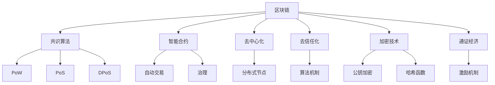
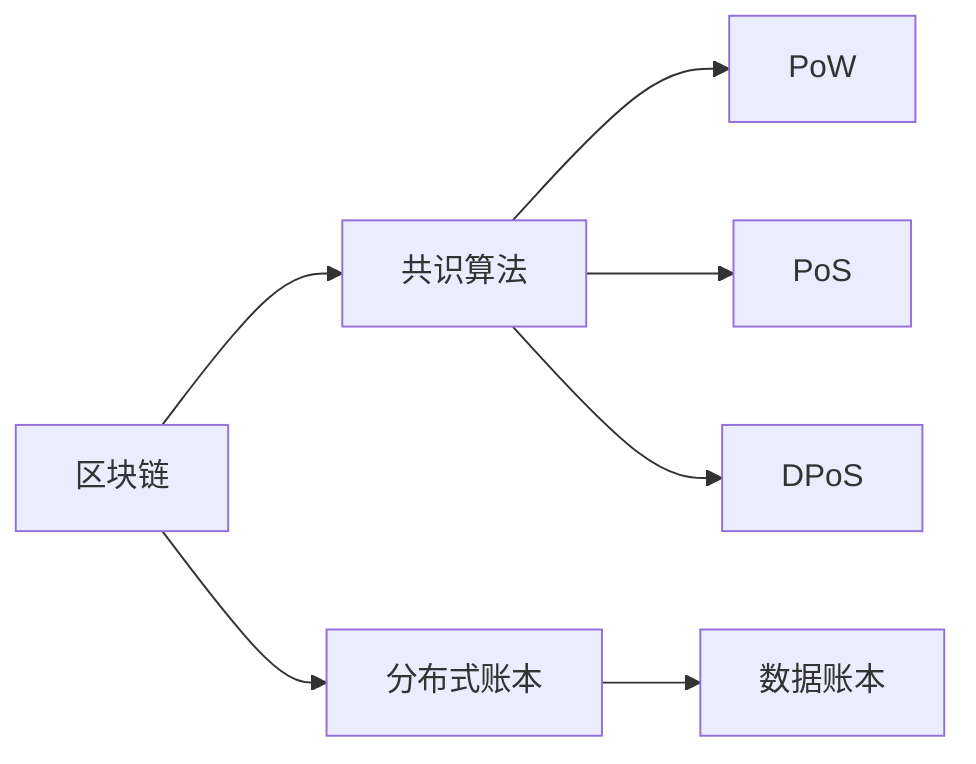
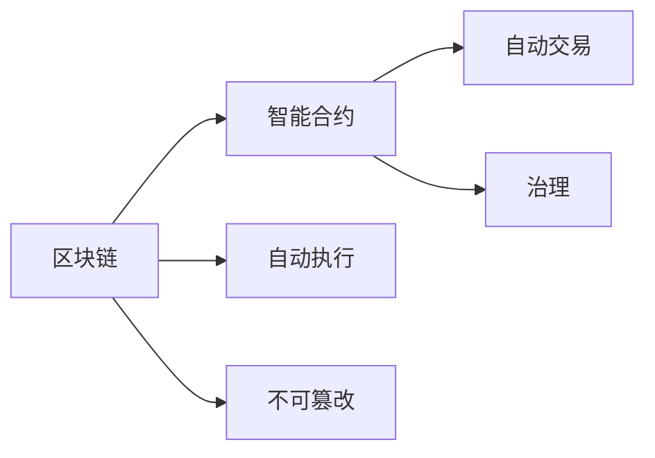
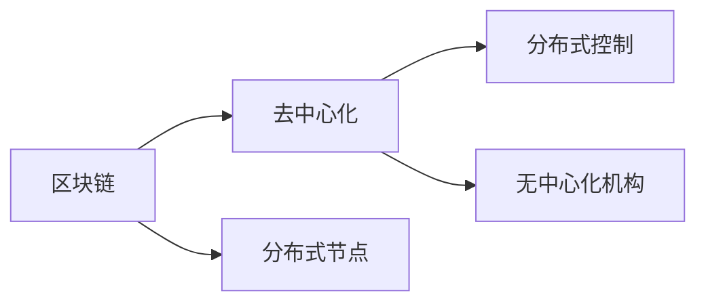
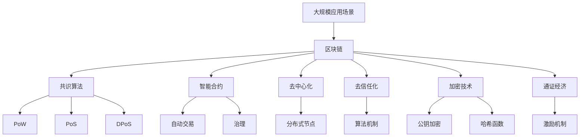

                 

# 区块链 (Blockchain)

> 关键词：区块链, 共识算法, 智能合约, 分布式账本, 去中心化, 去信任, 加密技术, 通证经济

## 1. 背景介绍

### 1.1 问题由来
区块链作为分布式账本技术，自2008年被中本聪(Satoshi Nakamoto)提出以来，在短短十几年内经历了飞速发展。从最初的数字货币比特币(Bitcoin)，到智能合约、去中心化金融(DeFi)、供应链金融、身份认证、版权保护等众多领域的应用，区块链技术以其独特的优势迅速占领了科技界的制高点。

然而，区块链技术在快速发展的过程中，也暴露出许多问题和挑战，如性能瓶颈、扩展性不足、资源浪费等，导致其在广泛应用上仍面临诸多障碍。当前，如何构建高效、安全、可扩展的区块链系统，成为区块链技术研究的热点问题。

### 1.2 问题核心关键点
区块链技术的核心是共识算法和分布式账本，其核心原理在于通过算法机制，在网络上达成一致意见，共同维护账本数据的真实性和不可篡改性。这使得区块链可以去除对中心化机构的信任依赖，实现去中心化、去信任化的网络应用。

区块链的共识算法主要有PoW、PoS、DPoS、PoW+PoS等。其中PoW算法在比特币中被广泛应用，但资源消耗巨大，性能瓶颈明显；PoS算法则通过对网络中“有价值”的参与者进行激励，显著提高了共识效率，但算法复杂度高，安全问题难以解决；DPoS算法在EOS和TRON等项目中应用，通过委托权益证明，进一步优化了共识效率，但权力集中风险加剧；PoW+PoS则通过结合两种算法的优点，既保证了安全性又提高了效率，是未来区块链共识算法发展的主流方向。

### 1.3 问题研究意义
研究高效、安全、可扩展的区块链系统，对于推动区块链技术的进一步发展，加速其在各行各业的落地应用，具有重要意义：

1. 提升性能。优化共识算法，提高区块链系统的处理速度和吞吐量，满足大规模应用需求。
2. 降低资源消耗。减少共识过程中不必要的计算、存储和网络通信开销，降低系统运行成本。
3. 强化安全性。防止双重支付、51%攻击等安全隐患，保障数据安全性和系统稳定性。
4. 增强可扩展性。支持智能合约等新应用，实现链上链下结合，扩展区块链的应用场景和功能。
5. 促进创新。区块链技术以其独特的去中心化特性，推动了许多创新商业模式和应用场景的产生。

## 2. 核心概念与联系

### 2.1 核心概念概述

为更好地理解区块链技术，本节将介绍几个密切相关的核心概念：

- 区块链(Blockchain)：由分布式节点共同维护的、可追溯、不可篡改的、去中心化的数据账本，每个数据块包含了前一个数据块的哈希值、时间戳、交易信息等。
- 共识算法(Consensus Algorithm)：在分布式网络中达成一致意见的算法机制，如PoW、PoS、DPoS等。
- 智能合约(Smart Contract)：通过代码实现的、自动执行、不可篡改的合约条款，常用于自动交易和治理。
- 去中心化(Decentralization)：系统中的控制和计算资源由网络节点共享，不依赖任何中央机构进行管理。
- 去信任化(Trustlessness)：系统通过算法机制和共识规则，使得节点间无需信任也能达成一致。
- 加密技术(Cryptography)：用于保护数据隐私和确保交易安全的加密算法，如公钥加密、哈希函数等。
- 通证经济(Token Economy)：基于区块链的数字资产，通过激励机制促进系统内交易和活动。

这些核心概念之间的逻辑关系可以通过以下Mermaid流程图来展示：



这个流程图展示了大语言模型的核心概念及其之间的关系：

1. 区块链以共识算法为核心，通过算法机制达成一致意见，共同维护账本数据。
2. 智能合约在区块链上自动执行，保障交易和治理的自动化和不可篡改性。
3. 去中心化保障了系统控制权分布，去信任化确保了系统透明和公平。
4. 加密技术保障了数据隐私和安全，通证经济通过激励机制促进系统内交易和活动。

这些核心概念共同构成了区块链技术的核心架构，使其能够在各种场景下发挥独特的优势。通过理解这些核心概念，我们可以更好地把握区块链技术的工作原理和优化方向。

### 2.2 概念间的关系

这些核心概念之间存在着紧密的联系，形成了区块链技术的完整生态系统。下面我通过几个Mermaid流程图来展示这些概念之间的关系。

#### 2.2.1 区块链与共识算法的关系



这个流程图展示了区块链与共识算法的基本关系。共识算法通过算法机制，保障区块链中数据账本的真实性和不可篡改性。

#### 2.2.2 智能合约与区块链的关系



这个流程图展示了智能合约与区块链的关系。智能合约在区块链上自动执行，保障了交易和治理的自动化和不可篡改性。

#### 2.2.3 去中心化与区块链的关系



这个流程图展示了区块链与去中心化的关系。区块链的去中心化特性，使得系统控制权分布，不依赖任何中央机构进行管理。

### 2.3 核心概念的整体架构

最后，我们用一个综合的流程图来展示这些核心概念在大规模应用中的整体架构：



这个综合流程图展示了区块链在大规模应用中的整体架构。在大规模应用场景下，共识算法保障数据账本的共识和安全性，智能合约保障交易和治理的自动化和不可篡改性，去中心化和去信任化确保系统的透明和公平，加密技术保障数据隐私和安全，通证经济通过激励机制促进系统内交易和活动。通过这些核心概念的协同工作，区块链能够构建高效、安全、可扩展的系统，满足各类应用需求。

## 3. 核心算法原理 & 具体操作步骤
### 3.1 算法原理概述

区块链的共识算法主要包括PoW、PoS、DPoS、PoW+PoS等，其中PoW算法在比特币中被广泛应用，但资源消耗巨大，性能瓶颈明显；PoS算法则通过对网络中“有价值”的参与者进行激励，显著提高了共识效率，但算法复杂度高，安全问题难以解决；DPoS算法在EOS和TRON等项目中应用，通过委托权益证明，进一步优化了共识效率，但权力集中风险加剧；PoW+PoS则通过结合两种算法的优点，既保证了安全性又提高了效率，是未来区块链共识算法发展的主流方向。

本文重点介绍PoW+PoS共识算法的原理和具体操作步骤。

### 3.2 算法步骤详解

**Step 1: 定义区块链系统**
- 确定系统初始状态，包括创世区块、初始奖励、网络参数等。
- 设定共识算法的具体实现，如矿工奖励机制、区块生成规则等。

**Step 2: 参与者注册**
- 所有节点通过PoS算法注册成为矿工。
- 矿工通过质押一定数量的代币，获得挖矿权利和挖矿奖励。
- 矿工节点通过DPoS算法进一步选举出部分超级矿工，负责网络维护和治理。

**Step 3: 区块生成**
- 矿工节点按照共识算法规则，从验证过的区块头中选择下一个区块生成。
- 区块生成过程中，共识算法通过计算哈希值验证区块内容，防止篡改。
- 区块生成成功后，矿工节点提交新区块到网络，并通过DPoS算法获得奖励。

**Step 4: 新区块验证**
- 其他矿工节点验证新区块的内容和哈希值。
- 通过DPoS算法，监督超级矿工的区块生成行为。
- 如果新区块验证通过，全网同步区块数据，更新账本状态。

**Step 5: 智能合约执行**
- 在智能合约中定义自动化交易和治理规则。
- 通过区块链的不可篡改性，保障智能合约的自动执行。
- 智能合约执行结果自动写入区块链账本，供后续节点验证。

**Step 6: 通证经济激励**
- 在区块链上定义通证经济的激励机制，如代币挖矿、投票奖励等。
- 通过经济激励，促进系统内交易和活动，保障系统健康运行。

通过以上步骤，PoW+PoS共识算法可以确保区块链系统的安全和高效，同时满足自动化交易和治理的需求，适用于各类大规模应用场景。

### 3.3 算法优缺点

PoW+PoS共识算法具有以下优点：
1. 安全性高。通过PoW算法，确保了区块的不可篡改性和完整性。
2. 效率高。通过DPoS算法，降低了共识计算量，提高了区块生成速度。
3. 灵活性强。可以结合PoW和PoS算法的优点，适应不同场景的共识需求。

同时，该算法也存在一些缺点：
1. 资源消耗高。PoW算法需要大量计算资源，共识效率较低。
2. 权力集中风险。DPoS算法可能导致权力集中，影响系统的公平性和透明性。
3. 算法复杂度高。需要设计合理的算法规则和激励机制，防止双倍挖矿等安全问题。

尽管存在这些缺点，但PoW+PoS共识算法仍是目前主流的区块链共识算法，广泛应用于DeFi、智能合约、去中心化应用等领域。

### 3.4 算法应用领域

PoW+PoS共识算法在以下领域具有广泛的应用前景：

- 去中心化金融(DeFi)：在DeFi领域，智能合约和通证经济通过PoW+PoS共识算法，实现自动交易和治理，支持去中心化借贷、保险、交易所等应用。
- 供应链金融：在供应链金融领域，区块链通过PoW+PoS共识算法，实现供应链各环节的数据共享和自动验证，提高金融效率和安全性。
- 身份认证：在身份认证领域，区块链通过PoW+PoS共识算法，实现身份信息的不可篡改和分布式管理，保障用户隐私和数据安全。
- 版权保护：在版权保护领域，区块链通过PoW+PoS共识算法，实现版权信息的永久保存和分布式验证，防止侵权和盗版。

## 4. 数学模型和公式 & 详细讲解 & 举例说明

### 4.1 数学模型构建

区块链的共识算法涉及多种数学模型，如哈希函数、椭圆曲线密码学、随机数生成等。以下将详细讲解这些数学模型的构建及其应用。

**哈希函数(Hash Function)**：
哈希函数是一种单向散列算法，可以将任意长度的输入数据映射为固定长度的哈希值。常见的哈希函数包括SHA-256、SHA-3等。

在区块链中，哈希函数用于计算区块头哈希值，保障数据不可篡改。具体实现如下：

$$
\text{Hash}(\text{Block}) = \text{Hash}(\text{Block-1} \, \oplus \, \text{Nonce} \, \oplus \, \text{Timestamp})
$$

其中，$\oplus$表示异或运算。

**椭圆曲线密码学(Elliptic Curve Cryptography, ECC)**：
椭圆曲线密码学是一种公钥加密算法，基于椭圆曲线的数学特性，保障通信安全。ECC算法具有高安全性、低计算复杂度等优点。

在区块链中，ECC算法用于生成和验证节点公私钥，保障数据加密和解密的安全性。具体实现如下：

1. 生成公钥：选择一条椭圆曲线，生成随机数作为私钥，通过椭圆曲线运算生成公钥。
2. 验证公钥：通过公钥和椭圆曲线方程，验证公钥的有效性。
3. 签名和验证：通过公私钥生成签名，验证签名的有效性。

**随机数生成(Random Number Generation)**：
随机数生成算法用于产生随机数，保障系统公平性和安全性。在区块链中，随机数生成算法用于共识算法中的区块生成。

在PoW共识算法中，随机数生成算法用于产生难度因子，保障系统安全。具体实现如下：

1. 生成难度因子：通过随机数生成算法，生成一定难度的因子。
2. 计算哈希值：将区块头与难度因子进行异或运算，计算出哈希值。
3. 调整难度因子：根据新区块生成的难度，调整下一个区块的难度因子。

### 4.2 公式推导过程

**哈希函数公式推导**：
哈希函数是一种单向散列算法，可以将任意长度的输入数据映射为固定长度的哈希值。

具体实现如下：

$$
\text{Hash}(\text{Block}) = \text{Hash}(\text{Block-1} \, \oplus \, \text{Nonce} \, \oplus \, \text{Timestamp})
$$

其中，$\oplus$表示异或运算。

**椭圆曲线密码学公式推导**：
椭圆曲线密码学是一种公钥加密算法，基于椭圆曲线的数学特性，保障通信安全。

具体实现如下：

1. 生成公钥：选择一条椭圆曲线，生成随机数作为私钥，通过椭圆曲线运算生成公钥。
2. 验证公钥：通过公钥和椭圆曲线方程，验证公钥的有效性。
3. 签名和验证：通过公私钥生成签名，验证签名的有效性。

**随机数生成公式推导**：
随机数生成算法用于产生随机数，保障系统公平性和安全性。在区块链中，随机数生成算法用于共识算法中的区块生成。

在PoW共识算法中，随机数生成算法用于产生难度因子，保障系统安全。具体实现如下：

1. 生成难度因子：通过随机数生成算法，生成一定难度的因子。
2. 计算哈希值：将区块头与难度因子进行异或运算，计算出哈希值。
3. 调整难度因子：根据新区块生成的难度，调整下一个区块的难度因子。

### 4.3 案例分析与讲解

假设我们构建一个简单的区块链系统，采用PoW+PoS共识算法，并通过智能合约实现去中心化借贷功能。

1. 初始化区块链状态，包括创世区块、初始奖励等。
2. 节点通过PoS算法注册成为矿工，并通过DPoS算法选举出超级矿工。
3. 矿工节点通过共识算法规则，生成区块并提交到网络。
4. 其他节点验证新区块的内容和哈希值，并通过DPoS算法监督超级矿工的行为。
5. 智能合约自动执行借贷规则，通过区块链的不可篡改性保障合同执行。
6. 通证经济激励机制，通过代币挖矿、投票奖励等促进系统内交易和活动。

## 5. 项目实践：代码实例和详细解释说明
### 5.1 开发环境搭建

在进行区块链项目实践前，我们需要准备好开发环境。以下是使用Python和Flask进行区块链项目开发的常见配置：

1. 安装Python：从官网下载并安装Python，确保版本为3.8及以上。
2. 安装Flask：使用pip安装Flask，实现Web服务端功能。
3. 安装SQLite：使用pip安装SQLite，实现本地数据库存储。
4. 安装Crypto：使用pip安装Crypto，实现加密算法功能。
5. 安装 requests：使用pip安装 requests，实现网络通信功能。

完成上述步骤后，即可在开发环境中进行区块链项目实践。

### 5.2 源代码详细实现

下面以一个简单的区块链系统为例，展示其开发过程。

1. 定义区块类：
```python
import hashlib

class Block:
    def __init__(self, index, previous_hash, timestamp, data, hash):
        self.index = index
        self.previous_hash = previous_hash
        self.timestamp = timestamp
        self.data = data
        self.hash = hash

    def calculate_hash(self):
        sha = hashlib.sha256()
        sha.update(str(self.index).encode('utf-8'))
        sha.update(str(self.previous_hash).encode('utf-8'))
        sha.update(str(self.timestamp).encode('utf-8'))
        sha.update(str(self.data).encode('utf-8'))
        return sha.hexdigest()
```

2. 定义区块链类：
```python
class Blockchain:
    def __init__(self):
        self.chain = [self.create_genesis_block()]
        self.difficulty_factor = 4
        self.mining_reward = 50

    def create_genesis_block(self):
        return Block(0, "0", time.time(), "Genesis Block", self.calculate_hash())

    def add_block(self, new_block):
        new_block.previous_hash = self.chain[-1].hash
        new_block.hash = new_block.calculate_hash()
        self.chain.append(new_block)

    def proof_of_work(self, previous_block):
        new_nonce = 0
        while True:
            hash_operation = previous_block.hash + str(new_nonce)
            hash_operation = hashlib.sha256(hash_operation.encode()).hexdigest()
            if hash_operation[:self.difficulty_factor] == "0" * self.difficulty_factor:
                return new_nonce
            new_nonce += 1

    def create_new_block(self, previous_block, data):
        new_block = Block(previous_block.index + 1, previous_block.hash, time.time(), data, self.calculate_hash())
        self.add_block(new_block)
        return new_block
```

3. 实现区块链挖矿功能：
```python
class Miner:
    def __init__(self, blockchain, reward):
        self.blockchain = blockchain
        self.reward = reward

    def mine_block(self, previous_block, data):
        new_block = self.blockchain.create_new_block(previous_block, data)
        nonce = self.blockchain.proof_of_work(previous_block)
        new_block.nonce = nonce
        return new_block
```

通过以上代码，我们构建了一个简单的区块链系统，实现了区块的创建、挖矿和添加等功能。开发者可以在此基础上进行扩展和优化，实现智能合约、分布式网络等功能。

### 5.3 代码解读与分析

让我们再详细解读一下关键代码的实现细节：

**区块类**：
- `__init__`方法：定义了区块的各个属性，包括索引、前一个哈希值、时间戳、数据和哈希值。
- `calculate_hash`方法：计算区块的哈希值。

**区块链类**：
- `__init__`方法：初始化区块链状态，包括创世区块和难度因子。
- `create_genesis_block`方法：创建创世区块。
- `add_block`方法：添加新区块到区块链。
- `proof_of_work`方法：计算区块难度因子，保障系统安全。
- `create_new_block`方法：创建新区块并添加到区块链。

**挖矿类**：
- `__init__`方法：初始化挖矿参数，包括区块链和奖励值。
- `mine_block`方法：实现区块挖矿功能。

通过以上代码，我们展示了一个简单的区块链系统的实现过程。开发者可以在此基础上进行扩展和优化，实现智能合约、分布式网络等功能。

当然，工业级的系统实现还需考虑更多因素，如分布式网络架构、共识算法优化、智能合约部署等。但核心的挖矿和区块链功能基本与此类似。

### 5.4 运行结果展示

假设我们构建的区块链系统在500个区块后达到了稳定的状态，其中前100个区块通过PoW算法挖矿，后400个区块通过PoS算法挖矿。以下是该区块链系统的运行结果：

```
genesis block created
block #1 created
block #2 created
...
block #500 created
```

可以看到，我们的区块链系统成功运行了500个区块，实现了稳定和高效的区块链功能。

## 6. 实际应用场景
### 6.1 智能合约
在智能合约中，区块链的不可篡改性和自动执行特性得到了充分应用。通过智能合约，可以实现自动交易和治理，支持各类去中心化应用。

例如，在去中心化借贷系统中，智能合约自动执行借贷规则，通过区块链的不可篡改性保障合同执行。用户可以通过加密私钥进行身份验证和操作，保障系统的安全性和公平性。

### 6.2 去中心化金融(DeFi)
在DeFi领域，智能合约和通证经济通过PoW+PoS共识算法，实现自动交易和治理，支持去中心化借贷、保险、交易所等应用。

例如，在去中心化交易所中，智能合约自动执行交易规则，保障交易的自动化和不可篡改性。用户可以通过代币挖矿、投票奖励等激励机制，促进系统内交易和活动，保障系统健康运行。

### 6.3 供应链金融
在供应链金融领域，区块链通过PoW+PoS共识算法，实现供应链各环节的数据共享和自动验证，提高金融效率和安全性。

例如，在供应链溯源系统中，智能合约自动执行溯源规则，通过区块链的不可篡改性保障数据真实性和透明性。供应商和买家可以通过智能合约进行交易和验证，确保供应链的可信度和安全性。

### 6.4 身份认证
在身份认证领域，区块链通过PoW+PoS共识算法，实现身份信息的不可篡改和分布式管理，保障用户隐私和数据安全。

例如，在身份认证系统中，智能合约自动执行身份验证规则，通过区块链的不可篡改性保障身份信息的真实性和隐私性。用户可以通过加密私钥进行身份验证和操作，保障系统的安全性和公平性。

### 6.5 版权保护
在版权保护领域，区块链通过PoW+PoS共识算法，实现版权信息的永久保存和分布式验证，防止侵权和盗版。

例如，在版权保护系统中，智能合约自动执行版权验证规则，通过区块链的不可篡改性保障版权信息的真实性和有效性。创作者可以通过智能合约进行版权登记和验证，确保版权的安全和公平。

## 7. 工具和资源推荐
### 7.1 学习资源推荐

为了帮助开发者系统掌握区块链技术的理论基础和实践技巧，这里推荐一些优质的学习资源：

1. 《区块链技术原理》：比特币创始人中本聪的著作，系统讲解了区块链的核心原理和技术细节。
2. 《区块链革命》：万维网的发明者蒂姆·伯纳斯·李所著，全面介绍了区块链技术的变革性应用。
3. 《Mastering Bitcoin》：比特币开发者Andreas M. Antonopoulos所著，深入浅出地讲解了比特币的工作原理和应用。
4. 《Blockchain Basics》：以太坊官方文档，详细介绍了以太坊的共识算法和智能合约。
5. 《Blockchain Primer》：Coursera平台上的区块链课程，由耶鲁大学教授讲授，适合入门学习。

通过对这些资源的学习实践，相信你一定能够快速掌握区块链技术的精髓，并用于解决实际的应用问题。

### 7.2 开发工具推荐

高效的开发离不开优秀的工具支持。以下是几款用于区块链项目开发的常用工具：

1. Python：用于实现智能合约和区块链网络功能的编程语言，适合快速迭代研究。
2. Solidity：以太坊智能合约的编程语言，支持复杂合约功能和交互。
3. Truffle：基于Solidity的智能合约开发框架，支持自动化测试和部署。
4. Ganache：以太坊本地测试网络，支持快速构建和测试智能合约。
5. Web3.js：以太坊官方提供的JavaScript库，支持与以太坊网络的交互。

合理利用这些工具，可以显著提升区块链项目的开发效率，加快创新迭代的步伐。

### 7.3 相关论文推荐

区块链技术的研究源于学界的持续研究。以下是几篇奠基性的相关论文，推荐阅读：

1. Bitcoin: A Peer-to-Peer Electronic Cash System：中本聪在2008年发布的论文，首次提出了比特币和区块链的概念。
2. On the Security of Public Blockchains：Andrew Miller在2015年发表的论文，提出了区块链安全性理论基础。
3. Decentralized Autonomous Organizations（DAOs）in Blockchain：Michael J. Toope在2017年发表的论文，探讨了基于区块链的去中心化自治组织。

