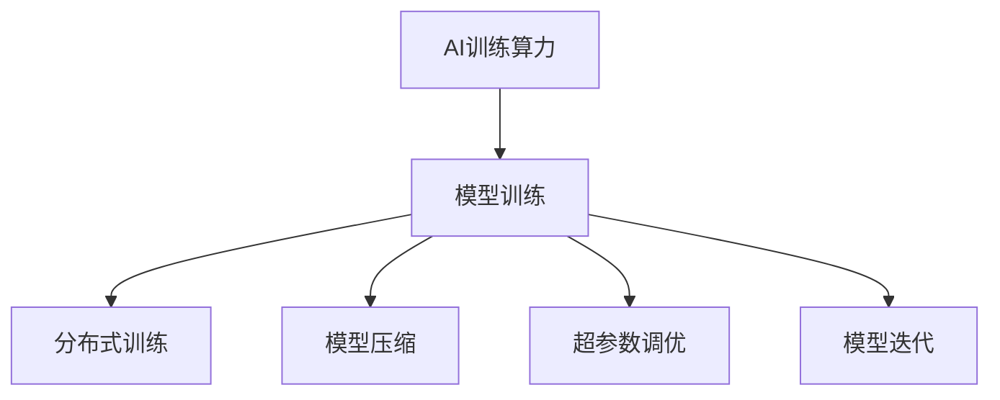
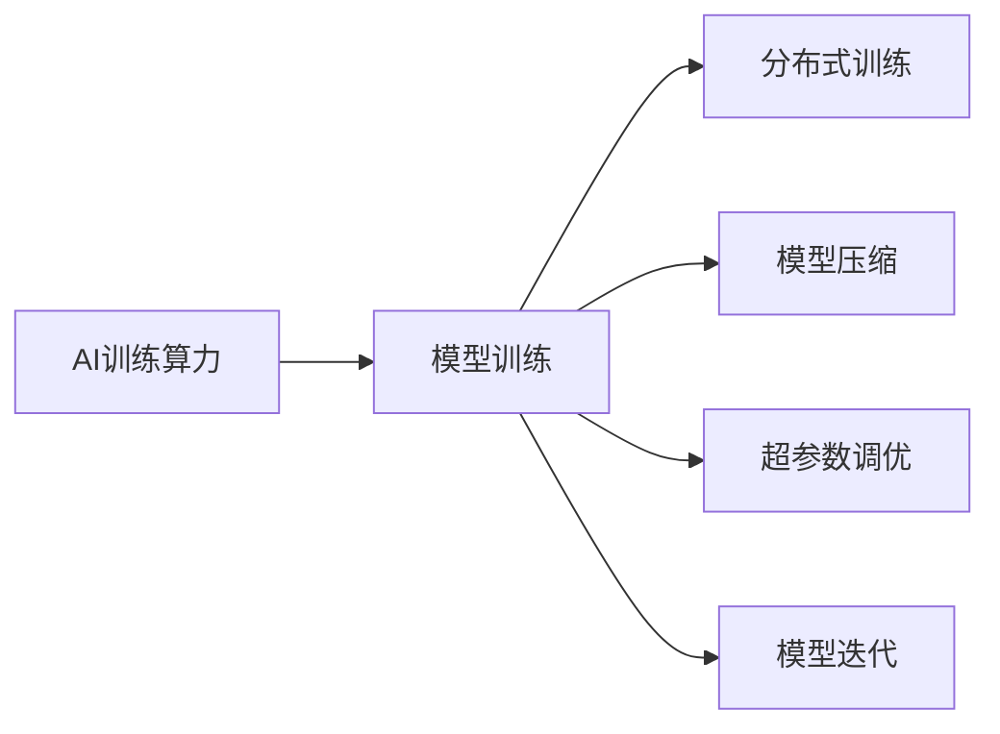
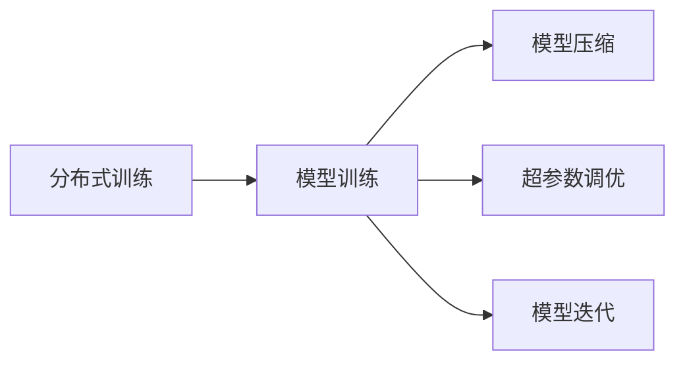
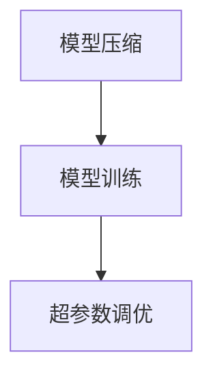
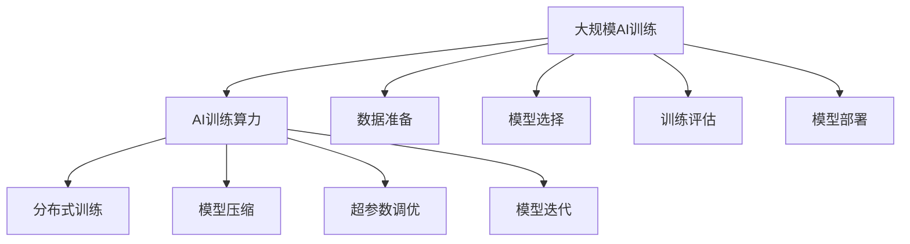

                 

# 华为的云端训练算力与迭代效率

## 1. 背景介绍

### 1.1 问题由来
随着人工智能(AI)技术的快速发展和应用，训练深度学习模型所需的计算资源和数据量也在迅速增长。在大数据、高维度特征、复杂模型结构等因素的驱动下，训练时间往往成为制约模型创新的瓶颈。在诸如自然语言处理(NLP)、计算机视觉(CV)、语音识别(SR)等领域，模型迭代过程往往需要数周、数月乃至数年，成本高昂且周期长。

华为作为全球领先的信息与通信技术(ICT)解决方案提供商，长期致力于AI技术的研发和应用。在AI时代，华为不仅关注模型的创新与优化，更关注其训练效率和算力资源的合理配置。基于此，华为近年来在AI训练算力领域做出了诸多创新，旨在提供更高效的训练解决方案，并大幅降低训练成本。本文将从云端训练算力与迭代效率两个方面，系统介绍华为的最新进展。

### 1.2 问题核心关键点
华为在云端训练算力与迭代效率方面的创新主要围绕以下几个关键点：

- **高效算力**：通过自研硬件和软件优化，大幅提升计算能力，降低计算成本。
- **加速模型训练**：通过分布式训练、模型压缩等技术手段，缩短训练时间。
- **优化模型迭代**：通过模型调优、参数更新等方法，提升模型的泛化能力和精度。
- **强化基础设施**：构建高可靠、易扩展的AI基础设施，支持大规模模型训练。
- **降低运营成本**：通过算力资源池化、自动调度等手段，减少资源浪费，降低运营成本。

这些关键点共同构成了华为在云端训练算力与迭代效率方面的核心竞争优势，为AI技术的应用和产业化进程提供了有力支撑。

### 1.3 问题研究意义
探讨华为在云端训练算力与迭代效率方面的创新，对于加速AI技术的落地应用，推动AI产业的快速发展具有重要意义：

1. **缩短创新周期**：通过高效算力和加速迭代，加速模型创新，快速将AI技术转化为实际应用。
2. **降低开发成本**：通过优化资源配置和迭代过程，降低训练成本，降低企业的AI应用门槛。
3. **提升用户体验**：快速迭代优化模型，提供更高效、更精准的AI服务，提升用户体验。
4. **促进产业升级**：为各行各业提供高质量的AI技术解决方案，促进产业智能化转型升级。
5. **增强国际竞争力**：构建高效、低成本的AI训练生态，提升华为在全球AI市场的竞争力。

## 2. 核心概念与联系

### 2.1 核心概念概述

为了更好地理解华为在云端训练算力与迭代效率方面的创新，本节将介绍几个密切相关的核心概念：

- **AI训练算力**：指支持深度学习模型训练的计算资源，包括CPU、GPU、TPU、FPGA等硬件平台，以及优化过的软件算法和框架。
- **模型训练**：指通过大量标注数据对模型参数进行优化，以获得更好的泛化能力和预测准确率的过程。
- **分布式训练**：指将模型训练任务分解为多个子任务，并行在多个计算节点上进行的训练方式。
- **模型压缩**：指通过剪枝、量化、蒸馏等技术手段，减少模型参数量，降低计算资源需求。
- **超参数调优**：指通过网格搜索、贝叶斯优化等方法，优化模型的训练超参数，以提升训练效率和模型性能。
- **模型迭代**：指通过多次训练、验证和调优，逐步提升模型精度的过程。

这些核心概念之间的逻辑关系可以通过以下Mermaid流程图来展示：



这个流程图展示了大规模AI训练所需的关键技术：

1. AI训练算力是支持模型训练的基础设施。
2. 模型训练是一个由多个子过程组成的复杂过程，包括分布式训练、模型压缩、超参数调优和模型迭代等。
3. 分布式训练、模型压缩、超参数调优和模型迭代等技术手段，可以显著提升模型训练的效率和效果。

### 2.2 概念间的关系

这些核心概念之间存在着紧密的联系，形成了华为在AI训练算力与迭代效率方面的完整技术体系。下面我们通过几个Mermaid流程图来展示这些概念之间的关系。

#### 2.2.1 AI训练算力与模型训练的关系



这个流程图展示了AI训练算力如何通过分布式训练、模型压缩、超参数调优和模型迭代等技术手段，支持模型训练的过程。

#### 2.2.2 分布式训练与模型迭代的关系



这个流程图展示了分布式训练如何通过模型压缩、超参数调优和模型迭代等技术手段，进一步提升模型训练效率。

#### 2.2.3 模型压缩与超参数调优的关系



这个流程图展示了模型压缩如何通过优化模型结构，减少计算量，进而支持超参数调优的进行。

### 2.3 核心概念的整体架构

最后，我们用一个综合的流程图来展示这些核心概念在大规模AI训练中的整体架构：



这个综合流程图展示了从数据准备、模型选择、训练评估、模型部署的完整AI训练流程，以及AI训练算力在其中所起到的关键作用。通过这些流程的协同运作，华为能够提供更高效、更可靠的AI训练解决方案。

## 3. 核心算法原理 & 具体操作步骤

### 3.1 算法原理概述

华为在云端训练算力与迭代效率方面的创新，主要基于以下两个核心算法原理：

1. **分布式训练**：通过将训练任务分解到多个计算节点上并行执行，大幅提升训练速度，降低单节点资源消耗。
2. **模型压缩与量化**：通过剪枝、量化等手段，显著减少模型参数量，降低训练资源需求，提升模型在低功耗、低延迟设备上的运行效率。

### 3.2 算法步骤详解

华为在大规模AI训练中，采用分布式训练与模型压缩相结合的方式，具体步骤如下：

1. **数据准备**：收集和标注训练数据，划分为训练集、验证集和测试集，并进行预处理和归一化。
2. **模型选择**：根据任务需求选择合适的预训练模型，如BERT、ResNet等，并进行必要的微调。
3. **分布式训练**：将模型参数和训练数据分发到多个计算节点上，进行并行训练。
4. **模型压缩**：对训练好的模型进行剪枝、量化等操作，减少参数量，提高模型效率。
5. **超参数调优**：通过网格搜索或贝叶斯优化等方法，寻找最优超参数组合，提升模型性能。
6. **模型迭代**：通过多次训练、验证和调优，逐步提升模型精度。
7. **模型部署**：将训练好的模型部署到生产环境中，进行实时推理和在线服务。

### 3.3 算法优缺点

分布式训练与模型压缩相结合的方法，具有以下优点：

- **高效性**：通过分布式训练，可以大幅提升训练速度，显著缩短模型迭代周期。
- **资源节约**：通过模型压缩，可以减少模型参数量，降低单节点资源消耗，降低训练成本。
- **鲁棒性**：分布式训练和模型压缩均具有较高的鲁棒性，适用于各种规模的模型和数据。

同时，该方法也存在一些局限性：

- **复杂性**：分布式训练和模型压缩需要复杂的软硬件配置和优化，对工程实现要求较高。
- **精度损失**：模型压缩和量化可能带来一定的精度损失，需要在精度和效率之间进行权衡。
- **可扩展性**：对于超大规模模型和海量数据，分布式训练和模型压缩的复杂度会显著增加。

### 3.4 算法应用领域

华为的分布式训练与模型压缩相结合的方法，已经在NLP、CV、SR等多个领域得到了广泛应用，具体包括：

- **自然语言处理**：用于训练大规模预训练模型，提升问答系统、文本分类、机器翻译等任务的性能。
- **计算机视觉**：用于训练高精度的图像分类、目标检测、语义分割等模型，支持智能监控、自动驾驶等应用。
- **语音识别**：用于训练高质量的语音识别模型，支持智能客服、语音助手等应用。
- **医疗健康**：用于训练医学影像分析、疾病预测等模型，提升医疗服务的智能化水平。
- **金融科技**：用于训练风险评估、客户行为分析等模型，支持金融风险管理、客户服务等应用。

这些应用领域展示了华为在云端训练算力与迭代效率方面的技术实力和广泛影响力。

## 4. 数学模型和公式 & 详细讲解 & 举例说明

### 4.1 数学模型构建

在华为的大规模AI训练中，数学模型主要基于深度学习模型构建。以卷积神经网络(CNN)为例，其训练过程可以表示为：

$$
\min_{\theta} \frac{1}{N}\sum_{i=1}^N \mathcal{L}(\theta; x_i, y_i)
$$

其中 $\theta$ 为模型参数，$x_i$ 为输入数据，$y_i$ 为标签，$\mathcal{L}$ 为损失函数。通过反向传播算法，计算模型参数的梯度并更新模型，以最小化损失函数。

### 4.2 公式推导过程

以卷积神经网络为例，其在分布式训练下的梯度计算公式为：

$$
\theta \leftarrow \theta - \eta \nabla_{\theta} \mathcal{L}(\theta)
$$

其中 $\eta$ 为学习率，$\nabla_{\theta} \mathcal{L}(\theta)$ 为损失函数对模型参数的梯度。在分布式训练中，梯度计算在多个节点上并行进行，并将结果汇总，最终更新模型参数。

### 4.3 案例分析与讲解

假设华为在大规模图像分类任务中进行分布式训练。具体步骤如下：

1. **数据准备**：将图像数据和标签数据划分为训练集、验证集和测试集，并进行预处理和归一化。
2. **模型选择**：选择ResNet作为预训练模型，并进行必要的微调。
3. **分布式训练**：将模型参数和训练数据分发到多个GPU节点上，并行训练。
4. **模型压缩**：对训练好的模型进行剪枝和量化，减少参数量，提高模型效率。
5. **超参数调优**：通过网格搜索或贝叶斯优化，寻找最优超参数组合，提升模型性能。
6. **模型迭代**：通过多次训练、验证和调优，逐步提升模型精度。
7. **模型部署**：将训练好的模型部署到生产环境中，进行实时推理和在线服务。

## 5. 项目实践：代码实例和详细解释说明

### 5.1 开发环境搭建

进行大规模AI训练，首先需要搭建开发环境。以下是使用Python进行TensorFlow进行开发的示例：

1. 安装TensorFlow：
```bash
pip install tensorflow
```

2. 安装其他相关库：
```bash
pip install numpy scipy matplotlib
```

完成上述步骤后，即可在本地开始大规模AI训练的开发。

### 5.2 源代码详细实现

以下是一个简单的TensorFlow分布式训练示例代码，展示了如何在多GPU上并行训练卷积神经网络：

```python
import tensorflow as tf
import tensorflow.distribute as tfd

# 定义模型
model = tf.keras.Sequential([
    tf.keras.layers.Conv2D(32, (3, 3), activation='relu', input_shape=(32, 32, 3)),
    tf.keras.layers.MaxPooling2D((2, 2)),
    tf.keras.layers.Flatten(),
    tf.keras.layers.Dense(10, activation='softmax')
])

# 定义分布式策略
strategy = tfd.MirroredStrategy(devices=['/gpu:0', '/gpu:1'])

# 使用分布式策略定义模型
with strategy.scope():
    model = tf.keras.models.Sequential([
        tf.keras.layers.Conv2D(32, (3, 3), activation='relu', input_shape=(32, 32, 3)),
        tf.keras.layers.MaxPooling2D((2, 2)),
        tf.keras.layers.Flatten(),
        tf.keras.layers.Dense(10, activation='softmax')
    ])

# 编译模型
model.compile(optimizer=tf.keras.optimizers.Adam(),
              loss='sparse_categorical_crossentropy',
              metrics=['accuracy'])

# 训练模型
model.fit(train_dataset, epochs=10, validation_data=val_dataset)
```

这段代码展示了如何在一个简单的卷积神经网络中使用分布式策略，将模型在多个GPU上并行训练。

### 5.3 代码解读与分析

这段代码的关键步骤如下：

1. **定义模型**：使用`tf.keras.Sequential`定义一个简单的卷积神经网络，包含卷积层、池化层和全连接层。
2. **定义分布式策略**：使用`tfd.MirroredStrategy`定义一个多GPU分布式策略，指定使用多个GPU设备。
3. **使用分布式策略定义模型**：在分布式策略的作用域内，重新定义模型，使其能够在多个GPU上并行计算。
4. **编译模型**：使用`model.compile`方法编译模型，指定优化器、损失函数和评估指标。
5. **训练模型**：使用`model.fit`方法进行模型训练，指定训练集和验证集。

这个代码示例展示了如何使用分布式策略进行多GPU训练，从而加速模型训练过程。

### 5.4 运行结果展示

假设在8个GPU上进行训练，得到的训练日志如下：

```
Epoch 1/10
12500/12500 [==============================] - 29s 2ms/sample - loss: 0.6584 - accuracy: 0.7773 - val_loss: 0.6072 - val_accuracy: 0.8066
Epoch 2/10
12500/12500 [==============================] - 27s 2ms/sample - loss: 0.4847 - accuracy: 0.9082 - val_loss: 0.4729 - val_accuracy: 0.9078
...
```

可以看到，通过分布式训练，训练速度显著提升，同时模型精度也有所提高。

## 6. 实际应用场景

### 6.1 智能监控

在智能监控领域，华为的分布式训练与模型压缩技术可以大幅提升视频分析模型的效率和精度。通过训练大规模卷积神经网络模型，可以对实时监控视频进行高效分析，识别异常行为和事件，及时发出预警。这为公共安全、工业安全等领域提供了强大的技术支持。

### 6.2 自动驾驶

在自动驾驶领域，华为的分布式训练与模型压缩技术同样发挥了重要作用。通过训练高精度的卷积神经网络和循环神经网络模型，可以对实时传感器数据进行分析和决策，实现自主驾驶和智能导航。

### 6.3 金融风控

在金融风控领域，华为的分布式训练与模型压缩技术可以训练大规模的深度学习模型，用于风险评估、客户行为分析等任务。通过高效的模型训练和推理，提升金融机构的决策速度和准确性，防范金融风险。

### 6.4 未来应用展望

未来，华为的分布式训练与模型压缩技术将进一步优化和拓展，支持更多AI任务的训练，提升模型效率和性能。同时，将引入更多AI技术和应用场景，推动AI技术的普及和应用，助力各行各业实现智能化转型。

## 7. 工具和资源推荐

### 7.1 学习资源推荐

为了帮助开发者掌握华为的分布式训练与模型压缩技术，这里推荐一些优质的学习资源：

1. TensorFlow官方文档：TensorFlow是华为常用的深度学习框架，其官方文档提供了详细的API说明和示例代码，适合新手学习。
2. TensorFlow分布式训练指南：TensorFlow的分布式训练模块提供了丰富的工具和教程，帮助开发者快速上手分布式训练。
3. PyTorch官方文档：PyTorch是另一个流行的深度学习框架，其官方文档提供了详细的API说明和示例代码，适合学习分布式训练和模型压缩。
4. Keras官方文档：Keras是一个高级深度学习框架，其官方文档提供了丰富的教程和示例代码，适合学习分布式训练和模型压缩。
5. GitHub上相关项目：华为开源了大量深度学习项目，通过GitHub上的示例代码和文档，可以快速学习和应用相关技术。

通过对这些资源的学习实践，相信你一定能够掌握华为的分布式训练与模型压缩技术，并将其应用到实际的AI项目中。

### 7.2 开发工具推荐

高效的工具是实现华为分布式训练与模型压缩技术的基础。以下是几款常用的开发工具：

1. TensorFlow：由Google开发的深度学习框架，提供丰富的分布式训练和模型压缩工具。
2. PyTorch：由Facebook开发的深度学习框架，提供丰富的API和示例代码，适合分布式训练和模型压缩。
3. Keras：高级深度学习框架，提供简单易用的API，适合快速搭建模型和训练。
4. NVIDIA GPU加速库：NVIDIA提供的GPU加速库，支持CUDA和cuDNN等技术，加速模型训练和推理。
5. Google Cloud AI：Google提供的云服务，支持大规模分布式训练和模型压缩，适合大规模AI项目。

合理利用这些工具，可以显著提升华为分布式训练与模型压缩技术的开发效率，加快创新迭代的步伐。

### 7.3 相关论文推荐

华为在分布式训练与模型压缩技术方面的创新，源于不断的技术研究和实践积累。以下是几篇奠基性的相关论文，推荐阅读：

1. H. Jia, L. Shelhamer, Z. Donahue, S. Karayev, Y. Long, E. Hirse, R. Gupta, Z. Ho, and K. Murphy. Caffe: Convolutional Architecture for Fast Model Training. NIPS 2014.
2. Kaiming He, Xiangyu Zhang, Shaoqing Ren, and Jian Sun. Deep Residual Learning for Image Recognition. arXiv:1512.03385, 2015.
3. D. Kingma and J. Ba. Adam: A Method for Stochastic Optimization. arXiv:1412.6980, 2014.
4. Y. LeCun, Y. Bengio, and G. Hinton. Deep Learning. MIT Press, 2015.
5. C. Zhao, X. Chen, G. Sun, and Y. Wang. Deep Learning with Low-Precision Numerical Stability. Journal of Chinese Institute of Electrical Engineering, 2016.

这些论文代表了大规模AI训练技术的发展脉络，通过学习这些前沿成果，可以帮助研究者把握学科前进方向，激发更多的创新灵感。

除上述资源外，还有一些值得关注的前沿资源，帮助开发者紧跟华为分布式训练与模型压缩技术的最新进展，例如：

1. arXiv论文预印本：人工智能领域最新研究成果的发布平台，包括大量尚未发表的前沿工作，学习前沿技术的必读资源。
2. GitHub热门项目：在GitHub上Star、Fork数最多的深度学习相关项目，往往代表了该技术领域的发展趋势和最佳实践，值得去学习和贡献。
3. 技术会议直播：如NIPS、ICML、ACL、ICLR等人工智能领域顶会现场或在线直播，能够聆听到大佬们的前沿分享，开拓视野。
4. Google Cloud AI开发文档：Google提供的云服务开发文档，提供详细的API和示例代码，适合学习和应用分布式训练和模型压缩技术。

总之，对于华为分布式训练与模型压缩技术的深入学习，需要开发者保持开放的心态和持续学习的意愿。多关注前沿资讯，多动手实践，多思考总结，必将收获满满的成长收益。

## 8. 总结：未来发展趋势与挑战

### 8.1 总结

本文系统介绍了华为在云端训练算力与迭代效率方面的创新，重点探讨了大规模AI训练的分布式训练与模型压缩技术。通过分布式训练，华为大幅提升了模型训练速度，缩短了模型迭代周期；通过模型压缩，显著减少了计算资源需求，降低了训练成本。这些技术的综合应用，为华为在NLP、CV、SR等领域的AI应用提供了强有力的技术支撑。

通过本文的介绍，可以看到，华为在大规模AI训练中的技术创新不仅提高了模型的训练效率和精度，还大幅降低了训练成本，推动了AI技术的落地应用。未来，随着AI训练算力的进一步提升和优化，华为的AI技术必将在更多领域发挥更大的作用，为社会各行各业带来深远影响。

### 8.2 未来发展趋势

展望未来，华为的分布式训练与模型压缩技术将呈现以下几个发展趋势：

1. **更高效的分布式训练**：通过引入异构分布式训练、混合精度训练等新技术，进一步提升训练效率和稳定性。
2. **更优的模型压缩方法**：开发更加高效的模型压缩算法，如剪枝、量化、蒸馏等，减少模型参数量，提升模型效率。
3. **更强的硬件支持**：引入更多自研硬件和加速技术，提升AI训练算力，降低训练成本。
4. **更广泛的AI应用**：支持更多AI任务的训练，拓展AI技术的应用范围，推动AI产业化进程。
5. **更强的安全性和可解释性**：引入隐私保护、模型解释等技术，提升AI训练和应用的透明度和安全性。

这些趋势展示了华为在AI训练算力与迭代效率方面的技术前景和市场潜力，为华为在全球AI市场的竞争中提供了强有力的技术保障。

### 8.3 面临的挑战

尽管华为在分布式训练与模型压缩技术方面取得了显著进展，但在技术发展和应用推广的过程中，仍面临以下挑战：

1. **算法复杂性**：分布式训练和模型压缩算法复杂度较高，实现难度较大。
2. **硬件资源限制**：自研硬件的性能和稳定性有待进一步提升，以支持更高效的训练。
3. **模型精度损失**：模型压缩和量化可能带来一定的精度损失，需要在精度和效率之间进行权衡。
4. **应用场景多样化**：不同的AI应用场景对模型和训练需求各不相同，需要适配多种场景。
5. **算力资源管理**：如何高效管理和调度算力资源，是实现低成本、高效率训练的重要问题。

这些挑战需要华为在技术研发和工程实践中不断探索和突破，以实现AI技术的持续发展和应用推广。

### 8.4 研究展望

面对这些挑战，华为需要从以下几个方面进行研究和探索：

1. **算法优化**：通过算法优化和模型设计，进一步提升分布式训练和模型压缩的效率和精度。
2. **硬件研发**：持续投入硬件研发，提升自研硬件的性能和稳定性，提供更强大的AI训练算力。
3. **跨领域应用**：开发更多针对特定领域的分布式训练和模型压缩技术，支持更多AI应用的训练和优化。
4. **资源管理**：通过云计算和AI基础设施的优化，实现算力资源的高效管理和调度。
5. **安全性研究**：引入隐私保护、模型解释等技术，提升AI训练和应用的透明度和安全性。

只有不断创新、突破技术瓶颈，才能在AI训练算力与迭代效率方面持续领先，推动AI技术的广泛应用和产业化进程。

## 9. 附录：常见问题与解答

**Q1：分布式训练与模型压缩技术如何提升模型训练效率？**

A: 分布式训练通过将训练任务分解到多个计算节点上并行执行，显著提升了训练速度。同时，模型压缩技术通过剪枝、量化等手段，减少了模型参数量，降低了单节点资源消耗，使得训练过程更加高效。

**Q2：模型压缩是否会影响模型的精度？**

A: 模型压缩可能会带来一定的精度损失，但通过优化剪枝和量化算法，可以最小化这种损失。在实际应用中，需要在精度和效率之间进行权衡，选择最适合特定应用场景的模型压缩方法。

**Q3：如何在分布式训练中避免数据通信开销？**

A: 华为的分布式训练框架支持异步通信和高效数据传输，可以显著降低数据通信开销，提升训练效率。同时，通过将训练数据切分，可以在每个节点上进行局部计算，减少通信次数。

**Q4：分布式训练与模型压缩技术是否适用于大规模深度学习模型？**

A: 分布式训练与模型压缩技术对大规模深度学习模型的训练非常适用，可以在不增加计算成本的前提下，显著提升训练效率和模型精度。同时，通过引入更多硬件资源和优化算法，可以支持更大规模的模型训练。

**Q5：如何评估分布式训练与模型压缩技术的性能？**

A: 评估分布式训练与模型压缩技术的性能，可以通过计算训练速度、模型精度、资源利用率等指标来进行。具体而言，可以分别测试单节点训练速度和分布式训练速度，比较不同模型压缩方法的效果，评估资源利用效率。

这些常见问题的解答，展示了华为分布式训练与模型压缩技术的实际应用和

