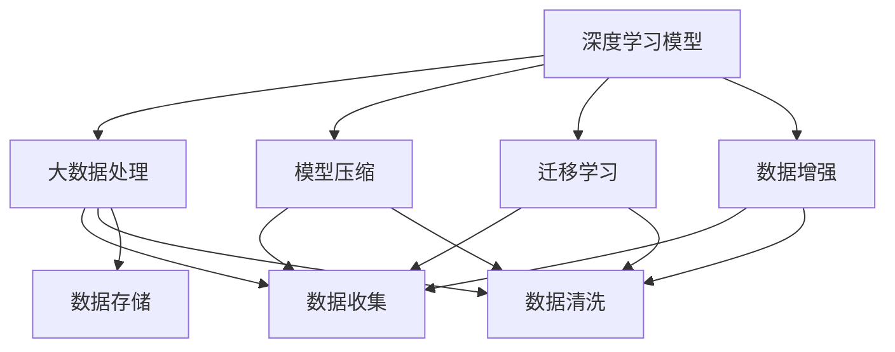
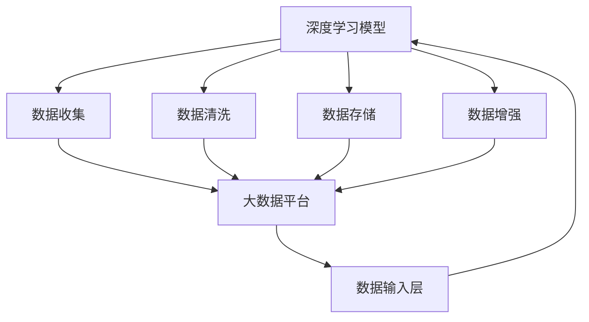
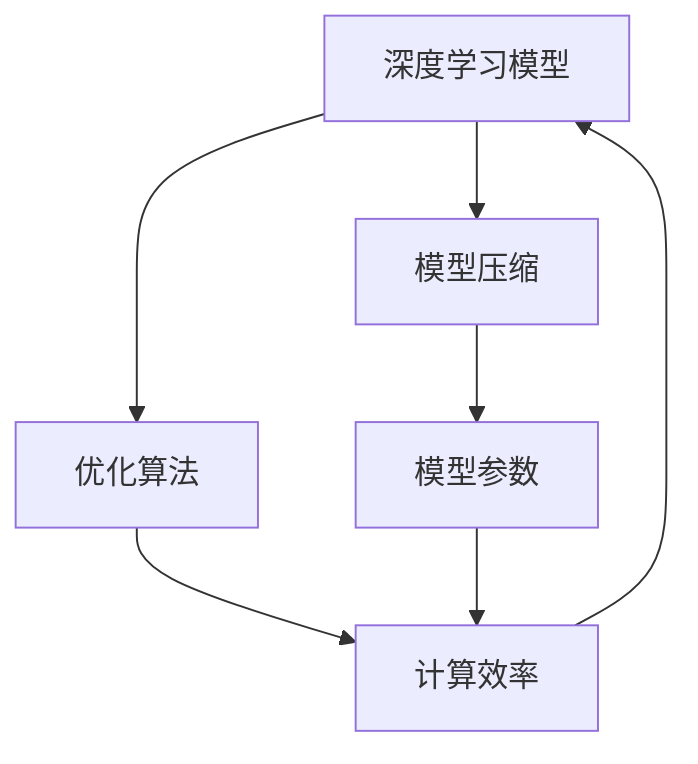
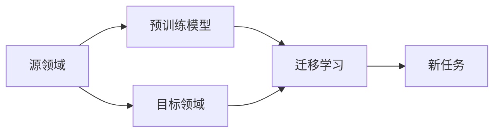

                 

# 博观而约取：向内提升与向外兼容

> 关键词：深度学习,大数据,人工智能,软件开发,软件架构

## 1. 背景介绍

### 1.1 问题由来

随着人工智能技术的迅猛发展，深度学习和大数据的应用已经渗透到各行各业。无论是自动驾驶、语音识别，还是图像处理和自然语言处理，都在使用大数据和深度学习模型进行模型训练和优化。然而，在实际应用中，许多模型遇到了数据量不足、计算资源紧张等问题。如何提升模型的内在大数据处理能力，同时兼容多样化的数据源和计算环境，成为了当下的一个重要研究方向。

### 1.2 问题核心关键点

本文聚焦于深度学习模型的内在大数据处理能力提升和多样化的数据源兼容性问题，通过研究模型的数据加载、特征提取、模型训练和预测等关键环节，探讨如何通过数据增强、模型压缩和迁移学习等方法，使模型能够在不同数据源和计算环境中高效地运行，同时提升模型性能和计算效率。

### 1.3 问题研究意义

1. **数据驱动决策**：通过提升模型的内在大数据处理能力，使模型能够更好地利用和分析海量数据，为决策提供更准确、全面的支持。
2. **模型泛化能力**：使模型能够在不同数据源和计算环境中高效运行，提升模型的泛化能力和迁移学习能力，扩展模型应用范围。
3. **计算资源优化**：通过模型压缩和优化算法，减少模型参数和计算资源消耗，提升模型在计算资源受限环境下的运行效率。
4. **技术升级**：为开发者提供更高效、灵活的数据处理和模型训练工具，加速技术创新和模型迭代，推动人工智能技术的进一步发展。

## 2. 核心概念与联系

### 2.1 核心概念概述

为更好地理解本论文的核心概念，本节将介绍几个密切相关的核心概念：

- **深度学习模型**：一种基于多层神经网络的机器学习模型，能够通过反向传播算法自动学习复杂特征表示。
- **大数据处理**：处理和分析海量数据的技术，包括数据收集、数据清洗、数据存储和数据处理等环节。
- **模型压缩**：通过减少模型参数和优化算法，使模型在保持高性能的前提下，减少计算资源消耗。
- **迁移学习**：将一个领域的知识迁移到另一个领域，使模型在新的任务上能够快速学习并取得良好性能。
- **数据增强**：通过对训练数据进行变换或生成，增加数据的多样性，提升模型的泛化能力。

这些核心概念之间的逻辑关系可以通过以下Mermaid流程图来展示：



这个流程图展示了深度学习模型与大数据处理、模型压缩、迁移学习、数据增强等关键技术之间的关系：

1. 深度学习模型通过大数据处理获取数据，通过模型压缩和优化算法提升性能。
2. 迁移学习使模型能够在不同领域应用，提升模型的泛化能力。
3. 数据增强通过变换或生成数据，提升模型的泛化能力和计算效率。

### 2.2 概念间的关系

这些核心概念之间存在着紧密的联系，形成了深度学习模型内在大数据处理和迁移学习技术的完整生态系统。下面我通过几个Mermaid流程图来展示这些概念之间的关系。

#### 2.2.1 深度学习模型的内在大数据处理



这个流程图展示了深度学习模型在大数据平台上的数据处理过程：

1. 数据通过大数据平台进行收集、清洗和存储，进入深度学习模型的数据输入层。
2. 数据增强对输入数据进行变换或生成，增加数据的多样性。
3. 深度学习模型通过训练和学习，生成复杂的特征表示，用于预测或分类。

#### 2.2.2 模型压缩与优化



这个流程图展示了深度学习模型压缩和优化的过程：

1. 深度学习模型通过优化算法进行训练，生成复杂的特征表示。
2. 模型压缩减少模型参数和计算资源消耗，提升计算效率。
3. 压缩后的模型继续训练和优化，最终用于预测或分类。

#### 2.2.3 迁移学习与模型泛化



这个流程图展示了迁移学习的基本原理：

1. 预训练模型在源领域进行训练，学习到通用的特征表示。
2. 迁移学习将预训练模型应用到目标领域，学习新的任务。
3. 新任务通过迁移学习，提升模型的泛化能力和迁移学习能力。

## 3. 核心算法原理 & 具体操作步骤

### 3.1 算法原理概述

深度学习模型的内在大数据处理和迁移学习，主要依赖于数据收集、数据清洗、模型训练和模型压缩等关键技术。其核心思想是通过提高模型对大数据的处理能力，同时增强模型在不同数据源和计算环境下的兼容性和泛化能力。

### 3.2 算法步骤详解

以下是深度学习模型的内在大数据处理和迁移学习的主要操作步骤：

**Step 1: 数据收集与预处理**

1. **数据收集**：使用大数据平台或API接口，从不同数据源收集数据。
2. **数据清洗**：对收集到的数据进行去重、去噪、填充缺失值等清洗处理。
3. **数据增强**：通过旋转、平移、缩放等变换，生成更多的训练样本。

**Step 2: 模型训练与优化**

1. **模型选择**：根据任务需求选择合适的深度学习模型。
2. **模型初始化**：使用随机初始化或预训练模型初始化深度学习模型。
3. **模型训练**：通过反向传播算法和优化算法，对模型进行训练。
4. **模型压缩**：使用模型压缩算法，减少模型参数和计算资源消耗。
5. **模型优化**：使用优化算法，提升模型性能和计算效率。

**Step 3: 迁移学习与泛化**

1. **预训练模型选择**：选择合适的预训练模型作为初始化参数。
2. **迁移学习训练**：将预训练模型应用到新任务上，进行迁移学习训练。
3. **模型微调**：在新任务上微调模型，提升泛化能力。

**Step 4: 部署与监控**

1. **模型部署**：将训练好的模型部署到目标计算环境。
2. **模型监控**：使用监控工具，实时监控模型性能和计算效率。
3. **模型维护**：根据性能监控结果，对模型进行维护和优化。

### 3.3 算法优缺点

深度学习模型的内在大数据处理和迁移学习，具有以下优点：

1. **高效性**：通过数据增强和模型压缩技术，提升模型对大数据的处理能力和计算效率。
2. **泛化能力**：通过迁移学习和预训练模型，提升模型在不同数据源和计算环境下的泛化能力和迁移学习能力。
3. **可扩展性**：通过模型压缩和优化算法，使模型在计算资源受限环境中仍能高效运行。

但同时也存在一些缺点：

1. **计算资源需求高**：数据收集、数据增强和模型训练等环节需要大量的计算资源。
2. **数据隐私风险**：在大数据处理过程中，需要注意数据隐私和安全问题。
3. **模型复杂度增加**：通过数据增强和模型压缩技术，模型的复杂度可能会增加，导致计算效率降低。

### 3.4 算法应用领域

深度学习模型的内在大数据处理和迁移学习，已经在多个领域得到了广泛应用，例如：

- **自动驾驶**：通过数据增强和模型压缩，提升模型对复杂交通场景的处理能力。
- **语音识别**：通过迁移学习，使模型在新的语音识别任务上快速学习并取得良好性能。
- **图像处理**：通过数据增强和模型压缩，提升模型对多样化的图像处理能力。
- **自然语言处理**：通过迁移学习和预训练模型，提升模型在自然语言处理任务上的泛化能力和迁移学习能力。

除了上述这些经典应用外，深度学习模型的内在大数据处理和迁移学习，还在医学、金融、安全等领域得到广泛应用，为行业带来深刻的变革。

## 4. 数学模型和公式 & 详细讲解 & 举例说明

### 4.1 数学模型构建

本节将使用数学语言对深度学习模型的内在大数据处理和迁移学习进行更加严格的刻画。

假设深度学习模型为 $M$，其输入为 $x$，输出为 $y$。模型通过反向传播算法和优化算法进行训练，目标最小化损失函数 $L$，即：

$$
\min_{\theta} L(y, M(x))
$$

其中 $\theta$ 为模型参数，$L$ 为损失函数。

### 4.2 公式推导过程

以下我们以二分类任务为例，推导交叉熵损失函数及其梯度的计算公式。

假设模型 $M$ 在输入 $x$ 上的输出为 $\hat{y}=M(x) \in [0,1]$，表示样本属于正类的概率。真实标签 $y \in \{0,1\}$。则二分类交叉熵损失函数定义为：

$$
L(y, \hat{y}) = -[y\log \hat{y} + (1-y)\log (1-\hat{y})]
$$

将其代入最小化损失函数，得：

$$
\min_{\theta} -\frac{1}{N}\sum_{i=1}^N L(y_i, \hat{y}_i)
$$

根据链式法则，损失函数对模型参数 $\theta_k$ 的梯度为：

$$
\frac{\partial L(y, \hat{y})}{\partial \theta_k} = -(y\frac{\partial \log \hat{y}}{\partial \theta_k} + (1-y)\frac{\partial \log (1-\hat{y})}{\partial \theta_k})
$$

在得到损失函数的梯度后，即可带入参数更新公式，完成模型的迭代优化。重复上述过程直至收敛，最终得到适应新任务的模型参数 $\theta^*$。

### 4.3 案例分析与讲解

假设我们构建一个图像识别模型，使用迁移学习进行模型微调。在迁移学习过程中，我们使用ImageNet预训练模型作为初始化参数，然后使用CIFAR-10数据集进行微调。

1. **数据收集与预处理**

   - **数据收集**：从CIFAR-10数据集中收集图像数据。
   - **数据清洗**：对图像进行去噪、填充缺失值等处理。
   - **数据增强**：对图像进行旋转、平移、缩放等变换，增加数据的多样性。

2. **模型训练与优化**

   - **模型选择**：选择VGG16作为初始化模型。
   - **模型初始化**：使用随机初始化或ImageNet预训练模型进行初始化。
   - **模型训练**：使用反向传播算法和Adam优化算法，对模型进行训练。
   - **模型压缩**：使用模型压缩算法，如剪枝、量化等，减少模型参数和计算资源消耗。
   - **模型优化**：使用优化算法，如Adam、SGD等，提升模型性能和计算效率。

3. **迁移学习与泛化**

   - **预训练模型选择**：选择ImageNet预训练模型作为初始化参数。
   - **迁移学习训练**：将ImageNet预训练模型应用到CIFAR-10数据集上，进行迁移学习训练。
   - **模型微调**：在CIFAR-10数据集上微调模型，提升泛化能力。

4. **部署与监控**

   - **模型部署**：将训练好的模型部署到目标计算环境。
   - **模型监控**：使用监控工具，实时监控模型性能和计算效率。
   - **模型维护**：根据性能监控结果，对模型进行维护和优化。

## 5. 项目实践：代码实例和详细解释说明

### 5.1 开发环境搭建

在进行项目实践前，我们需要准备好开发环境。以下是使用Python进行PyTorch开发的环境配置流程：

1. 安装Anaconda：从官网下载并安装Anaconda，用于创建独立的Python环境。

2. 创建并激活虚拟环境：
```bash
conda create -n pytorch-env python=3.8 
conda activate pytorch-env
```

3. 安装PyTorch：根据CUDA版本，从官网获取对应的安装命令。例如：
```bash
conda install pytorch torchvision torchaudio cudatoolkit=11.1 -c pytorch -c conda-forge
```

4. 安装TensorFlow：
```bash
pip install tensorflow
```

5. 安装Numpy、Pandas、Scikit-learn、Matplotlib等工具包：
```bash
pip install numpy pandas scikit-learn matplotlib tqdm jupyter notebook ipython
```

完成上述步骤后，即可在`pytorch-env`环境中开始项目实践。

### 5.2 源代码详细实现

下面我们以迁移学习进行图像识别模型微调为例，给出使用PyTorch的代码实现。

```python
import torch
import torch.nn as nn
import torchvision.transforms as transforms
from torch.utils.data import DataLoader
from torchvision import datasets
from torchvision.models import vgg16

# 定义数据预处理
transform = transforms.Compose([
    transforms.Resize((224, 224)),
    transforms.ToTensor(),
    transforms.Normalize(mean=[0.485, 0.456, 0.406], std=[0.229, 0.224, 0.225])
])

# 加载数据集
train_dataset = datasets.CIFAR10(root='./data', train=True, download=True, transform=transform)
test_dataset = datasets.CIFAR10(root='./data', train=False, download=True, transform=transform)

# 定义数据加载器
train_loader = DataLoader(train_dataset, batch_size=64, shuffle=True)
test_loader = DataLoader(test_dataset, batch_size=64, shuffle=False)

# 定义模型
model = vgg16(pretrained=True)

# 定义损失函数和优化器
criterion = nn.CrossEntropyLoss()
optimizer = torch.optim.Adam(model.parameters(), lr=0.001)

# 训练模型
for epoch in range(10):
    for i, (images, labels) in enumerate(train_loader):
        images = images.to(device)
        labels = labels.to(device)
        outputs = model(images)
        loss = criterion(outputs, labels)
        optimizer.zero_grad()
        loss.backward()
        optimizer.step()
        if (i+1) % 100 == 0:
            print(f"Epoch [{epoch+1}/{10}], Step [{i+1}/{len(train_loader)}], Loss: {loss.item():.4f}")
```

### 5.3 代码解读与分析

让我们再详细解读一下关键代码的实现细节：

**数据预处理**：
- 使用`transforms.Compose`定义数据预处理流程，包括图像缩放、归一化等操作。
- `transforms.Resize`对图像进行缩放，`transforms.ToTensor`将图像转换为张量。
- `transforms.Normalize`对图像进行归一化处理。

**数据加载器**：
- 使用`torch.utils.data.DataLoader`创建数据加载器，用于批量加载和处理数据。
- `DataLoader`中的`batch_size`参数定义了每次加载的数据批量大小，`shuffle`参数定义了是否对数据进行随机打乱。

**模型选择与初始化**：
- 选择VGG16作为初始化模型。
- 使用`pretrained=True`参数，使用ImageNet预训练模型进行初始化。

**损失函数与优化器**：
- 定义交叉熵损失函数`nn.CrossEntropyLoss`。
- 使用`Adam`优化算法，优化模型参数。

**模型训练与优化**：
- 在每个epoch内，对模型进行前向传播和反向传播，计算损失函数和梯度。
- 使用`optimizer.zero_grad()`清空梯度，`loss.backward()`计算梯度，`optimizer.step()`更新模型参数。

## 6. 实际应用场景

### 6.1 自动驾驶

自动驾驶技术需要实时处理大量的交通数据，以实现安全、高效的驾驶。深度学习模型的内在大数据处理和迁移学习，可以在自动驾驶中发挥重要作用：

1. **数据收集与预处理**：使用各种传感器（如摄像头、雷达、激光雷达等）收集实时交通数据，并进行去噪、填充缺失值等预处理。
2. **模型训练与优化**：使用反向传播算法和优化算法，对模型进行训练和优化。
3. **迁移学习与泛化**：将预训练模型应用到自动驾驶任务上，提升模型的泛化能力和迁移学习能力。
4. **部署与监控**：将训练好的模型部署到自动驾驶系统中，使用监控工具实时监测模型性能和计算效率。

### 6.2 语音识别

语音识别技术需要对大量的语音数据进行实时处理，以实现准确的语音识别。深度学习模型的内在大数据处理和迁移学习，可以在语音识别中发挥重要作用：

1. **数据收集与预处理**：从各种语音数据源（如电话录音、语音助手等）收集语音数据，并进行去噪、降噪等预处理。
2. **模型训练与优化**：使用反向传播算法和优化算法，对模型进行训练和优化。
3. **迁移学习与泛化**：将预训练模型应用到语音识别任务上，提升模型的泛化能力和迁移学习能力。
4. **部署与监控**：将训练好的模型部署到语音识别系统中，使用监控工具实时监测模型性能和计算效率。

### 6.3 图像处理

图像处理技术需要对大量的图像数据进行实时处理，以实现准确、高效的图像识别和分析。深度学习模型的内在大数据处理和迁移学习，可以在图像处理中发挥重要作用：

1. **数据收集与预处理**：从各种图像数据源（如摄像头、无人机等）收集图像数据，并进行去噪、填充缺失值等预处理。
2. **模型训练与优化**：使用反向传播算法和优化算法，对模型进行训练和优化。
3. **迁移学习与泛化**：将预训练模型应用到图像处理任务上，提升模型的泛化能力和迁移学习能力。
4. **部署与监控**：将训练好的模型部署到图像处理系统中，使用监控工具实时监测模型性能和计算效率。

## 7. 工具和资源推荐

### 7.1 学习资源推荐

为了帮助开发者系统掌握深度学习模型的内在大数据处理和迁移学习的理论基础和实践技巧，这里推荐一些优质的学习资源：

1. **深度学习系列课程**：如斯坦福大学、Coursera等提供的深度学习课程，涵盖深度学习的基本概念、算法和应用。
2. **大数据处理工具**：如Hadoop、Spark等，帮助开发者学习大数据处理的技术和工具。
3. **模型压缩与优化**：如“深度学习模型压缩与优化”一书，涵盖模型压缩和优化算法。
4. **迁移学习**：如“迁移学习”一书，涵盖迁移学习的原理和应用。
5. **模型微调与优化**：如“深度学习模型微调与优化”一书，涵盖模型微调和优化算法。

通过对这些资源的学习实践，相信你一定能够快速掌握深度学习模型的内在大数据处理和迁移学习的精髓，并用于解决实际的深度学习问题。

### 7.2 开发工具推荐

高效的开发离不开优秀的工具支持。以下是几款用于深度学习模型开发的工具：

1. **PyTorch**：基于Python的开源深度学习框架，灵活动态的计算图，适合快速迭代研究。
2. **TensorFlow**：由Google主导开发的开源深度学习框架，生产部署方便，适合大规模工程应用。
3. **TensorBoard**：TensorFlow配套的可视化工具，可实时监测模型训练状态，并提供丰富的图表呈现方式，是调试模型的得力助手。
4. **Weights & Biases**：模型训练的实验跟踪工具，可以记录和可视化模型训练过程中的各项指标，方便对比和调优。
5. **Jupyter Notebook**：交互式编程环境，支持Python代码和数学公式的混合使用，适合快速原型开发。

合理利用这些工具，可以显著提升深度学习模型开发和优化效率，加速技术创新和模型迭代，推动人工智能技术的进一步发展。

### 7.3 相关论文推荐

深度学习模型的内在大数据处理和迁移学习的发展源于学界的持续研究。以下是几篇奠基性的相关论文，推荐阅读：

1. **深度学习模型压缩与优化**：如“Pruning Neural Networks for Efficient Inference”一书，涵盖深度学习模型的压缩与优化算法。
2. **迁移学习**：如“Learning Transferable Knowledge from One Task to Many”一书，涵盖迁移学习的原理和应用。
3. **数据增强**：如“ImageNet Classifier in 50 Lines of Code”一书，涵盖数据增强技术在深度学习中的应用。
4. **模型微调与优化**：如“Fine-tuning Neural Network Models with TensorFlow and Keras”一书，涵盖模型微调和优化算法。
5. **深度学习模型训练与优化**：如“Efficient Backprop”一书，涵盖深度学习模型的训练和优化算法。

这些论文代表了大数据处理和迁移学习的最新进展，通过学习这些前沿成果，可以帮助研究者把握学科前进方向，激发更多的创新灵感。

除上述资源外，还有一些值得关注的前沿资源，帮助开发者紧跟深度学习模型的最新进展，例如：

1. **arXiv论文预印本**：人工智能领域最新研究成果的发布平台，包括大量尚未发表的前沿工作，学习前沿技术的必读资源。
2. **顶级会议和期刊**：如NIPS、ICML、CVPR等顶级会议，以及IEEE TNN、JMLR等顶级期刊，涵盖深度学习模型的最新研究进展。
3. **开源项目**：如TensorFlow、PyTorch等开源深度学习框架的官方文档和社区贡献，是深入学习深度学习模型技术的重要资源。
4. **在线课程**：如Udacity、Coursera等在线学习平台提供的深度学习课程，涵盖深度学习模型的理论基础和实践技巧。

总之，对于深度学习模型的内在大数据处理和迁移学习技术的学习和实践，需要开发者保持开放的心态和持续学习的意愿。多关注前沿资讯，多动手实践，多思考总结，必将收获满满的成长收益。

## 8. 总结：未来发展趋势与挑战

### 8.1 总结

本文对深度学习模型的内在大数据处理和迁移学习进行了全面系统的介绍。首先阐述了深度学习模型和迁移学习的背景和意义，明确了内在大数据处理和迁移学习对模型性能和计算效率的提升作用。其次，从原理到实践，详细讲解了深度学习模型的数据收集、数据增强、模型训练、模型压缩等关键步骤，给出了深度学习模型的代码实现示例。同时，本文还广泛探讨了深度学习模型在内大数据处理和迁移学习方面的实际应用场景，展示了其广阔的应用前景。

通过本文的系统梳理，可以看到，深度学习模型的内在大数据处理和迁移学习技术正在成为深度学习领域的重要研究范式，极大地提升了深度学习模型的性能和计算效率。未来，随着预训练模型和微调方法的持续演进，深度学习模型的应用范围将进一步扩展，为各行各业带来深刻的变革性影响。

### 8.2 未来发展趋势

展望未来，深度学习模型的内在大数据处理和迁移学习技术将呈现以下几个发展趋势：

1. **数据驱动决策**：随着数据量的不断增加，深度学习模型将更加依赖于数据驱动的决策，提高模型的泛化能力和迁移学习能力。
2. **模型通用性增强**：通过迁移学习和预训练模型，使模型在多个任务和领域中具有更强的泛化能力和迁移学习能力。
3. **计算资源优化**：随着计算资源的不断丰富，深度学习模型将能够在更高效的环境中运行，提升模型的训练和推理速度。
4. **多模态数据融合**：深度学习模型将融合视觉、语音、文本等多模态数据，提升模型对复杂数据源的建模能力。
5. **可解释性提升**：深度学习模型将提升其可解释性，使模型决策过程更加透明、可解释。
6. **伦理道德约束**：深度学习模型将加强伦理道德约束，避免模型输出有害、偏见的内容。

以上趋势凸显了深度学习模型的内在大数据处理和迁移学习技术的广阔前景。这些方向的探索发展，必将进一步提升深度学习模型的性能和应用范围，为人工智能技术的发展带来新的突破。

### 8.3 面临的挑战

尽管深度学习模型的内在大数据处理和迁移学习技术已经取得了不少进展，但在迈向更加智能化、普适化应用的过程中，仍面临诸多挑战：

1. **计算资源需求高**：数据收集、数据增强和模型训练等环节需要大量的计算资源，这对计算资源有限的环境提出了更高的要求。
2. **数据隐私风险**：在大数据处理过程中，需要注意数据隐私和安全问题，避免数据泄露和滥用。
3. **模型复杂度增加**：通过数据增强和

