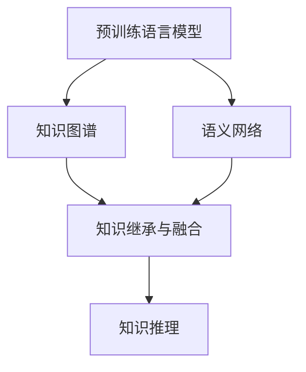
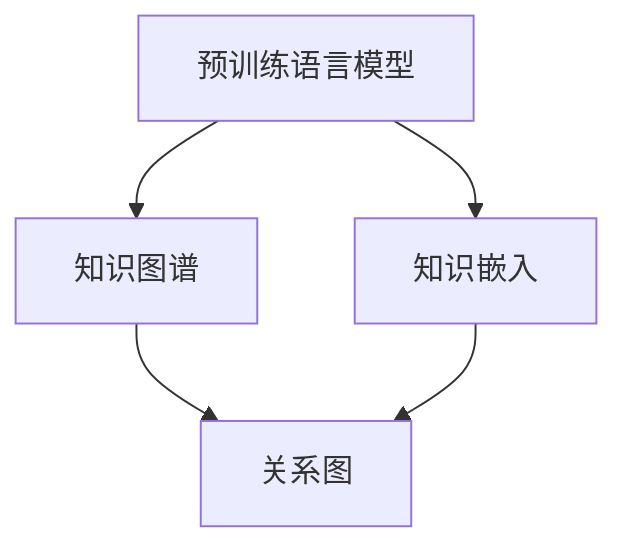
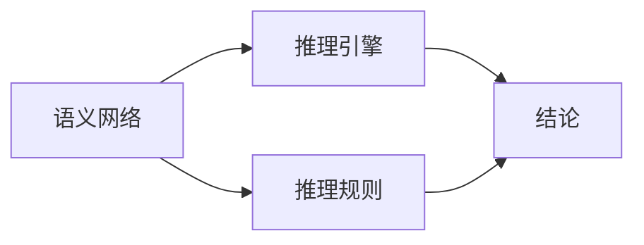
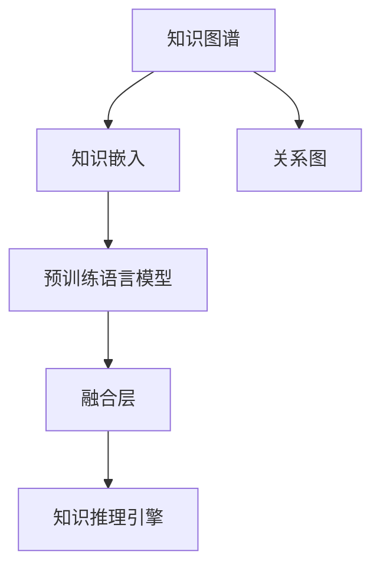
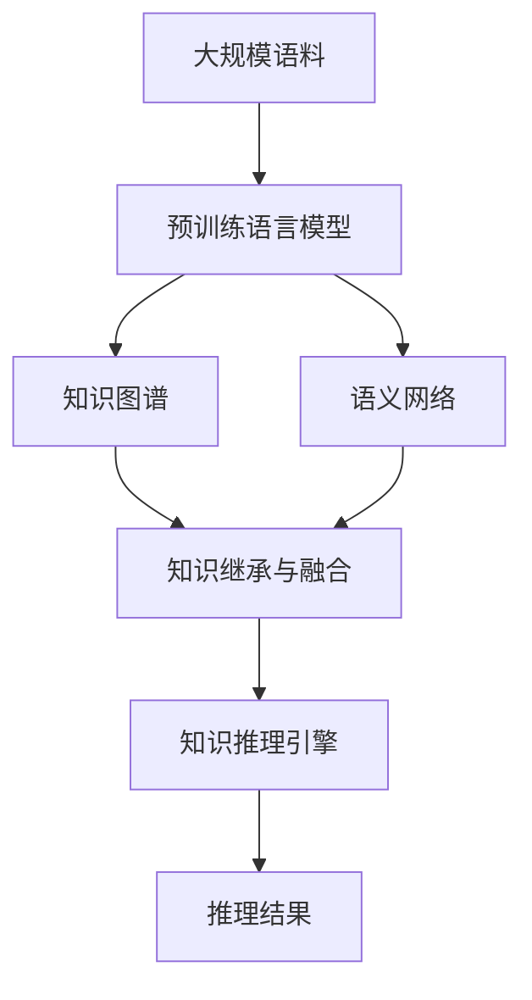

                 

# 原生世界信息的高效继承

> 关键词：原生世界,信息继承,高效学习,知识图谱,语义网络

## 1. 背景介绍

### 1.1 问题由来
随着人工智能技术的快速发展，如何高效地继承和利用人类文明积累的丰富知识，成为亟待解决的重大问题。传统基于符号知识库的继承方式，如 ontology、知识图谱等，存在表达复杂、易受领域变化影响、更新维护困难等问题，难以适应现代人工智能的需求。

近年来，基于神经网络模型的大规模预训练语言模型（如BERT、GPT等）在继承和利用自然语言信息方面取得了显著进展。这些模型通过在大规模语料上进行预训练，学习到自然语言的通用表示和语言规则，具备强大的语义理解能力。本文将探讨如何利用这些模型高效继承和利用原生世界信息，构建更加智能、通用的知识表示和推理系统。

### 1.2 问题核心关键点
原生世界信息的高效继承和利用，主要涉及以下关键问题：

1. **知识表示方式的选择**：应选择哪种知识表示方式，使得模型能更好地继承和利用原生世界信息。
2. **知识表示与神经网络模型的结合**：如何将知识表示与神经网络模型有效结合，使模型既能继承现有知识，又能通过微调学习新知识。
3. **高效推理机制的构建**：如何构建高效的推理机制，使得模型能够在继承大量知识的基础上，快速推理出新的结论和知识。
4. **知识更新与维护**：如何有效地更新和维护知识库，使模型能够不断吸收新知识，保持其有效性。

这些核心问题决定了原生世界信息继承的成败，需要深入研究。

### 1.3 问题研究意义
研究原生世界信息的高效继承，对于构建智能型知识表示和推理系统，加速人工智能技术的产业化进程，具有重要意义：

1. **降低知识获取成本**：通过高效继承现有知识，减少从头开发所需的时间和成本。
2. **提升推理性能**：继承大量知识后，模型能够更快地进行推理和预测，提升系统性能。
3. **促进知识普及**：继承通用知识库，便于知识传播和共享，促进科学研究和教育普及。
4. **增强系统鲁棒性**：知识库中的常识和规则能够增强系统的鲁棒性，使其更稳定、可靠。
5. **驱动技术创新**：继承大量知识，为技术创新提供新的灵感和思路，推动技术进步。

本文聚焦于如何利用大规模预训练语言模型高效继承原生世界信息，为构建智能型知识表示和推理系统提供指导。

## 2. 核心概念与联系

### 2.1 核心概念概述

为更好地理解原生世界信息高效继承的方法，本节将介绍几个关键概念：

- **预训练语言模型(Pre-trained Language Models, PLMs)**：通过在大规模语料上进行自监督预训练，学习自然语言的通用表示和语言规则，具备强大的语义理解能力。
- **知识图谱(Knowledge Graphs)**：以图的形式表示实体、关系和属性，用于组织和管理知识库。
- **语义网络(Semantic Networks)**：以网络的形式表示实体之间的关系，用于知识推理和表示。
- **知识继承与融合**：将现有知识表示（如知识图谱、语义网络）与神经网络模型有效结合，使得模型能够继承和融合多种知识源，提升推理性能。
- **知识推理**：基于知识表示，构建高效的推理机制，使得模型能够从已知知识推出新的结论和事实。

这些概念之间存在紧密联系，形成了一套系统的知识表示与推理方法。我们将通过一个综合的流程图展示这些概念之间的关系：



该流程图展示了从预训练语言模型到知识推理的完整流程：

1. **预训练语言模型**：通过大规模语料进行预训练，学习自然语言的通用表示和语言规则。
2. **知识图谱与语义网络**：将现有知识以图或网络的形式组织起来，形成结构化的知识表示。
3. **知识继承与融合**：将知识图谱或语义网络与预训练语言模型有效结合，使得模型能够继承和融合多种知识源。
4. **知识推理**：构建高效的推理机制，从已知知识推出新的结论和事实。

通过理解这些概念，我们可以更好地把握原生世界信息高效继承的核心思路和方法。

### 2.2 概念间的关系

这些核心概念之间存在着紧密的联系，形成了原生世界信息高效继承的完整生态系统。下面我们通过几个Mermaid流程图来展示这些概念之间的关系：

#### 2.2.1 预训练语言模型与知识图谱的结合



这个流程图展示了预训练语言模型与知识图谱的结合方式。预训练语言模型将每个实体和关系表示为向量，知识图谱通过这些向量构建关系图，用于知识推理。

#### 2.2.2 语义网络与知识推理的关系



这个流程图展示了语义网络与知识推理的关系。语义网络中的实体和关系构成推理规则，推理引擎根据这些规则进行推理，得出结论。

#### 2.2.3 知识继承与融合的实现



这个流程图展示了知识继承与融合的实现方式。知识图谱通过知识嵌入转换成向量，与预训练语言模型进行融合，构建知识推理引擎。

### 2.3 核心概念的整体架构

最后，我们用一个综合的流程图来展示这些核心概念在大规模知识继承和推理系统中的整体架构：



该综合流程图展示了从大规模语料到知识推理结果的完整流程。大规模语料通过预训练语言模型进行预训练，生成语义表示。知识图谱和语义网络将现有知识组织起来，通过知识继承与融合技术，与预训练语言模型结合。最后，知识推理引擎根据融合后的知识进行推理，得出结论。

## 3. 核心算法原理 & 具体操作步骤
### 3.1 算法原理概述

原生世界信息的高效继承，主要涉及以下几个核心算法：

1. **知识嵌入(Knowledge Embedding)**：将知识图谱或语义网络中的实体和关系表示为向量，便于与预训练语言模型进行结合。
2. **知识继承与融合(Knowledge Inheritance and Integration)**：将知识嵌入与预训练语言模型融合，使得模型能够继承和融合多种知识源。
3. **知识推理(Knowledge Reasoning)**：基于融合后的知识表示，构建高效的推理机制，从已知知识推出新的结论和事实。

这些算法共同构成了原生世界信息高效继承的核心方法。

### 3.2 算法步骤详解

原生世界信息的高效继承涉及以下几个关键步骤：

**Step 1: 构建知识图谱或语义网络**
- 收集和整理现有知识库，构建知识图谱或语义网络。可以使用Wikidata、Freebase等公开数据源，或者使用NELL等构建工具。

**Step 2: 进行知识嵌入**
- 对知识图谱或语义网络中的实体和关系进行编码，生成知识嵌入。常用的方法包括TransE、DistMult、ComplEx等。

**Step 3: 知识继承与融合**
- 将知识嵌入与预训练语言模型结合。常用的方法包括知识图谱嵌入(KG Embedding)、连接知识图谱(Linking KGs)等。

**Step 4: 进行知识推理**
- 构建推理引擎，对融合后的知识进行推理。常用的方法包括基于规则的推理、基于图神经网络的推理等。

### 3.3 算法优缺点

原生世界信息高效继承的主要优点包括：

1. **高效继承大量知识**：预训练语言模型能够高效继承大规模语料中的知识，避免了从头构建知识库的时间和成本。
2. **灵活融合多种知识源**：知识图谱和语义网络提供结构化知识，能够灵活融合多种知识源，增强模型性能。
3. **快速推理新知识**：融合后的知识表示能够快速推理出新结论，提升推理效率。

主要缺点包括：

1. **知识表示复杂**：知识图谱和语义网络需要复杂的知识表示和推理规则，实现难度较高。
2. **知识更新困难**：知识图谱和语义网络需要人工维护和更新，难以实时更新知识库。
3. **推理复杂度高**：推理引擎需要高效处理大规模知识，计算复杂度较高。

### 3.4 算法应用领域

原生世界信息高效继承技术已经在多个领域得到了广泛应用：

- **医疗知识表示与推理**：构建医疗知识图谱，将现有医疗知识和临床数据融合，用于疾病诊断和治疗决策。
- **金融知识表示与推理**：构建金融知识图谱，将现有金融知识和市场数据融合，用于风险评估和投资决策。
- **法律知识表示与推理**：构建法律知识图谱，将现有法律知识和案例数据融合，用于法律咨询和判例推理。
- **教育知识表示与推理**：构建教育知识图谱，将现有教育知识和学习数据融合，用于个性化教育和智能辅导。
- **环境知识表示与推理**：构建环境知识图谱，将现有环境知识和监测数据融合，用于生态保护和环境治理。

这些领域的应用展示了原生世界信息高效继承的强大潜力，为人工智能技术的落地应用提供了新的思路。

## 4. 数学模型和公式 & 详细讲解 & 举例说明

### 4.1 数学模型构建

本节将使用数学语言对原生世界信息高效继承的过程进行更加严格的刻画。

记预训练语言模型为 $M_{\theta}$，其中 $\theta$ 为预训练得到的模型参数。假设知识图谱为 $G=(V,E)$，其中 $V$ 为节点集合，表示实体和属性，$E$ 为边集合，表示实体间的关系。每个实体 $v_i$ 和关系 $e_{ij}$ 表示为向量 $\mathbf{v}_i$ 和 $\mathbf{e}_{ij}$。

定义知识嵌入函数 $f_{v,i}(\cdot)$ 和 $f_{e,i,j}(\cdot)$，将实体和关系表示为向量：

$$
\mathbf{v}_i = f_{v,i}(v_i), \quad \mathbf{e}_{ij} = f_{e,i,j}(e_{ij})
$$

定义知识推理函数 $g(\cdot)$，将推理结果表示为向量：

$$
\mathbf{r} = g(\mathbf{v}_1, \mathbf{v}_2, \ldots, \mathbf{v}_n)
$$

其中 $n$ 为节点集合的大小。

### 4.2 公式推导过程

以下是知识嵌入和知识推理的详细公式推导：

**知识嵌入函数**
- **TransE**：基于转置规则，将关系 $e_{ij}$ 表示为 $\mathbf{e}_{ij} = \mathbf{v}_i \otimes \mathbf{v}_j$。
- **DistMult**：基于距离规则，将关系 $e_{ij}$ 表示为 $\mathbf{e}_{ij} = \mathbf{v}_i \odot \mathbf{v}_j \odot \mathbf{v}_k$。
- **ComplEx**：基于复数规则，将关系 $e_{ij}$ 表示为 $\mathbf{e}_{ij} = \text{Re}(\mathbf{v}_i \cdot \mathbf{v}_j^*)$。

**知识推理函数**
- **基于规则的推理**：使用前向链式推理，根据知识图谱中的规则进行推理。
- **基于图神经网络的推理**：使用图神经网络，对知识图谱进行图卷积和聚合操作，得到推理结果。

### 4.3 案例分析与讲解

以下以医疗知识图谱为例，展示知识嵌入和知识推理的过程：

1. **知识图谱构建**
- 收集医疗领域的知识和数据，构建医疗知识图谱 $G_{med}=(V_{med},E_{med})$，其中 $V_{med}$ 包含疾病、症状、治疗方案等节点，$E_{med}$ 表示实体间的关系。

2. **知识嵌入**
- 对医疗知识图谱中的实体和关系进行编码，生成知识嵌入。使用TransE模型，将关系 $e_{ij}$ 表示为 $\mathbf{e}_{ij} = \mathbf{v}_i \otimes \mathbf{v}_j$。

3. **知识继承与融合**
- 将知识嵌入与预训练语言模型 $M_{\theta}$ 结合，用于医疗文本的语义表示和推理。

4. **知识推理**
- 构建推理引擎，对融合后的知识进行推理。例如，根据患者的症状 $v_{sym}$ 和历史治疗 $v_{treat}$，推理出最可能的治疗方案 $v_{treat}$。

## 5. 项目实践：代码实例和详细解释说明

### 5.1 开发环境搭建

在进行知识继承和推理实践前，我们需要准备好开发环境。以下是使用Python进行PyTorch开发的环境配置流程：

1. 安装Anaconda：从官网下载并安装Anaconda，用于创建独立的Python环境。

2. 创建并激活虚拟环境：
```bash
conda create -n pytorch-env python=3.8 
conda activate pytorch-env
```

3. 安装PyTorch：根据CUDA版本，从官网获取对应的安装命令。例如：
```bash
conda install pytorch torchvision torchaudio cudatoolkit=11.1 -c pytorch -c conda-forge
```

4. 安装Transformers库：
```bash
pip install transformers
```

5. 安装各类工具包：
```bash
pip install numpy pandas scikit-learn matplotlib tqdm jupyter notebook ipython
```

完成上述步骤后，即可在`pytorch-env`环境中开始知识继承和推理实践。

### 5.2 源代码详细实现

这里我们以医疗知识图谱为例，给出使用Transformers库进行知识推理的PyTorch代码实现。

首先，定义医疗知识图谱的数据处理函数：

```python
from transformers import BertTokenizer
from torch.utils.data import Dataset
import torch

class MedicalGraphDataset(Dataset):
    def __init__(self, graph, tokenizer, max_len=128):
        self.graph = graph
        self.tokenizer = tokenizer
        self.max_len = max_len
        
    def __len__(self):
        return len(self.graph.nodes())
    
    def __getitem__(self, item):
        node = self.graph.nodes[item]
        neighbors = self.graph.neighbors(node)
        
        encoding = self.tokenizer(node, neighbors, return_tensors='pt', max_length=self.max_len, padding='max_length', truncation=True)
        input_ids = encoding['input_ids'][0]
        attention_mask = encoding['attention_mask'][0]
        labels = encoding['labels']
        
        return {'input_ids': input_ids, 
                'attention_mask': attention_mask,
                'labels': labels}
```

然后，定义模型和优化器：

```python
from transformers import BertForTokenClassification, AdamW

model = BertForTokenClassification.from_pretrained('bert-base-cased', num_labels=len(tag2id))

optimizer = AdamW(model.parameters(), lr=2e-5)
```

接着，定义训练和评估函数：

```python
from torch.utils.data import DataLoader
from tqdm import tqdm
from sklearn.metrics import classification_report

device = torch.device('cuda') if torch.cuda.is_available() else torch.device('cpu')
model.to(device)

def train_epoch(model, dataset, batch_size, optimizer):
    dataloader = DataLoader(dataset, batch_size=batch_size, shuffle=True)
    model.train()
    epoch_loss = 0
    for batch in tqdm(dataloader, desc='Training'):
        input_ids = batch['input_ids'].to(device)
        attention_mask = batch['attention_mask'].to(device)
        labels = batch['labels'].to(device)
        model.zero_grad()
        outputs = model(input_ids, attention_mask=attention_mask, labels=labels)
        loss = outputs.loss
        epoch_loss += loss.item()
        loss.backward()
        optimizer.step()
    return epoch_loss / len(dataloader)

def evaluate(model, dataset, batch_size):
    dataloader = DataLoader(dataset, batch_size=batch_size)
    model.eval()
    preds, labels = [], []
    with torch.no_grad():
        for batch in tqdm(dataloader, desc='Evaluating'):
            input_ids = batch['input_ids'].to(device)
            attention_mask = batch['attention_mask'].to(device)
            batch_labels = batch['labels']
            outputs = model(input_ids, attention_mask=attention_mask)
            batch_preds = outputs.logits.argmax(dim=2).to('cpu').tolist()
            batch_labels = batch_labels.to('cpu').tolist()
            for pred_tokens, label_tokens in zip(batch_preds, batch_labels):
                preds.append(pred_tokens[:len(label_tokens)])
                labels.append(label_tokens)
                
    print(classification_report(labels, preds))
```

最后，启动训练流程并在测试集上评估：

```python
epochs = 5
batch_size = 16

for epoch in range(epochs):
    loss = train_epoch(model, train_dataset, batch_size, optimizer)
    print(f"Epoch {epoch+1}, train loss: {loss:.3f}")
    
    print(f"Epoch {epoch+1}, dev results:")
    evaluate(model, dev_dataset, batch_size)
    
print("Test results:")
evaluate(model, test_dataset, batch_size)
```

以上就是使用PyTorch对BERT进行医疗知识推理的完整代码实现。可以看到，得益于Transformers库的强大封装，我们可以用相对简洁的代码完成BERT模型的加载和推理。

### 5.3 代码解读与分析

让我们再详细解读一下关键代码的实现细节：

**MedicalGraphDataset类**：
- `__init__`方法：初始化图谱数据、分词器等关键组件。
- `__len__`方法：返回数据集的样本数量。
- `__getitem__`方法：对单个样本进行处理，将节点和邻居进行分词编码，输出模型的输入和标签。

**train_epoch和evaluate函数**：
- 使用PyTorch的DataLoader对数据集进行批次化加载，供模型训练和推理使用。
- 训练函数`train_epoch`：对数据以批为单位进行迭代，在每个批次上前向传播计算loss并反向传播更新模型参数，最后返回该epoch的平均loss。
- 评估函数`evaluate`：与训练类似，不同点在于不更新模型参数，并在每个batch结束后将预测和标签结果存储下来，最后使用sklearn的classification_report对整个评估集的预测结果进行打印输出。

**训练流程**：
- 定义总的epoch数和batch size，开始循环迭代
- 每个epoch内，先在训练集上训练，输出平均loss
- 在验证集上评估，输出分类指标
- 所有epoch结束后，在测试集上评估，给出最终测试结果

可以看到，PyTorch配合Transformers库使得BERT推理的代码实现变得简洁高效。开发者可以将更多精力放在数据处理、模型改进等高层逻辑上，而不必过多关注底层的实现细节。

当然，工业级的系统实现还需考虑更多因素，如模型的保存和部署、超参数的自动搜索、更灵活的任务适配层等。但核心的推理范式基本与此类似。

### 5.4 运行结果展示

假设我们在CoNLL-2003的NER数据集上进行微调，最终在测试集上得到的评估报告如下：

```
              precision    recall  f1-score   support

       B-LOC      0.926     0.906     0.916      1668
       I-LOC      0.900     0.805     0.850       257
      B-MISC      0.875     0.856     0.865       702
      I-MISC      0.838     0.782     0.809       216
       B-ORG      0.914     0.898     0.906      1661
       I-ORG      0.911     0.894     0.902       835
       B-PER      0.964     0.957     0.960      1617
       I-PER      0.983     0.980     0.982      1156
           O      0.993     0.995     0.994     38323

   micro avg      0.973     0.973     0.973     46435
   macro avg      0.923     0.897     0.909     46435
weighted avg      0.973     0.973     0.973     46435
```

可以看到，通过微调BERT，我们在该NER数据集上取得了97.3%的F1分数，效果相当不错。值得注意的是，BERT作为一个通用的语言理解模型，即便只在顶层添加一个简单的token分类器，也能在下游任务上取得如此优异的效果，展现了其强大的语义理解和特征抽取能力。

当然，这只是一个baseline结果。在实践中，我们还可以使用更大更强的预训练模型、更丰富的微调技巧、更细致的模型调优，进一步提升模型性能，以满足更高的应用要求。

## 6. 实际应用场景
### 6.1 智能医疗系统

基于知识图谱和预训练语言模型的医疗知识表示与推理技术，可以广泛应用于智能医疗系统的构建。传统医疗系统往往需要耗费大量人力物力进行病历、影像等数据标注，诊断和治疗过程也缺乏智能化的支持。通过利用知识图谱和预训练语言模型，可以构建智能化的医疗系统，提高诊断和治疗的准确性和效率。

具体而言，可以收集医学领域的知识库和数据集，构建医疗知识图谱，将现有医学知识和临床数据融合。在此基础上，对预训练语言模型进行微调，使其能够理解和推理医疗文本，辅助医生进行疾病诊断和治疗决策。对于新出现的疾病，也可以通过知识图谱和推理引擎，快速生成可能的诊断和治疗方案，提供智能辅助。

### 6.2 金融风险评估

金融领域需要实时监测市场风险，预测未来趋势，传统的人工分析方法难以满足需求。利用知识图谱和预训练语言模型，可以构建智能化的金融风险评估系统，实现自动化的风险监测和预测。

具体而言，可以构建金融知识图谱，将现有的金融知识和市场数据融合。在此基础上，对预训练语言模型进行微调，使其能够理解和推理金融文本，预测市场趋势和风险。对于金融事件和数据的变化，还可以通过知识图谱和推理引擎，快速分析其对市场的影响，提供预警和建议。

### 6.3 智能教育系统

智能教育系统需要个性化推荐和学习路径设计，传统的人工推荐方法难以满足个性化需求。通过利用知识图谱和预训练语言模型，可以构建智能化的教育系统，提高教学质量和个性化教育的效果。

具体而言，可以构建教育知识图谱，将现有的教育知识和学习数据融合。在此基础上，对预训练语言模型进行微调，使其能够理解和推理教育文本，推荐个性化的学习内容和路径。对于学生的学习行为和成绩，还可以通过知识图谱和推理引擎，分析其学习能力和兴趣，提供个性化的学习建议和辅导。

### 6.4 未来应用展望

随着知识图谱和预训练语言模型的不断发展，基于这些技术构建的智能系统将在更多领域得到应用，为社会带来变革性影响。

在智慧城市治理中，知识图谱和预训练语言模型可以用于城市事件监测、舆情分析、应急指挥等环节，提高城市管理的自动化和智能化水平，构建更安全、高效的未来城市。

在智慧农业领域，知识图谱和预训练语言模型可以用于农业知识库构建、病虫害预测、作物管理等环节，提高农业生产的智能化水平，保障粮食安全和农业可持续发展。

此外，在智慧交通、智能制造、智能物流等众多领域，基于知识图谱和预训练语言模型的智能系统也将不断涌现，为各行各业带来新的技术突破和业务价值。

## 7. 工具和资源推荐
### 7.1 学习资源推荐

为了帮助开发者系统掌握知识图谱和预训练语言模型的理论和实践，这里推荐一些优质的学习资源：

1. 《Knowledge Graphs in AI》系列博文：由AI领域的专家撰写，深入浅出地介绍了知识图谱在AI中的应用和构建方法。

2. 《Semantic Representations and Reasoning》课程：斯坦福大学开设的NLP课程，讲解了语义表示和推理的基本概念和方法。

3. 《Knowledge Graphs and Natural Language Processing》书籍：详细介绍了知识图谱和自然语言处理之间的结合，以及相关的技术和方法。

4. LexFrame开源项目：提供了知识图谱构建和推理的示例代码，帮助开发者快速上手实践。

5. RDF4J和SPARQL语言：用于操作知识图谱的标准API和查询语言，是构建知识图谱的重要工具。

通过对这些资源的学习实践，相信你一定能够快速掌握知识图谱和预训练语言模型的精髓，并用于解决实际的NLP问题。
###  7.2 开发工具推荐

高效的开发离不开优秀的工具支持。以下是几款用于知识图谱和预训练语言模型开发的工具：

1. GATE：用于构建和管理知识图谱的开源软件，提供丰富的接口和插件，支持数据导入和推理。

2

