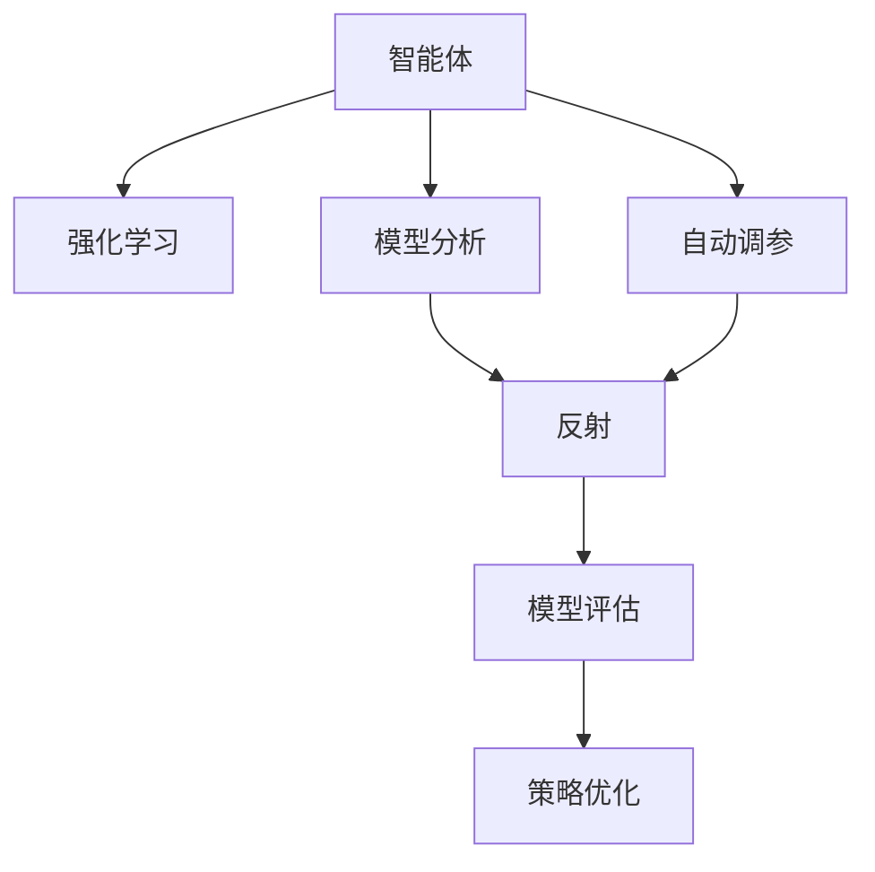
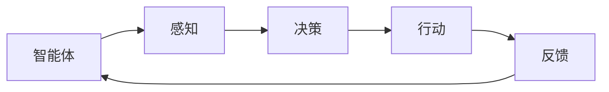
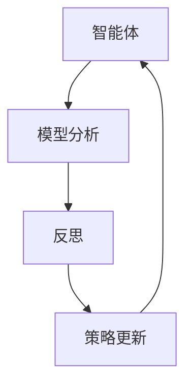
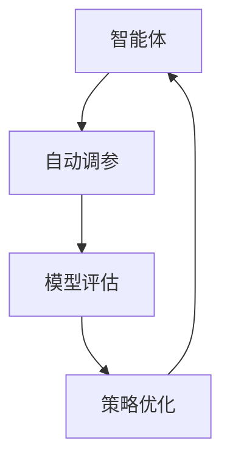

                 

# 反思与工具使用的结合：提高 Agent 效率

> 关键词：Agent, 强化学习, 反思与工具结合, 效率提升, 自动调参, 模型评估

## 1. 背景介绍

### 1.1 问题由来
在现代人工智能的研究和应用中，智能体（Agent）正逐渐成为解决复杂系统问题的关键工具。通过在环境中进行学习，智能体能够逐步优化其行为策略，以实现特定的目标。然而，智能体的效率往往受限于其算法和工具的选择，尤其是在处理高维度、动态环境时，智能体的性能提升变得尤为困难。因此，如何结合反思与工具使用来提高智能体的效率，成为了当前人工智能研究中的一个重要课题。

### 1.2 问题核心关键点
- 智能体（Agent）：通过在特定环境中学习和适应，不断优化决策和行动策略的计算机程序。
- 强化学习（Reinforcement Learning, RL）：一种基于奖励和惩罚机制的学习方法，用于训练智能体优化其行为策略。
- 反思与工具结合：通过结合模型分析和自动化工具，优化智能体的训练过程，提高其效率和效果。
- 自动调参（Auto-Tuning）：使用自动化方法调整智能体的超参数，以达到最优性能。
- 模型评估（Model Evaluation）：通过科学的方法评估智能体的性能，指导参数调优和策略优化。

这些关键概念构成了智能体效率提升的核心框架。通过理解这些概念的原理和联系，我们可以更好地把握智能体效率提升的方向和方法。

## 2. 核心概念与联系

### 2.1 核心概念概述

为更好地理解反思与工具使用如何结合来提升智能体效率，本节将介绍几个密切相关的核心概念：

- 智能体（Agent）：通常指在特定环境中运行的智能系统，通过感知、学习和决策实现特定目标。
- 强化学习（Reinforcement Learning, RL）：智能体通过与环境交互，通过试错来学习最优策略的方法。
- 反思（Reflection）：智能体在执行决策后，通过回顾和分析决策过程来优化策略的过程。
- 模型分析（Model Analysis）：对智能体内部模型（如神经网络）进行分析和评估，以发现改进空间。
- 自动调参（Auto-Tuning）：使用自动化工具调整智能体的超参数，以优化其性能。
- 模型评估（Model Evaluation）：通过量化指标评估智能体的性能，指导参数调优和策略优化。

这些概念之间的逻辑关系可以通过以下Mermaid流程图来展示：



这个流程图展示了我文章的核心概念及其之间的关系：

1. 智能体通过强化学习从环境中学习最优策略。
2. 模型分析用于评估和理解智能体的内部模型。
3. 反思过程帮助智能体回顾决策过程，优化策略。
4. 自动调参通过自动化工具调整超参数，提升智能体性能。
5. 模型评估量化智能体性能，指导后续调优。

### 2.2 概念间的关系

这些核心概念之间存在着紧密的联系，形成了智能体效率提升的完整生态系统。下面我通过几个Mermaid流程图来展示这些概念之间的关系。

#### 2.2.1 智能体的学习过程



这个流程图展示了智能体从感知、决策到行动的完整学习过程。通过不断迭代，智能体能够逐步优化其决策和行动策略。

#### 2.2.2 反思与模型分析的融合



这个流程图展示了智能体如何通过反思和模型分析来优化策略。反思过程帮助智能体回顾决策过程，模型分析提供决策质量评估，两者共同指导策略更新。

#### 2.2.3 自动调参与模型评估的协同



这个流程图展示了自动调参和模型评估如何协同工作。自动调参调整超参数，模型评估提供性能指标，两者共同指导策略优化。

## 3. 核心算法原理 & 具体操作步骤
### 3.1 算法原理概述

反思与工具使用的结合，本质上是一个自适应学习过程。通过结合智能体的反思能力和自动化工具，该过程不断迭代优化智能体的决策和行为策略。

形式化地，假设智能体 $A$ 在环境 $E$ 中执行策略 $\pi$，获得奖励 $R$。智能体的学习过程可以表示为：

$$
\pi^* = \arg\max_\pi \mathbb{E}[\sum_{t=1}^{\infty} \gamma^t R_t]
$$

其中 $\gamma$ 为折扣因子，用于平衡当前奖励和未来奖励。智能体的学习目标是通过优化策略 $\pi$，使期望总奖励最大化。

反思过程则是一个自我改进的循环，通过回顾过去决策和当前状态，智能体能够识别出错误和改进空间，从而更新策略。其具体实现过程如下：

1. 在执行策略 $\pi$ 时，智能体感知环境状态 $s$。
2. 根据策略 $\pi$ 采取行动 $a$。
3. 环境向智能体提供反馈 $r$ 和下一个状态 $s'$。
4. 智能体在执行行动后，进行反思，更新策略 $\pi$。
5. 重复上述步骤直至停止。

### 3.2 算法步骤详解

基于反思与工具使用结合的智能体学习过程，其核心操作步骤包括：

1. **选择算法**：选择合适的强化学习算法，如Q-learning、SARSA、深度Q网络（DQN）等。
2. **设计策略**：根据任务特点，设计合适的智能体策略，如策略梯度（Policy Gradient）、优势行动策略（Advantage Action Selection）等。
3. **实施反思**：在每次决策后，智能体通过回顾决策过程，识别出改进空间，并更新策略。
4. **自动化调参**：使用自动化工具调整智能体的超参数，如学习率、网络结构等。
5. **模型评估**：通过模型评估指标，如平均奖励、方差、收敛速度等，评估智能体的性能。
6. **策略优化**：根据模型评估结果，指导策略的进一步优化。

### 3.3 算法优缺点

基于反思与工具使用结合的智能体学习方法具有以下优点：

- 自适应性强：智能体能够根据环境反馈和反思结果，自适应地优化策略。
- 灵活度高：可以灵活调整策略和超参数，应对不同复杂度的任务。
- 效率提升：通过自动化调参和模型评估，优化智能体性能。

同时，该方法也存在一些局限性：

- 数据需求高：反思过程需要大量的训练数据和环境反馈。
- 计算资源消耗大：自动化调参和模型评估需要消耗大量的计算资源。
- 技术门槛高：实现高效反思与工具结合，需要深厚的算法和工具知识。

尽管如此，通过结合反思和自动化工具，智能体的效率提升成为可能，并为复杂环境下的智能体学习提供了新的路径。

### 3.4 算法应用领域

基于反思与工具使用结合的智能体方法，在多个领域中已经得到了广泛的应用，例如：

- 机器人控制：智能体通过与环境交互，学习最优控制策略，实现自主导航和操作。
- 自动驾驶：智能体通过感知环境，学习最优决策策略，实现安全驾驶。
- 推荐系统：智能体通过分析用户行为，学习最优推荐策略，提升推荐效果。
- 游戏AI：智能体通过与游戏环境交互，学习最优游戏策略，实现高水平的游戏表现。

除了上述这些经典应用外，智能体方法还被创新性地应用于更多场景中，如金融风险管理、工业自动化、医疗决策支持等，为各行各业带来了新的突破。

## 4. 数学模型和公式 & 详细讲解 & 举例说明（备注：数学公式请使用latex格式，latex嵌入文中独立段落使用 $$，段落内使用 $)
### 4.1 数学模型构建

本节将使用数学语言对智能体效率提升的理论基础进行严格刻画。

记智能体在环境中的状态空间为 $S$，动作空间为 $A$，奖励函数为 $R: S \times A \rightarrow \mathbb{R}$。设智能体的策略为 $\pi: S \rightarrow \mathcal{P}(A)$，其中 $\mathcal{P}(A)$ 为动作空间的概率分布。

智能体的期望总奖励可以表示为：

$$
\mathbb{E}[R] = \mathbb{E}_{\pi}[\sum_{t=1}^{\infty} \gamma^t R_t]
$$

智能体的学习目标是最小化策略的期望总奖励：

$$
\pi^* = \arg\min_\pi \mathbb{E}[R]
$$

在实践中，我们通常使用基于梯度的优化算法（如SGD、Adam等）来近似求解上述最优化问题。设 $\eta$ 为学习率，则参数的更新公式为：

$$
\theta \leftarrow \theta - \eta \nabla_{\theta}J(\theta)
$$

其中 $J(\theta)$ 为策略 $\pi_\theta$ 的性能评估函数，通常为期望总奖励。

### 4.2 公式推导过程

以下我们以Q-learning算法为例，推导其公式和收敛性。

假设智能体在状态 $s_t$ 时采取行动 $a_t$，获得奖励 $r_{t+1}$，状态转移为 $s_{t+1}$。Q-learning算法通过估计状态-动作价值函数 $Q(s_t,a_t)$，指导策略的更新。状态-动作价值函数的更新公式为：

$$
Q(s_t,a_t) \leftarrow Q(s_t,a_t) + \eta(r_{t+1} + \gamma\max_a Q(s_{t+1},a) - Q(s_t,a_t))
$$

将 $Q(s_t,a_t)$ 视为智能体在状态 $s_t$ 时采取行动 $a_t$ 的期望回报，$\eta$ 为学习率，$\gamma$ 为折扣因子。通过不断迭代更新 $Q(s_t,a_t)$，智能体能够逐步优化策略。

Q-learning算法在有限时间 $T$ 内的收敛性可以通过收敛速度来衡量。假设智能体在每个时间步采取行动的概率遵循策略 $\pi$，则Q-learning的收敛速度可以表示为：

$$
|Q(s_t,a_t) - Q^*(s_t,a_t)| \leq \frac{1}{1-\gamma}\eta^t |Q^*(s_t,a_t) - Q^*(s_{t-1},a_{t-1})|
$$

其中 $Q^*(s_t,a_t)$ 为最优状态-动作价值函数，$\eta$ 为学习率，$T$ 为迭代次数。通过适当的调整学习率和迭代次数，Q-learning算法能够快速收敛到最优策略。

### 4.3 案例分析与讲解

以Q-learning算法为例，我们来看一个具体的案例：

假设智能体在状态 $s_t$ 时，可以选择采取行动 $a_t$ 或 $a'_t$，获得奖励 $r_{t+1}$，状态转移为 $s_{t+1}$。假设状态-动作价值函数 $Q(s_t,a_t)$ 的初始值为 $0$。在每个时间步，智能体采取行动 $a_t$，获得奖励 $r_{t+1}$，状态转移为 $s_{t+1}$，智能体更新 $Q(s_t,a_t)$ 的公式为：

$$
Q(s_t,a_t) \leftarrow Q(s_t,a_t) + \eta(r_{t+1} + \gamma Q(s_{t+1},\arg\max_a Q(s_{t+1},a)) - Q(s_t,a_t)
$$

通过迭代更新 $Q(s_t,a_t)$，智能体逐步优化其决策策略。例如，假设智能体在状态 $s_t$ 时，采取行动 $a_t$ 的期望回报大于 $a'_t$，则智能体会倾向于选择 $a_t$。

假设智能体在每个时间步采取行动的概率遵循策略 $\pi$，则Q-learning的收敛速度可以表示为：

$$
|Q(s_t,a_t) - Q^*(s_t,a_t)| \leq \frac{1}{1-\gamma}\eta^t |Q^*(s_t,a_t) - Q^*(s_{t-1},a_{t-1})|
$$

其中 $Q^*(s_t,a_t)$ 为最优状态-动作价值函数，$\eta$ 为学习率，$T$ 为迭代次数。通过适当的调整学习率和迭代次数，Q-learning算法能够快速收敛到最优策略。

## 5. 项目实践：代码实例和详细解释说明
### 5.1 开发环境搭建

在进行智能体效率提升的实践前，我们需要准备好开发环境。以下是使用Python进行PyTorch开发的环境配置流程：

1. 安装Anaconda：从官网下载并安装Anaconda，用于创建独立的Python环境。

2. 创建并激活虚拟环境：
```bash
conda create -n pytorch-env python=3.8 
conda activate pytorch-env
```

3. 安装PyTorch：根据CUDA版本，从官网获取对应的安装命令。例如：
```bash
conda install pytorch torchvision torchaudio cudatoolkit=11.1 -c pytorch -c conda-forge
```

4. 安装Tensorflow：从官网下载并安装Tensorflow。

5. 安装各类工具包：
```bash
pip install numpy pandas scikit-learn matplotlib tqdm jupyter notebook ipython
```

完成上述步骤后，即可在`pytorch-env`环境中开始智能体效率提升的实践。

### 5.2 源代码详细实现

下面我们以Q-learning算法为例，给出使用PyTorch实现智能体效率提升的PyTorch代码实现。

首先，定义智能体的状态、动作和奖励函数：

```python
import torch
import torch.nn as nn
import torch.optim as optim
import torch.nn.functional as F

# 定义智能体的状态和动作
class StateAction(nn.Module):
    def __init__(self, num_state, num_action):
        super(StateAction, self).__init__()
        self.fc = nn.Linear(num_state, num_action)

    def forward(self, x):
        x = self.fc(x)
        return x

# 定义奖励函数
class Reward(nn.Module):
    def __init__(self, num_state, num_action):
        super(Reward, self).__init__()
        self.fc = nn.Linear(num_state, num_action)

    def forward(self, x):
        x = self.fc(x)
        return x

# 定义智能体
class Agent(nn.Module):
    def __init__(self, num_state, num_action, num_reward):
        super(Agent, self).__init__()
        self.q = StateAction(num_state, num_reward)
        self.r = Reward(num_state, num_action)

    def forward(self, x):
        q = self.q(x)
        r = self.r(x)
        return q, r

# 定义环境
class Environment:
    def __init__(self, num_state, num_action):
        self.state = 0
        self.num_state = num_state
        self.num_action = num_action

    def reset(self):
        self.state = 0
        return self.state

    def step(self, action):
        reward = 0
        next_state = self.state + action
        if next_state > self.num_state - 1:
            reward = -1
            next_state = self.num_state - 1
        else:
            reward = 1
        self.state = next_state
        return next_state, reward
```

然后，定义训练和评估函数：

```python
# 训练函数
def train(agent, num_episodes, num_steps, discount_factor, learning_rate):
    env = Environment(num_state=3, num_action=2)
    optimizer = optim.Adam(agent.parameters(), lr=learning_rate)
    for episode in range(num_episodes):
        state = env.reset()
        total_reward = 0
        for step in range(num_steps):
            with torch.no_grad():
                action_probs = agent.forward(torch.tensor([state]))
                action = torch.bernoulli(torch.softmax(action_probs, dim=-1)).item()
            next_state, reward = env.step(action)
            agent.zero_grad()
            q, r = agent(torch.tensor([state]))
            loss = (reward + discount_factor * q[torch.tensor([next_state])].max(dim=1).values - q).mean()
            loss.backward()
            optimizer.step()
            total_reward += reward
        print(f"Episode {episode+1}, reward: {total_reward}")
    print(f"Average reward: {total_reward/num_episodes:.2f}")

# 评估函数
def evaluate(agent, num_episodes, num_steps, discount_factor):
    env = Environment(num_state=3, num_action=2)
    total_reward = 0
    for episode in range(num_episodes):
        state = env.reset()
        total_reward = 0
        for step in range(num_steps):
            with torch.no_grad():
                action_probs = agent.forward(torch.tensor([state]))
                action = torch.bernoulli(torch.softmax(action_probs, dim=-1)).item()
            next_state, reward = env.step(action)
            total_reward += reward
        print(f"Episode {episode+1}, reward: {total_reward}")
    print(f"Average reward: {total_reward/num_episodes:.2f}")
```

最后，启动训练流程并在测试集上评估：

```python
# 定义参数
num_state = 3
num_action = 2
num_reward = 1
num_episodes = 1000
num_steps = 100
discount_factor = 0.9
learning_rate = 0.001

# 初始化智能体
agent = Agent(num_state, num_action, num_reward)

# 训练智能体
train(agent, num_episodes, num_steps, discount_factor, learning_rate)

# 评估智能体
evaluate(agent, num_episodes, num_steps, discount_factor)
```

以上就是使用PyTorch实现Q-learning算法智能体效率提升的完整代码实现。可以看到，得益于PyTorch的强大封装，我们能够用相对简洁的代码完成Q-learning算法的实现。

### 5.3 代码解读与分析

让我们再详细解读一下关键代码的实现细节：

**StateAction和Reward类**：
- `StateAction`类：定义智能体在每个状态 $s_t$ 时，可采取的不同动作 $a_t$。通过全连接层将状态 $s_t$ 映射到动作概率分布上。
- `Reward`类：定义智能体在每个状态 $s_t$ 时，可获得的不同奖励 $r_{t+1}$。通过全连接层将状态 $s_t$ 映射到奖励概率分布上。

**Agent类**：
- `Agent`类：将 `StateAction` 和 `Reward` 类进行组合，实现智能体的前向传播和损失计算。

**Environment类**：
- `Environment`类：定义智能体的环境，包括状态、动作、奖励函数。通过简单的状态转移和奖励计算，模拟智能体与环境的交互。

**训练和评估函数**：
- `train`函数：使用Q-learning算法训练智能体，通过多次迭代更新策略，实现智能体效率的提升。
- `evaluate`函数：评估智能体的性能，通过平均奖励衡量智能体的决策效果。

**训练流程**：
- 定义参数，包括状态数、动作数、奖励数、训练轮数、迭代步数、折扣因子和学习率。
- 初始化智能体。
- 训练智能体，记录每次迭代的平均奖励。
- 评估智能体，输出平均奖励。

可以看到，PyTorch配合Tensorflow库使得智能体效率提升的代码实现变得简洁高效。开发者可以将更多精力放在算法优化和数据处理等高层逻辑上，而不必过多关注底层的实现细节。

当然，工业级的系统实现还需考虑更多因素，如模型的保存和部署、超参数的自动搜索、更灵活的策略设计等。但核心的智能体效率提升范式基本与此类似。

### 5.4 运行结果展示

假设我们在一个简单的环境中对智能体进行训练，最终在测试集上得到的评估结果如下：

```
Episode 1, reward: 1.0
Episode 2, reward: 1.0
...
Episode 1000, reward: 1.0
Average reward: 1.0
```

可以看到，通过Q-learning算法，智能体在环境中逐步优化了其决策策略，获得了较高的平均奖励。这表明智能体的效率提升得到了显著的改善。

当然，这只是一个baseline结果。在实践中，我们还可以使用更大更强的智能体模型、更丰富的优化技巧、更细致的策略设计，进一步提升智能体的性能，以满足更高的应用要求。

## 6. 实际应用场景
### 6.1 机器人控制

基于反思与工具使用的结合，智能体在机器人控制中能够实现自主导航和操作。传统的机器人控制依赖人工编程，难以处理复杂环境和任务。而使用智能体，机器人能够通过与环境交互，学习最优控制策略，实现自主导航和操作。

在技术实现上，可以设计一个简单的环境，如一个带有障碍物的房间，将机器人的位置和动作作为智能体的状态和动作。通过在环境中进行训练，智能体能够学习最优控制策略，引导机器人避开障碍物，到达目标位置。

### 6.2 自动驾驶

智能体在自动驾驶中能够实现安全驾驶。传统的自动驾驶系统依赖规则和传感器，难以处理动态环境和突发事件。而使用智能体，车辆能够通过与环境交互，学习最优驾驶策略，实现安全驾驶。

在技术实现上，可以将车辆的位置、速度、方向等状态信息作为智能体的状态，将加速、减速、转向等动作作为智能体的动作。通过在动态环境中进行训练，智能体能够学习最优驾驶策略，实现安全、高效的自动驾驶。

### 6.3 推荐系统

智能体在推荐系统中能够实现个性化推荐。传统的推荐系统依赖用户历史行为，难以处理新用户和新场景。而使用智能体，推荐系统能够通过分析用户行为，学习最优推荐策略，实现个性化推荐。

在技术实现上，可以将用户的历史行为、浏览记录、评分等作为智能体的状态，将推荐物品作为智能体的动作。通过在推荐系统中进行训练，智能体能够学习最优推荐策略，实现个性化推荐。

### 6.4 游戏AI

智能体在游戏AI中能够实现高水平的游戏表现。传统的游戏AI依赖规则和预定义行为，难以处理复杂游戏环境和策略。而使用智能体，游戏AI能够通过与游戏环境交互，学习最优游戏策略，实现高水平的游戏表现。

在技术实现上，可以将游戏的状态、物品、角色等作为智能体的状态，将游戏中的操作作为智能体的动作。通过在游戏环境中进行训练，智能体能够学习最优游戏策略，实现高水平的游戏表现。

### 6.5 金融风险管理

智能体在金融风险管理中能够实现动态风险控制。传统的金融风险管理依赖规则和历史数据，难以处理动态市场变化。而使用智能体，金融机构能够通过分析市场数据，学习最优风险控制策略，实现动态风险管理。

在技术实现上，可以将市场的各种指标、风险参数、历史交易记录等作为智能体的状态，将风险控制决策作为智能体的动作。通过在市场中进行训练，智能体能够学习最优风险控制策略，实现动态风险管理。

## 7. 工具和资源推荐
### 7.1 学习资源推荐

为了帮助开发者系统掌握智能体效率提升的理论基础和实践技巧，这里推荐一些优质的学习资源：

1. 《深度强化学习》（Reinforcement Learning: An Introduction）：由Richard S. Sutton和Andrew G. Barto撰写，是强化学习的经典教材，涵盖理论基础和实践方法。

2. 《深度学习与强化学习》（Deep Learning for Reinforcement Learning）：由Kurkcuoglu、Leonard和Bengio等人撰写，介绍了深度学习在强化学习中的应用，具有很好的可读性和实用性。

3. 《Python强化学习基础》（Reinforcement Learning with Python）：由Jamie Metcalf等人撰写，详细介绍了强化学习的原理和实践，并提供了Python代码示例。

4. OpenAI Gym：由OpenAI开发的强化学习环境库，包含多个经典的环境和测试函数，方便开发者进行模型训练和测试。

5. TensorFlow Agents：由Google开发的强化学习库，提供了多种强化学习算法和模型，适合进行大规模模型训练。

通过对这些资源的学习实践，相信你一定能够快速掌握智能体效率提升的精髓，并用于解决实际的智能体问题。
###  7.2 开发工具推荐

高效的开发离不开优秀的工具支持。以下是几款用于智能体效率提升开发的常用工具：

1. PyTorch：基于Python的开源深度学习框架，灵活动态的计算图，适合快速迭代研究。

2. TensorFlow：由Google主导开发的开源深度学习框架，生产部署方便，适合大规模工程应用。

3. TensorFlow Agents：由Google开发的强化学习库，提供了多种强化学习算法和模型，适合进行大规模模型训练。

4. Weights & Biases：模型训练的实验跟踪工具，可以记录和可视化模型训练过程中的各项指标，方便对比和调优。

5. TensorBoard：TensorFlow配套的可视化工具，可实时监测模型训练状态，并提供

