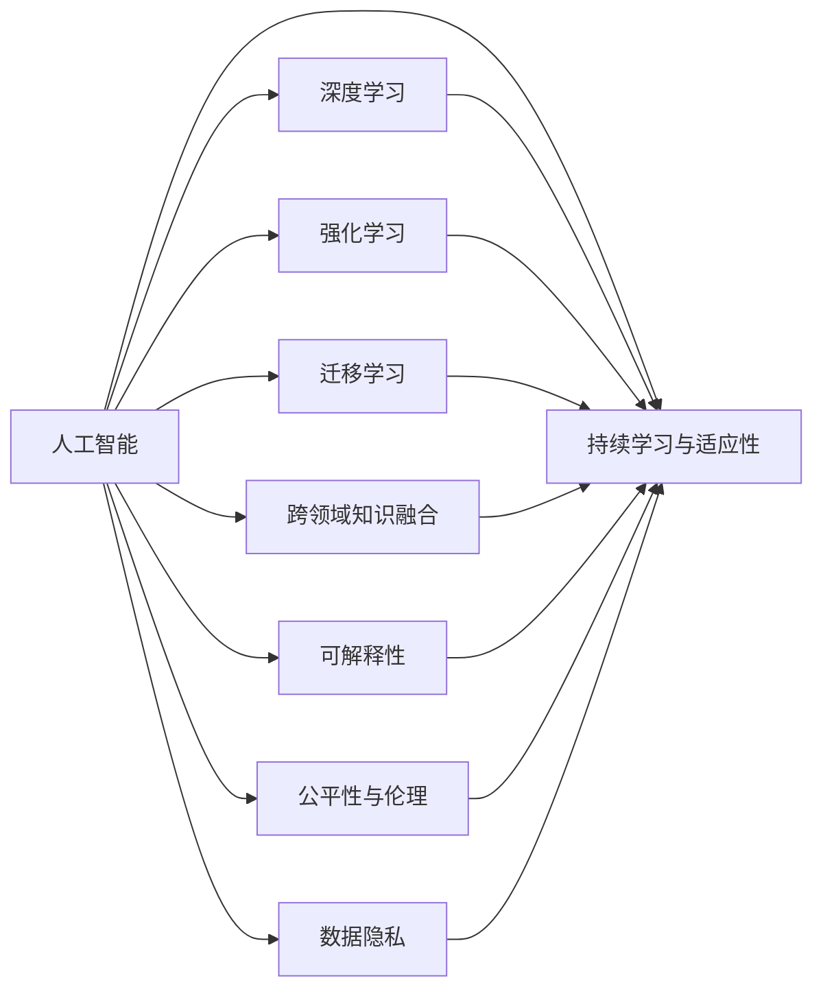
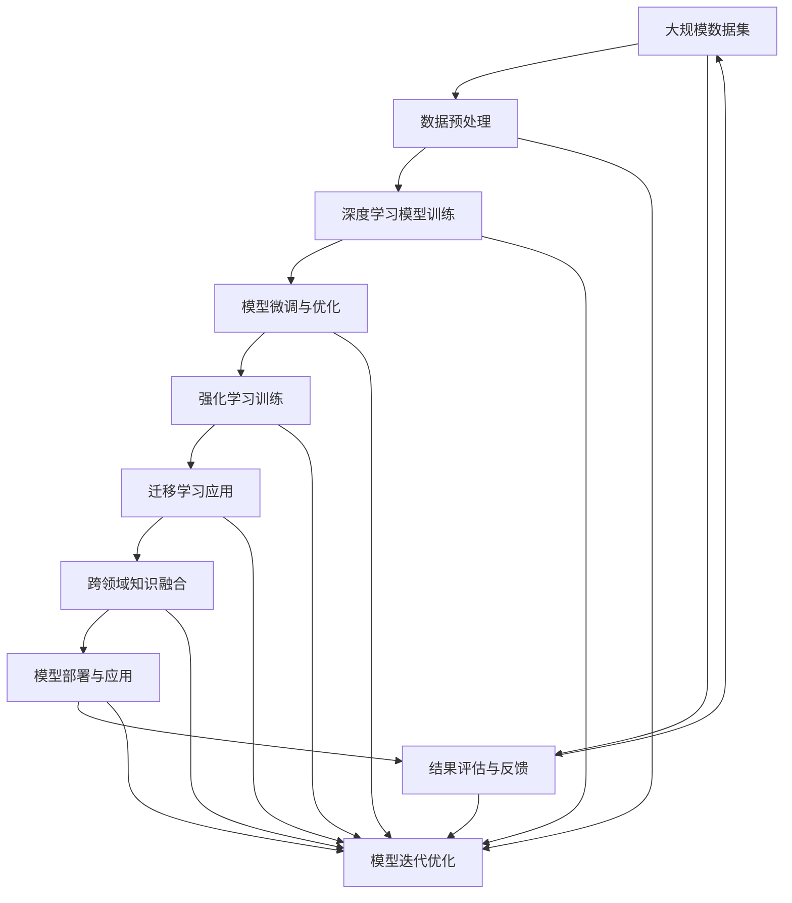

                 

## 1. 背景介绍

### 1.1 问题由来
人工智能(AI)作为21世纪最重要的前沿科技之一，已经在众多领域展现出巨大的应用潜力。无论是自动驾驶、智能推荐、医疗诊断，还是金融风险评估，AI技术都已经展示了其颠覆性能力。然而，从理论到应用的每一步跨越，都面临着一系列复杂且深刻的问题。

人工智能不仅仅是计算和算法的堆砌，更是一门集哲学、社会学、心理学、认知科学于一体的交叉学科。本文将从理论框架、实际应用和技术演进三个方面，探讨如何构建科学完备的人工智能理论，以及面临的挑战和未来展望。

### 1.2 问题核心关键点
构建科学完备的人工智能理论，需要从以下几个关键点入手：

- **科学基础**：理解AI的科学本质，构建基于实证的理论与模型。
- **数据驱动**：利用大规模数据驱动AI技术的不断迭代与优化。
- **人机协同**：实现人机协作，增强AI的智能水平和实际应用价值。
- **伦理考量**：确保AI技术应用符合伦理规范，保障社会公平与公正。
- **泛化能力**：提升AI模型的泛化能力，使其能够在不同情境下适应各种新任务。

本文旨在通过详细解析这些关键点，为AI技术的发展提供坚实的理论基础与明确的实践指导。

## 2. 核心概念与联系

### 2.1 核心概念概述

为更好地理解科学完备的人工智能理论，本节将介绍几个密切相关的核心概念：

- **人工智能**：通过算法和计算，使机器能够模拟人的智能行为，包括学习、推理、决策等。
- **深度学习**：利用多层神经网络进行复杂数据分析与模式识别，是当前AI技术的重要基础。
- **强化学习**：通过智能体与环境的互动，学习最优策略，以最大化长期奖励。
- **迁移学习**：将一个领域学到的知识应用到另一个不同但相关的领域。
- **跨领域知识融合**：将不同领域的专业知识进行整合，提升AI模型的理解能力与判断力。
- **可解释性**：AI模型输出结果的可解释性，确保决策过程透明、可控。
- **公平性与伦理**：确保AI技术应用不带有偏见，符合社会伦理标准。
- **数据隐私**：保护用户数据隐私，确保AI技术应用合法合规。
- **持续学习与适应性**：AI模型能够不断学习新知识，适应新环境。

这些核心概念共同构成了科学完备的人工智能理论的基石。理解这些概念之间的关系和相互作用，是构建科学完备AI理论的基础。

### 2.2 概念间的关系

这些核心概念之间存在着紧密的联系，形成了科学完备AI理论的完整体系。下面我们通过几个Mermaid流程图来展示这些概念之间的关系：



这个流程图展示了人工智能的各个子领域如何协同作用，共同推动科学完备AI理论的发展：

1. 深度学习作为核心技术，为AI提供了强大的数据处理能力。
2. 强化学习通过智能体与环境互动，提升了AI在复杂决策问题上的能力。
3. 迁移学习通过知识迁移，拓宽了AI的应用范围。
4. 跨领域知识融合利用了多学科知识，提高了AI的理解深度。
5. 可解释性确保AI决策过程的透明性与可控性。
6. 公平性与伦理确保AI应用的社会责任与道德规范。
7. 数据隐私保护了用户信息安全，提升了AI应用的合法性。
8. 持续学习与适应性使AI能够不断进步，适应新的应用场景。

理解这些概念及其相互关系，有助于全面把握科学完备AI理论的构建方向。

### 2.3 核心概念的整体架构

最后，我们用一个综合的流程图来展示这些核心概念在大规模AI系统中的整体架构：



这个综合流程图展示了从数据采集到模型部署的整个AI系统流程，以及各环节之间的相互作用。

## 3. 核心算法原理 & 具体操作步骤

### 3.1 算法原理概述
科学完备的人工智能理论，是基于对AI核心算法原理的深刻理解。其核心算法原理包括但不限于：

- **深度学习算法**：通过多层神经网络学习数据特征，实现模式识别与分类。
- **强化学习算法**：通过智能体与环境的互动，学习最优策略。
- **迁移学习算法**：利用已有的知识，加速新领域的学习过程。
- **跨领域知识融合算法**：整合不同领域的专业知识，提升模型的理解能力。
- **可解释性算法**：解释AI模型的决策过程，确保透明性和可控性。
- **公平性与伦理算法**：确保AI决策过程不带有偏见，符合伦理规范。

这些算法原理共同构成了科学完备AI理论的技术基础，是构建高性能、可解释、公平的AI系统的关键。

### 3.2 算法步骤详解
构建科学完备AI理论的具体步骤包括：

1. **数据收集与预处理**：收集高质量的数据集，并进行清洗、标注和标准化处理。
2. **模型训练与微调**：利用深度学习、强化学习等算法进行模型训练，并通过微调优化模型性能。
3. **知识融合与迁移**：通过跨领域知识融合和迁移学习，提升模型的理解深度和泛化能力。
4. **模型部署与应用**：将训练好的模型部署到实际应用场景中，并进行评估和优化。
5. **结果反馈与迭代**：根据评估结果，不断调整模型参数和算法，实现持续改进。

### 3.3 算法优缺点
科学完备AI理论的优势包括：

- **高性能**：通过深度学习等先进算法，模型能够处理复杂的数据集，实现高精度的预测与分类。
- **泛化能力强**：通过跨领域知识融合和迁移学习，模型能够适应不同情境，具有较强的泛化能力。
- **可解释性强**：通过可解释性算法，模型输出结果可被解释，增强了模型的透明性和可控性。
- **公平性与伦理合规**：通过公平性与伦理算法，确保AI决策过程不带有偏见，符合社会规范。

同时，科学完备AI理论也面临一些挑战：

- **数据依赖**：高质量数据集是模型性能的关键，数据收集与预处理成本较高。
- **模型复杂性**：深度学习模型结构复杂，训练和优化难度较大。
- **资源消耗大**：大规模数据集和高性能模型对计算资源有较高要求。
- **可解释性挑战**：部分AI模型（如黑盒模型）难以解释，增加了应用的复杂性。

### 3.4 算法应用领域
科学完备AI理论在多个领域展现了广泛的应用前景：

- **自然语言处理**：通过深度学习等算法，实现语音识别、机器翻译、文本生成等任务。
- **计算机视觉**：通过深度学习等算法，实现图像识别、目标检测、视频分析等任务。
- **医疗健康**：通过深度学习等算法，实现医学影像分析、病理诊断、个性化推荐等任务。
- **金融风控**：通过深度学习等算法，实现信用评估、风险预测、智能投顾等任务。
- **智能制造**：通过深度学习等算法，实现质量检测、故障诊断、智能调度等任务。

## 4. 数学模型和公式 & 详细讲解 & 举例说明

### 4.1 数学模型构建
科学完备AI理论的数学模型通常包括：

- **深度学习模型**：如卷积神经网络(CNN)、循环神经网络(RNN)、长短期记忆网络(LSTM)、变分自编码器(VAE)等。
- **强化学习模型**：如Q-learning、SARSA、深度Q网络(DQN)、策略梯度算法等。
- **迁移学习模型**：如迁移学习算法、领域自适应算法、知识蒸馏算法等。
- **跨领域知识融合模型**：如多模态融合算法、知识图谱嵌入算法等。
- **可解释性模型**：如LIME、SHAP、Attention等。
- **公平性与伦理模型**：如 fairness-aware 神经网络、公平优化算法等。

这些模型均基于数学公式进行构建，并通过算法进行优化。以下我们以深度学习模型为例，展示其数学模型构建过程。

### 4.2 公式推导过程
以简单的线性回归模型为例，展示其数学公式推导过程。

设有一组训练数据 $(x_1, y_1), (x_2, y_2), \ldots, (x_n, y_n)$，其中 $x_i \in \mathbb{R}^d$ 为输入特征，$y_i \in \mathbb{R}$ 为输出目标。线性回归模型的目标是通过一个线性函数拟合这些数据，即：

$$
y = \theta_0 + \theta_1 x_1 + \theta_2 x_2 + \ldots + \theta_d x_d
$$

其中 $\theta = (\theta_0, \theta_1, \ldots, \theta_d)^T$ 为模型参数。

为了最小化预测误差，我们使用均方误差损失函数：

$$
\mathcal{L}(\theta) = \frac{1}{2n} \sum_{i=1}^n (y_i - \hat{y}_i)^2
$$

其中 $\hat{y}_i = \theta_0 + \theta_1 x_{i1} + \theta_2 x_{i2} + \ldots + \theta_d x_{id}$。

最小化损失函数的过程可以通过梯度下降算法实现：

$$
\theta_{t+1} = \theta_t - \alpha \nabla_{\theta}\mathcal{L}(\theta_t)
$$

其中 $\alpha$ 为学习率。

### 4.3 案例分析与讲解
以一个简单的图像分类问题为例，展示深度学习模型的应用。

假设有一组训练数据集，包含多个图像和其对应的标签。模型结构为卷积神经网络(CNN)，输入为图像像素值，输出为类别标签。

具体步骤如下：

1. **数据预处理**：对图像数据进行归一化、裁剪、缩放等预处理操作。
2. **模型构建**：设计卷积层、池化层、全连接层等网络结构，并定义损失函数和优化器。
3. **模型训练**：使用训练数据集进行前向传播和反向传播，不断更新模型参数。
4. **模型评估**：使用验证集评估模型性能，根据评估结果调整超参数和模型结构。
5. **模型应用**：将训练好的模型应用于测试集，并输出预测结果。

## 5. 项目实践：代码实例和详细解释说明

### 5.1 开发环境搭建

为了实现上述数学模型和算法步骤，我们需要构建一个开发环境。以下是使用Python和PyTorch框架搭建开发环境的步骤：

1. 安装Anaconda：从官网下载并安装Anaconda，用于创建独立的Python环境。

2. 创建并激活虚拟环境：
```bash
conda create -n pytorch-env python=3.8 
conda activate pytorch-env
```

3. 安装PyTorch：根据CUDA版本，从官网获取对应的安装命令。例如：
```bash
conda install pytorch torchvision torchaudio cudatoolkit=11.1 -c pytorch -c conda-forge
```

4. 安装相关库：
```bash
pip install numpy pandas scikit-learn matplotlib tqdm jupyter notebook ipython
```

完成上述步骤后，即可在`pytorch-env`环境中开始实践科学完备AI理论的代码实现。

### 5.2 源代码详细实现

以下是一个简单的线性回归模型实现代码，展示了深度学习模型的构建和训练过程。

```python
import torch
import torch.nn as nn
import torch.optim as optim

# 定义线性回归模型
class LinearRegression(nn.Module):
    def __init__(self, input_dim, output_dim):
        super(LinearRegression, self).__init__()
        self.linear = nn.Linear(input_dim, output_dim)

    def forward(self, x):
        return self.linear(x)

# 加载数据集
def load_data():
    # 数据预处理
    X = torch.randn(100, 10)
    y = torch.randn(100, 1)

    return X, y

# 训练模型
def train_model(X, y, epochs, learning_rate):
    model = LinearRegression(input_dim=X.shape[1], output_dim=y.shape[1])
    criterion = nn.MSELoss()
    optimizer = optim.SGD(model.parameters(), lr=learning_rate)

    for epoch in range(epochs):
        model.train()
        optimizer.zero_grad()
        outputs = model(X)
        loss = criterion(outputs, y)
        loss.backward()
        optimizer.step()

    return model

# 加载数据集并训练模型
X, y = load_data()
model = train_model(X, y, epochs=100, learning_rate=0.01)
```

### 5.3 代码解读与分析

让我们再详细解读一下关键代码的实现细节：

**LinearRegression类**：
- `__init__`方法：初始化模型参数。
- `forward`方法：定义模型前向传播的过程。

**load_data函数**：
- 加载并预处理数据集，生成训练数据。

**train_model函数**：
- 定义模型结构、损失函数和优化器。
- 在每个epoch内进行前向传播、计算损失、反向传播和参数更新。
- 返回训练好的模型。

**训练流程**：
- 定义总epoch数和训练步数。
- 在每个epoch内，使用训练数据进行模型训练。
- 返回训练好的模型，即可用于评估和应用。

### 5.4 运行结果展示

在运行上述代码后，可以通过测试数据对模型进行评估，并输出评估结果。

```python
X_test = torch.randn(10, 10)
y_test = torch.randn(10, 1)

model.eval()
with torch.no_grad():
    y_pred = model(X_test)
```

输出结果显示模型对测试数据的预测结果，以及与真实标签的误差。

## 6. 实际应用场景

### 6.1 智能推荐系统

科学完备AI理论在智能推荐系统中的应用，能够大幅提升推荐效果和用户满意度。智能推荐系统通过分析用户历史行为数据和兴趣偏好，推荐符合用户需求的商品或内容。

具体而言，可以通过深度学习等算法，从用户历史行为数据中提取特征，并构建推荐模型。模型能够学习用户行为模式和兴趣变化，根据实时数据动态调整推荐结果，实现个性化推荐。

### 6.2 智能医疗诊断

在智能医疗诊断领域，科学完备AI理论的应用，能够显著提升诊断的准确性和效率。医学影像分析、病理诊断、基因组学分析等任务，都可以通过深度学习等算法实现自动化处理。

通过数据预处理、模型训练和微调，科学完备AI理论可以构建高效、准确的医疗诊断系统，辅助医生进行诊断和治疗决策。例如，可以使用卷积神经网络(CNN)对医学影像进行分类和分析，快速识别病变区域，提供精准的诊断结果。

### 6.3 智能城市管理

在智能城市管理领域，科学完备AI理论的应用，能够提升城市运行效率和治理水平。智能交通、智慧公安、环境监测等任务，都可以通过深度学习等算法实现智能化处理。

通过数据采集、分析和建模，科学完备AI理论可以构建高效的城市管理平台，实时监测城市运行状态，优化资源配置，提升城市治理能力。例如，可以使用深度学习模型对交通流量进行预测和优化，缓解交通拥堵问题；或使用智能安防系统，提升城市安全水平。

### 6.4 未来应用展望

随着科学完备AI理论的不断发展和应用，未来的AI技术将展现出更加广阔的前景。

- **全场景应用**：AI技术将深入各个行业，提升生产效率、优化资源配置、改善用户体验。
- **人机协同**：通过人机协同，AI技术将变得更加智能、高效、可靠。
- **伦理与责任**：AI技术的应用将更加注重伦理与社会责任，确保技术应用的公正与透明。
- **可持续发展**：AI技术将更加注重环境保护和资源节约，推动可持续发展。

科学完备AI理论的发展，将带来一场深刻的科技革命和社会变革，引领人类迈向更加智能化、智能化的未来。

## 7. 工具和资源推荐

### 7.1 学习资源推荐

为了帮助开发者系统掌握科学完备AI理论，这里推荐一些优质的学习资源：

1. 《深度学习》系列书籍：如Ian Goodfellow的《深度学习》、Michael Nielsen的《神经网络与深度学习》，详细介绍了深度学习的基本原理和算法。
2. Coursera《深度学习专项课程》：由Andrew Ng教授主讲的深度学习课程，涵盖深度学习的基础知识和应用实践。
3. CS231n《卷积神经网络》课程：斯坦福大学开设的计算机视觉课程，讲解了CNN的原理和应用。
4. Udacity《机器学习工程师纳米学位》：涵盖机器学习、深度学习、强化学习、自然语言处理等多方面内容，系统性强，实用性高。
5. GitHub开源项目：如TensorFlow、PyTorch等深度学习框架的官方文档和示例代码，提供了丰富的学习和实践资源。
6. Arxiv论文预印本：人工智能领域最新研究成果的发布平台，涵盖大量尚未发表的前沿工作，学习前沿技术的必读资源。

通过对这些资源的学习实践，相信你一定能够快速掌握科学完备AI理论的精髓，并用于解决实际的AI问题。

### 7.2 开发工具推荐

高效的开发离不开优秀的工具支持。以下是几款用于科学完备AI理论开发常用的工具：

1. PyTorch：基于Python的开源深度学习框架，灵活动态的计算图，适合快速迭代研究。
2. TensorFlow：由Google主导开发的开源深度学习框架，生产部署方便，适合大规模工程应用。
3. Weights & Biases：模型训练的实验跟踪工具，可以记录和可视化模型训练过程中的各项指标，方便对比和调优。
4. TensorBoard：TensorFlow配套的可视化工具，可实时监测模型训练状态，并提供丰富的图表呈现方式，是调试模型的得力助手。
5. Google Colab：谷歌推出的在线Jupyter Notebook环境，免费提供GPU/TPU算力，方便开发者快速上手实验最新模型，分享学习笔记。

合理利用这些工具，可以显著提升科学完备AI理论的开发效率，加快创新迭代的步伐。

### 7.3 相关论文推荐

科学完备AI理论的发展源于学界的持续研究。以下是几篇奠基性的相关论文，推荐阅读：

1. GAN：Generative Adversarial Networks（生成对抗网络）：由Ian Goodfellow等人提出的生成模型，通过对抗训练生成高质量图像、音频、视频等。
2. Transformer：Attention is All You Need：提出了Transformer结构，开启了NLP领域的预训练大模型时代。
3. AlphaGo：DeepMind的AlphaGo在围棋领域取得的突破，展示了强化学习的潜力。
4. 迁移学习：综述论文：《A Survey on Transfer Learning》：总结了迁移学习的各种方法和应用场景。
5. 可解释性：LIME：A Unified Approach to Interpreting Model Predictions：提出LIME算法，通过局部线性模型解释模型输出。
6. 公平性与伦理：Fairness-aware Generative Adversarial Networks：提出公平生成对抗网络，通过约束条件确保模型输出公平。

这些论文代表了大模型理论和算法的发展脉络，通过学习这些前沿成果，可以帮助研究者把握学科前进方向，激发更多的创新灵感。

除上述资源外，还有一些值得关注的前沿资源，帮助开发者紧跟科学完备AI理论的最新进展，例如：

1. arXiv论文预印本：人工智能领域最新研究成果的发布平台，涵盖大量尚未发表的前沿工作，学习前沿技术的必读资源。
2. 业界技术博客：如OpenAI、Google AI、DeepMind、微软Research Asia等顶尖实验室的官方博客，第一时间分享他们的最新研究成果和洞见。
3. 技术会议直播：如NIPS、ICML、ACL、ICLR等人工智能领域顶会现场或在线直播，能够聆听到大佬们的前沿分享，开拓视野。
4. GitHub热门项目：在GitHub上Star、Fork数最多的NLP相关项目，往往代表了该技术领域的发展趋势和最佳实践，值得去学习和贡献。
5. 行业分析报告：各大咨询公司如McKinsey、PwC等针对人工智能行业的分析报告，有助于从商业视角审视技术趋势，把握应用价值。

总之，科学完备AI理论的学习和实践，需要开发者保持开放的心态和持续学习的意愿。多关注前沿资讯，多动手实践，多思考总结，必将收获满满的成长收益。

## 8. 总结：未来发展趋势与挑战

### 8.1 总结

本文对科学完备人工智能理论进行了全面系统的介绍。首先阐述了科学完备AI理论的科学基础和实际应用，明确了AI技术的理论基础和应用价值。其次，从原理到实践，详细讲解了科学完备AI理论的构建方法，包括深度学习、强化学习、迁移学习等核心算法。同时，本文还广泛探讨了科学完备AI理论在智能推荐、医疗诊断、城市管理等多个领域的应用前景，展示了AI技术的广阔前景。

通过本文的系统梳理，可以看到，科学完备AI理论正在成为AI技术发展的重要基石，极大地推动了AI技术在各个行业的应用和落地。未来，伴随AI技术的不断进步，科学完备AI理论也将不断丰富和完善，为AI技术的发展提供坚实的理论基础和明确的实践指导。

### 8.2 未来发展趋势

展望未来，科学完备AI理论将呈现以下几个发展趋势：

1. **多模态融合**：科学完备AI理论将更多地结合多模态数据，提升模型在复杂情境下的理解和处理能力。
2. **跨领域知识融合**：通过跨领域知识融合，提升模型在特定领域的泛化能力和推理能力。
3. **可解释性与透明性**：科学完备AI理论将更加注重可解释性，确保AI决策过程透明、可控，增强用户信任。
4. **公平性与伦理**：科学完备AI理论将更加注重公平性与伦理，确保AI应用符合社会规范，保障社会公正。
5. **持续学习与适应性**：科学完备AI理论将更加注重持续学习与适应性，确保模型能够不断学习新知识，适应新环境。

这些趋势凸显了科学完备AI理论的广阔前景，为AI技术的发展提供了新的方向和动力。科学完备AI理论的发展，将引领AI技术的全面演进，推动AI技术在各个行业的应用和落地。

### 8.3 面临的挑战

尽管科学完备AI理论已经取得了显著进展，但在迈向更加智能化、普适化应用的过程中，仍面临诸多挑战：

1. **数据质量与隐私**：高质量数据是科学完备AI理论的核心，但数据收集与预处理成本较高，且存在隐私保护问题。
2. **模型复杂性与计算资源**：深度学习模型结构复杂，训练和优化难度较大，需要高性能计算资源支持。
3. **公平性与伦理**：科学完备AI理论的应用需确保公平性与伦理，避免模型偏见和歧视。
4. **可解释性与透明性**：部分AI模型难以解释，增加了应用的复杂性，降低了用户信任度。
5. **资源消耗与环境影响**：大规模深度学习模型对计算资源有较高要求，可能导致资源浪费和环境影响。

正视科学完备AI理论面临的这些挑战，积极应对并寻求突破，将是大规模AI技术走向成熟的重要方向。相信随着学界和产业界的共同努力，这些挑战终将一一被克服，科学完备AI理论必将在构建人机协同的智能时代中扮演越来越重要的角色。

### 8.4 研究展望

面对科学完备AI理论所面临的种种挑战，未来的研究需要在以下几个方面寻求新的突破：

1. **数据生成与合成**：开发更加高效的数据生成与合成技术，降低数据依赖，提升模型泛化能力。
2. **知识图谱与语义网络**：通过知识图谱与语义网络，增强AI模型的语义理解和推理能力。
3. **多代理协同**：通过多代理协同，提升AI系统的复杂决策能力，实现更智能的协同工作。
4. **智能代理与自主学习**：开发更加智能的代理系统，实现自主学习与适应性增强。
5. **认知模型与意识仿真**：通过认知模型与意识仿真，提升AI系统的自我意识与高级认知能力。

这些研究方向将推动科学完备AI理论的不断演进，为构建更加智能、全面、可靠的人工智能系统奠定坚实基础。科学完备AI理论的发展，必将引领AI技术的全面进步，为人类社会带来深远的变革。

## 9. 附录：常见问题与解答

**Q1：科学完备AI理论与传统AI技术有何不同？**

A: 科学完备AI理论的核心在于构建基于实证的理论与模型，强调数据驱动和科学基础。而传统AI技术更多依赖经验规则和手动调整，缺乏系统性和科学性。

**

