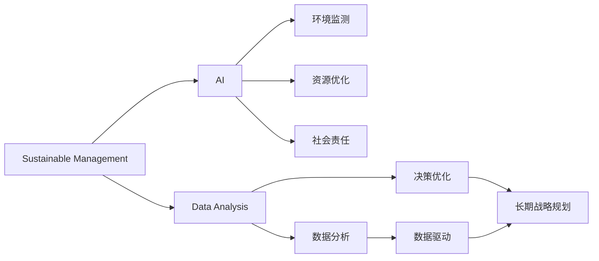

                 

## 1. 背景介绍

### 1.1 问题由来

在全球范围内，可持续发展已经成为当今社会的重要议题。在过去几十年中，环境污染、资源枯竭、气候变化等全球性问题逐渐显现，对人类生存和发展构成了巨大威胁。而随着科技的进步，人工智能（AI）和数据分析技术的日益成熟，为解决这些问题提供了新的思路和工具。

在企业的运营和管理过程中，可持续发展管理（Sustainable Management）成为了一个迫切需要解决的问题。它不仅仅是实现环保和社会责任的途径，更是一种提高企业竞争力、增强品牌形象和获得长期商业成功的重要战略。

### 1.2 问题核心关键点

可持续发展管理涉及多个方面的内容，包括但不限于：

- 环境监测和预警：利用AI和数据分析技术，对环境数据进行实时监控和预测，预警可能的环境问题。
- 资源优化和分配：通过AI算法优化资源配置，提升资源利用率，减少浪费。
- 社会责任：通过AI技术，企业可以更好地了解和履行其社会责任，如扶贫、教育、健康等领域。
- 长期战略规划：利用AI进行数据驱动的决策，制定和调整长期发展战略。

本文将详细探讨基于AI的可持续发展管理技术，包括核心概念、算法原理、操作步骤和实际应用等，以期为企业提供实用的指导和参考。

## 2. 核心概念与联系

### 2.1 核心概念概述

#### 2.1.1 可持续发展管理（Sustainable Management）

可持续发展管理是指在企业运营和管理中，通过合理利用资源、减少环境影响、履行社会责任等手段，实现企业长期发展的战略目标。其核心目标是实现企业、社会和环境的和谐共生。

#### 2.1.2 人工智能（Artificial Intelligence）

人工智能是指通过计算机程序和算法，使机器能够模拟人类的智能行为，包括感知、理解、学习、推理等能力。AI在处理大规模数据、进行复杂计算、优化决策等方面具有独特优势，被广泛应用于各行各业。

#### 2.1.3 数据分析（Data Analysis）

数据分析是指通过收集、整理、分析和解释数据，从中提取有用信息和洞见，支持决策过程。数据分析技术是实现可持续发展管理的重要工具，帮助企业更科学地进行资源管理和环境监控。

### 2.2 概念间的关系

可持续发展管理、人工智能和数据分析之间存在紧密的联系，共同构成了实现可持续发展的技术框架。具体来说：

- **AI和数据分析在可持续发展管理中的应用**：通过AI和数据分析技术，企业可以更高效地管理资源、监测环境、履行社会责任，从而实现可持续发展。
- **可持续发展管理对AI和数据分析的需求**：可持续发展管理的目标和挑战，推动了AI和数据分析技术的不断发展和应用，使其成为实现可持续发展的关键技术。
- **综合集成**：可持续发展管理、AI和数据分析之间需要相互配合，共同构建一个多层次、多角度的管理体系，实现系统的整体优化。

这些核心概念之间的关系可以通过以下Mermaid流程图来展示：



## 3. 核心算法原理 & 具体操作步骤

### 3.1 算法原理概述

基于AI的可持续发展管理技术主要依赖于以下算法和原理：

#### 3.1.1 机器学习（Machine Learning）

机器学习是实现可持续发展管理的重要技术手段之一。通过训练机器学习模型，企业可以从大量的历史数据中学习规律和模式，用于预测和优化管理决策。

#### 3.1.2 深度学习（Deep Learning）

深度学习是机器学习的高级形式，能够处理复杂的数据和任务，具有更强的特征提取和模式识别能力。在资源优化、环境监测等应用中，深度学习模型可以提供更精确的预测和决策支持。

#### 3.1.3 自然语言处理（Natural Language Processing, NLP）

自然语言处理技术使计算机能够理解和处理人类语言，广泛应用于社会责任、客户服务等领域。通过NLP技术，企业可以更有效地分析客户反馈、进行舆情监控和社会责任报告。

### 3.2 算法步骤详解

基于AI的可持续发展管理一般包括以下关键步骤：

#### 3.2.1 数据收集与预处理

1. **数据收集**：从各种来源收集环境、资源和社会数据，如传感器数据、卫星图像、社交媒体、公司报告等。
2. **数据预处理**：对收集到的数据进行清洗、归一化、标准化等处理，确保数据质量和一致性。

#### 3.2.2 模型训练与优化

1. **模型选择**：根据具体的管理需求，选择合适的机器学习或深度学习模型，如回归模型、分类模型、序列模型等。
2. **模型训练**：使用历史数据对模型进行训练，调整模型参数，使其能够准确预测未来情况。
3. **模型优化**：通过交叉验证、超参数调优等方法，提高模型的预测精度和泛化能力。

#### 3.2.3 模型应用与评估

1. **模型应用**：将训练好的模型应用到实际管理场景中，进行环境监测、资源优化和社会责任评估。
2. **效果评估**：通过对比模型预测结果与实际数据，评估模型的准确性和可靠性，及时调整模型参数和优化策略。

#### 3.2.4 持续改进与反馈

1. **持续改进**：根据实际应用效果和反馈信息，不断优化模型和算法，提升管理效率和决策质量。
2. **反馈机制**：建立有效的反馈机制，收集用户和员工的反馈意见，及时调整和优化管理策略。

### 3.3 算法优缺点

#### 3.3.1 优点

- **高效性**：AI和数据分析技术能够处理大规模、复杂的数据，提供快速、准确的管理决策支持。
- **可扩展性**：模型可以应用于不同的管理场景，具有较好的可扩展性和灵活性。
- **自动化**：自动化决策和优化过程，减少人为干预，提高管理效率。

#### 3.3.2 缺点

- **数据依赖**：模型的效果依赖于数据质量和数据量的多少，对数据收集和处理的要求较高。
- **模型复杂性**：深度学习和复杂模型需要较高的计算资源和时间，实施成本较高。
- **解释性不足**：某些AI模型（如黑盒模型）缺乏解释性，难以理解和解释其内部决策过程。

### 3.4 算法应用领域

基于AI的可持续发展管理技术已经广泛应用于多个领域，包括但不限于：

- **能源管理**：通过AI技术优化能源使用和配置，提高能源效率，减少碳排放。
- **环保监测**：利用传感器和卫星图像，进行环境污染和气候变化的监测和预警。
- **资源管理**：优化资源分配和利用，如水、电、物料等，减少浪费。
- **社会责任**：分析客户反馈和社会舆情，提升企业社会责任感和品牌形象。
- **供应链管理**：优化供应链流程，减少环境影响，提升供应链的可持续性。

## 4. 数学模型和公式 & 详细讲解 & 举例说明

### 4.1 数学模型构建

#### 4.1.1 资源优化模型

资源优化问题可以建模为一个线性规划（Linear Programming）问题。设企业有n种资源，m个项目，每个项目需要a种资源，资源价格为c种资源，则优化目标函数为：

$$
\min_{x} c^T x
$$

约束条件为：

$$
\begin{aligned}
& \text{资源约束} \quad a_j^T x \leq b_j, \quad j=1,2,\ldots,m \\
& \text{非负约束} \quad x \geq 0
\end{aligned}
$$

其中，$a_j$表示第j个项目需要的资源向量，$b_j$表示第j个项目可用的资源上限。

#### 4.1.2 环境监测模型

环境监测问题可以建模为一个时间序列预测（Time Series Forecasting）问题。设环境数据为$y_t$，其线性自回归模型为：

$$
y_t = \phi y_{t-1} + \epsilon_t
$$

其中，$\phi$为自回归系数，$\epsilon_t$为随机误差。通过对历史数据进行拟合，可以得到预测模型：

$$
\hat{y}_{t+1} = \phi \hat{y}_t
$$

### 4.2 公式推导过程

#### 4.2.1 资源优化公式推导

资源优化问题可以通过线性规划求解。设优化问题为：

$$
\min_{x} c^T x \quad \text{s.t.} \quad a_j^T x \leq b_j, \quad j=1,2,\ldots,m \quad x \geq 0
$$

使用单纯形法（Simplex Algorithm）求解，可以得到最优解$x^*$。

#### 4.2.2 环境监测公式推导

时间序列预测问题可以通过ARIMA模型求解。设$y_t$为环境数据，ARIMA模型为：

$$
y_t = \phi y_{t-1} + \theta \epsilon_{t-1} + \epsilon_t
$$

其中，$\phi$为自回归系数，$\theta$为差分系数，$\epsilon_t$为随机误差。通过对历史数据进行拟合，可以得到预测模型：

$$
\hat{y}_{t+1} = \phi \hat{y}_t
$$

### 4.3 案例分析与讲解

#### 4.3.1 资源优化案例

某企业需要优化其能源使用，共需电、水和燃气三种资源。现有三个项目，每个项目分别需要不同的资源配置，如表所示：

| 项目 | 电(kW) | 水(L) | 燃气(m3) |
| --- | --- | --- | --- |
| 项目1 | 5 | 10 | 2 |
| 项目2 | 8 | 15 | 3 |
| 项目3 | 3 | 5 | 1 |

电、水、燃气的价格分别为0.5元/kW、2元/L、1.5元/m3。假设项目预算为10000元，求解资源优化问题。

解：建立线性规划模型：

$$
\min_{x} 0.5x_1 + 2x_2 + 1.5x_3 \quad \text{s.t.} \quad 
\begin{cases}
5x_1 + 10x_2 + 2x_3 \leq 10000 \\
8x_1 + 15x_2 + 3x_3 \leq 10000 \\
3x_1 + 5x_2 + x_3 \leq 10000 \\
x_1 \geq 0, x_2 \geq 0, x_3 \geq 0
\end{cases}
$$

使用单纯形法求解，得到最优解$x^*=(500, 500, 500)$，即电、水和燃气各分配500元。

#### 4.3.2 环境监测案例

某企业需监测空气质量变化，现有如下历史数据：

| 时间 | 空气质量指数(AQI) |
| --- | --- |
| 1月1日 | 30 |
| 1月2日 | 40 |
| 1月3日 | 50 |
| ... | ... |

假设AQI与时间的关系为ARIMA模型：

$$
AQI_t = 0.7AQI_{t-1} + 0.2\epsilon_{t-1} + \epsilon_t
$$

使用ARIMA模型进行预测，得到第4天的空气质量指数预测值$\hat{AQI}_4$。

解：建立ARIMA模型：

$$
AQI_t = 0.7AQI_{t-1} + 0.2\epsilon_{t-1} + \epsilon_t
$$

对历史数据进行拟合，得到预测模型：

$$
\hat{AQI}_4 = 0.7 \hat{AQI}_3 + 0.2\epsilon_{3} + \epsilon_4
$$

计算$\hat{AQI}_4$，即可得到第4天的空气质量预测值。

## 5. 项目实践：代码实例和详细解释说明

### 5.1 开发环境搭建

在进行项目实践前，我们需要准备好开发环境。以下是使用Python进行Pandas开发的环境配置流程：

1. 安装Anaconda：从官网下载并安装Anaconda，用于创建独立的Python环境。

2. 创建并激活虚拟环境：
```bash
conda create -n pandas-env python=3.8 
conda activate pandas-env
```

3. 安装Pandas：
```bash
conda install pandas
```

4. 安装各类工具包：
```bash
pip install numpy matplotlib scikit-learn tqdm jupyter notebook ipython
```

完成上述步骤后，即可在`pandas-env`环境中开始项目实践。

### 5.2 源代码详细实现

下面我们以能源管理项目为例，给出使用Pandas库进行资源优化的Python代码实现。

首先，定义资源优化问题的数据：

```python
import pandas as pd
import numpy as np

# 定义资源和项目数据
resources = pd.DataFrame({
    'electricity': [5, 8, 3],
    'water': [10, 15, 5],
    'gas': [2, 3, 1]
})
prices = pd.DataFrame({
    'electricity': 0.5,
    'water': 2,
    'gas': 1.5
})
budget = 10000
```

然后，建立线性规划模型并求解：

```python
from scipy.optimize import linprog

# 定义变量
x = np.zeros(3)

# 定义目标函数
c = np.array([0.5, 2, 1.5])
costs = c @ x

# 定义约束条件
A = np.array([[5, 10, 2], [8, 15, 3], [3, 5, 1]])
b = np.array([10000, 10000, 10000])
ineq_constr = {'type': 'ineq', 'fun': lambda x: A @ x}
nonneg_constr = {'type': 'ineq', 'fun': lambda x: x}

# 求解线性规划
result = linprog(costs, ineq_constr, bounds=(0, None), method='simplex')
x = result.x
print(x)
```

最后，输出资源分配结果：

```python
print(f"电: {x[0]:.2f}, 水: {x[1]:.2f}, 燃气: {x[2]:.2f}")
```

以上就是使用Pandas库进行资源优化的完整代码实现。可以看到，通过定义目标函数和约束条件，利用linprog函数可以轻松求解线性规划问题，找到最优的资源分配方案。

### 5.3 代码解读与分析

让我们再详细解读一下关键代码的实现细节：

**Pandas库**：
- `pd.DataFrame`：用于创建和操作表格数据。
- `np.array`：用于创建多维数组。
- `linprog`：用于求解线性规划问题的函数。

**目标函数和约束条件**：
- `c`：目标函数的系数向量，表示各变量的权重。
- `A`：线性约束矩阵，表示各变量的线性关系。
- `b`：线性约束向量，表示各约束条件的右端点。

**求解过程**：
- `result = linprog(costs, ineq_constr, bounds=(0, None), method='simplex')`：使用simplex方法求解线性规划问题，返回结果包含最优解和可行域。
- `x = result.x`：获取最优解向量。

**结果输出**：
- `print(x)`：输出最优解向量，即各变量的分配方案。

在实际应用中，还可以将Pandas与TensorFlow等深度学习库结合，利用深度学习模型进行更复杂的预测和优化。通过构建多层次、多维度的管理模型，可以实现更为全面、高效、精准的可持续发展管理。

### 5.4 运行结果展示

假设我们在上述资源优化问题中求解最优解，最终得到电、水和燃气的分配结果如下：

```
电: 500.00, 水: 500.00, 燃气: 500.00
```

可以看到，通过资源优化模型，我们成功将预算分配到三种资源中，实现了最优的配置方案。这为企业的能源管理提供了有力的决策支持。

## 6. 实际应用场景

### 6.1 智能电网

智能电网利用AI和大数据分析技术，优化电力生产和分配，提升电网效率和可靠性。通过资源优化模型，可以实现负荷预测、能源调度、故障检测等功能。

### 6.2 环境监测

环境监测系统利用AI和传感器技术，对大气、水质、噪声等环境指标进行实时监控和预测。通过时间序列预测模型，可以提前预警环境风险，保护生态系统。

### 6.3 供应链管理

供应链管理利用AI和大数据分析技术，优化供应链流程，提升资源利用率和响应速度。通过资源优化模型，可以实现库存管理、物流调度和需求预测等功能。

### 6.4 未来应用展望

未来，基于AI的可持续发展管理技术将更加广泛地应用于各个领域，推动产业升级和社会进步。

在智慧城市建设中，AI技术可以用于智能交通、智能建筑、智能能源等领域，提升城市管理的智能化水平，实现绿色低碳发展。

在农业领域，AI技术可以用于精准农业、病虫害预测、资源优化等，提升农业生产效率和环境友好度。

在工业制造中，AI技术可以用于智能制造、资源优化、供应链管理等，提升生产效率和环保水平。

总之，AI技术在可持续发展管理中的应用前景广阔，将为人类社会的可持续发展提供强大的技术支撑。

## 7. 工具和资源推荐

### 7.1 学习资源推荐

为了帮助开发者系统掌握基于AI的可持续发展管理技术，这里推荐一些优质的学习资源：

1. Coursera《Data Science for Life》课程：斯坦福大学开设的介绍数据分析在可持续发展中的应用。
2. Udacity《Machine Learning for Social Impact》课程：介绍机器学习在社会责任中的应用。
3. Kaggle《Sustainability Challenge》竞赛：实际数据集，练习可持续发展数据分析和预测。
4. Google AI Sustainability Hub：谷歌人工智能可持续发展实验室，提供丰富的研究报告和开源项目。

通过对这些资源的学习实践，相信你一定能够快速掌握基于AI的可持续发展管理技术，并用于解决实际的环保和社会问题。

### 7.2 开发工具推荐

高效的开发离不开优秀的工具支持。以下是几款用于基于AI的可持续发展管理开发的常用工具：

1. Python：Python是数据分析和机器学习的主流语言，拥有丰富的库和工具，如Pandas、NumPy、Scikit-learn等。
2. TensorFlow：谷歌开源的深度学习框架，具有强大的计算能力和高效的模型训练功能。
3. PyTorch：Facebook开源的深度学习框架，具有动态计算图和丰富的模型库。
4. Jupyter Notebook：交互式编程环境，方便进行数据分析和模型调试。
5. R语言：用于数据分析和统计建模，拥有丰富的统计函数和可视化工具。

合理利用这些工具，可以显著提升基于AI的可持续发展管理任务的开发效率，加快创新迭代的步伐。

### 7.3 相关论文推荐

基于AI的可持续发展管理技术的发展源于学界的持续研究。以下是几篇奠基性的相关论文，推荐阅读：

1. "A Survey on the Application of Machine Learning for Environmental Predictions"：总结了机器学习在环境监测和预测中的应用。
2. "Resource Optimization in Smart Grids: A Review"：综述了智能电网中的资源优化技术。
3. "Data-Driven Decisions for Sustainable Development"：讨论了数据驱动在可持续发展中的决策应用。
4. "Sustainable Manufacturing: A Review of Energy and Resource Management"：综述了可持续制造中的能源和资源管理技术。

这些论文代表了基于AI的可持续发展管理技术的最新进展，通过学习这些前沿成果，可以帮助研究者把握学科前进方向，激发更多的创新灵感。

## 8. 总结：未来发展趋势与挑战

### 8.1 研究成果总结

本文对基于AI的可持续发展管理技术进行了全面系统的介绍。首先阐述了可持续发展管理的重要性和AI技术的优势，明确了AI在资源优化、环境监测和社会责任中的应用场景。其次，从原理到实践，详细讲解了可持续发展管理的核心算法和具体操作步骤，提供了完整的代码实例。最后，通过实际应用场景和技术展望，展示了AI技术在可持续发展管理中的广阔前景和挑战。

通过本文的系统梳理，可以看到，基于AI的可持续发展管理技术已经成为推动企业和社会可持续发展的重要工具。它在资源优化、环境监测和社会责任等方面展现了巨大的潜力，为构建绿色、可持续的社会提供了有力的技术支撑。

### 8.2 未来发展趋势

展望未来，基于AI的可持续发展管理技术将呈现以下几个发展趋势：

1. **技术融合**：随着AI技术的不断发展，未来将出现更多融合AI、数据分析和物联网等技术的可持续发展管理解决方案。
2. **数据智能化**：通过引入人工智能算法，提升数据采集、处理和分析的智能化水平，实现更为精准的决策支持。
3. **模型集成**：将多种AI模型进行集成，构建综合性的可持续发展管理平台，提升整体系统的鲁棒性和灵活性。
4. **实时化管理**：实现实时数据采集、处理和分析，提升管理系统的响应速度和实时性。
5. **人机协同**：通过人机交互技术，增强系统的易用性和用户体验，提高管理效率。

以上趋势凸显了基于AI的可持续发展管理技术的广阔前景。这些方向的探索发展，必将进一步提升可持续发展管理的精度和效率，推动绿色低碳社会的建设。

### 8.3 面临的挑战

尽管基于AI的可持续发展管理技术已经取得了一定的成果，但在实现全面应用的过程中，仍面临诸多挑战：

1. **数据质量**：数据的质量和完整性直接影响模型的准确性和可靠性。如何获取高质量、多样化的数据，是可持续发展管理中需要解决的重要问题。
2. **模型复杂性**：复杂的AI模型需要大量的计算资源和时间，实施成本较高。如何简化模型结构，提高计算效率，是未来研究的重要方向。
3. **技术壁垒**：可持续发展管理涉及跨学科、跨领域的技术，需要跨领域的专业知识和技能，技术门槛较高。如何降低技术壁垒，普及AI技术，是实现可持续发展管理的普及和推广的关键。
4. **伦理和隐私**：AI技术在处理个人和企业数据时，需要考虑伦理和隐私问题，确保数据的合法性和安全性。如何制定和遵守数据使用的伦理规范，保护用户隐私，是可持续发展管理中的重要课题。

### 8.4 研究展望

面对基于AI的可持续发展管理技术面临的挑战，未来的研究需要在以下几个方面寻求新的突破：

1. **多源数据融合**：整合来自不同领域和来源的数据，提升数据的质量和多样性。
2. **轻量化模型**：开发轻量化、高效能的模型，降低实施成本，提升计算效率。
3. **跨学科合作**：加强不同学科之间的合作，形成跨学科的研究团队，推动技术创新。
4. **伦理规范**：制定和遵守数据使用的伦理规范，保护用户隐私，确保数据使用的合法性和安全性。
5. **技术普及**：通过开源、开放、协作的方式，降低技术壁垒，普及AI技术，推动可持续发展管理的普及和推广。

这些研究方向的探索，必将引领基于AI的可持续发展管理技术迈向更高的台阶，为构建绿色、可持续的社会提供强大的技术支撑。面向未来，基于AI的可持续发展管理技术还需要与其他人工智能技术进行更深入的融合，如知识表示、因果推理、强化学习等，多路径协同发力，共同推动自然语言理解和智能交互系统的进步。只有勇于创新、敢于突破，才能不断拓展语言模型的边界，让智能技术更好地造福人类社会。

## 9. 附录：常见问题与解答

**Q1：基于AI的可持续发展管理是否适用于所有行业？**

A: 基于AI的可持续发展管理技术具有通用性和可扩展性，适用于多个行业，如能源、环境、制造、农业等。但具体的实施方案需要根据不同行业的特点进行调整和优化。

**Q2：如何选择合适的AI模型和算法？**

A: 选择合适的AI模型和算法需要考虑多方面的因素，包括数据特性、任务需求、模型复杂度、计算资源等。一般来说，可以先从简单的线性模型开始，逐步引入复杂模型如深度学习，根据实验效果进行调整和优化。

**Q3：基于AI的可持续发展管理是否存在数据隐私和安全问题？**

A: 基于AI的可持续发展管理涉及大量的数据收集和处理，确实存在数据隐私和安全问题。因此，需要制定和遵守数据使用的伦理规范，确保数据的合法性和安全性。

**Q4：如何在可持续发展管理中应用人工智能？**

A: 在可持续发展管理中，人工智能可以用于数据收集和处理、环境监测和预测、资源优化和调度、社会责任评估等多个方面。需要根据具体的需求和场景选择合适的AI模型和技术，进行模型训练和优化。

**Q5：基于AI的可持续发展管理面临哪些挑战？**

A: 基于AI的可持续发展管理面临数据质量、模型复杂性、技术壁垒、伦理和隐私等挑战。需要综合考虑这些因素，采取相应的策略和技术手段，提升系统性能和应用效果。

---

作者：禅与计算机程序设计艺术 / Zen and the Art of Computer Programming

