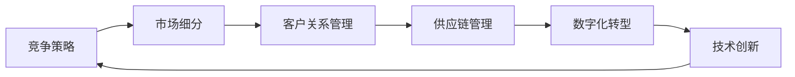

                 

# 商业领域的竞争格局变化

在过去的几十年里，商业领域的竞争格局经历了翻天覆地的变化。从线下实体店的竞争，到线上电商平台的竞争，再到如今的数字化、智能化时代的竞争，每一次变革都伴随着技术的进步和市场的重塑。随着人工智能、大数据、区块链等前沿技术的迅猛发展，商业领域的竞争格局正在发生深刻的变革。本文将从核心概念、核心算法、应用实例、未来展望等方面深入探讨这一变革，帮助读者理解这一变化背后的技术驱动力。

## 1. 背景介绍

### 1.1 技术驱动的商业变革
随着计算机技术的飞速发展，商业领域的竞争格局也在发生着翻天覆地的变化。特别是人工智能和大数据技术的崛起，使得商业组织能够在更广阔的范围内进行数据获取、分析和应用，从而在竞争中获得更大的优势。以下将详细介绍几个核心的技术驱动力：

1. **人工智能（AI）**：人工智能通过模拟人的智能行为，实现自动化、智能化决策，提高运营效率，降低成本，并创造更多价值。

2. **大数据（Big Data）**：大数据技术能够处理和分析海量数据，帮助企业洞察市场趋势、用户需求和行为模式，优化产品和服务，提升客户满意度。

3. **区块链（Blockchain）**：区块链技术通过去中心化的方式，确保数据的安全和透明，提高交易的效率和可靠性，应用于供应链管理、金融服务等场景。

4. **物联网（IoT）**：物联网通过连接物理世界的设备和传感器，实现数据的实时收集和处理，推动智能化、自动化业务流程的发展。

### 1.2 商业变革的驱动因素
商业领域的竞争格局变化主要受到以下因素的驱动：

1. **技术创新**：技术革新驱动了商业模式的转变，如电商平台的崛起、社交媒体的普及、在线教育的兴起等。

2. **市场趋势**：市场需求的变化促使企业不断创新，如健康、环保、可持续发展的趋势促进了绿色商业的发展。

3. **政策法规**：政策法规的变化影响企业的运营方式，如数据隐私保护、反垄断法等。

4. **竞争态势**：竞争对手的动态变化要求企业不断优化自身的业务模式和策略。

## 2. 核心概念与联系

### 2.1 核心概念概述

在商业领域的竞争格局变化中，以下几个核心概念至关重要：

1. **竞争策略（Competitive Strategy）**：企业在市场竞争中采取的策略和行动，包括市场定位、价格策略、产品差异化等。

2. **市场细分（Market Segmentation）**：将市场分为多个细分市场，针对不同的细分市场制定相应的营销策略。

3. **客户关系管理（CRM）**：通过系统化的管理手段，提升客户满意度和忠诚度，保持客户长期价值。

4. **供应链管理（Supply Chain Management）**：优化供应链各环节的流程，提高效率和透明度，降低成本。

5. **数字化转型（Digital Transformation）**：通过数字化技术重塑企业运营流程，提升竞争力。

### 2.2 核心概念间的联系

这些核心概念之间存在着紧密的联系，形成了一个系统的商业竞争体系。以下通过一个Mermaid流程图展示这些概念间的联系：



这个流程图展示了从竞争策略到技术创新的各个环节，以及这些环节如何相互影响，共同推动商业竞争格局的变化。

## 3. 核心算法原理 & 具体操作步骤

### 3.1 算法原理概述

在商业竞争中，算法和数学模型起到了至关重要的作用。这些算法和模型通过数据分析和优化，帮助企业制定更有效的竞争策略，提升市场竞争力。以下介绍几个核心算法及其原理：

1. **市场细分算法（Market Segmentation Algorithms）**：通过聚类分析、分类算法等，将市场分为多个细分市场，帮助企业识别目标市场和客户群体。

2. **价格优化算法（Price Optimization Algorithms）**：通过动态定价策略、需求预测等，实现最优价格，最大化利润。

3. **需求预测算法（Demand Forecasting Algorithms）**：利用时间序列分析、机器学习等技术，预测市场需求变化，指导生产和库存管理。

4. **客户关系管理算法（CRM Algorithms）**：通过客户行为分析、情感分析等，提升客户满意度和忠诚度。

5. **供应链优化算法（Supply Chain Optimization Algorithms）**：通过优化算法如遗传算法、线性规划等，优化供应链各环节，提高效率和透明度。

### 3.2 算法步骤详解

以需求预测算法为例，详细讲解其实现步骤：

1. **数据收集**：收集历史销售数据、市场数据、天气数据等，构建预测模型所需的数据集。

2. **特征工程**：对数据进行清洗、归一化、特征选择等预处理，构建特征向量。

3. **模型选择**：选择合适的预测模型，如线性回归、决策树、随机森林、深度学习等。

4. **模型训练**：使用训练数据集对模型进行训练，调整模型参数，使其拟合历史数据。

5. **模型评估**：使用测试数据集对模型进行评估，计算均方误差、均方根误差等指标。

6. **模型应用**：将训练好的模型应用于实时数据，进行需求预测。

### 3.3 算法优缺点

每个算法都有其优缺点，以下分别介绍：

**市场细分算法**
- **优点**：能够精确识别目标市场和客户群体，制定针对性营销策略。
- **缺点**：算法复杂度高，对数据质量和特征工程要求高。

**价格优化算法**
- **优点**：通过动态定价策略，最大化利润。
- **缺点**：需要对市场变化和消费者行为有深入理解，模型调整复杂。

**需求预测算法**
- **优点**：能够提前预测市场需求变化，指导生产和库存管理。
- **缺点**：模型需要持续更新，适应市场变化。

**客户关系管理算法**
- **优点**：提升客户满意度和忠诚度，增加长期价值。
- **缺点**：算法复杂，数据隐私保护难度大。

**供应链优化算法**
- **优点**：提高供应链效率和透明度，降低成本。
- **缺点**：算法复杂，需要综合考虑多个因素。

### 3.4 算法应用领域

这些算法在多个领域得到了广泛应用，以下是几个典型应用场景：

1. **零售行业**：市场细分算法、需求预测算法、价格优化算法在零售行业的库存管理、促销策略、商品定价等方面得到广泛应用。

2. **金融行业**：风险评估、信用评分、欺诈检测等应用了机器学习和分类算法。

3. **医疗行业**：医疗数据分析、疾病预测、患者管理等应用了数据挖掘和深度学习算法。

4. **制造业**：供应链优化算法、需求预测算法在生产计划、库存管理、物流优化等方面得到应用。

5. **智能制造**：通过物联网和智能设备，实现实时数据收集和分析，优化生产流程。

## 4. 数学模型和公式 & 详细讲解 & 举例说明

### 4.1 数学模型构建

在商业竞争中，数学模型起着关键作用，以下介绍几个核心模型：

1. **线性回归模型（Linear Regression）**：用于预测连续型变量，通过最小二乘法求解最优参数。

2. **决策树模型（Decision Tree）**：通过树形结构，对数据进行分类和预测。

3. **随机森林模型（Random Forest）**：基于决策树的集成算法，提高模型的准确性和鲁棒性。

4. **神经网络模型（Neural Network）**：通过多层非线性变换，实现高精度预测和分类。

5. **支持向量机模型（Support Vector Machine, SVM）**：通过寻找最优超平面，实现分类和回归。

### 4.2 公式推导过程

以线性回归模型为例，详细介绍其公式推导过程：

设 $y$ 为预测值，$x$ 为特征向量，$\theta$ 为模型参数，则线性回归模型的公式为：

$$
y = \theta_0 + \theta_1 x_1 + \theta_2 x_2 + ... + \theta_n x_n
$$

其中 $\theta_0$ 为截距项，$\theta_i$ 为第 $i$ 个特征的权重。

根据最小二乘法，求解最优参数 $\theta$，使预测值与实际值尽可能接近，即：

$$
\theta = \arg\min_{\theta} \sum_{i=1}^{n} (y_i - \hat{y}_i)^2
$$

将公式展开，得：

$$
\theta = \left( \sum_{i=1}^{n} x_i x_i^T \right)^{-1} \sum_{i=1}^{n} x_i y_i
$$

### 4.3 案例分析与讲解

以电商平台的推荐系统为例，详细讲解其数学模型和实现过程：

1. **数据收集**：收集用户的浏览、购买、评价等数据，构建推荐模型的数据集。

2. **特征工程**：对用户行为数据进行特征提取和选择，如用户兴趣、商品属性、评价情感等。

3. **模型选择**：选择矩阵分解、协同过滤等推荐算法。

4. **模型训练**：使用训练数据集对模型进行训练，调整模型参数，使其拟合历史数据。

5. **模型评估**：使用测试数据集对模型进行评估，计算点击率、转化率等指标。

6. **模型应用**：将训练好的模型应用于实时数据，生成推荐结果。

## 5. 项目实践：代码实例和详细解释说明

### 5.1 开发环境搭建

为了实现商业领域的需求预测算法，需要搭建一个基于Python的开发环境。以下是具体的搭建步骤：

1. **安装Python**：下载并安装Python 3.x版本，推荐使用Anaconda环境管理工具。

2. **安装相关库**：安装必要的Python库，如NumPy、Pandas、Scikit-learn等。

3. **配置环境**：设置虚拟环境，避免与系统全局环境冲突。

### 5.2 源代码详细实现

以下是一个基于Python和Scikit-learn库的线性回归模型实现示例：

```python
import numpy as np
from sklearn.linear_model import LinearRegression

# 构建数据集
X = np.array([[1, 2], [3, 4], [5, 6]])
y = np.array([2, 4, 6])

# 创建模型
model = LinearRegression()

# 训练模型
model.fit(X, y)

# 预测结果
pred = model.predict([[7, 8]])
print(pred)
```

### 5.3 代码解读与分析

以上代码实现了线性回归模型的构建、训练和预测。具体解读如下：

1. **数据准备**：创建特征矩阵 $X$ 和目标变量 $y$，用于训练和测试模型。

2. **模型创建**：使用Scikit-learn库中的LinearRegression类创建线性回归模型。

3. **模型训练**：使用fit方法训练模型，调整模型参数，使其拟合数据。

4. **模型预测**：使用predict方法对新数据进行预测，输出预测结果。

### 5.4 运行结果展示

执行上述代码后，输出预测结果为[[8.]]，表示对于特征向量[7, 8]，模型的预测值为8。

## 6. 实际应用场景

### 6.1 零售行业的应用场景

1. **库存管理**：通过市场细分算法和需求预测算法，优化库存水平，降低缺货和过剩风险。

2. **促销策略**：通过价格优化算法，制定最优促销策略，提升销售业绩。

3. **客户关系管理**：通过CRM算法，提升客户满意度和忠诚度，增加长期价值。

### 6.2 金融行业的应用场景

1. **风险评估**：通过分类算法和回归算法，评估贷款和信用风险。

2. **欺诈检测**：通过异常检测算法，识别和防范欺诈行为。

3. **投资决策**：通过机器学习和深度学习算法，预测股票和市场走势。

### 6.3 医疗行业的应用场景

1. **疾病预测**：通过时间序列分析和分类算法，预测疾病流行趋势。

2. **患者管理**：通过数据挖掘和情感分析，优化患者管理和护理。

3. **临床决策**：通过深度学习算法，辅助医生诊断和治疗。

### 6.4 制造业的应用场景

1. **生产计划**：通过需求预测算法，优化生产计划和资源分配。

2. **供应链管理**：通过供应链优化算法，提高供应链效率和透明度。

3. **智能制造**：通过物联网和智能设备，实现实时数据收集和分析，优化生产流程。

## 7. 工具和资源推荐

### 7.1 学习资源推荐

为了深入理解商业领域的技术和算法，以下是几个推荐的学习资源：

1. **《人工智能：一种现代方法》**：经典的AI教材，涵盖机器学习、深度学习等前沿内容。

2. **Coursera和edX在线课程**：提供高质量的在线课程，涵盖AI、大数据、区块链等技术。

3. **Kaggle竞赛**：通过实际数据集和挑战任务，提升数据处理和算法实现能力。

4. **GitHub开源项目**：查看和参与开源项目，学习前沿技术实现。

### 7.2 开发工具推荐

为了提高商业领域的技术实现效率，以下是几个推荐的开发工具：

1. **Python**：灵活易用的编程语言，支持广泛的机器学习库和框架。

2. **Scikit-learn**：提供高效的数据分析和机器学习算法实现。

3. **TensorFlow和PyTorch**：主流的深度学习框架，支持分布式训练和模型优化。

4. **Jupyter Notebook**：交互式编程环境，支持代码实现和结果展示。

### 7.3 相关论文推荐

以下是几篇关于商业领域技术和算法的经典论文，推荐阅读：

1. **《The Elements of Statistical Learning》**：机器学习和数据挖掘领域的经典教材。

2. **《Deep Learning》**：深度学习领域的权威教材，涵盖神经网络、卷积神经网络等。

3. **《Blockchain Revolution》**：区块链技术领域的经典作品，介绍区块链原理和应用。

4. **《Internet of Things: Principles and Applications》**：物联网领域的权威教材，涵盖物联网技术、应用和挑战。

## 8. 总结：未来发展趋势与挑战

### 8.1 研究成果总结

本文详细介绍了商业领域中的核心概念、核心算法和实际应用，帮助读者理解商业领域的竞争格局变化。商业领域的技术和算法不断进步，推动着各行各业的数字化、智能化转型。

### 8.2 未来发展趋势

商业领域的竞争格局将持续变化，以下趋势值得关注：

1. **人工智能的普及**：AI技术将进一步普及，推动更多行业实现智能化。

2. **大数据的深入应用**：大数据技术将深入应用，提升企业决策和运营效率。

3. **区块链的广泛应用**：区块链技术将广泛应用，提升供应链和金融系统的透明度和安全性。

4. **物联网的扩展**：物联网技术将进一步扩展，推动生产制造和智能家居的发展。

### 8.3 面临的挑战

商业领域的技术发展也面临着诸多挑战，以下是需要关注的几个方面：

1. **数据隐私和安全**：数据隐私和安全问题将不断凸显，需要制定更严格的数据保护法规。

2. **算法透明和可解释性**：算法的透明和可解释性问题需要进一步解决，确保企业合规。

3. **技术融合和协同**：跨领域的技术和算法融合需要不断优化，提高协同效果。

4. **人才短缺和培养**：AI和大数据等技术领域的人才需求激增，需要加大人才的培养和引进力度。

### 8.4 研究展望

商业领域的技术和算法研究将继续深入，以下方向值得关注：

1. **深度学习与大数据的结合**：深度学习和大数据技术的结合，将推动更多智能应用。

2. **区块链与物联网的融合**：区块链和物联网技术的融合，将提升供应链和智能制造的效率。

3. **增强现实与虚拟现实的应用**：AR和VR技术将推动更多交互式和沉浸式应用。

4. **量子计算的探索**：量子计算的探索将推动更多计算密集型任务的发展。

## 9. 附录：常见问题与解答

**Q1：什么是商业领域？**

A: 商业领域通常指的是与企业经营活动相关的各个方面，包括市场、生产、销售、管理等环节。

**Q2：如何选择合适的商业策略？**

A: 选择合适的商业策略需要综合考虑市场环境、资源条件、竞争态势等因素，通常需要进行市场调研和SWOT分析。

**Q3：如何构建商业领域的推荐系统？**

A: 构建推荐系统需要收集用户行为数据，选择合适的推荐算法，进行模型训练和优化，最后应用于实时数据。

**Q4：商业领域的数据隐私和安全问题如何解决？**

A: 数据隐私和安全问题可以通过数据加密、匿名化、访问控制等手段解决，同时制定严格的数据保护法规，确保合规性。

**Q5：商业领域的技术融合有哪些挑战？**

A: 商业领域的技术融合面临数据格式不统一、算法复杂度高等挑战，需要制定统一的行业标准和规范，推动技术的协同发展。

---

作者：禅与计算机程序设计艺术 / Zen and the Art of Computer Programming

