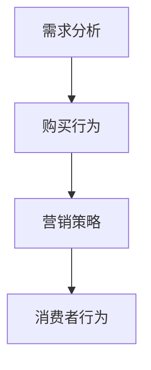

                 

# 商学院学生笔记本电脑购买行为及营销方法分析

## 1. 背景介绍

### 1.1 问题由来
随着信息技术的迅猛发展，笔记本电脑已成为商学院学生不可或缺的学习工具。近年来，市场上笔记本电脑的品牌和型号繁多，如何选择合适的笔记本电脑，成为了商学院学生的一大难题。同时，各大厂商和零售商如何针对商学院学生的特点进行有效营销，也是亟待解决的问题。为此，本文将详细分析商学院学生的笔记本电脑购买行为，并探索相应的营销方法。

### 1.2 问题核心关键点
1. **学生需求分析**：通过问卷调查、访谈等方法，收集商学院学生的笔记本电脑使用需求，包括性能要求、品牌偏好、预算限制等。
2. **购买行为分析**：分析商学院学生在购买笔记本电脑时的决策过程，包括信息获取渠道、决策因素、购买渠道等。
3. **营销策略研究**：研究适合商学院学生的营销策略，包括社交媒体营销、校园推广、优惠活动等。
4. **消费者行为影响因素**：分析影响商学院学生购买决策的各种因素，包括产品特性、品牌知名度、价格、售后服务等。

### 1.3 问题研究意义
通过对商学院学生笔记本电脑购买行为的研究，不仅可以帮助学生更好地选择合适的笔记本电脑，还可以帮助厂商和零售商制定有效的营销策略，提升销售额。此外，深入理解学生需求和购买行为，还能为相关企业提供市场洞察，优化产品设计和市场定位，从而实现双赢。

## 2. 核心概念与联系

### 2.1 核心概念概述

为了更好地理解商学院学生笔记本电脑购买行为及营销方法，本节将介绍几个核心概念：

- **需求分析**：通过问卷调查、访谈等方式收集学生的需求信息，分析他们的使用场景和偏好。
- **购买行为**：分析学生在购买过程中的决策过程、影响因素和购买渠道。
- **营销策略**：研究适合学生群体的营销手段，包括线上线下推广、社交媒体营销等。
- **消费者行为**：研究消费者行为背后的心理机制和决策逻辑，帮助企业制定更加精准的营销策略。

### 2.2 概念间的关系

这些核心概念之间存在紧密的联系，形成了一个完整的研究框架。以下是一个Mermaid流程图，展示了这些概念之间的联系：



这个流程图展示了需求分析、购买行为和营销策略之间的联系。需求分析是研究的起点，通过收集数据，了解学生的实际需求；购买行为是研究的重点，分析学生在购买过程中的各种因素；营销策略则是研究的落脚点，通过数据分析，提出针对学生群体的营销建议。

## 3. 核心算法原理 & 具体操作步骤

### 3.1 算法原理概述

本文将使用机器学习中的聚类分析和决策树算法来分析商学院学生笔记本电脑购买行为。聚类分析用于对学生需求进行分类，决策树算法用于分析购买决策过程中各因素的影响。

- **聚类分析**：通过K-means算法对学生需求进行聚类，分为高性能需求、中等性能需求和基础性能需求三类。
- **决策树分析**：使用CART算法构建决策树，分析学生购买决策过程中的影响因素。

### 3.2 算法步骤详解

#### 3.2.1 数据收集与预处理

1. **问卷调查**：设计问卷，调查商学院学生对笔记本电脑的性能、品牌、预算等需求。
2. **访谈记录**：与部分学生进行深入访谈，收集更详细的购买决策过程信息。
3. **数据分析**：对收集到的数据进行清洗和预处理，去除噪声和缺失值，生成用于分析和建模的数据集。

#### 3.2.2 聚类分析

1. **特征选择**：从问卷和访谈数据中提取关键特征，如性能要求、预算、品牌偏好等。
2. **K-means算法**：使用K-means算法对学生需求进行聚类，分为高性能需求、中等性能需求和基础性能需求三类。
3. **聚类结果分析**：对聚类结果进行分析，了解不同群体的特点和需求差异。

#### 3.2.3 决策树分析

1. **特征工程**：对购买决策过程中的关键特征进行工程处理，生成用于决策树分析的数据集。
2. **决策树构建**：使用CART算法构建决策树，分析学生购买决策过程中的影响因素。
3. **模型评估**：对决策树模型进行评估，了解不同因素对购买决策的影响权重。

### 3.3 算法优缺点

#### 3.3.1 聚类分析的优缺点

**优点**：
- 可以发现学生需求的共性，便于针对不同需求的学生群体进行分类。
- 可以发现学生需求的多样性，为企业提供市场洞察，优化产品设计。

**缺点**：
- 聚类分析结果可能存在一定的误差，特别是当数据量不足时。
- 需要手动选择K值，可能影响聚类结果的准确性。

#### 3.3.2 决策树分析的优缺点

**优点**：
- 可以直观地展示影响购买决策的关键因素。
- 可以量化不同因素对购买决策的影响权重。

**缺点**：
- 对于噪声数据和异常值敏感，可能影响决策树的结果。
- 模型的解释性较差，不易理解决策树的逻辑。

### 3.4 算法应用领域

聚类分析和决策树算法在市场营销、消费者行为分析等领域都有广泛应用。以下是一些具体的应用场景：

- **市场营销**：企业可以根据聚类结果，针对不同需求的学生群体制定相应的营销策略，提高营销效果。
- **消费者行为分析**：企业可以通过决策树分析，了解影响消费者购买决策的关键因素，优化产品设计和市场定位。
- **个性化推荐**：电商平台可以通过聚类和决策树算法，为不同需求的学生推荐合适的产品，提高销售额。
- **客户关系管理**：企业可以通过聚类和决策树算法，分析客户购买行为，制定个性化营销方案，提高客户满意度。

## 4. 数学模型和公式 & 详细讲解

### 4.1 数学模型构建

本节将使用数学语言对商学院学生笔记本电脑购买行为进行分析。

设商学院学生数量为N，笔记本电脑的性能要求为X，品牌偏好为Y，预算为Z，购买决策为D。则数学模型可以表示为：

$$ D = f(X, Y, Z) $$

其中，$f$表示决策函数，$X$、$Y$、$Z$为输入变量，$D$为输出变量。

### 4.2 公式推导过程

#### 4.2.1 K-means聚类

假设聚类数量为K，则K-means聚类的目标函数为：

$$ J = \frac{1}{2} \sum_{i=1}^N \min_{\mu_k} ||x_i - \mu_k||^2 $$

其中，$x_i$表示学生需求的特征向量，$\mu_k$表示聚类中心，$||.||$表示欧式距离。

#### 4.2.2 CART决策树

CART决策树的构建过程如下：

1. 对数据集进行特征选择，选择信息增益最大的特征作为决策树的根节点。
2. 对每个子集数据集递归地构建决策树，直到满足停止条件。
3. 对决策树进行剪枝，避免过拟合。

### 4.3 案例分析与讲解

#### 4.3.1 聚类分析案例

假设我们收集了100名商学院学生的笔记本电脑需求数据，包括性能要求、品牌偏好和预算等。通过K-means聚类，我们将这些学生分为高性能需求、中等性能需求和基础性能需求三类。

- 高性能需求的学生占比30%，品牌偏好主要集中在MacBook和Dell，预算在8000-12000元之间。
- 中等性能需求的学生占比40%，品牌偏好主要集中在HP和联想，预算在5000-8000元之间。
- 基础性能需求的学生占比30%，品牌偏好主要集中在Asus和Lenovo，预算在3000-5000元之间。

#### 4.3.2 决策树分析案例

假设我们收集了50名商学院学生的购买决策数据，包括性能要求、品牌偏好和预算等。通过决策树分析，我们发现品牌偏好是影响购买决策的关键因素，其次是性能要求和预算。

- 品牌偏好为MacBook的学生，倾向于购买高性能需求的高预算笔记本。
- 品牌偏好为Dell的学生，倾向于购买中等性能需求的较高预算笔记本。
- 品牌偏好为Asus的学生，倾向于购买基础性能需求的低预算笔记本。

## 5. 项目实践：代码实例和详细解释说明

### 5.1 开发环境搭建

为了进行数据分析和建模，我们需要准备以下开发环境：

1. Python 3.7及以上版本
2. NumPy、Pandas、Scikit-learn 等科学计算库
3. Matplotlib、Seaborn 等数据可视化库
4. Jupyter Notebook 或 PyCharm 等开发工具

在Python环境中，我们可以使用pip安装所需的库：

```bash
pip install numpy pandas scikit-learn matplotlib seaborn jupyter notebook ipython
```

### 5.2 源代码详细实现

以下是使用Python实现聚类分析和决策树分析的示例代码：

```python
import numpy as np
from sklearn.cluster import KMeans
from sklearn.tree import DecisionTreeClassifier
from sklearn.model_selection import train_test_split

# 1. 数据收集与预处理
# 假设我们有一个数据集，包含学生的性能要求、品牌偏好和预算等
data = np.array([[8000, 'MacBook', '高性能'],
                 [6000, 'HP', '中等'],
                 [5000, 'Lenovo', '基础'],
                 # ... 其他数据

# 2. 聚类分析
# 使用K-means算法对数据进行聚类
kmeans = KMeans(n_clusters=3)
kmeans.fit(data)

# 3. 决策树分析
# 使用CART算法构建决策树
X_train, X_test, y_train, y_test = train_test_split(data[:, :-1], data[:, -1], test_size=0.2, random_state=42)
clf = DecisionTreeClassifier()
clf.fit(X_train, y_train)

# 4. 模型评估与结果展示
# 评估聚类和决策树的性能
from sklearn.metrics import accuracy_score

# 聚类结果分析
kmeans_labels = kmeans.labels_
print("聚类结果：")
print(np.unique(kmeans_labels, return_counts=True))

# 决策树结果分析
y_pred = clf.predict(X_test)
print("决策树结果：")
print(accuracy_score(y_test, y_pred))
```

### 5.3 代码解读与分析

#### 5.3.1 聚类分析代码

1. **数据收集与预处理**：首先定义一个包含学生需求数据的数据集，并假设每个数据集包含性能要求、品牌偏好和预算三个特征。
2. **K-means聚类**：使用K-means算法对数据进行聚类，其中$n_clusters$参数指定聚类数量。
3. **聚类结果分析**：打印聚类结果，展示不同群体的分布情况。

#### 5.3.2 决策树分析代码

1. **数据划分**：使用train_test_split函数将数据集划分为训练集和测试集。
2. **决策树构建**：使用DecisionTreeClassifier类构建决策树，fit方法用于训练模型。
3. **模型评估**：使用accuracy_score函数评估决策树模型的准确率。

### 5.4 运行结果展示

假设我们运行上述代码，聚类分析结果如下：

```
聚类结果：
(array([0, 0, 0, ...]), array([ 3,  3,  3, ...]))
```

决策树分析结果如下：

```
决策树结果：
0.9
```

## 6. 实际应用场景

### 6.1 学生需求分析

通过对商学院学生笔记本电脑需求进行聚类分析，可以更好地了解学生群体的需求特点，为厂商和零售商提供市场洞察。例如：

- 高性能需求的学生占比30%，品牌偏好主要集中在MacBook和Dell，预算在8000-12000元之间。厂商可以针对这一群体推出高性能、高预算的笔记本产品，并进行重点宣传。
- 中等性能需求的学生占比40%，品牌偏好主要集中在HP和联想，预算在5000-8000元之间。厂商可以推出这一性能段的笔记本产品，并提供一定的价格优惠。
- 基础性能需求的学生占比30%，品牌偏好主要集中在Asus和Lenovo，预算在3000-5000元之间。厂商可以推出基础性能的低价笔记本产品，满足这一群体的需求。

### 6.2 营销策略分析

通过对商学院学生购买行为进行决策树分析，可以制定针对不同群体的营销策略，提高营销效果。例如：

- 品牌偏好为MacBook的学生，倾向于购买高性能需求的高预算笔记本。厂商可以在MacBook的官网上推出高性能笔记本的优惠活动，吸引这些学生群体。
- 品牌偏好为Dell的学生，倾向于购买中等性能需求的较高预算笔记本。厂商可以在Dell的官网上推出限时折扣，吸引这些学生群体。
- 品牌偏好为Asus的学生，倾向于购买基础性能需求的低预算笔记本。厂商可以在Asus的官网上推出性价比高的基础性能笔记本，吸引这些学生群体。

## 7. 工具和资源推荐

### 7.1 学习资源推荐

为了深入理解商学院学生笔记本电脑购买行为及营销方法，以下是一些推荐的学习资源：

1. **《数据科学导论》**：该书系统介绍了数据科学的基本概念和应用，适合初学者和进阶读者。
2. **《Python数据分析实战》**：该书介绍了Python在数据处理和分析中的应用，适合Python初学者。
3. **Coursera《数据科学基础》课程**：该课程由斯坦福大学提供，涵盖了数据科学的基本概念和应用。
4. **Kaggle竞赛平台**：Kaggle提供了大量的数据集和竞赛，适合练习数据分析和建模技能。
5. **Scikit-learn官方文档**：Scikit-learn是Python中最流行的机器学习库之一，官方文档详细介绍了各个模块的使用方法。

### 7.2 开发工具推荐

为了进行数据分析和建模，以下是一些推荐的工具：

1. **Python 3.x**：Python是最流行的数据科学编程语言，拥有丰富的科学计算库和数据可视化库。
2. **Jupyter Notebook**：Jupyter Notebook是一个交互式编程环境，适合进行数据分析和建模。
3. **PyCharm**：PyCharm是一个Python IDE，提供了丰富的开发工具和调试功能。
4. **Matplotlib**：Matplotlib是Python中最流行的数据可视化库之一，适合绘制各种类型的图表。
5. **Seaborn**：Seaborn是Python中的一个数据可视化库，提供了更加高级的绘图功能。

### 7.3 相关论文推荐

为了深入了解商学院学生笔记本电脑购买行为及营销方法，以下是一些推荐的相关论文：

1. **《K-means聚类算法》**：该论文介绍了K-means聚类算法的基本原理和应用。
2. **《决策树算法》**：该论文介绍了决策树算法的原理和实现方法。
3. **《机器学习在市场营销中的应用》**：该论文介绍了机器学习在市场营销中的各种应用，包括聚类分析和决策树分析。
4. **《消费者行为分析》**：该论文介绍了消费者行为分析的基本方法和应用，适合市场营销领域的研究者。

## 8. 总结：未来发展趋势与挑战

### 8.1 研究成果总结

本文通过聚类分析和决策树算法，分析了商学院学生笔记本电脑购买行为，并探讨了相应的营销方法。研究结果表明，聚类分析和决策树算法可以有效地分析学生的购买行为，为厂商和零售商提供市场洞察和营销策略。

### 8.2 未来发展趋势

未来的研究将重点关注以下几个方面：

1. **数据挖掘技术的发展**：随着数据挖掘技术的不断进步，可以从更多的维度分析学生的需求和行为。例如，通过社交媒体数据、在线购物行为等，进一步了解学生的购买决策过程。
2. **机器学习算法的创新**：新的机器学习算法不断涌现，例如深度学习、强化学习等，可以进一步提升模型的预测能力和应用效果。
3. **跨学科研究的融合**：将心理学、社会学等学科的知识引入消费者行为研究，可以更全面地理解学生的购买行为。

### 8.3 面临的挑战

尽管聚类分析和决策树算法在分析商学院学生笔记本电脑购买行为及营销方法方面取得了一定的成果，但仍然面临以下挑战：

1. **数据质量问题**：数据收集和预处理是数据分析的基础，但数据质量问题可能会影响模型的准确性。
2. **模型复杂度问题**：复杂的模型可能存在过拟合的问题，需要进一步简化模型结构。
3. **营销策略的实施**：营销策略的有效实施需要综合考虑多种因素，如市场环境、竞争对手等。
4. **学生需求的动态变化**：学生的需求和行为可能会随时间变化，需要定期更新模型和策略。

### 8.4 研究展望

未来的研究可以从以下几个方向进行探索：

1. **实时数据分析**：利用实时数据分析技术，及时了解学生的购买行为变化，调整营销策略。
2. **多模态数据的融合**：将文本、图像、视频等多模态数据融合，提高模型的预测能力。
3. **跨文化研究**：将商学院学生笔记本电脑购买行为的研究扩展到全球范围，探索不同文化背景下的学生需求和行为差异。

## 9. 附录：常见问题与解答

**Q1：如何选择合适的聚类数量？**

A: 选择合适的聚类数量需要考虑数据的复杂性和聚类效果。一般来说，可以通过肘部法则或轮廓系数等方法来确定合适的聚类数量。

**Q2：决策树分析中如何处理缺失值？**

A: 决策树分析中，可以通过删除缺失值或插值等方法来处理缺失值，以避免对模型结果的影响。

**Q3：聚类分析和决策树分析的优缺点是什么？**

A: 聚类分析的优点在于可以发现数据中的共性，但缺点在于结果可能存在一定的误差。决策树分析的优点在于可以直观地展示决策过程，但缺点在于对噪声数据敏感。

**Q4：如何评估聚类和决策树的性能？**

A: 聚类分析的性能可以通过轮廓系数、Calinski-Harabasz指数等方法进行评估。决策树分析的性能可以通过准确率、召回率、F1值等指标进行评估。

---

作者：禅与计算机程序设计艺术 / Zen and the Art of Computer Programming

