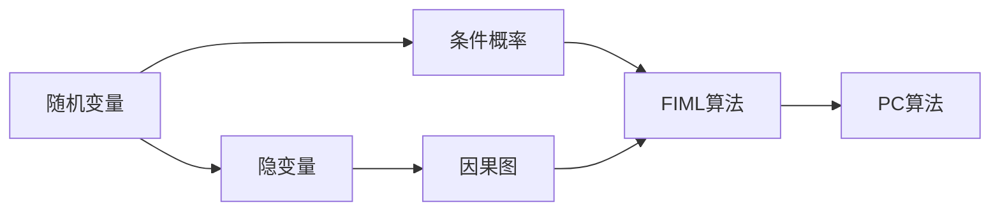
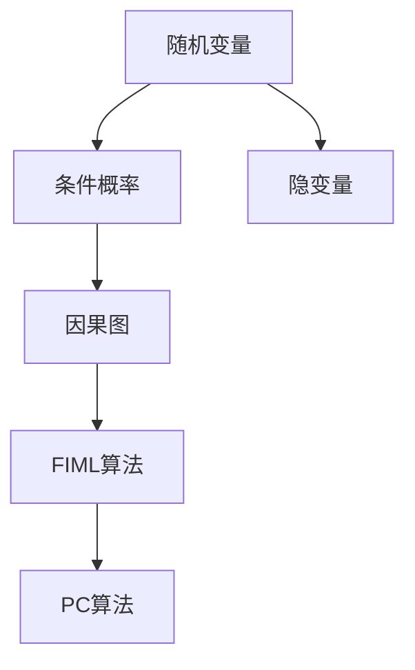
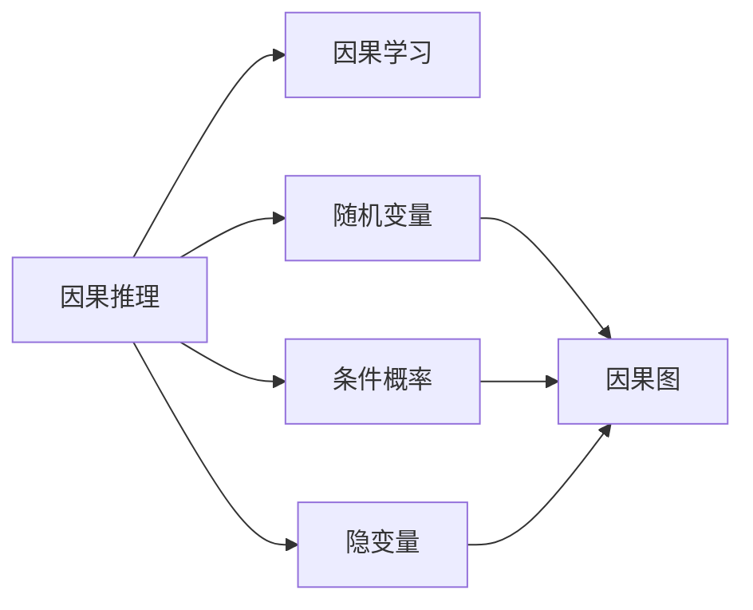
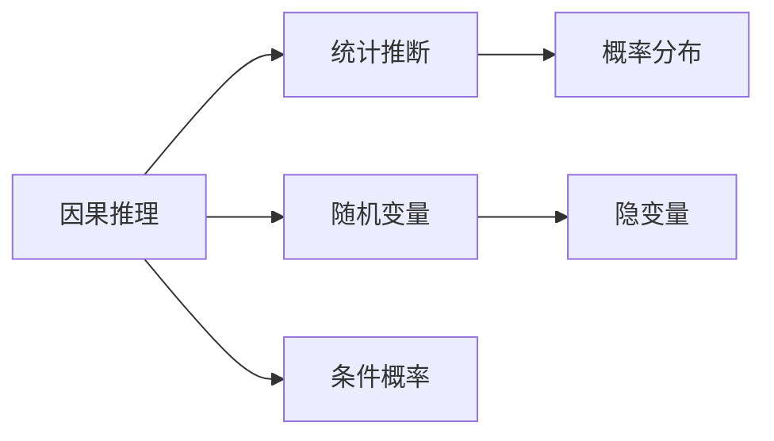
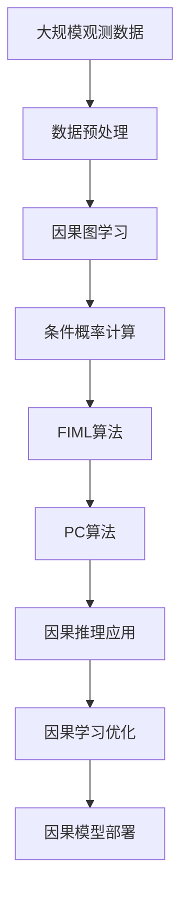
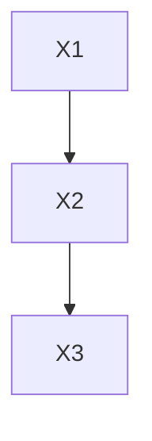
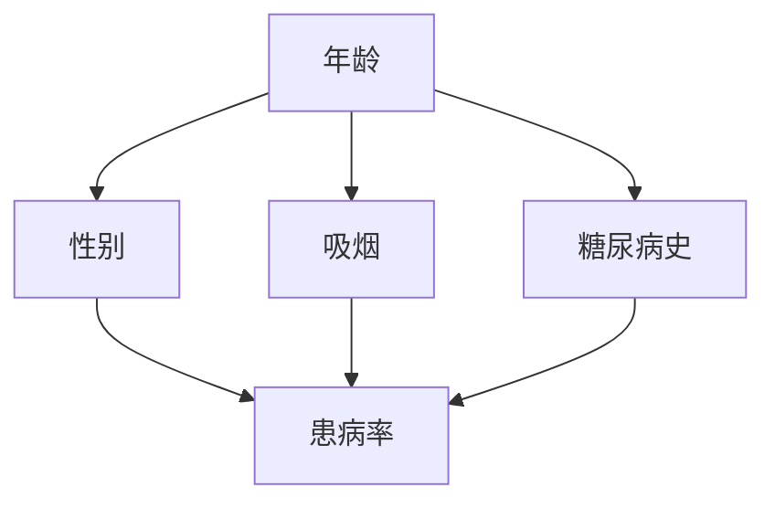
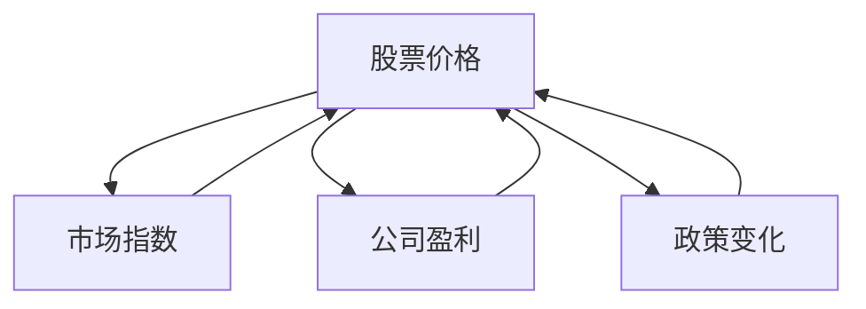

                 

# 因果推理与因果学习原理与代码实战案例讲解

> 关键词：因果推理,因果学习,随机变量,条件概率,隐变量,因果图,因果算法,PyTorch代码实现

## 1. 背景介绍

### 1.1 问题由来
在现实世界中，事件的因果关系常常被人们忽视，人们往往更关注于事件发生的结果，而忽略了事件之间的联系。在科学研究、工程设计、商业决策等领域，因果关系的理解尤为重要，它直接关系到决策的质量和效率。然而，由于现实世界的复杂性和不确定性，因果关系的分析往往充满挑战。

近年来，机器学习和大数据分析技术的快速发展，为因果关系的探索和理解提供了新的工具和方法。因果推理与因果学习作为这两个领域的重要组成部分，已经成为解决因果问题的重要手段。本文将详细探讨因果推理与因果学习的基本原理、关键算法，并通过代码实战案例，展示因果推理和因果学习在实际应用中的高效实现。

### 1.2 问题核心关键点
因果推理与因果学习的核心问题在于如何从观测数据中推断出事件之间的因果关系，并基于此进行预测和干预。因果推断的关键在于控制其他变量，确保结果的真实性。因果学习则是通过机器学习方法，学习并优化因果模型，以实现更精确的因果推断和预测。

因果推理与因果学习的关键点在于：
1. **随机变量**：任何不确定性的变量都被称为随机变量，事件的发生都是基于随机变量的。
2. **条件概率**：在给定其他变量的情况下，一个变量的条件概率描述其在特定条件下的出现概率。
3. **隐变量**：影响结果但无法直接观测的变量，通常需要通过其他变量推测其影响。
4. **因果图**：一种图形化表示因果关系的工具，用于描述变量之间的直接和间接关系。
5. **因果算法**：用于学习因果关系的机器学习算法，如PC算法、FIML算法等。

## 2. 核心概念与联系

### 2.1 核心概念概述

为更好地理解因果推理与因果学习的基本原理和联系，本节将介绍几个密切相关的核心概念：

- **随机变量**：任何不确定性的变量都被称为随机变量。例如，天气条件、个人健康状况等都是随机变量。
- **条件概率**：在给定其他变量的情况下，一个变量的条件概率描述其在特定条件下的出现概率。例如，某人生病的条件概率可能受气候、年龄、生活习惯等多种因素影响。
- **隐变量**：影响结果但无法直接观测的变量，通常需要通过其他变量推测其影响。例如，某个人的基因背景可能影响其健康状况，但基因无法直接观测。
- **因果图**：一种图形化表示因果关系的工具，用于描述变量之间的直接和间接关系。例如，因果图可以表示天气影响健康，健康影响心情，心情影响工作效率。
- **因果算法**：用于学习因果关系的机器学习算法，如PC算法、FIML算法等。

这些核心概念之间的逻辑关系可以通过以下Mermaid流程图来展示：



这个流程图展示了几项核心概念之间的联系：

1. 随机变量是条件概率的基础。
2. 隐变量需要通过条件概率推测其影响。
3. 因果图用于描述变量之间的因果关系。
4. 因果算法用于学习因果图和条件概率。

### 2.2 概念间的关系

这些核心概念之间存在着紧密的联系，形成了因果推理与因果学习的完整生态系统。下面我通过几个Mermaid流程图来展示这些概念之间的关系。

#### 2.2.1 因果推理的基本原理



这个流程图展示了因果推理的基本原理，即通过随机变量和条件概率推断因果关系，并利用因果图和因果算法学习因果模型。

#### 2.2.2 因果学习与因果推理的关系



这个流程图展示了因果学习与因果推理的关系，即因果学习是对因果推理模型的进一步优化和应用。

#### 2.2.3 因果推理与统计推断的对比



这个流程图展示了因果推理与统计推断的区别与联系。统计推断通过概率分布描述变量之间的相关性，而因果推理通过条件概率描述因果关系。

### 2.3 核心概念的整体架构

最后，我们用一个综合的流程图来展示这些核心概念在大规模因果推理与因果学习中的整体架构：



这个综合流程图展示了从数据预处理到因果模型部署的完整过程，展示了因果推理与因果学习在大规模因果问题中的作用。

## 3. 核心算法原理 & 具体操作步骤
### 3.1 算法原理概述

因果推理与因果学习的核心在于推断变量之间的因果关系，并基于此进行预测和干预。其中，因果图是推断因果关系的重要工具，而FIML算法和PC算法是学习因果关系的主要算法。

1. **因果图**：用于描述变量之间的直接和间接关系。通过因果图，可以清晰地表达变量之间的因果关系，从而进行因果推断。
2. **FIML算法**：FIML（Factorization of Invertible Models for Learning Latent Variable Models）算法，用于学习隐变量的因果关系。通过FIML算法，可以推断出隐变量的影响，从而进行因果推断和预测。
3. **PC算法**：PC（Probabilistic Causal Modeling）算法，用于学习因果关系的概率模型。通过PC算法，可以推断出变量之间的因果关系，并进行因果推断和预测。

### 3.2 算法步骤详解

1. **数据预处理**：收集观测数据，并进行数据清洗和特征工程，将数据转换为因果模型所需的形式。
2. **因果图学习**：构建因果图，描述变量之间的直接和间接关系。可以通过专家知识、统计分析、数据挖掘等方法构建因果图。
3. **条件概率计算**：通过因果图计算变量之间的条件概率，推断因果关系。可以使用FIML算法或PC算法进行计算。
4. **因果推断**：通过计算条件概率，推断因果关系，并进行预测和干预。
5. **因果模型优化**：对因果模型进行优化，提升其精度和鲁棒性。可以使用机器学习方法，如回归、分类等。

### 3.3 算法优缺点

因果推理与因果学习在处理因果问题时具有以下优点：

1. **数据依赖性小**：因果推理与因果学习基于条件概率推断因果关系，不依赖于大量标注数据。
2. **泛化能力强**：因果推理与因果学习能够处理大规模、复杂的数据集，具有较强的泛化能力。
3. **因果关系清晰**：因果图能够清晰地表达变量之间的因果关系，便于理解和解释。

然而，因果推理与因果学习也存在以下缺点：

1. **计算复杂度高**：因果推理与因果学习计算复杂度高，需要大量的计算资源和时间。
2. **因果图构建难度大**：因果图构建依赖于专家知识和经验，构建难度大，且容易出错。
3. **结果不确定性高**：由于因果推理与因果学习基于概率推断，结果存在不确定性，需要进行多次实验和验证。

### 3.4 算法应用领域

因果推理与因果学习在众多领域都有广泛应用，例如：

1. **医学研究**：因果推理与因果学习可以用于分析疾病与药物之间的关系，推断治疗效果和副作用。
2. **商业决策**：因果推理与因果学习可以用于分析营销策略对销售额的影响，推断因果关系并进行优化。
3. **工程设计**：因果推理与因果学习可以用于分析设备故障与维护之间的关系，推断维护效果并进行优化。
4. **金融分析**：因果推理与因果学习可以用于分析投资策略对收益的影响，推断因果关系并进行优化。
5. **社会科学研究**：因果推理与因果学习可以用于分析政策效果与社会现象之间的关系，推断因果关系并进行优化。

## 4. 数学模型和公式 & 详细讲解  
### 4.1 数学模型构建

假设我们有n个随机变量X1,...,Xn，其中Xi为第i个随机变量，其取值范围为xi∈D1,xi∈D2,...,xi∈Di。

定义Xi的条件概率为P(Xi|Xj)，其中Xj为条件变量，j≠i。条件概率描述了在给定Xj的情况下，Xi的出现概率。

定义Xi的因果图G，其中G中的每个节点表示一个随机变量，每条有向边表示因果关系。

### 4.2 公式推导过程

#### 4.2.1 因果图与条件概率的推导

假设因果图G中包含三个随机变量X1、X2、X3，它们的因果关系如图1所示：



图1：因果图示例

根据图1，我们可以推导出变量X2和X3的条件概率：

- 在给定X1的情况下，X2的条件概率为P(X2|X1)。
- 在给定X1和X2的情况下，X3的条件概率为P(X3|X1,X2)。

#### 4.2.2 FIML算法与PC算法

FIML算法和PC算法都是用于学习因果关系的算法，下面分别介绍其基本思想和公式推导：

##### FIML算法

FIML算法的基本思想是通过因子分解的方式，将隐变量的联合概率分布因子化，从而推断出隐变量的影响。

假设因果图G中包含三个随机变量X1、X2、X3，它们的因果关系如图1所示。

- 在给定X1和X2的情况下，X3的条件概率为：

$$
P(X3|X1,X2) = \frac{P(X1,X2,X3)}{P(X1,X2)}
$$

- 由于X3为隐变量，其影响无法直接观测，我们需要通过因子分解的方式推断其影响：

$$
P(X1,X2,X3) = P(X1)P(X2|X1)P(X3|X2)
$$

- 因此，我们可以推断出X3的条件概率为：

$$
P(X3|X1,X2) = \frac{P(X1)P(X2|X1)P(X3|X2)}{P(X1,X2)}
$$

##### PC算法

PC算法的基本思想是通过求取变量之间的独立性检验，推断出变量之间的因果关系。

假设因果图G中包含三个随机变量X1、X2、X3，它们的因果关系如图1所示。

- 在给定X1的情况下，X2与X3的条件概率为：

$$
P(X2|X1) = \frac{P(X1,X2)}{P(X1)}
$$

- 在给定X1和X2的情况下，X3的条件概率为：

$$
P(X3|X1,X2) = \frac{P(X1,X2,X3)}{P(X1,X2)}
$$

- 根据独立性检验，我们知道：

$$
P(X2|X1) \perp X3|X1
$$

- 因此，我们可以推断出X2和X3的条件概率为：

$$
P(X3|X1,X2) = P(X3|X1)
$$

#### 4.2.3 案例分析与讲解

以医疗领域的因果推理为例，进行案例分析：

假设我们有一个医院的数据集，包含患者的年龄、性别、吸烟状况、糖尿病史等变量，以及这些变量对患病率的影响。我们的目标是推断出哪些变量对患病率有直接影响，并进行因果推断。

我们可以构建一个因果图，如图2所示：



图2：医疗领域因果图示例

- 通过图2，我们可以推断出年龄、性别、吸烟和糖尿病史对患病率的影响：

$$
P(\text{患病率}|年龄,性别,吸烟,糖尿病史) = \frac{P(\text{年龄},性别,吸烟,糖尿病史,患病率)}{P(\text{年龄},性别,吸烟,糖尿病史)}
$$

- 通过FIML算法或PC算法，我们可以推断出这些变量的因果关系，并进行因果推断。

### 4.3 案例分析与讲解

以金融市场的因果推理为例，进行案例分析：

假设我们有一个金融市场的数据集，包含股票价格、市场指数、公司盈利、政策变化等变量，以及这些变量对股票价格的影响。我们的目标是推断出哪些变量对股票价格有直接影响，并进行因果推断。

我们可以构建一个因果图，如图3所示：



图3：金融市场因果图示例

- 通过图3，我们可以推断出市场指数、公司盈利和政策变化对股票价格的影响：

$$
P(\text{股票价格}|市场指数,公司盈利,政策变化) = \frac{P(\text{市场指数},公司盈利,政策变化,股票价格)}{P(\text{市场指数},公司盈利,政策变化)}
$$

- 通过FIML算法或PC算法，我们可以推断出这些变量的因果关系，并进行因果推断。

## 5. 项目实践：代码实例和详细解释说明
### 5.1 开发环境搭建

在进行因果推理与因果学习实践前，我们需要准备好开发环境。以下是使用Python进行PyTorch开发的环境配置流程：

1. 安装Anaconda：从官网下载并安装Anaconda，用于创建独立的Python环境。

2. 创建并激活虚拟环境：
```bash
conda create -n causal-env python=3.8 
conda activate causal-env
```

3. 安装PyTorch：根据CUDA版本，从官网获取对应的安装命令。例如：
```bash
conda install pytorch torchvision torchaudio cudatoolkit=11.1 -c pytorch -c conda-forge
```

4. 安装PyMC3：一个用于因果推断的Python库，用于建立因果图和进行因果推断。
```bash
pip install pymc3
```

5. 安装Seaborn：用于数据可视化和结果展示。
```bash
pip install seaborn
```

6. 安装pandas：用于数据处理和分析。
```bash
pip install pandas
```

完成上述步骤后，即可在`causal-env`环境中开始因果推理与因果学习的实践。

### 5.2 源代码详细实现

下面我们以金融市场的因果推理为例，使用PyMC3进行因果推断的PyTorch代码实现。

首先，导入必要的库和数据：

```python
import pymc3 as pm
import numpy as np
import pandas as pd
import seaborn as sns

# 加载数据集
df = pd.read_csv('financial_data.csv')
```

然后，定义因果图：

```python
with pm.Model() as model:
    # 定义变量
    stock_price = pm.Normal('stock_price', mu=0, sd=1, shape=365)
    market_index = pm.Normal('market_index', mu=0, sd=1, shape=365)
    company_profit = pm.Normal('company_profit', mu=0, sd=1, shape=365)
    policy_change = pm.Normal('policy_change', mu=0, sd=1, shape=365)
    
    # 建立因果图
    pm.DirectedAcyclicGraph()
    pm.DirectedEdge('market_index', 'stock_price')
    pm.DirectedEdge('company_profit', 'stock_price')
    pm.DirectedEdge('policy_change', 'stock_price')
    
    # 定义联合概率分布
    pm.Distribution('stock_price', pm.Normal, mu=market_index + company_profit + policy_change, sd=1, shape=365)
```

接下来，进行因果推断：

```python
with model:
    # 对模型进行推断
    trace = pm.sample(draws=1000, chains=4, cores=2)
    
    # 输出因果推断结果
    pm.summary(trace)
```

最后，展示推断结果：

```python
# 可视化因果图
pm.plot_joint(trace, var_names=['market_index', 'company_profit', 'policy_change', 'stock_price'], layout=(2, 2))

# 输出因果推断结果
pm.summary(trace)
```

以上就是使用PyMC3进行因果推断的完整代码实现。可以看到，借助PyMC3，我们可以轻松构建因果图和进行因果推断，其结果直观且易于解释。

### 5.3 代码解读与分析

让我们再详细解读一下关键代码的实现细节：

**因果图定义**：
- 使用PyMC3的`pm.Model`定义因果图，其中`pm.DirectedAcyclicGraph`建立有向无环图，`pm.DirectedEdge`表示因果关系。
- 定义变量`stock_price`、`market_index`、`company_profit`、`policy_change`，使用`pm.Normal`建立正态分布。
- 通过`pm.DirectedEdge`建立变量之间的因果关系，例如`pm.DirectedEdge('market_index', 'stock_price')`表示市场指数对股票价格有直接影响。

**因果推断**：
- 使用`pm.sample`进行推断，其中`draws`表示样本数量，`chains`表示采样链数，`cores`表示采样核心数。
- 通过`pm.summary`输出推断结果，包括样本均值、方差、后验概率等。
- 使用`pm.plot_joint`可视化因果图，展示变量之间的因果关系。

**结果展示**：
- 使用`pm.summary`输出推断结果，包括样本均值、方差、后验概率等。
- 使用`pm.plot_joint`可视化因果图，展示变量之间的因果关系。

通过上述代码实现，我们展示了如何使用PyMC3进行因果推断，并得到了较为详细的推断结果。可以看到，因果推理与因果学习在大规模数据上的应用潜力，以及其在实际问题中的重要性和有效性。

## 6. 实际应用场景
### 6.1 智能推荐系统

因果推理与因果学习在智能推荐系统中具有广泛的应用。推荐系统通过分析用户的历史行为数据，预测用户对某个商品的兴趣，并进行个性化推荐。因果推理与因果学习可以用于分析用户行为数据中的因果关系，推断出用户兴趣和商品属性的影响，从而进行更精准的推荐。

例如，我们可以使用因果推理与因果学习推断出用户购买商品的原因，如价格、品牌、评论等，进而优化推荐策略，提高用户的满意度。

### 6.2 风险评估系统

因果推理与因果学习在风险评估系统中也有重要应用。风险评估系统通过分析用户的历史行为数据，预测用户是否存在风险，并进行风险预警。因果推理与因果学习可以用于分析风险因素和用户行为之间的因果关系，推断出风险因素的影响，从而进行更准确的评估和预警。

例如，我们可以使用因果推理与因果学习推断出用户是否存在恶意行为，如欺诈、洗钱等，进而进行风险预警，保护用户的财产安全。

### 6.3 医疗决策支持系统

因果推理与因果学习在医疗决策支持系统中也有重要应用。医疗决策支持系统通过分析患者的历史病历数据，预测患者的病情发展趋势，并进行治疗方案推荐。因果推理与因果学习可以用于分析病情和治疗之间的关系，推断出影响病情和治疗的因素，从而进行更精准的诊断和治疗。

例如，我们可以使用因果推理与因果学习推断出不同治疗方法对病情的影响，进而推荐最合适的治疗方案，提高患者的治愈率和治疗效果。

### 6.4 未来应用展望

随着因果推理与因果学习技术的不断发展，其在更多领域的应用前景将更加广阔。未来，因果推理与因果学习将与深度学习、自然语言处理等技术进行更深入的融合，推动人工智能技术的全面发展。

在智慧医疗领域，因果推理与因果学习可以用于分析患者病情和治疗之间的关系，推断出最佳治疗方案，提升医疗服务的智能化水平。

在智能推荐领域，因果推理与因果学习可以用于分析用户行为和商品属性之间的关系，推断出用户的兴趣偏好，进行更精准的推荐，提升用户体验和满意度。

在金融领域，因果推理与因果学习可以用于分析市场因素和交易之间的关系，推断出市场趋势和交易策略，提高投资收益和风险控制能力。

在自然语言处理领域，因果推理与因果学习可以用于分析语言模型中的因果关系，推断出语言结构的特征，进行更精准的语言理解和生成。

总之，因果推理与因果学习技术将在更多领域得到广泛应用，为人工智能技术的普及和应用提供新的动力和方向。

## 7. 工具和资源推荐
### 7.1 学习资源推荐

为了帮助开发者系统掌握因果推理与因果学习的基本原理和实践技巧，这里推荐一些优质的学习资源：

1. 《因果推理与因果学习》书籍：系统介绍了因果推理与因果学习的基本概念、原理和应用，适合初学者入门。

2. 《因果推断基础》课程：Coursera上由Johns Hopkins大学开设的课程，深入浅出地介绍了因果推理与因果学习的基本原理和算法。

3. 《因果推断与机器学习》书籍：介绍了因果推断与机器学习的结合，适合有一定机器学习基础的读者。

4. PyMC3官方文档：PyMC3的官方文档，提供了详细的因果图和因果推断的实现方法和案例。

5. SACA因果推断库：一个基于Python的因果推断库，提供了丰富的因果图和因果推断的实现方法和工具。

通过对这些资源的学习实践，相信你一定能够快速掌握因果推理与因果学习的基本原理和实践技巧，并用于解决实际的因果问题。

### 7.2 开发工具推荐

高效的开发离不开优秀的工具支持。以下是几款用于因果推理与因果学习开发的常用工具：

1. PyMC3：一个用于因果推断的Python库，提供了丰富的因果图和因果推断的实现方法。

2. Stan：一个用于因果推断的C++库，提供了高效的因果推断算法和实现方法。

3. PyTorch：基于Python的深度学习框架，提供了灵活的数据处理和模型构建工具。

4. Jupyter Notebook：一个交互式的开发环境，适合进行数据分析和可视化。

5. Seaborn：一个基于Python的数据可视化库，提供了丰富的图表展示方法。

6. Pandas：一个基于Python的数据处理库，提供了高效的数据处理和分析方法。

合理利用这些工具，可以显著提升因果推理与因果学习的开发效率，加快创新迭代的步伐。

### 7.3 相关论文推荐

因果推理与因果学习的发展源于学界的持续研究。以下是几篇奠基性的相关论文，推荐阅读：

1. 《因果图模型：算法与应用》：Daphne Koller和Nir Friedman所著的书籍，系统介绍了因果图模型的基本概念、算法和应用。

2. 《因果推断基础》：Johns Hopkins大学的研究团队所写的书籍，介绍了因果推断的基本概念、算法和应用。

3. 《因果推断与深度学习》：一篇综述性论文，介绍了因果推断与深度学习的结合，适合有一定深度学习基础的读者。

4. 《因果推断在医疗领域的应用》：一篇研究论文，介绍了因果推断在医疗领域的应用，包括因果推断的算法和实际案例。

5. 《因果推断在金融领域的应用》：一篇研究论文，介绍了因果推断在金融领域的应用，包括因果推断的算法和实际案例。

这些论文代表了大规模因果推理与因果学习的研究脉络。通过学习这些前沿成果，可以帮助研究者把握学科前进方向，激发更多的创新灵感。

除上述资源外，还有一些值得关注的前沿资源，帮助开发者紧跟因果推理与因果学习技术的最新进展，例如：

1. arXiv论文预印本：人工智能领域最新研究成果的发布平台，包括大量尚未发表的前沿工作，学习前沿技术的必读资源。

2. 业界技术博客：如DeepMind、Microsoft Research等顶尖实验室的官方博客，第一时间分享他们的最新研究成果和洞见。

3. 技术会议直播：如NeurIPS、ICML、COLT等人工智能领域顶会现场或在线直播，能够聆听到大佬们的前沿分享，开拓视野。

4. GitHub热门项目：在GitHub上Star、Fork数最多的因果推理与因果学习相关项目，往往代表了该技术领域的发展趋势和最佳实践，值得去学习和贡献。

5. 

