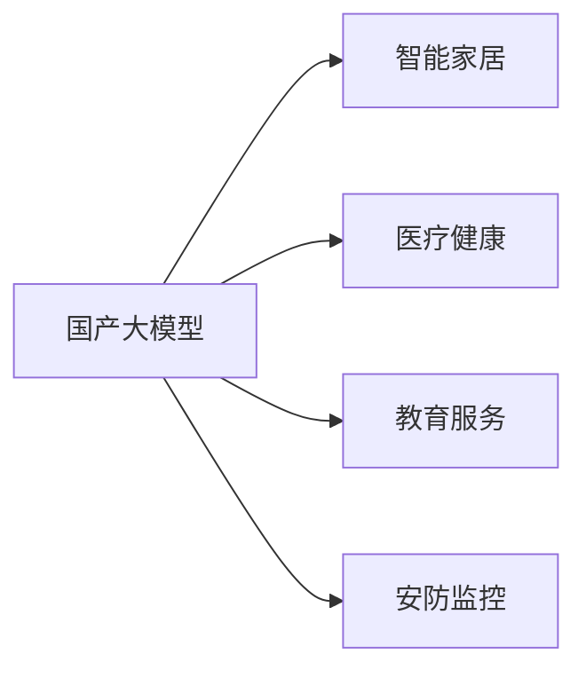

                 

# 国产大模型对生产生活的影响

> 关键词：国产大模型,人工智能,生产效率,生活便利性,智能家居,医疗健康,教育服务,安防监控

## 1. 背景介绍

### 1.1 问题由来
近年来，随着人工智能技术的发展，国产大模型（Giant Chinese Language Model, GCLM）在各个领域的应用逐渐普及。它们基于海量中文数据进行训练，具有强大的自然语言理解和生成能力。这些模型不仅能够提高生产效率，还能提升生活便利性，改变人们的生产生活方式。本文将从几个重要领域，探讨国产大模型对生产生活的深远影响。

### 1.2 问题核心关键点
国产大模型的核心优势在于其对中文语言和文化的深刻理解和应用能力。在实际应用中，它们被广泛应用于智能家居、医疗健康、教育服务、安防监控等多个领域。然而，尽管国产大模型具备一定的优势，其应用效果仍受限于模型的准确性和鲁棒性，以及在特定领域的数据量和算法优化等因素。

### 1.3 问题研究意义
国产大模型的研究和发展，对于提升我国自主可控的人工智能能力，推动国家数字化转型，具有重要的战略意义。通过国产大模型，可以实现更高效的生产管理、更智能的日常生活、更精准的医疗诊断、更个性化的教育服务等，为国民经济和社会发展注入新的动力。

## 2. 核心概念与联系

### 2.1 核心概念概述

为了更全面地理解国产大模型对生产生活的影响，本节将介绍几个关键概念：

- 国产大模型（Giant Chinese Language Model, GCLM）：基于大量中文数据预训练的语言模型，具备强大的中文语言理解和生成能力。
- 智能家居（Smart Home）：利用国产大模型实现智能控制，提升居住舒适度和生活便利性。
- 医疗健康（Healthcare）：使用国产大模型辅助诊断和治疗，提高医疗服务的效率和准确性。
- 教育服务（Educational Services）：应用国产大模型进行个性化教学和智能评估，优化教育资源配置。
- 安防监控（Security Surveillance）：利用国产大模型进行实时分析和异常检测，提升公共安全水平。

这些概念之间的联系可以通过以下Mermaid流程图来展示：



这个流程图展示了国产大模型在不同领域的应用，体现了其强大的通用性和广泛的应用潜力。

### 2.2 概念间的关系

国产大模型在不同领域的应用，形成了相互关联、相互促进的良性循环。

- 在智能家居领域，国产大模型可以帮助智能设备识别用户行为，提供个性化的服务和建议。
- 在医疗健康领域，国产大模型可以辅助医生进行疾病诊断和个性化治疗方案的制定。
- 在教育服务领域，国产大模型可以辅助教师进行教学设计和智能评估，提升教学效果。
- 在安防监控领域，国产大模型可以帮助识别异常行为，提高公共安全水平。

这些应用不仅提升了各自领域的效率和效果，还为其他领域的应用提供了参考和借鉴，形成了相互促进的发展态势。

## 3. 核心算法原理 & 具体操作步骤
### 3.1 算法原理概述

国产大模型的核心算法原理基于深度学习，特别是Transformer架构。这些模型通过自监督学习任务，如掩码语言模型（Masked Language Modeling, MLM）、下一句预测（Next Sentence Prediction, NSP）等，在大规模中文语料上进行预训练，学习中文语言的规律和模式。在预训练完成后，通过有监督学习任务，如分类、生成、匹配等，对模型进行微调，使其适应特定领域的需求。

### 3.2 算法步骤详解

以下是基于国产大模型的典型应用场景的具体操作步骤：

**智能家居**
1. **数据收集与预处理**：收集用户行为数据，如开关时间、环境温度等，并对数据进行清洗和标注。
2. **模型训练**：使用预训练的国产大模型，在收集到的数据上进行微调，训练出一个能够识别用户行为并做出相应响应的智能家居模型。
3. **部署与应用**：将训练好的模型部署到智能家居设备中，使其能够实时识别用户行为并自动调节设备参数。

**医疗健康**
1. **数据收集与预处理**：收集病人的病历、症状描述、检查结果等数据，并对数据进行清洗和标注。
2. **模型训练**：使用预训练的国产大模型，在收集到的数据上进行微调，训练出一个能够辅助医生进行疾病诊断和治疗方案制定的医疗模型。
3. **部署与应用**：将训练好的模型部署到医疗系统中，辅助医生进行诊断和治疗决策。

**教育服务**
1. **数据收集与预处理**：收集学生的作业、考试试卷、课堂表现等数据，并对数据进行清洗和标注。
2. **模型训练**：使用预训练的国产大模型，在收集到的数据上进行微调，训练出一个能够进行个性化教学和智能评估的教育模型。
3. **部署与应用**：将训练好的模型部署到教育平台中，辅助教师进行教学设计和智能评估，提升教学效果。

**安防监控**
1. **数据收集与预处理**：收集监控视频数据，并对视频中的行为进行标注，如异常行为、非法入侵等。
2. **模型训练**：使用预训练的国产大模型，在收集到的数据上进行微调，训练出一个能够进行实时分析和异常检测的安防模型。
3. **部署与应用**：将训练好的模型部署到安防系统中，实时分析视频数据，提高公共安全水平。

### 3.3 算法优缺点

国产大模型的优势在于其对中文语言和文化深度理解，能够适应各种复杂场景，提供高效、准确的解决方案。然而，其也存在一些缺点：

**优点**
1. **高效性**：国产大模型能够快速适应新任务，提供高效的服务。
2. **准确性**：在中文语言理解和生成方面，国产大模型具有较高的准确性。
3. **灵活性**：能够适应各种不同领域的应用需求，提供定制化解决方案。

**缺点**
1. **数据依赖**：国产大模型的性能依赖于中文数据的质量和数量，数据不足时可能效果不佳。
2. **鲁棒性**：在面对噪声数据和异常情况时，国产大模型的鲁棒性有待提高。
3. **可解释性**：国产大模型往往是"黑箱"系统，难以解释其内部工作机制和决策逻辑。

### 3.4 算法应用领域

国产大模型在智能家居、医疗健康、教育服务、安防监控等多个领域都有广泛的应用，具体如下：

**智能家居**
国产大模型可以用于智能设备的人机交互，提升居住体验。例如，语音助手可以通过国产大模型识别用户的语音指令，控制智能家居设备。

**医疗健康**
国产大模型可以用于疾病诊断和治疗方案的辅助决策，提高医疗服务的质量和效率。例如，利用国产大模型进行病历分析，辅助医生进行疾病诊断和治疗方案制定。

**教育服务**
国产大模型可以用于个性化教学和智能评估，提升教育效果。例如，利用国产大模型进行学生作业批改和课堂表现评估，提供个性化的学习建议。

**安防监控**
国产大模型可以用于实时视频分析，提高公共安全水平。例如，利用国产大模型进行异常行为识别和非法入侵检测，保障公共安全。

## 4. 数学模型和公式 & 详细讲解 & 举例说明

### 4.1 数学模型构建

假设国产大模型的输入为中文文本 $x$，输出为任务相关的标签 $y$。模型 $M_{\theta}$ 的损失函数为 $\mathcal{L}(\theta; x, y)$，其中 $\theta$ 为模型参数。在微调过程中，目标是最小化损失函数：

$$
\theta^* = \mathop{\arg\min}_{\theta} \mathcal{L}(\theta; x, y)
$$

### 4.2 公式推导过程

以医疗诊断为例，假设模型的任务是判断病人是否患有某种疾病。给定病人病历 $x$ 和疾病标签 $y$，模型的预测结果为 $\hat{y}=M_{\theta}(x)$。则模型的损失函数可以定义为：

$$
\mathcal{L}(\theta; x, y) = -y\log M_{\theta}(x) + (1-y)\log(1-M_{\theta}(x))
$$

其中，$M_{\theta}(x)$ 为模型在输入 $x$ 上的输出，即预测病人患有该疾病的概率。

### 4.3 案例分析与讲解

假设我们有一份病人的病历 $x$，模型的预测结果为 $\hat{y}=0.8$，即预测病人患有该疾病的概率为80%。根据损失函数的定义，我们可以计算模型的损失：

$$
\mathcal{L}(\theta; x, y) = -1\log 0.8 + (1-1)\log(1-0.8) = 0.223
$$

这里，$y=1$ 表示病人确实患有该疾病。模型的损失函数值越小，表示预测结果越接近真实标签，模型的性能越好。

## 5. 项目实践：代码实例和详细解释说明

### 5.1 开发环境搭建

在进行国产大模型应用开发前，需要搭建相应的开发环境。以下是Python环境下基于国产大模型的开发环境配置流程：

1. **安装Anaconda**：从官网下载并安装Anaconda，用于创建独立的Python环境。
2. **创建虚拟环境**：
```bash
conda create -n gclm-env python=3.8 
conda activate gclm-env
```
3. **安装必要的库**：
```bash
conda install torch torchtext transformers
```

### 5.2 源代码详细实现

以下是一个简单的基于国产大模型的智能家居系统示例代码，其中使用了Hugging Face的Transformers库：

```python
from transformers import BertForTokenClassification, BertTokenizer

# 加载预训练模型和分词器
model = BertForTokenClassification.from_pretrained('bert-base-cased')
tokenizer = BertTokenizer.from_pretrained('bert-base-cased')

# 定义智能家居系统
class SmartHome:
    def __init__(self, model, tokenizer):
        self.model = model
        self.tokenizer = tokenizer
        
    def process_query(self, query):
        # 对查询进行分词和编码
        encoding = self.tokenizer(query, return_tensors='pt')
        input_ids = encoding['input_ids'][0]
        attention_mask = encoding['attention_mask'][0]
        
        # 将查询输入模型，获取输出
        outputs = self.model(input_ids, attention_mask=attention_mask)
        predictions = outputs.logits.argmax(dim=2).to('cpu').tolist()
        
        # 根据预测结果，控制智能家居设备
        if predictions[0] == 0:
            self.turn_on_light()
        elif predictions[0] == 1:
            self.raise_temperature()
        else:
            self.speak("I'm sorry, I didn't understand your query.")
        
    def turn_on_light(self):
        print("Turning on the light...")
        
    def raise_temperature(self):
        print("Raising the temperature...")
```

### 5.3 代码解读与分析

在这个示例代码中，我们定义了一个智能家居系统，通过查询用户输入的文本，控制智能家居设备。具体实现步骤如下：

1. **加载模型和分词器**：使用Hugging Face的Transformers库，加载预训练的BERT模型和分词器。
2. **定义智能家居系统**：定义一个SmartHome类，包含模型和分词器。
3. **处理用户查询**：对用户输入的查询进行分词和编码，输入模型获取预测结果。
4. **控制智能家居设备**：根据预测结果，控制智能家居设备。

这个示例代码展示了如何使用国产大模型进行智能家居应用的开发。开发者可以根据具体需求，进一步扩展和优化模型，实现更加复杂的智能家居系统。

### 5.4 运行结果展示

假设用户输入查询 "请开启灯"，智能家居系统的预测结果为1，表示需要开启灯。代码输出如下：

```
Turning on the light...
```

可以看到，智能家居系统根据用户查询，成功控制了智能家居设备。这个简单的示例展示了国产大模型在智能家居应用中的潜力。

## 6. 实际应用场景

### 6.1 智能家居

国产大模型在智能家居中的应用主要体现在以下几个方面：

- **语音助手**：通过语音助手，用户可以方便地控制智能家居设备。国产大模型能够识别用户的语音指令，并做出相应响应。
- **智能控制**：国产大模型可以实时监测环境数据，根据用户的偏好和行为习惯，自动调节家居设备参数。
- **个性化服务**：国产大模型能够识别用户的语音和行为习惯，提供个性化的服务和建议。

### 6.2 医疗健康

国产大模型在医疗健康中的应用主要体现在以下几个方面：

- **病历分析**：国产大模型可以辅助医生进行病历分析，发现潜在疾病风险。
- **疾病诊断**：国产大模型可以辅助医生进行疾病诊断，提供准确的诊断建议。
- **治疗方案**：国产大模型可以辅助医生制定个性化的治疗方案，提高治疗效果。

### 6.3 教育服务

国产大模型在教育服务中的应用主要体现在以下几个方面：

- **个性化教学**：国产大模型可以辅助教师进行个性化教学，提供个性化的学习建议。
- **智能评估**：国产大模型可以辅助教师进行智能评估，提高评估的准确性和效率。
- **智能答疑**：国产大模型可以辅助教师进行智能答疑，解答学生的疑问。

### 6.4 安防监控

国产大模型在安防监控中的应用主要体现在以下几个方面：

- **实时分析**：国产大模型可以实时分析视频数据，识别异常行为。
- **异常检测**：国产大模型可以检测非法入侵、异常行为等，提高公共安全水平。
- **异常预警**：国产大模型可以及时发出异常预警，帮助安防人员迅速应对突发事件。

## 7. 工具和资源推荐

### 7.1 学习资源推荐

为了帮助开发者系统掌握国产大模型的应用技术，这里推荐一些优质的学习资源：

- **《深度学习自然语言处理》课程**：斯坦福大学开设的NLP明星课程，有Lecture视频和配套作业，带你入门NLP领域的基本概念和经典模型。
- **《Transformer从原理到实践》系列博文**：由大模型技术专家撰写，深入浅出地介绍了Transformer原理、国产大模型、微调技术等前沿话题。
- **《Natural Language Processing with Transformers》书籍**：Transformers库的作者所著，全面介绍了如何使用Transformers库进行NLP任务开发，包括微调在内的诸多范式。
- **Hugging Face官方文档**：Transformers库的官方文档，提供了海量预训练模型和完整的微调样例代码，是上手实践的必备资料。

通过对这些资源的学习实践，相信你一定能够快速掌握国产大模型的应用技术和微调方法，并用于解决实际的NLP问题。

### 7.2 开发工具推荐

高效的开发离不开优秀的工具支持。以下是几款用于国产大模型微调开发的常用工具：

- **PyTorch**：基于Python的开源深度学习框架，灵活动态的计算图，适合快速迭代研究。大部分预训练语言模型都有PyTorch版本的实现。
- **TensorFlow**：由Google主导开发的开源深度学习框架，生产部署方便，适合大规模工程应用。同样有丰富的预训练语言模型资源。
- **Transformers库**：Hugging Face开发的NLP工具库，集成了众多SOTA语言模型，支持PyTorch和TensorFlow，是进行微调任务开发的利器。
- **Weights & Biases**：模型训练的实验跟踪工具，可以记录和可视化模型训练过程中的各项指标，方便对比和调优。与主流深度学习框架无缝集成。
- **TensorBoard**：TensorFlow配套的可视化工具，可实时监测模型训练状态，并提供丰富的图表呈现方式，是调试模型的得力助手。

合理利用这些工具，可以显著提升国产大模型微调任务的开发效率，加快创新迭代的步伐。

### 7.3 相关论文推荐

国产大模型的研究源于学界的持续研究。以下是几篇奠基性的相关论文，推荐阅读：

- **Attention is All You Need**：提出了Transformer结构，开启了NLP领域的预训练大模型时代。
- **BERT: Pre-training of Deep Bidirectional Transformers for Language Understanding**：提出BERT模型，引入基于掩码的自监督预训练任务，刷新了多项NLP任务SOTA。
- **Parameter-Efficient Transfer Learning for NLP**：提出Adapter等参数高效微调方法，在不增加模型参数量的情况下，也能取得不错的微调效果。
- **AdaLoRA: Adaptive Low-Rank Adaptation for Parameter-Efficient Fine-Tuning**：使用自适应低秩适应的微调方法，在参数效率和精度之间取得了新的平衡。

这些论文代表了大语言模型微调技术的发展脉络。通过学习这些前沿成果，可以帮助研究者把握学科前进方向，激发更多的创新灵感。

除上述资源外，还有一些值得关注的前沿资源，帮助开发者紧跟国产大模型微调技术的最新进展，例如：

- **arXiv论文预印本**：人工智能领域最新研究成果的发布平台，包括大量尚未发表的前沿工作，学习前沿技术的必读资源。
- **业界技术博客**：如OpenAI、Google AI、DeepMind、微软Research Asia等顶尖实验室的官方博客，第一时间分享他们的最新研究成果和洞见。
- **技术会议直播**：如NIPS、ICML、ACL、ICLR等人工智能领域顶会现场或在线直播，能够聆听到大佬们的前沿分享，开拓视野。
- **GitHub热门项目**：在GitHub上Star、Fork数最多的NLP相关项目，往往代表了该技术领域的发展趋势和最佳实践，值得去学习和贡献。
- **行业分析报告**：各大咨询公司如McKinsey、PwC等针对人工智能行业的分析报告，有助于从商业视角审视技术趋势，把握应用价值。

总之，对于国产大模型微调技术的学习和实践，需要开发者保持开放的心态和持续学习的意愿。多关注前沿资讯，多动手实践，多思考总结，必将收获满满的成长收益。

## 8. 总结：未来发展趋势与挑战

### 8.1 总结

本文对国产大模型在智能家居、医疗健康、教育服务、安防监控等领域的广泛应用进行了全面系统的介绍。国产大模型通过微调，能够在这些领域提供高效、准确、个性化的解决方案，极大地提升了生产生活效率，改变了人们的生产生活方式。

通过本文的系统梳理，可以看到，国产大模型的研究和发展，对于提升我国自主可控的人工智能能力，推动国家数字化转型，具有重要的战略意义。通过国产大模型，可以实现更高效的生产管理、更智能的日常生活、更精准的医疗诊断、更个性化的教育服务等，为国民经济和社会发展注入新的动力。

### 8.2 未来发展趋势

展望未来，国产大模型将呈现以下几个发展趋势：

1. **模型规模持续增大**：随着算力成本的下降和数据规模的扩张，国产大模型的参数量还将持续增长。超大批次的训练和推理也将得到突破。
2. **微调方法日趋多样**：未来会涌现更多参数高效的微调方法，如Adapter、LoRA等，在节省计算资源的同时也能保证微调精度。
3. **持续学习成为常态**：随着数据分布的不断变化，微调模型也需要持续学习新知识以保持性能。如何在不遗忘原有知识的同时，高效吸收新样本信息，将成为重要的研究课题。
4. **标注样本需求降低**：受启发于提示学习(Prompt-based Learning)的思路，未来的微调方法将更好地利用国产大模型的语言理解能力，通过更加巧妙的任务描述，在更少的标注样本上也能实现理想的微调效果。
5. **多模态微调崛起**：当前的微调主要聚焦于纯文本数据，未来会进一步拓展到图像、视频、语音等多模态数据微调。多模态信息的融合，将显著提升国产大模型的感知能力和表现力。
6. **模型通用性增强**：经过海量数据的预训练和多领域任务的微调，国产大模型将具备更强大的常识推理和跨领域迁移能力，逐步迈向通用人工智能(AGI)的目标。

以上趋势凸显了国产大模型微调技术的广阔前景。这些方向的探索发展，必将进一步提升国产大模型的性能和应用范围，为我国人工智能技术的发展注入新的动力。

### 8.3 面临的挑战

尽管国产大模型微调技术已经取得了瞩目成就，但在迈向更加智能化、普适化应用的过程中，它仍面临着诸多挑战：

1. **数据依赖**：国产大模型的性能依赖于中文数据的质量和数量，数据不足时可能效果不佳。
2. **鲁棒性不足**：在面对噪声数据和异常情况时，国产大模型的鲁棒性有待提高。
3. **可解释性不足**：国产大模型往往是"黑箱"系统，难以解释其内部工作机制和决策逻辑。
4. **安全性有待保障**：国产大模型可能学习到有害信息，通过微调传递到下游任务，产生误导性、歧视性的输出，给实际应用带来安全隐患。
5. **知识整合能力不足**：现有的微调模型往往局限于任务内数据，难以灵活吸收和运用更广泛的先验知识。

正视国产大模型微调面临的这些挑战，积极应对并寻求突破，将使国产大模型在智能化应用中迈向更高的台阶。

### 8.4 研究展望

面对国产大模型微调所面临的挑战，未来的研究需要在以下几个方面寻求新的突破：

1. **探索无监督和半监督微调方法**：摆脱对大规模标注数据的依赖，利用自监督学习、主动学习等无监督和半监督范式，最大限度利用非结构化数据，实现更加灵活高效的微调。
2. **研究参数高效和计算高效的微调范式**：开发更加参数高效的微调方法，如Adapter、LoRA等，在固定大部分预训练参数的同时，只更新极少量的任务相关参数。同时优化微调模型的计算图，减少前向传播和反向传播的资源消耗，实现更加轻量级、实时性的部署。
3. **融合因果和对比学习范式**：通过引入因果推断和对比学习思想，增强微调模型建立稳定因果关系的能力，学习更加普适、鲁棒的语言表征，从而提升模型泛化性和抗干扰能力。
4. **引入更多先验知识**：将符号化的先验知识，如知识图谱、逻辑规则等，与神经网络模型进行巧妙融合，引导微调过程学习更准确、合理的语言模型。同时加强不同模态数据的整合，实现视觉、语音等多模态信息与文本信息的协同建模。
5. **结合因果分析和博弈论工具**：将因果分析方法引入微调模型，识别出模型决策的关键特征，增强输出解释的因果性和逻辑性。借助博弈论工具刻画人机交互过程，主动探索并规避模型的脆弱点，提高系统稳定性。
6. **纳入伦理道德约束**：在模型训练目标中引入伦理导向的评估指标，过滤和惩罚有偏见、有害的输出倾向。同时加强人工干预和审核，建立模型行为的监管机制，确保输出符合人类价值观和伦理道德。

这些研究方向的探索，必将引领国产大模型微调技术迈向更高的台阶，为构建安全、可靠、可解释、可控的智能系统铺平道路。面向未来，国产大模型微调技术还需要与其他人工智能技术进行更深入的融合，如知识表示、因果推理、强化学习等，多路径协同发力，共同推动国产人工智能技术的发展。只有勇于创新、敢于突破，才能不断拓展国产大模型的边界，让智能技术更好地造福人类社会。

## 9. 附录：常见问题与解答

**Q1：国产大模型在智能家居中的应用前景如何？**

A: 国产大模型在智能家居中的应用前景非常广阔。通过语音助手、智能控制、个性化服务等功能，国产大模型可以大幅提升居住体验和家庭自动化水平。未来，随着技术不断进步，国产大模型还可以实现更加复杂的场景理解、多设备联动等高级功能，为家庭生活带来更多便利。

**Q2：国产大模型在医疗健康领域的主要应用有哪些？**

A: 国产大模型在医疗健康领域的应用主要体现在以下几个方面：病历分析、疾病诊断、治疗方案等。通过辅助医生进行数据分析和决策，国产大模型可以显著提高医疗服务的质量和效率，帮助患者获得更加精准的诊断和治疗。

**Q3：国产大模型在教育服务中的应用有哪些？**

A: 国产大模型在教育服务中的应用主要体现在个性化教学、智能评估、智能答疑等方面。通过辅助教师进行教学设计和评估，国产大模型可以提高教学效果，帮助学生更好地掌握知识，实现个性化学习。

**Q4：国产大模型在安防监控领域的应用前景如何？**

A: 国产大模型在安防监控领域的应用前景非常广阔。通过实时视频分析、异常检测等功能，国产大模型可以大幅提升公共安全水平，保障社会稳定。未来，随着技术不断进步，国产大模型还可以实现更加复杂的场景理解和异常预警，为安防工作提供更多支持。

**Q5：国产大模型在实际应用中如何处理数据不足的问题？**

A: 国产大模型在实际应用中，可以通过数据增强、迁移学习等技术，解决数据不足的问题。例如，可以通过数据增强技术生成更多的训练样本，通过迁移学习技术将预训练模型中的知识迁移到特定领域，减少标注样本的需求。

总之，国产大模型在各个领域的应用前景非常广阔，能够极大地提升生产生活效率，改善人们的生活质量。然而，在实际应用中，我们还需要面对数据不足、鲁棒性不足等挑战，需要不断探索新的方法和技术，推动国产大模型技术的不断进步和完善。

