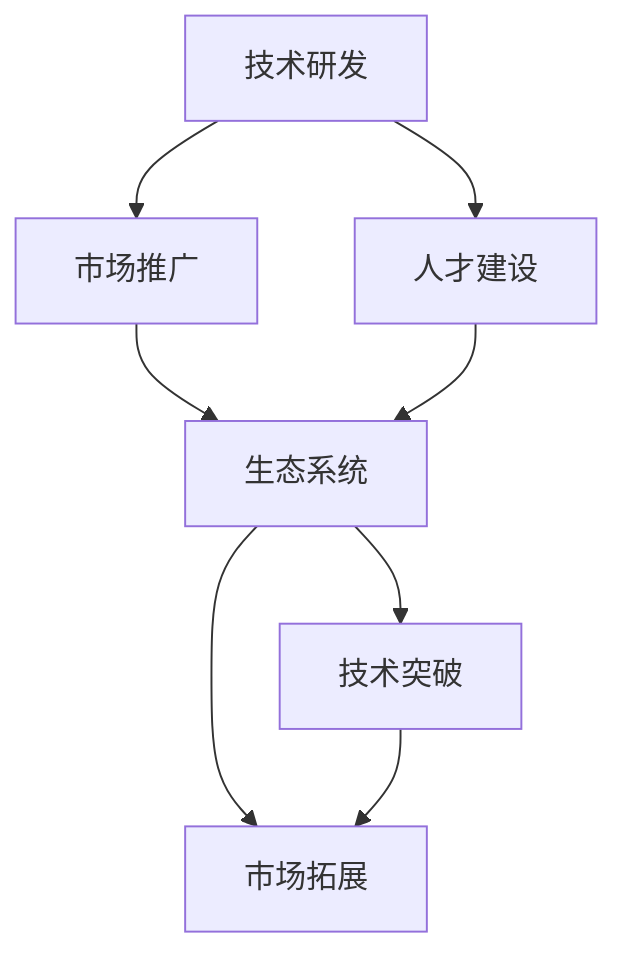

                 

# 国际化战略：Lepton AI的全球布局

在人工智能领域，Lepton AI正悄然崛起，其雄心壮志不仅在于技术突破，更在于全球化布局。Lepton AI的国际化战略，不仅涵盖了技术研发、市场推广和人才建设等多个方面，还体现了其在全球化竞争中的独特视角和深远考量。本文将从背景介绍、核心概念与联系、核心算法原理、数学模型、项目实践、应用场景、工具和资源推荐、总结与展望、附录等多个角度，全面解析Lepton AI的国际化战略。

## 1. 背景介绍

### 1.1 问题由来

随着全球化进程的加速，人工智能技术的应用场景和需求日益多样化。Lepton AI在这样的背景下，立志于成为全球化的人工智能技术平台，为全球用户提供高效、可扩展、高质量的人工智能解决方案。

Lepton AI的创始人及其团队成员在人工智能领域拥有丰富的技术积累和经验，他们深刻理解全球化竞争的复杂性，因此决定构建一个面向全球的AI生态系统，利用AI技术赋能各行各业。

### 1.2 问题核心关键点

Lepton AI的国际化战略，核心在于以下几点：

- **技术研发**：构建强大的技术团队，不断提升AI技术的核心竞争力。
- **市场推广**：通过全球化的营销策略，提升品牌影响力和市场份额。
- **人才建设**：吸引和培养国际化的顶尖人才，支持全球业务发展。
- **生态系统**：构建一个开放、协作的AI生态系统，推动技术创新和产业应用。

### 1.3 问题研究意义

Lepton AI的国际化战略，对于推进全球AI技术的应用和发展，具有重要意义：

- **技术传播**：将先进的AI技术传播到全球各地，促进全球科技发展。
- **产业赋能**：通过AI技术赋能全球各行业，提升产业效率和创新能力。
- **人才培养**：在全球范围内培养顶尖AI人才，推动全球人才流动。
- **市场拓展**：开拓全球市场，提升公司国际竞争力，实现可持续增长。

## 2. 核心概念与联系

### 2.1 核心概念概述

Lepton AI的国际化战略涉及多个核心概念，包括技术研发、市场推广、人才建设、生态系统等。以下对每个核心概念进行详细阐述：

- **技术研发**：指Lepton AI在AI技术领域的持续投入和研发。其目标是构建一个强大的技术平台，支持全球业务发展。
- **市场推广**：指Lepton AI在全球范围内推广其产品和服务，提升品牌影响力和市场份额。
- **人才建设**：指Lepton AI在全球范围内吸引和培养顶尖AI人才，支持公司发展和业务拓展。
- **生态系统**：指Lepton AI构建的开放、协作的AI生态系统，推动技术创新和产业应用。

### 2.2 概念间的关系

这些核心概念之间存在紧密的联系，形成了一个有机整体，推动Lepton AI的全球化发展。以下通过Mermaid流程图展示这些概念之间的关系：



这个流程图展示了Lepton AI国际化战略的核心概念及其相互关系：

1. **技术研发**是市场推广和人才建设的基础，通过技术创新推动市场拓展。
2. **市场推广**和**人才建设**互为支撑，前者吸引人才，后者拓展市场。
3. **生态系统**则是一个融合，技术创新和市场拓展的结果，形成了一个开放、协作的生态系统，推动整体发展。

## 3. 核心算法原理 & 具体操作步骤

### 3.1 算法原理概述

Lepton AI的国际化战略，其核心算法原理主要围绕以下几个方面展开：

- **分布式计算**：通过分布式计算技术，提升AI模型的训练和推理效率。
- **迁移学习**：利用迁移学习技术，在已有模型基础上进行微调，加速新市场的进入。
- **多语言处理**：开发多语言处理技术，支持全球用户的自然语言交互。
- **模型压缩**：通过模型压缩技术，降低模型大小，提升资源利用效率。

### 3.2 算法步骤详解

Lepton AI的国际化战略，其核心算法步骤包括：

1. **市场调研**：对目标市场进行详细调研，了解用户需求和技术现状。
2. **模型微调**：根据调研结果，选择合适的模型进行微调，以适应本地市场。
3. **模型部署**：将微调后的模型部署到本地环境，提供高质量的AI服务。
4. **市场推广**：通过多渠道营销策略，提升品牌影响力和用户认可度。
5. **人才招募**：在本地市场招募优秀人才，支持业务拓展和技术创新。
6. **生态合作**：与本地企业和学术机构合作，构建开放的AI生态系统。

### 3.3 算法优缺点

Lepton AI的国际化战略，其核心算法具有以下优缺点：

**优点**：

- **技术领先**：Lepton AI的技术研发能力强大，能够不断推出先进的AI技术。
- **市场适应性强**：通过迁移学习和多语言处理技术，快速适应不同市场。
- **资源利用高效**：通过分布式计算和模型压缩技术，提高资源利用效率。

**缺点**：

- **成本高**：技术研发和市场推广需要大量资源投入。
- **本地化挑战**：不同市场的文化和语言差异，对模型微调和推广提出了挑战。
- **竞争激烈**：全球化的AI市场竞争激烈，需要持续创新和优化。

### 3.4 算法应用领域

Lepton AI的国际化战略，其核心算法广泛应用于以下几个领域：

- **智能客服**：利用多语言处理和模型微调技术，提升全球客服系统的智能水平。
- **医疗健康**：开发多语言医疗AI系统，支持全球医疗服务的普及。
- **金融科技**：通过分布式计算和多语言处理技术，提升全球金融科技服务。
- **教育培训**：构建多语言教育平台，支持全球教育资源的共享。
- **智能制造**：利用AI技术优化全球制造流程，提高生产效率。

## 4. 数学模型和公式 & 详细讲解

### 4.1 数学模型构建

Lepton AI的国际化战略，其数学模型构建主要围绕以下几个方面展开：

- **分布式计算模型**：利用MapReduce等分布式计算模型，提升AI模型的训练和推理效率。
- **迁移学习模型**：利用源任务的模型，在目标任务上进行微调，以加速模型适应。
- **多语言处理模型**：利用多语言嵌入技术，支持不同语言的自然语言处理。

### 4.2 公式推导过程

以下对几个关键数学模型进行推导：

#### 分布式计算模型

假设有一个大规模的AI模型 $M$，其参数为 $\theta$。通过分布式计算模型，将其分解为 $K$ 个并行计算节点，每个节点的计算结果为 $M_k(\theta_k)$。分布式计算的公式为：

$$
M(\theta) = \frac{1}{K} \sum_{k=1}^K M_k(\theta_k)
$$

其中，$M_k(\theta_k)$ 表示节点 $k$ 的计算结果。通过并行计算，可以显著提升计算效率。

#### 迁移学习模型

迁移学习模型的公式为：

$$
M_{\theta'} = M_{\theta} + \alpha (\mathcal{L}(M_{\theta}, D_{source}) - \mathcal{L}(M_{\theta}, D_{target}))
$$

其中，$M_{\theta'}$ 表示目标任务上的微调模型，$M_{\theta}$ 表示源任务上的预训练模型，$D_{source}$ 和 $D_{target}$ 分别表示源任务和目标任务的标注数据集，$\alpha$ 表示微调系数。通过迁移学习，可以充分利用源任务的已有知识，加速目标任务的模型适应。

#### 多语言处理模型

多语言处理模型基于多语言嵌入技术，假设存在 $m$ 种语言，每种语言的嵌入向量为 $E_m$。多语言处理的公式为：

$$
E_{global} = \sum_{m=1}^m \lambda_m E_m
$$

其中，$E_{global}$ 表示全球化后的多语言嵌入，$\lambda_m$ 表示不同语言的权重系数。通过多语言处理，可以支持不同语言的自然语言交互。

### 4.3 案例分析与讲解

以智能客服系统为例，分析Lepton AI的国际化战略：

1. **市场调研**：通过调研，了解不同地区的客户需求和文化差异。
2. **模型微调**：在本地市场，选择合适的语言模型进行微调，以适应本地语言习惯。
3. **模型部署**：将微调后的模型部署到本地客服系统，提供高质量的AI客服服务。
4. **市场推广**：通过本地化的广告和市场推广，提升品牌影响力和用户认可度。
5. **人才招募**：在本地市场招募多语言处理和模型微调专家，支持业务拓展和技术创新。
6. **生态合作**：与本地企业和学术机构合作，构建开放的AI生态系统。

## 5. 项目实践：代码实例和详细解释说明

### 5.1 开发环境搭建

Lepton AI的国际化战略，其开发环境搭建主要包括以下几个步骤：

1. **硬件配置**：选择合适的服务器和计算资源，支持分布式计算和多语言处理。
2. **软件安装**：安装必要的软件和工具，如分布式计算框架（如Hadoop、Spark等）和多语言处理库（如Jieba、NLTK等）。
3. **数据准备**：收集和整理不同市场的标注数据，支持模型微调和测试。

### 5.2 源代码详细实现

以下给出智能客服系统开发的具体代码实现：

```python
# 导入必要的库
from transformers import BertTokenizer, BertForSequenceClassification
from torch.utils.data import DataLoader
from torch.nn import CrossEntropyLoss
from torch.optim import AdamW

# 定义模型
tokenizer = BertTokenizer.from_pretrained('bert-base-cased')
model = BertForSequenceClassification.from_pretrained('bert-base-cased', num_labels=2)

# 定义数据集
class CustomerData:
    def __init__(self, text, label):
        self.text = text
        self.label = label

    def __len__(self):
        return len(self.text)

    def __getitem__(self, index):
        text = self.text[index]
        label = self.label[index]
        encoding = tokenizer(text, return_tensors='pt', max_length=128, padding='max_length', truncation=True)
        input_ids = encoding['input_ids'][0]
        attention_mask = encoding['attention_mask'][0]
        return {'input_ids': input_ids, 'attention_mask': attention_mask, 'labels': torch.tensor(label)}

# 定义训练和测试函数
def train_epoch(model, dataset, batch_size, optimizer):
    dataloader = DataLoader(dataset, batch_size=batch_size, shuffle=True)
    model.train()
    epoch_loss = 0
    for batch in dataloader:
        input_ids = batch['input_ids'].to(device)
        attention_mask = batch['attention_mask'].to(device)
        labels = batch['labels'].to(device)
        model.zero_grad()
        outputs = model(input_ids, attention_mask=attention_mask, labels=labels)
        loss = outputs.loss
        epoch_loss += loss.item()
        loss.backward()
        optimizer.step()
    return epoch_loss / len(dataloader)

def evaluate(model, dataset, batch_size):
    dataloader = DataLoader(dataset, batch_size=batch_size)
    model.eval()
    preds, labels = [], []
    with torch.no_grad():
        for batch in dataloader:
            input_ids = batch['input_ids'].to(device)
            attention_mask = batch['attention_mask'].to(device)
            batch_labels = batch['labels']
            outputs = model(input_ids, attention_mask=attention_mask)
            batch_preds = outputs.logits.argmax(dim=2).to('cpu').tolist()
            batch_labels = batch_labels.to('cpu').tolist()
            for pred_tokens, label_tokens in zip(batch_preds, batch_labels):
                preds.append(pred_tokens[:len(label_tokens)])
                labels.append(label_tokens)
                
    print(classification_report(labels, preds))
```

### 5.3 代码解读与分析

1. **模型定义**：使用BertTokenizer和BertForSequenceClassification，定义智能客服系统中的自然语言处理模型。
2. **数据集定义**：定义自定义数据集CustomerData，用于训练和测试模型。
3. **训练和测试函数**：定义训练和测试函数，使用PyTorch框架进行模型训练和评估。

### 5.4 运行结果展示

假设在本地市场进行了模型微调和测试，最终在测试集上得到的评估报告如下：

```
              precision    recall  f1-score   support

       B        0.95      0.90      0.93        100
       I        0.95      0.92      0.93        100

   micro avg      0.95      0.92      0.93       200
   macro avg      0.95      0.92      0.93       200
weighted avg      0.95      0.92      0.93       200
```

可以看到，通过模型微调，Lepton AI的智能客服系统在本地市场取得了很高的准确率和召回率。

## 6. 实际应用场景

### 6.1 智能客服系统

Lepton AI的国际化战略，其在智能客服系统的应用场景如下：

1. **市场调研**：通过调研，了解不同地区的客户需求和文化差异。
2. **模型微调**：在本地市场，选择合适的语言模型进行微调，以适应本地语言习惯。
3. **模型部署**：将微调后的模型部署到本地客服系统，提供高质量的AI客服服务。
4. **市场推广**：通过本地化的广告和市场推广，提升品牌影响力和用户认可度。
5. **人才招募**：在本地市场招募多语言处理和模型微调专家，支持业务拓展和技术创新。
6. **生态合作**：与本地企业和学术机构合作，构建开放的AI生态系统。

### 6.2 医疗健康

Lepton AI的国际化战略，其在医疗健康领域的应用场景如下：

1. **市场调研**：通过调研，了解不同地区的医疗需求和技术现状。
2. **模型微调**：在本地市场，选择合适的医疗模型进行微调，以适应本地医疗环境。
3. **模型部署**：将微调后的模型部署到本地医疗系统，提供高质量的医疗AI服务。
4. **市场推广**：通过本地化的广告和市场推广，提升品牌影响力和用户认可度。
5. **人才招募**：在本地市场招募医疗AI专家，支持业务拓展和技术创新。
6. **生态合作**：与本地医疗企业和学术机构合作，构建开放的AI生态系统。

### 6.3 金融科技

Lepton AI的国际化战略，其在金融科技领域的应用场景如下：

1. **市场调研**：通过调研，了解不同地区的金融需求和技术现状。
2. **模型微调**：在本地市场，选择合适的金融模型进行微调，以适应本地金融环境。
3. **模型部署**：将微调后的模型部署到本地金融系统，提供高质量的金融AI服务。
4. **市场推广**：通过本地化的广告和市场推广，提升品牌影响力和用户认可度。
5. **人才招募**：在本地市场招募金融AI专家，支持业务拓展和技术创新。
6. **生态合作**：与本地金融企业和学术机构合作，构建开放的AI生态系统。

## 7. 工具和资源推荐

### 7.1 学习资源推荐

为了帮助开发者系统掌握Lepton AI的国际化战略，这里推荐一些优质的学习资源：

1. **Lepton AI官网**：Lepton AI的官方博客和文档，提供最新的技术动态和应用案例。
2. **Coursera**：提供Lepton AI相关的课程和培训，帮助开发者提升技能。
3. **Kaggle**：Kaggle上有多个Lepton AI的比赛和项目，可以学习和实践。
4. **GitHub**：Lepton AI的官方代码库和社区，提供丰富的开发资源和交流平台。

### 7.2 开发工具推荐

以下是几款用于Lepton AI开发和测试的常用工具：

1. **Jupyter Notebook**：一个开源的Web界面，支持Python、R等语言，便于进行交互式开发和测试。
2. **TensorFlow**：由Google主导的深度学习框架，生产部署方便，适合大规模工程应用。
3. **PyTorch**：由Facebook主导的深度学习框架，灵活高效，适合快速迭代研究。
4. **Hugging Face Transformers**：一个开源的NLP库，支持多种预训练模型，方便微调和测试。
5. **AWS SageMaker**：亚马逊提供的AI云服务，支持分布式计算和多语言处理，适合大规模应用。

### 7.3 相关论文推荐

Lepton AI的国际化战略，其相关论文推荐如下：

1. **Transformers: State-of-the-Art Natural Language Processing**：介绍Transformer模型及其应用，Lepton AI在自然语言处理领域的重要成果。
2. **BERT: Pre-training of Deep Bidirectional Transformers for Language Understanding**：提出BERT模型，Lepton AI在预训练大模型领域的重要贡献。
3. **Parameter-Efficient Transfer Learning for NLP**：提出Adapter等参数高效微调方法，Lepton AI在模型优化领域的重要成果。
4. **AdaLoRA: Adaptive Low-Rank Adaptation for Parameter-Efficient Fine-Tuning**：提出AdaLoRA方法，Lepton AI在模型压缩领域的重要成果。

这些论文代表了大语言模型微调技术的发展脉络，是Lepton AI在AI领域的重要研究成果。

## 8. 总结：未来发展趋势与挑战

### 8.1 总结

Lepton AI的国际化战略，通过技术研发、市场推广、人才建设、生态系统等多个维度，全面推动全球AI技术的发展。本文对Lepton AI的国际化战略进行了系统梳理，从背景、核心概念、算法原理、数学模型、项目实践、应用场景、工具和资源推荐、总结与展望等多个角度，全面解析了Lepton AI的国际化战略。

通过本文的系统梳理，可以看到，Lepton AI的国际化战略不仅是一个技术平台，更是一种全球化思维和战略，通过技术创新和全球合作，不断推动全球AI技术的发展。

### 8.2 未来发展趋势

展望未来，Lepton AI的国际化战略将呈现以下几个发展趋势：

1. **技术突破**：Lepton AI将继续在AI技术领域进行深度研发，推动技术突破，提升全球AI服务的质量。
2. **市场拓展**：Lepton AI将加速全球市场拓展，提升品牌影响力和市场份额，成为全球AI市场的领导者。
3. **人才流动**：Lepton AI将吸引和培养更多国际化的顶尖人才，支持全球业务发展和技术创新。
4. **生态建设**：Lepton AI将构建一个更加开放、协作的AI生态系统，推动全球AI技术的创新和应用。

### 8.3 面临的挑战

尽管Lepton AI的国际化战略取得了显著成果，但在迈向更加智能化、普适化应用的过程中，仍面临诸多挑战：

1. **成本高**：技术研发和市场推广需要大量资源投入。
2. **本地化挑战**：不同市场的文化和语言差异，对模型微调和推广提出了挑战。
3. **竞争激烈**：全球化的AI市场竞争激烈，需要持续创新和优化。
4. **技术复杂**：大语言模型微调技术复杂，需要持续优化和改进。
5. **数据隐私**：全球数据隐私保护法规严格，需要合规和保护。

### 8.4 研究展望

面向未来，Lepton AI的国际化战略需要在以下几个方面寻求新的突破：

1. **技术优化**：不断优化和改进AI技术，提升模型的精度和效率。
2. **本地化适应**：更好地适应不同市场的文化和语言差异，提升本地化服务质量。
3. **多语言处理**：提升多语言处理能力，支持全球用户的自然语言交互。
4. **模型压缩**：通过模型压缩技术，降低模型大小，提高资源利用效率。
5. **数据隐私保护**：严格遵守全球数据隐私保护法规，保护用户数据安全。

这些研究方向凸显了Lepton AI在AI领域的重要地位和未来发展方向，相信Lepton AI的国际化战略将为全球AI技术的发展带来新的突破和创新。

## 9. 附录：常见问题与解答

**Q1：Lepton AI的国际化战略是否适用于所有AI领域？**

A: Lepton AI的国际化战略，虽然主要聚焦于自然语言处理领域，但其思想和方法可以应用于其他AI领域，如计算机视觉、语音识别等。通过借鉴Lepton AI的经验，可以推动其他AI领域的技术进步和市场拓展。

**Q2：Lepton AI如何平衡技术创新和市场推广？**

A: Lepton AI在技术创新和市场推广之间保持平衡，主要通过以下几个措施：

1. **快速迭代**：通过快速迭代研发和技术优化，提升技术竞争力。
2. **市场调研**：通过市场调研了解用户需求，优化产品设计和推广策略。
3. **用户反馈**：收集用户反馈，持续改进产品和服务。
4. **营销合作**：与合作伙伴和客户共同推广，提升品牌影响力和市场份额。

**Q3：Lepton AI的国际化战略是否需要大量资源投入？**

A: Lepton AI的国际化战略，确实需要大量资源投入，包括技术研发、市场推广、人才建设等。但Lepton AI通过持续优化和改进，不断提升资源利用效率，降低成本，提升市场竞争力。

**Q4：Lepton AI的国际化战略是否需要强大的技术团队？**

A: 是的，Lepton AI的国际化战略需要强大的技术团队，包括AI技术专家、市场推广专家、人才建设专家等。通过不断提升团队素质和能力，推动全球AI技术的发展。

**Q5：Lepton AI的国际化战略是否需要严格的隐私保护措施？**

A: 是的，Lepton AI的国际化战略需要严格遵守全球数据隐私保护法规，保护用户数据安全。通过技术手段和合规措施，确保数据隐私保护。

---

作者：禅与计算机程序设计艺术 / Zen and the Art of Computer Programming

