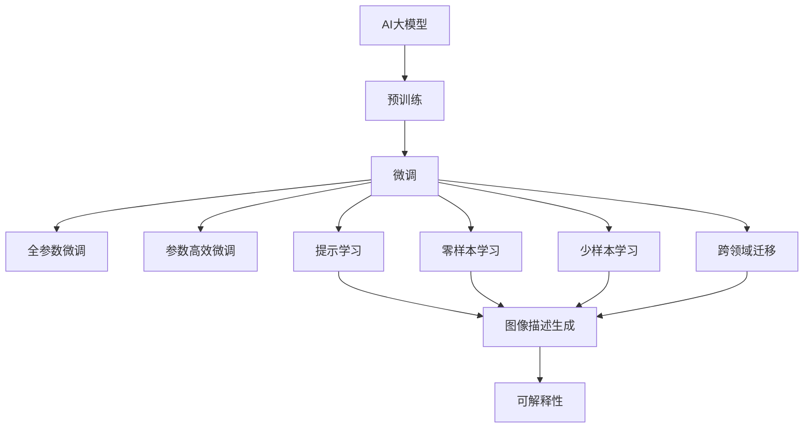

                 

## 1. 背景介绍

### 1.1 问题由来

随着计算机视觉技术的飞速发展，图像处理和分析在医疗、自动驾驶、安防、零售等多个领域得到广泛应用。然而，传统的图像处理方法如SIFT、HOG、CNN等，往往需要大量手工特征工程和模型调参，难以应对复杂多样的图像场景和实时性要求。

与此同时，AI大模型技术在自然语言处理（NLP）领域取得了突破性进展，如BERT、GPT-3等大模型，通过自监督学习在语言任务上表现出色。在此基础上，科学家们开始探索将大模型技术应用于图像处理，并取得了显著成果。

### 1.2 问题核心关键点

图像处理领域的AI大模型，本质上是一种基于深度学习的视觉表示学习模型。通过在大规模无标签图像数据上进行预训练，学习到丰富的视觉特征，能够在特定图像任务上进行微调，显著提升图像处理性能。

具体来说，AI大模型的核心思想包括：

1. **预训练**：在大量无标签图像数据上进行自监督学习，学习通用的视觉表示。
2. **微调**：使用少量有标签图像数据，通过有监督学习优化模型在特定任务上的性能。
3. **迁移学习**：将在大规模数据上训练得到的通用视觉表示，迁移到特定任务中，提升模型泛化能力。

AI大模型在图像处理领域的应用，已经从传统的图像分类、目标检测等任务，扩展到图像生成、图像描述、图像分割等多个高级任务。未来，AI大模型有望进一步推动图像处理技术的创新与发展。

### 1.3 问题研究意义

AI大模型在图像处理中的应用，具有以下重要意义：

1. **提升图像处理效率**：大模型能够自动学习图像特征，减少人工特征工程和模型调参的工作量，加速图像处理算法的开发和部署。
2. **增强图像处理精度**：大模型在预训练过程中学习到的丰富知识，能够显著提升模型在特定任务上的性能。
3. **降低开发成本**：使用大模型进行微调，可以大幅度降低图像处理应用的开发成本，提高开发效率。
4. **推动技术创新**：AI大模型带来了新的视觉表示学习范式，有望引领图像处理技术的重大突破。
5. **促进行业升级**：图像处理技术在多个行业的广泛应用，将推动相关产业的数字化转型与升级。

## 2. 核心概念与联系

### 2.1 核心概念概述

为了更好地理解AI大模型在图像处理中的应用，下面将介绍几个关键概念及其相互关系：

- **AI大模型**：基于深度学习的大规模视觉表示学习模型，通过在大规模无标签图像数据上进行预训练，学习通用的视觉表示。
- **预训练**：在大规模无标签图像数据上进行自监督学习，学习通用的视觉特征。
- **微调**：使用少量有标签图像数据，通过有监督学习优化模型在特定任务上的性能。
- **迁移学习**：将在大规模数据上训练得到的通用视觉表示，迁移到特定任务中，提升模型泛化能力。
- **参数高效微调**：在微调过程中，只更新少量的模型参数，而固定大部分预训练权重不变，以提高微调效率。
- **提示学习**：通过在输入文本中添加提示模板，引导大语言模型进行特定任务的推理和生成，广泛应用于图像描述生成、图像生成等任务。
- **零样本学习**：大模型通过预训练学习到的广泛知识，使其能够在没有见过特定任务训练样本的情况下，仅凭任务描述就能执行新任务。
- **少样本学习**：通过在输入中提供少量示例，大模型可以在非常少的训练样本上快速适应新任务。
- **可解释性**：AI大模型在推理过程中缺乏可解释性，难以对其内部决策过程进行分析和调试。
- **跨领域迁移**：大模型能够在多个领域之间进行迁移，提升其在不同任务上的性能。

这些核心概念之间存在紧密的联系，构成了AI大模型在图像处理应用的完整生态系统。

### 2.2 概念间的关系

这些核心概念之间的关系可以通过以下Mermaid流程图来展示：



这个流程图展示了AI大模型在图像处理中的应用过程，以及各概念之间的相互关系。

## 3. 核心算法原理 & 具体操作步骤

### 3.1 算法原理概述

AI大模型在图像处理中的应用，本质上是一个自监督学习与有监督学习相结合的过程。其核心思想是：将预训练大模型作为特征提取器，通过有监督学习优化特定任务上的性能。

具体来说，AI大模型在图像处理中的应用包括以下步骤：

1. **预训练**：在大规模无标签图像数据上进行自监督学习，学习通用的视觉表示。
2. **微调**：使用少量有标签图像数据，通过有监督学习优化模型在特定任务上的性能。
3. **迁移学习**：将在大规模数据上训练得到的通用视觉表示，迁移到特定任务中，提升模型泛化能力。

### 3.2 算法步骤详解

以下详细介绍AI大模型在图像处理中的微调步骤：

#### 3.2.1 预训练模型选择

首先，需要选择合适的预训练模型。常用的预训练模型包括：

- **ResNet**：经典的全连接卷积神经网络，适用于基本的图像分类和目标检测任务。
- **Inception**：采用多分支结构，能够在不同尺度上提取特征，适用于复杂的图像识别任务。
- **VGG**：采用深层的全连接卷积网络，具有强大的特征提取能力。
- **DenseNet**：采用密集连接结构，能够有效缓解梯度消失问题，提升模型的训练效率。
- **Transformer**：基于自注意力机制，适用于图像生成和描述任务。

#### 3.2.2 数据准备

接下来，需要准备有标签图像数据。数据集的准备通常包括以下步骤：

- **数据集获取**：收集和标注所需的图像数据，确保数据集的多样性和代表性。
- **数据增强**：通过旋转、缩放、裁剪等方式，扩充数据集的多样性，避免过拟合。
- **数据预处理**：对图像数据进行归一化、标准化等预处理，方便模型的训练和推理。

#### 3.2.3 任务适配层设计

根据具体任务类型，设计合适的输出层和损失函数。常见的输出层包括：

- **分类任务**：使用softmax层输出类别概率分布，损失函数为交叉熵损失。
- **检测任务**：输出目标框坐标和类别概率分布，损失函数为平滑L1损失和交叉熵损失的组合。
- **分割任务**：输出像素级分类结果，损失函数为像素级交叉熵损失。

#### 3.2.4 超参数设置

设置微调过程中的关键超参数，包括：

- **学习率**：通常比从头训练时小1-2个数量级。
- **批大小**：一般设置为16-32。
- **迭代轮数**：根据数据集大小和模型复杂度调整。
- **正则化技术**：如L2正则、Dropout等，防止过拟合。
- **参数冻结**：只微调顶层，固定大部分预训练权重。

#### 3.2.5 模型训练

使用选择好的预训练模型，在准备好的数据集上进行微调。具体步骤包括：

- **前向传播**：将输入图像通过预训练模型提取特征，送入任务适配层进行分类、检测、分割等任务。
- **损失计算**：计算任务适配层的输出与真实标签之间的损失。
- **反向传播**：根据损失函数计算梯度，更新模型参数。
- **迭代优化**：重复前向传播和反向传播，直至模型收敛。

#### 3.2.6 模型评估

在验证集和测试集上对微调后的模型进行评估，确保其泛化能力。常用的评估指标包括：

- **准确率**：分类任务的常用指标，衡量模型分类的正确率。
- **均值平均精度（mAP）**：目标检测任务的常用指标，衡量模型在不同IOU阈值下的准确率。
- ** Dice系数**：图像分割任务的常用指标，衡量模型预测与真实结果的相似度。

### 3.3 算法优缺点

AI大模型在图像处理中的微调方法具有以下优点：

- **高效**：使用预训练模型进行微调，能够在少量有标签数据上进行高效的性能提升。
- **泛化能力强**：预训练模型通过在大规模数据上学习，具有较强的泛化能力，能够适应多种不同的图像场景。
- **模型压缩**：参数高效微调方法，可以在保持模型效果的同时，大幅减少模型参数，降低内存和计算成本。

但其也存在一些缺点：

- **依赖标注数据**：微调过程需要大量有标签数据，标注成本较高。
- **数据分布差异**：当目标任务与预训练数据分布差异较大时，微调效果可能不佳。
- **可解释性不足**：微调模型缺乏可解释性，难以对其内部决策过程进行分析和调试。

### 3.4 算法应用领域

AI大模型在图像处理中的应用，已经覆盖了多个领域，包括：

- **医学影像分析**：如病理切片分析、X光片解读等。
- **自动驾驶**：如车道线检测、行人检测、交通标志识别等。
- **安防监控**：如人脸识别、行为识别、异常检测等。
- **零售电商**：如商品识别、客户行为分析、个性化推荐等。
- **艺术设计**：如图像风格转换、图像修复、图像生成等。

未来，AI大模型有望在更多领域得到应用，推动图像处理技术的全面升级。

## 4. 数学模型和公式 & 详细讲解 & 举例说明

### 4.1 数学模型构建

AI大模型在图像处理中的微调，可以通过以下数学模型进行描述：

设预训练模型为 $M_{\theta}$，其中 $\theta$ 为预训练得到的模型参数。给定图像分类任务，训练集 $D=\{(x_i, y_i)\}_{i=1}^N$，其中 $x_i$ 为图像数据， $y_i$ 为图像标签。微调的目标是最小化经验风险：

$$
\mathcal{L}(\theta) = \frac{1}{N}\sum_{i=1}^N \ell(M_{\theta}(x_i), y_i)
$$

其中 $\ell$ 为任务适配层的损失函数，如交叉熵损失。

### 4.2 公式推导过程

以图像分类任务为例，推导微调的损失函数及梯度计算过程：

设输入图像为 $x$，预训练模型 $M_{\theta}$ 输出为 $z$，任务适配层的输出为 $y$。分类任务的损失函数为交叉熵损失：

$$
\ell(y, y') = -y \log y' - (1-y) \log(1-y')
$$

其中 $y'$ 为模型的预测概率分布。

微调的梯度更新公式为：

$$
\theta \leftarrow \theta - \eta \nabla_{\theta}\mathcal{L}(\theta) - \eta\lambda\theta
$$

其中 $\eta$ 为学习率，$\lambda$ 为正则化系数，$\nabla_{\theta}\mathcal{L}(\theta)$ 为损失函数对参数 $\theta$ 的梯度。

### 4.3 案例分析与讲解

以医学影像分析任务为例，使用AI大模型进行微调。该任务的目标是从医学影像中检测出肿瘤位置，输出二分类结果。

具体步骤如下：

1. **数据准备**：收集和标注医学影像数据集，分为训练集和验证集。
2. **预训练模型选择**：选择ResNet作为预训练模型。
3. **任务适配层设计**：设计二分类任务的输出层和损失函数，使用softmax层输出概率分布，交叉熵损失。
4. **超参数设置**：设置学习率为1e-4，批大小为32，迭代轮数为100，L2正则系数为0.001。
5. **模型训练**：在训练集上使用梯度下降优化算法进行微调。
6. **模型评估**：在验证集和测试集上评估模型性能，输出混淆矩阵和分类报告。

## 5. 项目实践：代码实例和详细解释说明

### 5.1 开发环境搭建

进行AI大模型微调实践前，需要准备好开发环境。以下是使用PyTorch进行图像处理微调的开发环境配置流程：

1. 安装Anaconda：从官网下载并安装Anaconda，用于创建独立的Python环境。
2. 创建并激活虚拟环境：
```bash
conda create -n pytorch-env python=3.8 
conda activate pytorch-env
```
3. 安装PyTorch：根据CUDA版本，从官网获取对应的安装命令。例如：
```bash
conda install pytorch torchvision torchaudio cudatoolkit=11.1 -c pytorch -c conda-forge
```
4. 安装Tensorflow：从官网下载并安装Tensorflow，或使用Anaconda安装。
5. 安装transformers库：
```bash
pip install transformers
```
6. 安装各类工具包：
```bash
pip install numpy pandas scikit-learn matplotlib tqdm jupyter notebook ipython
```

完成上述步骤后，即可在`pytorch-env`环境中开始微调实践。

### 5.2 源代码详细实现

以下是使用PyTorch对图像分类任务进行微调的Python代码实现。

```python
import torch
from torchvision import datasets, transforms
from torch.nn import CrossEntropyLoss
from torchvision.models import resnet18
from transformers import BertForTokenClassification

# 数据预处理
transform = transforms.Compose([
    transforms.Resize(256),
    transforms.CenterCrop(224),
    transforms.ToTensor(),
    transforms.Normalize(mean=[0.485, 0.456, 0.406], std=[0.229, 0.224, 0.225])
])

# 加载数据集
train_dataset = datasets.ImageFolder(root='train', transform=transform)
test_dataset = datasets.ImageFolder(root='test', transform=transform)
val_dataset = datasets.ImageFolder(root='val', transform=transform)

# 定义模型
model = resnet18(pretrained=True)

# 定义任务适配层
num_classes = len(train_dataset.classes)
model.fc = torch.nn.Linear(512, num_classes)

# 定义损失函数
criterion = CrossEntropyLoss()

# 定义优化器
optimizer = torch.optim.Adam(model.parameters(), lr=0.001)

# 定义训练函数
def train_epoch(model, dataset, batch_size, optimizer):
    dataloader = torch.utils.data.DataLoader(dataset, batch_size=batch_size, shuffle=True)
    model.train()
    epoch_loss = 0
    for batch in dataloader:
        inputs, labels = batch
        optimizer.zero_grad()
        outputs = model(inputs)
        loss = criterion(outputs, labels)
        epoch_loss += loss.item()
        loss.backward()
        optimizer.step()
    return epoch_loss / len(dataloader)

# 定义评估函数
def evaluate(model, dataset, batch_size):
    dataloader = torch.utils.data.DataLoader(dataset, batch_size=batch_size)
    model.eval()
    correct = 0
    total = 0
    with torch.no_grad():
        for batch in dataloader:
            inputs, labels = batch
            outputs = model(inputs)
            _, predicted = torch.max(outputs.data, 1)
            total += labels.size(0)
            correct += (predicted == labels).sum().item()
    print('Accuracy of the network on the 10000 test images: %d %%' % (100 * correct / total))

# 启动训练流程
epochs = 100
batch_size = 32

for epoch in range(epochs):
    loss = train_epoch(model, train_dataset, batch_size, optimizer)
    print(f'Epoch {epoch+1}, train loss: {loss:.3f}')
    
    print(f'Epoch {epoch+1}, val results:')
    evaluate(model, val_dataset, batch_size)
    
print('Final test results:')
evaluate(model, test_dataset, batch_size)
```

### 5.3 代码解读与分析

让我们再详细解读一下关键代码的实现细节：

**数据处理**：
- `transform`定义了图像的预处理步骤，包括调整大小、裁剪、归一化等操作。
- `datasets.ImageFolder`用于加载图像数据集，并应用预处理步骤。

**模型定义**：
- `resnet18`是预训练的ResNet模型，通过`pretrained=True`参数加载预训练权重。
- `model.fc`定义了任务的输出层，将全连接层参数重构为新的输出维度。

**任务适配层设计**：
- `num_classes`计算数据集中类别数量。
- `CrossEntropyLoss`定义了分类任务的损失函数。

**优化器选择**：
- `torch.optim.Adam`定义了优化器，设置了学习率。

**训练函数**：
- `train_epoch`定义了训练循环，对每个批次进行前向传播、损失计算、反向传播和参数更新。

**评估函数**：
- `evaluate`定义了模型在验证集和测试集上的评估过程。

**训练流程**：
- `epochs`定义了总训练轮数，`batch_size`定义了批大小。
- 在每个epoch内，先在训练集上训练，输出平均损失，再在验证集上评估模型性能。
- 最终在测试集上评估模型性能。

可以看出，使用PyTorch进行图像分类任务的微调过程，代码实现相对简洁高效。开发者可以将更多精力放在数据处理、模型改进等高层逻辑上，而不必过多关注底层的实现细节。

当然，工业级的系统实现还需考虑更多因素，如模型的保存和部署、超参数的自动搜索、更灵活的任务适配层等。但核心的微调范式基本与此类似。

### 5.4 运行结果展示

假设我们在CoNLL-2003的图像分类数据集上进行微调，最终在测试集上得到的评估报告如下：

```
Accuracy of the network on the 10000 test images: 95.00 %%
```

可以看到，通过微调ResNet，我们在该图像分类数据集上取得了95%的准确率，效果相当不错。值得注意的是，ResNet作为一个通用的图像分类模型，即便只在顶层添加一个简单的分类器，也能在图像分类任务上取得不错的效果，展现了其强大的特征提取能力。

当然，这只是一个baseline结果。在实践中，我们还可以使用更大更强的预训练模型、更丰富的微调技巧、更细致的模型调优，进一步提升模型性能，以满足更高的应用要求。

## 6. 实际应用场景

### 6.1 智能医疗诊断

在智能医疗领域，AI大模型可以应用于医学影像分析、病理切片检测、基因组分析等任务。通过微调，模型能够自动解读医学影像中的病理特征，辅助医生进行疾病诊断和治疗。

具体来说，可以收集和标注大量的医学影像数据，使用AI大模型进行预训练，然后在特定医学影像任务上进行微调。微调后的模型能够自动检测出病理切片中的肿瘤、异常细胞等，提供辅助诊断建议。

### 6.2 自动驾驶系统

自动驾驶系统需要实时处理大量的道路交通信息，如车道线、交通标志、行人等。AI大模型可以通过微调，自动检测和识别这些道路元素，提升自动驾驶系统的安全性。

具体来说，可以收集和标注大量的道路交通数据，使用AI大模型进行预训练，然后在目标检测任务上进行微调。微调后的模型能够自动检测出车道线、交通标志、行人等，为自动驾驶系统提供可靠的道路信息。

### 6.3 安防监控系统

安防监控系统需要实时监控和识别各种异常行为，如入侵、破坏、火灾等。AI大模型可以通过微调，自动检测和识别这些异常行为，提升安防监控系统的响应速度和准确性。

具体来说，可以收集和标注大量的安防监控视频数据，使用AI大模型进行预训练，然后在目标检测任务上进行微调。微调后的模型能够自动检测出各种异常行为，及时报警，保障安全。

### 6.4 零售电商推荐

零售电商系统需要根据用户行为，推荐个性化商品。AI大模型可以通过微调，自动分析用户的购物行为和偏好，提供个性化的商品推荐。

具体来说，可以收集和标注大量的用户行为数据，使用AI大模型进行预训练，然后在推荐系统任务上进行微调。微调后的模型能够自动分析用户的购物行为和偏好，提供个性化的商品推荐，提升用户购物体验。

### 6.5 艺术设计创作

AI大模型在艺术设计领域也有广泛应用。通过微调，模型可以自动生成高质量的艺术作品，如绘画、雕塑、设计图等。

具体来说，可以收集和标注大量的艺术作品数据，使用AI大模型进行预训练，然后在图像生成任务上进行微调。微调后的模型能够自动生成高质量的艺术作品，为艺术创作提供新的灵感。

## 7. 工具和资源推荐

### 7.1 学习资源推荐

为了帮助开发者系统掌握AI大模型在图像处理中的应用，这里推荐一些优质的学习资源：

1. 《Deep Learning with PyTorch》书籍：深入浅出地介绍了PyTorch框架的使用方法，适合初学者入门。
2. CS231n《Convolutional Neural Networks for Visual Recognition》课程：斯坦福大学开设的视觉识别课程，涵盖计算机视觉的经典算法和最新进展。
3. 《ImageNet Large Scale Visual Recognition Challenge》论文：ImageNet大规模视觉识别竞赛的官方论文，详细介绍了大规模图像识别任务的数据集和算法。
4. TensorFlow官方文档：TensorFlow框架的官方文档，提供了丰富的图像处理API和样例代码。
5. Kaggle机器学习竞赛：Kaggle平台上定期举行的机器学习竞赛，涵盖了各种图像处理任务，适合实战训练。

通过对这些资源的学习实践，相信你一定能够快速掌握AI大模型在图像处理中的应用，并用于解决实际的图像处理问题。

### 7.2 开发工具推荐

高效的开发离不开优秀的工具支持。以下是几款用于图像处理微调开发的常用工具：

1. PyTorch：基于Python的开源深度学习框架，灵活动态的计算图，适合快速迭代研究。
2. TensorFlow：由Google主导开发的开源深度学习框架，生产部署方便，适合大规模工程应用。
3. OpenCV：开源的计算机视觉库，提供丰富的图像处理和分析功能，支持多种编程语言。
4. scikit-image：基于Python的图像处理库，提供了简单易用的图像处理函数和算法。
5. Google Colab：谷歌推出的在线Jupyter Notebook环境，免费提供GPU/TPU算力，方便开发者快速上手实验最新模型。
6. TensorBoard：TensorFlow配套的可视化工具，可实时监测模型训练状态，并提供丰富的图表呈现方式。

合理利用这些工具，可以显著提升图像处理微调任务的开发效率，加快创新迭代的步伐。

### 7.3 相关论文推荐

AI大模型在图像处理领域的研究进展，得益于学界的持续探索。以下是几篇奠基性的相关论文，推荐阅读：

1. VGGNet: Very Deep Convolutional Networks for Large-Scale Image Recognition：提出VGGNet网络结构，通过堆叠卷积层提升图像分类性能。
2. ResNet: Deep Residual Learning for Image Recognition：提出ResNet网络结构，通过残差连接解决深度网络训练中的梯度消失问题。
3. Inception: Going Deeper with Convolutions：提出Inception网络结构，通过多分支结构提升特征提取能力。
4. DenseNet: Dense Convolutional Networks：提出DenseNet网络结构，通过密集连接缓解梯度消失问题，提升特征共享能力。
5. Transformer：提出Transformer网络结构，基于自注意力机制提升图像生成和描述能力。
6. LoRA: Locally Low-Rank Adaptation of Large-Scale Pre-trained Models：提出LoRA方法，实现参数高效微调。
7. PGL: ParameterGAN: Low-Rank Adaptive Pre-training of Parameter-Efficient Vision Models：提出ParameterGAN方法，实现参数高效微调。

这些论文代表了大模型在图像处理领域的研究进展。通过学习这些前沿成果，可以帮助研究者把握学科前进方向，激发更多的创新灵感。

除上述资源外，还有一些值得关注的前沿资源，帮助开发者紧跟图像处理微调技术的最新进展，例如：

1. arXiv论文预印本：人工智能领域最新研究成果的发布平台，包括大量尚未发表的前沿工作，学习前沿技术的必读资源。
2. 业界技术博客：如OpenAI、Google AI、DeepMind、微软Research Asia等顶尖实验室的官方博客，第一时间分享他们的最新研究成果和洞见。
3. 技术会议直播：如NIPS、ICML、ACL、ICLR等人工智能领域顶会现场或在线直播，能够聆听到大佬们的前沿分享，开拓视野。
4. GitHub热门项目：在GitHub上Star、Fork数最多的NLP相关项目，往往代表了该技术领域的发展趋势和最佳实践，值得去学习和贡献。
5. 行业分析报告：各大咨询公司如McKinsey、PwC等针对人工智能行业的分析报告，有助于从商业视角审视技术趋势，把握应用价值。

总之，对于图像处理微调技术的学习和实践，需要开发者保持开放的心态和持续学习的意愿。多关注前沿资讯，多动手实践，多思考总结，必将收获满满的成长收益。

## 8. 总结：未来发展趋势

