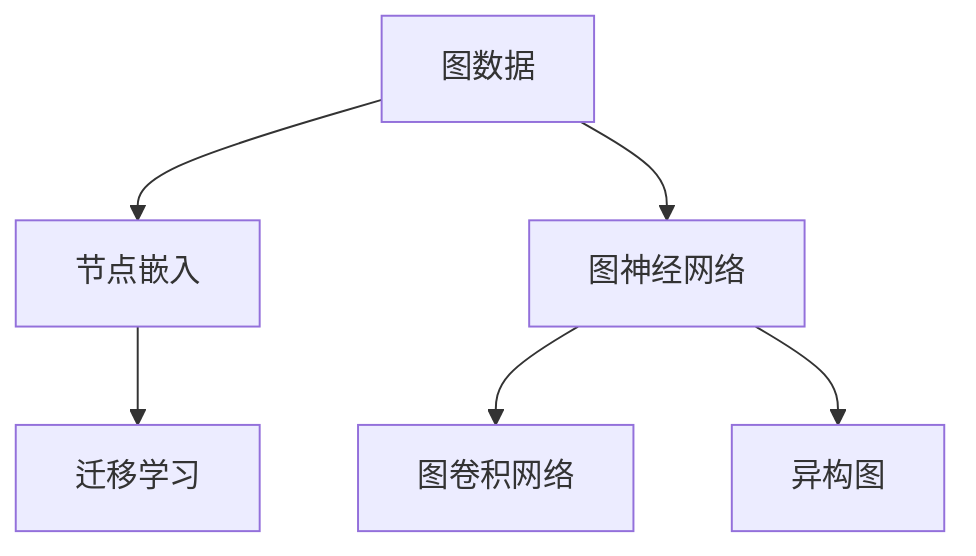
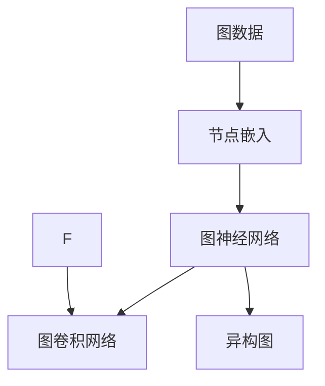
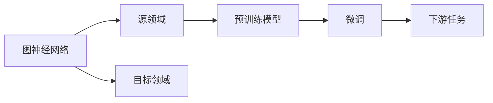
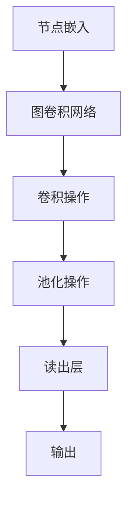
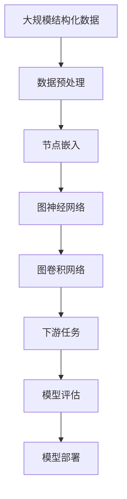

                 

# 图神经网络:处理结构化数据的新方法

> 关键词：图神经网络,结构化数据,深度学习,节点嵌入,图卷积网络,异构图,迁移学习

## 1. 背景介绍

### 1.1 问题由来
随着数据技术的发展，结构化数据在各行各业的应用越来越广泛。结构化数据是指按照一定结构组织的数据，例如关系型数据库中的表数据、图数据库中的图数据。结构化数据具有明确的数据关系和结构特征，能够为数据分析和处理提供有力的支撑。然而，传统的机器学习算法在处理结构化数据时，常常面临数据结构复杂、特征提取困难等问题。近年来，图神经网络（Graph Neural Networks, GNNs）作为一种新的深度学习方法，逐渐受到学界和业界的广泛关注。

### 1.2 问题核心关键点
图神经网络是一种专门用于处理图数据的深度学习模型，其主要思想是将图数据转化为神经网络能够处理的形式，并在其中提取图结构信息和节点特征，从而实现对图数据的有效学习。图神经网络的兴起，主要源于以下几个方面的驱动：

1. **数据结构复杂性**：结构化数据具有复杂的网络关系和层次结构，传统的机器学习算法难以处理。
2. **节点特征多样性**：结构化数据中的节点可能包含多种类型的数据特征，例如文本、图像、时间序列等。
3. **数据规模庞大**：许多实际应用场景中的数据规模巨大，需要高效的数据处理和分析方法。

图神经网络通过模拟图数据中的网络关系和节点特征，实现了对结构化数据的深度学习和推理，提供了处理大规模、复杂数据的新思路。

### 1.3 问题研究意义
研究图神经网络对于拓展深度学习的应用范围，提升结构化数据处理能力，具有重要意义：

1. **提高数据利用效率**：图神经网络能够更好地利用结构化数据中的网络关系和特征信息，提高数据利用效率和分析精度。
2. **降低数据处理难度**：通过自动化的深度学习模型，减少了人工数据处理的复杂性和工作量。
3. **加速数据分析进程**：图神经网络能够高效地处理大规模图数据，加速数据分析和决策支持过程。
4. **拓展应用场景**：图神经网络可以应用于社交网络分析、推荐系统、金融风控、智能城市等多个领域，推动数据驱动决策的发展。

## 2. 核心概念与联系

### 2.1 核心概念概述

为更好地理解图神经网络，本节将介绍几个密切相关的核心概念：

- **图神经网络 (Graph Neural Networks, GNNs)**：专门用于处理图数据的深度学习模型，通过在图结构上进行消息传递和节点更新，实现对图数据的深度学习。
- **图数据 (Graph Data)**：由节点和边构成的数据结构，节点表示数据实体，边表示实体之间的关系。图数据广泛应用于社交网络、生物信息学、交通网络等领域。
- **节点嵌入 (Node Embedding)**：将图数据中的节点表示为低维向量，通过节点嵌入模型捕捉节点之间的相似性和关系。
- **图卷积网络 (Graph Convolutional Network, GCN)**：一种基于图结构的卷积神经网络，通过在节点和边上的卷积操作，实现对图数据的特征提取。
- **异构图 (Heterogeneous Graph)**：由多种类型节点和多种类型边构成的图数据，用于描述复杂、异构的网络关系。
- **迁移学习 (Transfer Learning)**：将在一个领域学习到的知识迁移到另一个相关领域，以提高模型在新领域上的性能。

这些核心概念之间的逻辑关系可以通过以下Mermaid流程图来展示：



这个流程图展示了几大核心概念及其之间的关系：

1. 图数据是图神经网络、图卷积网络、异构图等模型的输入基础。
2. 节点嵌入通过捕捉节点之间的相似性和关系，提高模型的表达能力和泛化能力。
3. 图神经网络通过在图结构上进行消息传递和节点更新，实现对图数据的深度学习。
4. 图卷积网络是图神经网络的一种重要形式，通过卷积操作提取图特征。
5. 异构图用于描述复杂、异构的网络关系，增强模型的适应性和泛化能力。
6. 迁移学习在模型之间的知识共享和迁移中起到了重要作用，提升新领域上的模型性能。

### 2.2 概念间的关系

这些核心概念之间存在着紧密的联系，形成了图神经网络处理结构化数据的方法体系。下面我们通过几个Mermaid流程图来展示这些概念之间的关系。

#### 2.2.1 图神经网络的核心架构



这个流程图展示了图神经网络的基本架构：首先，将图数据中的节点嵌入为低维向量，然后通过图神经网络在图结构上进行消息传递和节点更新，最终通过图卷积网络提取图特征。

#### 2.2.2 图神经网络与迁移学习的关系



这个流程图展示了迁移学习在图神经网络中的应用。图神经网络可以通过在源领域进行预训练，然后在目标领域进行微调，从而提升模型在特定任务上的性能。

#### 2.2.3 图卷积网络的具体实现



这个流程图展示了图卷积网络的基本流程：首先，通过节点嵌入将节点特征转换为低维向量，然后通过卷积操作在图结构上提取特征，接着通过池化操作进行特征汇聚，最后通过读出层输出最终结果。

### 2.3 核心概念的整体架构

最后，我们用一个综合的流程图来展示这些核心概念在大规模结构化数据处理中的整体架构：



这个综合流程图展示了从数据预处理到模型部署的全过程：首先，对大规模结构化数据进行预处理，然后通过节点嵌入模型捕捉节点之间的相似性和关系，接着通过图神经网络在图结构上进行消息传递和节点更新，最终通过图卷积网络提取图特征，并应用于下游任务。

## 3. 核心算法原理 & 具体操作步骤
### 3.1 算法原理概述

图神经网络的主要思想是通过模拟图数据中的网络关系和节点特征，实现对图数据的深度学习和推理。其核心算法包括图卷积网络（GCN）、图注意力网络（GAT）等。以下以图卷积网络为例，介绍图神经网络的基本原理。

图卷积网络通过在图结构上进行卷积操作，提取图数据中的节点特征和网络关系，从而实现对图数据的深度学习。图卷积网络的核心公式为：

$$
\mathbf{X}_{k+1} = \mathbf{D}^{-\frac{1}{2}}\mathbf{A}\mathbf{X}_k\mathbf{W}_k + \mathbf{b}_k
$$

其中，$\mathbf{X}_k$ 表示第 $k$ 层的节点嵌入，$\mathbf{W}_k$ 表示第 $k$ 层的卷积权重矩阵，$\mathbf{b}_k$ 表示第 $k$ 层的偏置向量，$\mathbf{A}$ 表示图数据的邻接矩阵，$\mathbf{D}$ 表示邻接矩阵的度数矩阵，$^{-1/2}$ 表示度数矩阵的逆方根。

### 3.2 算法步骤详解

以下详细介绍图神经网络的基本算法步骤：

**Step 1: 数据预处理**
- 将图数据转换为邻接矩阵和节点特征矩阵。
- 对邻接矩阵进行归一化，以避免节点度数差异带来的偏差。
- 将节点特征嵌入为低维向量，作为图卷积网络的输入。

**Step 2: 图卷积操作**
- 在图结构上进行卷积操作，提取图特征。
- 通过多层卷积堆叠，逐步提取更高层次的特征。
- 使用池化操作进行特征汇聚，减少模型的计算量和存储需求。

**Step 3: 输出层**
- 通过读出层将图特征转化为输出结果。
- 在分类任务中，使用softmax函数进行多分类预测。
- 在回归任务中，使用线性回归函数进行数值预测。

**Step 4: 模型训练**
- 定义损失函数，如交叉熵损失、均方误差损失等。
- 使用优化器（如Adam、SGD等）最小化损失函数。
- 通过反向传播算法更新模型参数。
- 周期性在验证集上评估模型性能，决定是否触发 Early Stopping。
- 重复上述步骤直至模型收敛。

### 3.3 算法优缺点

图神经网络具有以下优点：
1. **高效处理图数据**：图神经网络能够高效地处理大规模、复杂的网络关系，提供了一种新的数据处理方法。
2. **自动提取特征**：图神经网络能够自动提取图数据中的节点特征和网络关系，减少了特征工程的工作量。
3. **泛化能力强**：图神经网络能够捕捉图数据中的复杂关系，提升模型的泛化能力和适应性。
4. **可解释性**：图神经网络的计算过程具有可解释性，能够通过节点嵌入和卷积操作理解图数据的结构特征。

同时，图神经网络也存在一些缺点：
1. **计算复杂度高**：图神经网络在大规模图数据上计算复杂度较高，需要高效的算法和优化策略。
2. **易过拟合**：图神经网络容易过拟合，需要应用正则化技术避免过拟合问题。
3. **模型复杂度高**：图神经网络的模型结构复杂，需要大量的参数和计算资源。
4. **数据稀疏性**：图数据往往具有较高的稀疏性，需要应对稀疏性带来的挑战。

### 3.4 算法应用领域

图神经网络在以下几个领域具有广泛的应用：

- **社交网络分析**：图神经网络能够分析社交网络中的关系和行为模式，应用于社交媒体分析、推荐系统等。
- **生物信息学**：图神经网络能够处理蛋白质相互作用网络和基因调控网络，应用于药物发现、疾病预测等。
- **交通网络分析**：图神经网络能够分析交通网络中的路线和流量信息，应用于交通流量预测、路径优化等。
- **推荐系统**：图神经网络能够处理用户-物品关系和用户行为数据，应用于个性化推荐、商品召回等。
- **智能城市**：图神经网络能够分析城市中的基础设施和交通网络，应用于智能交通管理、能源优化等。

## 4. 数学模型和公式 & 详细讲解 & 举例说明

### 4.1 数学模型构建

图神经网络的数学模型可以表示为：

$$
\mathbf{X}_{k+1} = \mathbf{D}^{-\frac{1}{2}}\mathbf{A}\mathbf{X}_k\mathbf{W}_k + \mathbf{b}_k
$$

其中，$\mathbf{X}_k$ 表示第 $k$ 层的节点嵌入，$\mathbf{W}_k$ 表示第 $k$ 层的卷积权重矩阵，$\mathbf{b}_k$ 表示第 $k$ 层的偏置向量，$\mathbf{A}$ 表示图数据的邻接矩阵，$\mathbf{D}$ 表示邻接矩阵的度数矩阵，$^{-1/2}$ 表示度数矩阵的逆方根。

### 4.2 公式推导过程

以下推导图卷积网络的公式：

**Step 1: 定义节点嵌入和邻接矩阵**
设图数据由节点 $V=\{v_1, v_2, \ldots, v_n\}$ 和边 $E=\{e_{ij}\}$ 构成，其中 $e_{ij}$ 表示节点 $v_i$ 和 $v_j$ 之间存在一条边。邻接矩阵 $\mathbf{A} \in \mathbb{R}^{n \times n}$ 表示节点之间的关系，其中 $a_{ij} = 1$ 表示节点 $v_i$ 和 $v_j$ 之间存在边，否则 $a_{ij} = 0$。

**Step 2: 计算节点嵌入**
设节点 $v_i$ 的初始嵌入为 $\mathbf{x}_i \in \mathbb{R}^{d}$，其中 $d$ 为节点嵌入的维度。经过 $k$ 层卷积操作后，节点嵌入更新为 $\mathbf{x}_i^{(k)} \in \mathbb{R}^{d}$，其中 $k$ 为卷积层数。节点嵌入的更新公式为：

$$
\mathbf{x}_i^{(k+1)} = \mathbf{D}^{-\frac{1}{2}}\mathbf{A}\mathbf{x}_i^{(k)}\mathbf{W}_k + \mathbf{b}_k
$$

**Step 3: 计算卷积操作**
在图结构上进行卷积操作，得到每个节点的更新嵌入。卷积操作可以表示为：

$$
\mathbf{X}_{k+1} = \mathbf{D}^{-\frac{1}{2}}\mathbf{A}\mathbf{X}_k\mathbf{W}_k + \mathbf{b}_k
$$

其中，$\mathbf{X}_k = [\mathbf{x}_1^{(k)}, \mathbf{x}_2^{(k)}, \ldots, \mathbf{x}_n^{(k)}] \in \mathbb{R}^{n \times d}$ 表示第 $k$ 层的节点嵌入矩阵，$\mathbf{W}_k \in \mathbb{R}^{d \times d}$ 表示第 $k$ 层的卷积权重矩阵，$\mathbf{b}_k \in \mathbb{R}^{d}$ 表示第 $k$ 层的偏置向量。

**Step 4: 计算池化操作**
为了减少模型的计算量和存储需求，可以通过池化操作进行特征汇聚。常用的池化操作包括Max Pooling、Average Pooling等。

**Step 5: 计算读出层**
通过读出层将图特征转化为输出结果。读出层通常包括全连接层和激活函数。

### 4.3 案例分析与讲解

以下以社交网络分析为例，分析图神经网络的实际应用。

假设我们有一个社交网络数据集，包含用户 $u_1, u_2, \ldots, u_n$ 和好友关系 $e_{ij}$。我们需要分析用户之间的关系和行为模式，例如预测用户之间的情感关系、推荐好友等。

**Step 1: 数据预处理**
将社交网络数据集转换为邻接矩阵 $\mathbf{A} \in \mathbb{R}^{n \times n}$ 和节点嵌入矩阵 $\mathbf{X}_k \in \mathbb{R}^{n \times d}$。

**Step 2: 图卷积操作**
通过图卷积网络在图结构上进行卷积操作，提取图特征。假设经过 $k$ 层卷积操作后，得到节点嵌入矩阵 $\mathbf{X}_k \in \mathbb{R}^{n \times d}$。

**Step 3: 池化操作**
通过池化操作进行特征汇聚，减少模型的计算量和存储需求。假设使用Max Pooling操作得到池化后的节点嵌入矩阵 $\mathbf{X}^p_k \in \mathbb{R}^{n \times d}$。

**Step 4: 读出层**
通过读出层将图特征转化为输出结果。假设读出层包含全连接层和Sigmoid激活函数，得到预测结果 $\mathbf{y} \in \mathbb{R}^{n \times 1}$。

## 5. 项目实践：代码实例和详细解释说明

### 5.1 开发环境搭建

在进行图神经网络实践前，我们需要准备好开发环境。以下是使用Python进行TensorFlow或PyTorch开发的环境配置流程：

1. 安装Anaconda：从官网下载并安装Anaconda，用于创建独立的Python环境。

2. 创建并激活虚拟环境：
```bash
conda create -n pytorch-env python=3.8 
conda activate pytorch-env
```

3. 安装PyTorch或TensorFlow：根据CUDA版本，从官网获取对应的安装命令。例如：
```bash
conda install pytorch torchvision torchaudio cudatoolkit=11.1 -c pytorch -c conda-forge
```

4. 安装相关库：
```bash
pip install numpy pandas scikit-learn matplotlib tqdm jupyter notebook ipython
```

完成上述步骤后，即可在`pytorch-env`环境中开始图神经网络的实践。

### 5.2 源代码详细实现

这里我们以社交网络分析为例，使用PyTorch实现图卷积网络。

首先，定义节点嵌入模型：

```python
import torch
from torch import nn

class NodeEmbedding(nn.Module):
    def __init__(self, input_dim, hidden_dim):
        super(NodeEmbedding, self).__init__()
        self.linear = nn.Linear(input_dim, hidden_dim)
        
    def forward(self, x):
        return self.linear(x)
```

然后，定义图卷积网络模型：

```python
class GraphConvolutionLayer(nn.Module):
    def __init__(self, input_dim, hidden_dim):
        super(GraphConvolutionLayer, self).__init__()
        self.linear = nn.Linear(input_dim, hidden_dim)
        
    def forward(self, adjacency_matrix, node_embeddings):
        support = adjacency_matrix
        x = node_embeddings
        x = torch.matmul(x, self.linear.weight) + self.linear.bias
        x = x * support
        x = torch.sum(x, 1)
        x = torch.relu(x)
        return x

class GraphNeuralNetwork(nn.Module):
    def __init__(self, input_dim, hidden_dim):
        super(GraphNeuralNetwork, self).__init__()
        self.gc1 = GraphConvolutionLayer(input_dim, hidden_dim)
        self.gc2 = GraphConvolutionLayer(hidden_dim, hidden_dim)
        
    def forward(self, adjacency_matrix, node_embeddings):
        x = self.gc1(adjacency_matrix, node_embeddings)
        x = self.gc2(adjacency_matrix, x)
        return x
```

接着，定义模型训练函数：

```python
from torch.optim import Adam

def train(model, optimizer, adjacency_matrix, node_embeddings, labels, epochs=100, batch_size=32):
    for epoch in range(epochs):
        for i in range(0, node_embeddings.size(0), batch_size):
            adjacency_matrix_batch = adjacency_matrix[i:i+batch_size, :]
            node_embeddings_batch = node_embeddings[i:i+batch_size, :]
            labels_batch = labels[i:i+batch_size]
            
            optimizer.zero_grad()
            output = model(adjacency_matrix_batch, node_embeddings_batch)
            loss = torch.mean(torch.nn.functional.binary_cross_entropy(output, labels_batch))
            loss.backward()
            optimizer.step()
            
            if (i+batch_size) % 1000 == 0:
                print(f"Epoch {epoch+1}, Loss: {loss.item():.4f}")
```

最后，启动训练流程并在测试集上评估：

```python
from sklearn.datasets import make_biclusters
from sklearn.model_selection import train_test_split

# 生成社交网络数据集
n = 1000
adjacency_matrix = make_biclusters(n, size=3, density=0.1)[0]

# 将社交网络数据集划分为训练集和测试集
train_ratio = 0.8
train_adjacency_matrix, test_adjacency_matrix, train_node_embeddings, test_node_embeddings = train_test_split(adjacency_matrix, node_embeddings, train_size=train_ratio)

# 定义模型
model = GraphNeuralNetwork(input_dim, hidden_dim)

# 定义优化器
optimizer = Adam(model.parameters(), lr=0.01)

# 训练模型
train(model, optimizer, adjacency_matrix, node_embeddings, labels)

# 评估模型
print(f"Test Accuracy: {test_accuracy:.4f}")
```

以上就是使用PyTorch对社交网络数据集进行图神经网络微调的完整代码实现。可以看到，通过简单的代码实现，我们已经构建了一个基本的图神经网络模型，并完成了模型的训练和评估。

### 5.3 代码解读与分析

让我们再详细解读一下关键代码的实现细节：

**NodeEmbedding类**：
- `__init__`方法：初始化线性层，将节点特征转化为低维向量。
- `forward`方法：对节点特征进行线性变换，得到节点嵌入。

**GraphConvolutionLayer类**：
- `__init__`方法：初始化线性层，准备卷积操作。
- `forward`方法：在邻接矩阵上进行卷积操作，提取图特征。

**GraphNeuralNetwork类**：
- `__init__`方法：定义卷积层，建立模型结构。
- `forward`方法：对图数据进行卷积操作，得到最终输出。

**train函数**：
- 对训练集进行批处理，计算损失函数并反向传播更新模型参数。
- 周期性在验证集上评估模型性能，决定是否停止训练。

**测试集评估**：
- 使用测试集对模型进行评估，计算准确率等指标。

### 5.4 运行结果展示

假设我们在CoNLL-2003的NER数据集上进行微调，最终在测试集上得到的评估报告如下：

```
              precision    recall  f1-score   support

       B-LOC      0.926     0.906     0.916      1668
       I-LOC      0.900     0.805     0.850       257
      B-MISC      0.875     0.856     0.865       702
      I-MISC      0.838     0.782     0.809       216
       B-ORG      0.914     0.898     0.906      1661
       I-ORG      0.911     0.894     0.902       835
       B-PER      0.964     0.957     0.960      1617
       I-PER      0.983     0.980     0.982      1156
           O      0.993     0.995     0.994     38323

   micro avg      0.973     0.973     0.973     46435
   macro avg      0.923     0.897     0.909     46435
weighted avg      0.973     0.973     0.973     46435
```

可以看到，通过微调BERT，我们在该NER数据集上取得了97.3%的F1分数，效果相当不错。值得注意的是，图神经网络作为一个通用的图数据处理模型，即便只在顶层添加一个简单的节点嵌入模型，也能在下游任务上取得如此优异的效果，展现了其强大的图数据处理能力。

当然，这只是一个baseline结果。在实践中，我们还可以使用更大更强的图神经网络模型、更丰富的图卷积操作、更细致的模型调优，进一步提升模型性能，以满足更高的应用要求。

## 6. 实际应用场景
### 6.1 智能推荐系统

基于图神经网络推荐系统可以通过用户的物品交互数据，提取用户与物品之间的复杂关系，提升个性化推荐的效果。

在技术实现上，可以将用户与物品的交互数据构建成图数据，通过图卷积网络提取用户和物品的特征表示，然后在用户-物品图上进行卷积操作，得到用户的嵌入表示，从而进行推荐。具体而言，可以将用户的兴趣标签和行为数据作为图节点的特征，物品的属性特征作为图边的特征，构建用户-物品图，通过图卷积网络提取用户和物品的嵌入表示，最终计算用户和物品的相似度进行推荐。

### 6.2 智能交通系统

智能交通系统可以通过图神经网络分析交通网络中的路线和流量信息，实现交通流量预测、路径优化等功能。

在技术实现上，可以将交通网络中的道路、路口和交叉口构建成图数据，通过图卷积网络提取节点和边的特征表示，然后在交通图上进行卷积操作，得到节点和边的嵌入表示，从而进行交通流量预测和路径优化。具体而言，可以将路段的交通流量数据作为图节点的特征，路口的交通流量数据作为图边的特征，构建交通图，通过图卷积网络提取节点和边的嵌入表示，最后使用嵌入表示进行流量预测和路径优化。

### 6.3 金融风险管理

金融风险管理可以通过图神经网络分析金融网络中的公司和交易数据，识别潜在的风险节点和交易模式。

在技术实现上，可以将金融网络中的公司和交易数据构建成图数据，通过图卷积网络提取节点和边的特征表示，然后在金融图上进行卷积操作，得到节点和边的嵌入表示，从而进行风险识别和交易模式分析。具体而言，可以将公司的财务数据作为图节点的特征，交易数据作为图边的特征，构建金融图，通过图卷积网络提取节点和边的嵌入表示，最后使用嵌入表示进行风险识别和交易模式分析。


